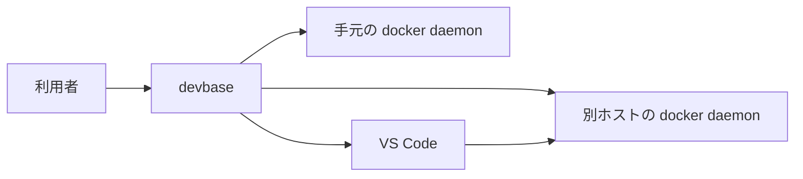
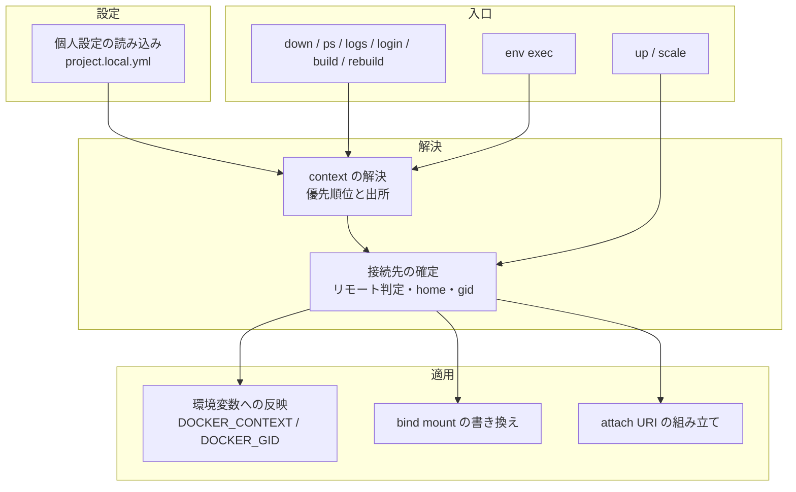
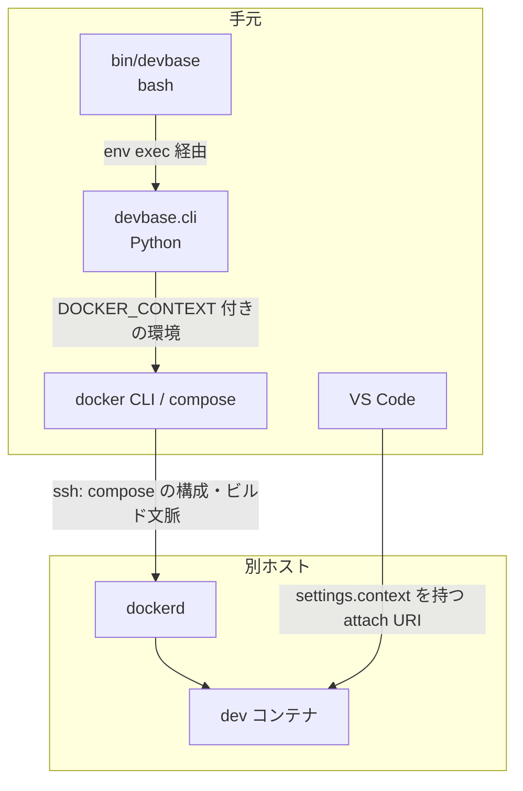
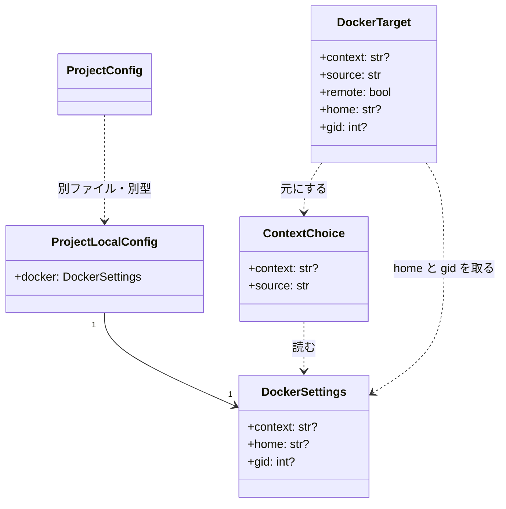
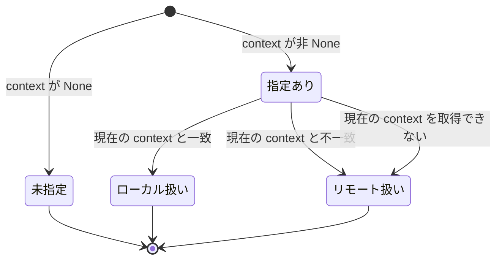
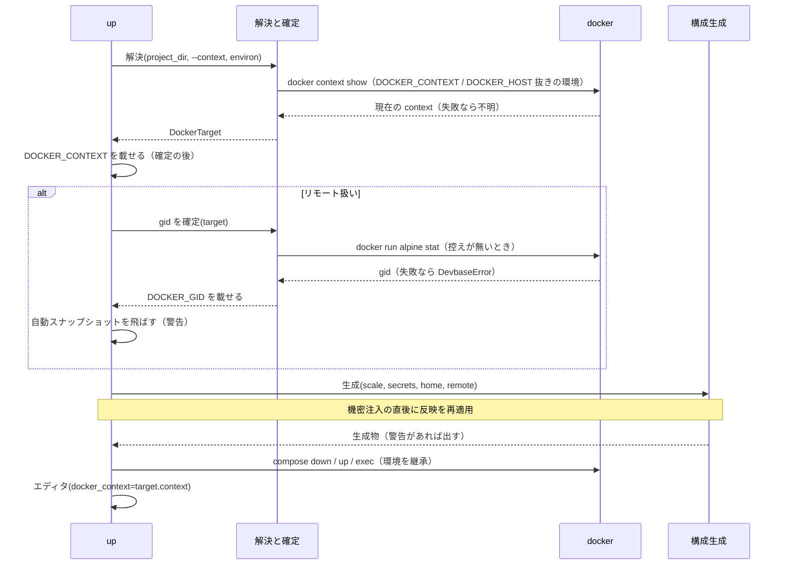
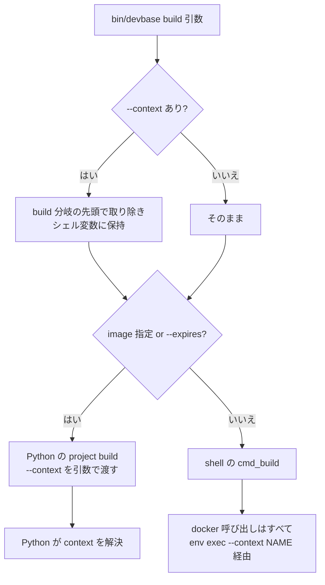

# PLAN52 設計: 構成要素とデータ構造と処理の流れ

この文書は「どう作るか」だけを扱う。

| 内容 | 文書 |
| --- | --- |
| 要求と受け入れ条件 | [PLAN52_remote-docker-context.md](PLAN52_remote-docker-context.md) |
| 決定の記録とテスト設計 | [PLAN52_remote-docker-context-decisions.md](PLAN52_remote-docker-context-decisions.md) |

## 機能一覧

| # | 機能 | 誰が使うか |
| --- | --- | --- |
| F1 | プロジェクトごとに接続先の docker context を個人設定に書く | 別ホストで dev コンテナを動かす利用者 |
| F2 | `devbase up / down / ps / logs / login / scale / build / rebuild` が設定した context の daemon を相手に動く | 同上 |
| F3 | 一時的に別の context へ向ける（CLI / 環境変数） | 同上 |
| F4 | リモート側の docker グループ gid を自動で決める | 同上（`docker.gid` を書かずに済ませたい人） |
| F5 | bind mount の `~` をリモート側の HOME で展開する | `~/.aws` 等を mount するプロジェクトの利用者 |
| F6 | `devbase up` が開く VS Code がリモートのコンテナへ attach する | 同上 |
| F7 | Remote-SSH 統合端末から、手元で直接 attach する URI も受け取る | Windows VS Code → Mac → WSL の一周を避けたい人 |

## 構成要素

### 文脈



変えられないものは次の 3 つである。

| 外部の系 | 変えられない振る舞い |
| --- | --- |
| docker CLI | context の解決順（`DOCKER_CONTEXT` → `docker context use` → 既定） |
| compose クライアント | bind mount の `~` を手元の HOME へ展開する |
| VS Code Dev Containers 拡張 | attach URI の `settings.context` を attach 先の context 名として読む |

### 構成要素図



| 要素 | 責務 |
| --- | --- |
| 個人設定の読み込み | `project.local.yml` を読み、`docker` 節を検証して `DockerSettings` にする。無い・空なら既定値 |
| context の解決 | CLI / env / ファイル / 未指定の順で 1 つに決め、出所を添える。**docker を呼ばない純粋な処理** |
| 接続先の確定 | 解決した context と現在の context を比べてリモート扱いを決め、`home` / `gid` を添える。現在の context は `docker context show` で 1 回だけ問い合わせる。**問い合わせは `DOCKER_CONTEXT` と `DOCKER_HOST` の両方を取り除いた環境で実行する**（`DOCKER_CONTEXT` が残ると設定先自身が返って常にローカル扱いになり、`DOCKER_HOST` が残ると `default` が返って常にリモート扱いになる。実測: `DOCKER_HOST=tcp://127.0.0.1:1 docker context show` → `default`） |
| 環境変数への反映 | `DOCKER_CONTEXT` を `os.environ` へ載せ、`DOCKER_HOST` があれば警告して取り除く（docker は `DOCKER_HOST` を `DOCKER_CONTEXT` より優先するため）。リモート扱いの up / scale では `DOCKER_GID` も載せる（gid が無ければリモートで取得し `.cache/` に控える）。**接続先の確定より後に行い、冪等にして機密注入の後に再適用する** |
| bind mount の書き換え | 生成物の各サービスの bind mount で `~` を `home` に置き換え、置き換えられないものを警告に集める |
| attach URI の組み立て | 解決した context を `settings.context` に載せる。既存の `ssh_host` との組み合わせを保つ |
| up / scale | 接続先を確定する。`up` は反映・書き換え・URI のすべてを使い、`scale` はエディタを開かないため反映と書き換えだけを使う |
| down / ps / logs / login / build / rebuild | context だけを解決して反映する（gid・home は使わない） |
| env exec | shell の `cmd_build` から呼ばれる。context だけを解決して子プロセスへ載せる |

### 配置



境界をまたぐもの: docker CLI が ssh で送るのは compose の構成（変数展開済み。機密は
**環境変数の値として展開された結果**が含まれる）とビルド文脈（`containers/`）。
`project.local.yml`・`env`・`.env`・age の鍵は手元に留まる。

### パッケージ・モジュール構成

```text
bin/devbase                          (変更: cmd_build の docker 直接呼び出しを env exec 経由へ、--context の受け取り)
lib/devbase/
├── cli.py                           (変更: --context を lifecycle サブコマンドへ追加)
├── project/
│   ├── config.py                    (変更: project.yml の docker: を案内付きで拒否)
│   └── local_config.py              (新設: project.local.yml の読み込みと検証)
├── utils/
│   └── docker_context.py            (新設: context の解決・接続先の確定・環境変数への反映・gid 取得)
├── volume/
│   ├── bind_mounts.py               (新設: ~ の展開と警告の収集)
│   └── compose.py                   (変更: 生成時に bind_mounts を呼ぶ)
├── commands/
│   ├── container.py                 (変更: 各 cmd で解決と反映、自動スナップショットの回避)
│   └── env.py                       (変更: env exec で context を子プロセスへ)
└── editor/
    └── opener.py                    (変更: docker_context の解決順とフラット URI の提示)
docs/user/
├── project-yml.md                   (変更: project.local.yml の節)
├── environment-variables.md         (変更: 「跨ホスト」→「リモート Docker」)
└── cli-reference/02-project.md      (変更: --context)
tests/
├── project/test_local_config.py     (新設)
├── utils/test_docker_context.py     (新設)
├── volume/test_bind_mounts.py       (新設)
├── commands/test_container_context.py (新設)
├── cli/test_wrapper_build_context.py  (新設)
└── editor/test_opener.py            (変更)
```

## 構造



| 型 | 責務 |
| --- | --- |
| `DockerSettings` | `project.local.yml` の `docker` 節 1 つ分。すべて省略可 |
| `ProjectLocalConfig` | `project.local.yml` 1 ファイル分。いまは `docker` だけを持つ。将来 `scale` 等を足す器 |
| `ContextChoice` | 優先順位で決めた context と出所（`cli` / `env` / `file` / `default` の 4 値）。docker を呼ばずに決まる |
| `DockerTarget` | 接続先の確定結果。`remote` が偽なら `home` / `gid` は `None` |

`ProjectConfig`（既存）は変えない。`project.local.yml` を `project.yml` へ深くマージする
形は採らない（決定 2）。

### 状態: リモート扱いの判定



`home` / `gid` が `DockerTarget` に載る条件は 2 つある。リモート扱いであること、そして
**CLI / env で上書きされた context がファイルの `docker.context` と一致すること**（前提 4）
である。不一致なら両方 `None` にし、警告を 1 行出す。

## データ構造

永続化するのは 2 つで、どちらも Git 管理外である。

### `projects/<name>/project.local.yml`

```yaml
docker:
  context: gpu-wsl      # 任意。docker context ls の名前
  home: /home/takemi    # 任意。リモート側の HOME（絶対パス）
  gid: 999              # 任意。リモート側の docker グループ gid
```

| キー | 型 | 必須 | 検証 |
| --- | --- | --- | --- |
| `docker` | マッピング | いいえ | 未知キーは `ConfigError` |
| `docker.context` | 文字列 | いいえ | 空・空白・制御文字を含むものは `ConfigError` |
| `docker.home` | 文字列 | いいえ | `/` で始まらないものは `ConfigError` |
| `docker.gid` | 整数 | いいえ | 真偽値・負数・非整数は `ConfigError` |

最上位に `docker` 以外のキーがあれば `ConfigError`。空ファイル（`None`）は「無い」と同じ。
`project.yml` 側は `_TOP_LEVEL_KEYS` を変えず、`docker` があったときだけ
「`project.local.yml` へ移す」案内を含むメッセージにする。

### `$DEVBASE_ROOT/.cache/docker-gid/<context>`

| 項目 | 内容 |
| --- | --- |
| 中身 | 10 進の gid 1 行 |
| 作る時 | リモート扱いの up / scale で `docker.gid` が無く、取得に成功したとき |
| 読む時 | 同じ条件で、ファイルがあり整数として読めるとき |
| 消す時 | 自動では消さない。リモート側の gid が変わったら利用者が消すか `docker.gid` を書く |
| ファイル名 | context 名をそのまま使う。context 名は docker が `/` を許さないため経路を壊さない |

上書きして過去を失う構造だが、控えるのは再取得できる値であり履歴に意味が無い（決定 6）。

## 入出力の契約

### 設定ファイル

上の「データ構造」が契約である。読み込みの入口は
`load_project_local_config(project_dir) -> ProjectLocalConfig`。ファイルが無ければ
既定値（`docker` の 3 項目とも `None`）を返し、例外にしない。

### CLI `--context`

| 項目 | 内容 |
| --- | --- |
| 名前 | `--context NAME` |
| 付く場所 | `project` / `container` 配下の `up` / `down` / `ps` / `logs` / `login` / `scale` / `build` / `rebuild`。トップレベルはショートカットが既にある `up` / `down` / `ps` / `login` / `scale` / `build` / `rebuild` だけ（`logs` のショートカットは無く、新設しない） |
| 入力 | context 名（文字列）。空文字は `argparse` の型検査で拒む |
| 出力 | 無し。解決結果は `up` の冒頭の info 1 行に出る |
| 失敗の形 | 名前が存在しなければ docker CLI が非ゼロで止まり、devbase はその終了コードを返す |
| 互換性 | 既存の引数は変えない。`build` の shell 経路では `bin/devbase` の `build)` 分岐が、`_build_image` の走査より**前**に `--context NAME` / `--context=NAME` を取り除いてシェル変数に保持し、docker を叩く `env exec` へ `--context NAME` として**引数で**渡す（後にすると `NAME` が単体イメージ名として拾われ、Python の単体ビルドへ誤分岐する。環境変数に写すと Python 側の機密注入が `.env` の同名キーで上書きする） |

### 環境変数

| 名前 | 向き | 意味 |
| --- | --- | --- |
| `DEVBASE_DOCKER_CONTEXT` | 入力 | env / `.env` / shell からの上書き。空文字は未指定。**出力としては載せない**（`bin/devbase` が `env` を読み直すと上書きされるため、子プロセスへ渡す手段にならない） |
| `DOCKER_CONTEXT` | 出力 | 解決した context。docker CLI と compose が読む。未指定なら載せない |
| `DOCKER_HOST` | 入力 | 解決した context が非 `None` のときは警告して `os.environ` から取り除く（残すと docker がこちらを優先し、context が効かない）。`None` なら触らない |
| `DOCKER_GID` | 出力 | リモート扱いの up / scale だけ上書き。他は `bin/devbase` の値のまま |
| `DEVBASE_EDITOR_DOCKER_CONTEXT` | 入力 | 既存。attach URI の `settings.context` を明示したいときだけ。解決した context より優先 |

`up` から `bin/devbase build` を起動する経路（`_run_build`）は、解決した context を
**`--context <name>` として引数で渡す**。`bin/devbase` は起動時に root の `env` と
プロジェクトの `env` を読み直すため、環境変数で渡した値はそこで `env` の
`DEVBASE_DOCKER_CONTEXT` に戻される。引数なら `build)` 分岐がその後で写すので勝つ
（決定 10）。

### `env exec`

`devbase env exec [--context NAME] -- CMD` は、カレントディレクトリをプロジェクトとして
`ContextChoice` を解決する（`--context` があればそれが CLI 由来として最優先）。
`DOCKER_CONTEXT` を子プロセスの環境へ載せる（`child_env()` が機密を載せた**後**の辞書へ
適用し、`.env` の同名キーに負けない）。gid・home・リモート判定は行わない
（docker を呼ばない）。`--context` を引数で受けるのは、`cli.main()` が dispatch の前に
機密を `os.environ` へ注入し、`.env` に `DEVBASE_DOCKER_CONTEXT` があると環境変数で渡した
値が上書きされるためである。

### bind mount の書き換え

入力: 生成物の `services` と `home`。出力: 書き換えた `services` と警告の一覧。

| bind mount の書き方 | `home` あり | `home` なし（リモート扱い） |
| --- | --- | --- |
| `~/x:/t`、`~:/t`、`{source: ~/x}` | `home/x` へ置き換え | 警告に載せる |
| `~user/x:/t` | 置き換えず警告に載せる | 警告に載せる |
| `./x:/t`、`../x:/t` | 置き換えず警告に載せる | 警告に載せる |
| `/abs:/t`、named volume、`{type: volume}` | 触らない | 触らない |

警告は 1 回にまとめ、mount の一覧と `docker.home` の書き方を添える。

### attach URI

`open_editor(..., docker_context: str | None)` を足す。`settings.context` の決め方:

| `DEVBASE_EDITOR_DOCKER_CONTEXT` | `docker_context` 引数 | `ssh_host` | `settings.context` |
| --- | --- | --- | --- |
| 明示（非空） | 任意 | 任意 | 明示の値 |
| 明示（空文字） | 任意 | 任意 | 付けない |
| 無し | 非 None | 任意 | 引数の値 |
| 無し | None | あり | `docker context show`（従来） |
| 無し | None | 無し | 付けない（従来） |

`ssh_host` と `settings.context` の両方が付くとき、同じペイロードで `@ssh-remote+` を
付けないフラット URI を info で 1 行添える。

## 処理の流れ

### `devbase up`



失敗の経路:

| どこで | 何が起きる | 結果 |
| --- | --- | --- |
| `project.local.yml` の検証 | `ConfigError` | `up` は `project.yml` を読む前に非ゼロで終了。コンテナに触らない |
| gid の取得 | docker が非ゼロ、または出力が整数でない | `DevbaseError`。docker の stderr と `docker.gid` の書き方を出して非ゼロ。既存コンテナは止めない（構成生成より前） |
| context が存在しない | 最初に daemon へ届く docker 呼び出し（`docker context show` は成功する。リモート扱いなら gid の `docker run`、そうでなければ `volume inspect`）で失敗 | docker のメッセージ（`context "x" does not exist`）を含めて非ゼロ |

解決と反映は `_ensure_env_files` より前、`project.yml` の読み込みの直後に置く。
`pre-up` フックも `DOCKER_CONTEXT` を継承する。

**反映は 1 回では足りない。** `_inject_secrets()`（`runtime.inject`）は機密ストアの値を
`os.environ` へ無条件に上書きするため、`.env` に `DOCKER_CONTEXT` / `DOCKER_GID` /
`DOCKER_HOST` があると、確定した接続先が途中で戻る。`cmd_up` は構成生成の中で
`_inject_secrets(required=True)` を呼び、その後に `compose down / up` を実行する。そのため
反映は**冪等な関数**にし、`_inject_secrets()` の直後に**必ず再適用する**。責務の置き方は
次のとおり。

| 要素 | 責務 |
| --- | --- |
| `utils/docker_context.apply(target, environ)` | 反映する。同時に「いま有効な接続先」をモジュール変数に控え、最初の適用時に `DOCKER_CONTEXT` / `DOCKER_GID` / `DOCKER_HOST` の元の値も控える。冪等 |
| `utils/docker_context.reapply(environ)` | 控えた接続先があれば `apply` を呼び直す。無ければ何もしない |
| `utils/docker_context.reset(environ)` | 控えた接続先を捨て、3 変数を元の値へ戻す（元々無かったものは消す）。控えが無ければ何もしない |
| `commands/container._dispatch_lifecycle()` | handler を呼ぶ**前**と、`finally` で**後**に `reset()` を呼ぶ。1 プロセスで複数の lifecycle 操作を行う TUI で、前の操作の接続先が次へ漏れないようにする |
| `commands/container._inject_secrets()` | 機密を注入した**直後に自分で** `reapply()` を呼ぶ。呼び出し側は何もしない |
| `commands/env.cmd_env_exec()` | `child_env()` が返した辞書へ `apply(choice, env)` を直接当てる（モジュール変数は使わない） |

`_inject_secrets` は引数を取らない共通関数で、container.py の全 lifecycle コマンドが通る。
確定した接続先を引数で配り直すより、`docker_context` 側が控えを持ち `_inject_secrets` が
それを呼ぶ方が、呼び出し側を変えずに漏れを塞げる。モジュール変数を持つのはこの 1 つだけで、
`_dispatch_lifecycle` の前後とテストの `setUp` で `reset()` を通す。TUI（`tui/dispatch.py`）は
同じプロセスで `project up A` → `project down B` を続けて呼ぶため、A の控えが残ると B の
解決結果が `None`（環境を触らない）でも `_inject_secrets` → `reapply()` が A の接続先を
復活させる。`reset()` が元の値へ戻すので、B は利用者のシェルの環境だけを見て動く。

### 他のコマンド

`_dispatch_lifecycle` は、`name` で対象プロジェクトへ切り替えた（`_resolve_project_name`）
**直後に `_inject_secrets(required=False)` を呼び、対象プロジェクトの機密で `os.environ` を
作り直してから** `ContextChoice` を解決する。`cli.main()` は dispatch の前に**現在地**の機密を
注入しており、`_resolve_project_name` は非機密の `env` のキーしか入れ替えない。そのため
プロジェクト A から `project down B` を実行すると、A の `.env` の `DEVBASE_DOCKER_CONTEXT` が
残ったまま B の context を解決してしまう。`_inject_secrets` は注入前に `clear_injected` を
通すので、ここで呼び直せば A の値は消える（まだ接続先が無いので `reapply()` は何もしない）。

その後 `ContextChoice` を解決して handler へ渡す。`down` / `ps` / `logs` /
`login` / `build`（Python 経路）/ `rebuild` の handler はそれをそのまま `DOCKER_CONTEXT` に
載せる。`up` / `scale` の handler は**載せる前に** `DockerTarget` を確定する（上の
シーケンス図の順序）。`docker context show` を呼ぶのは `up` / `scale` だけである。
確定の問い合わせは `DOCKER_CONTEXT` と `DOCKER_HOST` を取り除いた環境で行うため、呼び出し側が
先に載せてしまっても判定は変わらない。

### shell の `build`



`--context` の抽出は `bin/devbase` の `build)` 分岐の**先頭**、`_build_image` / `--expires` の
走査より前に置く。走査の後に置くと `--context` の値が単体イメージ名として拾われ、
`project build <name>` へ誤分岐する。抽出した値は環境変数に写さず、`env exec` と
`project build` へ `--context NAME` として引数で渡す。`cmd_build` の `docker buildx build` と
`docker image inspect` を `compose_with_secrets`（= `env exec`）経由へ変える。関数名は役割に
合わせ `run_with_project_env` に改める。

## 非機能の実現方式

| 大項目 | 要求の条件 | 実現方式 | 確かめ方 |
| --- | --- | --- | --- |
| 性能・拡張性 | context 未指定（`None`）の `up` に新たな docker 呼び出しを足さない。context 指定ありの `up` で足すのは `docker context show` 1 回と、リモート扱いのときの gid 取得 1 回（初回のみ）まで | `docker context show` は context が非 None のときだけ呼ぶ。gid は `.cache/docker-gid/<context>` に控える | `subprocess.run` を差し替えた結合テストで呼び出し回数を数える |
| 運用・保守性 | 解決した context と出所を `up` の冒頭に 1 行出す。飛ばした処理と書き換えなかった mount は警告に残す | `ContextChoice.source` を info に含める。警告は `logger.warning` に集約 | ログをキャプチャする単体テスト |
| 移行性 | 設定を書くまで挙動が変わらない。消せば戻る | context が `None` のとき環境変数を一切触らない。書き換えは `home` が非 None のときだけ | 既存テストが書き換えなしで通る |
| セキュリティ | 接続先の実体・鍵・トークンを設定に持たない。鍵・設定ファイル・平文ファイルは手元に留まり、復号済みの機密の**値**は compose の変数展開を通じて接続先の daemon とコンテナへ渡る | 設定は context 名だけ。機密注入の経路（`_inject_secrets` → compose の変数展開）は変えず、ファイルを送る経路を足さない | 受け入れ条件「起きてはいけないこと」の grep と、生成物に値が書かれないことの既存テスト |
| システム環境 | 手元 macOS / Linux / WSL、リモート Linux dockerd + sshd | 手元側で bash と Python 3.10 以降のみを前提にする。リモート側に devbase を要求しない | ドキュメントの手順で実機確認 |

## 未確認のまま残ること

| 項目 | 内容 |
| --- | --- |
| buildx とリモート context | `DOCKER_CONTEXT` 付きの `docker buildx build --load` が、その context の docker ドライバでビルドされビルド文脈を送ることは docker の仕様だが、`docker buildx use` で別のビルダーを固定している環境では変わる。実機で確かめる |
| `pre-up` フックの build 文脈 | ローカルへ clone して build context にするフックがリモートで動くかは、この計画では確かめない（対象範囲外） |
| `settings.context` のローカル VS Code での解釈 | ssh 先経由での実機確認はあるが、手元の Dev Containers 拡張が非既定 context で attach する経路は実機で確かめる（リリース後テスト） |
| alpine のタグ | `alpine:3` を使う。リモートに無ければ pull が走る（初回のみ） |
