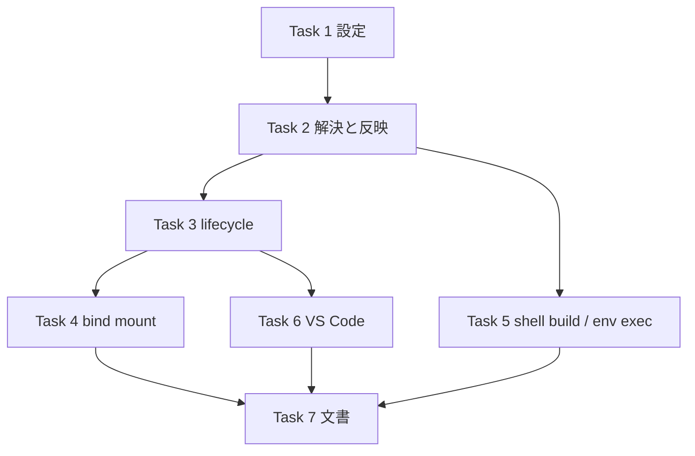

# PLAN52: 別ホストの Docker に dev コンテナを立ち上げ、VS Code もそこへ接続する

- 発端: [devbasex/devbase#162](https://github.com/devbasex/devbase/issues/162)（2026-09-13）
- ワークフローモード: `standard`
  - 根拠: 新しい設定ファイル `project.local.yml` と CLI フラグ `--context` を公開インタフェースへ
    追加する。`devbase up/down/ps/login/build` が相手にする Docker daemon の選び方（本番の
    振る舞い）が変わる。`bin/devbase`・`lib/devbase/commands/`・`project/`・`volume/`・
    `editor/` の複数モジュールにまたがり、対象には既存テストが十分にある。

## 目的

`projects/<name>/` に**個人・機材ごとの**設定を置くだけで、`devbase up` が別ホストの Docker
daemon に対して従来と同じ手順で動く状態を作る。手順とは volume・network・compose・フック・
イメージ確保を指す。`devbase up` が開く VS Code は、そのホスト上のコンテナへ attach する。

「compose クライアントは手元、daemon はリモート」の docker context 方式を採る。リモートへ
配布するものを増やさない。devbase 一式・`projects/`・機密鍵をリモートへ複製しない。

## 依頼（原文）

issue #162 の「背景・課題」と「想定用途」より引用する。

> `devbase up` は **コマンドを実行した環境 (Mac) の Docker** にしか dev コンテナを立てられない。設定で「このプロジェクトのコンテナは別ホストの Docker に立てる」と指定し、`devbase up` で立ち上がる VS Code もそのホスト上のコンテナへ接続できるようにしたい。
>
> | やりたいこと | 理由 |
> |---|---|
> | Windows / WSL 上にコンテナを立てたい | CUDA が使える GPU は Windows にしかない |
> | 3 台目の自宅 PC のコンテナを操作したい | 負荷分散 |
> | AWS EC2 に入れた Docker ホストのコンテナを操作したい | クラウド側の計算資源 |
>
> いずれも「操作は手元 (Windows VS Code / Mac の端末)、コンテナは別ホスト」で、接続方法は **Docker のリモート制御 (`docker context` / `DOCKER_HOST`) か SSH**。

issue には調査結果・提案内容・代替案 A〜E が付いている。提案内容は設定ファイル
`project.local.yml`、`docker.context` / `docker.home` / `docker.gid`、優先順位、VS Code の
出し分け、4 段階の分割である。**提案内容は依頼の一部として扱い**、この仕様はそれを受け入れ
条件へ落とす。提案から外れる判断は「利用者が決めたこと」または「前提」に書く。

## 利用者が決めたこと

issue #162 の提案として書かれているものを、この仕様の決定として扱う。

| 決めたこと | 内容 |
| --- | --- |
| 設定の置き場 | `projects/<name>/project.local.yml`（gitignore 対象）。`project.yml` には書かない |
| キー名 | `docker.context` / `docker.home` / `docker.gid`。`host` は `repos[].host` と紛らわしいので使わない |
| 接続先の実体 | 書かない。docker context の**名前**だけを書き、名前 → 接続先は各マシンの `docker context create` に委ねる |
| 優先順位 | CLI `--context` > env `DEVBASE_DOCKER_CONTEXT` > `project.local.yml` の `docker.context` > 現在の docker context |
| 伝え方 | 解決した context を `DOCKER_CONTEXT` 環境変数として全 `docker` / `docker compose` 呼び出しへ渡す |
| Windows 側の前提 | WSL2 内の dockerd + WSL 内の sshd。Docker Desktop の Windows 直結は前提にしない |
| 採らない案 | A（リモートで `devbase up`）/ B（`project.yml` に書く）/ C（env だけ）/ D（1 枚の個人設定）/ E（TCP+TLS 必須）。理由は issue の「代替案」 |

## 調査で確定した事実

| 確認事項 | 結果 | 根拠 |
| --- | --- | --- |
| `docker` / `docker compose` の呼び出し方 | すべて `subprocess` で CLI を叩く。daemon の選択は CLI の既定（現在の context）に委ねている | `grep -rn "subprocess.run\|Popen" lib/devbase` → `commands/container.py`（14）`utils/docker.py`（3）`volume/manager.py`（2）`snapshot/manager.py`（3）`editor/opener.py`（4）`editor/window_title.py`（1）`commands/status.py`（1）ほか |
| `DOCKER_CONTEXT` 環境変数の効き方 | docker CLI と compose v2 の両方が読む。`docker context use` の既定より優先する。**ただし `DOCKER_HOST` が設定されているときはそちらが勝ち、`DOCKER_CONTEXT` は無視される** | 実測: `DOCKER_HOST=tcp://127.0.0.1:1 DOCKER_CONTEXT=desktop-linux docker version` が `Cannot connect to the Docker daemon at tcp://127.0.0.1:1` で失敗（Docker 29.4.3）。Docker Docs「Docker contexts」、docker/cli #6151 |
| `DOCKER_GID` の決め方 | `bin/devbase:37` で `uname` が Darwin なら `0`、それ以外はローカルの `/etc/group`。Python 側には決める処理が無い | `bin/devbase:37`、`grep -rn DOCKER_GID lib tests` → 0 件 |
| `DOCKER_GID` の使われ方 | サンプルの全プロジェクトが `group_add: ["${DOCKER_GID}"]` と `/var/run/docker.sock` の bind を持つ | `projects/*/compose.yml`（18 件）、`docs/plugin-dev/compose-yml-guidelines.md:131` |
| bind mount の `~` を展開するのは誰か | compose クライアント（手元）。生成物 `.docker-compose.scale.yml` には `~/...` のまま残り、`docker compose up -f <生成物>` の時点で手元の HOME へ展開される | `lib/devbase/volume/compose.py:_load_compose_config`（YAML を直接読み、`docker compose config` を通さない）、`_build_dev_instance` が volumes を文字列のまま複製 |
| `~` を使う bind mount を持つプロジェクト | `~/devbase:/work/devbase`（`projects/devbase`）、`~/.aws:/home/ubuntu/.aws`（`projects/with-ai-dev`）。他 15 件はコメントアウト | `grep -n "^\s*- ~/" projects/*/compose.yml` |
| 起動時に `-f` で渡す構成 | 生成物 `.docker-compose.scale.yml` **のみ**。元の `compose.yml` は渡さない。よって生成物を書き換えれば全サービスの mount に効く | `commands/container.py:cmd_up` → `docker_compose_up(compose_file=override_file)` |
| `build` の経路 | `devbase build`（引数なし / `--no-cache`）は shell の `cmd_build` が `docker buildx build --load` と `docker image inspect` を**直接**叩き、project image は `compose_with_secrets docker compose build` を通す。`up` の自動ビルドは Python から `bash bin/devbase build` を起動する | `bin/devbase:cmd_build`、`commands/container.py:_run_build` |
| `devbase env exec` | 機密を子プロセスの環境変数へ載せて任意コマンドを実行する。shell の compose 呼び出しはすべてここを通る | `commands/env.py:cmd_env_exec`、`bin/devbase:compose_with_secrets` |
| スナップショットの仕組み | `docker run -v <手元のディレクトリ>:/backup` で tar を書く。**daemon が別ホストだと手元にファイルが残らない** | `snapshot/manager.py:_run_docker_tar` |
| `devbase up` / `down` とスナップショット | `up` の前に `_auto_snapshot()`、`down` の後に `rotate()` が走る | `commands/container.py:cmd_up` / `cmd_down` |
| VS Code の attach URI | `build_attach_uri` が `settings.context` を埋められる。ただし `docker_context` を解決するのは `ssh_host` があるときだけ（`resolve_docker_context(env) if ssh_host else None`） | `editor/opener.py:683` |
| `settings.context` の実機確認 | Windows VS Code → Remote-SSH(Mac) → Mac の docker context で attach できている（VS Code 1.124 / Dev Containers 0.459） | `editor/opener.py` モジュール docstring、`docs/user/environment-variables.md` 「跨ホスト」 |
| `project.yml` の読み込み | `load_project_config` が 1 ファイルを読み、未知キーは `ConfigError`。ローカル上書きの仕組みは無い | `project/config.py:load_project_config` / `_reject_unknown_keys` |
| `projects/*` の実体 | devbase-samples / devbase-ext への symlink。`projects/*` は devbase 本体の `.gitignore` 済み | `ls -la projects`、`.gitignore` |
| `.cache/` | `$DEVBASE_ROOT/.cache/pulls/` を pull の目印に使っている。`.gitignore` 済み | `commands/container.py:_pull_marker_path`、`.gitignore` |
| 対象領域のテスト | 十分にある | `tests/project/test_config.py`、`tests/volume/test_compose*.py`、`tests/editor/test_opener.py`、`tests/commands/test_container_up_order.py`、`tests/cli/test_wrapper_*.py` |
| `devbase status` | `docker ps` で全プロジェクトのコンテナを列挙する。プロジェクトごとに daemon が違う構成は想定していない | `commands/status.py:37` |
| `devbase snapshot` の対象 | アカウントグループのボリューム（プロジェクト単位ではない）。`rotate` は手元のディレクトリ削除だけで docker を呼ばない | `snapshot/manager.py:__init__` / `rotate` |

## 前提

- 前提 1: **リモートには docker CLI + dockerd + sshd だけがあればよい。** devbase・`projects/`・
  機密鍵をリモートへ置かない。（成否の判定: 受け入れ条件のどれも、リモート側に devbase の
  ファイルがあることを要求しない）
- 前提 2: **既定の挙動は変えない。** `project.local.yml` も `--context` も
  `DEVBASE_DOCKER_CONTEXT` も無いとき、`docker` / `docker compose` に `DOCKER_CONTEXT` を
  付けない。`DOCKER_GID` も生成物の mount も従来と同じになる。（成否の判定: 既存テストが
  1 件も書き換えなしで通り、`DOCKER_CONTEXT` を設定する箇所が「解決した context が
  `None` でないとき」だけであること）
- 前提 3: **`docker context use` で現在の context 自体をリモートへ向けた状態は扱わない。**
  その状態は今日でも動く／動かないが決まっており、この変更は「解決した context が現在の
  context と異なるとき」だけをリモート扱いにする。（成否の判定: 解決した context が
  `None` のとき gid 解決・`~` 展開・スナップショットの扱いが変わらないこと）
- 前提 4: **`docker.home` / `docker.gid` は `docker.context` と同じホストの値である。**
  CLI / env で context を `project.local.yml` の `docker.context` と**別の名前**へ上書きした
  ときは、ファイルの `home` / `gid` を使わず、その旨を警告する。機材依存の値を別の機材へ
  持ち込まないため。（成否の判定: 上書き時の警告と、`~` が展開されないこと）
- 前提 5: **リモート扱いのとき `up` の自動スナップショットは作らない。** 手元のディレクトリを
  bind mount する現在の仕組みでは別ホストの daemon からファイルが届かず、控えたい
  ボリューム自体もリモートにあるため、警告を出して飛ばす。`devbase snapshot` の明示操作と
  `down` のローテーション（手元のファイル整理のみ）は従来どおり手元を対象にし、context を
  解決しない。リモートのボリュームを手元へ運ぶ仕組みは別の課題にする。
  （成否の判定: リモート扱いの `up` が snapshots ディレクトリを変えず、`snapshot` 系の
  コマンドに context 解決が入らないこと）
- 前提 6: **`devbase status` は従来どおり手元の daemon だけを見る。** プロジェクトごとに
  daemon が違う構成での集約表示は扱わない。（成否の判定: `status.py` に context 解決を
  入れないこと）
- 前提 7: **`DOCKER_HOST` を直接指定する運用は扱わない。** 接続先は docker context の名前で
  表し、`DOCKER_HOST` を使いたい場合は `docker context create --docker host=...` で名前を
  付けてから指定する。docker は `DOCKER_HOST` があると `DOCKER_CONTEXT` を無視するため、
  context を解決したときは `DOCKER_HOST` を子プロセスから外す。（成否の判定: 新しい設定・
  フラグ・env のどれも `DOCKER_HOST` を受け取らず、context 解決時に `DOCKER_HOST` が子プロセス
  へ渡らないこと）
- 前提 8: **イメージはホストごとに別物である。** リモート扱いの `up` はリモート側の
  イメージを見て、無ければリモート側でビルドする。手元のイメージをリモートへ転送しない。
  （成否の判定: `_ensure_images` と `build` が `DOCKER_CONTEXT` 付きで動き、`docker save`
  / `load` を呼ばないこと）

## 対象範囲

含む:

- `projects/<name>/project.local.yml` の読み込み（`project.yml` の後に読み、`docker` 節だけを
  受け付ける）と検証
- context の解決（CLI `--context` / env `DEVBASE_DOCKER_CONTEXT` / `docker.context` / 未指定）
- 解決結果の `DOCKER_CONTEXT` としての伝播。届く先は Python 経由の全 docker 呼び出し、shell の
  `cmd_build`、`up` からの自動ビルド、`devbase env exec` の 4 つ
- `DOCKER_GID` のリモート側での解決（`docker.gid` 明示 → 無ければリモートで 1 回取得して
  `.cache/` に控える）
- 生成物 `.docker-compose.scale.yml` の bind mount の `~` を `docker.home` で展開する。
  `docker.home` 未指定のリモート扱いでは、`~` と相対パスの bind mount を列挙して警告する
- `devbase up / down / ps / logs / login / scale / build / rebuild` が同じ context 解決を通る
- リモート扱いでの `up` の自動スナップショットの回避（前提 5）
- VS Code の attach URI に、解決した context を `settings.context` として**ローカル端末でも**
  付ける。Remote-SSH 統合端末では既存のネスト URI に `settings.context` を組み合わせる。
  ネスト URI を出すときは、手元の VS Code に同名の context がある場合に直接 attach できる
  フラット URI も添えて提示する
- ドキュメント。書く先と内容は次の 4 つ

  | 文書 | 内容 |
  | --- | --- |
  | `docs/user/project-yml.md` | `project.local.yml` の節 |
  | `docs/user/environment-variables.md` | 「跨ホスト」を「リモート Docker」として再構成 |
  | 同上 | WSL / EC2 の `docker context create` 手順 |
  | `docs/user/cli-reference/02-project.md` | `--context` |

- devbase-samples の `.gitignore` へ `project.local.yml` を足す（別リポジトリなので、
  この計画では**起票**にとどめる）

含まない:

- リモート扱いでのスナップショットの作成・復元（前提 5。別課題として起票する）
- `devbase status` の複数 daemon 集約（前提 6）
- `DOCKER_HOST` の直接指定（前提 7）
- イメージの手元 → リモート転送（前提 8）
- `project.local.yml` での `scale` / `open_editor` の個人上書き（issue が初期スコープ外と
  している）
- Docker Desktop for Windows への直結（WSL2 内 dockerd を前提にする）
- CUDA / `--gpus` の設定（該当プロジェクトの `compose.yml` の話）
- ssh 鍵・TLS 証明書の配布、context の作成そのもの（docker 側の手順として文書に書くだけ）
- `pre-up` / `deploy` フックがローカルパスへ clone して build context にする用途の動作保証
  （buildx が context を送るため動く可能性はあるが、この計画では確かめない）

## 受け入れ条件

### 設定の読み込み

- [ ] `projects/<name>/project.local.yml` が無いとき、`devbase up` の振る舞いは従来と同じで、
      `docker` / `docker compose` の子プロセスの環境に `DOCKER_CONTEXT` が載らない
- [ ] `project.local.yml` に `docker: {context: gpu-wsl}` を書くと、`devbase up` が起動する
      すべての `docker` / `docker compose` 子プロセスに `DOCKER_CONTEXT=gpu-wsl` が載る
- [ ] `project.local.yml` の最上位に `docker` 以外のキー（例 `scale`）があると、使えるキーを
      添えた `ConfigError` になり、コンテナは起動しない
- [ ] `project.local.yml` の `docker` に `context` / `home` / `gid` 以外のキーがあると、使える
      キーを添えた `ConfigError` になる
- [ ] `docker.context` が空文字・非文字列・空白を含む値のときは `ConfigError` になる
- [ ] `docker.gid` が負の整数・真偽値・文字列のときは `ConfigError` になる
- [ ] `docker.home` が `/` で始まらない値のときは `ConfigError` になる（リモート側の絶対パス
      だけを受け付ける）
- [ ] `project.yml` の最上位に `docker:` を書くと、`project.local.yml` へ移すよう案内する
      `ConfigError` になる
- [ ] `project.local.yml` が YAML として壊れているとき、ファイル名を含む `ConfigError` になる
- [ ] `project.local.yml` が空ファイルのときはエラーにならず、無いときと同じに扱う

### context の優先順位

- [ ] `project.local.yml` に `docker.context: a`、env `DEVBASE_DOCKER_CONTEXT=b`、
      CLI `--context c` があるとき、子プロセスへ載る `DOCKER_CONTEXT` は `c`
- [ ] 同じ状態で CLI 指定が無ければ `b`、env も無ければ `a`
- [ ] env `DEVBASE_DOCKER_CONTEXT` に空文字を設定すると「未指定」として扱い、
      `project.local.yml` の値へ落ちる
- [ ] `--context` は `project` / `container` 配下の `up` / `down` / `ps` / `logs` / `login` /
      `scale` / `build` / `rebuild` と、トップレベルにショートカットがある `up` / `down` /
      `ps` / `login` / `scale` / `build` / `rebuild` が受け付ける（`logs` にトップレベルの
      ショートカットは無く、新設もしない）
- [ ] 解決した context が非 `None` で、実行時の環境に `DOCKER_HOST` があるとき、devbase は
      `DOCKER_HOST` を子プロセスへ渡さず、その旨を警告する（渡すと docker が `DOCKER_CONTEXT`
      を無視して `DOCKER_HOST` へ接続するため）。解決した context が `None` なら `DOCKER_HOST`
      はそのまま渡り、従来どおり動く
- [ ] 解決した context が `docker context ls` に無い名前のとき、`devbase up` はコンテナを
      起動せずに非ゼロで終了する。表示は docker CLI のエラー（`context "x" does not exist`）
      である。devbase 側で名前の存在を先に検証しない（docker の判定に委ねる）

### `DOCKER_GID`

- [ ] ローカル扱いのとき、compose に渡る `DOCKER_GID` は `bin/devbase` が決めた値のまま変わらない
- [ ] リモート扱いで `docker.gid: 999` があるとき、compose に渡る `DOCKER_GID` は `999`
- [ ] リモート扱いで `docker.gid` が無いとき、リモートで取得した gid が `DOCKER_GID` として
      compose に渡る。取得は `DOCKER_CONTEXT` 付きの
      `docker run --rm -v /var/run/docker.sock:/s <小さな公開イメージ> stat -c %g /s` 相当で行う
- [ ] 取得した値は `$DEVBASE_ROOT/.cache/docker-gid/<context>` に残り、2 回目の `up` は
      `docker run` を起動せずにその値を使う
- [ ] 取得に失敗した（docker が非ゼロ・出力が整数でない）とき、`up` は理由と
      `docker.gid` の書き方を示して非ゼロで終了し、コンテナを起動しない
- [ ] 取得した gid が `0` のとき、`up` は続行するが、socket が root 所有か rootless の可能性と
      `docker.gid` の書き方を警告に出す

### bind mount の `~`

- [ ] リモート扱いで `docker.home: /home/takemi` があるとき、`compose.yml` の
      `~/.aws:/home/ubuntu/.aws` は生成物で `/home/takemi/.aws:/home/ubuntu/.aws` になる
- [ ] `~` 単独（`~:/x`）と長い書式（`source: ~/.aws`）も同じ規則で展開される
- [ ] `~user/...` のような他ユーザ指定の `~` は書き換えず、警告に載せる
- [ ] ローカル扱いでは `docker.home` があっても `~` を書き換えない（従来どおり compose の展開に
      委ねる）
- [ ] リモート扱いで `docker.home` が無く、`~` で始まる bind mount が 1 つ以上あるとき、
      該当する mount の一覧と `docker.home` の書き方を警告として出す。`up` は続行する
- [ ] リモート扱いで `./` または `../` で始まる bind mount があるとき、該当する mount を
      「リモートには無いパス」として警告する。書き換えはしない
- [ ] `/var/run/docker.sock` のような絶対パスの bind mount と named volume は書き換えず、
      警告にも載せない

### 各コマンド

- [ ] リモート扱いの `devbase down` / `ps` / `logs` / `login` が、`up` と同じ `DOCKER_CONTEXT` を
      子プロセスへ載せる（`.docker-compose.scale.yml` の有無によらない）
- [ ] リモート扱いの `devbase scale N` は、`up` と同じく `DOCKER_CONTEXT` と `DOCKER_GID` を
      載せ、bind mount を書き換えた生成物で新しいインスタンスを起動する
- [ ] リモート扱いの `devbase build`（shell 経路）で、`docker buildx build` /
      `docker image inspect` / `docker compose build` のすべてが `DOCKER_CONTEXT` 付きで動く
- [ ] リモート扱いの `devbase up` からの自動ビルド（`_run_build` → `bin/devbase build`）も
      `DOCKER_CONTEXT` 付きで動く。プロジェクトの `env` または `.env` に
      `DEVBASE_DOCKER_CONTEXT=a` があり `up --context b` で起動した場合も、自動ビルドは `b` に
      対して行われる
- [ ] `devbase env exec [--context NAME] -- CMD` は、カレントプロジェクトの解決した context を
      子プロセスの `DOCKER_CONTEXT` へ載せる。解決結果が `None` なら載せない。`--context` を
      付けたときは、`env` / `.env` に `DEVBASE_DOCKER_CONTEXT` があってもその値が勝つ
- [ ] リモート扱いの `devbase up` は自動スナップショットを作らず、その旨を 1 行の警告で出す
- [ ] `devbase snapshot` 系のコマンドと `down` のローテーションは、`project.local.yml` の
      有無で呼び出す docker コマンドも対象ディレクトリも変わらない

### VS Code

- [ ] 前提: ローカル端末（SSH でない）、解決した context が `gpu-wsl`
      操作: `devbase up --open`
      結果: 起動する `code` の URI のペイロードが
      `{"containerName":"/<name>","settings":{"context":"gpu-wsl"}}` で、`@ssh-remote+` は付かない
- [ ] 前提: ローカル端末、解決した context が `None`
      操作: `devbase up --open`
      結果: ペイロードに `settings` が無い（従来どおり）
- [ ] 前提: Remote-SSH 統合端末（`ssh_host` が解決できる）、解決した context が `gpu-wsl`
      操作: `devbase up --open`
      結果: ネスト URI で、ペイロードの `settings.context` が `gpu-wsl`
- [ ] 前提: Remote-SSH 統合端末、解決した context が `None`
      操作: `devbase up --open`
      結果: 従来どおり `DEVBASE_EDITOR_DOCKER_CONTEXT` → `docker context show` の順で
      `settings.context` を決める（振る舞いが変わらない）
- [ ] `DEVBASE_EDITOR_DOCKER_CONTEXT` が明示されているときは、解決した context より
      そちらが `settings.context` に使われる
- [ ] ネスト URI を出すとき、同じペイロードのフラット URI を「手元の VS Code に同名の docker
      context があれば直接 attach できる」旨と共に info で提示する

### 起きてはいけないこと

- [ ] `project.local.yml` の有無で `project.yml` の検証結果が変わらない。`project.yml` 単体の
      既存テストが書き換えなしで通る
- [ ] 機密の値が `DOCKER_CONTEXT` の解決・警告・キャッシュファイルのどこにも現れない
- [ ] `.cache/docker-gid/` と `project.local.yml` が Git から除外される（devbase 本体は
      `.cache/` と `projects/*` で既に除外。devbase-samples 側は起票）
- [ ] `devbase status` の出力と呼び出す docker コマンドが変わらない
- [ ] 同じプロセス（TUI）で、`docker.context: a` を持つ A の `up` の後に設定の無い B の `down` を
      実行すると、B の子プロセスに `DOCKER_CONTEXT` は載らず、`DOCKER_GID` は元の値に戻っている
- [ ] プロジェクト A の `.env` に `DEVBASE_DOCKER_CONTEXT=a` があり、B の `project.local.yml` に
      `docker.context: b` があるとき、A のディレクトリから `devbase project down B` を実行すると
      子プロセスに届く `DOCKER_CONTEXT` は `b`
- [ ] 機密ストア（`.env`）に `DOCKER_CONTEXT` / `DOCKER_GID` / `DOCKER_HOST` があっても、
      `up` が起動する volume・compose・exec のすべての子プロセスに、解決した context と
      確定した gid が届き、`DOCKER_HOST` は届かない。`env exec` も同じ

## 非機能の条件

| 大項目 | 条件 |
| --- | --- |
| 性能・拡張性 | context 未指定（`None`）の `up` に新たな docker 呼び出しを足さない。context 指定ありの `up` で足すのは、現在の context を知るための `docker context show` 1 回と、リモート扱いのときの gid 取得の `docker run` 1 回（初回のみ）まで |
| 運用・保守性 | 解決した context と、その出所（CLI / env / ファイル / 未指定）を `up` の冒頭に info で 1 行出す。リモート扱いで飛ばした処理（スナップショット）と書き換えなかった mount は警告で残す |
| 移行性 | 設定を書くまで挙動が変わらない。`project.local.yml` を消せば元に戻る。データ移行は無い |
| セキュリティ | `project.local.yml` は接続先の実体（ホスト名・鍵・トークン）を持たない。機密の注入経路（`_inject_secrets` → compose の変数展開）は変えない。age の鍵・`.env`・`project.local.yml` は手元に留まるが、**復号済みの機密の値は従来のローカル構成と同じく compose の変数展開を通じて接続先の daemon とコンテナへ渡る**。接続先は機密を預けてよいホストに限る |
| システム環境 | 手元: macOS / Linux / WSL の bash + docker CLI（context 対応、19.03 以降）+ compose v2。リモート: Linux の rootful dockerd + sshd（docker.sock が docker グループ所有）。Windows は WSL2 内の dockerd。rootless Docker と socket が `root:root` の構成は gid の自動取得の対象外で、`docker.gid` を明示する |

## 影響

| 対象 | 影響 |
| --- | --- |
| 公開インタフェース | **増える**。設定ファイル `project.local.yml`（`docker.context` / `docker.home` / `docker.gid`）、CLI `--context`、env `DEVBASE_DOCKER_CONTEXT`。既存のフラグ・env・出力形式は変えない |
| データ | スキーマ変更は無い。`.cache/docker-gid/<context>` が増える |
| 既存の振る舞い | 設定が無ければ変わらない。`bin/devbase` の `cmd_build` は `docker` の直接呼び出しを Python の `env exec` 経由へ変える（機密注入の経路と同じ）。`editor/opener.py` は解決した context があるときだけ `settings.context` の付け方が広がる |

## 検証手段

| 項目 | 手段 |
| --- | --- |
| 起動 | `devbase up` / `devbase build` / `devbase down` |
| テスト | `uv run pytest`（`pyproject.toml` の `testpaths = ["tests"]`。着手時 1793 件） |
| 静的解析 | `ruff check --select=E9,F63,F7,F82 lib`、`shellcheck --severity=error bin/devbase`、`python -m compileall -q lib bin`（CI と同じ） |
| 手動確認 | 実機（Mac → WSL2 の dockerd）で `docker context create` → `project.local.yml` → `devbase up --open` を通し、VS Code がリモートのコンテナへ attach すること。リリース後テストで行う |

## 前提とする取り決め

| 項目 | 参照先 / 決めたこと |
| --- | --- |
| プロジェクト構造 | 設定の読み込みは `lib/devbase/project/`、context の解決と伝播は `lib/devbase/utils/` または `project/`、mount の書き換えは `lib/devbase/volume/compose.py`。`bin/devbase`（シェル側）には YAML の解釈を置かない |
| コーディング規約 | 既存コードに合わせる（日本語の docstring、`devbase.log.get_logger`、例外は `DevbaseError` 派生）。`CONTRIBUTING.md`（PEP 8、bash/zsh 両対応） |
| テスト戦略 | 設定の読み込み・優先順位・mount 書き換え・URI は単体テスト（`tests/project/` `tests/volume/` `tests/editor/`）。`DOCKER_CONTEXT` の伝播は `subprocess.run` を差し替えた結合テスト（`tests/commands/` `tests/cli/`）。実 daemon への接続は手動確認 |

## 境界

| 区分 | 内容 |
| --- | --- |
| 常に行う | 既存テストの実行、`ruff` / `shellcheck`、設定が無いときの挙動が変わらないことの確認 |
| 確認してから行う | `pyproject.toml` への依存追加、既存 env 名の変更、`bin/devbase` の引数解釈の変更 |
| 行わない | 依頼範囲外のリファクタリング、`status` の集約、スナップショットのリモート対応 |

## 用語

| 用語 | 意味 |
| --- | --- |
| docker context | docker CLI が daemon への接続先を名前で切り替える仕組み（`docker context ls` に出る名前） |
| 現在の context | `docker context show` が返す名前。`DOCKER_CONTEXT` が無いとき CLI が使うもの |
| 解決した context | 優先順位に従って devbase が決めた context 名。**未指定なら `None`**（= 従来どおり CLI に委ねる） |
| リモート扱い | 解決した context が `None` でなく、かつ現在の context と**異なる**状態。この状態で「ローカルの事情」に依存する処理（gid・`~`・スナップショット）の扱いが変わる |
| ローカル扱い | 上記以外。従来と同じ振る舞い |
| `project.local.yml` | `projects/<name>/` に置く個人・機材ごとの設定。git 管理しない |
| `docker.home` | リモート側の HOME。bind mount の `~` をこの値で展開する |
| `docker.gid` | リモート側の docker グループの gid。`group_add` に渡す |
| フラット URI | `vscode-remote://attached-container+<hex>/<path>` |
| ネスト URI | `vscode-remote://attached-container+<hex>@ssh-remote+<host>/<path>` |

## 未決

| 項目 | 誰が決めるか | 期限 |
| --- | --- | --- |
| devbase-samples の `.gitignore` 更新の起票先と担当 | 利用者 | 実装 PR のマージまで |

## 実装計画

設計は [PLAN52_remote-docker-context-design.md](PLAN52_remote-docker-context-design.md)、
決定とテスト設計は [PLAN52_remote-docker-context-decisions.md](PLAN52_remote-docker-context-decisions.md)
にある。ここではタスクの分解と順序だけを書く。**1 本の実装 Pull Request**（`feature/remote-docker-context`）で
進める。設計の要素は互いに呼び合う（反映・再適用・reset を全コマンドが通る）ため、分けると
中間状態のマージが動かない。

### 修正対象

| 区分 | ファイル |
| --- | --- |
| 新設 | `lib/devbase/project/local_config.py`、`lib/devbase/utils/docker_context.py`、`lib/devbase/volume/bind_mounts.py` |
| 変更 | `bin/devbase`、`lib/devbase/cli.py`、`lib/devbase/project/config.py`、`lib/devbase/volume/compose.py`、`lib/devbase/commands/container.py`、`lib/devbase/commands/env.py`、`lib/devbase/editor/opener.py` |
| 文書 | `docs/user/project-yml.md`、`docs/user/environment-variables.md`、`docs/user/cli-reference/02-project.md`、`docs/user/cli-reference/03-env.md`、`CHANGELOG.md` |
| テスト | `tests/project/test_local_config.py`、`tests/utils/test_docker_context.py`、`tests/volume/test_bind_mounts.py`、`tests/commands/test_container_context.py`、`tests/cli/test_wrapper_build_context.py`、既存の `tests/project/test_config.py`、`tests/editor/test_opener.py`、`tests/cli/test_secret_injection.py` |

### タスク分解

各タスクは失敗するテスト → 最小実装 → 整理の順で進める（`tdd-cycle`）。

#### Task 1: `project.local.yml` を読む

- 対象: `project/local_config.py`（新設）、`project/config.py`
- 内容: `DockerSettings` / `ProjectLocalConfig` と `load_project_local_config()`。無い・空は既定値、未知キー・型・値の検証は `ConfigError`。`project.yml` の `docker:` は移す案内付きで拒む
- 満たす条件: 「設定の読み込み」の 10 件、「起きてはいけないこと」の `project.yml` 単体の検証

#### Task 2: context を解決し反映する

- 対象: `utils/docker_context.py`（新設）
- 内容: `ContextChoice` / `DockerTarget`、`choose_context()`（CLI > env > ファイル > None）、`resolve_target()`（`docker context show` を `DOCKER_CONTEXT` / `DOCKER_HOST` 抜きの環境で 1 回、前提 4 の `home` / `gid` の扱い）、`apply()` / `reapply()` / `reset()`（`DOCKER_HOST` の除去と元の値の控え）、`ensure_remote_gid()`（`alpine:3` の `stat`、`.cache/docker-gid/<context>`、gid 0 の警告）
- 満たす条件: 「context の優先順位」の env / ファイル / CLI の並び、「`DOCKER_GID`」の 6 件、`DOCKER_HOST` の 1 件

#### Task 3: lifecycle コマンドに通す

- 対象: `commands/container.py`、`cli.py`
- 内容: `--context` を lifecycle の parser へ。`_dispatch_lifecycle` の開始時と `finally` で `reset()`、`_resolve_project_name` の直後に `_inject_secrets(required=False)`、`ContextChoice` の解決と `apply`。`_inject_secrets` の末尾で `reapply()`。`cmd_up` / `cmd_scale` は `resolve_target()` → `apply` → gid → 生成へ `home` / `remote` を渡す。`cmd_up` はリモート扱いで自動スナップショットを飛ばす。`_run_build` は `--context` を引数で渡す。`up` の冒頭に解決結果の info
- 満たす条件: 「各コマンド」の `down` / `ps` / `logs` / `login` / `scale` / 自動ビルド / 自動スナップショット、「起きてはいけないこと」の TUI・プロジェクト切替・機密ストアの 3 件、性能の条件

#### Task 4: bind mount の `~` を展開する

- 対象: `volume/bind_mounts.py`（新設）、`volume/compose.py`
- 内容: `expand_home()`（短い書式・`~` 単独・長い書式）と `collect_warnings()`（`~user`、相対パス、`home` 無し）。`generate_scaled_compose(..., docker_home=None, remote=False)` から呼ぶ
- 満たす条件: 「bind mount の `~`」の 7 件

#### Task 5: shell の `build` と `env exec`

- 対象: `bin/devbase`、`commands/env.py`、`cli.py`
- 内容: `build)` 分岐の先頭で `--context NAME` / `--context=NAME` を抜いてシェル変数へ。`compose_with_secrets` を `run_with_project_env` に改名し `env exec ${ctx:+--context "$ctx"} --` を経由。`cmd_build` の `docker buildx build` / `docker image inspect` をそこ経由に。Python 経路（image 指定 / `--expires`）へは `--context` を引数で渡す。`env exec` の parser に `--context`、`cmd_env_exec` は `child_env()` の後に `apply`
- 満たす条件: 「各コマンド」の shell `build` と `env exec`、「context の優先順位」の `--context` を受け付けるコマンド

#### Task 6: VS Code の attach URI

- 対象: `editor/opener.py`、`commands/container.py`
- 内容: `open_editor(docker_context=...)`、`resolve_docker_context(env, default=...)` の解決順、ネスト URI のときのフラット URI の info
- 満たす条件: 「VS Code」の 6 件

#### Task 7: 文書

- 対象: `docs/user/project-yml.md`、`docs/user/environment-variables.md`、`docs/user/cli-reference/02-project.md`、`03-env.md`、`CHANGELOG.md`
- 内容: `project.local.yml` の節、「跨ホスト」→「リモート Docker」、WSL / EC2 の `docker context create` 手順、`--context`、gid の控えの消し方、`DOCKER_HOST` の扱い
- 満たす条件: 対象範囲「ドキュメント」の 4 行。テスト駆動は適用しない（文書）

### 順序と依存

### リスクと対処

| リスク | 対処 |
| --- | --- |
| `commands/container.py` は 1555 行で、Task 3 が多くの関数に触る | 構造は保ち、タスクごとに既存テスト（1793 件）と新規テストを通す。実装後の `cross-refactoring` で責務の分割を検討する |
| `bin/devbase` の `build)` 分岐は引数の走査が入り組んでいる | `tests/cli/test_wrapper_build_context.py` で偽の `docker` / `uv` を PATH に置き、`--context` の抜き取りと誤分岐しないことを先に固定する |
| `docker context show` / `docker run` を実 docker で叩けないテスト環境 | すべて `runner` 引数で差し替える。実 daemon はリリース後テストで確かめる |
| 設定が無いときの退行 | 各タスクで既存テストを書き換えずに通すことを完了条件にする |

### 切り戻し手順

`project.local.yml` を消せば設定前の挙動へ戻る。コードの切り戻しは Pull Request の revert で
済む（データ移行は無い。`.cache/docker-gid/` は消してよい）。

### 完了の定義

- [ ] 受け入れ条件 49 件のそれぞれに、テストか手動確認の結果が対応している
- [ ] `uv run pytest` / `ruff check --select=E9,F63,F7,F82 lib` / `shellcheck --severity=error bin/devbase` / `python -m compileall -q lib bin` が exit 0
- [ ] `cross-refactoring` と `cross-review` を通し、未解決の指摘が 0
- [ ] 文書 4 件が更新され、`CHANGELOG.md` の Unreleased に載っている
