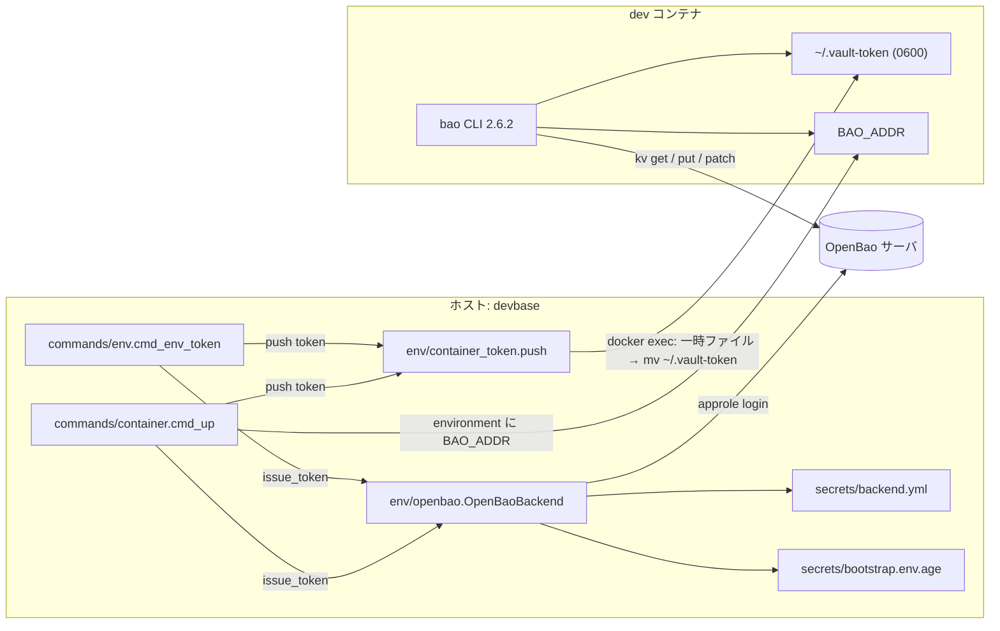
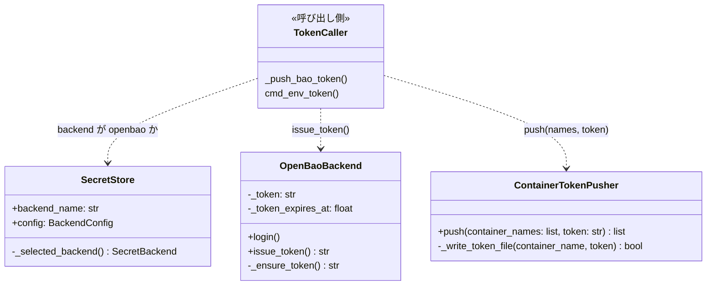
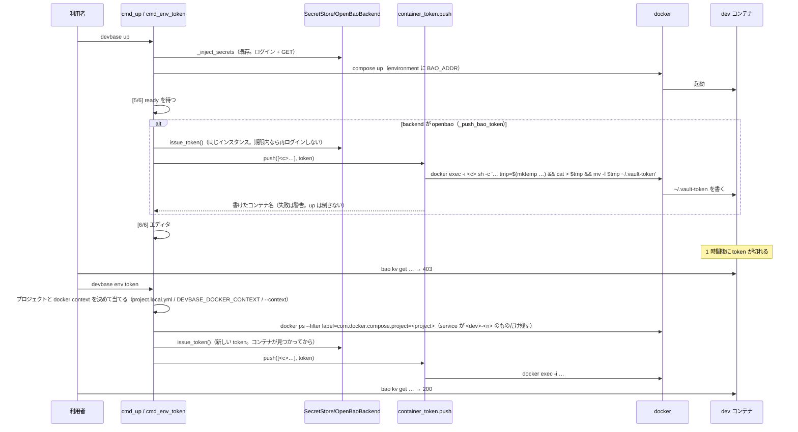

# #169: base イメージに `bao` を入れ、起動中のコンテナから機密を取得・変更できるようにする（設計）

要求と受け入れ条件は `issues/PLAN54_bao-in-container.md` にある。この文書は「どう作るか」だけを扱う。

作るものは 3 つである。base イメージの `bao` 2.6.2、`devbase up` がコンテナへ渡す
`BAO_ADDR` と `~/.vault-token`、token を取り直す `devbase env token`。コンテナに置く資格情報は
1 時間で切れる token だけで、`secret_id` はホストから出ない（決定 1・2）。

## 機能一覧

| # | 機能 | 誰が使うか |
| --- | --- | --- |
| F1 | dev コンテナの中で `bao` 2.6.2 が使える | 開発者、管理者（carmo-cdk の管理スクリプト） |
| F2 | `devbase up` が、backend が `openbao` のとき、コンテナへ接続先と token を渡す | 開発者（意識せずに使う） |
| F3 | `devbase env token` で、起動中のコンテナの token を再起動せずに取り直す | 開発者（token が切れたとき） |
| F4 | コンテナの中から自分の機密を読む・足す・変える・消す手順の案内 | 開発者 |

## 構成要素

| 要素 | 責務 |
| --- | --- |
| `containers/base/Dockerfile`（変える） | `bao` の tar.gz を取得し、`checksums.txt` で検証して `/usr/local/bin/bao` へ置く。版は `ARG BAO_VERSION` |
| `env/openbao.py` `OpenBaoBackend.issue_token()`（足す） | 現在の token を返す。無い・期限が近ければログインし直す。既存の `_ensure_token` を公開する薄い入口 |
| `env/container_token.py`（新設） | 受け取った token をコンテナへ届ける。`docker exec` で `~/.vault-token`（`0600`）へ書く。replica ごとの繰り返しを持つ。token の取得と backend の判定は持たない（呼び出し側の責務） |
| `commands/container.py` `_push_bao_token()`（足す） | `up` の [5/6] の後に呼ぶ。backend が `openbao` でなければ何もしない。`issue_token()` で token を得て `push()` へ渡す。失敗しても `up` を倒さない（`_apply_window_titles` と同じ扱い） |
| `commands/container.py` `_generate_compose_for()` の `dev_environment`（変える） | backend が `openbao` のとき `BAO_ADDR=<url>` を dev サービスの `environment` に足す（値はリテラル。機密ではない） |
| `commands/env.py` `cmd_env_token()`（足す） | `devbase env token [--print] [--context NAME]`。既定は現在地のプロジェクトの起動中の dev コンテナへ届ける（プロジェクトと接続先の解決 → `docker ps` で対象の解決 → `issue_token()` → `push()`。token はコンテナが見つかってから取る）。`--print` は標準出力へ token だけを出す |
| `cli.py`（変える） | parser に `env token` のサブコマンドと `--print` を足し、`--context` は `env exec` と同じ `_add_context_arg` で足す。`SUBCMD_MAP[('env',)]` に `token` を足す（`tests/cli/test_prefix_resolution.py` が parser と `SUBCMD_MAP` の一致を固定している）。`_NO_SECRET_INJECTION` に `('env', 'token')` を足す |
| `docs/user/env-backend.md`（変える） | 「コンテナの中から `bao` を使う」の節（F4） |
| `tests/containers/test_base_dockerfile_bao.py`（新設） | Dockerfile の `bao` 導入行を固定する（版・両アーキテクチャ・検証） |
| `tests/env/test_container_token.py`（新設） | `docker exec` の呼び出しの形（コマンド・stdin・`umask`・`mktemp` した一時ファイルからの `mv`）と、replica の繰り返し |
| `tests/commands/test_container_bao.py`（新設） | `up` が `BAO_ADDR` を足す／足さない、`_push_bao_token` の要否 |
| `tests/commands/test_env_token.py`（新設） | `env token` の `--print` と既定の経路、backend が `openbao` でないときの失敗、`project.local.yml` の `docker.context` が `docker ps` / `docker exec` の両方に効くこと |

構成要素の関係:



システムの文脈と配置は上の図の `host` / `container` / `SRV` の 3 つである。変更前と同じで、
`docs/specifications/secret-backend.md`「構成要素」が持つ。この変更が足す辺は 2 本である。
コンテナからサーバへ向かう辺（`bao` → `SRV`）と、ホストからコンテナへ token を届ける辺。

## 構造



責務の境界は「token を得る」と「token を届ける」で分ける。`_push_bao_token` と `cmd_env_token`
（図の `TokenCaller`）が backend を判定し、`issue_token()` で token を得て `push()` へ渡す。
`ContainerTokenPusher` は `docker` しか知らず、`OpenBaoBackend` にも `SecretStore` にも依存しない
（テストは token の文字列を渡すだけで済む）。

`issue_token()` は `_ensure_token()` をそのまま返す。ログイン失敗の例外（`SecretAuthError` /
`SecretUnreachableError`）はそのまま上へ伝える。`push()` は書けたコンテナ名の一覧を返し、
書けなかったものは警告を 1 行ずつ出す（`up` の後処理では失敗を握り、`env token` では非ゼロで
終える）。

## 入出力の契約

### コンテナの中の環境

| 名前 | 形 | 出所 | いつ |
| --- | --- | --- | --- |
| `BAO_ADDR` | 環境変数。`backend.yml` の `openbao.url` | `_generate_compose_for` の `dev_environment` | `up` のとき。backend が `openbao` のときだけ |
| `~/.vault-token` | ファイル `0600`、token の文字列 1 行（改行なし） | `_push_bao_token` / `env token` | `up` の [5/6] の後と、`env token` を打ったとき |

`bao` は `BAO_TOKEN` が無いとき `~/.vault-token`（`BAO_TOKEN_PATH` で変更可）を読む。
`BAO_TOKEN` を環境変数にしないのは、`docker inspect` と子プロセスの環境に残るためである
（決定 1）。

### `devbase env token`

```text
devbase env token [--print] [--context NAME]
```

| 引数 | 意味 |
| --- | --- |
| （なし） | 現在地のプロジェクトの起動中の dev コンテナすべての `~/.vault-token` を書き換える |
| `--print` | コンテナへ書かず、token を標準出力へ 1 行で出す。手で貼りたいとき・別の経路のコンテナのため。プロジェクトとコンテナは見ない |
| `--context NAME` | docker context を一時的に上書きする。`env exec` と同じ `_add_context_arg`（PLAN52） |

対象のプロジェクトは、他の `env` サブコマンド（`set -p` など）と同じく実行時のディレクトリから
決める（`_current_project_name`）。プロジェクト名を取る引数は置かない。既存の `-p` は名前を
取らない真偽フラグで（`docs/specifications/secret-backend.md`「参照の持ち主と `--user`」）、
`env token` だけ引数を取る `-p` にすると意味が割れる。別のプロジェクトへ届けたいときは
そのディレクトリで打つ。

処理の順は「backend の判定 → プロジェクトの解決 → 接続先の解決 → 対象の解決 → ログイン
（`issue_token()`）→ 書き込み」で、`--print` は backend の判定の後すぐログインして token を出す
（プロジェクトもコンテナも見ない）。ログインを対象の解決より**後**に置くのは、届け先が無い
（`projects/` の下ではない、起動中の dev コンテナが無い）ときにサーバへ token を発行させない
ためである。発行した token は使われないまま 1 時間サーバに残る。サーバへ届かない端末では
「プロジェクトの外で打った」より先に「サーバへ到達できない」が出て、本当の誤りが読めない
（round 3 のレビュー）。

対象の解決は `docker ps` 1 回で行う。`--filter label=com.docker.compose.project=<project>` で
現在地のプロジェクトに絞り、`--format '{{.Names}}\t{{.Label "com.docker.compose.service"}}'` で
名前とサービス名を取り、サービス名が `<dev>-<n>`（`<dev>` は `get_dev_service_name()`、`<n>` は
1 以上の整数）のものだけを残す。`up` が生成する `.docker-compose.scale.yml` は dev の各インスタンスを
サービス `{dev}-{i}`・`container_name` `${COMPOSE_PROJECT_NAME}-{dev}-{i}` で定義する
（`volume/compose.py` `_build_scaled_services`）ので、このラベルで dev 以外のサービス（DB、
`snapshot` など同じプロジェクトのコンテナ）が届け先に入らない。プロジェクト名だけで絞ると
それらにも `docker exec` を打ち、`$HOME` の違いで失敗するか root の home に token を残す。
`up` の `_push_bao_token` は `docker ps` を使わず、`_apply_window_titles` と同じく
`opener.resolve_container_name(dev, project, index)` を 1..scale で回して名前を組む
（起動直後で scale が分かっている）。

接続先（docker context）は `env token` 自身が決める。`up` が `_resolve_docker_target` で当てた
`DOCKER_CONTEXT` はその process の環境にしか無く、後から別の process で打つ `env token` には
残らない。何もしないと、`project.local.yml` の `docker.context` だけでリモート（PLAN52）を
指す端末では既定の daemon を見に行き、コンテナが無いか、同名の別のコンテナへ token を書く。
そこで `cmd_env_exec` と同じ形で決める。`_current_project_name` で決めたプロジェクトの直下の
`project.local.yml` を `load_project_local_config` で読み、`docker_context.choose_context`
（CLI `--context` > env `DEVBASE_DOCKER_CONTEXT` > ファイル > 未指定）で 1 つに決め、
`docker_context.apply` で process の環境へ当てる。この後の `docker ps`（対象の解決）と
`docker exec`（書き込み）は同じ接続先へ向かう。gid・home の解決（`_resolve_docker_target`）は
要らない（compose を生成しない）。`--print` はここへ来ない。

状況は処理の順に並べる（上の行で止まれば下は見ない）。

| 状況 | 出力 | 終了コード |
| --- | --- | --- |
| backend が `openbao` でない | 「backend が openbao ではありません」 | 1 |
| `--print` | token を 1 行（backend の判定とログインの結果以外の条件は見ない） | 0 |
| `projects/` の下ではない | 「プロジェクトのディレクトリで実行してください」（ログインしない） | 1 |
| 起動中の dev コンテナが無い | 「起動中の dev コンテナがありません: <project>」（ログインしない） | 1 |
| ログインが拒まれた（400 / 403） | 既存の `SecretAuthError` の文言 | 1 |
| 到達できない | 既存の `SecretUnreachableError` の文言（**控えは使わない**。token は控えられない） | 1 |
| 一部のコンテナに書けなかった | 書けたもの・書けなかったものを 1 行ずつ | 1 |
| すべて書けた | 書いたコンテナ名を 1 行ずつ（token は出さない） | 0 |

`env token` は `_NO_SECRET_INJECTION` に入れる（機密の注入は要らず、注入の往復を増やさない）。

### `docker exec` の形

```text
docker exec -i <container> sh -c '
  umask 077
  tmp=$(mktemp "$HOME/.vault-token.XXXXXX") || exit 1
  cat > "$tmp" && chmod 0600 "$tmp" && mv -f "$tmp" "$HOME/.vault-token" \
    || { rm -f "$tmp"; exit 1; }'
  （stdin: token）
```

- `-i` で stdin を渡し、引数に token を載せない（`ps` に出さない）
- 同じディレクトリの一時ファイルへ書いてから `mv -f` で置き換える（`editor/window_title.py`
  `_write_command` と同じ形）。`cat >` で直接上書きすると、`env token` の再実行で既存ファイルの
  mode がそのまま残り（`umask` は新規作成にしか効かない）、途中で切れると空のファイルが残る
- 一時ファイルは固定名にせず `mktemp` で**毎回新しく**作る。固定名（`.vault-token.tmp`）だと、
  その名前のファイルが既にあるとき `cat >` は既存の inode へ書き、`umask 077` は効かない
  （0644 で先に置いておくと、終了コード 0 のまま `~/.vault-token` が 0644 になる。round 2 の
  レビューで再現）。並行して打った `env token` 同士が 1 つの一時ファイルを取り合うこともない。
  `mktemp` は `O_EXCL` で `0600` に作るので、`mv` 後の mode は前の状態によらず `0600` になる。
  `chmod 0600` は `mktemp` の実装差への保険で、失敗すれば書き込みを止める。
  `window_title.py` の `cp -p`（既存の mode を写す）は要らない。ここでは前の mode を
  引き継がず、常に `0600` にしたい
- 接続先（`DOCKER_CONTEXT`）は呼び出し側が process の環境へ当てておく。`up` は
  `_resolve_docker_target` が当てた同じ process の中で `_push_bao_token` を呼ぶ。`env token` は
  自身で決める（「`devbase env token`」の節）。どちらもリモートの daemon（PLAN52）へ同じ形で届く
- `$HOME` はコンテナの利用者（`ubuntu`）のもの。`docker exec` の既定の利用者は compose の
  `user` 設定に従い、base イメージは `USER ubuntu` で終わる

## 処理の流れ



`up` の途中で `issue_token()` が返す token は、`_inject_secrets(required=True)` と同じ
インスタンスのものである。`_run_deploy_pipeline` が `SecretEnv` を作った `SecretStore` を
保持して渡す。`up` の往復は増えない。

**#168（PLAN55）が `SecretStore` の引き回しを変える場合は、この呼び出しもそちらの経路に乗せる。**

| 実装の順序 | `SecretStore` の渡し方 |
| --- | --- |
| PLAN55 の後 | PLAN55 の設計に従う |
| PLAN55 の前 | `_run_deploy_pipeline` の中で `SecretStore` を 1 つ作り、注入と token の両方へ渡す |

## 非機能の実現方式

| 大項目 | 要求の条件 | 実現方式 | 確かめ方 |
| --- | --- | --- | --- |
| セキュリティ | `secret_id` の置き場所を広げない方式を既定とする | コンテナへ渡すのは 1 時間で切れる token だけ。`secret_id` はホストの `bootstrap.env.age` から出ない。token はファイル `0600` に置き、環境変数と compose ファイルに書かない | コンテナ内で `env \| grep -c SECRET_ID` が 0、`.docker-compose.scale.yml` に `hvs.` が無い、`stat -c %a ~/.vault-token` が 600 |
| セキュリティ | `bao` の導入はチェックサムで検証する | `checksums.txt` を同じリリースから取得し、`grep` で対象行を抜いて `sha256sum -c` | 行を改ざんした Dockerfile でビルドが失敗する（テストは Dockerfile の文言で固定） |
| 運用・保守性 | 版の更新が `ARG` 1 行 | `ARG BAO_VERSION=2.6.2` を 1 か所に置き、URL・ファイル名・検証すべてがそれを参照する。tar.gz には `bao` / `CHANGELOG.md` / `LICENSE` / `README.md` の 4 つが入る（v2.6.2、70 MB）ので `tar -xzf - bao` で 1 つだけ取り出す | `grep -c 2.6.2 containers/base/Dockerfile` が 1 |
| 運用・保守性 | token 切れの症状（403）と対処を `docs/user/` に書く | F4 の節に「`permission denied` が出たら `devbase env token`」を書く | 文書を読む |
| システム環境 | amd64 / arm64 の両方でビルドできる | `dpkg --print-architecture` で `amd64` / `arm64` を選ぶ（session-manager-plugin と同じ書き方） | 両アーキテクチャのホストで `devbase build` |
| システム環境 | backend が `openbao` でない端末は影響を受けない | `BAO_ADDR` の付与と `_push_bao_token` は `store.backend_name == 'openbao'` のときだけ | backend が `age` の `up` で生成される compose が変更前と一致するテスト |

## 決定の記録

### 決定 1: コンテナへ渡す資格情報は 1 時間の token だけにし、`~/.vault-token` に置く

token は AppRole のログインで得るもので 1 時間で切れる。盗まれても被害は 1 時間で、
`secret_id`（失効させるまで使える）を置くより狭い。ファイルにするのは、環境変数だと
`docker inspect` と全プロセスの環境に残り、`env` を出力するコマンドや子プロセスに漏れる
ためである。`bao` は `~/.vault-token` を既定で読むので、利用者は何も設定しなくてよい。

`role_id` / `secret_id` をコンテナへ渡して `bao write auth/approle/login` で取り直す案は採らない。
取り直しは楽になる。しかしコンテナの中で動く AI CLI と npm のパッケージが、ホストと同じ
資格情報を永続的に持つ形になる。PLAN51 が `secret_id` を age で守った意味が無くなる。

### 決定 2: token の取り直しはホストの `devbase env token` が行い、コンテナには資格情報を置かない

コンテナの中から取り直す手段を持たせるには、コンテナに資格情報（決定 1 で退けた）か、
人のログイン（OIDC）が要る。OIDC の `bao login -method=oidc role=google` は、ブラウザの戻り先がコンテナの
`localhost:8250` に届く必要がある。これは VS Code のポート転送に依存する。devbase が作る
ものではなく、文書に「別の経路」として書くだけにする。

ホストで取り直す形なら、`devbase up` が既に持つ資格情報と経路をそのまま使える。1 時間ごとの
手間は、コンテナの中で `bao` を打つ頻度（キーを足す・値を見るとき）に対して十分に小さい。
起動時の注入で足りる日常の利用では、取り直しは一度も要らない。

### 決定 3: `BAO_ADDR` は環境変数で渡し、`docker exec` で書かない

接続先は機密ではなく、compose の `environment` にリテラルで書ける（`DEVBASE_ACCOUNT_GROUP` と
同じ扱い）。ファイルにする token と分けることで、token の書き込みに失敗しても `bao` は「token が無い」と
分かる。`BAO_ADDR` まで無いと誤りが「接続先が無い」に変わり、原因が読めない。

### 決定 4: token の書き込みは `up` の [5/6] の後に置き、失敗しても `up` を倒さない

コンテナが ready になる前は `docker exec` が失敗する。`_apply_window_titles` と同じ位置で、
同じく付随処理として扱う。token が書けなくてもコンテナは起動済みの環境変数で動くため、
`up` を失敗にすると本来の目的（開発環境の起動）を損なう。失敗は警告で伝え、利用者は
`devbase env token` でやり直せる。

### 決定 5: `bao` は tar.gz を `checksums.txt` で検証して入れ、`.deb` は使わない

`.deb` は依存の解決と postinst（`openbao` システムユーザーの作成、systemd ユニット）を伴い、
CLI だけが要る base イメージには余計である。tar.gz は `bao` バイナリ 1 つで、配置先を
`/usr/local/bin` に固定できる。署名（`.gpgsig` / `.sigstore.json`）の検証は、base イメージの
他のツール（AWS CLI・gcloud・uv）も行っていないため揃える。チェックサムは同じリリースから
取るので、改ざんに対する防御は「GitHub Releases が一貫している」前提に依る。

### 決定 6: 全端末の base イメージに `bao` を入れ、backend で入れ分けない

管理者の作業（carmo-cdk の `openbao-admin.sh`）は `bao` に依存し、管理者の端末の backend
設定とは無関係である。入れ分けると、backend を `openbao` にしていない管理者の端末で
`bao` が無い。サイズの増分は 1 バイナリ（tar.gz で 70 MB。展開後の実測は実装時に CHANGELOG へ書く）で、
既に gcloud SDK と Playwright を持つイメージに対して許容する。

## テスト設計

| 受け入れ条件（PLAN54） | 何で確かめるか |
| --- | --- |
| 1. `bao version` が `OpenBao v2.6.2` | 手動（`devbase build` → `docker run --rm devbase-base:latest bao version`）。amd64 は CI 相当のホスト、arm64 はこの Mac |
| 2. チェックサム不一致でビルドが失敗する | `tests/containers/test_base_dockerfile_bao.py`: Dockerfile に `sha256sum -c` の行と `checksums.txt` の取得があることを固定。実ビルドの失敗は実装時に 1 度手で確かめる |
| 3. コンテナ内 `bao kv get` がホストの `env get --user` と同じ値 | 手動（リリース後テスト。PLAN53 の後の端末で） |
| 4. コンテナ内 `kv patch` がホストの `env get --user` に見える | 手動（同上） |
| 5. `team/global` は読めて書けない | 手動（同上。サーバのポリシーの確認） |
| 6. 1 時間後に `devbase env token` で読める | 手動（同上）。`tests/commands/test_env_token.py` で `docker ps` → `issue_token` → `push` の順、`projects/` の外と起動中の dev コンテナが無いときに `issue_token` を呼ばないこと、`docker ps` の結果から service が `<dev>-<n>` でないコンテナ（DB・`snapshot`）を外すこと、`--print` がコンテナを見ないこと、`project.local.yml` の `docker.context` をリモートにしたとき `docker ps` と `docker exec` が両方ともその context で呼ばれることを固定。`tests/cli/test_prefix_resolution.py`（既存）が `SUBCMD_MAP` への登録を固定 |
| 7. backend が `age` なら `BAO_ADDR` / token が無く compose が同じ | `tests/commands/test_container_bao.py`: `up` の harness で生成 compose の差分 0、`_push_bao_token` が `docker exec` を呼ばない |
| 8. token がログと compose に書かれない | `tests/env/test_container_token.py`: `docker exec` の argv に token が無く stdin にある。`caplog` に token が無い。シェルの文言に `mktemp` と `umask 077` があり、固定名の一時ファイルが無い |
| 9. `pytest` / `ruff` / `shellcheck` | `quality-gates` |
| 10. Dockerfile の導入行を固定するテスト | `tests/containers/test_base_dockerfile_bao.py`（版・`amd64` / `arm64` の分岐・`sha256sum -c`） |

## 未確認のまま残ること

| 項目 | 内容 |
| --- | --- |
| `bao` が `~/.vault-token` を既定で読むこと | バイナリの文字列（`~/.vault-token` / `BAO_TOKEN_PATH`）と OpenBao の CLI 文書から読んだ。実サーバで確かめるのはリリース後テスト。読まなければ `BAO_TOKEN_PATH` を `environment` で指す |
| 派生イメージが `USER` を変えていないこと | `containers/*/Dockerfile` は 10 本。dev イメージは base と派生 8 本の 9 本で、`USER` を書く 8 本（base と派生 7 本）は `ubuntu`（`${USERNAME}`）で終わり、`general` は `USER` を書かず base の `ubuntu` を継ぐ（2026-09-14 に数えた）。`snapshot` は `FROM ubuntu:26.04` で `USER` が無く root だが、dev サービスではないので token の届け先に入らない（対象は起動中の dev コンテナだけ）。利用者側の `projects/*/compose.yml` が `user:` を変える場合は `$HOME` が変わり、その場合は `BAO_TOKEN_PATH` で指す運用になる |
| PLAN55（#168）との順序 | 先に入った側に合わせて `SecretStore` の引き回しを決める（処理の流れの節） |
