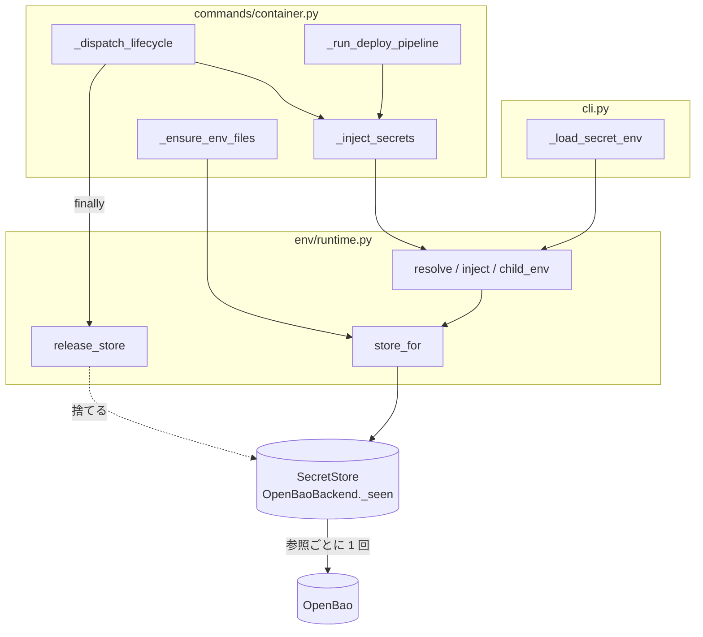
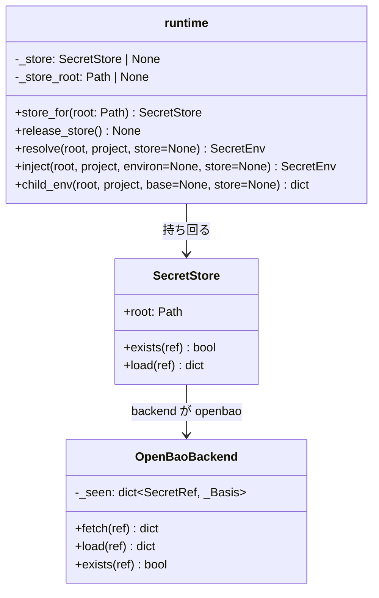
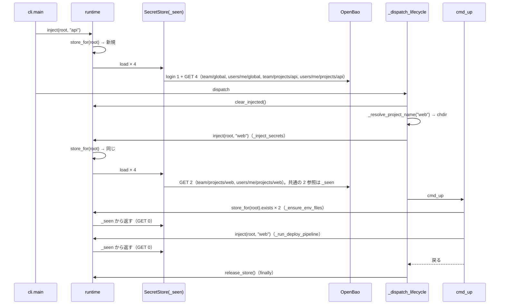

# #168: `devbase up` の機密の注入を 1 回にし、サーバ backend の往復を設計の想定へ収める（設計）

要求と受け入れ条件は `issues/PLAN55_up-single-injection.md` にある。この文書は「どう作るか」だけを扱う。

作るものは 1 つである。**1 回のライフサイクル操作の間、`SecretStore` を 1 つだけ持ち回る**
置き場（`runtime.store_for()` / `runtime.release_store()`）。注入の回数そのものは変えない。
同じ `SecretStore` なら 2 度目の解決は控え（`_seen`）から返り、サーバへは行かない。
これで `up` 1 回の往復は認証 1 回 + 参照ごとに 1 回になる（決定 1）。

## 機能一覧

| # | 機能 | 誰が使うか |
| --- | --- | --- |
| F1 | `devbase up`（3 経路）が、backend `openbao` でも認証 1 回 + 参照ごとに GET 1 回で起動する | 開発者（意識せずに使う） |
| F2 | `_ensure_env_files` の存在判定がサーバへ問い合わせない | 開発者（同上） |
| F3 | `up` 1 回の往復回数がテストで固定される | 保守する人 |

## 構成要素

| 要素 | 責務 |
| --- | --- |
| `env/runtime.py` `store_for(root)`（足す） | プロセス内で持ち回る `SecretStore` を返す。無ければ作る。`root` が変われば作り直す |
| `env/runtime.py` `release_store()`（足す） | 持ち回っている `SecretStore` を捨てる。次の `store_for` は作り直す |
| `env/runtime.py` `resolve()` / `inject()` / `child_env()`（変える） | `store` 引数が `None` のとき `SecretStore(root)` ではなく `store_for(root)` を使う。引数の形は変えない |
| `commands/container.py` `_ensure_env_files()`（変える） | `SecretStore(devbase_root)` を `runtime.store_for(devbase_root)` に置き換える |
| `commands/container.py` `_dispatch_lifecycle()`（変える） | `finally` で `docker_context.reset()` に並べて `runtime.release_store()` を呼ぶ |
| `cli.py` `_load_secret_env()`（変えない） | dispatch 前の注入はそのまま。作った `SecretStore` が `store_for` の控えになる |
| `tests/env/test_runtime_store.py`（新設） | `store_for` / `release_store` の振る舞い（同一性・`root` 変更・解放後の作り直し） |
| `tests/cli/test_up_roundtrips.py`（新設） | 3 経路の `up` を `FakeOpenBao` で走らせ、認証と GET の回数を固定する |
| `docs/specifications/secret-backend.md`「OpenBao との契約」（`plan-to-spec` で変える） | 「`devbase up` 1 回あたり」の文を、持ち回りの規則とともに確定仕様にする |

構成要素の関係:

## 構造

`OpenBaoBackend` は変えない。`_seen` は既にあり、同じインスタンスの中では `exists` → `load`
で 2 度取りに行かない。これは `docs/specifications/secret-backend.md`「OpenBao との契約」が
定める性質である。この設計は**インスタンスの寿命を延ばす**ことで、その性質を CLI 全体へ
広げる。

## 処理の流れ

`devbase up web` を `projects/api` の中から打ったとき:

| 経路 | 認証 | GET | 内訳 |
| --- | ---: | ---: | --- |
| `devbase up`（`web` の中） | 1 | 4 | `_load_secret_env` で 4。以降はすべて `_seen` |
| `devbase up web`（`api` の中） | 1 | 6 | `_load_secret_env` で `api` の 4、切替後に `web` の 2 |
| `devbase up web`（`projects/` の外） | 1 | 4 | `_load_secret_env` で共通 2、切替後に `web` の 2 |

TUI（1 プロセスで操作を続ける）では、`_load_secret_env` が起動時に作った `SecretStore` を
最初の操作が引き継ぎ、その操作の `finally` で捨てる。2 回目以降の操作は `_inject_secrets` が
作り直すので、操作ごとに現物を読む。**最初の操作だけは TUI の起動時に読んだ値で起動する**
（決定 3）。

### `store_for` の規則

| 状況 | 返すもの |
| --- | --- |
| 控えが無い | `SecretStore(root)` を作って控え、返す |
| 控えがあり `root` が同じ | 控えを返す |
| 控えがあり `root` が違う | 捨てて作り直す（テストが `tmp_path` を変えて呼ぶ形に耐える） |
| `release_store()` の後 | 控えが無い状態に戻る |

`resolve(store=...)` で明示的に渡された `SecretStore` は控えに入れない。移行
（`env backend migrate`）のように設定と違う backend を相手にする処理が、以後の解決へ
混ざらないためである。

## 非機能の実現方式

| 大項目 | 要求の条件 | 実現方式 | 確かめ方 |
| --- | --- | --- | --- |
| 性能・拡張性 | `up` 1 回の往復が認証 1 回 + 参照ごとに 1 回 | 上の「処理の流れ」。`SecretStore` の寿命をライフサイクル操作 1 回に揃える | `tests/cli/test_up_roundtrips.py` で `FakeOpenBao.logins == 1` と GET の内訳。実機は `devbase --verbose up` のログで認証の行を数える（リリース後テスト） |
| 運用・保守性 | 往復回数を偽サーバのテストで固定し、経路を足したときに増えたことが分かる | 3 経路それぞれのテストが `openbao.requests_of('GET')` の `kv_path` を並べて比べる（件数だけでなく内訳） | テストを読む |

## 決定の記録

### 決定 1: 注入の回数ではなく `SecretStore` の寿命を変える

3 か所の注入は、それぞれ別の理由で置かれている。

| 注入 | 理由 |
| --- | --- |
| `_load_secret_env` | dispatch 前に現在地の機密を載せる（エディタ起動などが従来どおり動く） |
| `_dispatch_lifecycle` | 切替後に切替元の機密を落として載せ直す |
| `_run_deploy_pipeline` | 起動直前に必須として読む（鍵が無ければここで止める） |

どれか 1 つを消すと、切替の回帰テスト（`tests/cli/test_project_name_resolution.py`）が守って
いる性質を崩す。往復が増えている原因は注入の回数ではない。注入のたびに `SecretStore` を
作り直して `_seen` を捨てていることである。寿命を延ばせば、注入の回数はそのままで往復だけが
減る。

`_load_secret_env` の `SecretEnv` を dispatch 先へ引数で渡す案（#168 の案の 1 つ目）は採らない。
`_dispatch_lifecycle` の handler 群と `cmd_up` の引数が増え、TUI の呼び出し（`tui/dispatch.py`）
も変わる。控えは `SecretStore` が既に持っているので、渡すべきものは無い。

### 決定 2: 控えの置き場は `runtime` モジュールに置き、`_dispatch_lifecycle` の `finally` で捨てる

`docker_context` が同じ形（モジュールの控えと `reset()`）で接続先を持ち回っている。
`_dispatch_lifecycle` の `finally` には既に `docker_context.reset()` がある。同じ場所に
`release_store()` を並べれば、寿命の規則が 1 か所で読める。

`_dispatch_lifecycle` の**入口**で捨てる案は採らない。CLI では `_load_secret_env` が作った
`SecretStore` を捨てることになり、認証が 2 回に戻る。

### 決定 3: TUI の最初の操作は起動時に読んだ値で起動する

出口で捨てる規則の帰結である。TUI の起動から最初の操作までの間にサーバ側の値が変わって
いても、その操作には反映しない。TUI は対話的で、起動から操作までは通常数秒〜数分である。
起動時の値は同じプロセスが `os.environ` に載せたものと同じで、これまでも `_inject_secrets` が
上書きするまでは子プロセスへ渡っていた。

起動からの経過時間で捨てる案は採らない。境界の値を決める根拠が無く、テストで時刻を
偽る手間が増える。

### 決定 4: `_ensure_env_files` の存在判定の意味は変えない

`exists()` の意味（ファイル backend はファイルの有無、`openbao` は取得した内容が空でない）は
そのままにする。持ち回った `SecretStore` に置き換えるだけで、`openbao` では `_seen` から
返るので往復が消える。

注入済みの `SecretEnv.global_names` で判定する案（#168 の案の 2 つ目）は採らない。age の
空ファイルは今日「存在する」と判定されるが、`global_names` は空になり `env init` が走る。
ファイル backend の振る舞いが変わる（PLAN51 前提 3 に触れる）。

## テスト設計

| 受け入れ条件（PLAN55） | 何で確かめるか |
| --- | --- |
| 1. `web` の中で `up`: 認証 1、GET 4 | `tests/cli/test_up_roundtrips.py::test_up_in_project`。`cli.main(['up'])` 相当を `cwd=projects/web` で走らせ、docker を差し替える。`openbao.logins == 1`、GET の `kv_path` 4 件の集合を比べる |
| 2. `api` の中で `up web`: 認証 1、GET ≤ 6、`api` 固有キーが残らない | 同 `::test_up_other_project`。GET の集合が `api` の 4 + `web` の 2 で、`os.environ` に `api` だけのキーが無い |
| 3. `projects/` の外で `up web`: 認証 1、GET 4 | 同 `::test_up_from_outside` |
| 4. `_ensure_env_files` がサーバへ GET を出さない | 同 `::test_ensure_env_files_reads_seen`。注入の後に `_ensure_env_files()` を呼び、GET が増えない |
| 5. backend `age` で 3 経路の結果が同じ | 既存の `tests/cli/test_project_name_resolution.py` / `tests/commands/test_container_up_order.py` / `tests/commands/test_container_context.py` が変更なしで通る |
| 6. 切替の回帰テストが通る | `tests/cli/test_project_name_resolution.py` を変更しない |
| 7. `pytest` / `ruff` / `compileall` | `quality-gates` |
| `store_for` の規則の表 | `tests/env/test_runtime_store.py`（同一性・`root` 変更・解放） |

## 未確認のまま残ること

| 項目 | 内容 |
| --- | --- |
| `tests/cli/` の既存 harness が `SecretStore` を直接作っている箇所 | `runtime.resolve(store=...)` で渡している箇所は影響を受けない。`SecretStore(root)` を各テストで作って `monkeypatch` している箇所があれば、`release_store()` を `conftest` の autouse fixture で呼ぶ。実装時に数える |
| PLAN54（#169）との順序 | PLAN54 の `_push_bao_token` は `store_for(root)` から token を取れば、`_run_deploy_pipeline` に `SecretStore` を渡す配線が要らない。PLAN55 を先にマージするのが簡単 |
