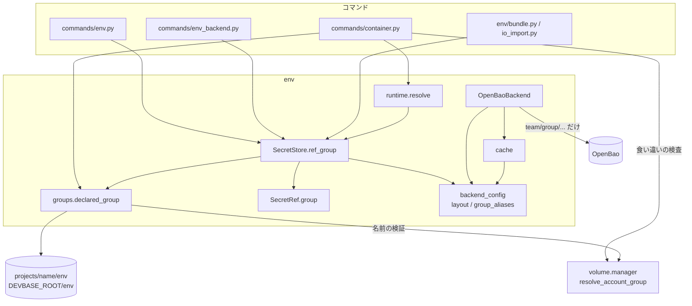
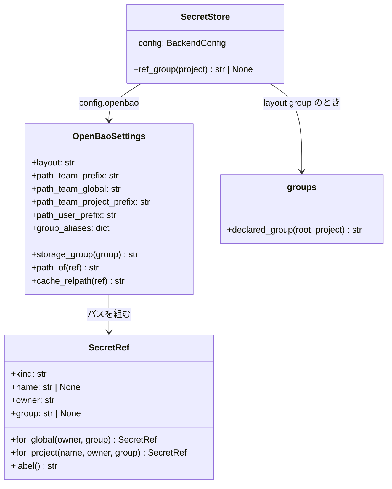
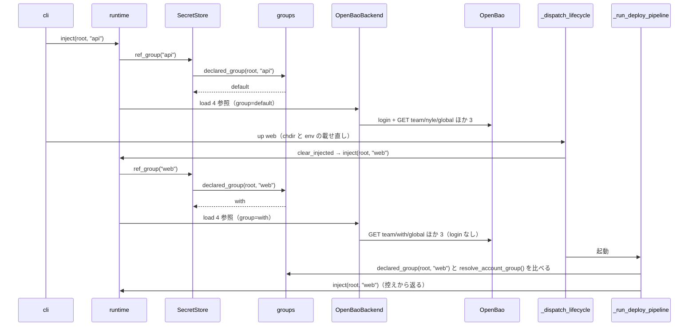
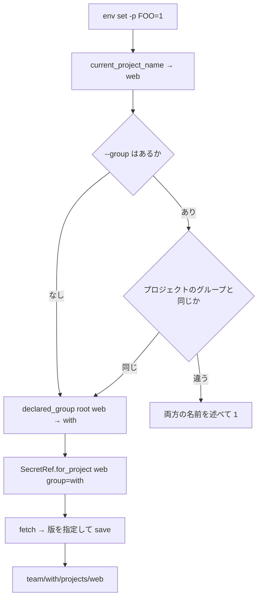

# #182: 機密ストアの置き場をアカウントグループごとに分ける（設計）

要求と受け入れ条件は `issues/PLAN56_secret-group-paths.md` にある。この文書は「どう作るか」だけを扱う。

作るものは 3 つである。

1. **グループを含むパスの並び**を `backend.yml` の `version: 2` として足す（決定 1）
2. **参照（`SecretRef`）にグループを持たせる**。グループは機密を読む前に非機密の `env`
   ファイルから決める（決定 2・3）
3. **`default` の読み替え**を `backend.yml` の `group_aliases` に置く（決定 4）

`version: 1` の設定とファイル backend では、参照のグループは常に空で、パス・キャッシュ・
往復は今と同じになる（決定 5）。

## 機能一覧

| # | 機能 | 誰が使うか |
| --- | --- | --- |
| F1 | `devbase up` などの注入が、プロジェクトのアカウントグループの置き場だけを読む | 開発者（意識せずに使う） |
| F2 | `env list` / `get` / `set` / `delete` / `edit` が、実行したプロジェクトのグループを相手にする。`--group` で明示もできる | 開発者 |
| F3 | `default` などのグループ名を、置き場の上だけ別の名前へ読み替える | 端末の設定者 |
| F4 | `env backend status` が対象のグループとそのパスを表示する | 開発者 |
| F5 | `env backend use openbao --layout group --group-alias default=nyle` でグループ別の置き場へ切り替える | 端末の設定者 |
| F6 | `env backend migrate --to openbao` がプロジェクトごとのグループへ書き、`--exclude-project` で移行から外す | 端末の設定者 |
| F7 | 手元のキャッシュがグループごとに分かれ、不達のときに自分のグループの控えで起動する | 開発者（意識せずに使う） |
| F8 | 起動するボリュームのグループと機密のグループが食い違えば `up` を止める | 開発者（誤設定の検出） |

## 構成要素

| 要素 | 責務 |
| --- | --- |
| `env/groups.py`（新設） | `declared_group(root, project)`: `projects/<project>/env` → `$DEVBASE_ROOT/env` → `default` の順に `DEVBASE_ACCOUNT_GROUP` を**ファイルから**読み、`volume.manager.resolve_account_group` で検証する。プロセスの環境変数と機密の置き場は見ない（決定 3） |
| `env/backend_config.py`（変える） | `version: 2` を受け付ける。`OpenBaoSettings` に `layout`（`flat` / `group`）・`path_team_prefix`・`group_aliases` を足す。`storage_group(group)` が読み替えと予約語の検査を行う。`path_of(ref)` が `layout` でパスを組む。`cache_relpath(ref)` を足す |
| `env/secret_store.py` `SecretRef`（変える） | 末尾に `group: Optional[str] = None` を足す。`for_global` / `for_project` が `group=` を受ける。`label()` はグループがあれば `（グループ <名前>）` を後ろに付ける |
| `env/secret_store.py` `SecretStore`（変える） | `ref_group(project)` を足す。設定が `openbao` かつ `layout: group` のときだけ `declared_group` の結果を返し、それ以外は `None` |
| `env/openbao.py` `OpenBaoBackend`（変える） | `layout: group` で `ref.group` が空の参照を受けたら `SecretStoreError` で止める（呼び出しの誤りを従来のパスへ落とさない） |
| `env/cache.py`（変える） | `entry_path` / `entry_key` を設定の `cache_relpath` から組む。`layout: flat` では今と同じ位置 |
| `env/runtime.py` `resolve()`（変える） | `store.ref_group(project)` で得たグループを 4 参照に渡す |
| `commands/env.py`（変える） | `_global_env` / `_project_env` / `_target_env` がグループを決める。`--group` の検証と、`-p` とプロジェクトのグループの食い違いを拒む。`list` の見出しにグループを出す。`init` / `sync` / `project` / `export` / `import` も同じ決め方を使う |
| `env/bundle.py` / `env/io_import.py`（変える） | 共通の参照は実行時のプロジェクトのグループ、プロジェクトの参照はそのプロジェクトのグループで作る |
| `commands/env_backend.py`（変える） | `status` にグループの行と 4 パス。`use` に `--layout` / `--group-alias`。レイアウトが変わったらキャッシュを消す。`test` は対象のグループに属するプロジェクトだけ調べる。`migrate` に `--exclude-project` と、参照ごとのグループ |
| `commands/container.py` `_ensure_env_files` / `_run_deploy_pipeline`（変える） | 存在判定の参照にグループを渡す。起動の前にボリュームのグループ（`resolve_account_group()`）と `declared_group` を比べ、`layout: group` で食い違えば止める（決定 7） |
| `commands/env_ops.py` `doctor`（変える） | `git check-ignore` で点検するキャッシュのパスを設定の `cache_relpath` から組む |
| `cli.py`（変える） | `env list/get/set/delete/edit` に `--group NAME`、`env backend use` に `--layout {flat,group}` と `--group-alias FROM=TO`（繰り返し可）、`env backend migrate` に `--exclude-project NAME`（繰り返し可） |
| 文書（変える） | `docs/user/env-backend.md`・`docs/user/environment-variables.md`「アカウントグループ」・`docs/user/cli-reference/03-env.md`。確定仕様 `docs/specifications/secret-backend.md` は `plan-to-spec` で |

**`version` の値の集合へ `2` を足すため、`1` だけを前提にした既存の規則を集めた。** 当てはまらない
規則は次の 7 つで、いずれも上の表に載せた。

| 規則 | 置き場所 |
| --- | --- |
| `version != 1` の拒否 | `backend_config._from_dict` |
| 設定の書き出し | `backend_config.to_dict` |
| 既存設定の引き継ぎ | `env backend use` |
| キャッシュの位置と `index.json` のキー | `cache.entry_path` / `entry_key` |
| 除外を点検するキャッシュのパス | `env doctor` |
| パスの表示 | `env backend status` |
| 参照の列挙 | `env backend test` |

`rekey` と `encrypt` / `decrypt` は当てはまるため変えない。`rekey` は手元の age 暗号文をパスに
よらず集め、`encrypt` / `decrypt` はファイル backend だけを扱う。

構成要素の関係:



図に含めない要素は次の 3 つである。

| 要素 | 含めない理由 |
| --- | --- |
| `cli.py` | 引数を定義し、上の各コマンドへ値を渡すだけ |
| `env_ops.py` の `doctor` | `backend_config.cache_relpath` を読むだけ |
| 利用者向け文書 | 実行時の関係を持たない |

## 構造



`OpenBaoBackend._seen` の鍵は `SecretRef` のままでよい。`layout: group` ではグループが参照の
等価性に入るため、グループの違う同じ種類の参照を取り違えない。`layout: flat` ではグループが
常に `None` で、等価性は今と同じになる。

## データ構造

### `secrets/backend.yml`（`version: 2`）

```yaml
version: 2
backend: openbao
openbao:
  url: https://openbao.example.com
  mount: devbase
  user: member01
  layout: group
  path_team_prefix: team
  path_user_prefix: users
  group_aliases:
    default: nyle
  timeout_seconds: 5
cache:
  enabled: true
```

| キー | `version: 1` | `version: 2` |
| --- | --- | --- |
| `openbao.layout` | 置けない（`flat` として動く） | `group` だけを受け付ける。不在なら `group` |
| `openbao.path_team_global` / `path_team_project_prefix` | 今と同じ | 置けない（置けば拒む） |
| `openbao.path_team_prefix` | 置けない | チーム単位の親。既定 `team` |
| `openbao.path_user_prefix` | 今と同じ | 今と同じ（既定 `users`） |
| `openbao.group_aliases` | 置けない | グループ名 → 置き場のグループ名の対応。キーも値も `resolve_account_group` の検証を通す。既定は空 |

**版とレイアウトを 1 対 1 にする。** `version: 1` は `flat`、`version: 2` は `group` である。
`layout` を明示させるのは、読み手が版の番号から並びを思い出さなくて済むためである。
置けないキーを置いたときは、キー名と版を添えて拒む（今の「対応していない値は既定へ
読み替えない」規則に揃える）。

### パスの対応

`<g>` は `storage_group(ref.group)`、すなわち `group_aliases` で読み替えた後の名前である。

| 参照 | `version: 1`（今と同じ） | `version: 2` |
| --- | --- | --- |
| チーム共通 | `team/global` | `<path_team_prefix>/<g>/global` |
| チームのプロジェクト | `team/projects/<name>` | `<path_team_prefix>/<g>/projects/<name>` |
| 個人共通 | `users/<user>/global` | `<path_user_prefix>/<user>/<g>/global` |
| 個人のプロジェクト | `users/<user>/projects/<name>` | `<path_user_prefix>/<user>/<g>/projects/<name>` |

**置き場のグループ名に `global` と `projects` を使えない。** `team/projects/global`
（`version: 1` のプロジェクト `global`）と `team/projects/<name>` の並びに、`version: 2` の
パスが重なるためである。読み替えの後の名前で検査する。

### キャッシュ

| 参照 | `version: 1`（今と同じ） | `version: 2` |
| --- | --- | --- |
| チーム共通 | `cache/team/global.env.age` | `cache/team/<g>/global.env.age` |
| チームのプロジェクト | `cache/team/projects/<name>.env.age` | `cache/team/<g>/projects/<name>.env.age` |
| 個人共通 | `cache/user/global.env.age` | `cache/user/<g>/global.env.age` |
| 個人のプロジェクト | `cache/user/projects/<name>.env.age` | `cache/user/<g>/projects/<name>.env.age` |
| `index.json` のキー | `team:global` / `user:project:<name>` | `team:<g>:global` / `user:<g>:project:<name>` |

控えの中身と `scope`（URL・`mount`・パス・`role_id` の SHA-256）は変えない。パスが変わる
ため、`version: 1` の控えを `version: 2` の参照に使うことは `scope` の不一致で起きない。
それでも `use` でレイアウトが変わったら `cache/` を消す（別グループの機密が暗号文のまま
残り続けるのを避ける）。

## 入出力の契約

### `env list` / `get` / `set` / `delete` / `edit`

```text
devbase env {list|get|set|delete|edit} [-p] [--user] [--group NAME] ...
```

| 状況 | 対象のグループ | 結果 |
| --- | --- | --- |
| `version: 2`、`--group` なし | `declared_group(root, 実行時のプロジェクト)` | そのグループの参照 |
| `version: 2`、`--group NAME`、`-p` なし | `NAME` | そのグループの参照 |
| `version: 2`、`--group NAME`、`-p` あり、プロジェクトのグループと同じ | `NAME` | そのグループの参照 |
| `version: 2`、`--group NAME`、`-p` あり、プロジェクトのグループと違う | — | 両方の名前を述べて 1。読み書きしない（決定 6） |
| `--group` の名前が使えない | — | `resolve_account_group` と同じ理由（予約語・数字だけ・文字種）、または `global` / `projects` を述べて 2 |
| `version: 1` またはファイル backend で `--group` | — | 「グループ別の置き場を選んだ設定でだけ使える」旨を述べて 2 |

- `--group` の比較と表示は読み替える前のグループ名で行う。`--group default` と
  `--group nyle` は、`default: nyle` の対応があれば同じ置き場を指す
- `list` の各節の見出しは `グローバル（グループ with）` の形になる（`SecretRef.label()`）。
  `version: 1` では今と同じ
- 終了コード 2 は、今の `env` コマンドの引数の誤りと同じ扱いである

### `env backend use`

```text
devbase env backend use openbao [--layout {flat,group}] [--group-alias FROM=TO]... [既存の項目]
```

| 入力 | 結果 |
| --- | --- |
| `--layout` なし・既存の設定あり | 既存の版とレイアウトを引き継ぐ |
| `--layout` なし・既存の設定なし | `group`（`version: 2`）で書く |
| `--layout group` | `version: 2` で書く。`path_team_global` / `path_team_project_prefix` は捨てる |
| `--layout flat` | `version: 1` で書く。`group_aliases` があれば捨てた旨を出す |
| `--group-alias default=nyle` | `group_aliases` を**この指定で置き換える**（1 つも無ければ既存を引き継ぐ）。`FROM` か `TO` が検証を通らなければ 2、設定を書き換えない |
| レイアウトが変わった | 設定を書いた後に `cache/` を消し、消した旨を出す |

### `env backend status`

`version: 2` では、今の出力の「置き場」の前に次の行を足す。4 つのパスは対象のグループで
組んだ実際のパスを出す。

```text
  レイアウト: group (version 2)
  グループ:   default → nyle (projects/api/env にも $DEVBASE_ROOT/env にも宣言なし)
```

グループの行の括弧には、どのファイルで決まったかを出す。

### `env backend migrate`

```text
devbase env backend migrate --to openbao [--exclude-project NAME]... [--dry-run] [--yes]
```

- 共通の参照は `declared_group(root, None)` で作る（`$DEVBASE_ROOT/env` → `default`）
- プロジェクトの参照は `declared_group(root, name)` で作る。どちらも実行時のディレクトリに
  左右されない
- `--exclude-project NAME` の参照は、読まない・書かない・退避しない。存在しないプロジェクト名は
  名前を述べて 2（打ち間違いで移行してしまうのを防ぐ）
- `--dry-run` は参照ごとに `<mount>/<パス>` と衝突したキー名を出す。値は出さない
- `--to age` は今と同じで、グループを持たない（ファイル backend は分けない）

### `devbase up` の食い違いの検査

`layout: group` のときだけ、`_run_deploy_pipeline` の機密の注入の前に行う。

| 比べるもの | 食い違ったとき |
| --- | --- |
| ボリュームのグループ `resolve_account_group()`（プロセスの環境変数） ↔ `declared_group(root, project)`（ファイル） | 両方の値と、それぞれの出所を述べて 1。コンテナを起動しない |

## 処理の流れ

`devbase up web` を `projects/api`（グループ宣言なし → `default` → `nyle`）の中から打ち、
`web` のグループが `with` のとき:



往復は認証 1 回・取得 8 回になる。グループが同じなら共通の 2 参照が控えから返り、今と同じ
6 回である。**`api` の控えは `with` の参照と等価にならないため、`web` の起動に `nyle` の値が
混ざらない。**

`env set -p FOO=1` を `projects/web/src` で打ったとき:



## 非機能の実現方式

| 大項目 | 実現方式 |
| --- | --- |
| 性能・拡張性 | グループの決定はファイル 2 つを読むだけで、サーバへ往復しない。プロジェクト内の `up` は認証 1 回 + 取得 4 回のまま |
| 移行性 | `version: 1` の設定はパス・キャッシュの位置・参照の等価性が変わらない。`version: 2` を古い devbase が読むと、今の `version` の検査で拒まれ、従来のパスを読まない |
| セキュリティ | 参照はグループを持って作られ、1 回の操作が組むパスは対象のグループのものだけになる。`layout: group` でグループの無い参照を受けた `OpenBaoBackend` は止まる。ボリュームと機密のグループの食い違いで起動しない |
| 運用・保守性 | 読み替えは `group_aliases` の 1 か所。`status` がグループと出所とパスを出す |

## 決定の記録

### 決定 1: グループ別の置き場は `backend.yml` の `version: 2` にする

古い devbase は未知のキーを黙って無視する（`_openbao_from_dict`）。キーを足すだけでは、
配布が行き渡る前の端末が `version: 2` 相当の設定を読んで `team/global` を読み続け、別グループの
機密をコンテナへ渡す。版を上げれば、今の「`version` が 1 以外なら拒む」規則でその端末が止まる。

パスの設定に `{group}` の差し込みを許す案は採らない。個人単位のパスは `<prefix>/<user>/…` を
コードが組んでおり、差し込みの位置を設定で表すにはキーを増やすことになる。古い devbase が
`{group}` を文字どおりのパスとして読む問題も残る。

### 決定 2: グループは `SecretRef` のフィールドとして持つ

参照が自分のグループを持てば、`_seen` の鍵・キャッシュの位置・`label()` がすべて参照から
決まる。`up web` を `api` から打ったときのように、1 つの `SecretStore` の中でグループが
変わっても取り違えない。

グループを `SecretStore` のインスタンスに持たせる案は採らない。PLAN55 でストアはライフサイクル
操作 1 回の間持ち回られ、プロジェクトの切替をまたぐ。インスタンスのグループを書き換えると、
控えの鍵がグループを含まず、切替元の値が返る。

### 決定 3: グループは非機密の `env` ファイルだけから決め、プロセスの環境変数を見ない

ラッパーは実行時のディレクトリの `env` だけを読む。プロジェクトの下位ディレクトリから
打つと、プロジェクトの `env` がプロセスに載らない。`projects/<name>/env` を直接読めば、
下位ディレクトリからでも同じグループになる（受け入れ条件 3）。置き場から読んだ値も
使わないため、置き場を決める値をその置き場から読む循環も起きない（受け入れ条件 4）。

シェルで `DEVBASE_ACCOUNT_GROUP=kkg devbase up` と打った場合は、ボリュームは `kkg`、機密は
ファイルのグループになり食い違う。この食い違いは決定 7 で起動を止めて知らせる。

### 決定 4: `default` の読み替えは `group_aliases` で置き場の上だけ行う

`DEVBASE_ACCOUNT_GROUP` の既定値を `nyle` に変えると、ボリューム名が `devbase_home_default`
から変わり、既存の認証と会話ログのボリュームを移すことになる。devbase は公開リポジトリで、
コードに社名を既定値として持ち込むことにもなる。読み替えを端末の設定に置けば、ボリュームに
触らず、社名はその会社の端末の設定にだけ入る。

### 決定 5: `version: 1` とファイル backend では参照のグループを常に空にする

`ref_group()` が `None` を返せば、参照は今と同じ値になる。既存のテストの期待値・キャッシュの
位置・往復の数（受け入れ条件 9・10）が、分岐を足さずにそのまま保たれる。

グループを常に参照へ入れ、`version: 1` のパスの組み立てで無視する案は採らない。
`_seen` の鍵にグループが入り、グループの違うプロジェクトへ切り替えたときに同じパスを
2 度取りに行く。

### 決定 6: `-p` と違うグループの `--group` は拒む

`team/kkg/projects/web` に書いても、`web` のグループが `with` なら `up` はそこを読まない。
書けたように見えて使われない機密が残る。プロジェクトのグループを変えたいなら
`projects/web/env` を直すのが筋で、それを文言で案内する。

### 決定 7: `layout: group` の `up` はボリュームと機密のグループの食い違いで止める

ボリュームは `resolve_account_group()`（プロセスの環境変数）、機密は `declared_group()`
（ファイル）で決まり、経路が 2 つある。食い違ったまま起動すると、`with` のボリュームの認証で
`nyle` の機密を使うコンテナができ、この変更で防ぎたい混ざり方がそのまま起きる。

ボリュームの側を `declared_group()` へ揃える案は採らない。スナップショット・`status`・
entrypoint へ渡す値まで経路が変わり、この変更の範囲（前提 2）を超える。`version: 1` では
検査しない（今の起動を止めない）。

### 決定 8: `env backend test` は対象のグループに属するプロジェクトだけを調べる

今の `test` は `projects/` の全プロジェクトの参照を取りに行く。グループ単位のポリシーの
サーバでは、別グループのプロジェクトで 403 になり、正しい設定でも失敗に見える。対象の
グループ（実行時のプロジェクト、無ければ `$DEVBASE_ROOT/env`）に属するプロジェクトに絞る。

### 決定 9: 置き場を移し直すコマンドは作らない

移し直しはグループ別の置き場へ切り替える端末ごとに 1 回で、チームのパスは 1 人が移せば
済む。`version: 1` の設定で `env get` / `bao kv get` で読み、`version: 2` の設定で
`env edit --group` で書けば足りる。版の履歴を消す操作（`kv metadata delete`）は権限が
管理者側にあり（carmo-cdk#340）、devbase のコマンドに入れても利用者の端末からは実行できない。

## テスト設計

| 受け入れ条件 | 何で確かめるか |
| --- | --- |
| 1 | `tests/cli/test_up_roundtrips.py` に `version: 2` の場合を足し、偽サーバの要求のパスの一覧が 4 つ（`team/with/…` / `users/<user>/with/…`）だけで、認証が 1 回であること |
| 2 | 同上。宣言なし + `group_aliases: {default: nyle}` で `team/nyle/…`。生成される構成のボリュームが `devbase_home_default` |
| 3 | `tests/commands/test_env_user_axis.py` に、`projects/web/src` を実行時のディレクトリにした `set` / `set -p` / `set --user` の書き込み先 |
| 4 | `tests/env/test_groups.py`（新設）で、置き場に `DEVBASE_ACCOUNT_GROUP` があってもファイルの値を返すこと。`declared_group` はストアを受け取らない（シグネチャで固定） |
| 5 | `tests/commands/test_env_user_axis.py` に `--group kkg` の 5 コマンドの宛先と `list` の見出し |
| 6 | 同上。使えない名前 4 つで終了コード 2 と偽サーバへの要求 0 回。`version: 1` とファイル backend での `--group` の拒否 |
| 7 | `tests/cli/test_up_roundtrips.py` の切替の場合に、グループの違う 2 プロジェクト。`api` 固有のキーが残らず、`web` の起動の環境に `team/nyle/…` の値が無い |
| 8 | `tests/env/test_cache.py` に、`nyle` と `with` の控えが別ファイルに置かれ、不達で各グループの控えが使われること |
| 9 | 既存の `tests/env/` / `tests/commands/` / `tests/cli/` が期待値を変えずに通ること。`tests/env/test_backend_config.py` に `version: 1` のパスの対応を固定する表を足す |
| 10 | 既存のファイル backend のテストが変更なしで通ること |
| 11 | `tests/commands/test_env_backend.py` に `status` のレイアウト・グループ・出所・4 パスの行 |
| 12 | `tests/commands/test_env_backend_migrate.py` に、グループの違う 2 プロジェクトと `--exclude-project` の場合、存在しない名前の 2、`--dry-run` がパスとキー名だけを出すこと |
| 13 | `tests/cli/test_env_bundle_backend.py` に、`version: 2` の `export` / `import` が要求するパスの一覧。`env init` / `sync` / `project` の書き込み先 |
| 14 | 追加した出力を検査するテストで、偽サーバに置いた値と `secret_id` が標準出力・標準エラー・ログに現れないこと |
| 15 | `uv run pytest tests/`、`ruff check lib`、`python -m compileall -q lib bin` |
| 決定 1 | `tests/env/test_backend_config.py` に、`version: 2` で `path_team_global` を置いたときの拒否、`version: 1` で `group_aliases` を置いたときの拒否、`global` / `projects` の拒否 |
| 決定 7 | `tests/commands/test_container_up_order.py` に、`layout: group` でボリュームとファイルのグループが違うと起動しないこと。`version: 1` では止めないこと |

## 未確認のまま残ること

| 項目 | 内容 |
| --- | --- |
| `_ensure_env_files` が起動する子プロセスの `env init` の実行時のディレクトリ | プロジェクトの直下で動くことを実装の最初のタスクで確かめる。違えば、子プロセスの共通の参照のグループが親と食い違う |
| 実サーバでの `version: 2` のパスの読み書き | 今のポリシー（`team/*` の読み取り、`users/<entity>/*` の読み書き）がグループ別のパスを含むことを、リリース後テストで確かめる（前提 7） |
| 移し直しで古いパスの版の履歴を消す権限 | チーム単位のパスの `kv metadata delete` は、管理者も今は実行できない（carmo-cdk#340）。移し直しの `operation` の計画で扱う |
| ボリュームのグループがプロジェクトの下位ディレクトリで食い違う既存の挙動 | ラッパーが下位ディレクトリでプロジェクトの `env` を読まないため、今もボリュームのグループが共通の値になりうる。決定 7 の検査がこの場合も止めるかは、`up` を下位ディレクトリから打てるかに依存する。実装で確かめ、範囲外なら起票する |
