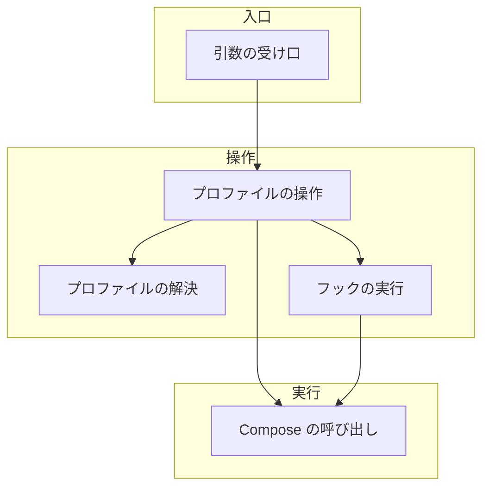
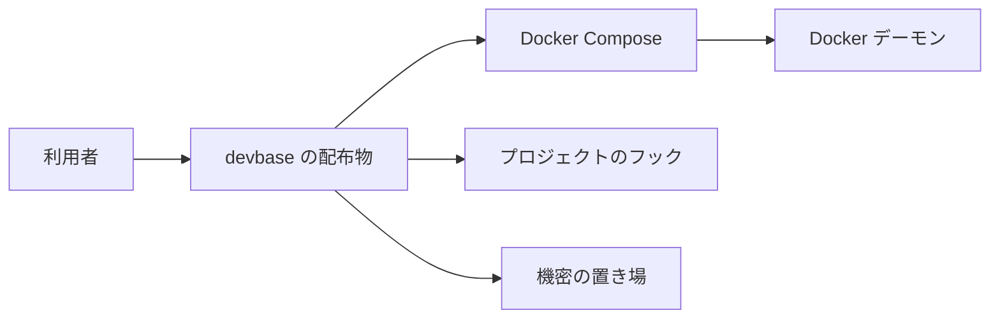
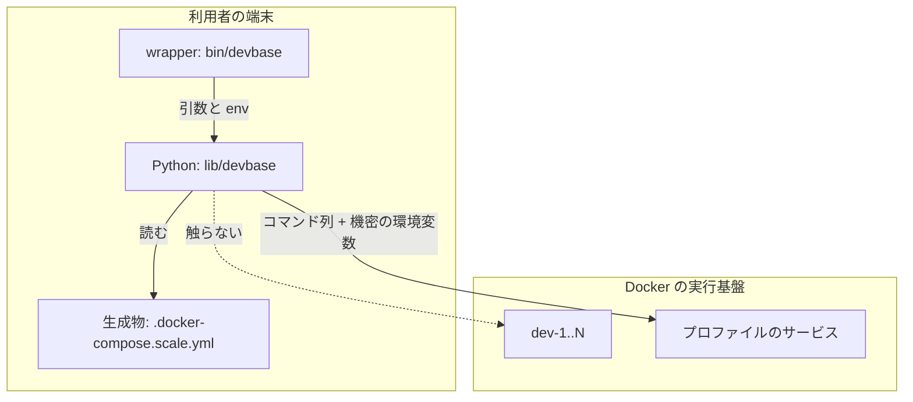
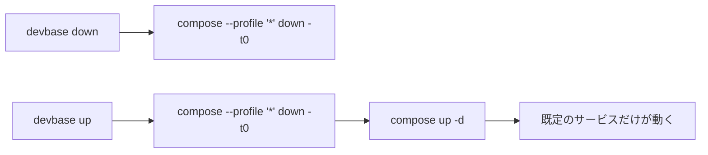

# 189: Compose の profiles で付随サービス群を後から起動・停止する

要求と受け入れ条件は [PLAN58_compose-profiles.md](PLAN58_compose-profiles.md) にある。この文書は「どう作るか」だけを扱う。

## 機能一覧

| # | 機能 | 誰が使うか |
| --- | --- | --- |
| F1 | プロファイルのサービスを起動する | プロジェクトの利用者 |
| F2 | プロファイルのサービスを停止して削除する | プロジェクトの利用者 |
| F3 | プロファイルの一覧と稼働状況を見る | プロジェクトの利用者 |
| F4 | 停止（`down` と `up` 冒頭）を全プロファイルへ効かせる | プロジェクトの利用者 |
| F5 | 有効なプロファイルをフックへ伝える | プロジェクトの作者 |

## 構成要素

| 要素 | 責務 |
| --- | --- |
| プロファイルの解決 | 生成済みの構成ファイルを読み、プロファイル名からサービス名の集合を求める。稼働状況は持たない |
| プロファイルの操作 | 起動・停止・一覧の 3 つの入口。接続先の反映と機密の注入を済ませてから Compose を呼ぶ |
| Compose の呼び出し | `docker compose` のコマンド列を組み立てて実行する。停止には全プロファイルを指定する |
| フックの実行 | プロジェクトの `./deploy` を、有効なプロファイルを環境変数へ載せて呼ぶ |
| 引数の受け口 | `project` / `container` の配下に `profile` のサブコマンドを足す |



## システム構成

### 文脈



Docker Compose と Docker デーモンは、こちらが変えられない外部の系である。プロジェクトのフックは各プロジェクトが持つ。devbase が定めるのは呼び出しの約束（環境変数）だけである。

### 配置



境界をまたぐのは 2 つである。Compose へ渡すコマンド列と、`_inject_secrets` がプロセスの環境へ載せた機密である。プロファイルの操作はサービス名を明示して渡す。そのため dev-1..N は再作成の対象に入らない。

## 置き場所

```text
lib/devbase/
├── cli.py                     # profile サブコマンドの登録（変更）
├── commands/
│   └── container.py           # cmd_profile_up / down / list、dispatch（変更）
├── project/
│   └── runtime.py             # hook_env に有効なプロファイルを足す（変更）
├── utils/
│   └── docker.py              # docker_compose_down を全プロファイル対応へ（変更）
└── volume/
    └── compose.py             # profiles を保つことの確認のみ（変更なし）

tests/
├── commands/
│   └── test_container_profile.py   # 新設
└── volume/
    └── test_compose_profiles.py    # 新設
```

## 構造

型は追加しない。変わるのは処理の順序と、関数の責務の境目である。

| 関数 | 変更 | 責務 |
| --- | --- | --- |
| `profile_services(compose: dict) -> dict[str, list[str]]` | 新設（`commands/container.py`） | 構成の辞書から「プロファイル名 → サービス名」を作る。純粋な処理で、終了コードも出力も持たない |
| `cmd_profile_up(profile, context)` | 新設 | F1。終了コードを返す |
| `cmd_profile_down(profile, context)` | 新設 | F2。終了コードを返す |
| `cmd_profile_list(context)` | 新設 | F3。終了コードを返す |
| `docker_compose_down(compose_file, all_profiles=True)` | 変更（`utils/docker.py`） | F4。`--profile '*'` を付けて呼ぶ |
| `hook_env(config, active_profiles=())` | 変更（`project/runtime.py`） | F5。`DEVBASE_ACTIVE_PROFILES` を足す |
| `_run_deploy_script_for_instances(...) -> bool` | 変更（`commands/container.py`） | 全インスタンスで成功したかを返す。`cmd_up` は戻り値を使わず、現在の警告だけの扱いを保つ |
| `_dispatch_lifecycle` | 変更 | `profile` のサブコマンドを handlers へ足す |

## 入出力の契約

仕様記述の置き場所は設けない。OpenAPI の対象になる経路が無く、変わる約束はコマンドだけである。

### 変わる約束

| 名前 | 入力 | 出力（成功） | 失敗の形 |
| --- | --- | --- | --- |
| `devbase project profile up [name] <profile>` | プロファイル名（必須）、プロジェクト名（省略時は現在地） | 対象サービスを起動し、フックを実行して 0 | 構成ファイルが無い / 未知のプロファイル / Compose かフックが失敗 → 1 |
| `devbase project profile down [name] <profile>` | 同上 | 対象サービスのコンテナを削除して 0 | 同上（フックは呼ばない） |
| `devbase project profile list [name]` | プロジェクト名（省略可） | プロファイルと稼働状況を表で出して 0 | 構成ファイルが無い → 1 |
| `devbase container profile ...` / `devbase ct profile ...` | 同上 | 同上。非推奨の警告を 1 行出す | 同上 |

`[name]` と `<profile>` の並びは既存の `scale` と同じ規則に従う。値が 1 個ならプロファイル名に割り当てられる。2 個なら（プロジェクト名、プロファイル名）になる。

### 互換性の扱い

| 変更 | 既存の呼び出し側への影響 |
| --- | --- |
| `profile` サブコマンドの追加 | 無い。既存の引数の形を変えない |
| `docker compose down` に `--profile '*'` を付ける | プロファイルを持たないプロジェクトでは対象が同じで、観測できる違いを生まない |
| `DEVBASE_ACTIVE_PROFILES` の追加 | 無い。既存のフックは読まなければ従来どおり動く |

`bin/devbase` の `_PROJECT_NAME_SUBCOMMANDS` は変えない。この一覧は「3 番目の引数をプロジェクト名として解決してよいサブコマンド」を表す。`profile` ではその位置に `up` / `down` / `list` が来る。一覧へ足すと、`up` という名前のプロジェクトが実在したときにそちらへ移動してしまう。プロジェクト名の解決は Python 側の `_dispatch_lifecycle` に任せる。

### 検査の手段

`uv run pytest tests/commands/test_container_profile.py -q` が、組み立てたコマンド列と終了コードを検査する。

## 処理の流れ


停止（F2）は同じ並びから、フックの呼び出しを除いたものである。渡すのは `up -d` ではなく `down <サービス...>` である。

`up` と `down` の冒頭の停止（F4）は次のように変わる。



## 非機能の実現方式

| 大項目 | 要求の条件 | 実現方式 | 確かめ方 |
| --- | --- | --- | --- |
| 運用・保守性 | プロファイルのサービスを起動・停止した記録が、既存のログと同じ体裁（`logger.info`）で残る | 対象サービス名とプロファイル名を `logger.info` で 1 行ずつ出す。Compose の出力はそのまま標準出力へ流す | `caplog` で起動・停止の各 1 行を検査する |
| セキュリティ | プロファイルのサービスへ渡す機密は、そのサービスが元々 `env_file` で参照していた由来のキーだけに限る | 生成済みの `.docker-compose.scale.yml` をそのまま使う。機密の列挙はこのファイルが既に持つため、プロファイルの操作は新しい注入経路を作らない。実行前に `_prepare_compose` で既存と同じ注入を通す | 生成物のサービスごとの `environment` が、プロファイルの有無で変わらないことをテストで検査する |
| システム環境 | Docker Compose v2 系および v5 系で動く。`--profile '*'` と `depends_on.required` を使う | `--profile '*'` は停止にだけ使う。ワイルドカードを解釈しない版では「`*` という名前のプロファイル」として扱われ、対象が現在と同じになる（機能は落ちるが壊れない） | v5.1.4 で全サービスが消えることを手動で確かめる。古い版は「未確認のまま残ること」に載せる |

`depends_on.required: false` はプロジェクト側の書き方であり、devbase の実装には現れない。文書で案内する。

## 決定の記録

### 決定 1: プロファイルの解決は生成済みの `.docker-compose.scale.yml` を読んで行う

`devbase` が Compose へ渡すのはこのファイルである。プロファイルの割り当てもここで確定している。元の `compose.yml` を読むと、生成の過程で加わる差を二重に解釈することになる。その差は機密の列挙と dev の複製である。

`docker compose config --services` を 2 回呼んで差を取る案は採らない。`list` のような読むだけの操作でも Docker デーモンへの接続が要る。変数の展開に失敗すると一覧すら出せない。

### 決定 2: プロファイルの操作はサービス名を明示して渡す

サービス名を省いて `--profile X up -d` とすると、既定のサービスも照合の対象に入る。機密は名前だけを列挙する形で生成物に書かれる。値はプロセスの環境から解決される。**照合の対象に入った時点で dev の構成が変わりうる。** そのため対象を明示し、dev を照合から外す。

### 決定 3: プロファイル起動の後は `./deploy` を呼び直す。新しいフックは作らない

`./deploy` は既にインスタンスごとに呼ばれ、プロジェクト側で冪等に書かれている。プロファイルの有無は `DEVBASE_ACTIVE_PROFILES` で分岐できる。フック名を増やす理由がない。

`./post-profile-up` のような新しい名前を足す案は採らない。プロジェクトが持つ約束の数が増える。どちらに書くべきかの判断も各プロジェクトに生まれる。

### 決定 4: 停止は全プロファイルを対象にし、`up` は既定の状態へ揃える

`devbase up` は「その構成で開発環境を作り直す」操作である。プロファイルのサービスだけが前の状態のまま残ると、`up` の後の状態が直前の操作に依存する。

`up` の冒頭の停止を dev-1..N だけに絞る案は採らない（利用者の指示、2026-09-16）。テストを続けたい場合は `up` の後にもう一度プロファイルを起動する。

### 決定 5: プロファイルの停止に `-t0` を使わない

プロファイルに入るのはデータベースのような状態を持つサービスである。`devbase down` は開発環境ごと畳む操作のため `-t0` で即座に落とす。プロファイルの停止は稼働中の開発環境を残したまま行う。こちらは既定の猶予（10 秒）で落とす。

### 決定 6: プロジェクト名は位置引数で受け、`bin/devbase` は変えない

既存の `scale` と同じ並び（`[name] <値>`）に揃える。`bin/devbase` の名前解決は 3 番目の引数だけを見る。`profile` をその一覧へ足すと、`up` / `down` / `list` がプロジェクト名として解決されうる。Python 側の `_dispatch_lifecycle` には名前を解決して移動する経路が既にある。そちらに寄せる。

## テスト設計

| 受け入れ条件 | 何で確かめるか |
| --- | --- |
| `profiles` 付きのサービスは `devbase up` で起動しない | Compose の既定の挙動。生成物が `profiles` を保つことを `tests/volume/test_compose_profiles.py` で検査する |
| `profile up X` で対象サービスだけが起動する | `subprocess.run` を差し替え、組み立てた引数列が `--profile X up -d <対象サービス>` であり、dev を含まないことを検査する |
| 既定のサービスの Container ID と `StartedAt` が変わらない | 手動確認（`alpine:3` の最小構成で `docker inspect` の値を前後で比較する） |
| `profile down X` でコンテナが削除され、ボリュームは残る | 引数列に `down <対象サービス>` が含まれ、`--volumes` を含まないことを検査する |
| `profile list` がプロファイル名と稼働状況を出す | 稼働中のサービスを返す偽の `docker compose ps` を与え、出力の行を検査する |
| 構成ファイルが無いときに 1 で止まる | 空の一時ディレクトリで呼び、終了コードと、コンテナを作る呼び出しが発生しないことを検査する |
| 未知のプロファイル名で 1 で止まる | 既知の名前が出力に並ぶことと終了コードを検査する |
| `project profile up <名前> X` が同じ結果になる | 引数の解釈（`[name] <profile>` の割り当て）を `tests/cli` の既存の書き方で検査する |
| `devbase down` が全プロファイルを消し、0 で終わる | 引数列に `--profile *` が含まれることを検査する。全体の削除は手動確認 |
| `devbase up` の後は既定のサービスだけが動く | 冒頭の停止が `--profile *` を通ることを検査する。実際の状態は手動確認 |
| フックが `DEVBASE_ACTIVE_PROFILES` を受け取る | `hook_env` の戻り値と、`subprocess.run` へ渡された `env` を検査する |
| フックの失敗が終了コードへ出る | 失敗する `./deploy` を置き、戻り値が 1 になることを検査する |
| プロファイルを持たないプロジェクトの挙動が変わらない | 既存の `tests/commands/test_container_up_order.py` と `tests/cli/test_up_roundtrips.py` が通ること |
| 生成物が `profiles` を保つ | `generate_scaled_compose` の出力を読み、非 dev サービスの `profiles` が残ることを検査する |

テストは実 docker と実 `DEVBASE_ROOT` に触れない。`subprocess.run` を差し替える。作業ディレクトリは `tmp_path` を使う。

## 未確認のまま残ること

| 項目 | 内容 |
| --- | --- |
| 古い Compose での `--profile '*'` | 手元で確かめたのは v5.1.4 のみ。ワイルドカードを解釈しない版での挙動（対象が現在と同じに留まる想定）は未確認 |
| プロファイルが複数同時に有効な場合 | `DEVBASE_ACTIVE_PROFILES` はカンマ区切りを許すが、同時に 2 つ以上を起動する操作は今回作らない。`profile up` を 2 回呼ぶと、2 回目のフックへ渡るのは 2 つ目の名前だけになる |
| プロファイルのサービスが dev を `depends_on` に持つ構成 | 今回の対象（dev → プロファイル）と向きが逆の依存は検証していない |
