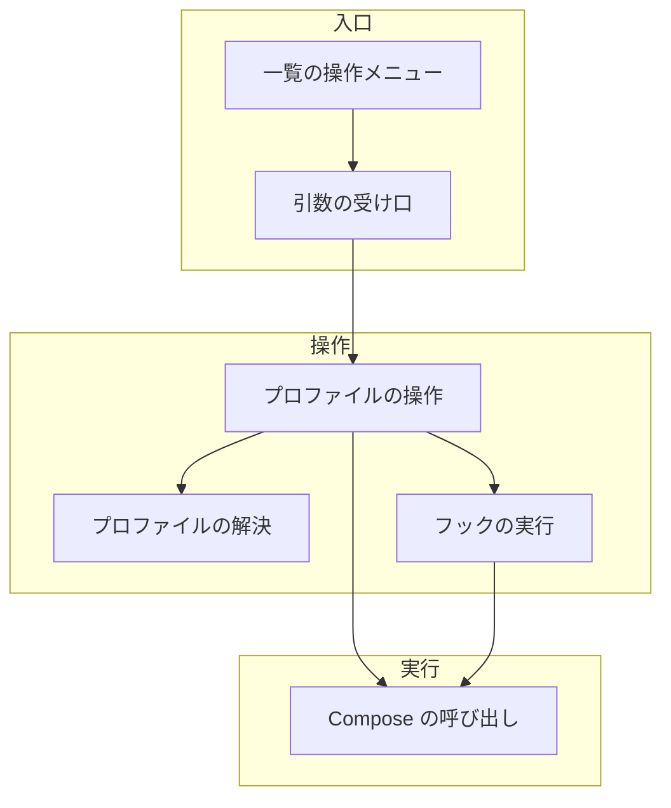
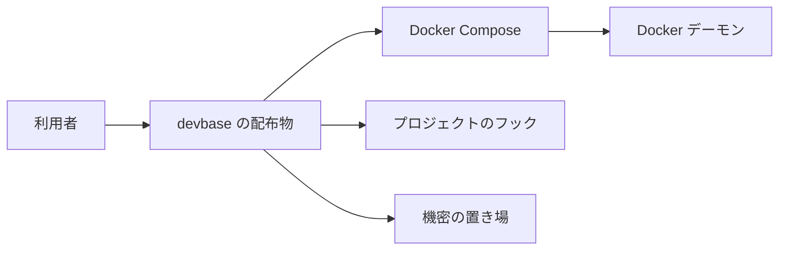
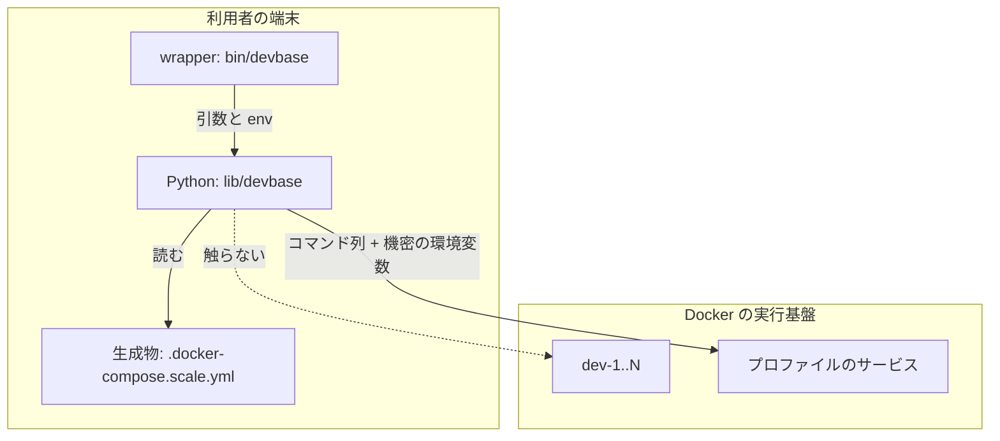
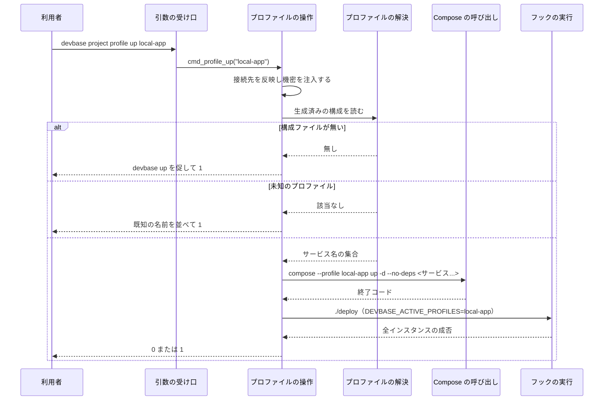
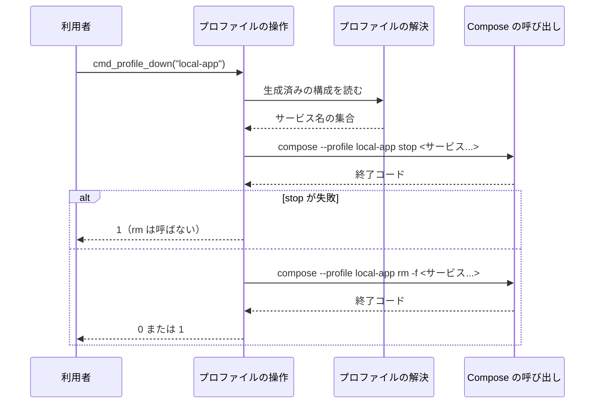
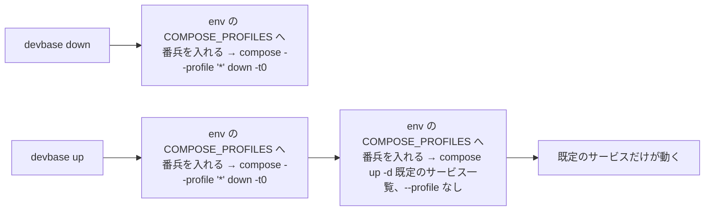

# 189: Compose の profiles で付随サービス群を後から起動・停止する

要求と受け入れ条件は [PLAN58_compose-profiles.md](PLAN58_compose-profiles.md) にある。この文書は「どう作るか」だけを扱う。

## 機能一覧

| # | 機能 | 誰が使うか |
| --- | --- | --- |
| F1 | プロファイルのサービスを起動する | プロジェクトの利用者 |
| F2 | プロファイルのサービスを停止して削除する | プロジェクトの利用者 |
| F3 | プロファイルの一覧と稼働状況を見る | プロジェクトの利用者 |
| F4 | 停止（`down` と `up` 冒頭）を全プロファイルへ効かせる | プロジェクトの利用者 |
| F5 | 有効なプロファイルをフックへ伝える | プロジェクトの作者 |
| F6 | `devbase list` の一覧から起動・停止する | プロジェクトの利用者 |

## 構成要素

| 要素 | 責務 |
| --- | --- |
| プロファイルの解決 | 生成済みの構成ファイルを読み、プロファイル名からサービス名の集合を求める。`profiles` を持たない既定のサービスの一覧も同じ場所から求める。稼働状況は持たない |
| プロファイルの操作 | 起動・停止・一覧の 3 つの入口。接続先の反映と機密の注入を済ませてから Compose を呼ぶ |
| Compose の呼び出し | `docker compose` のコマンド列を組み立てて実行する。起動には `--no-deps` を付ける。プロファイルの停止は `stop` と `rm -f` の 2 段で行う。全体の停止には全プロファイルを指定する。有効なプロファイルは devbase が `--profile` で決め、`COMPOSE_PROFILES` には番兵の名前を入れて渡す。`devbase up` の起動は既定のサービスを明示して渡す（決定 7） |
| フックの実行 | プロジェクトの `./deploy` を、有効なプロファイルを環境変数へ載せて呼ぶ。同じ環境変数は `./pre-up` にも渡る |
| 引数の受け口 | `project` / `container` の配下に `profile` のサブコマンドを足す |
| 一覧の操作メニュー | `devbase list` の起動中の行で、プロファイルの起動・停止を選ばせる。選ばせた後は共有のハンドラへ委譲する（F6） |



## システム構成

### 文脈



Docker Compose と Docker デーモンは、こちらが変えられない外部の系である。プロジェクトのフックは各プロジェクトが持つ。devbase が定めるのは呼び出しの約束（環境変数）だけである。

### 配置



境界をまたぐのは 2 つである。Compose へ渡すコマンド列と、`_inject_secrets` がプロセスの環境へ載せた機密である。この環境からは `COMPOSE_PROFILES` を取り除く。有効なプロファイルを決めるのは devbase の `--profile` だけにするためである（決定 7）。プロファイルの操作はサービス名をすべて明示して渡す。起動はさらに `--no-deps` を付ける。停止は対象を広げない `stop` と `rm -f` を使う（決定 5）。そのため dev-1..N はどちらの操作の対象にも入らない。

## 置き場所

```text
lib/devbase/
├── cli.py                     # profile サブコマンドの登録（変更）
├── commands/
│   └── container.py           # cmd_profile_up / down / list、default_services、_compose_run、dispatch（変更）
├── project/
│   └── runtime.py             # hook_env に有効なプロファイルを足す（変更）
├── tui/
│   └── actions_project.py     # 起動中の行の操作へ profile の 2 項目を足す（変更）
├── utils/
│   └── docker.py              # docker_compose が env= を組んで番兵を入れる、docker_compose_up が対象サービスを受ける、docker_compose_down が全プロファイルを対象にする（変更）
└── volume/
    └── compose.py             # profiles を保つことの確認のみ（変更なし）

tests/
├── cli/
│   └── tui/
│       └── test_profile_menu.py    # 新設（項目の出し分けと委譲の属性の検査）
├── commands/
│   └── test_container_profile.py   # 新設
├── utils/
│   └── test_docker_profiles.py     # 新設（子プロセスの env から COMPOSE_PROFILES が外れることの検査）
└── volume/
    └── test_compose_profiles.py    # 新設
```

## 構造

型は追加しない。変わるのは処理の順序と、関数の責務の境目である。

| 関数 | 変更 | 責務 |
| --- | --- | --- |
| `profile_services(compose: dict) -> dict[str, list[str]]` | 新設（`commands/container.py`） | 構成の辞書から「プロファイル名 → サービス名」を作る。純粋な処理で、終了コードも出力も持たない |
| `default_services(compose: dict) -> list[str]` | 新設（`commands/container.py`） | 構成の辞書から `profiles` を持たないサービス名を宣言順に返す。`cmd_up` が起動の対象として渡す（決定 7）。純粋な処理である |
| `cmd_profile_up(profile, context)` | 新設 | F1。プロファイルのサービスをすべて明示し、`--no-deps` を付けて起動する（決定 2）。終了コードを返す |
| `cmd_profile_down(profile, context)` | 新設 | F2。`docker_compose_down` は通さず、`stop` と `rm -f` の 2 段をサービス名付きで組む（決定 5）。終了コードを返す |
| `cmd_profile_list(context)` | 新設 | F3。終了コードを返す |
| `docker_compose(command, ...)` | 変更（`utils/docker.py`） | F1 / F2 / F4 の共通の土台。現在は `subprocess.run(cmd, ...)` を `env=` なしで呼ぶ。`env=` を新たに構築し、`COMPOSE_PROFILES` へ番兵の名前 `__devbase_none__` を入れて渡す（決定 7）。コマンド列の組み立て方は変えない |
| `docker_compose_up(compose_file, detach=True, services=())` | 変更（`utils/docker.py`） | 起動の対象を受け取り、`['up', '-d', *services]` を組む。空なら現在と同じ `['up', '-d']` になる |
| `_compose_run(subcommand, ...)` | 変更（`commands/container.py:269`） | `docker_compose` を経由せず直接 `subprocess.run` する経路（`ps` / `logs`）。同じ `env=` を組み立てて渡す（決定 7） |
| `_run_deploy_pipeline(...)` | 変更（`commands/container.py`） | 生成した `.docker-compose.scale.yml` から `default_services` を求め、`docker_compose_up` へ渡す |
| `docker_compose_down(compose_file)` | 変更（`utils/docker.py`） | F4。引数は増やさず、内部で無条件に `--profile '*'` を足す。`['down', '-t0']` という固定の形は変えない（決定 5） |
| `hook_env(config, active_profiles=())` | 変更（`project/runtime.py`） | F5。`DEVBASE_ACTIVE_PROFILES` を足す。`_run_pre_up_hook` と `_run_deploy_script_for_instances` の両方に効く |
| `_run_deploy_script_for_instances(deploy_script, indices, config=None, active_profiles=()) -> bool` | 変更（`commands/container.py`） | 全インスタンスで成功したかを返す。`active_profiles` を受け取り、加工せず `hook_env` へ渡す。`cmd_up` は戻り値を使わず、現在の警告だけの扱いを保つ |
| `_dispatch_lifecycle` | 変更 | `profile` を handlers へ 1 つ足し、`args.profile_subcommand` で 3 つの入口へ振り分ける |

`active_profiles` は `cmd_profile_up` からフックまで、引数として順に手渡す。`_run_deploy_script_for_instances` がこの引数を持たないと、`hook_env` へ値を届ける経路が無い。既存の呼び出しを壊さないため、既定は空のタプルとする。

| 呼び出し元 | 渡す値 | `./deploy` が受け取る `DEVBASE_ACTIVE_PROFILES` |
| --- | --- | --- |
| `cmd_up` | 省略（既定の `()`） | 空文字列 |
| `cmd_profile_up` | `(X,)`（起動したプロファイル名） | `X` |

`_run_deploy_script_for_instances` は受け取った値を加工せず `hook_env(config, active_profiles=active_profiles)` へ渡す。環境変数の名前と区切り（カンマ）を決めるのは `hook_env` だけである。

この変更では、渡る値は常にプロファイル名 1 つである。`cmd_profile_up` が受ける名前が 1 つだけで、同時に 2 つ以上を起動する操作を作らないためである。カンマ区切りは将来の拡張のための予約であり、現時点でその形になる経路は無い（「未確認のまま残ること」）。

`_run_deploy_script_for_instances` へ渡す `indices` は `range(1, scale + 1)` である。`scale` は `project.yml` の `config.scale` から取る。未指定なら `project_runtime.DEFAULT_SCALE`（現在は 2）を使う。`cmd_up` が使っている解決の式をそのまま再利用する。`.docker-compose.scale.yml` の `dev-*` を数え直すことはしない。

`profile` の subparser は `dest` を親と分ける。親の `project` / `container` は `dest='subcommand'` のままとし、入れ子側は `dest='profile_subcommand'` を使う。`cli.py` の `_dispatch` は `args.subcommand == 'list'` を見て `project list`（プロジェクト一覧）へ振り分けるためである。入れ子で `subcommand` を再利用すると、`devbase project profile list` がそちらへ流れてしまう。`_dispatch_lifecycle` の handlers には `'profile'` を 1 つだけ足す。その中で `profile_subcommand` を見て up / down / list を選ぶ。

## 入出力の契約

仕様記述の置き場所は設けない。OpenAPI の対象になる経路が無く、変わる約束はコマンドだけである。

### 変わる約束

| 名前 | 入力 | 出力（成功） | 失敗の形 |
| --- | --- | --- | --- |
| `devbase project profile up [name] <profile>` | プロファイル名（必須）、プロジェクト名（省略時は現在地） | 対象サービスを起動し、フックを実行して 0 | 構成ファイルが無い / 未知のプロファイル / Compose かフックが失敗 → 1 |
| `devbase project profile down [name] <profile>` | 同上 | 対象サービスを停止し、そのコンテナを削除して 0 | 同上。`stop` と `rm -f` のどちらかが失敗すれば 1（フックは呼ばない） |
| `devbase project profile list [name]` | プロジェクト名（省略可） | プロファイルと稼働状況を表で出して 0 | 構成ファイルが無い → 1 |
| `devbase container profile up <profile>` / `down <profile>` / `list`（`ct` も同じ） | プロファイル名のみ。プロジェクト名は受け付けない | 同上。非推奨の警告を 1 行出す | 同上 |

`project` の `[name]` と `<profile>` の並びは既存の `scale` と同じ規則に従う。値が 1 個ならプロファイル名に割り当てられる。2 個なら（プロジェクト名、プロファイル名）になる。

`container` / `ct` は `[name]` を持たない。値は常にプロファイル名である。`container` 群のサブコマンドは現在地のプロジェクトで動く既存の規約に従う。この非対称は `project` / `container` の既存の作りと同じである。

### 一覧の操作メニュー

`devbase list` で起動中の行を選ぶと操作の一覧が出る。そこへ 2 項目を足す。

| 項目 | 選んだ後 | 実行後 |
| --- | --- | --- |
| テスト用サーバ起動 (profile up) | プロファイル名を選ばせ、`profile up` を実行する | 一覧へ戻る |
| テスト用サーバ停止 (profile down) | 同じくプロファイル名を選ばせ、`profile down` を実行する | 一覧へ戻る |

**2 項目が出るのは、そのプロジェクトがプロファイルを持つときだけである**（決定 8）。持たないプロジェクトでは一覧の中身が現在と同じになる。

プロファイル名の選択は、名前が 1 つだけのときも選択として出す。名前は `.docker-compose.scale.yml` から読む。生成物が無い（`devbase up` の前）ときは 2 項目を出さない。

実行は `dispatch_lifecycle('profile', name, profile_subcommand='up', profile='<名前>')` で共有のハンドラへ渡す。TUI はコマンドの中身を持たない。

### プロファイルの決め方

有効なプロファイルは devbase が経路ごとに明示して決める。利用者の環境や `.env` の値で、起動する対象が変わらないようにする（決定 7）。

| 経路 | `--profile` | 対象の渡し方 | `COMPOSE_PROFILES` |
| --- | --- | --- | --- |
| `devbase up` の起動 | 付けない | 既定のサービスをすべて明示する | 番兵の名前 `__devbase_none__` を入れる |
| `devbase down` と `up` 冒頭の停止 | `--profile '*'` | 渡さない | 同上 |
| `profile up X` / `profile down X` | `--profile X` | 対象のサービスをすべて明示する | 同上 |

`COMPOSE_PROFILES` は空文字列にしない。どのプロジェクトも定義しない番兵の名前を入れる。空文字列の扱いが版で違う可能性を調べずに済むためである。

**キーを外すだけでは足りない。** Compose は環境変数が無ければプロジェクトの `.env` を読む。値を入れて上書きし、あわせて `devbase up` の起動では既定のサービス名も明示する（決定 7）。

### `profile list` の表

| 列 | 内容 |
| --- | --- |
| PROFILE | プロファイル名。生成物に現れた順で並べる |
| SERVICES | そのプロファイルに属するサービス名。宣言順にカンマ区切りで並べる |
| RUNNING | `稼働数/総数` と状態語。例: `3/3 running`、`1/3 partial`、`0/3 stopped` |

状態語の決め方は次のとおりである。

| 稼働数 | 状態語 |
| --- | --- |
| 総数と同じ | `running` |
| 1 以上で総数未満 | `partial` |
| 0 | `stopped` |

稼働の判定には `docker compose ps --format json` を使う。`State` が `running` のサービスだけを数える。`exited` や `paused` は稼働に数えない。プロファイルが 1 つも無ければ、見出しの行だけを出して 0 で終わる。

### 互換性の扱い

| 変更 | 既存の呼び出し側への影響 |
| --- | --- |
| `profile` サブコマンドの追加 | 無い。既存の引数の形を変えない |
| `docker compose down` に `--profile '*'` を付ける | プロファイルを持たないプロジェクトでは対象が同じになる。Docker Compose v5.1.4 で確認済み。2.20.0 以上 5.x 未満は未検証 |
| `DEVBASE_ACTIVE_PROFILES` の追加 | 無い。既存のフックは読まなければ従来どおり動く |
| `COMPOSE_PROFILES` を子プロセスへ渡さない | devbase 経由の Compose だけが対象。素の `docker compose` を手で叩く経路には影響しない |
| `devbase up` の起動に既定のサービス名を明示する | 対象は現在と同じ（`profiles` を持たないサービスの全件）。生成物は `up` のたびに作り直すため、一覧が古くなることはない |

`--profile '*'` の行だけは、影響の範囲が広い。この経路は `devbase down` と `devbase up` 冒頭の停止に入るため、プロファイルを使わない既存の全プロジェクトを通る。だから「退行しないこと」の受け入れ条件に直結する。

対象が変わらないと言えるのは、確かめた版だけである。ワイルドカードを解釈しない版で `*` がリテラルのプロファイル名として扱われるかは「未確認のまま残ること」に載せたままであり、ここでも断定しない。

| 版 | `--profile '*'` を付けた `down` の対象 | 根拠 |
| --- | --- | --- |
| v5.1.4 | 現在と同じ | 手元で確認済み |
| 2.20.0 以上 5.x 未満 | 現在と同じになる想定 | 未検証 |

`bin/devbase` の `_PROJECT_NAME_SUBCOMMANDS` は変えない。現在の中身は `up down ps logs scale rebuild` である。この一覧は「3 番目の引数をプロジェクト名として解決してよいサブコマンド」を表す。`profile` ではその位置に `up` / `down` / `list` が来る。一覧へ足すと、`up` という名前のプロジェクトが実在したときにそちらへ移動してしまう。プロジェクト名の解決は Python 側の `_dispatch_lifecycle` に任せる。

同じ一覧から `login` / `build` も外れている。この 2 つは `project` でも `[name]` を受け付けない。`profile` が `container` で `[name]` を受け付けないのも同じ筋である。

### 検査の手段

`uv run pytest tests/commands/test_container_profile.py -q` が、組み立てたコマンド列と終了コードを検査する。`uv run pytest tests/utils/test_docker_profiles.py -q` が、子プロセスへ渡す環境から `COMPOSE_PROFILES` が外れていることを検査する。同じテストで、`devbase up` の起動が既定のサービス名をすべて渡すことも検査する。

## 処理の流れ



停止（F2）は同じ並びから、フックの呼び出しを除いたものである。Compose を呼ぶ回数だけが 2 回になる。



`down` は使わない。`docker_compose_down` も通らない。理由は決定 5 に書く。

`--profile` は subcommand より前に置く必要がある。`docker_compose` は `-f` の後に、渡された配列をそのまま並べる。そのため `--profile X` を配列の先頭へ入れる。組み立てるコマンド列は次のとおりである。`<サービス...>` はどれもプロファイル X に属するサービスの全件である（決定 2）。

| 操作 | コマンド列 | 子プロセスの `COMPOSE_PROFILES` |
| --- | --- | --- |
| プロファイルの起動 | `['--profile', X, 'up', '-d', '--no-deps', <サービス...>]` | 番兵 |
| プロファイルの停止（1 段目） | `['--profile', X, 'stop', <サービス...>]` | 番兵 |
| プロファイルの停止（2 段目） | `['--profile', X, 'rm', '-f', <サービス...>]` | 番兵 |
| `devbase up` の起動 | `['up', '-d', <既定のサービス...>]`（`--profile` を付けない） | 番兵 |
| `devbase down` / `up` 冒頭の停止 | `['--profile', '*', 'down', '-t0']` | 番兵 |

`devbase up` の `<既定のサービス...>` は、生成物のうち `profiles` を持たないサービスの全件である（決定 7）。`--profile` を付けないことと合わせて、プロファイルのサービスは対象に入らない。

`up` と `down` の冒頭の停止（F4）は次のように変わる。`COMPOSE_PROFILES` の除去は `docker_compose` と `_compose_run` の両方に共通で効く（決定 7）。



この上書きが無いと、`COMPOSE_PROFILES=test` を持つ端末で `devbase up` が test のサービスまで起動する。`up` 冒頭の停止は `--profile '*'` で全部を落とすため、残骸ではなく新しい起動として現れる。`.env` に書かれた値も、環境変数が優先される規則で無効になる（決定 7）。

## 非機能の実現方式

| 大項目 | 要求の条件 | 実現方式 | 確かめ方 |
| --- | --- | --- | --- |
| 運用・保守性 | プロファイルのサービスを起動・停止した記録が、既存のログと同じ体裁（`logger.info`）で残る | 対象サービス名とプロファイル名を `logger.info` で 1 行ずつ出す。Compose の出力はそのまま標準出力へ流す | `caplog` で起動・停止の各 1 行を検査する |
| セキュリティ | プロファイルのサービスへ渡す機密は、そのサービスが元々 `env_file` で参照していた由来のキーだけに限る | 生成済みの `.docker-compose.scale.yml` をそのまま使う。機密の列挙はこのファイルが既に持つため、プロファイルの操作は新しい注入経路を作らない。実行前に `_prepare_compose` で既存と同じ注入を通す | 生成物のサービスごとの `environment` が、プロファイルの有無で変わらないことをテストで検査する |
| システム環境 | Docker Compose 2.20.0 以上で動く。devbase が使うのは `--profile '*'`、`--no-deps`、サービスを明示した `up` / `stop` / `rm -f` である | 最低対応版を 2.20.0 とする。`--no-deps` は起動にだけ、`--profile '*'` は全体の停止にだけ使う。プロファイルの停止は `stop` と `rm -f` で行い、`down` のサービス指定は使わない（決定 5）。ワイルドカードを解釈しない版では「`*` という名前のプロファイル」として扱われ、対象が現在と同じになる想定である（未検証）。あわせて `docker_compose` が `COMPOSE_PROFILES` へ番兵の名前を入れ、`devbase up` の起動では既定のサービスを明示する（決定 7）。サービスを明示した `up` も 2 系全般で使えるため、どちらも版の下限を作らない | v5.1.4 で全サービスが消えることを手動で確かめる。同じ版で、プロファイルを持たないプロジェクトの `up` / `down` が従来どおり動くことも確かめる。`COMPOSE_PROFILES=test` を環境変数と `.env` の両方に置いて `devbase up` を通し、既定のサービスだけが動くことも確かめる。`--profile '*'` が使える最古の版は公式ドキュメントに記載が無く、2.20.0 以上 5.x 未満は未検証のまま「未確認のまま残ること」に載せる |

起動で既定のサービスを対象から外すのは `--no-deps` である。停止で対象から外すのは、サービスを明示した `stop` / `rm -f` である。どれも古くからある形で、版の下限を作らない。下限を決めるのは `depends_on.required` だけである。この属性は 2.20.0 からの機能で、受け入れ条件と文書の構成例が使う。そのため 2.20.0 未満では、構成の検証そのものに失敗する。

| 版 | 扱い |
| --- | --- |
| 2.20.0 以上 | 対応する。手元で確かめたのは v5.1.4 |
| 2.20.0 未満の v2 | 対象外。`required: false` を書いた構成の検証に失敗する |

`depends_on.required: false` を書くのはプロジェクト側であり、devbase の実装には現れない。文書で案内する。ただし dev を対象から外す働きは持たない。その役目は `--no-deps` が担う（決定 2）。

## 決定の記録

結論と理由、採らなかった案は [PLAN58_compose-profiles-decisions.md](PLAN58_compose-profiles-decisions.md) にある。決定は 8 件である。

## テスト設計

| 受け入れ条件 | 何で確かめるか |
| --- | --- |
| `profiles` 付きのサービスは `devbase up` で起動しない | Compose の既定の挙動。生成物が `profiles` を保つことを `tests/volume/test_compose_profiles.py` で検査する |
| `profile up X` で対象サービスだけが起動する | `subprocess.run` を差し替え、組み立てた引数列が `--profile X up -d --no-deps <対象サービス...>` であり、dev を含まないことを検査する |
| プロファイルのサービスをすべて渡す | 同じ引数列に、プロファイル X に属するサービスが全件並ぶことを検査する。1 つでも欠けると `--no-deps` で起動しないため（決定 2） |
| 既定のサービスの Container ID と `StartedAt` が変わらない | 手動確認（`alpine:3` の最小構成で `docker inspect` の値を前後で比較する） |
| `depends_on: dev` を持つプロファイルサービスで dev が再作成されない | 手動確認。`depends_on: {dev: {condition: service_started, required: false}}` の構成と `depends_on: [dev]` の構成の両方で `profile up X` を実行し、dev-1..N の Container ID と `StartedAt` を前後で比べる |
| dev の環境変数の値が変わっても dev が再作成されない | 手動確認。機密など dev の環境変数の値を変えてから `profile up X` を実行し、dev-1..N の Container ID と `StartedAt` を前後で比べる。`--no-deps` が無い組み立てでは再作成が起きることも確かめ、この選択肢が要ることを示す |
| 生成物が `depends_on` の `required` を保つ | `generate_scaled_compose` の出力で、`depends_on: {dev: {condition: service_started, required: false}}` が `dev-1`..`dev-N` へ写り、各要素に `condition` と `required` が残ることを検査する |
| `profile down X` でコンテナが削除され、ボリュームは残る | 2 回の呼び出しが `--profile X stop <対象サービス...>` と `--profile X rm -f <対象サービス...>` であり、`down` も `-v` / `--volumes` も含まないことを検査する。`stop` が失敗したときに `rm` が呼ばれず 1 で終わることも見る |
| dev がプロファイルのサービスへ `depends_on` を持っても dev が止まらない | 手動確認。dev に `depends_on: {db: {condition: service_started, required: false}}` を書いた構成で `profile up X` → `profile down X` を通し、dev-1..N の Container ID と `StartedAt` を停止の前後で比べる。`down db` の組み立てでは dev が消えることも確かめ、`stop` / `rm` へ寄せる必要を示す（決定 5） |
| `profile list` がプロファイル名と稼働状況を出す | 稼働中のサービスを返す偽の `docker compose ps` を与え、出力の行を検査する。全稼働・一部稼働・全停止の 3 通りで `3/3 running` / `1/3 partial` / `0/3 stopped` を確かめる |
| `project profile list` が `project list` へ流れない | `profile_subcommand` の分離を、`devbase project profile list` の解析結果と呼ばれたハンドラで検査する |
| 構成ファイルが無いときに 1 で止まる | 空の一時ディレクトリで呼び、終了コードと、コンテナを作る呼び出しが発生しないことを検査する |
| 未知のプロファイル名で 1 で止まる | 既知の名前が出力に並ぶことと終了コードを検査する |
| `project profile up <名前> X` が同じ結果になる | 引数の解釈（`[name] <profile>` の割り当て）を `tests/cli` の既存の書き方で検査する |
| `devbase down` が全プロファイルを消し、0 で終わる | 引数列に `--profile *` が含まれることを検査する。全体の削除は手動確認 |
| `devbase up` の後は既定のサービスだけが動く | 冒頭の停止が `--profile *` を通ることと、起動の引数列に `--profile` が入らないことを検査する。実際の状態は手動確認 |
| `COMPOSE_PROFILES` が環境変数に設定されていても `devbase up` は既定のサービスだけを起動する | `COMPOSE_PROFILES=test` を `monkeypatch.setenv` で置き、`docker_compose` と `_compose_run` が組み立てた `env` の値が `__devbase_none__` であることを検査する。`up` の起動・`down`・`profile up` / `down` の各経路で見る。実際の状態は手動確認 |
| `.env` に `COMPOSE_PROFILES` が書かれていても `devbase up` は既定のサービスだけを起動する | 組み立てた `env` の値と、`up -d` の引数へ並ぶ既定のサービス名を検査する。既定のサービスがプロファイルのサービスへ `depends_on` を持つ構成での実際の起動は手動確認で見る |
| フックが `DEVBASE_ACTIVE_PROFILES` を受け取る | `hook_env` の戻り値と、`subprocess.run` へ渡された `env` を検査する。`cmd_up` 経由は空文字列、`cmd_profile_up` 経由はプロファイル名 1 つになることを見る。複数値はこの範囲では作れないため検査しない |
| フックの失敗が終了コードへ出る | 失敗する `./deploy` を置き、戻り値が 1 になることを検査する |
| 一覧の操作に 2 項目が並ぶ | プロファイルを持つ構成で `_running_ops` の戻り値を検査する |
| プロファイルを持たないプロジェクトでは 2 項目が出ない | 同じ関数へプロファイルの無い構成を与え、現在と同じ並びになることを検査する |
| 一覧から実行しても dev が変わらない | 委譲へ渡る属性が `profile` のサブコマンドと名前であることを検査する。実際の状態は手動確認 |
| プロファイルを持たないプロジェクトの挙動が変わらない | 既存の `tests/commands/test_container_up_order.py` と `tests/cli/test_up_roundtrips.py` が通ること |
| プロファイルを持たないプロジェクトで `up` / `down` が従来どおり動く | 手動確認（確認済みの v5.1.4 で実施）。`profiles:` を持たない既存のプロジェクトで `devbase up` と `devbase down` を通し、起動するコンテナの集合と `down` 後に残らないことを確かめる。`--profile '*'` がこの経路に入るため |
| 生成物が `profiles` を保つ | `generate_scaled_compose` の出力を読み、非 dev サービスの `profiles` が残ることを検査する |

テストは実 docker と実 `DEVBASE_ROOT` に触れない。`subprocess.run` を差し替える。作業ディレクトリは `tmp_path` を使う。

## 未確認のまま残ること

| 項目 | 内容 |
| --- | --- |
| `--profile '*'` が使える最古の版 | 公式ドキュメント（[profiles](https://docs.docker.com/compose/how-tos/profiles/)）に版の記載が無く、確かめられなかった。最低対応版は `depends_on.required` の 2.20.0 を根拠に定めた |
| 古い Compose での `--profile '*'` | 確認済みは v5.1.4 のみ。2.20.0 以上 5.x 未満は未検証。ワイルドカードを解釈しない版で `*` がリテラルのプロファイル名として扱われるか（対象が現在と同じに留まる想定）は未確認 |
| プロファイルが複数同時に有効な場合 | 同時に 2 つ以上を起動する操作は作らない。よって `DEVBASE_ACTIVE_PROFILES` は常に単一値で、カンマ区切りは将来の拡張のための予約である。`profile up` を 2 回呼ぶと、2 回目のフックへ渡るのは 2 つ目の名前だけになる |
