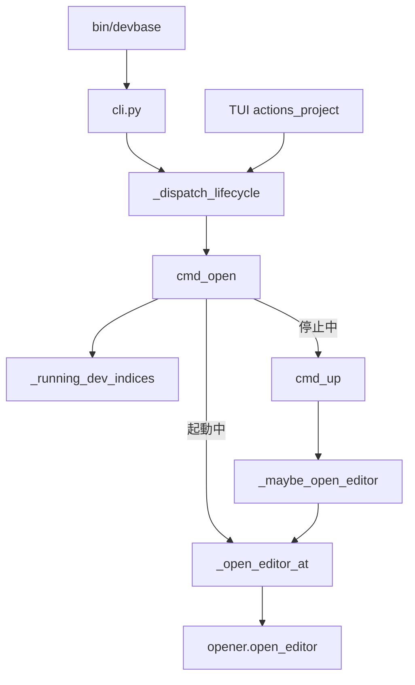
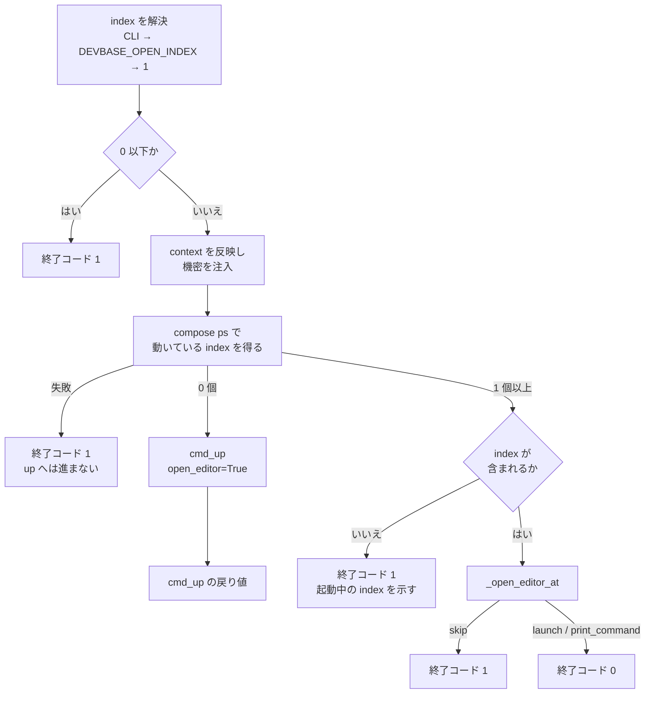

# PLAN59: `devbase open` の設計

要求と受け入れ条件は [PLAN59_editor-open.md](PLAN59_editor-open.md) にある。この文書は「どう作るか」だけを扱う。

## 機能一覧

| # | 機能 | 誰が使うか |
| --- | --- | --- |
| F1 | 起動中のプロジェクトで、コンテナに触らず dev コンテナへ接続した窓を開く | devbase の利用者（CLI） |
| F2 | 停止中のプロジェクトで、起動してから窓を開く（`up --open` へ委譲） | devbase の利用者（CLI） |
| F3 | 別ディレクトリからプロジェクト名を指定して F1 / F2 を行う | devbase の利用者（CLI） |
| F4 | `devbase list` の起動中のサブメニューの先頭から F1 を選ぶ | devbase の利用者（TUI） |

## 構成要素

| 要素 | 変更 | 責務 |
| --- | --- | --- |
| `cli.py` の `_add_open_subparser`（新設） | 足す | `open` の引数（`[name]`・`--open-index N`・`--context NAME`）を登録する。`project` / `container` / トップレベルで共有する |
| `cli.py` の `SHORTCUTS` / `SUBCMD_MAP` / parser の epilog | 変える | `open` をトップレベルのショートカットと、`project` / `container` のサブコマンドへ加える |
| `bin/devbase` | 変える | `resolve_command` の候補、Python 実装のコマンドの `case`、`_PROJECT_NAME_SUBCOMMANDS`、`_NAME_RESOLVABLE_SHORTCUTS` に `open` を加える |
| `container.py` の `_dispatch_lifecycle` | 変える | `handlers` に `'open'` を足す |
| `container.py` の `cmd_open`（新設） | 足す | 起動中の判定・index の検査・開く処理の呼び出し、または `cmd_up` への委譲 |
| `container.py` の `_running_dev_indices`（新設） | 足す | `docker compose ps --format json` を 1 回呼び、動いている dev インスタンスの index を返す |
| `container.py` の `_open_editor_at`（`_maybe_open_editor` から切り出し） | 変える | 開く対象（フォルダ / ワークスペース）と接続先を組み、`opener.open_editor` を呼んで action を返す。有効判定と index の解決は持たない |
| `container.py` の `_maybe_open_editor` | 変える | 有効判定と index の解決だけを残し、開く処理は `_open_editor_at` へ渡す。`up` から見た振る舞いは変えない |
| `tui/actions_project.py` の `_RUNNING_OPS` / `_OP_HANDLERS` | 変える | 先頭に `("エディタを開く (open)", "open")`、ハンドラに `dispatch_lifecycle("open", name, open_index=None)`。先頭の理由のコメントを書き替える |
| `etc/devbase-completion.bash` / `etc/_devbase` | 変える | トップレベル・`project`・`container` の候補に `open` を加え、`[name]` の補完を `up` と同じにする |
| `docs/user/cli-reference/02-project.md` / `CHANGELOG.md` | 変える | 利用者向けの説明と変更履歴 |

`opener.open_editor` / `opener.decide_action` と `cmd_up` は変えない。

下の図は呼び出しの関係だけを描く。呼び出しを持たない補完（`etc/`）と文書（`docs/`・`CHANGELOG.md`）は図に含めない。



## 配置

### システムの文脈

devbase はホストで動き、2 つの外部に触る。docker daemon（`--context` の先を含む）と、ホストの VS Code（`code` CLI）である。`open` の起動中の経路が docker daemon に対して行うのは、読み取りの `docker compose ps` だけである。コンテナ・ボリューム・ネットワークは作らない。


### モジュールの置き場所

```text
bin/devbase                       # 入口のシェル。name 解決とコマンドの振り分け
etc/
├── devbase-completion.bash       # bash 補完
└── _devbase                      # zsh 補完
lib/devbase/
├── cli.py                        # parser とショートカット
├── commands/container.py         # cmd_open / _running_dev_indices / _open_editor_at
├── editor/opener.py              # 変えない
└── tui/actions_project.py        # 起動中のサブメニュー
```

## 入出力の契約

### コマンド `open`

| 項目 | 内容 |
| --- | --- |
| 名前 | `devbase open [name]` / `devbase project open [name]` / `devbase container open`。前方一致の `devbase o` も `open` に解決する |
| 入力 | `name`（任意。`project` とトップレベルだけ）、`--open-index N`（任意の整数）、`--context NAME`（任意。空は usage エラー） |
| 出力（成功） | 起動中: `opener.open_editor` が `launch`（エディタを起動）または `print_command`（SSH で手元のコマンドを提示）を返し、終了コード 0。停止中: `cmd_up` の戻り値をそのまま返す |
| 失敗の形 | 下の表 |
| 互換性 | 追加のみ。既存のコマンドと前方一致の解決（`l` → `login`、`project p` → `ps`）は変わらない |

| 状況 | 終了コード | 出力 |
| --- | --- | --- |
| `--open` / `--no-open` を渡した | 2 | argparse の usage エラー |
| `--open-index` が 0 以下 | 1 | `open index N は 1 以上を指定してください` |
| 起動中で、index が動いているインスタンスに無い | 1 | `dev-N は起動していません。起動中: 1, 2` |
| `docker compose ps` が 0 以外で終わった・呼べなかった | 1 | `コンテナの状態を取得できません: <理由>`。`up` へは委譲しない |
| 起動中で、`opener.open_editor` が `skip` を返した（非 TTY・`code` が無い） | 1 | `opener` が出す理由（info）。開けなかったことを終了コードで示す |
| `name` が解決できない | 1 | 既存の `_enter_project` の候補提示 |

### `_running_dev_indices(dev_service_name, compose_file) -> list[int]`

- `docker compose [-f <compose_file>] ps --format json` を `compose_env()` の環境で 1 回呼ぶ。`-a` を付けないため、止まっているコンテナは出ない
- 出力は NDJSON と JSON 配列の両方を読む（`opener._parse_compose_ps_name` と同じ 2 形式）
- `Service` が `{dev}-{数字}` で `State` が `running` の行から数字を集め、昇順で返す
- 呼び出しの失敗（例外・0 以外の終了コード）は `DevbaseError` にする。0 個と区別するため `None` や空で握り潰さない
- `compose_file` は `.docker-compose.scale.yml`。無ければ（一度も `up` していない）呼ばずに空を返す

### TUI

| 項目 | 変更後 |
| --- | --- |
| `_RUNNING_OPS` の先頭 | `("エディタを開く (open)", "open")`。以下は既存の `up` / `down` / `login` … の順 |
| `_OP_HANDLERS["open"]` | `lambda root, name: dispatch_lifecycle("open", name, open_index=None)` |
| `_BACK_TO_TOP_OPS` | 変えない（`open` を含めない） |

## 処理の流れ

分岐と合流が主題のため、呼び出しの相手ではなく判定の順に描く。



停止中から `cmd_up` へ委譲するときは、`open_index` に**利用者が渡した値**（未指定なら `None`）を渡す。`cmd_up` は既存どおり `DEVBASE_OPEN_INDEX` を読み、範囲外は警告して 1 へ落とす（仕様の前提 3）。

## 非機能の実現方式

| 大項目 | 要求の条件 | 実現方式 | 確かめ方 |
| --- | --- | --- | --- |
| 性能・拡張性 | 起動中の経路で docker を呼ぶのは、起動中の判定の `docker compose ps` 1 回と、`opener.open_editor` 内の既存の呼び出しだけ | `cmd_open` は `_run_deploy_pipeline`・`_run_pre_up_checks`・`_auto_snapshot` を呼ばない。起動中の判定は `_running_dev_indices` の 1 回に集める | 単体テストで `subprocess.run` と `cmd_up` 系の関数を差し替え、起動中の経路で compose の呼び出しが `ps` 1 回だけであることを見る |
| 運用・保守性 | 停止中から `up` へ委譲するときは、その旨を info ログに 1 行出す | `cmd_up` を呼ぶ直前に `dev コンテナが起動していないため up を実行します` を info で出す | 単体テストで caplog を見る |

## 決定の記録

### 決定 1: 起動中の判定は「dev インスタンスが 1 つ以上動いているか」で行い、index の検査と分ける

issue の案は「開く index のコンテナ名が解決できない → 停止中」だった。この判定では、scale 1 で動いているプロジェクトに `--open-index 2` を渡すと停止中と見なし、`up` で環境を作り直してしまう。窓を開くだけのつもりの操作が、起動済みのコンテナを止めて作り直す操作に化ける。0 個と「その index だけ無い」を分け、前者だけを `up` へ委譲する。

`opener.resolve_container_name` は使わない。問い合わせに失敗すると決定的な名前へ落ちる設計で、起動していなくても名前を返すため判定に使えない。

### 決定 2: 状態を取得できないときは `up` へ委譲せずに止まる

`docker compose ps` が失敗した（daemon に届かない・構成の補間に失敗した）ことは、停止中を意味しない。ここで `up` へ進むと、動いている環境を作り直す可能性がある。`up` の側で同じ原因により失敗するとしても、利用者が「なぜ起動が走ったか」を読み違えないよう、`open` の入口で止める。

### 決定 3: 開く処理は `_maybe_open_editor` から切り出して共有し、有効判定を持たせない

開く対象の組み立てだけを `_open_editor_at` に切り出す。組み立てるのは、フォルダかワークスペースか・compose file・接続先の 3 つである。有効判定と index の解決は、呼び出し側がそれぞれ持つ。

`open` は明示の操作なので、`DEVBASE_OPEN_EDITOR` と `project.yml` の `open_editor` を見ない（仕様の受け入れ条件 2）。`_maybe_open_editor` へ `open_flag=True` を渡す形は採らない。その経路は範囲外の index を 1 へ落とす（`up` のための既存の振る舞い）。そのため受け入れ条件 5 と両立しない。

### 決定 4: 停止中は `cmd_up(open_editor=True)` へ委譲し、自前で開き直さない

`up` の `[6/6]` がすでに開く処理を持っている。起動の直後に開くための compose file（`_run_deploy_pipeline` が返したもの）も、そこで決まる。`cmd_open` が `up` の後にもう一度開くと、窓が 2 つ出るか、`up` 側の有効判定との二重管理になる。`open_editor=True` を渡すことで、`DEVBASE_OPEN_EDITOR=0` の端末でも窓が開く（受け入れ条件 4）。

### 決定 5: `opener.open_editor` が `skip` を返したら終了コード 1 にする

`up` では窓を開けなくても成功とする（起動が主目的のため）。`open` は窓を開くことだけが目的なので、非 TTY や `code` が無いことで何もしなかった場合は失敗として返す。`print_command`（SSH でコマンドを提示）は利用者が次にすべきことを出しているため成功とする。

### 決定 6: TUI の `open` は index を尋ねない

issue の指定（`open_index=None`）どおり、既定（`DEVBASE_OPEN_INDEX`、無ければ 1）を開く。scale が 2 以上のプロジェクトで別の index を開きたい場合は CLI の `--open-index` を使う。index を尋ねる入力を足すと、Enter 1 回で窓を出すという先頭に置く理由が失われる。

### 決定 7: `container open` も足す

`container` は非推奨だが、`profile`（PLAN58）を含めて `project` と同じサブコマンドの集合を保っている。片方だけにすると、補完と `SUBCMD_MAP` の対応表に例外が 1 つ増える。`container open` は `[name]` を取らない（`container` の他のサブコマンドと同じ）。

## テスト設計

| 受け入れ条件 | 何で確かめるか |
| --- | --- |
| 1 | 単体（`tests/commands/test_container_open.py`）: 起動中で `opener.open_editor` が 1 回呼ばれ、`_run_deploy_pipeline` / `_run_pre_up_checks` / `_auto_snapshot` / `cmd_up` が呼ばれない。compose の呼び出しは `ps` 1 回 |
| 2 | 単体: `DEVBASE_OPEN_EDITOR=0` と `open_editor: false` のそれぞれで `opener.open_editor` が呼ばれる |
| 3 | 単体: 動いているインスタンスが 0 個で `cmd_up` が `open_editor=True` で 1 回呼ばれ、`opener.open_editor` は呼ばれない。戻り値が `cmd_up` のもの |
| 4 | 単体: 3 と同じ状況で `DEVBASE_OPEN_EDITOR=0` でも `cmd_up` に `open_editor=True` が渡る |
| 5 | 単体: 起動中 `[1]` で index 2 → 1 を返し、`cmd_up` / `opener.open_editor` が呼ばれない。メッセージに `1` を含む |
| 6 | 単体: `project.yml` の scale 1、起動中 `[1, 2]` で index 2 → `opener.open_editor(index=2)` |
| 7 | 単体: index 0 と -1 で 1 を返し、docker を呼ばない |
| 8 | 単体: `DEVBASE_OPEN_INDEX=2`・起動中 `[1, 2]` で `index=2` |
| 9 | CLI（`tests/cli/`）: `project open <name>` とトップレベル `open <name>` の parse 結果が `name` を持ち、`_dispatch_lifecycle` が `_enter_project` を呼ぶ。`bin/devbase` の 2 つのリストに `open` がある |
| 10 | 単体: `--context X` で `docker compose ps` の環境の `DOCKER_CONTEXT` が `X`、`opener.open_editor` の `docker_context` が `X` |
| 11 | CLI: `open --open` / `open --no-open` が `SystemExit(2)` |
| 12 | TUI（`tests/cli/tui/`）: `_RUNNING_OPS[0][1] == "open"` |
| 13 | TUI: `_OP_HANDLERS["open"]` が `dispatch_lifecycle("open", name, open_index=None)` を呼ぶ |
| 14 | TUI: `"open" not in _BACK_TO_TOP_OPS` |
| 15 | 既存の `tests/editor/test_opener.py` と `up` の自動オープンのテストが変更なしで通る |
| 16 | CLI: 既存の前方一致のテストに `o` → `open` を足し、`l` → `login` / `project p` → `ps` が変わらない |
| 17 | 補完（`tests/cli/test_completion.py`）: bash / zsh の候補に `open` がある |
| 18 | `uv run pytest` |
| 19 | 単体: `opener.open_editor` が `skip` を返すと 1、`print_command` で 0（決定 5） |
| 20 | 単体: `_running_dev_indices` が `DevbaseError` を投げると 1 を返し、`cmd_up` を呼ばない（決定 2）。`_running_dev_indices` 自体は NDJSON と配列の両形式を読み、`State` が `running` 以外と `{dev}-{数字}` 以外のサービスを除き、失敗で `DevbaseError` を投げる |

## 未確認のまま残ること

| 項目 | 内容 |
| --- | --- |
| 実機での窓の再表示 | VS Code が同じコンテナ・同じフォルダの窓をすでに開いているとき、`code --folder-uri` が既存の窓を前面に出すか新しい窓を開くかは VS Code 側の挙動で、devbase では決めない。リリース後テストで macOS のローカル端末で確かめる |
| `docker compose ps` の `State` の値 | 古い compose で `State` が `running` 以外の表記（`Up ...`）になる版があるかは未確認。実装時に手元の compose の出力を控え、テストの入力にする |
