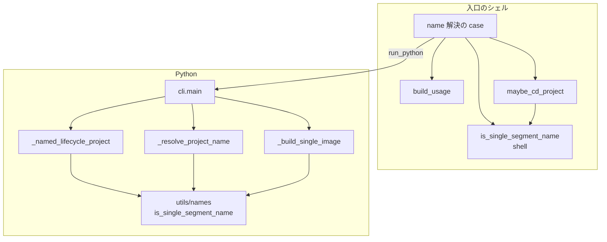
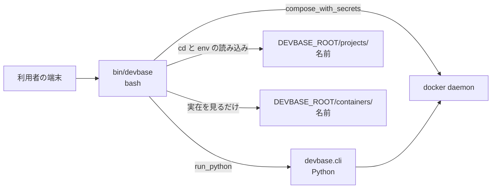
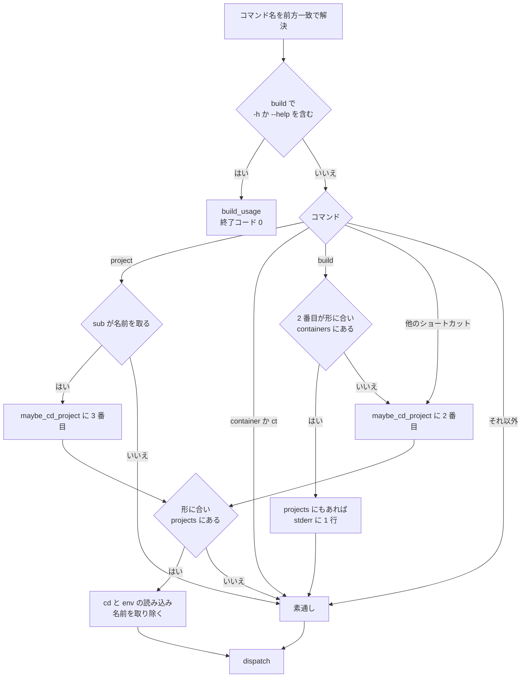
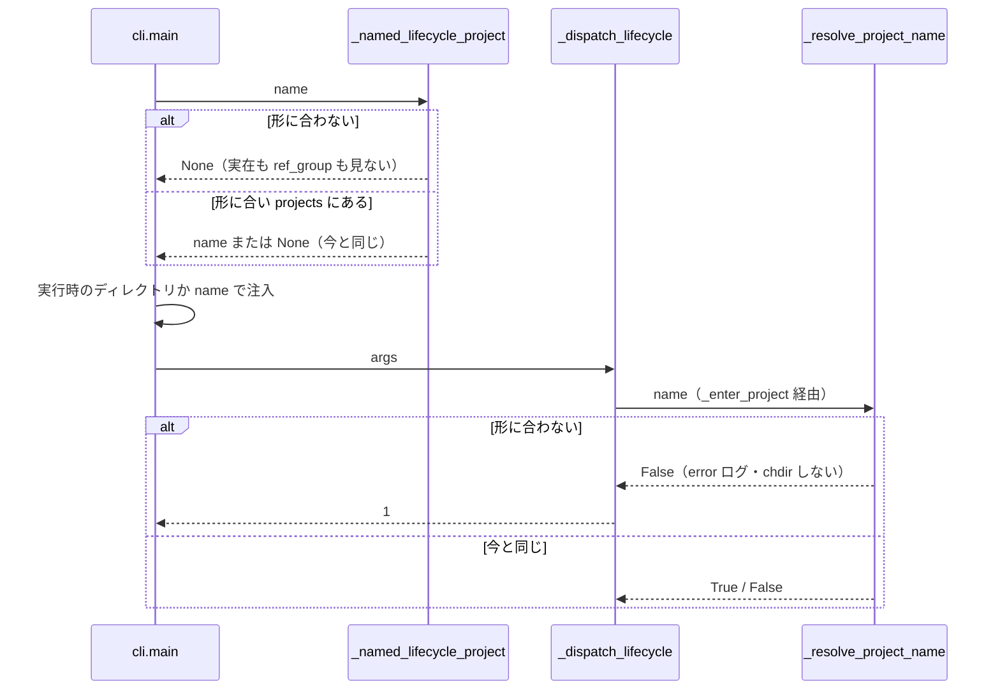

# PLAN61: `bin/devbase` の位置引数の解決の設計

要求と受け入れ条件は [PLAN61_name-resolution.md](PLAN61_name-resolution.md) にある。この文書は「どう作るか」だけを扱う。

## 機能一覧

| # | 機能 | 誰が使うか |
| --- | --- | --- |
| F1 | 名前の形に合わない位置引数を、プロジェクト名として扱わない（`..`・`/`・`.` で `projects/` の外へ出ない） | devbase の利用者（CLI）と、wrapper を経ずに `python -m devbase.cli` を呼ぶ経路 |
| F2 | `build <x>` で `containers/<x>` と `projects/<x>` が両方あるとき、イメージとしてビルドし、プロジェクトとしても読めたことを 1 行知らせる | devbase の利用者（CLI） |
| F3 | `build --help` / `-h` で、ビルドせずに `build` の使い方を出す | devbase の利用者（CLI） |
| F4 | `container <sub> <name>` を名前として解決せず、usage エラーにする | devbase の利用者（CLI） |

## 構成要素

### コード

| 要素 | 変更 | 責務 |
| --- | --- | --- |
| `lib/devbase/utils/names.py`（新設） | 足す | 名前の形の規則を 1 か所に置く。`SINGLE_SEGMENT_NAME_PATTERN = r'[A-Za-z0-9][A-Za-z0-9._-]*'` と `is_single_segment_name(value: str) -> bool`（`re.fullmatch`）。副作用を持たない |
| `container.py` の `_build_single_image` | 変える | `_IMAGE_NAME_RE` を消し、`is_single_segment_name` で検証する。エラーの文言と終了コード 1 は変えない |
| `container.py` の `_resolve_project_name` | 変える | 入口で `is_single_segment_name` を見る。合わなければ error ログ（下の「失敗の形」）を出して `False` を返す。`chdir`・`env` の読み込み・候補の提示をしない |
| `cli.py` の `_named_lifecycle_project` | 変える | `name` が形に合わなければ `projects/<name>` の実在を見る前に `None` を返す。`store_for` / `ref_group` を呼ばない |
| `bin/devbase` の `is_single_segment_name`（新設）と `_SINGLE_SEGMENT_NAME_RE` | 足す | shell 側の同じ規則。`local LC_ALL=C` の下で `[[ $1 =~ $_SINGLE_SEGMENT_NAME_RE ]]` を返す。Python 側の定義を指すコメントを置く |
| `bin/devbase` の `maybe_cd_project` | 変える | 入口の `case "$name" in -*\|"")` を `is_single_segment_name "$name" \|\| return 1` に置き換える（`-` 始まりと空もここで弾く） |
| `bin/devbase` の `build_usage`（新設） | 足す | `build` の使い方を標準出力へ出す（下の「入出力の契約」） |
| `bin/devbase` の name 解決の `case` | 変える | 3 つの分岐を入れ替える。(1) `build` の `-h` / `--help` を name 解決より前に判定する。(2) `project` だけが `$3` を解決し、`container` / `ct` の分岐を消す。(3) `build` で `containers/$2` が実在すれば `$2` を解決せず、`projects/$2` もあれば stderr へ 1 行出す |
| `bin/devbase` の name 解決の説明コメント | 変える | 「⚠ 衝突注意 (footgun)」を含む長いコメントを、変更後の規則（名前の形・`build` の衝突・`container` の除外・残る `login` / `scale` の衝突）に書き替える。`build)` 分岐の PLAN49 の注記（`bi-tools`）も合わせる |
| `cli.py` の同期注意のコメント（`SHORTCUTS` の上、`_add_project_parser` の docstring） | 変える | `_PROJECT_NAME_SUBCOMMANDS` の対象を `project` だけと書き直す |

### 文書とテスト

| 要素 | 変更 | 責務 |
| --- | --- | --- |
| `tests/cli/conftest.py`（新設）の `exec_wrapper` | 足す | `bin/devbase` を tmp の `DEVBASE_ROOT/bin/` へ複製して実行するハーネス（下の「テスト設計」） |
| `docs/user/cli-reference/02-project.md` | 変える | 「プロジェクト名指定」に名前の形、衝突注意を `login` / `scale` だけに縮める。`project build` 節の #142 の注記をイメージ優先に書き替え、`build --help` を足す。`container` 節に `[name]` が usage エラーになることを足す |
| `docs/user/cli-reference/README.md` | 変える | ショートカット表の ※ 注記を実経路に直す（`<image>` は Python の単体ビルド。今の記述は PLAN49 以前のまま） |
| `docs/developer/architecture.md` の「`build` の振り分け」 | 変える | `-h` / `--help` の行と、`<image>` の行に衝突時の扱いを足す |
| `docs/specifications/editor-open.md` の「運用」 | 変える | `container` / `ct` が `[name]` を受け付ける既知の動き（#200）の行を消す |
| `CHANGELOG.md` の `[Unreleased]` | 変える | Changed に F1・F2・F4、Fixed に F3 |

変えないもの: `_PROJECT_NAME_SUBCOMMANDS` と `_NAME_RESOLVABLE_SHORTCUTS` の中身、`cmd_build`、`run_python`、補完（`etc/`）。

下の図は呼び出しの関係だけを描く。呼び出しを持たない文書・コメント・テストのハーネスは図に含めない。



`cli.main` と `_resolve_project_name` の間には `_dispatch_lifecycle` と `_enter_project` がある。図では省く。

## 配置

### システムの文脈

devbase はホストで動く。この変更が触る外部は、`$DEVBASE_ROOT` 配下のファイル（`projects/`・`containers/`・各 `env`）の読み方だけである。docker daemon への呼び出しは増えも減りもしない。`build --help` はそこへ届かなくなる。



変更後、`S` と `P` が読む `env` は `projects/` の直下の 1 つのディレクトリにあるものに限られる。

### モジュールの置き場所

```text
bin/devbase                          # is_single_segment_name / build_usage を足す。name 解決の case を変える
lib/devbase/
├── cli.py                           # _named_lifecycle_project
├── commands/container.py            # _resolve_project_name / _build_single_image
└── utils/names.py                   # 新設。名前の形の規則
tests/cli/
├── conftest.py                      # 新設。exec_wrapper
├── test_project_name_resolution.py  # 拡張
├── test_build_image_argument.py     # 拡張
├── test_project_dispatch.py         # 拡張
└── test_secret_injection.py         # 拡張
tests/utils/test_names.py            # 新設
```

## 入出力の契約

### 名前の形

| 項目 | 内容 |
| --- | --- |
| 規則 | `[A-Za-z0-9][A-Za-z0-9._-]*` に全体が一致する。先頭が英数字なので `.`・`..`・`-x`・空は当たらない。`/` と `\` と空白と非 ASCII は含められない |
| Python | `devbase.utils.names.is_single_segment_name(value)`。`re.fullmatch` で見るため、末尾の改行も不一致になる |
| shell | `bin/devbase` の `_SINGLE_SEGMENT_NAME_RE='^[A-Za-z0-9][A-Za-z0-9._-]*$'` と `is_single_segment_name`。値の比較は `LC_ALL=C` で行う |
| 使う場所 | shell: `maybe_cd_project`、`build` の衝突の判定。Python: `_resolve_project_name`、`_named_lifecycle_project`、`_build_single_image` |

### トップレベル `build` の引数の解釈

上から順に見て、最初に当たった行で決まる。

| 条件 | 解釈 | 行き先 | cd |
| --- | --- | --- | --- |
| `build` の後ろのどこかに `-h` か `--help` がある | 使い方 | `build_usage` → 終了コード 0 | しない |
| `$2` が名前の形に合い、`containers/$2` が実在する | イメージ `$2` | Python の `project build $2 ...`。`projects/$2` も実在すれば stderr に知らせを 1 行出す | しない |
| `$2` が名前の形に合い、`projects/$2` が実在する | プロジェクト `$2` | `projects/$2` へ cd し `$2` を取り除いて、既存の `build)` 分岐 | する |
| 上のどれでもない | 今と同じ | 既存の `build)` 分岐（位置引数があれば Python の単体ビルド、無ければ `cmd_build`） | しない |

`$2` だけを見るのは今と同じである。`build --no-cache bi-tools` のように位置引数が 2 番目に無いときは、name 解決を通らない。`build)` 分岐がイメージとして拾う。

### `build --help` / `-h`

| 項目 | 内容 |
| --- | --- |
| 名前 | `devbase build -h` / `devbase build --help`。前方一致（`devbase b --help`）も同じ |
| 入力 | `build` より後ろの引数のどこかにある `-h` または `--help`。`--context --help` の `--help` も使い方として扱う。`--context=--help` は使い方にしない。`-h` も同じ規則で、`--context -h` は使い方、`--context=-h` は使い方にしない（決定 8） |
| 出力 | 標準出力に下の使い方。終了コード 0。`cmd_build`・`compose_with_secrets`・`run_python` を呼ばない。cd せず、切り替え先のプロジェクト（`projects/<name>`）の `env` を読まない。起動時の `$DEVBASE_ROOT/env` と実行時のディレクトリの `env` の読み込みは他のコマンドと同じく行う |
| 互換性 | 今は `build --help` がビルドを始める。これを止める以外の変更はない。`devbase project build --help`（argparse）は変えない |

```text
Usage: devbase build [<project> | <image>] [options]

Build devbase images.
  (no argument)       build the images of the current project (base image first)
  <project>           build the project in $DEVBASE_ROOT/projects/<project>
  <image>             build $DEVBASE_ROOT/containers/<image> alone as devbase-<image>:latest
                      (when both containers/<name> and projects/<name> exist, <name> is an image;
                       to build the project, run 'devbase build' in its directory)

Options:
  --no-cache          rebuild the base and project images without cache
  --project-no-cache  rebuild only the project image without cache (base uses cache)
  --expires[=DAYS]    rebuild without cache only if the image is older than DAYS days (default 7)
  --context NAME      run docker against the docker context NAME
  -h, --help          show this help
```

### 衝突の知らせ

| 項目 | 内容 |
| --- | --- |
| 条件 | トップレベル `build <x>` で、`<x>` が名前の形に合い、`containers/<x>` と `projects/<x>` がどちらもディレクトリとして実在する |
| 出力 | stderr に 1 行。1 回の起動で 1 回だけ |
| 文言 | `Note: '<x>' is also a project (projects/<x>); building image containers/<x>. To build the project, run 'devbase build' in $DEVBASE_ROOT/projects/<x>`（`$DEVBASE_ROOT` は展開した値） |
| 終了コード | 知らせは終了コードに影響しない。単体ビルドの結果がそのまま返る |

### 名前を取るコマンドの失敗の形

| 状況 | 終了コード | 出力 |
| --- | --- | --- |
| wrapper 経由で形に合わない名前（`up ../etc` など） | 下流の結果 | wrapper は何も出さない。引数はそのまま Python へ渡る |
| `project <sub> <name>` / トップレベル `up` などで、Python が形に合わない `name` を受け取った | 1 | `プロジェクト名に使えない形です: '../etc'（英数字で始まり、英数字・'.'・'-'・'_' だけからなる名前）`（error）。候補の一覧は出さない |
| `scale <形に合わない値>`（名前が 1 つだけ） | 2 | 今と同じく argparse の `new_scale` の型エラー |
| `login <形に合わない値>` | 下流の結果 | 今と同じく index として docker compose へ渡る。cd しない |
| `build <形に合わない値>` | 1 | 今と同じく `_build_single_image` の `Invalid image name` |
| `container <sub> <name>` / `ct <sub> <name>`（`up` `down` `ps` `logs` `rebuild` `open`） | 2 | argparse の `unrecognized arguments: <name>` |
| `container scale <name> [N]` | 2 | argparse の `new_scale` の型エラー |

## 処理の流れ

### 入口のシェル

分岐の順序が主題のため、判定の順に描く。



「他のショートカット」は `_NAME_RESOLVABLE_SHORTCUTS` から `build` を除いた 7 つ（`up` `down` `ps` `scale` `login` `rebuild` `open`）である。

「形に合い」の判定はどれも shell の `is_single_segment_name` で行う。

`build` の使い方の判定は name 解決より前に置く。`build carmo --help` で `projects/carmo` への cd とその `env` の読み込みを起こさないためである（決定 7）。起動時の `$DEVBASE_ROOT/env` と実行時のディレクトリの `env` は、コマンド名の解決より前に全コマンド共通で読まれ、この計画では変えない。

### Python 側



どちらの判定も `utils/names` の `is_single_segment_name` を呼ぶ。`_build_single_image` は同じ関数へ差し替えるだけで、流れは変わらないため図にしない。

## 非機能の実現方式

| 大項目 | 要求の条件 | 実現方式 | 確かめ方 |
| --- | --- | --- | --- |
| セキュリティ | `..` や `/` を含む名前を渡すと、`projects/` の外のディレクトリへ cd せず、`projects/` の外の `env` を読まない（受け入れ条件 2） | 名前を `projects/` へ連結する 3 つの入口（`maybe_cd_project`・`_resolve_project_name`・`_named_lifecycle_project`）で、連結の前に同じ規則で弾く | `exec_wrapper` で `projects/` の外に `env` を置き、cd と値の読み込みが起きないことを見る。Python 側は単体テスト |
| システム環境 | `bin/devbase` は bash 3.2 で動くこと（macOS 既定） | `[[ =~ ]]` の右辺は変数で渡す（bash 3.2 以降は、引用した右辺を正規表現ではなく文字列として比べるため）。連想配列・`${var,,}`・`mapfile` を使わない。比較は `local LC_ALL=C` の下で行う | macOS の `/bin/bash`（3.2）で `tests/cli` を流す。`shellcheck --severity=error bin/devbase` |

## 決定の記録

### 決定 1: 名前の形は `[A-Za-z0-9][A-Za-z0-9._-]*` とし、合わない値は名前として扱わずに素通しする

`_build_single_image` のイメージ名と同じ許可リストにする。どちらも「決まった親ディレクトリの直下の 1 つの名前」を表し、同じ規則で足りる。先頭を英数字に限るため、`.` と `..` を別に弾く条件が要らない。今の `projects/` の 38 件はすべてこの形に収まる。

合わない値でも wrapper は止まらない。同じ位置引数が、名前ではない意味（`login` の index、`build` のイメージ、`scale` の数）も持つためである。wrapper は名前かどうかだけを決め、止めるのは意味を知る下流に任せる。

`/` と `..` だけを弾く形（拒否リスト）は採らない。`\`・空白・制御文字・非 ASCII のように、見落とした文字がそのまま通る。

### 決定 2: Python の規則は `utils/names.py` の 1 関数に置き、`_build_single_image` も同じ関数を使う

規則を使う Python の入口は 3 つあり、`cli.py` と `container.py` にまたがる。`container.py` に置いて `cli.py` から読むと、`cli.py` が `container.py` の import に依存する。`cli.py` は起動を軽く保つため、コマンドのモジュールを dispatch の時点まで読まない。`re` だけに依存する小さなモジュールなら、どちらからも無理なく読める。`_IMAGE_NAME_RE` は同じ正規表現なので消して寄せる。

shell は同じ正規表現を文字列で持つ。Python を呼んで判定すると、name 解決のたびに `uv run` の起動が 1 回増えるためである。2 か所の一致は、コメントの対と同期テストで保つ。同期テストは `bin/devbase` から正規表現を抜き出し、Python の定義と比べる（`TOP_PREFIX_PREFERENCES` の同期テストと同じ形）。

### 決定 3: 既存の他の名前の検証は寄せない

リポジトリには名前を検証する関数が他に 3 つある。それぞれ別の用途と互換性を持つ。

| 場所 | 規則 | 用途 |
| --- | --- | --- |
| `env/bundle.py` の `is_valid_project_name` | 先頭に `_` を許す | env の export / import の書庫の中の名前 |
| `env/secret_store.py` の `_validate_project_name` | 区切り文字と `.`・`..` だけを弾く | 機密の保存先のファイル名 |
| `snapshot/manager.py` の `_VALID_NAME_RE` | この変更と同じ文字の集合 | スナップショットの名前 |

寄せると、env の export / import や機密の保存先が受け付ける名前が変わる。影響がこの変更の受け入れ条件の外に出る。食い違いは「未確認のまま残ること」に残す。

### 決定 4: shell の比較は `LC_ALL=C` で行う

bash の `[[ =~ ]]` は C ライブラリの正規表現を使う。そのため `[A-Za-z]` の範囲が、端末のロケールによっては ASCII 以外の文字を含みうる。macOS の `/bin/bash`（3.2）と `en_US.UTF-8` では、`café` が一致しないことを確かめた。ただし範囲の解釈は C ライブラリとロケールごとに違う。Python の `[A-Za-z0-9]` は ASCII だけに一致するので、ロケールを固定しないと 2 か所の結果が割れうる。`is_single_segment_name` の中で `local LC_ALL=C` にし、影響を関数の中に閉じる。

`[[:alnum:]]` を使う形は採らない。こちらもロケールに依存し、Python の定義と字面で比べられなくなる。

### 決定 5: `build <x>` で `containers/<x>` と `projects/<x>` が両方あれば、イメージとしてビルドして知らせる

`build <image>` はイメージを明示した指定であり、プロジェクトのビルドは通常そのディレクトリで引数なしに行う。プロジェクトを優先すると、`containers/<x>` をトップレベルからビルドする手段が無いまま残る。知らせにはプロジェクトをビルドする方法を含め、逆の意図だった利用者が次の操作を読み取れるようにする。

知らせは stderr へ出す。標準出力は単体ビルドの出力で、パイプで読む人の邪魔をしない。`--image` のような新しいフラグは足さない（要求の対象範囲の外）。

### 決定 6: 衝突の判定は `containers/<x>` の実在で分け、`maybe_cd_project` の前に置く

`containers/<x>` があれば、`projects/<x>` の有無によらず name 解決を通さない。`projects/<x>` の実在は、知らせを出すかどうかだけに使う。判定を `maybe_cd_project` の後に置くと cd と `env` の読み込みが先に起き、戻す手段が無い。

名前の形を先に見るのは、`containers/../x` のような値でディレクトリの実在を確かめないためである。形に合わない値は、衝突の判定にも name 解決にも使わない。

### 決定 7: `build` の `-h` / `--help` は name 解決より前に判定し、`bin/devbase` が使い方を出す

トップレベル `build` は shell の `cmd_build` と Python の `project build` に振り分けられる。受け付ける引数も両者で違う（`--project-no-cache` は shell だけにある）。Python の `--help` へ委ねると、shell 経路の引数が載らない。name 解決の後に判定すると、`build carmo --help` で `projects/carmo` への cd と `env` の読み込みが先に起きる。使い方を出すだけの呼び出しで、切り替え先のプロジェクトへの cd とその `env` の読み込みを起こさないため、コマンド名の解決の直後に置く。起動時の `$DEVBASE_ROOT/env` と実行時のディレクトリの `env` の読み込みはコマンド名の解決より前に全コマンド共通で起きる既存の挙動で、この計画では変えない。#196 の受け入れ条件はビルドを起こさないことであり、この読み込みの前へヘルプ判定を移す変更は採らない。

使い方は標準出力へ出し、終了コード 0 にする。argparse の `--help` と同じ扱いにそろえる。

### 決定 8: `-h` / `--help` は引数のどこにあっても使い方を優先し、`--context=-h` / `--context=--help` だけは使い方にしない

`--help` を打った利用者が求めているのは使い方である。位置で区別すると、どの位置なら効くかを覚える必要がある。`--context --help` も使い方にする。argparse も `-` 始まりの語を `--context` の値として取らず、usage エラー（終了コード 2）にする。値にならない点は同じで、エラーにする代わりに使い方を出す。`--context=--help`（`-h` も同じ）は使い方にしない。下流へ渡り、argparse の usage エラー（終了コード 2）になる。shell は `env exec --context "$_BUILD_CONTEXT" --` の形で渡すため、値 `--help` は argparse から見て値不足になる。`-` 始まりの context 名は受け付けない。`=` の結合を下流まで保つ変更は採らない。`-` 始まりの context 名に実用が無いためである。`--context -h` は使い方になる。

`help` という語（`-` なし）は使い方にしない。イメージ名の形に合う語で、名前として扱う今の動きを変える理由が無い。

### 決定 9: 使い方に `--project-no-cache` を載せる

`--project-no-cache` は、Python の期限判定が base を最新と判断した後に shell を呼び戻すための引数である。ただし利用者も打てる。受け付ける引数を使い方から隠すと、打ったときの動きを知る手段が無い。#196 の依頼も使い方にこの引数を挙げている。

### 決定 10: `container` / `ct` を name 解決の分岐から外す

`container` の parser は `[name]` を持たない。wrapper だけが名前を取り除く今の形では、名前が実在するときだけ受け付け、実在しないと usage エラーになる。受け付けるかどうかが、利用者の打った語ではなく `projects/` の中身で変わる。`container` は非推奨で、名前の指定は `project <sub> <name>` が持つ。wrapper を parser に合わせ、実在によらず usage エラー（終了コード 2）にそろえる。

`container` の parser に `[name]` を足して今の動きを仕様にする形は採らない。非推奨のグループへ新しい受け付けを増やすことになり、`project` へ移す流れと逆になる。

### 決定 11: wrapper のテストは `bin/devbase` を tmp へ複製して実行し、`uv` だけを `PATH` で差し替える

`test_build_image_argument.py` などの既存のハーネスは、`bin/devbase` の本文を `sed` で削って `bash -c` の中で `eval` する。この形は次の 2 点で、name 解決の経路のテストに足りない。

- `DEVBASE_ROOT=` の行を削り、環境変数の値を使わせている。このマシンのシェルは `DEVBASE_ROOT` を持ち、pytest がそれを継承する。渡し忘れると実環境の `projects/` を見る
- `run_python` と `cmd_build` を関数ごと置き換える。置き換えた関数は `=== Building devbase images ===` を出さないため、#196 の依頼にある「この文字列が出ない」を確かめられない

`bin/devbase` を `<tmp>/bin/devbase` へ複製すると、wrapper は自身の場所から `DEVBASE_ROOT` を `<tmp>` に決める。継承した環境変数は wrapper の代入で上書きされる。外へ出る呼び出しはすべて `uv` を通る（`run_python` と `compose_with_secrets`）。そのため `<tmp>/fakebin/uv` を `PATH` の先頭に置けば、dispatch の先だけを差し替えられる。`maybe_cd_project` と `cmd_build` は本物のまま動く。複製にするのは、シンボリックリンクだと wrapper がリンクを解いて実物の場所を `DEVBASE_ROOT` にするためである。

既存の `sed` のハーネスは変えない（受け入れ条件 14）。`tests/cli/test_wrapper_dispatch.py` のハーネスは拡張しない。このハーネスは `DEVBASE_ROOT=` の行を削らない。`bash -c` の中では `BASH_SOURCE` が空になるため、pytest の実行時のディレクトリの親が `DEVBASE_ROOT` になる。

## テスト設計

`exec_wrapper(args, cwd=None)` は `tests/cli/conftest.py` の fixture である。

- `tmp_path` に `bin/devbase`（複製）・`projects/`・`containers/`・`work/`・`fakebin/uv` を作る
- 起動は `subprocess.run(['bash', '<tmp>/bin/devbase', *args], cwd=cwd or '<tmp>/work')`。`PATH` の先頭は `fakebin`
- 偽の `uv` は `PWD:`・`UV:<引数>`・`MARKER:${MARKER:-<unset>}` を標準出力へ出して 0 で終わる
- `projects/<name>`・`containers/<name>`（`Dockerfile` 付き）・`<tmp>/etc/env`（`MARKER=leaked`）は、テストごとに必要なものを作る

| 受け入れ条件 | 何で確かめるか |
| --- | --- |
| 1 | `exec_wrapper`（`test_build_image_argument.py`）: `<tmp>/etc/env` がある状態で `build ../etc` → `UV:` の引数が `project build ../etc` で終わる。`PWD:` は `work`、`MARKER:` は `<unset>`、`=== Building` は出ない。単体: `test_single_build_rejects_invalid_image_name` の値に `../etc` を足し、`cli.main(['project', 'build', '../etc'])` が 1 を返す |
| 2 | `exec_wrapper`（`test_project_name_resolution.py`）: トップレベル `up` `down` `ps` `scale` `login` `rebuild` `open` と `project up` `down` `ps` `logs` `scale` `rebuild` `open` の組み × 名前 `../etc` `a/b` `.` `..` で、`PWD:` が `work` のまま、`MARKER:` が `<unset>`、名前が `UV:` の引数に残る。単体: `_resolve_project_name` がこの 4 つの名前で `False` を返し、`os.chdir` を呼ばない |
| 3 | 単体（`test_project_name_resolution.py`）: `DEVBASE_ROOT=<tmp>` で `cli.main(['project', 'up', '../etc'])` が 1、CWD が変わらない、caplog に「プロジェクト名に使えない形」 |
| 4 | 単体（`test_secret_injection.py`）: グループ別の置き場で `<tmp>/etc/env` に宣言がある状態で `_load_secret_env('project', 'up', name='../etc')` の注入先が `None`。`groups.declare` と `runtime.store_for` が呼ばれない |
| 5 | `exec_wrapper`: `up carmo` / `up github_work_time` / `up carmo-ai` で `PWD:` が `projects/<name>`、`UV:` の引数から名前が消える。単体（`tests/utils/test_names.py`）: この 3 つが `True` |
| 6 | `exec_wrapper`: `containers/bi-tools` と `projects/bi-tools` がある状態で `build bi-tools --no-cache` → `UV:` の引数が `project build bi-tools --no-cache` で終わる。`PWD:` が `work`、stderr の知らせがちょうど 1 行で `projects/bi-tools` と `devbase build` を含む |
| 7 | `exec_wrapper`: `projects/carmo` だけの状態で `build carmo` → 標準出力に `=== Building devbase images ===`、`UV:` の `PWD:` が `projects/carmo` |
| 8 | `exec_wrapper`: `containers/go` だけの状態で `build go` → `UV:` の引数が `project build go` で終わり、stderr に知らせが無い |
| 9 | `exec_wrapper`: `build --help` と `build -h` が終了コード 0、`=== Building devbase images ===` と `UV:` が出ない（`run_python` も docker も `uv` を通るため、`UV:` が無いことで両方を確かめる） |
| 10 | 9 と同じ実行で、標準出力に `--no-cache`・`--project-no-cache`・`--expires[=DAYS]`・`--context NAME`・`<image>` を含む |
| 11 | `exec_wrapper`: `projects/carmo` があり、`projects/carmo/env` に読み込みを検知する行 `echo CARMO_ENV_READ >&2` を置いた状態で `build carmo --help` → 9 と同じ結果で、`PWD:` の行が無く、stderr に `CARMO_ENV_READ` が出ない（cd も env の読み込みも起きない）。`PWD:` は偽の `uv` が出す行なので、無いことは `uv` が呼ばれなかったことしか示さず、名前解決で cd と env の読み込みを済ませてからヘルプで終わる実装でも通る。wrapper は `env` を `source` するため、検知の行は cd と読み込みが起きたときだけ stderr に出る |
| 12 | `exec_wrapper`: `projects/carmo` がある状態で `container up carmo` と `ct up carmo`（`down` `ps` `logs` `scale` `rebuild` `open` も）→ `PWD:` が `work`、`UV:` の引数に `carmo` が残る。単体（`test_project_dispatch.py`）: `container` / `ct` の各サブコマンドに `carmo` を渡した parse が `SystemExit(2)` |
| 13 | `exec_wrapper`: `container up` → `UV:` の引数が `container up`。非推奨の警告は既存の `test_cmd_container_warns_and_delegates` |
| 14 | 既存の `test_project_name_resolution.py`（`test_wrapper_ct_up_name_cds_and_strips` を除く）・`test_build_image_argument.py`・`test_wrapper_build_context.py`・`test_open_command.py`・`test_project_dispatch.py` が変更なしで通る。`test_wrapper_ct_up_name_cds_and_strips` は決定 10 で振る舞いが変わるため、12 のテストへ置き換える |
| 15 | 1・2・5〜13 の `exec_wrapper` のテストが該当する。`bin/devbase` の関数を差し替えず、`uv` だけを `PATH` で差し替える |
| 16 | `uv run pytest tests/ -q` |

受け入れ条件に対応しない、決定を固定するテスト:

| 決定 | 何で確かめるか |
| --- | --- |
| 2 | 同期テスト（`test_project_name_resolution.py`）: `bin/devbase` から `_SINGLE_SEGMENT_NAME_RE='...'` を抜き出し、`'^' + SINGLE_SEGMENT_NAME_PATTERN + '$'` と一致する |
| 4 | `exec_wrapper`: `projects/café` を作った状態で `up café` が cd しない。単体: `is_single_segment_name('café')` が `False` |
| 8 | `exec_wrapper`: `build --context --help` と `build --context -h` は使い方で終了コード 0。`build --context=--help` と `build --context=-h` は使い方を出さず下流へ渡る（`UV:` の引数にそれぞれ `env exec --context --help --`・`env exec --context -h --` を含む）。実際の argparse ではこれが値不足の usage エラー（終了コード 2）になる。`-` 始まりの context 名は受け付けない |

## 未確認のまま残ること

| 項目 | 内容 |
| --- | --- |
| bash 3.2 での確認 | `local LC_ALL=C` の下の `[[ $1 =~ $re ]]` が `carmo` だけを通し、`café`・`../etc`・`a/b`・`.`・`..`・空・`-x` を弾くことは、macOS の `/bin/bash` 3.2.57 で手で確かめた（2026-09-18）。CI は Linux の bash で動くため、実装後のテストでの 3.2 の確認は手元の実行に限られる |
| 形に合わない名前のプロジェクト | 今の `projects/` の 38 件はすべて形に合う。プラグインの同期が作る名前は `<proj>` と `<proj>.<owner>` である。形に合わない名前ができた場合、そのプロジェクトは名前の指定（CLI と TUI の一覧）から操作できなくなる。そのディレクトリの中で名前なしに打てば今どおり動く |
| 名前の検証の食い違い | `env/bundle.py` は先頭の `_` を許し、この変更の規則は許さない。`_` 始まりのプロジェクトは、env の export / import はできても名前の指定では操作できない。寄せるかどうかは別の課題として扱う（決定 3） |
