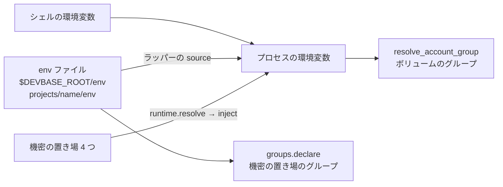
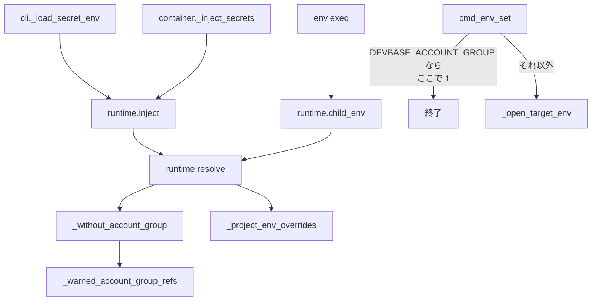
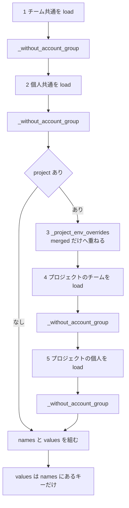
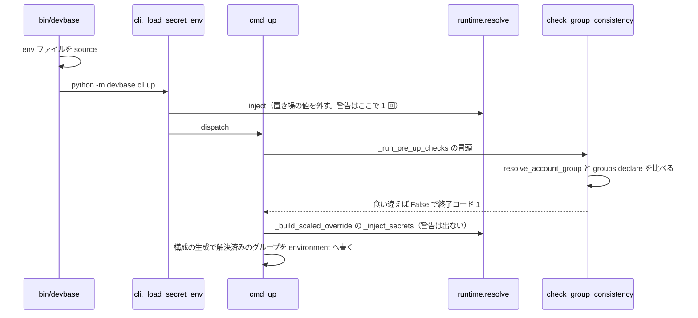

# PLAN62: 機密の置き場に書いた `DEVBASE_ACCOUNT_GROUP` を注入しない の設計

要求と受け入れ条件は [PLAN62_inject-account-group.md](PLAN62_inject-account-group.md) にある。この文書は「どう作るか」だけを扱う。

## 機能一覧

| # | 機能 | 誰が使うか |
| --- | --- | --- |
| F1 | 機密の置き場（4 つ）にある `DEVBASE_ACCOUNT_GROUP` を合成から外し、プロセスの環境変数・子プロセス・コンテナの列挙のどれにも載せない | devbase の利用者（機密を注入するすべてのコマンド） |
| F2 | 外したことを、置き場の種類と消し方を添えた警告で知らせる。同じ置き場について 1 回の起動で 1 回まで | devbase の利用者（同上） |
| F3 | `devbase env set DEVBASE_ACCOUNT_GROUP=...` を置き場へ書かずに拒否し、`env` ファイルへ書くよう案内する | devbase の利用者（CLI） |
| F4 | 利用者向け文書と CHANGELOG を新しい挙動に合わせる | devbase の利用者（文書の読み手） |

## 値の経路

いまアカウントグループの値は、次の 3 つの経路でプロセスの環境変数 `DEVBASE_ACCOUNT_GROUP` へ届く。ボリュームのグループ（`resolve_account_group()`）はこの環境変数だけを読む。



この変更は 3 本目の辺（置き場 → `resolve` → プロセス）だけを断つ。残る 2 本は変えない。機密の置き場のグループ（`groups.declare`）は、もともと `env` ファイルだけから決まる（PLAN56）。

## 構成要素

| 要素 | 変更 | 責務 |
| --- | --- | --- |
| `env/runtime.py` の `_warned_account_group_refs`（新設） | 足す | 警告を出した置き場の参照（`SecretRef`）の集合。モジュールの変数で、プロセスが終わるまで持つ |
| `env/runtime.py` の `_without_account_group(ref, data)`（新設） | 足す | `data` に `DEVBASE_ACCOUNT_GROUP` があれば、そのキーを除いた新しい辞書を返し、警告を出す（`ref` が集合に無いときだけ）。無ければ `data` をそのまま返す。受け取った辞書は変えない |
| `env/runtime.py` の `resolve` | 変える | 4 つの置き場から読んだ辞書を、合成に使う前に `_without_account_group` へ通す。docstring に、このキーを合成しないことと理由を書き足す |
| `commands/env.py` の `cmd_env_set` | 変える | キー名が `DEVBASE_ACCOUNT_GROUP` なら、置き場を開く（`_open_target_env`）前に案内を出して 1 を返す |
| `env/keys.py` の `DEVBASE_ACCOUNT_GROUP` のコメント | 変える | 機密の置き場の値は注入しないこと（PLAN62）を 1 行足す |
| `docs/user/environment-variables.md` | 変える | 「アカウントグループ」の節に、置き場の値は使われず警告が出ることと、`env set` で書けないことを書く |
| `docs/user/env-backend.md` | 変える | 「グループの決まり方」と「`up` / `scale` がグループの食い違いで止まったとき」の、置き場に書いたときの記述を書き替える |
| `docs/user/cli-reference/03-env.md` | 変える | `devbase env set` の節に、`DEVBASE_ACCOUNT_GROUP` は書けないことを 1 行足す |
| `CHANGELOG.md` | 変える | `[Unreleased]` の `### Changed` に 2 項目。置き場の値を `version: 1` でも使わず警告すること（ボリュームのグループが `env` ファイルの宣言へ戻りうることを添える）と、`env set` で拒否すること |

次のものは変えない。

- `runtime.py` の `_project_env_overrides`、`inject`、`child_env`、`release_store`、`SecretEnv`
- `volume/compose.py`（コンテナの `DEVBASE_ACCOUNT_GROUP` は解決済みのグループを書く）
- `volume/manager.py` の `resolve_account_group`、`env/groups.py`
- `commands/container.py` の `_check_group_consistency`、`cli.py` の `_load_secret_env`

下の図は呼び出しの関係だけを描く。文書（`docs/`・`CHANGELOG.md`）と `keys.py` のコメントは図に含めない。



## 入出力の契約

### `runtime.resolve` の結果

| 項目 | 変更後 |
| --- | --- |
| `values` | `DEVBASE_ACCOUNT_GROUP` を含まない。`projects/<name>/env` が同じキーを宣言していても含まない（名前の一覧に無いキーは値を採らないため） |
| `global_names` / `project_names` / `names` | `DEVBASE_ACCOUNT_GROUP` を含まない。ほかのキーの並びと重複の畳み方は変えない |
| 置き場への要求 | 変えない（4 参照を 1 回ずつ `store.load`） |
| 比べ方 | キー名の完全一致。`export DEVBASE_ACCOUNT_GROUP` のように接頭辞の付いたキーは別の名前の変数になり、グループに効かないため対象外 |

`inject` と `child_env` は `resolve` の結果だけを載せるため、どちらも `DEVBASE_ACCOUNT_GROUP` を書き換えない。プロセスの環境変数に元からある値（シェルか `env` ファイル由来）は残る。

### 警告

`logger.warning` で 1 件出す。値は出さない。

```text
機密の置き場（{参照の表示}）にある DEVBASE_ACCOUNT_GROUP は使いません。アカウントグループは env ファイル（projects/<name>/env・$DEVBASE_ROOT/env）で決まります。消すには: devbase env delete DEVBASE_ACCOUNT_GROUP{付ける引数}{実行場所}
```

`{参照の表示}` は `SecretRef.label()` をそのまま使う。`{付ける引数}` と `{実行場所}` は参照から組む。

| 置き場 | `label()` の例 | 付ける引数 | 実行場所 |
| --- | --- | --- | --- |
| チーム共通 | `グローバル` | なし | なし |
| 個人共通 | `個人のグローバル` | ` --user` | なし |
| プロジェクトのチーム | `プロジェクト 'web'` | ` -p` | `（projects/web で実行）` |
| プロジェクトの個人 | `個人のプロジェクト 'web'` | ` -p --user` | `（projects/web で実行）` |

参照がグループを持つとき（`layout: group`）は、`label()` の末尾に `（グループ with）` が付き、付ける引数の末尾に ` --group with` を足す。`--group` の名前は参照が持つ読み替え前の名前である。

| 項目 | 内容 |
| --- | --- |
| 出る回数 | 同じ参照（`SecretRef` の値が等しいもの）について、1 プロセスで 1 回まで。`release_store` をまたいでも出し直さない |
| 出ない条件 | 置き場に `DEVBASE_ACCOUNT_GROUP` が無い。空の値でもキーがあれば出す |
| 出る場所 | 注入を行うすべてのコマンド。`version: 1` では `env delete` 自身の実行前の注入でも 1 回出る（消す操作の直前の知らせになる） |

### コマンド `env set`

| 項目 | 内容 |
| --- | --- |
| 名前 | `devbase env set KEY=VALUE [-p] [--user] [--group NAME]` |
| 変わる入力 | `KEY` が前後の空白を除いて `DEVBASE_ACCOUNT_GROUP` と一致するとき |
| 出力（拒否） | 終了コード 1。error ログ `DEVBASE_ACCOUNT_GROUP は機密の置き場へは書けません（置き場の値はアカウントグループの決定に使われません）。projects/<name>/env か $DEVBASE_ROOT/env に書いてください` |
| 置き場への作用 | 無し。`_open_target_env` より前に返すため、ファイルを作らず、サーバへ要求しない |
| 引数の検査との順序 | `-p` / `--user` / `--group` の検査より前に拒否する。`--group` に使えない名前を渡しても終了コードは 1 |
| 互換性 | 変わる。これまで書けたキーが書けなくなる。CHANGELOG の「変更」に書く。`env import` / `env edit` / 他のキーの `env set` は変わらない |

## 処理の流れ

`resolve` の中の順序を、重ね順の番号とともに描く。外すのは 1・2・4・5 の読み取りの直後で、3 は今のまま通す。



`_without_account_group` の中では、キーがあり参照が集合に無いときだけ警告を出して集合へ足す。

### 重ね順 3 と `env` ファイルの値

`_project_env_overrides` は `projects/<name>/env` のキーについて、プロセスの環境変数の値を `merged` へ重ねる。`values` は `names`（4 つの置き場のキー）にあるキーだけを `merged` から採る。外した後は `DEVBASE_ACCOUNT_GROUP` が `names` に無いため、`merged` に `env` ファイルの値が入っても `values` には現れない。

プロセスの環境変数の `DEVBASE_ACCOUNT_GROUP` は、ラッパーの `source`（または `_load_project_env`）が載せた値とシェルの値のままになる。`inject` はそれを書き換えない。これが受け入れ条件 2 の「`with` のまま変わらない」にあたる。重ね順 3 に手を入れる必要はない。

変更前は、プロジェクトの置き場（重ね順 4・5）の値が重ね順 3 に勝っていた。そのため `projects/<name>/env` がグループを宣言していても、置き場の値でプロセスの環境変数が上書きされた。この順は既存のテストが任意のキーで固定している（`tests/env/test_runtime.py` の `test_project_env_beats_global_layers_and_loses_to_project_layers`）。

### `devbase up` での順序



`up` は同じプロセスの中で `resolve` を 2 回以上呼ぶ。その間の `_ensure_env_files` は、子プロセスの `env init` の後に `release_store` を呼ぶ。警告の集合はストアと別に持つため、2 回目以降の `resolve` では出ない。

## 決定の記録

### 決定 1: 外す場所は `resolve` の 4 つの読み取りの直後の 1 か所にする

`inject`・`child_env`・コンテナへ列挙する変数名（`SecretEnv.names`）は、どれも `resolve` の結果から作られる。読み取りの直後で外せば、3 つの経路と重ね順の全層に同じ規則が当たり、経路を足しても漏れない。

`inject` と `child_env` のそれぞれで外す形は採らない。コンテナの列挙（`names`）に残り、Compose が devbase のプロセスの値を読むことになるためである。ボリュームの側を `groups.declare` へ揃える形も採らない。PLAN56 がスナップショット・`status`・entrypoint へ渡す値まで経路が変わるとして退けており、要求の対象範囲でも「含まない」としている。

### 決定 2: `version: 1` でも外す

利用者向け文書は PLAN56 以降、置き場に書いた値はグループの決定に使われないと説明している。`version: 1` だけ置き場の値が効く今の挙動は、この説明と食い違う。置き場の値でグループを切り替える使い方は文書に無い。

`layout: group` のときだけ外す形は採らない。設定の版でグループの決まり方が変わり、文書に版ごとの例外を書くことになるためである。

### 決定 3: 置き場の値は消さず、警告で知らせる

置き場は他のメンバーと共有する場所（チームの参照）でもあり、コマンドの実行の副作用で書き換えると、書いた本人が知らないまま他の端末にも効く。消すかどうかは利用者が決め、消し方を警告に添える。自動削除は要求の対象範囲で「行わない」としている。

### 決定 4: 警告の重複抑止は、置き場の参照を鍵にしたモジュールの集合で、プロセスの寿命だけ持つ

`resolve` は 1 回の起動で何度も呼ばれる。

| 呼び出し元 | 経路 |
| --- | --- |
| `cli._load_secret_env` | dispatch 前の注入 |
| `container._inject_secrets` | `up` / `down` / `scale` などの各コマンド |
| `runtime.child_env` | `env exec` |

`SecretRef` は凍結した dataclass で、種類・プロジェクト名・持ち主・グループを持つため、そのまま「同じ置き場」の鍵になる。

`SecretStore` に持たせる形は採らない。ストアは `release_store` で捨てられる（`_dispatch_lifecycle` の出口、`up` の中の `env init` の後、TUI の操作の入口）。そのため `up` 1 回の中で警告が 2 回出て、受け入れ条件 4 を満たさない。`release_store` で集合も消す形も同じ理由で採らない。

TUI は 1 プロセスで操作を続けるため、同じ置き場の警告は TUI を起動して最初に注入したときの 1 回だけになる。受け入れ条件 4 は「1 回の CLI 起動で」を単位にしており、これに合う。

### 決定 5: 消し方の引数は参照から組み、グループを持つ参照には常に `--group` を付ける

`env delete` の宛先は `-p`（適用範囲）・`--user`（持ち主）・`--group`（グループ）の 3 軸で決まる。3 軸は参照の 3 つのフィールドと 1 対 1 に対応する。`--group` を省くと、`env delete` は実行した場所のグループ（`$DEVBASE_ROOT/env` など）を宛先にし、警告を出した置き場と違う置き場を指すことがある。共通の参照でも付けて、どこで打っても同じ置き場を指すようにする。

プロジェクトの参照では `-p` がプロジェクトのディレクトリでしか使えないため、実行場所を添える。

### 決定 6: 重ね順 3（`_project_env_overrides`）は変えない

重ね順 3 は、置き場のキーのうち `projects/<name>/env` にもあるものの値を差し替える働きである。キーの一覧（`names`）は置き場からだけ作られるので、置き場から外したキーには働かない。`env` ファイル由来の値はラッパーの `source` でプロセスに載っており、`inject` が触らなければそのまま残る。

`_project_env_overrides` の結果からも `DEVBASE_ACCOUNT_GROUP` を除く形は採らない。`values` に現れない値を除いても結果が変わらず、同じ規則が 2 か所に分かれる。

### 決定 7: `env set` は置き場を開く前に拒否する

`layout: group` の `--group` の検証や、サーバ backend での現物の読み出し（`fresh`）は、置き場を開く `_open_target_env` の中で行われる。その前に返せば、拒否する操作でサーバへの要求もファイルの作成も起きない。拒否の理由は宛先によらないため、引数の組み合わせの検査より先に置く。

`env import` と `env edit` は拒否しない（要求の前提 4）。どちらも複数のキーをまとめて扱い、1 キーのために全体を止めると他のキーの作業まで止まる。書かれた値は決定 3 の警告で知らせる。

### 決定 8: 受け入れ条件 6 は、注入と食い違いの検査を実際の順に呼ぶ単体テストで確かめる

`up` で置き場の値が効くのは、書く側と読む側の順序による。dispatch 前の注入（`cli._load_secret_env`）が先にプロセスの環境変数を書く。その後、`_run_pre_up_checks` の冒頭で `_check_group_consistency` が読む。既存の `cmd_up` のテストの足場（`mismatch` / `up_harness`）は注入と検査のどちらかを差し替えており、この順序を通らない。偽の OpenBao（`layout: group`）に値を置き、`runtime.inject` の後に `container._check_group_consistency()` を呼ぶ。

`cmd_up` を丸ごと通す形は採らない。dispatch 前の注入は `cmd_up` の外（`cli.py`）にあり、`cmd_up` から呼んでも同じ順序にならない。

## テスト設計

新しいテストはすべて `DEVBASE_ROOT` を tmp へ向ける（`monkeypatch.setenv`）。プロセスの `DEVBASE_ACCOUNT_GROUP` は、前提どおりに置くか外す。警告の集合は各テストの先頭で `monkeypatch.setattr(runtime, '_warned_account_group_refs', set())` で空にする。

| 受け入れ条件 | 何で確かめるか |
| --- | --- |
| 1 | 単体（`tests/env/test_runtime.py`）: age と plaintext の各 backend で、チーム共通に `DEVBASE_ACCOUNT_GROUP=kkg` と他のキーを置き、`DEVBASE_ACCOUNT_GROUP` を外した `os.environ` へ `inject(root, 'web', store=store)`。`os.environ` に `DEVBASE_ACCOUNT_GROUP` が無く、他のキーは載り、`resolve_account_group()` が `default` |
| 2 | 単体（同上）: 1 と同じ置き場で `DEVBASE_ACCOUNT_GROUP=with` を置いて `inject`。値が `with` のまま。`projects/web/env` に `DEVBASE_ACCOUNT_GROUP=with` がある場合（重ね順 3 が働く場合）も同じ |
| 3 | 単体（同上）: `_FourLayerStore` で 4 つの置き場を 1 つずつ（parametrize）置き、1・2 と同じ結果。プロジェクトの置き場（4・5）に `kkg`、`projects/web/env` と `os.environ` に `with` のときも `with` のまま |
| 4 | 単体（同上）: caplog で、警告に `DEVBASE_ACCOUNT_GROUP`・参照の表示・`devbase env delete DEVBASE_ACCOUNT_GROUP` と置き場に応じた引数（4 種と、グループを持つ参照の `--group`）を含み、値（`kkg`）を含まない。`resolve` を 2 回呼び、間に `release_store` を挟み、別の `store` を渡しても、同じ参照の警告は 1 件。別の参照は別に 1 件 |
| 5 | 単体（同上）: `resolve` の `names` / `global_names` / `project_names` / `values` に `DEVBASE_ACCOUNT_GROUP` が無い。コンテナの列挙は `names` から作られるため、構成の生成は変えずにこれで確かめる |
| 6 | 単体（`tests/commands/test_container_up_order.py`）: `openbao_root` を `configure_openbao(layout='group', group_aliases={'default': 'nyle'})` にし、`team/nyle/global` に `DEVBASE_ACCOUNT_GROUP=kkg` を置く。`projects/web` に `env` を置かず、`DEVBASE_ROOT` と `PWD` を向け、`DEVBASE_ACCOUNT_GROUP` を外す。`runtime.inject(root, 'web')` の後に `container._check_group_consistency()` が True |
| 7 | 単体（`tests/commands/test_env_account_group.py`、新設）: `cmd_env_set(root, 'DEVBASE_ACCOUNT_GROUP=kkg')` と、`project=True`・`user=True`・`group='kkg'` の各組み合わせで 1。偽の OpenBao に書き込みの要求（POST）が無く、ファイル backend では `.env` が作られない。error ログに `env` ファイルの案内がある |
| 8 | 既存の `tests/env/test_runtime.py`・`tests/env/test_runtime_store.py`・`tests/cli/test_secret_injection.py` が変更なしで通る |
| 9 | `uv run pytest tests/ -q` と `ruff check --select=E9,F63,F7,F82 lib` |

## 未確認のまま残ること

| 項目 | 内容 |
| --- | --- |
| 置き場に値を書いている利用者の有無 | 置き場に `DEVBASE_ACCOUNT_GROUP` を書いて `version: 1` でグループを切り替えている利用者がいるかは、devbase の側から確かめられない。いれば、ボリュームのグループが `env` ファイルの宣言（無ければ `default`）へ戻る。警告と CHANGELOG で知らせる |
| 警告の見え方 | CLI の標準エラーと TUI の画面で、警告が操作の出力に埋もれずに読めるか。リリース後テストで、検証用のプロジェクトに値を置いて `devbase ps` と `devbase list` から確かめる |
| 子プロセスの `devbase` | `up` が起動する子プロセスの `env init` は別の起動で、同じ置き場の警告をもう一度出しうる。子プロセスは共通の機密が無いときにだけ起動し、プロジェクトを持たないため、出るのは個人共通の置き場に値があるときに限られる |
| 確定仕様の更新 | `docs/specifications/secret-backend.md` の「重ね順」と、既知の課題として #185 を挙げた段落は、確定仕様化（`plan-to-spec`）で書き替える |
