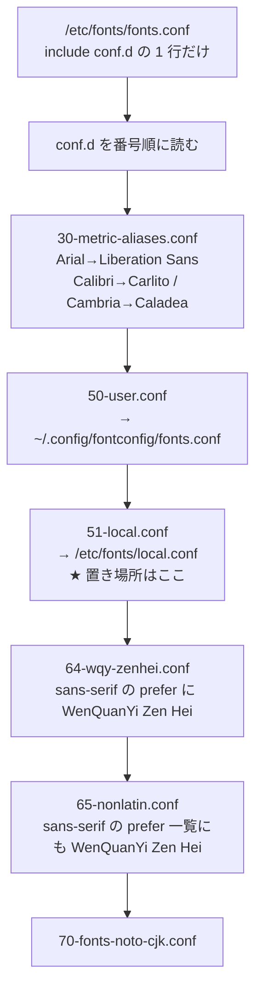
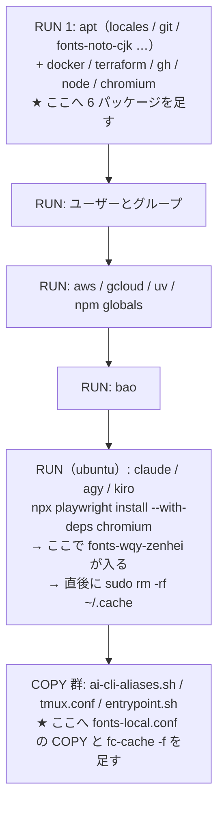

# PLAN63: base イメージの日本語の描画と、文書を扱う軽量の道具 の設計

要求と受け入れ条件は [PLAN63_base-image-rendering.md](PLAN63_base-image-rendering.md) にある。
この文書は「どう作るか」だけを扱う。

## 機能一覧

| # | 機能 | 誰が使うか |
| --- | --- | --- |
| F1 | 総称ファミリ（`sans-serif` / `sans` / `serif` / `monospace`）と、イメージに無い書体名の指定を、Noto CJK の JP フェイスへ向ける | base とその派生イメージで文字を描くすべての道具（Chromium / Playwright / PDF の生成 / 画像の生成） |
| F2 | 中国語・韓国語を明示した指定を、その言語の、同じ様式のフェイスへ向ける | 同上 |
| F3 | PDF を画像にする・調べる、OOXML を壊さずに読み書きする、欧文の字幅を正しく測る道具を base へ入れる | `document-skills` を使う利用者 |
| F4 | 上の 3 つを回帰テストで固定し、利用者向け文書と CHANGELOG を合わせる | devbase の開発者・利用者 |

## 解決の経路

fontconfig は `/etc/fonts/fonts.conf` から始まり、そこにある `<include>` 1 行で `conf.d` を
**ファイル名の番号順**に読む。`local.conf` は `conf.d/51-local.conf` 経由で読まれる。



**`<prefer>` は、一致した総称ファミリの直前へ挿入する（prepend）。** そのため
**最も早く読まれた `<prefer>` が先頭に残る。** 効くのは順序が後だからではなく、先だからである。
`51` は `64` / `65` より先なので、`local.conf` の指定が勝つ。

## 実測（2026-09-22 / arm64 の `devbase-base:latest`）

Ubuntu 26.04 / fontconfig 2.17.1 / イメージのサイズ 7.09GB。稼働中のコンテナへ設定と
パッケージを入れて測った（イメージは建て直していない）。

### 解決先の表（この設計が固定するもの）

| 指定 | 変更前 | 変更後 |
| --- | --- | --- |
| `sans-serif` | WenQuanYi Zen Hei | **Noto Sans CJK JP** |
| `sans-serif:lang=ja` | WenQuanYi Zen Hei | **Noto Sans CJK JP** |
| `sans` | WenQuanYi Zen Hei | **Noto Sans CJK JP** |
| `serif` | WenQuanYi Zen Hei | **Noto Serif CJK JP** |
| `monospace` | WenQuanYi Zen Hei Mono | **Noto Sans Mono CJK JP** |
| `Noto Sans JP` | WenQuanYi Zen Hei | **Noto Sans CJK JP** |
| `Meiryo` / `Yu Gothic` / `MS PGothic` | WenQuanYi Zen Hei | **Noto Sans CJK JP** |
| `Zen Kaku Gothic New`（未導入） | WenQuanYi Zen Hei | **Noto Sans CJK JP** |
| `Arial` | Liberation Sans | Liberation Sans |
| `Times New Roman` | Liberation Serif | Liberation Serif |
| `Courier New` | Liberation Mono | Liberation Mono |
| `Calibri` | WenQuanYi Zen Hei | **Carlito**（パッケージの追加による） |
| `Cambria` | WenQuanYi Zen Hei | **Caladea**（同上） |
| `sans-serif:lang=zh-cn` | Noto Sans CJK SC | Noto Sans CJK SC |
| `sans:lang=zh-cn` | Noto Sans CJK SC | Noto Sans CJK SC |
| `serif:lang=zh-cn` | Noto Serif CJK SC | Noto Serif CJK SC |
| `monospace:lang=zh-cn` | Noto Sans Mono CJK SC | Noto Sans Mono CJK SC |
| `sans-serif:lang=ko` | WenQuanYi Zen Hei | **Noto Sans CJK KR** |
| `sans:lang=ko` | WenQuanYi Zen Hei | **Noto Sans CJK KR** |
| `serif:lang=ko` | WenQuanYi Zen Hei | **Noto Serif CJK KR** |
| `monospace:lang=ko` | WenQuanYi Zen Hei Mono | **Noto Sans Mono CJK KR** |
| `Arial:lang=zh-cn` | Liberation Sans | Liberation Sans |
| `Times New Roman:lang=zh-cn` | Liberation Serif | Liberation Serif |
| `Arial:lang=ko` | Liberation Sans | Liberation Sans |
| `WenQuanYi Zen Hei`（名指し） | WenQuanYi Zen Hei | WenQuanYi Zen Hei |
| `IPAPGothic`（名指し） | IPAPGothic | IPAPGothic |

`fc-match -s sans-serif:lang=ja` の並びも変わる。

| | 1 番目 | 2 番目 | 3 番目 |
| --- | --- | --- | --- |
| 変更前 | WenQuanYi Zen Hei | IPAPGothic | Loma（タイ語） |
| 変更後 | **Noto Sans CJK JP** | WenQuanYi Zen Hei | IPAPGothic |

### パッケージの追加の実測

`apt-get install --no-install-recommends` で 6 つを指定した結果である。

| 項目 | 値 |
| --- | --- |
| 指定するパッケージ | 6 |
| 依存を含めて新規に入るパッケージ | **24** |
| ディスクの増分 | **約 24 MB**（apt のリストとキャッシュを含む測り方。7.09GB に対して +0.34%） |
| 使えるようになるコマンド | `pdftoppm` / `pdfinfo` / `pdffonts` / `pdftocairo` |
| 使えるようになるモジュール | `PIL` 12.1.1 / `defusedxml` 0.7.1 / `lxml` 6.0.2 |
| 入らないもの | `soffice` / `libreoffice` / `pip` / `pip3` |

## 構成要素

| 要素 | 変更 | 責務 |
| --- | --- | --- |
| `containers/base/fonts-local.conf`（新設） | 足す | 総称ファミリの先頭を日本語フェイスにする。未導入の書体の受け皿を置く。中国語・韓国語を明示した指定を守る。**先頭に、置き場所を動かせない理由をコメントで持つ** |
| `containers/base/Dockerfile` の 1 つ目の `RUN` の `apt-get install` | 変える | `fonts-noto-cjk` の行の隣へ 6 パッケージを足す |
| `containers/base/Dockerfile` の末尾の `COPY` 群 | 変える | `COPY --chmod=0644 fonts-local.conf /etc/fonts/local.conf` を足し、直後に `RUN sudo fc-cache -f` を置く |
| `tests/containers/test_base_dockerfile_fonts.py`（新設） | 足す | Docker を起動せずに、Dockerfile と `fonts-local.conf` の**形**を固定する |
| `tests/containers/test_base_image_font_matching.py`（新設） | 足す | 建てたイメージの中で `fc-match` の**解決先の表**を固定する。イメージが無い / 古いときは skip |
| `docs/user/container-operations.md` | 変える | base の説明に、日本語のフェイスと文書の道具の行を足す |
| `CHANGELOG.md` | 変える | `[Unreleased]` に `### Added`（6 パッケージ）と `### Fixed`（日本語が中国語フォントで描画される）。**イメージを建て直すまで反映されない**ことを添える |

次のものは変えない。

- `fonts-wqy-zenhei` を削除しないこと（要求の前提 2）。Dockerfile に導入の行は無く、
  `npx playwright install --with-deps chromium` が依存として入れる
- `npx playwright install --with-deps chromium` とその後のクリーンアップ（前提 5、#220）
- 派生イメージの Dockerfile（すべて `FROM devbase-base:latest`）
- `containers/lfm`（base 由来ではない）

## 入出力の契約

### `containers/base/fonts-local.conf`

先頭のコメントは**受け入れ条件 8 が要求する内容**（置き場所を動かせない理由と、その実測）を持つ。

```xml
<?xml version="1.0"?>
<!DOCTYPE fontconfig SYSTEM "urn:fontconfig:fonts.dtd">
<!--
  base コンテナの日本語の描画（devbasex/devbase#161）

  このファイルは /etc/fonts/local.conf へ置く。conf.d/ へ置いてはいけない。

  /etc/fonts/fonts.conf は <include>conf.d</include> の 1 行しか持たず、conf.d を番号順に
  読む。local.conf は conf.d/51-local.conf 経由で読まれる ── つまりスロット 51 で、
  sans-serif を WenQuanYi Zen Hei（中国語）へ向けている 64-wqy-zenhei.conf と
  65-nonlatin.conf より「先」である。

  <prefer> は一致した総称ファミリの直前へ挿入する（prepend）ため、最も早く読まれた
  <prefer> が先頭に残る。効くのは順序が後だからではなく、先だからである。

  同じ内容を conf.d/99-devbase-fonts.conf へ置いて実測した結果（2026-09-22、arm64）:

    置き場所                              fc-match sans-serif   fc-match sans-serif:lang=ja
    /etc/fonts/local.conf                 Noto Sans CJK JP      Noto Sans CJK JP
    /etc/fonts/conf.d/99-devbase-fonts.conf  WenQuanYi Zen Hei  WenQuanYi Zen Hei

  <match target="pattern"> の規則（下の zh-cn / ko）はどのスロットからでも効くが、
  <alias><prefer> は 64 / 65 より先に読まれないと効かない。だから 99 では直らない。

  利用者は ~/.config/fontconfig/fonts.conf（スロット 50、このファイルより先）で
  上書きできる。実測で確認済み。
-->
<fontconfig>
  <!-- 総称ファミリの先頭を日本語フェイスにする -->
  <alias><family>sans-serif</family><prefer><family>Noto Sans CJK JP</family></prefer></alias>
  <alias><family>sans</family><prefer><family>Noto Sans CJK JP</family></prefer></alias>
  <alias><family>serif</family><prefer><family>Noto Serif CJK JP</family></prefer></alias>
  <alias><family>monospace</family><prefer><family>Noto Sans Mono CJK JP</family></prefer></alias>

  <!-- 未導入の書体を指定されたときの受け皿。弱い結合なので実在する指定は妨げない -->
  <match target="pattern">
    <edit name="family" mode="append" binding="weak"><string>Noto Sans CJK JP</string></edit>
  </match>

  <!--
    中国語・韓国語を明示したときは、その言語の、しかも同じ様式のフェイスを保つ。
    総称ファミリを名指しした指定にだけ効かせる（<test name="family">）。
    この test を省くと、Arial:lang=zh-cn のような欧文の指定まで CJK のフェイスへ
    奪われる。実測済み ── 下の「決定 2」を参照。
  -->
  <match target="pattern">
    <test name="family"><string>sans-serif</string></test>
    <test name="lang" compare="contains"><string>zh-cn</string></test>
    <edit name="family" mode="prepend" binding="strong"><string>Noto Sans CJK SC</string></edit>
  </match>
  <!-- 以下、sans / serif / monospace × zh-cn / ko の残り 7 つを同じ形で並べる -->
</fontconfig>
```

規則は 4 つの `<alias>` と 9 つの `<match>` で構成する。`<match>` の内訳は、未導入の書体の
受け皿が 1 つと、**総称ファミリ 4 つ × 言語 2 つ = 8 つ**である。

| 総称ファミリ | `lang=zh-cn` で前置する | `lang=ko` で前置する |
| --- | --- | --- |
| `sans-serif` | `Noto Sans CJK SC` | `Noto Sans CJK KR` |
| `sans` | `Noto Sans CJK SC` | `Noto Sans CJK KR` |
| `serif` | `Noto Serif CJK SC` | `Noto Serif CJK KR` |
| `monospace` | `Noto Sans Mono CJK SC` | `Noto Sans Mono CJK KR` |

これらのフェイスは `fonts-noto-cjk` / `fonts-noto-cjk-extra` に既にあり、追加の導入は要らない
（`fc-list : family` で JP / SC / KR の Sans・Serif・Sans Mono の 9 つの存在を確認済み）。

### `containers/base/Dockerfile` の差分の形

**1 つ目の `RUN`（最初の `apt-get install`）**: `fonts-noto-cjk fonts-noto-cjk-extra` の行の隣へ
足す。理由は決定 4。

```dockerfile
    libnss3 libxrandr2 libxss1 \
    fonts-noto-cjk fonts-noto-cjk-extra \
    fonts-crosextra-carlito fonts-crosextra-caladea \
    poppler-utils python3-pil python3-defusedxml python3-lxml; \
```

**末尾の `COPY` 群**（`ai-cli-aliases.sh` / `tmux.conf` と同じ区画、`USER ubuntu` より後）:

```dockerfile
COPY --chmod=0644 fonts-local.conf /etc/fonts/local.conf
RUN sudo fc-cache -f
```

`COPY` の所有者は `USER` の指定によらず root になるため、既存の `tmux.conf` と同じ形でよい。
`fc-cache` は root で走らせる必要があるので `sudo` を付ける（同じ区画の
`sudo install -d` / `sudo ln -sf` と同じ流儀。`ubuntu` は NOPASSWD の sudo を持つ）。

## 処理の流れ

ビルドの層と、この変更が触る位置。



**`fc-cache -f` は `L5` より後でなければならない。** `L5` の `--with-deps` が
`fonts-wqy-zenhei` / `fonts-ipafont-gothic` / `fonts-liberation` などを入れ、その直後に
`~/.cache` を消す。`L5` より前で走らせると、後から入った書体を知らないキャッシュが残る。

## 決定の記録

### 決定 1: 置き場所は `/etc/fonts/local.conf` から動かさない

`conf.d/99-*.conf` へ置くと効かない。同じ内容で実測した（2026-09-22、arm64）。

| 置き場所 | `fc-match sans-serif` | `fc-match sans-serif:lang=ja` |
| --- | --- | --- |
| `/etc/fonts/local.conf` | **Noto Sans CJK JP** | **Noto Sans CJK JP** |
| `/etc/fonts/conf.d/99-devbase-fonts.conf` | WenQuanYi Zen Hei | WenQuanYi Zen Hei |

理由は「解決の経路」に書いたとおりで、`<prefer>` が prepend であり、**最も早く読まれた
`<prefer>` が先頭に残る**ためである。`51-local.conf` は `64` / `65` より先に読まれる。

**この実測では、もう 1 つ分かったことがある。** `99-` へ置いた場合でも
`<match target="pattern">` の規則（zh-cn / ko の前置）は効いていた。効かないのは
`<alias><prefer>` だけである。**規則の種類によって順序への依存が違う**ため、
「99 でも一部は効く」ことを知らないと、部分的に直ったのを見て置き場所の問題を見落とす。

この理由は `containers/base/fonts-local.conf` の先頭のコメントにも同じ内容で残す（受け入れ条件 8）。

**`conf.d/00-*.conf` のように小さい番号を使う案は採らない。** 動きはするが、
`local.conf` は fontconfig が「システムの局所的な設定」のために用意した場所で、番号の
付け替えで順序を取りに行くのは他のパッケージの番号と競合する。

### 決定 2: 中国語・韓国語の規則は、総称ファミリを名指ししたときだけ効かせる

**#161 の本文にある形（`lang` だけを見て前置する）は採らない。実測で壊れるものが見つかった。**

3 つの変種を同じイメージの中で比べた（2026-09-22、arm64）。

| 指定 | 規則なし | #161 の形（`lang` だけ） | この設計（`family` + `lang`） |
| --- | --- | --- | --- |
| `sans-serif:lang=zh-cn` | Noto Sans CJK SC | Noto Sans CJK SC | Noto Sans CJK SC |
| `serif:lang=zh-cn` | Noto Serif CJK SC | **Noto Sans CJK SC** ← 様式が崩れる | Noto Serif CJK SC |
| `monospace:lang=zh-cn` | Noto Sans Mono CJK SC | **Noto Sans CJK SC** ← 等幅でなくなる | Noto Sans Mono CJK SC |
| `sans-serif:lang=ko` | **Noto Sans CJK JP** ← 韓国語が日本語の字形になる | Noto Sans CJK KR | Noto Sans CJK KR |
| `serif:lang=ko` | **Noto Serif CJK JP** ← 同上 | **Noto Sans CJK KR** ← 様式が崩れる | Noto Serif CJK KR |
| `Arial:lang=zh-cn` | Liberation Sans | **Noto Sans CJK SC** ← 欧文が奪われる | Liberation Sans |
| `Times New Roman:lang=zh-cn` | Liberation Serif | **Noto Sans CJK SC** ← 同上 | Liberation Serif |

**`binding="strong"` の前置は、名指しの書体よりも強い。** そのため `lang` だけを条件にすると、
`lang=zh-cn` が付いたすべてのパターン ── `Arial` や `Times New Roman` を名指しした欧文の
指定を含む ── から、指定した書体を奪う。Chromium は中国語のページで `lang=zh-cn` を
載せるため、これは絵に描いた話ではない。

**規則を 1 つも置かない案も採らない。** `zh-cn` は OS 既定の `65-nonlatin.conf` と
`70-fonts-noto-cjk.conf` が正しく扱うので規則なしでも合うが、**`ko` は合わない**
（決定 8 の `sans-serif` の prefer が JP を先頭にするため、韓国語が日本語の字形になる）。
`ko` だけ書くと非対称で、なぜ `zh-cn` が無いのかが後から読めない。8 つ並べて対称にする。

### 決定 3: 未導入の書体の受け皿は、弱い結合の `append` 1 つで足りる

`<edit name="family" mode="append" binding="weak">` は、すべてのパターンの末尾へ
`Noto Sans CJK JP` を足す。**弱い結合なので、実在する指定を妨げない。** `Arial` は
`30-metric-aliases.conf`（スロット 30、このファイルより先）の強い結合で Liberation Sans へ
向くため、受け皿は末尾に付くだけで結果を変えない。実測で確認した（`Arial` / `Times New Roman` /
`Courier New` / `Calibri` / `Cambria` のいずれも変わらない）。

条件（`<test>`）を付けて「未導入のときだけ」足す形は採らない。fontconfig に「その書体が
実在するか」を問う `<test>` は無く、弱い結合がまさにその働きをする。

### 決定 4: 6 パッケージは、1 つ目の `RUN` の最初の `apt-get install` の一覧へ足す

Dockerfile の 1 つ目の `RUN` は `apt-get install` を 2 回呼ぶ。1 回目は Ubuntu の標準の
アーカイブから（`locales` / `git` / `fonts-noto-cjk` など）、2 回目は足したリポジトリから
（`docker-ce` / `terraform` / `gh` / `nodejs` / `chromium-browser`）。

**2 つの一覧はどちらも同じ `RUN` の中にあり、キャッシュの鍵は 1 つである。** どちらへ書いても
キャッシュの効き方は同じになる。6 つはすべて標準のアーカイブにあり外部のリポジトリを要さない
ので、1 回目の一覧へ、既にあるフォントの行の隣へ置く。

**新しい `RUN` を立てる案は採らない。** 立てれば、この 6 つを後から足し引きしても 1 つ目の
巨大な層のキャッシュは無効にならない。しかし代償が 3 つある。

| 代償 | 内容 |
| --- | --- |
| 層が 1 つ増える | base は既に層が多い。派生イメージ 7 つがこの上に積む |
| `apt-get update` をもう 1 回走らせる | 1 つ目の `RUN` は最後に `rm -rf /var/lib/apt/lists/*` でリストを消す。新しい `RUN` はリストを取り直す必要がある |
| クリーンアップを書き写す | `apt-get clean` と `rm -rf` を 2 か所に持つことになる |

**キャッシュが無効になる条件は、その `RUN` の命令の文字列が変わるか、親の層が変わるか、
`--no-cache` を渡すかの 3 つである。** 取得先の中身が変わってもキャッシュは無効にならない
（`curl | bash` は、キャッシュが効いている間は実行されない）。

**この変更そのものが 1 つ目の `RUN` の文字列を変えるため、層を分けても分けなくても、この
変更では 1 度建て直される。** 層を分けて守れるのは「次にこの 6 つを足し引きしたとき」だけで、
その頻度は低い。`devbase build base --no-cache` はどのみち全部を建て直す。層を増やして
守るほどの利得が無い。

### 決定 5: `COPY` と `fc-cache -f` は末尾の `COPY` 群へ置く

**`fc-cache -f` は、Playwright が `--with-deps` でフォントを入れる `RUN` より後でなければ
ならない。** その `RUN` は `fonts-wqy-zenhei` / `fonts-ipafont-gothic` / `fonts-liberation` などを
入れ、直後に `~/.cache` を消す。

末尾へ置くことには、キャッシュの上の利点もある。`fonts-local.conf` を書き換えたとき、
無効になるのは末尾の数層だけで、巨大な `RUN` は建て直されない。

**フォントのパッケージを入れる 1 つ目の `RUN` の中で `fc-cache` を走らせる案は採らない。**
Playwright が後から入れるフォントを知らないキャッシュが残り、しかも `fonts-local.conf` を
1 文字直すたびにイメージ全体が建て直しになる。

なお `fc-cache` は `local.conf` の内容を反映するためではない（設定は照合のたびに読まれる）。
走らせるのは、`~/.cache` を消した後に `/var/cache/fontconfig` を作り直し、コンテナの初回起動
時のキャッシュ生成を避けるためである。

### 決定 6: 回帰テストは 2 段にする。形は Docker なしで、解決先は Docker ありで固定する

**Dockerfile の文字列検査だけでは足りない。** 固定したいのは「`COPY` の行があること」では
なく「`fc-match sans-serif` が日本語を返すこと」で、後者は文字列からは分からない。決定 2 の
ような壊れ方（`lang` の条件が広すぎて欧文を奪う）は、Dockerfile を読んでも見えない。

| テスト | Docker | 何を固定するか |
| --- | --- | --- |
| `tests/containers/test_base_dockerfile_fonts.py` | 不要 | 6 パッケージが一覧にあること。`COPY` の宛先が `/etc/fonts/local.conf` であり `conf.d/` ではないこと。`fc-cache -f` が `COPY` より後にあること。`fonts-local.conf` が整形式の XML で、4 つの `<alias>` と 9 つの `<match>`（受け皿 1 つと、総称ファミリ 4 つ × 言語 2 つの 8 つ）を持つこと。先頭のコメントが置き場所の理由（`51-local.conf` / `conf.d` / `99`）に触れていること。`libreoffice` / `soffice` / `pip` を入れていないこと。Dockerfile に `fonts-wqy-zenhei` を対象とする `apt-get remove` / `apt-get purge` / `dpkg -r` が無いこと |
| `tests/containers/test_base_image_font_matching.py` | 要る | 「解決先の表」の各行。1 回の `docker run` で全部の `fc-match` を採り、行ごとに突き合わせる |

**Docker が要るテストは、`tests/snapshot/test_restore_incremental.py` の先例に合わせる。**
そこは fixture の中で `shutil.which('docker')` → `docker info` → `docker image inspect` の 3 段を
見て `pytest.skip` する（marker は使わない。`pyproject.toml` に marker の登録も `addopts` も無い）。

**それに 1 段足す。イメージの中に `/etc/fonts/local.conf` が無ければ skip する。** 理由は、
この変更より前に建てた `devbase-base:latest` を持っている人が全員 `pytest tests/` で赤くなる
のを避けるためである。skip の文言に `devbase build base --no-cache` を書き、建て直せば検査が
効くようにする。**古いイメージを「失敗」として知らせる案は採らない。** 正しい作業ツリーで
テストが赤くなり、赤の意味が「壊れている」と「イメージが古い」で混ざる。

**このテストは CI では動かない。** `.github/workflows/ci.yml` にイメージを建てるジョブは 1 つも
無く、runner に `devbase-base:latest` は無いので skip になる。さらに
**`release/v3.7.0` を base にした Pull Request では検査ジョブが 1 件も動かない**
（`on.pull_request.branches` が `main` だけ。#216）。**`gh pr checks` の `no checks reported` と
`mergeStateStatus: CLEAN` は「通った」ことを意味しない。** そのため、解決先の表の証跡は
手元で採って Pull Request 本文へ貼る。

**環境変数（`DEVBASE_IMAGE_TESTS=1` など）で明示的に有効化する案は採らない。** 既存の
Docker を使うテストが環境変数を要求しておらず、流儀が 2 つに割れる。イメージの中に
`/etc/fonts/local.conf` があるかどうかは、「この検査が意味を持つ状態か」をそのまま表す。

### 決定 7: 設定は Dockerfile のヒアドキュメントではなく、独立したファイルにする

`containers/base/` のビルドコンテキストはこのディレクトリそのものなので、ファイルを置けば
`COPY` で届く（`ai-cli-aliases.sh` / `tmux.conf` と同じ形）。独立したファイルにすると、
XML として検査でき、差分が読め、置き場所の理由のコメントを長く書ける。#161 が求めている
「ファイル先頭のコメント」も、ヒアドキュメントの中では Dockerfile のコメントと混ざる。

### 決定 8: 日本語を既定にし、言語を明示しない中国語は日本語の字形で描く

base の利用者は日本語話者で、扱う文書も日本語が多い。`lang` を伴わない `sans-serif` は
どちらかの言語を選ばざるをえず、**「日本語の文書が中国語の字形で描かれる」を裏返して
「言語を明示しない中国語の文書が日本語の字形で描かれる」にする。**

裏返す先が小さいことは実測で確かめてある。中国語を明示した指定（`lang=zh-cn`）と、中国語の
書体を名指しした指定（`WenQuanYi Zen Hei`）はどちらも変わらない。Chromium は
`<html lang="zh-CN">` のページで `lang` を載せる。

### 決定 9: 利用者の上書きの口は塞がない

`/etc/fonts/conf.d/50-user.conf` が `~/.config/fontconfig/fonts.conf` を読む。スロット 50 は
`51-local.conf` より**先**なので、利用者が自分の `fonts.conf` で別の `<prefer>` を書けば
そちらが勝つ。実測で確認した（利用者側で `sans-serif` を `WenQuanYi Zen Hei` に戻せた）。

この性質はこの設計が作るものではなく、`/etc/fonts/local.conf` を選んだことの帰結である。
`conf.d/00-*.conf` を使っていたら、利用者の設定より先に読まれて上書きを塞いでいた。

## テスト設計

| 受け入れ条件 | 何で確かめるか |
| --- | --- |
| 1・2・3・4 | `test_base_image_font_matching.py` の解決先の表（JP の行）。Docker が無い / イメージが古いときは skip |
| 5・11 | 同じ表の欧文の行（`Arial` / `Times New Roman` / `Courier New` / `Calibri` / `Cambria`） |
| 6 | 同じ表の `lang` を明示した行 12 行（総称ファミリ 4 つ × 言語 2 つの 8 行と、欧文を名指しした 3 行、中国語の書体を名指しした 1 行）。**決定 2 の壊れ方を捕まえるのはこの行である** |
| 7 | `test_base_dockerfile_fonts.py`: `COPY` の宛先が `/etc/fonts/local.conf` であること、`conf.d/` を宛先にする `COPY` が無いこと、`fc-cache -f` が 1 度だけで `COPY` より後にあること |
| 8 | `test_base_dockerfile_fonts.py`: `fonts-local.conf` の先頭のコメントが `51-local.conf` と `conf.d` と `99` に触れていること。設計文書の側は目視 |
| 9・10・12 | `test_base_image_font_matching.py` と同じ `docker run` の中で、`command -v` と `python3 -c "import …"` の結果も採る |
| 13 | ビルドの前後の `docker images`。手で測って Pull Request 本文へ貼る |
| 14 | `uv run --locked pytest tests/ -q` |
| 15 | `devbase build base --no-cache` |
| 16 | 派生イメージを 1 つ建て直して `fc-match sans-serif` を見る。手で確かめて Pull Request 本文へ貼る |

`test_base_image_font_matching.py` は `docker run` を**セッションで 1 回**に抑える
（`scope="session"` の fixture が 1 つのスクリプトを走らせ、結果を辞書にして返す）。
`fc-match` を 20 回別々に `docker run` すると、コンテナの起動だけで数十秒かかる。

## 未確認のまま残ること

| 項目 | 内容 |
| --- | --- |
| LibreOffice と Chromium での実際の描画 | どちらも base に無いため実機未検証。確かめたのは `fc-match` の水準まで。LibreOffice は fontconfig とは別の照合も持つため、解決先が `fc-match` と一致しないことがある（#161 の由来になった `volareinc/nyle-dx` PR #5 では `NotoSansCJKsc` が埋め込まれていた）。`containers/docs`（#219）を作るときに、そこで確かめる |
| amd64 での再現 | 手元は arm64 のみ。amd64 では `google-chrome-stable` が追加で入るため、`--with-deps` が入れるフォントの顔ぶれが違いうる。`fc-match` の表が同じになるかは、amd64 の端末で建てるまで分からない |
| `containers/lfm` | `FROM nvidia/cuda:...` で base 由来ではなく、`fonts-noto-cjk` を自前で入れている（`containers/lfm/Dockerfile:23`）。同じ問題を抱えるかは未調査。抱えていれば別途起票する |
| イメージの増分の測り方 | 24 MB は稼働中のコンテナでの `du` の差で、apt のリストとキャッシュを含む。層としての増分は、実装の持ち場で `devbase build base --no-cache` の前後の `docker images` で測り直す |
| 利用者への周知 | 建て直すまで反映されないため、CHANGELOG に `devbase build base --no-cache` が要ることを書く。既に建てた人がいつ建て直すかは devbase の側から決められない |
