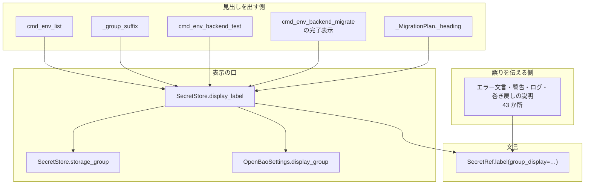
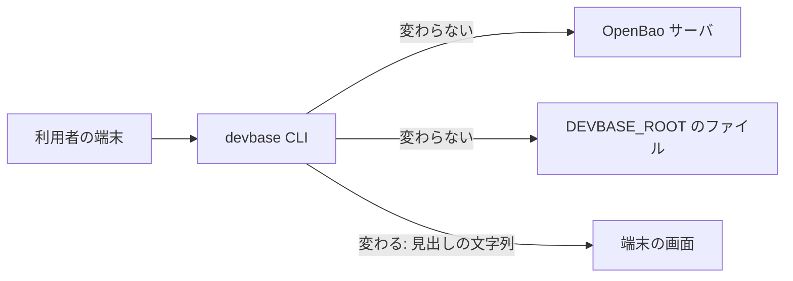
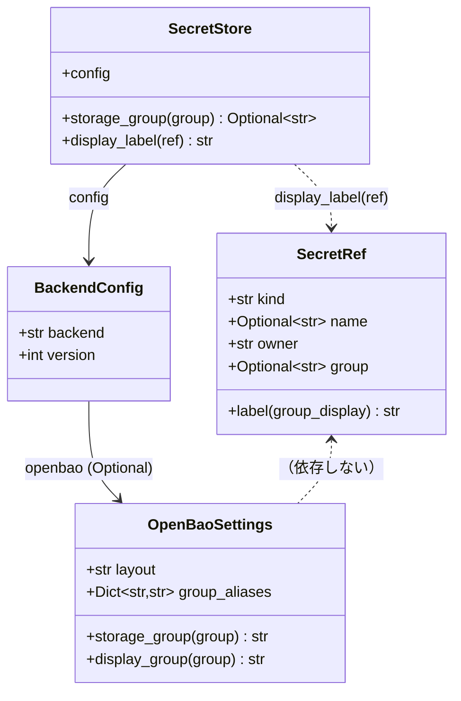
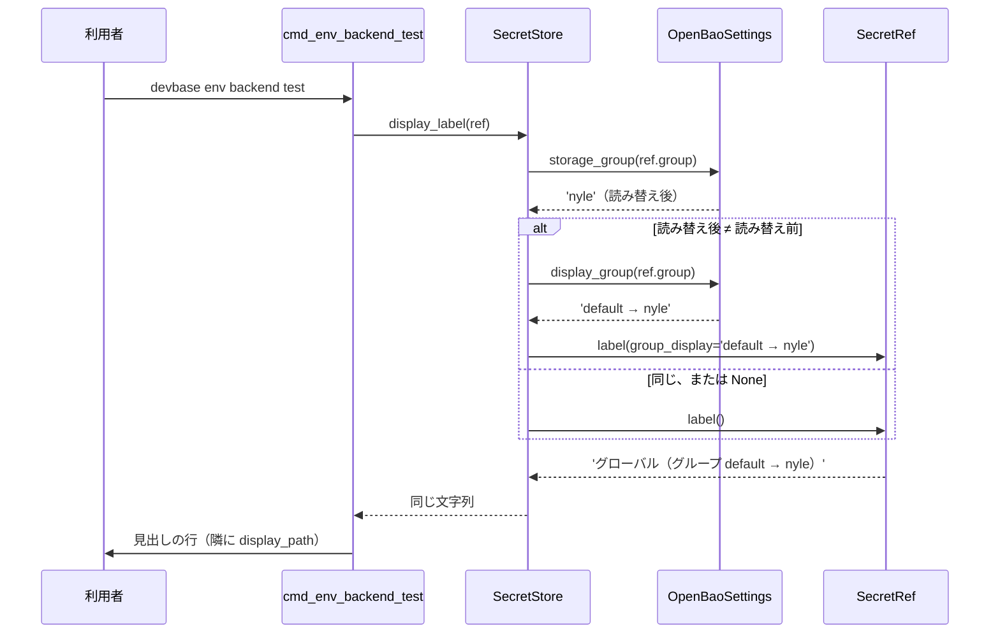

# PLAN64: 機密の参照の見出しにグループの読み替えを出す設計

要求と受け入れ条件は [PLAN64_secret-label-group.md](PLAN64_secret-label-group.md) にある。この文書は「どう作るか」だけを扱う。

## 機能一覧

| # | 機能 | 誰が使うか |
| --- | --- | --- |
| F1 | 参照の見出しのグループ名が、読み替えの前と後（`default → nyle`）を出す | `env list` / `env backend test` / `env backend migrate` を打つ利用者 |
| F2 | エラー文言・警告・ログに出る参照の表示は、読み替える前の名前のままにする | 失敗の原因を読む利用者と、ログを読む開発者 |
| F3 | 参照の表示の文言を組み立てる場所を 1 つに保つ | devbase の開発者（新しい見出しを足す人） |
| F4 | 確定仕様が、どの文言がどちらの形になるかを重ならない形で述べる | 確定仕様の読み手 |

## 構成要素

### コード

| 要素 | 変更 | 責務 |
| --- | --- | --- |
| `SecretRef.label()`（`lib/devbase/env/secret_store.py`） | 変える | 参照の表示の文言を組み立てる唯一の場所。キーワード引数 `group_display` を足し、グループの括弧の中に入れる名前だけを外から受ける。省いたときは今までどおり `self.group`（読み替える前の名前）を入れる |
| `SecretStore.display_label(ref)`（同） | 足す | 見出し用の表示を作る唯一の口。`storage_group(ref.group)` で読み替えの要否を判定し、要るときだけ `OpenBaoSettings.display_group` の結果を `label(group_display=...)` へ渡す |
| `SecretStore.storage_group`（同） | 変えない | 「グループの表示に読み替えを出すか」の判定に使う。`backend` が `openbao` でない・設定が無い・`layout: flat`・グループが `None` のいずれでも `None` を返す |
| `OpenBaoSettings.display_group`（`lib/devbase/env/backend_config.py`） | 変えない | 読み替えの前と後の文字列（`default → nyle`）を作る |
| `cmd_env_list` の共通の節（`lib/devbase/commands/env.py`） | 変える | `env_file.ref.label()` を `store.display_label(env_file.ref)` にする |
| `_group_suffix`（同） | 変える | 引数に `store` を取り、`display_label` の差分を取る。文言は写さない |
| `cmd_env_backend_test`（`lib/devbase/commands/env_backend.py`） | 変える | 参照ごとの行の `ref.label()` を `store.display_label(ref)` にする |
| `cmd_env_backend_migrate` の完了表示（同） | 変える | 「サーバ上の機密はそのまま残っています」の一覧の `unit.server_ref.label()` を `display_label` にする |
| `_MigrationPlan._heading`（同） | 変える | 移行の計画の一覧の `unit.server_ref.label()` を `self.server_store.display_label(...)` にする |

変えないものは次の 6 つである。

| 変えないもの | 理由 |
| --- | --- |
| `SecretRef` のフィールドと等価性 | 参照の等価性とキャッシュの鍵に入っている |
| `OpenBaoSettings.path_of` / `display_path` | 置き場のパスは今も読み替え後の名前を出している |
| `env backend status` の表示 | すでに `display_group` を使っている |
| `bundle.py` / `io_import.py` の「別の置き場のプロジェクト」の列挙 | 同上 |
| `display_label` を通らない 47 か所の `label()` の呼び出し | 決定 2・決定 5 |
| 一覧の桁幅（`:<24` / `:<28` / `:<40`） | 決定 7 |

### 呼び出しの関係

図は `label()` を呼ぶ関係だけを描く。設定の読み込みと backend の選択は省く。



`E` は `label()` を引数なしで呼ぶ。`DL` を経由しないことが F2 の実現方式である。

### 対象の数え方

`lib/` の `.label()` の出現は 52 件 / 10 ファイル（2026-09-22 に `grep -rn "\.label()" lib/` で実測。issue 本文と一致）。
このうち 1 件（`lib/devbase/commands/env.py` の `_group_suffix` の docstring）は文字列の言及で、実行される呼び出しではない。

| 区分 | 件数 | 扱い |
| --- | ---: | --- |
| 見出し（読み替えのあるグループを持ちうる） | 5 | `display_label` へ寄せる |
| 見出し（参照が常にグループを持たない。`env encrypt` / `env decrypt` / `env rekey`） | 3 | 変えない |
| エラー文言・警告・ログ・巻き戻しの説明・使われていない委譲 | 43 | 変えない |
| docstring の言及 | 1 | 変えない |
| 合計 | 52 | |

「変えない」は 47 件（3 + 43 + 1）で、内訳は上の図の `E`（43 件）、グループを持たない一覧（3 件）、docstring の言及（1 件）である。

## 配置

### システムの文脈

この変更が触る外部は無い。`devbase` はホストで動き、置き場のパス・サーバへの要求・キャッシュのファイルはいずれも変わらない。変わるのは端末の画面に出る文字列だけである。



### モジュールの置き場所

```text
lib/devbase/
├── env/
│   ├── secret_store.py      # SecretRef.label に group_display / SecretStore.display_label を足す
│   └── backend_config.py    # 変えない（display_group / storage_group をそのまま使う）
└── commands/
    ├── env.py               # cmd_env_list の共通の節 / _group_suffix
    └── env_backend.py       # cmd_env_backend_test / cmd_env_backend_migrate の完了表示 / _MigrationPlan._heading
tests/
├── env/test_secret_store_label.py   # 新設。label の契約と display_label の分岐
└── commands/test_env_group_label.py # 新設。読み替えのあるグループでのコマンドの出力
docs/specifications/secret-backend.md # 2 か所の書き分けと list の見出しの例
docs/user/env-backend.md              # 見出しの例に読み替えのある場合を足す
docs/user/cli-reference/03-env.md     # 同上
CHANGELOG.md                          # Unreleased の Fixed
```

## 構造



`SecretRef` は `frozen=True` のままで、フィールドを足さない。`group` は等価性とキャッシュの鍵に入っているため、表示のための値をフィールドとして持たせない。

## 入出力の契約

### `SecretRef.label(*, group_display=None) -> str`

| 引数 | 型 | 既定 | 意味 |
| --- | --- | --- | --- |
| `group_display` | `Optional[str]` | `None` | グループの括弧の中に入れる名前。`None` なら `self.group`（読み替える前の名前） |

| 状況 | 返り値 |
| --- | --- |
| `self.group` が `None` | `グローバル` / `プロジェクト 'web'` / `個人のグローバル` / `個人のプロジェクト 'web'`（`group_display` を渡しても無視する） |
| `self.group` があり `group_display` が `None` | `グローバル（グループ default）` |
| `self.group` があり `group_display` が `default → nyle` | `グローバル（グループ default → nyle）` |

**`group_display` は文字列で受け、`OpenBaoSettings` を受けない。** 参照が設定の型を知らない状態を保つためである。

### `SecretStore.display_label(ref) -> str`

| 状況 | 返り値 |
| --- | --- |
| `storage_group(ref.group)` が `None`（`ref.group` が `None`、backend が `openbao` でない、設定が無い、`layout: flat`） | `ref.label()` と同じ文字列 |
| 読み替えが無い（`storage_group(ref.group) == ref.group`） | `ref.label()` と同じ文字列。`display_group` が `→` を付けないため |
| 読み替えがある | `ref.label(group_display='default → nyle')` |

**判定を `storage_group` に任せるのは、`config.openbao` が `None` かどうかが backend の種類だけでは決まらないためである。** `backend: age` の設定に `openbao:` 節が残っていると、`config.openbao` は `None` にならない。判定しているのは `_openbao_from_dict`（`lib/devbase/env/backend_config.py`）である（2026-09-22 に確認）。`storage_group` は backend の種類・設定の有無・`layout` の 3 つをまとめて見る唯一の判定である。`ref_group` も同じものを使っている。

### 見出しの形

| コマンド | 行 | 読み替えが無いとき | 読み替えがあるとき |
| --- | --- | --- | --- |
| `env list` | 節の見出し | `=== グローバル（グループ kkg） (…) ===` | `=== グローバル（グループ default → nyle） (…) ===` |
| `env list` | 件数の行 | `グローバル（グループ kkg）: 22変数` | `グローバル（グループ default → nyle）: 22変数` |
| `env list` | プロジェクトの節 | `=== プロジェクト: web（グループ kkg） (…) ===` | `=== プロジェクト: web（グループ default → nyle） (…) ===` |
| `env backend test` | 参照ごとの行 | `  グローバル（グループ kkg）        devbase/team/kkg/global      22 変数` | `  グローバル（グループ default → nyle）        devbase/team/nyle/global      22 変数` |
| `env backend migrate` | 計画の一覧 | `  グローバル（グループ kkg）        devbase/team/kkg/global 22 件: …` | `  グローバル（グループ default → nyle）        devbase/team/nyle/global 22 件: …` |
| `env backend migrate --to age` | 完了後の一覧 | `  グローバル（グループ kkg）        devbase/team/kkg/global` | `  グローバル（グループ default → nyle）        devbase/team/nyle/global` |

`version: 1` とファイル backend では、いずれの行にもグループが付かない（`ref.group` が `None`）。

### 失敗の形

`display_label` は例外を送出しない経路だけを通る。`storage_group` が `None` を返せば `label()` をそのまま返し、`None` 以外を返した時点でグループ名の検証は成功している。`display_group` はその直後に同じ `storage_group` を呼ぶため、新たに `BackendConfigError` になる場面が無い。終了コードを持たず、標準出力にも標準エラーにも自分では書かない。

## 処理の流れ



エラー文言の経路はこの図に現れない。`label()` を引数なしで直接呼ぶためである。

## 非機能の実現方式

| 項目 | 条件 | 実現方式 |
| --- | --- | --- |
| 堅牢性 | 誤りを伝える文言の組み立てが、新たな例外を起こさない | `label()` を通して参照を出すエラー文言は、引数なしで呼ぶ。読み替えの解決（`storage_group` / `display_group`。名前の検証と予約語の検査で `BackendConfigError` を送出しうる）を新しく背負う文言を増やさない |
| セキュリティ | 見出しに機密の値が出ない | 変えるのはグループ名だけで、キーも値も触らない。グループ名は `backend.yml` の設定で、機密ではない |
| 互換性 | `version: 1` とファイル backend の出力が 1 文字も変わらない | `display_label` が `storage_group(ref.group) is None` で `ref.label()` を返す。`ref.group` はこれらの設定では常に `None`（`SecretStore.ref_group` の契約） |
| 可読性 | 一覧の桁が崩れない | 桁幅を変えない。読み替えの無い状態でも `プロジェクト 'carmo-ai'（グループ default）` は 31 文字で `:<28` を超えており（2026-09-22 に実測）、桁あふれはこの変更で始まるものではない |
| 性能 | 1 回の表示で増える処理 | `storage_group` は辞書の参照と正規表現の検証だけで、サーバへの要求もファイルの読み込みも増やさない。参照 1 件あたり最大 2 回呼ぶ |

## 決定の記録

### 決定 1: グループの表示の責務を `label()` の契約へ寄せる（issue の `move_responsibility` を採る）

`label()` の引数に `group_display` を足し、見出しの側は「括弧の中に入れる名前」だけを渡す。文言の組み立て（`（グループ …）` の括弧、`個人の` の接頭、チーム単位の文字列）は `label()` の中から出ない。`_group_suffix` が明記している従属関係（「文言は `SecretRef.label()` が持ち、ここでは写さずに差分だけを取り出す」）はそのまま保たれる。

見出しの側で `f'（グループ {display}）'` を組み立てる案は採らない。同じ文言が 5 か所へ複製され、`label()` を直したときに見出しが追随しない。

### 決定 2: `label()` の既定の返り値は変えない

読み替えの解決は `OpenBaoSettings.storage_group` を通り、グループ名の検証と予約語の検査で `BackendConfigError` を送出しうる。既定を読み替え後にすると、43 か所のエラー文言・警告・ログがこの解決に依存する。**誤りを伝える文言を組み立てる途中で新しい例外が起きる形**になり、元の失敗が利用者へ届かなくなる。この危険は仮想のものではない。`BackendConfigError` そのものの文言（`lib/devbase/env/backend_config.py` の `_group_of`）が `label()` を使っている。

`display_group` を直接呼んでいる文言（`lib/devbase/commands/env.py` の `_project_group_mismatch` など）は、この決定の対象ではない。設定が読める場所で組み立てており、今も読み替えの前後を出している。

既定を読み替え後にする案（52 か所すべてに及ぶ案）は採らない。上の理由に加えて、`SecretRef` が `frozen=True` の値であり、設定を持たないまま読み替えを解決する手段が無いためである。持たせるには全フィールドに設定への参照が要り、参照の等価性とキャッシュの鍵に影響する。

### 決定 3: 見出し用の表示を作る口を `SecretStore.display_label` の 1 つに置く

見出しの側が `storage_group` と `display_group` と `label` を毎回組み合わせると、組み合わせ方の誤りが 5 か所で起こりうる。`config.openbao` が `None` の場合の見落としがこれにあたる。判定を 1 か所に閉じ、見出しの側は `store.display_label(ref)` だけを呼ぶ。

`OpenBaoSettings` に口を置く案は採らない。`config.openbao` が `None` の場合と backend が `openbao` でない場合を、呼ぶ側が毎回確かめることになる。`SecretStore` は `storage_group` / `ref_group` / `same_storage_group` で既に同じ判定を引き受けている。

### 決定 4: `env backend migrate` の 2 つの一覧も直す

`lib/devbase/commands/env_backend.py` には、参照の表示とサーバのパスを隣に並べる一覧がもう 2 つある。移行の計画の一覧と、`--to age` の完了後の「サーバ上の機密はそのまま残っています」の一覧である。直さなければ、同じ食い違い（`default` の隣に `nyle` のパス）がそこに残る。issue 本文はこの 2 か所を挙げていないため、受け入れ条件 3 を設計の時点で足した。

### 決定 5: `env encrypt` / `env decrypt` / `env rekey` の一覧は直さない

これらが組む参照は `SecretRef.for_global()` / `SecretRef.for_project(name)` で、`group=` を渡さない。`ref.group` が常に `None` になる。参照を組んでいるのは `_select_refs`（`lib/devbase/commands/env_migrate.py`）と `_encrypted_refs`（`lib/devbase/commands/env_ops.py`）である（2026-09-22 に確認）。見出しにグループが出ないため、直しても出力が変わらない。

### 決定 6: 確定仕様は、どちらか一方を消さずに「文言の種類で分ける」形で解く

`docs/specifications/secret-backend.md` の 2 つの記述は、どちらも正しい振る舞いを述べている。片方を消すと、残った側が対象外の文言まで巻き込む。

| 今の記述 | どう直すか |
| --- | --- |
| 「`label()` はグループがあれば `（グループ <名前>）` を後ろに付ける」 | 既定が読み替える前の名前であることを書く。`group_display` を渡すと前後になることを足す。エラー文言とログが既定を使う理由（読み替えの解決が失敗しうる）を添える |
| 「文言には読み替えの前と後を `default → nyle` の形で出す（`display_group`）」 | 対象を参照の見出し・`status`・別の置き場のプロジェクトの通知に限る。エラー文言とログを除くと書く |
| `list` の見出しの例（`with` の 1 つだけ） | 読み替えのある場合（`default → nyle`）を足す。`with` だけでは前後が一致して矛盾が表に出ない |

### 決定 7: 一覧の桁幅を変えない

`env backend test` の `:<28` は文字数で数え、全角文字の表示幅を数えない。読み替えの無い状態でも `プロジェクト 'carmo-ai'（グループ default）` は 31 文字で既に超えている。読み替えの表示で 7 文字増えるが、桁あふれの性質は変わらない。

幅を広げる案と、実際の最大長から幅を計算する案は採らない。どちらも読み替えの無いグループの出力を変え、受け入れ条件 5・6（変わらないこと）を崩す。桁揃えそのものの見直しは、この変更とは別の課題である。

## テスト設計

`DEVBASE_ROOT` は各テストが自分で差し替える既存の流儀に合わせる。使う道具と手本は次のとおりである。

| 何を | どこから |
| --- | --- |
| 設定の書き込み | `tests/conftest.py` の `configure_openbao`（`layout='group'`、`group_aliases={'default': 'nyle'}` を渡す） |
| `DEVBASE_ROOT` と作業ディレクトリ | `tests/conftest.py` の `openbao_root` fixture |
| 手本にする fixture | `tests/commands/test_env_user_axis.py` の `grouped`（すでに同じ読み替えを設定している） |

| 受け入れ条件 | 何で確かめるか |
| --- | --- |
| 1（`env backend test` の見出し） | `tests/commands/test_env_group_label.py` を新設。`layout='group'`・`group_aliases={'default': 'nyle'}` で `cmd_env_backend_test` を呼び、`capsys` の行に `グローバル（グループ default → nyle）` と `個人のグローバル（グループ default → nyle）` が出ることと、同じ行のパスが `…/team/nyle/global` であることを見る |
| 2（`env list` の見出し） | 同ファイル。`cmd_env_list` を `projects/web`（グループの宣言なし → `default`）で呼び、`=== グローバル（グループ default → nyle） (` と `=== プロジェクト: web（グループ default → nyle） (`、および件数の行 2 つを見る |
| 3（`env backend migrate` の一覧） | 同ファイル。`cmd_env_backend_migrate(to='age', dry_run=True)` を呼び、計画の一覧の行に `グローバル（グループ default → nyle）` が出ることを見る |
| 4（読み替えの無いグループ） | 同ファイル。`projects/web` の `env` に `DEVBASE_ACCOUNT_GROUP=kkg` を書き、見出しが `（グループ kkg）` のままで `→` を含まないことを見る |
| 5（`version: 1`） | 既存の `tests/env/test_runtime.py`・`tests/env/test_groups.py` を変更なしで通す |
| 6（ファイル backend） | 既存の `tests/commands/test_env_user_axis.py` を変更なしで通す |
| 7（エラー文言） | `tests/env/test_secret_store_label.py` を新設。読み替えのあるグループの参照で `label()` を引数なしに呼ぶと `（グループ default）` になること、`label(group_display='default → nyle')` で前後が出ること、`group` が `None` の参照では `group_display` を渡しても無視されることを見る。あわせて、`layout: flat` でグループ付きの参照を拒む例外（`lib/devbase/env/openbao.py` の `OpenBaoBackend._check_group`）の文言に `→` が出ないことを見る |
| 8（`env backend status`） | 既存の `tests/commands/test_env_backend.py` を変更なしで通す |
| 9・10・11（文書） | 実装 Pull Request のレビューで読んで確かめる（自動の検査を置かない） |
| 12（退行） | `uv run pytest tests/ -q` の結果を実装 Pull Request の本文へ載せる |

`display_label` の分岐（`storage_group` が `None` / 読み替えなし / 読み替えあり）は、受け入れ条件 1・4・5・6 のテストが 3 つとも通る。分岐だけの単体テストは `tests/env/test_secret_store_label.py` に 1 件置く。

## 未確認のまま残ること

| 項目 | 内容 |
| --- | --- |
| 実機での見え方 | この端末の機密の置き場は本番の系のため、確認は読み取り（`env backend test` / `env list --keys-only` / `env backend status`）に限る。`env backend migrate` の一覧は `--dry-run` でも移行元の読み取りを伴うため、実機では確かめずテストだけで見る |
| CI | `release/v3.7.0` を base にした Pull Request では CI が 1 件も動かない（`.github/workflows/ci.yml` の対象が `main` だけ、#216）。手元の `uv run pytest tests/ -q` が唯一の証跡になる |
| `tests/conftest.py` の `DEVBASE_ROOT` の隔離 | #217（`release/v3.7.0` 未マージ）が入ると、新しいテストの `DEVBASE_ROOT` の扱いを揃え直す余地がある。この設計では既存の流儀のままにする |
| 桁揃えそのもの | 全角文字の表示幅を数えない桁揃えは、読み替えの有無に関わらず長い参照で崩れる。この変更では扱わない |
</content>
