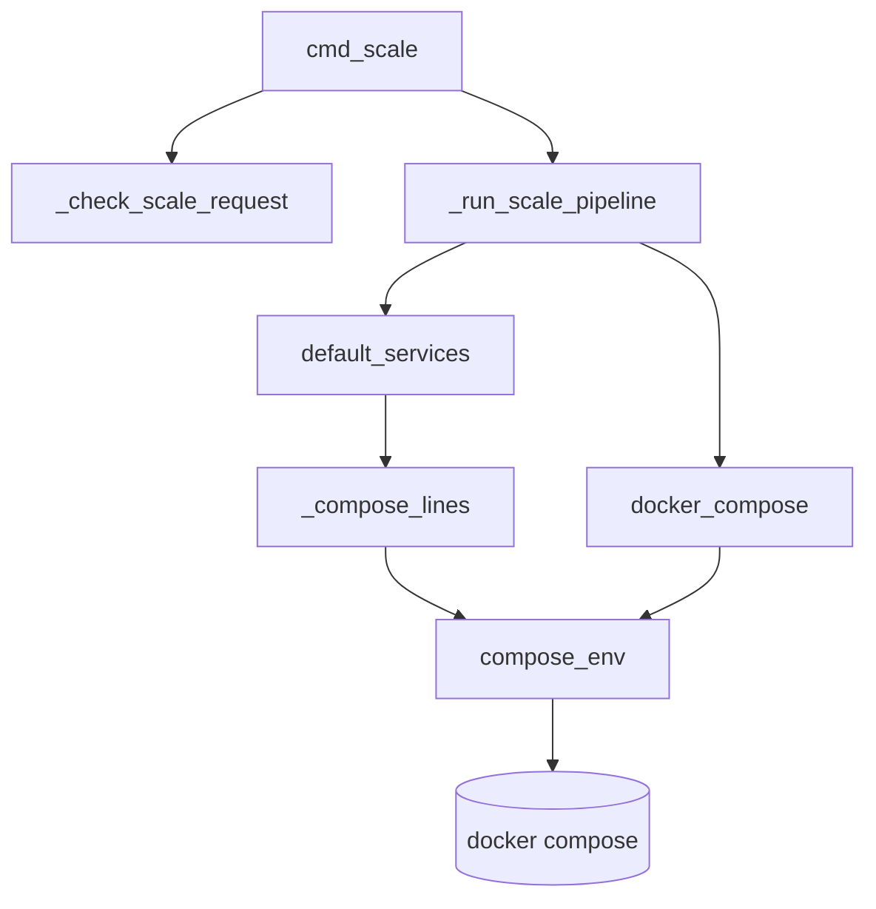
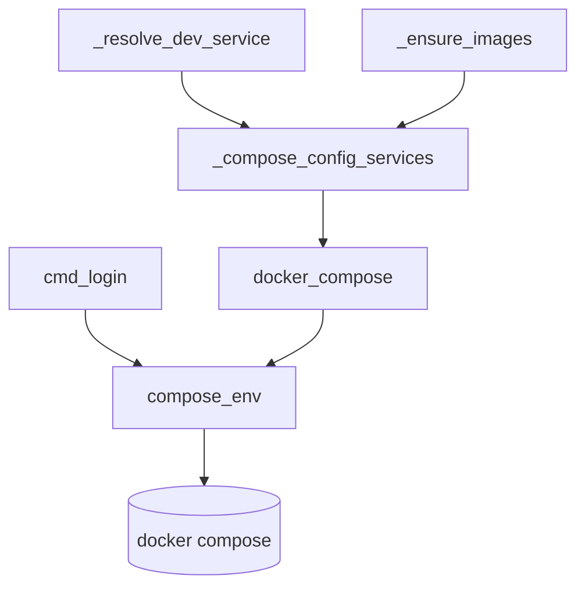
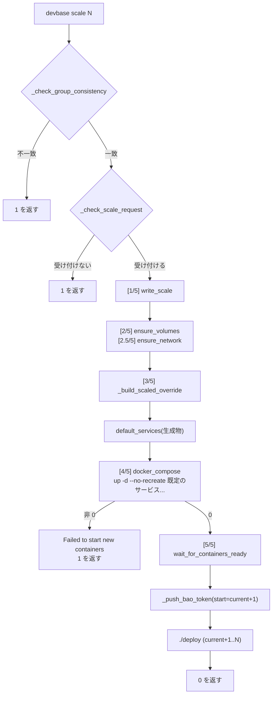

# PLAN65: `devbase scale` の Compose 呼び出しを共通経路へ寄せ、`cmd_scale` の段階を分ける の設計

要求と受け入れ条件は `issues/PLAN65_scale-compose-path.md` にある。この文書は「どう作るか」
だけを扱う。

対象 issue: devbasex/devbase#192 / base は `release/v3.7.0`（release Pull Request は #212）

## 機能一覧

| # | 機能 | 誰が使うか |
| --- | --- | --- |
| 1 | `devbase scale` の起動が共通経路（`docker_compose`）を通り、子プロセスの `COMPOSE_PROFILES` が打ち消される | devbase の利用者 |
| 2 | `devbase scale` の起動の対象が既定のサービスに限られる | devbase の利用者 |
| 3 | `devbase login` の `exec` も共通経路の規則に従う | devbase の利用者 |
| 4 | `cmd_scale` の段階に名前が付き、`cmd_up` と同じ形で読める | devbase を保守する側 |
| 5 | `docker compose config --format json` を起動する箇所が 1 つになる | devbase を保守する側 |
| 6 | `devbase scale` の正常系の手順がテストで固定される | devbase を保守する側 |
| 7 | 確定仕様の「devbase 経由の操作には効かない」が例外を持たない | 仕様を読む側 |

## 構成要素

| 要素 | 責務 | 変更 |
| --- | --- | --- |
| `docker_compose`（`utils/docker.py`） | `docker compose` を `env=compose_env()` で起動する唯一の共通経路 | 変えない（呼び出し元が増えるだけ） |
| `compose_env`（`utils/docker.py`） | 子プロセスの `COMPOSE_PROFILES` を `__devbase_none__` にする | 変えない |
| `default_services`（`commands/container.py`） | 生成物から `profiles:` を持たないサービス名を求める | 変えない（`cmd_scale` から呼ぶようになる） |
| `_compose_lines`（`commands/container.py`） | `config --services` / `--profiles` を読む。非 0 は `DevbaseError` | 変えない（`default_services` の下位） |
| `_compose_run`（`commands/container.py`） | `devbase ps` / `devbase logs` の起動 | 変えない（確定仕様の経路の表に並ぶため図に載せる） |
| `_ensure_images`（`commands/container.py`） | 起動前のイメージの確認 | 呼ぶ関数の名前だけ変わる（`_read_compose_services` → `_compose_config_services`） |
| `cmd_scale`（`commands/container.py`） | 前提の検査・段階の呼び出し・後処理・終了コードの決定 | **本体を 86 行から 40 行以下へ縮める** |
| `_check_scale_request`（新設） | `new_scale` の妥当性（1 未満・現在以下）の判定と案内のログ | **新設** |
| `_run_scale_pipeline`（新設） | `[1/5]`〜`[5/5]`。`project.yml` の書き換え・ボリューム・network・構成生成・既定のサービスの解決・`--no-recreate` の起動・ready 待ち | **新設**（`cmd_up` の `_run_deploy_pipeline` と対称） |
| `_compose_config_services`（新設） | `config --format json` の（終了コード, `services`）を返す唯一の関数 | **新設。`_read_compose_services` を置き換える** |
| `_resolve_dev_service` | dev サービス定義を返す。失敗は `None` | **本文を `_compose_config_services` の上へ載せ替える。名前と契約は変えない** |
| `cmd_login` | `docker compose exec <dev>-<n> bash` | **`env=compose_env()` を渡す（1 行）** |
| `docs/specifications/compose-profiles.md` | 経路・コマンド列・運用・テスト観点の確定仕様 | **`scale` と `login` を対象に含める形へ書き換える** |
| `tests/commands/test_container_scale_order.py`（新設） | `devbase scale` の正常系の手順と子プロセスの環境の固定 | **新設** |
| `tests/utils/test_docker_profiles.py` | 経路ごとに `COMPOSE_PROFILES` の打ち消しを固定する | **棚卸しの一覧とコメントを更新する** |

## 経路の図

図は実行時の呼び出しだけを描く。**上の表の要素のうち 4 つは図に現れない。**

| 図に現れない要素 | 理由 |
| --- | --- |
| `_compose_run` | この束では触らず、確定仕様の経路の表に並ぶだけである |
| `docs/specifications/compose-profiles.md` | 実行時の呼び出しを持たない |
| `tests/commands/test_container_scale_order.py` | 同じ |
| `tests/utils/test_docker_profiles.py` | 同じ |

`devbase scale` の経路:



`config --format json` の読み取りと `devbase login` の経路:



## 構造

処理の順序を変える（1 つの関数の通しの流れを 2 つの関数へ分ける）ため、変更後の呼び出しの
並びを示す。型（クラス）は追加しない。モジュール関数の並びで構成する。

### `cmd_up` と `cmd_scale` の段階の対応（変更後）

| 段階 | `cmd_up` 側 | 段階 | `cmd_scale` 側 |
| --- | --- | --- | --- |
| 前提の検査 | `_run_pre_up_checks`（group / env / pre-up / images） | 前提の検査 | `_check_group_consistency` と `_check_scale_request`（**新設**） |
| — | （`cmd_up` 本体で `_auto_snapshot`） | — | 行わない（`scale` は退避を取らない） |
| — | — | `[1/5]` | `project_runtime.write_scale` |
| `[1/6]` | `ensure_volumes` | `[2/5]` | `ensure_volumes` |
| `[1.5/6]` | `ensure_network` | `[2.5/5]` | `ensure_network` |
| `[2/6]` | `_build_scaled_override`（`_previous_scale_compose` の中） | `[3/5]` | `_build_scaled_override`（退避は取らない） |
| （2 と 3 の間） | `default_services(override_file)` | （3 と 4 の間） | `default_services(override_file)`（**新設**） |
| `[3/6]` | `docker_compose_down` | — | 行わない（既存を止めないのが `scale` の趣旨） |
| `[4/6]` | `docker_compose_up(services=...)` | `[4/5]` | `docker_compose(['up', '-d', '--no-recreate', *services])`（**変更**） |
| `[5/6]` | `wait_for_containers_ready` | `[5/5]` | `wait_for_containers_ready` |
| 後処理 | `_report_missing_repos` → `./deploy` → `_push_bao_token` → `_apply_window_titles` → `_maybe_open_editor` | 後処理 | `_push_bao_token(start=current+1)` → `./deploy`（範囲は `current+1..new`）。変えない |

`[1/5]`〜`[5/5]` と `[2.5/5]` の文字列は変えない（決定 7）。後処理の順序（bao → deploy）も
`cmd_up` と逆のまま変えない。`cmd_scale` が `_report_missing_repos` / `_apply_window_titles` /
`_maybe_open_editor` を呼ばないことも変えない（範囲外。#224 として起票済み）。

## 入出力の契約: 組み立てるコマンド列

### `devbase scale` が組み立てるコマンド列

変更前:

```
docker compose -f <生成物> up -d --no-recreate
env: 呼び出し元の os.environ そのまま（COMPOSE_PROFILES は利用者と .env の値）
```

変更後:

```
docker compose -f <生成物> up -d --no-recreate <既定のサービス...>
env: compose_env()（COMPOSE_PROFILES=__devbase_none__、ほかは os.environ の複製）
```

`<生成物>` は `_build_scaled_override` が返したパス。`<既定のサービス...>` は
`default_services(<生成物>)` が返した一覧の全件で、並びは変えない。`--profile` は付けない。

### `devbase login` が組み立てるコマンド列

コマンド列は変えない。`env` だけを `compose_env()` にする。

```
docker compose [-f <生成物>] exec <開発サービス名>-<n> bash   # 生成物がある場合
docker compose exec --index=<n> <開発サービス名> bash          # 生成物が無い場合
```

## 入出力の契約: 新設・変更する関数のシグネチャ

```python
def _check_scale_request(new_scale: int, current_scale: int) -> bool:
    """``new_scale`` が受け付けられるかを判定し、受け付けないときは案内を出す。

    ``new_scale < 1`` と ``new_scale <= current_scale`` の 2 つで False を返す。
    ログの文言と出し分け (error / warning + info 2 行) は変更前のまま。
    """


def _run_scale_pipeline(project_name: str, new_scale: int, current_scale: int,
                        config, target: docker_context.DockerTarget,
                        dev_service_name: str) -> Optional[Path]:
    """``[1/5]``〜``[5/5]`` の本体。生成した override compose のパスを返す。

    起動が 0 以外で終わったときだけ ``None`` を返す (error ログ
    ``Failed to start new containers`` はこの関数が出す)。それ以外の失敗は
    ``DevbaseError`` / ``DockerError`` のまま呼び出し元へ伝播する。
    """


def _compose_config_services() -> tuple[int, dict]:
    """``docker compose config --format json`` の (終了コード, services) を返す。

    非 0 なら ``services`` は空の辞書。JSON として読めなければ
    ``json.JSONDecodeError`` を伝播する。``_read_compose_services`` の契約と同じで、
    実行は共通経路 ``docker_compose`` を通る。
    """


def _resolve_dev_service() -> Optional[dict]:
    """compose config から dev サービス定義を取得する。失敗時は None。

    名前・引数・戻り値の契約は変えない (終了コードが非 0、JSON として読めない、
    のどちらでも ``None``)。
    """
```

`_read_compose_services` は削除する。唯一の呼び出し元 `_ensure_images`（`container.py:2019`）は
`_compose_config_services` を呼ぶ。`_resolve_dev_service` の名前を残すのは、
`tests/cli/test_base_image_staleness.py` の 3 か所がこの名前を差し替えているためである。

## 確定仕様 `docs/specifications/compose-profiles.md` の書き換え

| 節（変更前の行） | 何をするか |
| --- | --- |
| 構成要素の表（38-40 付近の `devbase up` の起動の行） | `devbase scale` の起動も `docker_compose` を通ることを書く |
| 有効なプロファイルの決め方・経路の表（74-81） | 行を 5 つにする。`docker_compose` の用途へ `scale` の `up -d --no-recreate` を足し、`_resolve_dev_service` / `_read_compose_services` の 2 行を `docker_compose` の用途へ畳み、`cmd_login` の `exec` の行を足す |
| 同じ節（83-84） | 「`cmd_scale` が直接呼ぶ …… この対象に含めない」を削り、「devbase が Compose を起動する経路はこの表の 5 つだけである」に置き換える |
| 組み立てるコマンド列の表（107-120） | `devbase scale` の起動の行（`up -d --no-recreate <既定のサービス...>`）と `devbase login` の行（`exec <開発サービス名>-<n> bash`）を足す |
| `devbase up` と `devbase down` の節（122 以降） | `devbase scale` の段落を足す。生成物を作った直後に `default_services` を求め、停止の段を持たないこと、既に動いているプロファイルのサービスを止めないことを書く |
| 運用（386-389） | 「`devbase scale` はプロファイルのサービスを複製しない」に「起動の対象にも入れない。既に動いているプロファイルのサービスは止めない」を足す。388-389 の約束はそのまま残す（成り立つようになる） |
| テスト観点（441-445 付近） | `devbase scale` の行を足す（コマンド列・子プロセスの環境・手順の順序） |

`docs/plugin-dev/compose-profiles.md:82` は変えない。共通経路へ寄せれば約束が成り立つため
である。

## 処理の流れ



`[1/5]` から `[5/5]` までが `_run_scale_pipeline` の中にある。`_push_bao_token` 以降は
`cmd_scale` の本体に残る（決定 8）。

## 失敗の経路

失敗の経路は 4 つで、いずれも終了コード 1 になる。

| 失敗 | どこで | 見え方 |
| --- | --- | --- |
| グループの不一致 | `_check_group_consistency` | 変更前のまま。`project.yml` は書き換えない |
| `new_scale` が不適 | `_check_scale_request` | 変更前のまま。`project.yml` は書き換えない |
| 構成生成・既定のサービスの解決・ready 待ちの失敗 | `_run_scale_pipeline` の中で `DevbaseError` / `DockerError` | `cmd_scale` の `except DevbaseError` が `Scale failed: ...` を出す。`project.yml` は**既に書き換わっている**（変更前も同じ） |
| 起動が 0 以外 | `_run_scale_pipeline` が `None` を返す | `Failed to start new containers` を出して 1。変更前のまま |

**既定のサービスの解決を足すと、失敗の経路が 1 つ増える。** `default_services` は
`_compose_lines` を通り、非 0 の終了を `DevbaseError` にする。`cmd_up` は同じ解決を既に
行っており、`scale` は `up` の後にしか使えない（生成物を作り直すのも同じ関数である）ため、
`up` が通るプロジェクトでこの解決だけが失敗する経路は無い。

## 決定の記録

### 決定 1: `devbase scale` の Compose 呼び出しを共通経路へ寄せる（issue #192 の案 A）

`docs/specifications/compose-profiles.md` の 2 つの記述のうち、**388-389 行目の約束を正とする。**
その約束は「`COMPOSE_PROFILES` を端末や `.env` に置いても devbase 経由の操作には効かない」で
ある。**83-84 行目の `cmd_scale` の除外は削る。**

理由:

- **約束の側が、より外に向いている。** 388-389 は「運用」の節にあり、利用者が読んで自分の
  端末と `.env` の扱いを決めるための文である。同じ約束は利用者向けの
  `docs/plugin-dev/compose-profiles.md:82` にもある。83-84 は「有効なプロファイルの決め方」の
  節にある実装の内訳で、読者は devbase を保守する側である。**外向きの約束に例外を足すほうが、
  内向きの内訳を 1 行足すより高くつく**
- **除外の理由が成り立っていない。** 83-84 は「プロファイルの入口ではないためである」と書くが、
  打ち消しが要るのは入口だからではなく、**子プロセスへ利用者の値がそのまま渡るから**である。
  `cmd_scale` はサービスの指定も持たないため、プロファイルのサービスが起動の対象に入りうる。
  同じ理由で `_resolve_dev_service` / `_read_compose_services`（読み取りだけで、入口ではない）も
  対象に入っている。除外の基準は既に一貫していない
- **仕様へ例外を書く形は、3 か所へ例外を足すことになる。** 確定仕様の 2 か所（経路の表・運用）と利用者向けの文書 1 か所に
  「ただし `devbase scale` は除く」を足すことになる。`devbase up` と `devbase scale` で
  `COMPOSE_PROFILES` の効き方が違う状態を、覚える対象として利用者へ渡す
- **仕様へ例外を書く形では、構造の側の目的も達しない。** #192 は「関数を分割しても共通経路を
  通さなければ、同じ食い違いが残る」と書いている。この形を採ると `cmd_scale` だけが自前で
  `subprocess.run` を
  持つ形が残り、`up` の起動と `scale` の起動が別の規則で動く状態が確定仕様として固定される

採らなかった案:

| 採らなかった形 | 内容 | 退けた理由 |
| --- | --- | --- |
| 仕様へ例外を書く（issue #192 の案 B） | 「devbase 経由の操作には効かない」を `scale` 除外込みへ書き直す | 上の 4 点。とくに、利用者向けの約束に例外が増える |
| `scale` にプロファイルの口を足す | `devbase scale` へ `--profile` を受ける引数を足し、プロファイルも複製できるようにする | 確定仕様 141・386-387 が「プロファイルのサービスは scale の対象にせず、複製されるのは開発サービスだけ」と決めている。この決定を変える要求は #192 に無い |
| 環境だけを渡す | `compose_env()` だけを渡し、起動の対象は明示しない | 決定 4 で退けた |

### 決定 2: `cmd_login` の穴も同じ Pull Request で塞ぐ

実測で、`compose_env()` を渡していない箇所は `cmd_scale`（1648）だけでなく
**`cmd_login`（1413）も**だった（要求仕様の実測の表の 4 と 5）。`cmd_login` も塞ぐ。

理由:

- **決定 1 は「経路の表が devbase の Compose の起動を網羅している」ことを仕様として言い直す
  決定である。** 網羅していない状態のまま表を書き直すと、同じ食い違いを別の行で作る
- **観測できる振る舞いは変わらない。** `docker compose exec <サービス> bash` は既に動いている
  コンテナを名指しする。開発サービスは `profiles:` を持たない既定のサービスなので、
  `COMPOSE_PROFILES` の値で選ばれ方が変わらない。差分は 1 行（`env=compose_env()`）で、
  `exec` の中で動く `bash` の環境はコンテナ側から来るため影響を受けない
- **棚卸しのコメントが実装と合っていない。** `tests/utils/test_docker_profiles.py:102` は
  「決定 7 の棚卸しの 4 か所」と書き、`cmd_scale` と `cmd_login` を数えていない。片方だけ直すと
  コメントを 5 か所へ直すことになり、次に読む人が残りの 1 つを穴と気づけない

採らなかった案: `cmd_login` を別の課題として起票し、この束では触らない。退けたのは、
経路の表を書き直す作業がこの束にあるためである（表に「`cmd_login` は未対応」と書くか、
誤った表を残すかのどちらかになる）。ただし**この 1 行は独立して切り出せる**ので、レビューで
範囲外と判断されたら分ける（決定 10 の Pull Request 1 の中で独立したコミットにする）。

### 決定 3: `docker_compose_up()` は拡張せず、`docker_compose()` を直接呼ぶ

`cmd_scale` の起動を次の形にする。

```python
docker_compose(['up', '-d', '--no-recreate', *services],
               compose_file=override_file, check=False)
```

理由:

- **`docker_compose_up()` は `--no-recreate` を持たず、`check=True` 固定である。**
  `no_recreate: bool = False` と `check` を足すと、引数が 2 つ増える。`utils/docker.py` の
  関数が `scale` の事情を知ることにもなる
- **`check=False` を保つ必要がある。** 変更前の `cmd_scale` は終了コードを見て
  `Failed to start new containers` を出す。`docker_compose_up()` を使うと
  `subprocess.CalledProcessError` が飛ぶ。これは `cmd_scale` の `except DevbaseError` を
  素通りし、traceback で落ちる。`cmd_up` は `except subprocess.CalledProcessError` も持つが、
  `cmd_scale` は持たない。**共通経路へ寄せる実装を素直に書くと、ここを踏む**
- `docker_compose()` は `env=compose_env()` を渡す唯一の共通経路であり、目的（決定 1）は
  これを通すことで達する。`profile up` / `profile down` / `profile list` も同じく
  `docker_compose()` を直接呼んでいる（`container.py:1503` / `1531` / `1547`）

採らなかった案:

| 案 | 退けた理由 |
| --- | --- |
| `docker_compose_up()` に `no_recreate` と `check` を足す | 上の 1 つ目と 2 つ目。`tests/utils/test_docker_profiles.py:85-99` が固定している `docker_compose_up` の契約も広がる |
| `cmd_scale` に `except subprocess.CalledProcessError` を足して `docker_compose_up()` を使う | ログが `Failed to start new containers` から変わるか、2 か所で同じ文言を持つことになる。終了コードを見るほうが差分が小さい |

### 決定 4: 起動の対象は `default_services(<生成物>)` で明示する

`compose_env()` を渡すだけにせず、`up` と同じく既定のサービス名を全件並べる。

理由:

- **確定仕様が `up` で明示する理由が、`scale` にそのまま当たる。** 確定仕様 136-138 行目は
  「起動の対象を明示するのは、打ち消し用のプロファイル名が効かない形でプロファイルが有効に
  なっても、一覧に無いサービスを起動しないため」と書いている。`scale` の起動も同じ生成物に
  対する `up` である
- **`up` と `scale` で対象の決め方が違う状態を残さない。** #192 の「`scale` の手順を変えるときに
  `cmd_up` と `cmd_scale` の片方だけを直す食い違いが起きやすい」は、まさにこの形である
- **プロファイルを持たないプロジェクトでは集合が変わらない。** `default_services` は
  `profiles:` を持たないサービスの全件で、サービス名を付けない `up` の対象と同じである
  （前提 6 / 受け入れ条件 B-5・E-1）

採らなかった形（環境だけを渡す）: `compose_env()` だけを渡し、サービス名は付けない。差分は最小で、
失敗の経路も増えない。退けたのは上の 1 つ目と 2 つ目で、とくに「`up` と `scale` の規則が違う」
状態が残ることを避けた。**増える失敗の経路は「処理の流れ」の節で見積もっており、`up` が通る
プロジェクトでは踏まない。**

### 決定 5: 失敗の扱いとログの文言は変えない

次の文言と、その出し分けを変えない。`cmd_scale` に `except subprocess.CalledProcessError` を
足さない。

```
[1/5] ... [5/5]
Using --no-recreate to avoid restarting existing containers...
Failed to start new containers
Scale failed: %s
=== Scale completed successfully ===
```

理由: 振る舞いの変更を「子プロセスの環境」と「起動の対象」の 2 点だけに絞る。ログを同時に
変えると、現状固定テストが何を守っているのかが読めなくなる。

### 決定 6: `_previous_scale_compose()` は使わない

`cmd_up` は生成に失敗したとき旧構成を書き戻すために `_previous_scale_compose()` を使うが、
`cmd_scale` には入れない。

理由: `scale` は既存のコンテナを止めない。止める段が無いので、旧構成で停止する必要が無い。
入れると `scale` が失敗したときに生成物だけが巻き戻り、`project.yml` の `scale` の値
（`[1/5]` で既に書き換わっている）と食い違う。**変更前の振る舞いを保つ**。

### 決定 7: 段階の番号の文字列は変えない

`[1/5]`〜`[5/5]` と `[2.5/5]` をそのまま持つ。`default_services` の呼び出しには段階の番号を
付けない（`cmd_up` も `[2/6]` と `[3/6]` の間で番号を持たない）。

理由: 番号を振り直すと、`cmd_scale` の出力を読んでいる人にとっての差分が増える。`[2.5/5]` の
ような中途の番号は `cmd_up` の `[1.5/6]` と同じ流儀で、この束で整えるものではない。

### 決定 8: 抽出は 2 つの関数に分け、`cmd_up` と対称にする

`_check_scale_request`（前提の検査）と `_run_scale_pipeline`（`[1/5]`〜`[5/5]`）の 2 つにする。
後処理（bao token・`./deploy`・完了のログ）は `cmd_scale` に残す。

理由:

- **`cmd_up` が同じ形をしている。** `_run_pre_up_checks` と `_run_deploy_pipeline` があり、
  後処理は `cmd_up` 本体にある。2 つのコマンドを並べて読めるようにするのが #192 の狙いである
- **`_check_group_consistency` は既に関数である。** 残る前提の検査は `new_scale < 1` と
  `new_scale <= current_scale` の 2 つだけである。これを 1 つにまとめれば、`cmd_scale` の冒頭が
  「2 つの検査 → 段階 → 後処理」の 3 段に読める
- **後処理を出さない理由**: bao token と `./deploy` は `current_scale + 1` から
  `new_scale` までの範囲を使う。`cmd_up` も同じものを本体に持つ。移すと 2 つのコマンドの形が
  かえって離れる

採らなかった案:

| 案 | 退けた理由 |
| --- | --- |
| 段階ごとに 5 つの関数へ分ける | 1 行か 2 行の関数が並ぶ。`cmd_up` の形と離れ、順序の読み取りが `_run_scale_pipeline` 1 つを読むより難しくなる |
| `_run_deploy_pipeline` と `_run_scale_pipeline` を 1 つの関数へ統合し、引数で分岐させる | 停止の有無・退避の有無・`--no-recreate` の有無・段階の番号の 4 つで分岐する。分岐で分ける対象が 4 つあるものは 1 つの関数にしない |

### 決定 9: config の読み取りは「下位の 1 関数 + 既存の名前を残した包み」に統合する

`_compose_config_services()` を新設し、`_read_compose_services` を削除、`_resolve_dev_service` は
名前と契約を保ったまま本文を載せ替える。

理由:

- **2 つの契約は違うので、1 つの関数に畳めない。** `_resolve_dev_service` は不正 JSON を
  `None` に、`_read_compose_services` は `json.JSONDecodeError` の伝播にしている。どちらの
  呼び出し元も、その違いに合わせた失敗処理を持つ（`_build_resolved` は `if not dev_service:`、
  `_ensure_images` は外側の `except Exception`）。**引数で切り替える形にすると、呼び出し側が
  渡す値で失敗の形が変わる関数になる**
- **`_resolve_dev_service` の名前を残すのは、テストが差し替えているためである。**
  `tests/cli/test_base_image_staleness.py:158 / 173 / 188` がこの名前を `monkeypatch.setattr` で
  差し替える。名前を変えると、この束の外の 3 つのテストを書き換えることになる
- **`_read_compose_services` の名前は残さない。** 呼び出し元が 1 つ（`_ensure_images`）で、
  契約は `_compose_config_services` と同じである。同じ契約の名前を 2 つ持つと、次に読む人が
  違いを探す

### 決定 10: 実装は 2 本の Pull Request に分ける

内訳・触るファイル・依存の順序・採らなかった案は、次の章「実装の分け方」にある。

## 実装の分け方（決定 10）

| # | 名前 | 内容 | 触るファイル | 依存 |
| --- | --- | --- | --- | --- |
| 1 | 振る舞いと仕様 | 確定仕様の書き換え（決定 1）・`cmd_scale` の起動を共通経路へ（決定 3・4）・`cmd_login` の 1 行（決定 2）・現状固定テストの新設 | `docs/specifications/compose-profiles.md`、`lib/devbase/commands/container.py`（`cmd_scale` の `[4/5]` と `cmd_login`）、`tests/commands/test_container_scale_order.py`（新設）、`tests/utils/test_docker_profiles.py` | 無し（base は `release/v3.7.0`） |
| 2 | 構造 | `cmd_scale` の段階の抽出（決定 7・8）・config 読み取りの統合（決定 9）・棚卸しのコメントの更新 | `lib/devbase/commands/container.py`（`cmd_scale` / `_resolve_dev_service` / `_read_compose_services` / `_ensure_images`）、`tests/utils/test_docker_profiles.py` | **Pull Request 1 の `:マージ` が要る** |

依存の理由: どちらも `lib/devbase/commands/container.py` の `cmd_scale` の同じ区画を触る。
2 を先に出すと、1 が書き換える `[4/5]` の行が別の関数へ移っており、レビューした差分と入る差分が
変わる。**`tests/utils/test_docker_profiles.py` も両方が触る**（1 は経路のテストを足し、
2 は棚卸しのコメントと関数名を直す）。

#192 が指定した順序（仕様 → 共通経路 → 現状固定テスト → 関数を分ける）は、この 2 本の中で
次のように並ぶ。

| 順序 | どこで | 備考 |
| --- | --- | --- |
| 1. 仕様 | Pull Request 1 の 1 つ目のコミット | 決定 1 を確定仕様へ書く |
| 2. 共通経路へ寄せる | Pull Request 1 の 2 つ目のコミット | 新しいコマンド列と子プロセスの環境を固定するテストを先に書いて落とす（`tdd-cycle`）。**構造を触らないので、この時点では「気づけない」対象が無い** |
| 3. 現状固定テストを足す | Pull Request 1 の 3 つ目のコミット | 正常系の手順（順序・範囲）を固定する。**構造を変える前に緑にする** |
| 4. 関数を分ける | Pull Request 2 | 3 のテストを書き換えずに緑のまま通す。書き換えが要るなら振る舞いが変わっている |

**3 を 2 より先に置かない理由**: 2 はコマンド列と子プロセスの環境を意図して変える。先に
現状（`env` 無し・サービス名無し）を固定すると、2 でそのテストを書き換えることになり、
「固定したものを自分で書き換えた」記録が残る。2 が変えるのは 1 行の呼び出しで、構造は
触らないため、固定が無くても差分を目で追える。**構造を変える 4 の前には、3 が緑で入っている。**

採らなかった案:

| 案 | 退けた理由 |
| --- | --- |
| 1 本にまとめる | 振る舞いの変更と構造の変更が同じ差分に混ざる。レビューで「この行はどちらの目的か」が読めない |
| 3 本に分ける（仕様 / 振る舞い / 構造） | 確定仕様の 1 節と実装の 1 行は同じ約束の裏表で、別々にマージすると仕様と実装が食い違う版が中間に残る |
| 現状固定テストだけを先に 1 本出す | 上の「3 を 2 より先に置かない理由」と同じ |

## テスト設計

新設するのは `tests/commands/test_container_scale_order.py` の 1 ファイルである。既存の流儀に
合わせる。`container` モジュールの属性を `monkeypatch.setattr` で差し替え、共有の `calls` へ
追記させて最後に並びを比べる。`tests/commands/test_container_up_order.py:46-92` の
`up_harness` と同型である。コマンド列と子プロセスの `env` は
`tests/utils/test_docker_profiles.py:19-30` の `FakeRun` を流用して拾う。

**実 docker と実 `DEVBASE_ROOT` には触れない。** `DEVBASE_ROOT` は各テストが自分で
`monkeypatch.setenv` する（要求仕様の前提 4）。

| 受け入れ条件 | 何で確かめるか |
| --- | --- |
| A-1 | `grep -rn "'docker', 'compose'\|\"docker\", \"compose\"" lib/` が 3 件。残った 3 件を 1 つずつ辿る |
| A-2 / A-3 | `grep -n "cmd_scale" docs/specifications/compose-profiles.md` と、書き換えた 2 つの表の目視 |
| A-4 | `git diff --name-only` に `docs/plugin-dev/compose-profiles.md` が出ないこと |
| A-5 | `tests/utils/test_docker_profiles.py` の棚卸しの節に、変更後の経路（`_compose_run` / `_compose_lines` / `cmd_login` / `editor._query_container_name`）が並ぶ |
| B-1 | `monkeypatch.setenv('COMPOSE_PROFILES', 'web')` のうえで `cmd_scale(2)`。`FakeRun` が拾った `env['COMPOSE_PROFILES'] == docker.NO_PROFILE` |
| B-2 | 同じテストの後で `os.environ['COMPOSE_PROFILES'] == 'web'` |
| B-3 | `FakeRun` の `cmd` が `['docker', 'compose', '-f', <生成物>, 'up', '-d', '--no-recreate', 'dev-1', 'dev-2']`。`default_services` を差し替えて一覧を固定する |
| B-4 | `FakeRun(returncode=1)` で `cmd_scale(2) == 1`、`caplog` に `Failed to start new containers`、例外が外へ出ないこと |
| B-5 | `default_services` を実物にし、`_compose_lines` の標準出力を差し替えて、`profiles:` を持つサービスが一覧に出ないことを見る |
| C-1 | `calls` の並びが `['group', 'write_scale', 'volumes', 'network', 'generate', 'default_services', 'up', 'wait', 'bao', 'deploy']` |
| C-2 | `bao` の `start` が `current + 1`、`deploy` の `indices` が `range(current + 1, new + 1)` |
| C-3 | 既存の 4 か所を書き換えずに `pytest tests/commands/test_container_up_order.py tests/commands/test_container_context.py tests/cli/test_project_dispatch.py` |
| C-4 / E-1 | `pytest tests/` の全件を変更の前後で実行し、件数と結果を Pull Request 本文へ並べる |
| D-1 | `grep -rn "'config', '--format', 'json'" lib/` が 1 件 |
| D-2 | `_compose_config_services` と `_resolve_dev_service` の単体テスト 3 通り（終了コード非 0 / 不正 JSON / 正常）。不正 JSON で前者は `json.JSONDecodeError`、後者は `None` |
| D-3 | `cmd_scale` の `def` から次の `def` までの行数 |
| D-4 | この文書の段階の対応表と、`grep -n "/5\]" lib/devbase/commands/container.py` の出力を並べる |
| E-2 | 生成物に `profiles:` を持つサービスを置き、`up` のコマンド列にそのサービス名が出ないことを見る |
| E-3 | `scale` の `calls` に停止（`down` / `stop` / `rm`）が 1 件も出ないことを見る |

## 未確認のまま残ること

| 項目 | 内容 |
| --- | --- |
| `--no-recreate` とサービス名の明示の組み合わせの実 docker の挙動 | 確かめるには実環境のプロジェクトが要る（要求仕様の前提 2）。確定仕様 92-95 行目の「打ち消し用のプロファイル名を入れると、依存先としての起動が止まる」を前提にする |
| `COMPOSE_PROFILES` を置いたうえで `devbase scale` を打っている利用者の有無 | 分からない。いた場合、この変更でプロファイルのサービスが起動しなくなる。切り戻しは配布の版を戻すこと |
| `cmd_scale` が `_report_missing_repos` / `_apply_window_titles` を新しいインスタンスへ行わないこと | この束の対象外。**#224 として起票済み** |
| CI での検査 | `release/v3.7.0` を base にした Pull Request では検査ジョブが 1 件も動かない（#216）。証跡は手元で採って Pull Request 本文へ載せる |
