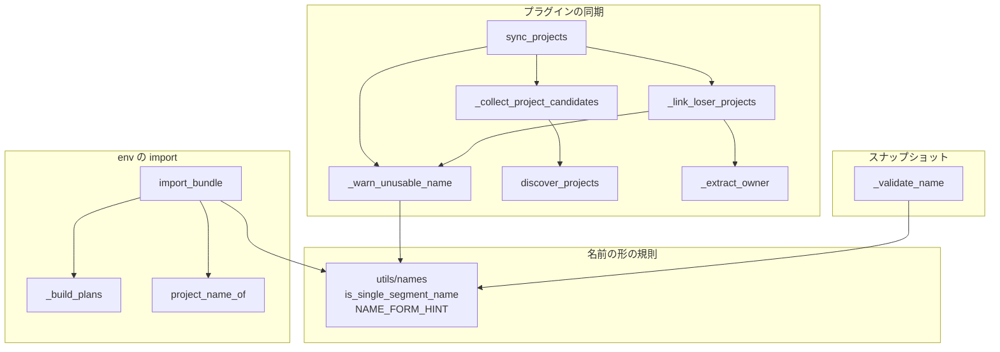
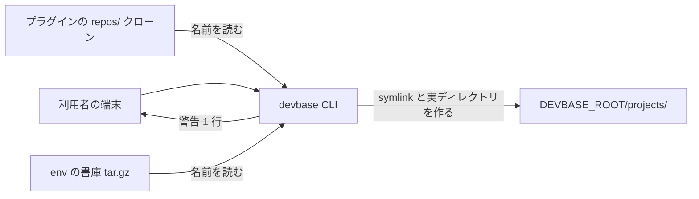
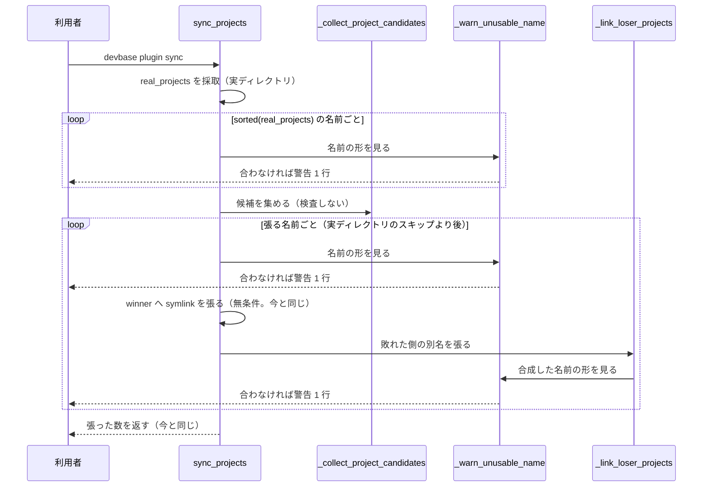

# PLAN66: 名前の形に合わないプロジェクトを、作られた時点で知らせる の設計

要求と受け入れ条件は [PLAN66_project-name-validation.md](PLAN66_project-name-validation.md) に
ある。この文書は「どう作るか」だけを扱う。

## 機能一覧

| # | 機能 | 誰が使うか |
| --- | --- | --- |
| F1 | プラグインの同期が `projects/` に載せる名前（プラグインのプロジェクト・合成する別名・`projects/` 直下の実ディレクトリ）の形を見て、合わないものを 1 行知らせる。symlink は今と同じく張る | `devbase plugin install` / `update` / `sync` を打つ利用者と、プラグインの作者 |
| F2 | `devbase env import` が名前の形に合わない名前を取り込むとき、**保存先に応じた内容で** 1 行知らせる（平文は `projects/<name>/`、age は `secrets/projects/<name>.env.age`、サーバ backend はサーバ側）。import は今と同じく通す | `devbase env import` を打つ利用者（端末の移行） |
| F3 | スナップショットの名前の形を `utils/names` の述語へ寄せ、定数の二重持ちをやめる | devbase を保守する側 |

## 構成要素

| 要素 | 変更 | 責務 |
| --- | --- | --- |
| `lib/devbase/utils/names.py` の `NAME_FORM_HINT`（新設） | 足す | 名前の形を説明する文の定数。`re` だけに依存し副作用を持たない module の契約（確定仕様「構成要素」）を保つため、**ログを出さない**。値は `container.py` の既存の文言と同じ「英数字で始まり、英数字・'.'・'-'・'_' だけからなる名前」 |
| `lib/devbase/plugin/syncer.py` の `_warn_unusable_name`（新設） | 足す | 1 つの名前が形に合わなければ `logger.warning` を 1 行出す。合えば何もしない。戻り値を持たない（呼び出し側の分岐に使わせない） |
| `lib/devbase/plugin/syncer.py` の `_link_loser_projects` | 変える | 合成した別名（`f"{proj_name}.{owner}"`）に `_warn_unusable_name` を呼ぶ。symlink を張る条件は変えない |
| `lib/devbase/plugin/syncer.py` の `sync_projects` | 変える | 2 か所で `_warn_unusable_name` を呼ぶ。(1) `real_projects` を採取した直後に、その名前ごと（**`sorted(real_projects)` で走査する**。`real_projects` は `set` で、並べないと警告の順が実行ごとに変わる。既存の `sorted(project_candidates.items())` と同じ扱い）。(2) winner へ symlink を張る直前（`real_projects` のスキップより後）に、その名前 1 回 |
| `lib/devbase/env/_import_merge.py` の `project_name_of`（新設） | 足す | 1 つのメンバー名から、そのプロジェクト名を返す純粋な関数（当たらなければ `None`）。`_PROJECT_ENV_RE` を使う |
| `lib/devbase/env/io_import.py` の `import_bundle` | 変える | `_build_plans` が返した `plans` を回し、`plan.arcname` の名前が形に合わなければ 1 行知らせる。**文は `plan.target` と `plan.ref` から保存先を読んで選ぶ**（決定 4）。`--dry-run` の判定より前に置く |
| `lib/devbase/snapshot/manager.py` の `_VALID_NAME_RE` | 消す | 文字の規則を `utils/names` へ寄せる |
| `lib/devbase/snapshot/manager.py` の `_validate_name` | 変える | `is_single_segment_name(name)` で判定する。例外の型（`SnapshotError`）と文言は変えない。`not name` の明示ガードは述語が空を弾くので消す |
| `docs/specifications/cli-argument-resolution.md` の「運用」 | 変える | 下の「確定仕様の書き換え」の 2 つの箇条書き |
| `CHANGELOG.md` の `[Unreleased]` | 変える | Added に F1・F2、Changed に F3 |

変えないものは次のとおりである。

| 変えないもの | 補足 |
| --- | --- |
| `discover_projects` | `.` 始まりの除外も含めて現状のまま（決定 8） |
| `_collect_project_candidates` | 候補の集約。ここでは検査しない（決定 2） |
| `sync_projects` が返す数 | 張った symlink の数（決定 1） |
| `_extract_owner`・`_make_relative_target` | 別名の合成の規則（#228 で起票した文書の食い違いも含む） |
| `_PROJECT_ENV_RE` のパターン | 書庫の中の名前の規則（決定 4） |
| `env/bundle.py`・`env/secret_store.py` | 確定仕様が別に保つと決めている規則 |
| `bin/devbase`・`cli.py`・`commands/container.py` | 下流の検証（決定 3） |

## 構成要素の関係と文脈

### 構成要素の関係



図に現れない要素は 4 つある。`NAME_FORM_HINT` は `N` に含めた。消す `_VALID_NAME_RE` は
呼び出しの辺を持たなくなる。`docs/specifications/cli-argument-resolution.md` と
`CHANGELOG.md` は文書で、呼び出しを持たない。

### システムの文脈

devbase はホストで動く。この変更が触る外部は `$DEVBASE_ROOT/projects/` の直下の名前と、
標準エラーへ出る行だけである。docker daemon・ネットワーク・機密の置き場への呼び出しは
増えも減りもしない。



## 処理の流れ



`import_bundle` の流れは 1 か所だけである。`_build_plans` の直後、`--dry-run` の判定より前に
`plans` を回し、形に合わない名前を知らせる。**`filter_members` の直後ではなく `plans` を見る**
のは、保存先が `plan.target` と `plan.ref` で決まるためである（決定 4）。**`--dry-run` でも
出る**のは、書き込む前に何が起きるかを知らせるためである。

## 入出力の契約: 新設・変更する関数

| 関数 | シグネチャ | 契約 |
| --- | --- | --- |
| `utils/names.NAME_FORM_HINT` | `str`（module の定数） | 名前の形を説明する文。末尾に句点を置かない（呼び出し側が文へ埋める） |
| `syncer._warn_unusable_name` | `(name: str, source: str) -> None` | `is_single_segment_name(name)` が True なら何もしない。False なら `logger.warning` を 1 行。`source` は名前の出所（プラグイン名・別名・実ディレクトリ）で、**文に埋めるだけでなく、末尾の案内の選択にも使う**（上の「警告の文」の出所の表） |
| `_import_merge.project_name_of` | `(arcname: str) -> Optional[str]` | 純粋。`_PROJECT_ENV_RE` に当たれば group(1)、当たらなければ `None`。例外を投げない（メンバーの妥当性は `filter_members` が既に見ている） |
| `snapshot.SnapshotManager._validate_name` | `(name: str) -> None`（変更なし） | `is_single_segment_name(name)` が False なら `SnapshotError`。文言は今と同じ |

## 入出力の契約: 警告の文

```text
プロジェクト名として使えない形の名前が projects/ に載ります: '_foo'（出所: プラグイン p1）。
この名前では、名前を指定した操作（devbase up _foo など）ができません（NAME_FORM_HINT）。
projects/_foo の中で名前なしに打てば動きます。<出所ごとの案内>
```

**`<出所ごとの案内>` は出所で分かれる。** 名前を作っている場所が違うため、同じ案内が
当てはまらない。

| 出所 | 案内 |
| --- | --- |
| プラグインのプロジェクト（出所はプラグイン名） | プラグイン側の `projects/<名前>` を改名する |
| 別名（devbase が合成した `<名前>.<owner>`） | 名前は devbase が合成している。`--link` なら元パスの basename、`repos/` 由来ならその置き場の名前が `<owner>` になる。**プラグイン側の `projects/` を改名しても直らない**ことを書く |
| `projects/` 直下の実ディレクトリ | その実ディレクトリ自身を改名する（プラグインは関係しない） |

- **1 件 1 回。** 名前 1 つにつき 1 行だけ出す。**そのために、プラグインのプロジェクトの検査は
  `sync_projects` が symlink を張る直前に置く**（決定 2）。候補の集約
  （`_collect_project_candidates`）に置くと、同じ名前を 2 つのプラグインが持つときに
  プラグインの数だけ出て、実ディレクトリでスキップする名前にも出る
- **起きていないことを書かない。** 知らせは symlink を張る直前と、書庫を読んだ直後に出す。
  文は完了形にせず、`--dry-run` や後続の失敗で書き込みが起きなくても矛盾しない形にする
- **`verbose` に依存させない。** `sync_projects(verbose=False)` は数を数える用途で使われる
  （`tests/plugin/test_repos_core.py` と `updater` の差分計算）。弾かない代わりに知らせるのが
  唯一の効果なので、黙る経路を作らない
- **import の文は保存先で 2 つに分かれる**（決定 4）。出所はどちらも「書庫」である

| 保存先（`plan.target` / `plan.ref`） | 文 |
| --- | --- |
| `projects/<名前>/.env`（ファイル backend の平文） | この import が `projects/_foo/` を作ることと、`projects/_foo` の中で名前なしに打てば動くこと、`projects/_foo` を改名すれば直ることを書く |
| それ以外（age の `secrets/projects/<名前>.env.age`・サーバ backend） | 保存先をそのまま名指しし、**`projects/` には何も作られない**ことを書く。この名前でプロジェクトを作っても名前を指定した操作ができないことを添える。改名の案内は書かない（改名する対象が `projects/` に無い） |

## 確定仕様の書き換え

`docs/specifications/cli-argument-resolution.md` の「運用」の 1 つ目と 2 つ目の箇条書きを
書き換える。**他の節（「他のショートカット」など）は触らない**（#208 の調査で直す対象では
ないと確認済み）。

| 今の記述 | 書き換え後 |
| --- | --- |
| 名前の形に合わないプロジェクト（`_` で始まる名前など）は、名前の指定（CLI の `[name]` と `devbase list` の一覧）から操作できない。そのディレクトリの中で名前なしに打てば動く | 同じ内容に加えて、**名前の形に合わない名前が `projects/` に載った時点で知らせが出る**ことと、その 4 つの出所（プラグインの同期の symlink・同期が合成する別名・`env import` が作る実ディレクトリ・手で作った実ディレクトリ）を書く。**知らせは出すが弾かない**（同期と import は今と同じものを作る）ことを明記する |
| 名前の検証はリポジトリの中で 1 つに寄せていない。`env/bundle.py` の `is_valid_project_name`…、`env/secret_store.py` の `_validate_project_name`…、`snapshot/manager.py` の `_VALID_NAME_RE`（スナップショットの名前）はそれぞれ別の用途と互換性を持つ | 寄せていないのは `env/bundle.py` と `env/secret_store.py` の **2 つ**にする。`snapshot/manager.py` は `utils/names` の述語を共有する側へ移し、共有してよい理由（文字集合が同じで、受け付ける名前が広がらない）と、広がらないことを固定するテストの在り処を書く |

## 決定の記録

### 決定 1: 名前の形を検査するが、弾かずに警告に留める

プラグインの同期は、名前の形に合わない名前でも**今と同じく symlink を張る**。`env import` も
**今と同じく `projects/<name>/` を作る**。違いは `logger.warning` の 1 行だけである。

理由:

- **弾くと、今ある唯一の使い方が消える。** 確定仕様の「運用」は「そのディレクトリの中で
  名前なしに打てば動く」と書いている。symlink を張らなければ、そのプロジェクトは
  `$DEVBASE_ROOT/projects/` の下に現れない。`env/runtime.py:119` はプロジェクトを
  `projects/` からの相対パスで決めるため、**プラグインのクローンの中へ cd しても
  プロジェクトとして扱われない**。名前を指定できないだけの状態から、どこからも操作
  できない状態へ悪化する
- **利用者はプラグインの持ち主でないことがある。** 名前を直せるのはプラグインの作者だけで、
  手元の `repos/` のディレクトリを改名すると `plugin update` が競合する。弾く実装は、
  利用者に手段のない失敗を渡す
- **同期の全体を失敗させると被害が広がる。** `devbase plugin install` / `update` / `sync` は
  1 回で全プラグインを同期する。1 件の名前で失敗させると、同じプラグインの他のプロジェクトも
  `projects/` から消える（同期は先に既存の symlink を全部消してから張り直す。
  `syncer.py:155-157`）。この端末では 133 件が一度に消える
- **「実在しないから安全」は弾く根拠にならない。** 実測では 3 リポジトリ・22 プラグイン・
  133 件すべてが名前の形に合う。弾いても**今日は**誰も困らない。だが実在しないということは
  「弾いて得られる利益も今日は無い」ことでもあり、天秤は「失う手段」の側に傾く
- **知らせるだけで目的は達する。** 困るのは「`devbase list` に出るのに `devbase up` が
  通らない理由が分からない」ことである。載った時点で理由と回避手段を渡せば、その困りは消える

採らなかった案:

| 採らなかった形 | 内容 | 退けた理由 |
| --- | --- | --- |
| 同期の全体を失敗させる | 名前の形に合わない名前を見つけたら例外を投げ、`install` / `update` / `sync` を 0 以外で終わらせる | 1 件の名前でそのプラグインの全プロジェクトが `projects/` から消える。利用者に直す手段が無い |
| その 1 件だけ載せない（skip） | symlink を張らず、警告だけ出す | 名前なしに打つ手段まで失う（上の 1 点目）。`devbase list` から黙って消える |
| 名前を整えて載せる（sanitize） | `_foo` を `foo` などへ直して載せる | devbase が名前を発明することになる。既存の `foo` と衝突し、どちらが `projects/foo` を取るかが同期の順で決まる |
| 名前の形を広げて `_` を許す | `SINGLE_SEGMENT_NAME_PATTERN` の先頭に `_` を足す | 受け付ける名前を広げる変更で、確定仕様が「寄せると受け付ける名前が変わる範囲が広がる」ことを理由に退けた向きと同じ。#203 も規則の変更を求めていない |

### 決定 2: 検査は `projects/` に名前を載せる直前に置き、列挙と集約には置かない

検査を置くのは次の 3 か所である。`discover_projects` と `_collect_project_candidates` の
中には置かない。

| 置く場所 | 見る名前 | いつ |
| --- | --- | --- |
| `sync_projects` の winner の分岐 | プラグインのプロジェクト | `real_projects` のスキップより後、symlink を張る直前 |
| `_link_loser_projects` | 合成する別名 | 別名の symlink を張る直前 |
| `sync_projects` の `real_projects` | `projects/` 直下の実ディレクトリ | 採取した直後 |

理由:

- **`discover_projects` は「表示のための列挙」にも使われる。** `plugin/updater.py:26,54,121` が
  更新前後の差分を出すために呼ぶ。ここで警告を出すと、`projects/` に何も載せない場面で
  同じ行が何度も出る
- **候補の集約（`_collect_project_candidates`）も早すぎる。** 集約は
  プラグイン 1 つにつき 1 回回るため、同じ名前を 2 つのプラグインが持つと**同じ名前で 2 行**
  出る。さらに集約は `real_projects` のスキップより前にあるため、**`projects/` に載らない
  名前にも警告が出る**（実ディレクトリが勝つ場合）。`sync_projects` の winner の分岐へ置くと、
  実際に載る名前 1 つにつき 1 行になる
- **「載せる直前」は出所も持っている。** winner の分岐は `winner_plugin.name` を持つため、
  警告の「出所」を落とさずに書ける
- **別名は devbase 自身が作る名前である。** `_extract_owner` は `--link` のプラグインで
  元パスの basename をそのまま返す。実測では、元パスが `/Users/x/my plugin` のとき
  devbase が `carmo.my plugin` という名前の symlink を張った。プラグイン側の名前が
  正しくても、合成の結果が形に合わないことがある。**プラグインの名前だけを見る検査では
  拾えない**
- **実ディレクトリは devbase が作っていないが、同期が唯一それを列挙する場所である。**
  手で `mkdir projects/_foo` した場合と、`env import` が作った場合の両方が
  `real_projects` に入る。同期のたびに知らせが出る

採らなかった案: `discover_projects` の中で `.` 始まりと同じように除外する。決定 1 で
退けた「skip」と同じ形になるため採らない。

### 決定 3: 下流の検証は残す。責務は「移動」ではなく「前倒し」

下流の 3 つの検証は消さない。`bin/devbase` の `maybe_cd_project`、
`cli._named_lifecycle_project`、`container._resolve_project_name` である。#203 が「移動
（`move_responsibility`）」と書いているが、この設計では入口に検査を**足す**だけにする。

理由:

- **下流が防いでいるのは別の入力である。** 下流へ来る値は `projects/` の一覧からではなく、
  利用者が打った引数から来る。`devbase up ../etc` は `projects/` に載っていない値で、
  入口の検査では防げない。PLAN61（#146）はこの検証をパストラバーサル防止として置いた
- **入口の検査は弾かない（決定 1）。** 弾かない検査へ責務を移すと、防ぐものが無くなる

採らなかった案: 下流の検証を緩め、入口だけで守る。確定仕様の「テスト観点」が
`../etc`・`a/b`・`.`・`..` を弾くことを固定しており、この決定を覆す要求は #203 に無い。

### 決定 4: `env import` の知らせは保存先ごとに文を変え、書庫の名前の規則は変えない

`devbase env import` は書庫の中の名前の規則（`env/bundle.py` の
`_VALID_PROJECT_NAME_RE`。先頭の `_` を許す）をそのまま使い、`_foo` を含む書庫を今と同じく
import する。**足すのは知らせだけである。**

理由:

- **実測で、これが `_foo` が生まれる実際の経路だった。** #203 の本文は「`syncer` が
  `projects/` に名前を載せる唯一の入口」と書いている。隔離した root での実験では、
  `env import` が `projects/_foo/` を実ディレクトリとして作り、終了コード 0 で何も
  言わなかった。同期だけを直しても、名前の指定から操作できないプロジェクトは生まれる
- **弾けない。** 確定仕様は、書庫の中の名前が先頭の `_` を許すことを互換性のために
  保つと決めている。import で弾くと、過去に export した書庫が import できなくなる
- **知らせる相手が正しい。** 書庫を作った端末では `_foo` が動いていたとは限らない
  （export 側の `_should_skip_project` は `_foo` を通す）。import した端末で初めて
  「名前で操作できないプロジェクトがある」状態になるため、import の時点が知らせる時点である

**知らせる文は保存先で分かれる。** `io_import._build_plans` は書き出し先を
`store.path(ref)` で決める。**`projects/<名前>/.env` になるのはファイル backend の平文の
ときだけ**である。age の backend では `secrets/projects/<名前>.env.age`、サーバの backend では
`plan.ref` を立ててサーバへ書く。どちらも `projects/` には何も作らないため、
「`projects/_foo/` を作ります」と書くと事実と違う。文は `plan.target` と `plan.ref` から
選ぶ（上の「警告の文」の表）。

**保存先が `projects/` の外でも知らせる。** その名前で機密を保存したこと自体は残り、後で
同じ名前のプロジェクトを作っても名前を指定した操作ができない。ただし改名の案内は出さない
（`projects/` に改名する対象が無い）。

採らなかった案:

| 採らなかった形 | 退けた理由 |
| --- | --- |
| import では何もせず、次の `plugin sync` の知らせに任せる | `env import` の後に `plugin sync` を打つ決まりは無い。実ディレクトリの知らせは同期のたびに出るが、import の直後には出ない |
| 保存先を見ずに 1 つの文で済ませる | `projects/` に何も作らない保存先（age・サーバ backend）で、作ったと書くことになる |
| 保存先が `projects/` の外なら黙る | その名前の機密は残る。後で同じ名前のプロジェクトを作ったときに、名前を指定した操作ができない理由が分からない |
| import で弾く | 上の 2 点目。確定仕様の互換性の決定を覆す |
| `secret_store` の書き込み側（`secret_store.py:199`）でも知らせる | `env/secret_store.py` は G4 の束（#188）が触る。重なりを避ける。import の経路を通る名前は決定 4 の知らせで拾える（残る経路は「未確認のまま残ること」へ記録した） |

### 決定 5: スナップショットの名前は `utils/names` の述語を共有する

`snapshot/manager.py` の `_VALID_NAME_RE` を消し、`_validate_name` が
`is_single_segment_name` を呼ぶ。例外の型・文言・`_safe_snap_dir` の封じ込め
（`resolve()` + `startswith`）は変えない。

理由:

- **確定仕様が「寄せない」とした理由が、この 2 つには当たらない。** 理由は「寄せると
  受け付ける名前が変わる範囲が広がる」ことだった。この 2 つは文字集合が同じで、
  寄せても**広がらない**
- **狭まる 1 ケースは直す価値がある。** 実測では `_VALID_NAME_RE.match("abc\n")` が True、
  `is_single_segment_name("abc\n")` が False だった。`re.match` と `$` の組み合わせが
  末尾の改行の前でも一致するためである。末尾に改行を持つスナップショット名が通る状態は、
  意図した仕様ではない
- **二重持ちは黙って育つ。** `_VALID_NAME_RE` には専用のテストが無い
  （`grep -rn "無効なスナップショット名" tests` が 0 件）。片方だけが直る状態が続く

採らなかった案:

| 採らなかった形 | 退けた理由 |
| --- | --- |
| 寄せず、2 つが同じであることを固定するテストだけを足す | `bin/devbase` の同期テストと同じ形。shell と Python のように言語が違えば要るが、同じ言語で同じ module から import できる場所に 2 つ置く理由が無い |
| `SnapshotError` の文言も `NAME_FORM_HINT` へ寄せる | スナップショット名の説明（「英数字・ハイフン・アンダースコア・ドットのみ使用可能、先頭は英数字」）は利用者向けの既存の文で、変えると利用者の検索が当たらなくなる。文字の規則だけを共有する |
| 逆向きに寄せる（`utils/names` が `snapshot` の定数を使う） | `utils/names` は確定仕様が定めた規則の置き場で、`snapshot` は利用者の 1 機能である。依存の向きが逆になる |

### 決定 6: 共有した述語が将来広がらないよう、スナップショット側で受理と拒否を固定する

`tests/snapshot/test_manager_name.py` に、`_validate_name` の受理と拒否を固定するテストを
置く。通す名前は `ok-name`・`a.b`・`A_b`・`0abc` の 4 件である。弾く名前は `_foo`・`.x`・`-x`・
空・`..`・`café`・`a/b`・`abc\n` の 8 件で、受け入れ条件 11 の列挙と同じ集合にする。

理由: 決定 5 で `utils/names` の述語を共有したため、**将来この述語を広げると
スナップショット名も黙って広がる**。#203 が求めるのと逆向きの変更（名前の形に `_` を許す）が
将来採られたとき、このテストが落ちてスナップショット名を広げるかどうかを改めて決められる。

採らなかった案: `utils/names` 側のテストだけで足りるとする。落ちる場所が
`tests/utils/test_names.py` になり、スナップショット名への影響が読み取れない。

### 決定 7: 知らせの文言の定数は `utils/names.py` に置き、ログはそこから出さない

`NAME_FORM_HINT` を `utils/names.py` の定数として足す。`logger` はこの module へ持ち込まない。

**共通化するのは名前の形の説明（ヒント文）だけである。** 出所と対象の名前を含む文の
組み立ては、同期と import で別々に行う（文脈が違うため。上の「警告の文」）。

理由: 確定仕様の「構成要素」が `lib/devbase/utils/names.py` を「`re` だけに依存し副作用を
持たない」と定めている。ログの出力は副作用である。説明を 1 か所に置く要求と、副作用を
持たない要求は、定数だけを置いて呼び出し側が `logger.warning` を出すことで両立する。

採らなかった案:

| 採らなかった形 | 退けた理由 |
| --- | --- |
| `utils/names.py` に `warn_if_unusable(name)` を置く | 上の契約を破る。確定仕様の書き換えが要る |
| 名前の形の説明（ヒント文）まで呼び出し側へ別々に書く | 同じ説明が 2 か所で別々に育つ。#229 で起票した既存の重複と同じ形を増やす |

### 決定 8: `discover_projects` の `.` 始まりの黙った除外は変えない

`.` で始まるディレクトリは今と同じく黙って除外し、名前の形の警告も出さない。

理由: `.` 始まりのディレクトリは `projects/` に載らないため、「名前の指定から操作できない
プロジェクト」を作らない。除外は意図された動きで、`.DS_Store` のような持ち込み物を
プロジェクトとして扱わないためにある。`plugin info` との食い違い（#226）は表示だけの問題で、
この設計の対象ではない。

### 決定 9: 実装は 2 本の Pull Request に分ける

1 本目が知らせ（F1・F2）、2 本目がスナップショットの寄せ（F3）である。

理由: 2 つは独立した振る舞いで、片方が戻されても他方は残せる。どちらも `docs/specifications/cli-argument-resolution.md` の「運用」を触る。**触る箇条書きは
別**で、1 本目が 1 つ目、2 本目が 2 つ目である。同じファイルのため、2 本目は 1 本目の
マージを待つ。

採らなかった案: 1 本にまとめる。スナップショット名が狭まる変更（利用者の入力を弾く向き）と、
知らせを足す変更（何も弾かない）を 1 つの revert の単位に入れることになる。

## 実装の分け方（決定 9）

| # | 名前 | 含むもの | 依存 |
| --- | --- | --- | --- |
| 1 | 知らせ（F1・F2） | `utils/names.py`（定数）・`plugin/syncer.py`・`env/_import_merge.py`・`env/io_import.py`・`tests/plugin/test_repos_core.py`・`tests/env/test_io_import.py`・`tests/cli/test_env_bundle_backend.py`・確定仕様の「運用」の 1 つ目・`CHANGELOG.md` | 無し |
| 2 | スナップショットの寄せ（F3） | `snapshot/manager.py`・`tests/snapshot/test_manager_name.py`（新設）・確定仕様の「運用」の 2 つ目・`CHANGELOG.md` | Pull Request 1 の**マージ**（同じファイルの別の箇条書き） |

## テスト設計

| 受け入れ条件 | 何で確かめるか |
| --- | --- |
| 1（同期が張り、警告が 1 回出る） | `tests/plugin/test_repos_core.py` の既存の `TestSyncProjects` へテストを足す。`_make_repo_dir` で `projects: ["_foo", "ok-name"]` のプラグインを作り、`sync_projects(registry, verbose=False)` の戻り値が 2、両方の symlink が存在、`caplog` の WARNING に `_foo` が 1 件・`ok-name` が 0 件 |
| 2（合う名前では警告が出ない） | 同上。`projects: ["ok-name"]` で `caplog` の WARNING に名前の形の行が 0 件 |
| 3（別名の警告） | 同上。既存の `test_link_plugin_collision_uses_source_basename` の形を借り、`--link` のプラグインの `source` を `/tmp/my plugin` にして、別名の symlink が張られ、`carmo.my plugin` の警告が 1 件 |
| 4（実ディレクトリの警告） | 同上。`devbase_root / "projects" / "_foo"` を `mkdir` してから `sync_projects`。ディレクトリが残り、警告が 1 件 |
| 5（`.` 始まりは変わらない） | 同上。プラグインの `projects/.hidden` を作り、`projects/.hidden` が作られず、警告が 0 件 |
| 6（import が作り、警告が出る） | 既存の `tests/env/test_io_import.py` へテストを足す。`bundle.pack` で `env/projects/_foo/.env` と `env/projects/ok-name/.env` の書庫を作り、`import_bundle(tmp_path, ImportOptions(source=..., include_global=False, include_metadata=False))` が 0 を返し、両方のディレクトリができ、`caplog` に `_foo` の警告が 1 件 |
| 7（`--dry-run` でも警告） | 同上。`dry_run=True` で `projects/` に何も作られず、警告が 1 件 |
| 8（合う名前では警告が出ない） | 同上。`ok-name` だけの書庫で警告が 0 件 |
| 9（age の保存先では文が変わる） | 既存の `tests/cli/test_env_bundle_backend.py` へテストを足す。**`bc.save(root, bc.BackendConfig(backend='age'))` で backend を明示する**（既存の `test_import_into_an_explicit_age_backend_encrypts_new_references` と同じ形）。明示しないと保存先が無い参照は平文へ落ち、`projects/_foo/` ができてこの条件を確かめられない。`projects/_foo/` ができず `secrets/projects/_foo.env.age` が書かれ、警告が 1 件でその文に保存先が入り `projects/` を作るとは書かないこと |
| 10（末尾の改行を弾く） | `tests/snapshot/test_manager_name.py`（新設）。`SnapshotManager(tmp_path)._validate_name("abc\n")` が `SnapshotError`（`tmp_path` を渡す流儀は `tests/snapshot/test_auto_snapshot.py:74` と同じ） |
| 11（受理と拒否の固定） | 同上。`pytest.mark.parametrize` で受理 4 件・拒否 8 件（拒否は `abc\n` を含む。受け入れ条件 11 の列挙と同じ集合）。拒否の文言が `無効なスナップショット名` を含む |
| 12（定数が残っていない） | `grep -n "_VALID_NAME_RE" lib/devbase/snapshot/manager.py` を Pull Request 2 の本文の実測へ載せる |
| 13・14（確定仕様と CHANGELOG） | 実装 Pull Request の差分（レビューで見る） |
| 15・16（退行しない） | 既存の `TestSyncProjects`（7 件）・`tests/env/test_io_import.py`・`test_import_merge.py`・`test_store_roundtrip.py`・`tests/cli/test_env_bundle_backend.py` を**変更せずに**通す（足すテストは新しい関数として書く） |
| 17（全体） | `uv run --locked pytest -q tests/` を手元で実行し、結果を Pull Request 本文へ載せる（`release/v3.7.0` を base にすると CI が動かない。#216） |

テストの流儀:

- **`DEVBASE_ROOT` に依存しない。** 同期は `PluginRegistry(tmp_path)`、import は
  `import_bundle(tmp_path, ...)` を使う。どちらも root を引数で受ける経路である。
  `tests/plugin/test_repos_core.py` の既存の fixture（`devbase_root` = `tmp_path`）が
  この形である。pytest が実環境の `DEVBASE_ROOT` を継承する問題（#209 / PR #217）の
  影響を受けない
- **警告は `caplog` で見る。** 既存の `test_missing_plugin_dir_warns` は警告の中身を
  見ていないが、新しいテストは件数と名前を見る

## 未確認のまま残ること

| 項目 | 内容 |
| --- | --- |
| 他の端末のプラグイン | 名前の形に合わないプロジェクトが実在しないことは、この端末の 3 リポジトリ・22 プラグイン・133 件で確かめた値である。社内の private レジストリの他のプラグインや、他の利用者が `--link` で入れたものは数えられない。決定 1（弾かない）はこの不確かさに耐える |
| `secret_store` の直接の書き込み | `env/secret_store.py:199` は平文モードで `projects/<name>/.env` を書き、その名前は `_validate_project_name`（先頭の `_` を許す）だけを通る。`env import` を経る経路は決定 4 の知らせで拾えるが、他の呼び出し元から来た名前は拾えない。G4 の束（#188）が同じファイルを触るため、この設計では触らない |
| 警告が出る回数 | 同期は `install` / `update` / `sync` のたびに走るため、名前を直さない利用者には毎回同じ行が出る。抑止（1 日 1 回など）は持たない。うるさければ名前を直す動機になる、という前提を置いている |
| `logger.warning` の宛先 | `devbase.log` の設定（標準エラー・色）に従う。パイプへ流している利用者には見えることを実機で確かめていない（リリース後テストで見る） |
