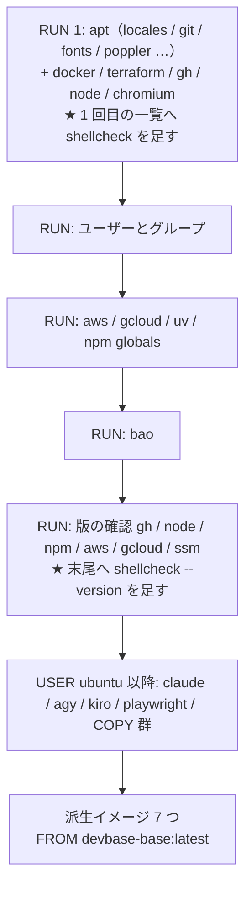

# PLAN67: base イメージに shellcheck を入れる の設計

要求と受け入れ条件は [PLAN67_base-shellcheck.md](PLAN67_base-shellcheck.md) にある。
この文書は「どう作るか」だけを扱う。

## 機能一覧

| # | 機能 | 誰が使うか |
| --- | --- | --- |
| F1 | base とその派生イメージのコンテナで、`shellcheck` で Bash スクリプトを検査する | コンテナの中で Bash を書く利用者と、shellcheck を呼ぶ言語サーバ（bash-language-server） |
| F2 | shellcheck が入っていないイメージを、ビルドの時点で止める | base を建てる devbase の開発者・利用者 |
| F3 | 上の 2 つを回帰テストで固定し、利用者向け文書と CHANGELOG を合わせる | devbase の開発者・利用者 |

## 構成要素

| 要素 | 変更 | 責務 |
| --- | --- | --- |
| `containers/base/Dockerfile` の 1 つ目の `RUN` の 1 回目の `apt-get install` | 変える | `poppler-utils` の行の後へ、理由のコメントと `shellcheck` を足す |
| `containers/base/Dockerfile` の版の確認の `RUN` | 変える | `&&` の連なりの末尾へ `shellcheck --version` を足す。入っていなければビルドをここで止める |
| `tests/containers/test_base_dockerfile_shellcheck.py`（新設） | 足す | Docker を起動せずに、上の 2 か所の**形**を固定する |
| `docs/user/container-operations.md` | 変える | 「文書を扱う道具も base に入っています」の段の後へ、shellcheck の 1 段を足す。反映の注記（`devbase build base --no-cache` と派生イメージの建て直し）は既存の引用を共有させる |
| `CHANGELOG.md` | 変える | `[Unreleased]` に `### Added` を立て、shellcheck を足したことと、**反映には `devbase build base --no-cache` が要る**ことを書く |

次のものは変えない。

- 派生イメージの Dockerfile（base を継ぐ 7 つはすべて `FROM devbase-base:latest`）
- `containers/lfm` と `containers/snapshot`（base を継がない。決定 5）
- `.github/workflows/ci.yml`（CI の ShellCheck ジョブは runner の shellcheck を使い、コンテナを使わない）
- `tests/containers/test_base_image_font_matching.py`（決定 4）

## 実測（2026-09-23 / arm64 の `devbase-base:latest`）

同じイメージから作った一時コンテナ（`--rm --user root`）で `apt-get update` の後に測った。
イメージは建て直していない。

| 項目 | 値 |
| --- | --- |
| 取得元 | `ports.ubuntu.com` の `resolute/universe`（標準のアーカイブ。リポジトリの追加は要らない） |
| 版 | `0.11.0-2`（`shellcheck --version` は `version: 0.11.0`） |
| 依存を含めて新しく入るパッケージ | **2**（`shellcheck` / `libnuma1`）。`libc6` / `libffi8` / `libgmp10` は既に入っている |
| `Installed-Size` | `shellcheck` 24971 KB（arm64）/ 22867 KB（amd64） |
| `/usr` の増分 | 25052 KB（`du -sk /usr` の前後） |
| 置き場所 | `/usr/bin/shellcheck` |
| 診断 | `echo $foo` の 1 行で `SC2154` / `SC2086` を出し、終了コード 1 |

amd64 の値はアーカイブの `binary-amd64/Packages.gz` から読んだもので、建てて確かめてはいない。

## 入出力の契約

### `containers/base/Dockerfile` の差分の形

**1 つ目の `RUN` の 1 回目の `apt-get install`**: 一覧の最後の行（`poppler-utils ...;`）の
`;` を `\` に変え、その後へ足す。理由は決定 1。

```dockerfile
    poppler-utils python3-pil python3-defusedxml python3-lxml \
    # Bash の静的検査 (#249)。bash-language-server は診断を shellcheck に任せており、
    # 無いとエラーも警告も出さずに診断が空になる。
    shellcheck; \
```

**版の確認の `RUN`**: 末尾へ足す。理由は決定 2。

```dockerfile
RUN gh --version && node --version && npm --version && aws --version && gcloud --version && session-manager-plugin --version && shellcheck --version
```

この `RUN` は `USER ${USERNAME}` より前にあり root で走る。`/usr/bin/shellcheck` は `PATH` に
あるため、パスを書かずに呼べる。

## 処理の流れ

ビルドの層と、この変更が触る位置。



**`L1` で入らなければ、`L5` で `shellcheck: command not found` となり、ビルドが終了コード 127 で
止まる。** 派生イメージは `L6` までの層をそのまま継ぐため、Dockerfile を変えずに入る。

## 非機能の実現方式

| 大項目 | 条件（受け入れ条件） | 実現方式 |
| --- | --- | --- |
| システム環境 | 2 パッケージ・30 MB 以下（6）。arm64 で建つ（8） | 標準のアーカイブの 1 パッケージだけを指定し、`--no-install-recommends` の既存の一覧へ入れる。層もリポジトリも増やさない |

## 決定の記録

### 決定 1: shellcheck は、1 つ目の `RUN` の 1 回目の `apt-get install` の一覧へ足す

shellcheck は標準のアーカイブ（`resolute/universe`）にあり、外部のリポジトリを要さない。
1 回目の一覧は標準のアーカイブのパッケージを入れる場所で、PLAN63 の `poppler-utils` などと
同じ扱いになる。

**新しい `RUN` を立てる案は採らない。** 理由は PLAN63 の決定 4 と同じで、代償が 3 つある。

| 代償 | 内容 |
| --- | --- |
| 層が 1 つ増える | 派生イメージ 7 つがこの上に積む |
| `apt-get update` をもう 1 回走らせる | 1 つ目の `RUN` は最後にリストを消す |
| クリーンアップを書き写す | `apt-get clean` と `rm -rf` を 2 か所に持つ |

この変更そのものが 1 つ目の `RUN` の文字列を変えるため、層を分けても分けなくても、この変更では
1 度建て直される。

**2 回目の一覧（`docker-ce` / `terraform` / `gh` / `nodejs` / `chromium-browser`）へ足す案も
採らない。** 2 回目は後から足したリポジトリのパッケージを入れる場所で、標準のアーカイブの
パッケージを混ぜると、一覧の分け方の意味が崩れる。

### 決定 2: 入れ損ないは、版の確認の `RUN` へ `shellcheck --version` を足して止める

版の確認の `RUN` は、`gh` / `node` / `aws` などが入ったことをビルドの時点で確かめる既存の
仕組みである。そこへ 1 語足せば、shellcheck が無いイメージは建たない。**「イメージに入って
いること」を守るのはテストではなくビルドになる。** テストの側は、この 1 語が消えないことを
固定すればよい（決定 4）。

**`apt-get install` の終了コードに任せる案は採らない。** apt はパッケージが一覧から消えても
失敗しない。一覧の編集で `shellcheck` が落ちたときに止まるのは、版の確認の側だけである。

### 決定 3: 版は固定せず、Ubuntu のアーカイブが配る版を入れる

アーカイブの版（`0.11.0-2`）で、#249 の目的である Bash の診断は満たせる（受け入れ条件 3）。
`gh` / `terraform` / `nodejs` も版を固定しておらず、base の流儀に合う。

**上流の GitHub Releases から静的バイナリを取り、`bao` と同じく `ARG` で版を固定してチェック
サムで確かめる案は採らない。** `bao` を固定するのはサーバの版と揃える必要があるためで、
shellcheck にはその制約が無い。版を上げるたびに `ARG` とチェックサムの手入れが要り、
アーキテクチャの分岐も書くことになる。**`apt-get install shellcheck=0.11.0-2` と版を書く案も
採らない。** アーカイブが版を上げると、その版が消えてビルドが止まる。

### 決定 4: 回帰テストは Docker を使わない文字列検査だけにし、イメージの中は手で確かめる

`test_base_dockerfile_shellcheck.py` を新設し、Dockerfile の文字列で次の 3 つを固定する。

| 固定すること | 受け入れ条件 |
| --- | --- |
| `shellcheck` が 1 つ目の `RUN` の 1 回目の `apt-get install` の一覧にある | 5 |
| `shellcheck` を入れる `RUN` が他に無く、`apt-get update` が 2 回のまま | 5 |
| 版の確認の `RUN` に `shellcheck --version` がある | 4 |

イメージの中に入っていることは、決定 2 によりビルドが守る。受け入れ条件 1〜3・6 は、実装の
持ち場で建てたイメージから採って Pull Request 本文へ貼る（PLAN63 と同じ扱い）。

**`test_base_image_font_matching.py` の `EXPECTED_COMMANDS` へ `shellcheck: True` を足す案は
採らない。** あのテストは `/etc/fonts/local.conf` の有無で古いイメージを見分けて skip する。
PLAN63 の後、この変更の前に建てた base は `local.conf` を持つが shellcheck を持たない。
そのため、建て直していない全員の `pytest tests/` が赤くなる。赤の意味が「壊れている」と
「イメージが古い」で混ざる（PLAN63 の決定 6 が避けたこと）。

**shellcheck 用の Docker のテストを別に立て、shellcheck が無ければ skip する案も採らない。**
「無ければ skip」は「無い」を検査できず、入っているイメージでだけ通る検査になる。入っている
ことはビルドが保証しているため、足しても新しく捕まえるものが無い。

補助の関数は `test_base_dockerfile_fonts.py` から import せず、新しいファイルに持つ。
対象はコメント行を除く `_statements` と、行継続をつなぐ `_run_blocks` の 2 つである。
テストのファイルどうしを依存させない（`test_base_dockerfile_bao.py` も自前の `_statements` を持つ）。

### 決定 5: `containers/lfm` には入れない

lfm は `FROM nvidia/cuda:...` で base を継がない。base からは `/usr/local` / `/usr/bin/gh` /
`/usr/bin/node` / `/opt` などを選んで `COPY` するだけで、`/usr/bin/shellcheck` は届かない。

#249 の受け入れ条件が挙げるのは「general / php など」の base を継ぐ派生イメージで、lfm で
Bash を書く用途は挙がっていない。入れるなら lfm 自身の `apt-get install` か `COPY` の一覧へ
足す別の変更になる。必要が出た時点で起票する。

## テスト設計

| 受け入れ条件 | 何で確かめるか |
| --- | --- |
| 1 | `devbase build base --no-cache` の後、`docker run --rm --entrypoint /bin/bash devbase-base:latest -c 'shellcheck --version; echo exit=$?'`。出力を Pull Request 本文へ貼る |
| 2 | base の後に `devbase-general` と `devbase-php` を建て直し、同じコマンドを走らせる。出力を Pull Request 本文へ貼る |
| 3 | 建てた base で `printf '#!/bin/bash\necho $foo\n' > /tmp/t.sh; shellcheck /tmp/t.sh; echo exit=$?`。`SC2086` と `exit=1` を見る |
| 4・5 | `test_base_dockerfile_shellcheck.py`（決定 4 の表） |
| 6 | 建てた base で `dpkg-query -W -f='${Installed-Size}\n' shellcheck libnuma1` の合計が 30720 以下。あわせて変更前のイメージで `dpkg -l libnuma1` が未導入であることを採り、新しく入るのが 2 つであることを示す |
| 7 | `uv run --locked pytest tests/ -q` |
| 8 | `devbase build base --no-cache`（arm64） |
| 9 | 差分の目視（`docs/user/container-operations.md` と `CHANGELOG.md`） |

## 未確認のまま残ること

| 項目 | 内容 |
| --- | --- |
| amd64 での建て直し | 手元は arm64 のみ。amd64 はアーカイブに同じ版があり依存も同じことまで確かめた。建てて確かめるのは amd64 の端末を使う人が建て直した時点になる |
| 言語サーバからの診断 | bash-language-server は範囲外。devbasex/ai-plugins#818 の設計が、コンテナの shellcheck を前提に進める |
| 利用者への周知 | 建て直すまで反映されないため、CHANGELOG と利用者向け文書に `devbase build base --no-cache` が要ることを書く。既に建てた人がいつ建て直すかは devbase の側から決められない |
