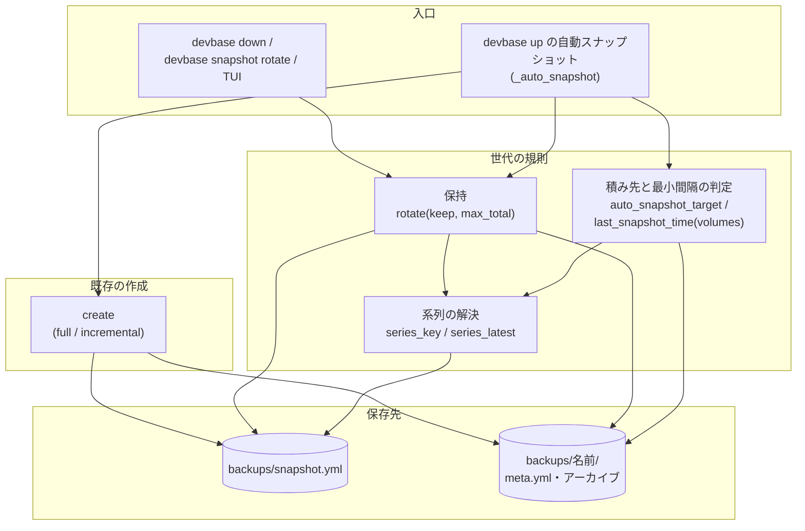
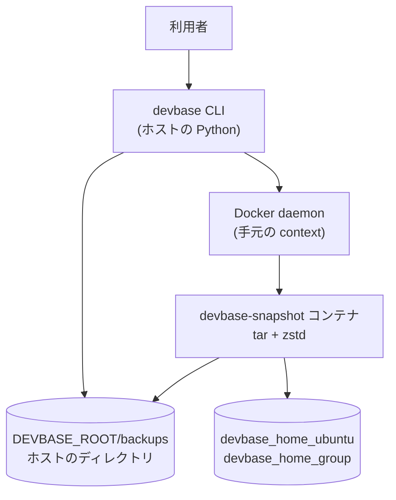
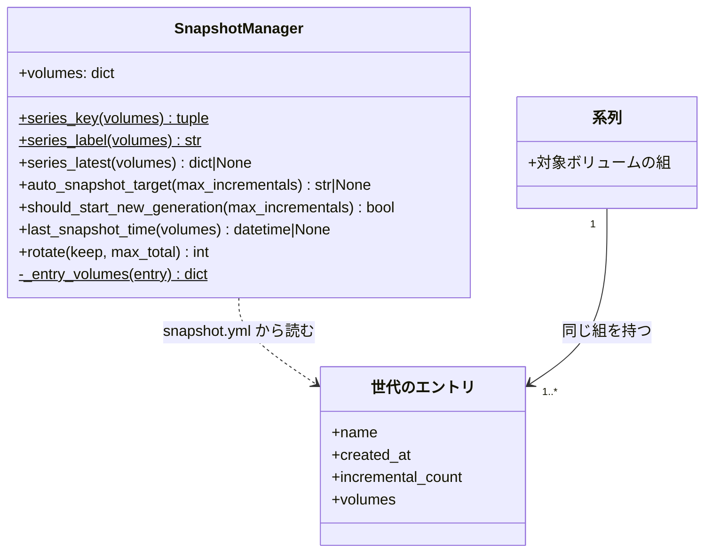
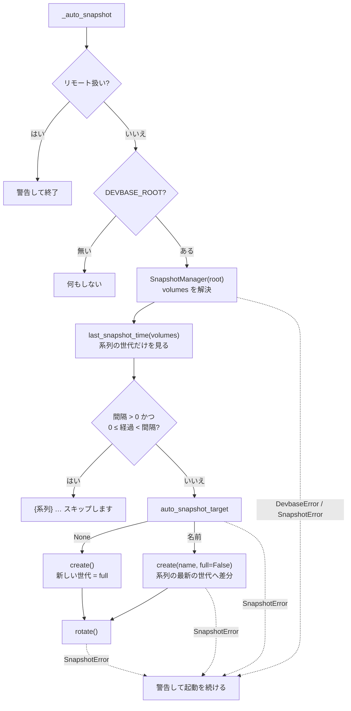
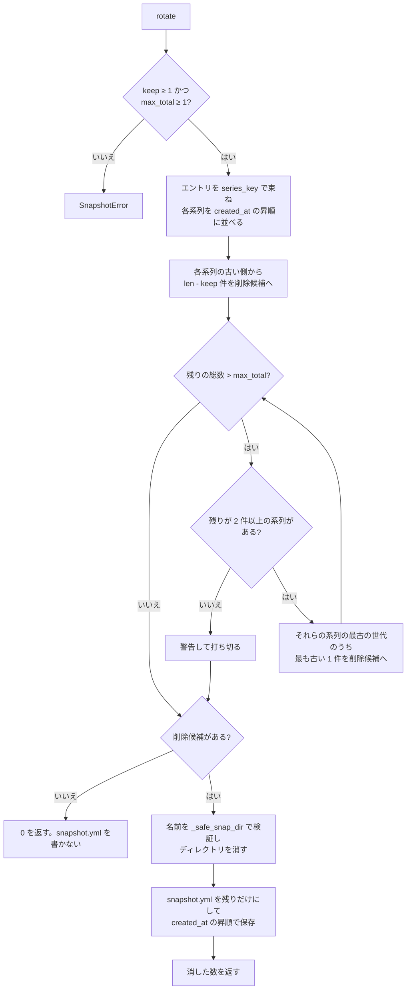

# PLAN68: スナップショットの世代をボリュームの組ごとの系列で持つ の設計

要求と受け入れ条件は [PLAN68_snapshot-series.md](PLAN68_snapshot-series.md) にある。
この文書は「どう作るか」だけを扱う。

## 機能一覧

| # | 機能 | 誰が使うか |
| --- | --- | --- |
| F1 | `devbase up` の自動スナップショットが、起動するグループの系列の最新の世代へ差分を積む | 複数のアカウントグループを使う利用者 |
| F2 | 自動スナップショットの最小間隔を、系列ごとに判定する | 同上 |
| F3 | ローテーションが系列ごとに世代を残し、全体の上限を併せて守る | `devbase up` / `devbase down` / `devbase snapshot rotate` を使う利用者 |
| F4 | 自動スナップショットとローテーションのログが、扱った系列のグループ名と理由を出す | 起動時の出力を読む利用者 |
| F5 | 利用者向け文書と CHANGELOG が、系列の規則と `--keep` の意味の変更を説明する | devbase の利用者 |

## 構成要素

| 要素 | 変更 | 責務 |
| --- | --- | --- |
| `SnapshotManager` の系列の解決（`series_key` / `series_label` / `_entry_volumes` / `series_latest`） | 足す | `snapshot.yml` のエントリを系列に分け、系列の最新の世代を返す。系列の表示名を作る |
| `SnapshotManager.auto_snapshot_target` | 足す | 自動スナップショットの積み先の名前か、新しい世代を作るべきこと（`None`）を返す。新しい世代にする理由をログへ出す |
| `SnapshotManager.should_start_new_generation` | 変える | `auto_snapshot_target(...) is None` を返すだけにする。既存の呼び出しとテストのために残す |
| `SnapshotManager.last_snapshot_time` | 変える | 引数 `volumes` を足し、渡されたらその系列の世代のアーカイブだけを見る。省けば現行どおり全体を見る |
| `SnapshotManager._safe_snap_dir` | 変える | 包含判定を文字列の前方一致から `Path.is_relative_to` へ変える（決定 7） |
| `SnapshotManager.rotate` | 変える | 系列ごとに `keep` 世代を残し、全体の上限を超えた分を系列をまたいで古い順に消す。各系列の最新の世代は消さない。消す前に名前を検証する |
| `commands/container.py` の `_auto_snapshot` | 変える | 最小間隔を系列で判定し、`auto_snapshot_target` の結果で作成を呼ぶ。ログにグループ名を入れる。`list()[-1]` を使わない |
| `commands/snapshot.py` の `rotate` の振り分けと `cli.py` の `rotate` の引数 | 変える | `--max-total` を受け取り `rotate` へ渡す。`--keep` の help を系列ごとの意味にする |
| `tui/actions_snapshot.py` のローテーションの問い | 変える | 問いの文言を「グループごとに保持する世代数 (--keep)」にする |
| `tests/snapshot/test_manager_series.py`（新設） | 足す | 系列の解決・積み先・ローテーションの規則を固定する |
| `tests/snapshot/test_auto_snapshot_series.py`（新設） | 足す | `_auto_snapshot` の最小間隔・積み先・ログを固定する |
| `tests/snapshot/test_manager_volumes.py` | そのまま | 既存の世代分割のテスト（旧レイアウト・グループ切替・異なる組への差分の拒否）が変更なしで通ることを確かめる |
| 利用者向け文書 4 本と `CHANGELOG.md` | 変える | 下の「文書の変更」の表 |

次のものは変えない。

- `snapshot.yml` / `meta.yml` の形（決定 5）
- `create` / `restore` / `copy` / `delete` / `list`、`_create_incremental` の組の検証
- `commands/status.py`（全体の最新と総数を出す。系列の概念を持ち込まない）
- `cmd_down` の `mgr.rotate()` の呼び出し（引数の既定値で新しい規則になる）

### 構成要素図

テスト・文書と、`should_start_new_generation`（積み先の判定を包むだけのもの）は図に含めない。



### 文脈と配置



系列の判定とローテーションは**ホストの Python の中だけ**で完結し、Docker を呼ばない。
Docker を呼ぶのは既存の `create` のアーカイブ作成だけで、この変更は呼ぶ回数（full か差分か）を
変える。リモート扱いでは自動スナップショットを作らない（前提 3）。

### パッケージ構成

```text
lib/devbase/
├── snapshot/manager.py        # 系列の解決・積み先・最小間隔・ローテーション
├── commands/container.py      # _auto_snapshot
├── commands/snapshot.py       # rotate の振り分け
├── cli.py                     # rotate の引数
└── tui/actions_snapshot.py    # ローテーションの問い
tests/snapshot/
├── test_manager_series.py         # 新設
└── test_auto_snapshot_series.py   # 新設
```

### 文書の変更

| 文書 | 変えるところ |
| --- | --- |
| `docs/user/snapshot-guide.md` | 「世代管理」: 設定パラメータの表に全体の上限を足し、「系列」の小節を立てる。世代の概念の図を系列ごとにする。「自動実行」: `devbase up` の図を「系列の最新の世代」で判定する形にし、`devbase down` の図を系列ごと + 全体の上限にする。「対象ボリュームが変わったとき」: 新しい世代を作るのは系列に世代が無いときだけ、という説明へ書き換える（拒否の例はそのまま）。「手動ローテーション」: `--keep` を系列ごと、`--max-total` を足し、名前付きの世代もローテーションの対象であることを書く。**どちらの指定も手動のその 1 回だけに効き、`devbase up` / `down` の自動ローテーションは既定の数で動く**ことを書く |
| `docs/user/cli-reference/05-snapshot.md` | `rotate` のオプションの表 |
| `docs/user/cli-reference/02-project.md` | 最小間隔が系列（グループ）ごとであること |
| `docs/user/container-operations.md` | 「自動スナップショット」の表の `devbase down` の行 |
| `CHANGELOG.md` | `[Unreleased]` に `### Changed` を立て、系列ごとの保持・差分の積み先・最小間隔・`--keep` の意味の変更と `--max-total` を書く |


## 構造



`系列` は型として作らない。`series_key(volumes)` が返すタプルを辞書のキーにして、その場で
エントリを束ねる（決定 5）。

## データ構造

**形は変えない。** 系列はエントリの `volumes` から導く値で、どこにも保存しない。

| 保存先 | 系列の判定での扱い |
| --- | --- |
| `snapshot.yml` の `snapshots[]` の `volumes` | 系列の識別子の元。`{ai: devbase_home_ubuntu, group: devbase_home_<group>}` |
| 同上で `volumes` が無い、空、または dict でないエントリ | PLAN39 より前の旧レイアウト。`{'': devbase_home_ubuntu}` とみなす |
| `snapshot.yml` の `max_generations` | `rotate` が消したときに `keep` を書く（現行どおり。系列ごとの数として読む）。読む側は無い |
| 各世代の `meta.yml` の `volumes` | 系列の判定には使わない。積む直前の検証（`auto_snapshot_target` と `_create_incremental`）でだけ読む |

`series_key` は `tuple(sorted(volumes.items()))`。値の検証はしない（キーとして比べるだけで、
マウントには使わないため）。マウントに使う値は、従来どおり `snapshot_volumes` が `meta.yml` から
検証して返す。

### CRUD

| 機能 | `snapshot.yml` | 世代のディレクトリ |
| --- | --- | --- |
| F1 積み先の判定 | R | R（`meta.yml` の `volumes`） |
| F1 作成（既存の `create`） | C / U | C / U |
| F2 最小間隔 | R | R（アーカイブの mtime） |
| F3 ローテーション | R / U（消した分を除く。消さなければ書かない） | D |

## 入出力の契約

### `SnapshotManager` の約束

| 名前 | 入力 | 出力 | 失敗の形 |
| --- | --- | --- | --- |
| `series_key(volumes)` | `dict`（マウント名 → ボリューム名） | `tuple[tuple[str, str], ...]` | 無い |
| `series_label(volumes)` | 同上 | `volumes` に `group` があれば `グループ <名前>`（`devbase_home_` を外した名前）。無ければ `旧レイアウト（共通ボリュームのみ）` | 無い |
| `series_latest(volumes=None)` | 省けば `self.volumes` | その系列で `created_at` が最大のエントリ（同じ値なら `snapshot.yml` で後ろのもの）。系列に無ければ `None` | `self.volumes` の解決で `DevbaseError`（グループ名が不正） |
| `auto_snapshot_target(max_incrementals=10)` | 1 世代の差分の上限 | 積み先の世代の名前、または新しい世代を作るべきなら `None` | 同上。`meta.yml` が不正なら `SnapshotError`（現行の `should_start_new_generation` と同じ） |
| `should_start_new_generation(max_incrementals=10)` | 同上 | `auto_snapshot_target(...) is None` | 同上 |
| `last_snapshot_time(volumes=None)` | 省けば全ディレクトリ（現行）。渡せばその系列のエントリのディレクトリだけ | 最新のアーカイブの mtime（UTC）。無ければ `None` | 無い |
| `rotate(keep=3, max_total=None)` | `keep`: 系列ごとに残す数。`max_total`: 全体の上限。省けば `keep × 3` | 消した世代の数 | `keep < 1` か `max_total < 1` なら `SnapshotError`（何も消さない） |

`auto_snapshot_target` の判定は次の順に行う。

| 順 | 条件 | 結果 | ログ（INFO） |
| --- | --- | --- | --- |
| 1 | 系列に世代が無い | `None` | `{系列} の世代がまだ無いため、新しい世代を作成します` |
| 2 | 系列の最新の世代のディレクトリがあり、その `meta.yml` の組が `self.volumes` と違う | `None` | `世代 {名前} の meta.yml の対象ボリューム ({組}) が {系列} と一致しないため、新しい世代を作成します` |
| 3 | 系列の最新の世代の `incremental_count` が上限以上 | `None` | `世代 {名前}（{系列}）の差分が上限 ({上限}) に達したため、新しい世代を作成します` |
| 4 | それ以外 | 系列の最新の世代の名前 | 出さない |

ディレクトリが無い世代を返したときは、既存の `create(name=...)` が新しいディレクトリとして
full を作る（現行と同じ）。

### `devbase snapshot rotate`

| 項目 | 内容 |
| --- | --- |
| 形 | `devbase snapshot rotate [--keep N] [--max-total M]` |
| `--keep N` | **系列（グループ）ごとに**残す世代の数。既定 3。help: `Generations to keep per account group` |
| `--max-total M` | 全体で残す世代の上限。既定は `N × 3`。各グループの最新の世代は上限を超えても残す。**指定はその 1 回の実行だけに効く。** 値は保存せず、次の `devbase up` / `devbase down` の自動ローテーションは既定（系列ごと 3・全体 9）で動く（`--keep` も同じ）。help: `Upper limit of generations across all groups (default: 3 x --keep)` |
| 失敗の形 | `N < 1` / `M < 1` は `SnapshotError` → 既存の `cmd_snapshot` がエラーを出して終了コード 1 |
| 互換性 | **`--keep` の意味が変わる。** 変更前に `--keep 5` を指定していた利用者は、グループが 1 つなら同じ結果、2 つ以上なら残る世代が増える（最大 `5 × 3`）。減る方向の変化は無い。CHANGELOG の Changed に書く |

### ログの文言

| 場面 | 水準 | 文言 |
| --- | --- | --- |
| 最小間隔で飛ばす | INFO | `[0/6] {系列} の直近のスナップショット ({時刻}) から{分}分以内のためスキップします` |
| 新しい世代を作る | INFO | `[0/6] 新しいスナップショット世代を作成中 ({系列})...`（直前に上表の理由の 1 行） |
| 差分を積む | INFO | `[0/6] スナップショットを差分更新中: {名前} ({系列})` |
| 系列ごとの保持で消した | INFO | `ローテーション: {系列} の {数} 世代を削除しました（グループごとに {keep} 世代保持）` |
| 全体の上限で消した | INFO | `ローテーション: 全体の上限 {max_total} 世代を超えたため、{系列} の {名前} を削除しました` |
| 全体の上限を満たせない | WARNING | `全体の上限 {max_total} 世代を超えていますが、各グループの最新の世代は消さないため {残り} 世代を残します` |
| 世代の場所が `backups/` の外になるエントリ | WARNING | `snapshot.yml の世代 '{名前}' は backups/ の外を指すため、ディレクトリを消さずに一覧からだけ外します: {理由}` |

`{系列}` は `series_label` の値（例: `グループ default`）。**現行の「対象ボリュームの構成が
変わったため新しい世代を作成します (旧: … / 新: …)」の行は無くなる。** グループの切替では
新しい世代を作らないため、出す場面が無い（決定 3）。

## 処理の流れ

### `devbase up` の自動スナップショット



失敗の扱いは現行と同じで、`_auto_snapshot` の `except Exception` が警告に変えて起動を続ける。

### `rotate(keep, max_total)`



`created_at` が同じエントリは `snapshot.yml` の並び順で前にあるものを古いとみなす。
`created_at` が無いエントリは空文字として最も古く扱う（現行と同じ）。

### 例: この端末の `snapshot.yml` から with → default の順に起動する

最後の世代（`20260923-081407`）は default のため、default だけを起動しても変更の前後で差は出ない。
差が出るのは、別のグループを起動してから戻るときである。

| 手順 | 系列 default | 系列 with | 全体 |
| --- | --- | --- | --- |
| 始めの状態 | `20260915-231738`（差分 9）・`20260923-081407`（差分 0） | `20260920-212546`（差分 0） | 3 |
| `devbase up`（with） | 変わらない | `20260920-212546` へ `incr-001` | 3 |
| `devbase up`（default） | `20260923-081407` へ `incr-001` | 変わらない | 3 |
| 各回の `rotate()` | 2 ≤ 3 で消さない | 1 ≤ 3 で消さない | 3 ≤ 9 |

変更前の規則では、次のように動く。

| 手順 | 変更前の動き | 残る世代 |
| --- | --- | --- |
| `devbase up`（with） | 最後の世代（default）と組が違うため、with の世代を full で作る。`rotate()` が `20260915-231738`（default、差分 9）を消す | default 1・with 2 |
| `devbase up`（default） | 最後の世代（with）と組が違うため、default の世代を full で作る。`rotate()` が `20260920-212546`（with）を消す | default 2・with 1 |

## 非機能の実現方式

| 大項目 | 条件（受け入れ条件） | 実現方式 |
| --- | --- | --- |
| 性能・拡張性 | 系列に世代があれば full を作らない（1）。世代の数は `max(全体の上限, 系列の数)` を超えない（10・11・12） | 積み先を系列の最新の世代にする（決定 2）。全体の上限は各系列の最新の 1 世代を下限として守る（決定 1） |
| 移行性 | 移行作業は無い（22） | 系列を保存せず、既存の `volumes` から導く（決定 5）。変更前の devbase は同じ `snapshot.yml` をそのまま読める |

## 決定の記録

### 決定 1: 保持は系列ごとに数え、全体の上限を併せて持つ。全体の上限の既定は `keep × 3` とし、各系列の最新の世代は上限でも消さない

系列ごとの保持だけでは、使わなくなったグループや旧レイアウトの系列が、新しい世代を作らない
まま 3 世代ずつ残り続ける。グループの数だけディスクの使用量が増え、上限が無い。全体の上限は
その歯止めになる。この端末のグループは 3 つで、`keep × 3`（既定 9）は 3 グループがそれぞれ
3 世代を持てる数である。`--keep` を変えた利用者の上限も同じ比で動く。

各系列の最新の世代を消さないのは、それが次の差分の積み先だからである。消すと、そのグループを
次に起動したときに full を取り直すことになり、#248 の実害（履歴が短くなり full を取り直す）が
全体の上限の側で再び起きる。系列の数が上限を超えたときは、上限を守らず警告する。

**系列ごとの保持だけにする形は採らない。** 上の歯止めが無い。**全体の上限を `keep` と
独立した定数（9）にする形も採らない。** `--keep 5` を指定した利用者の上限が 9 のままだと、
2 グループで 10 世代になった時点で、指定より少ない数へ黙って削られる。**上限をバイト数で持つ
形も採らない。** 1 世代の大きさは差分の数で 3.9 GB から 37 GB まで振れ、何世代残るかを利用者が
予測できない。数ならテストで固定でき、容量は `devbase snapshot list` のサイズの列で見える。

### 決定 2: 差分は系列の最新の世代へ積む。間に別グループの起動を挟んでも積み直す

`snapshot.snar` は世代のディレクトリごとにあり、その世代へ最後に積んだ時点のツリーを
記録している。系列が同じなら、アーカイブのレイアウト（`/source/ai` と `/source/group`）も
マウントするボリュームも同じで、snar の記録と今のツリーのパスが対応する。そのため全ファイルが
移動した扱いにはならない（現行の世代分割が防いでいたのは、レイアウトが違う snar へ積むことである）。

間に別グループの起動を挟むと、共通ボリューム（`devbase_home_ubuntu`）の中身が変わっている。
これは「前回の差分からの変更」として次の差分に入るだけで、差分の正しさを損なわない。復元は
full と差分を順に当てるため、各差分の時点の状態に戻る。グループのボリュームは、そのグループの
起動でしか変わらない。

代償として、**共通ボリュームは系列ごとに別々に控えられる。** default と with が同じ
共通ボリュームの変化をそれぞれの差分に持つ。系列を分ける以上避けられず、グループを切り替える
たびに full を取り直す現状より小さい。

**別グループの起動を挟んだら新しい世代にする形は採らない。** 現行と同じく切り替えのたびに
full を取り直し、保持の枠も使う。

### 決定 3: 文言には系列のグループ名と理由を添える。直前の世代を作ったプロジェクトは添えない

#248 の混乱は、グループの切替で新しい世代ができ、その理由の行に直前の世代のグループ名が
出たことによる。系列を導入すると、グループの切替は新しい世代を作る理由でなくなり、その行を
出す場面が無くなる。残る文言は、**今扱っている系列が何か**と、**新しい世代を作るならなぜか**の
2 つで足りる。

**直前の世代を作ったプロジェクトを添える形は採らない。** 世代はプロジェクトではなく
ボリュームの組に属し、同じグループの複数のプロジェクトが 1 つの世代へ積む。プロジェクト名を
記録するには `meta.yml` の形を変えることになり（決定 5）、記録しても「最後に積んだ 1 つ」しか
表せない。

### 決定 4: 自動スナップショットの最小間隔を、系列ごとに判定する

現行の `last_snapshot_time` は全世代のアーカイブの mtime の最大を見る。系列を分けると、
default を控えた直後に with を起動したとき、with の系列は何時間も控えていなくても飛ばされる。
最小間隔は「同じものを続けて控えない」ための仕組みで、控える対象は系列ごとに違う。

引数 `volumes` を省けば、現行の全体の判定になる。そのため既存のテストはそのまま通る。
対象は `test_auto_snapshot.py` の `last_snapshot_time` の 5 件である。

**全体の最小間隔を残す形は採らない。** 朝に 3 グループのプロジェクトを続けて起動すると、
最初の 1 グループしか控えない現行の挙動が続く。系列ごとにすると控える回数は増えるが、
2 回目以降は差分になる（決定 2）。

### 決定 5: 系列は保存せず、`snapshot.yml` のエントリの `volumes` から導く

エントリは PLAN39 以降すべて `volumes` を持ち、系列はそこから一意に決まる。導ける値を別に
保存すると、`volumes` と食い違ったときにどちらが正しいかを決める規則が要り、既存の
`snapshot.yml` の移行も要る。導けば移行が無く、変更前の devbase へ戻しても読める。

判定には `meta.yml` ではなく `snapshot.yml` を使う。ローテーションが全世代の `meta.yml` を
読まずに済む。壊れた `meta.yml` の検証エラーで、ローテーション全体が止まることも無い。
積む直前にだけ `meta.yml` を読んで組を確かめる（`auto_snapshot_target` の順 2 と、既存の
`_create_incremental` の検証）。

**エントリへ `series` のキーを足す形は採らない。** 上の食い違いと移行が生じる。

### 決定 6: `--keep` の意味を系列ごとへ変え、全体の上限は `--max-total` で指定する

`rotate` が守る数は、系列ごとの数になる。`--keep` がそれ以外を指すと、自動のローテーション
（系列ごと）と手動のローテーションで、同じ語が別の意味になる。同じ `--keep` の値で残る世代は
変更の前より減らない。そのため既存の指定が世代を失わせることは無い（入出力の契約の互換性）。

**`--keep` を全体の数のまま残し、`--keep-per-group` を足す形は採らない。** 全体の数だけで
消す規則こそが #248 の原因で、それを既定の意味に残すと、手動の `rotate` が系列の世代を
押し出す。

### 決定 7: ローテーションは、消す前に世代の場所を `_safe_snap_dir` で検証する。`_safe_snap_dir` の包含判定はパスの要素の単位にする

現行の `rotate` は `snapshot.yml` の `name` をそのまま `backups_dir / name` にして
`shutil.rmtree` へ渡す。`snapshot.yml` は編集でき、`../` を含む名前で `backups/` の外を
消せる。`rotate` を書き直すこの変更で、`delete` / `restore` と同じ検証を通す。

**`_safe_snap_dir` の包含判定も直す。** 現行は解決後のパスの文字列の前方一致で判定する。
`backups/old` が兄弟の `backups-outside/` を指すシンボリックリンクだと、解決後のパスは
`.../backups-outside` になり、文字列としては `.../backups` で始まるため通る。その結果、
リンク先の中身を消せる。判定を `Path.is_relative_to(self.backups_dir.resolve())` に変え、
パスの要素の単位で比べる。

| 世代の場所 | 検証の結果 | `rotate` の扱い |
| --- | --- | --- |
| `backups/` の直下の実ディレクトリ | 通る | ディレクトリを消し、エントリを外す |
| 名前が不正（`../outside` など） | `SnapshotError` | ディレクトリを消さず、エントリだけを外して警告する |
| `backups/` の外を指すシンボリックリンク（兄弟の `backups-outside/` を含む） | `SnapshotError` | 同上。リンクもリンク先も消さない |

`_safe_snap_dir` は `create` / `restore` / `copy` / `delete` も使う。これらでも、`backups/` の外を
指すシンボリックリンクの世代は同じ `SnapshotError` で止まる。`backups/` 自体をリンクにした
構成は、`backups_dir.resolve()` と比べるため変わらず使える。

**不正な名前で `rotate` 全体を止める形は採らない。** `devbase down` のたびに失敗の警告が
出続け、正しい世代のローテーションも止まる。

## テスト設計

`tests/snapshot/test_manager_series.py` は、Docker を起動しない補助を自前で持つ。
形は `test_manager_volumes.py` の `RecordingManager` と同じで、`_run_docker_tar` を差し替える。`snapshot.yml` を直接書いて
状態を作るテストは、世代のディレクトリと `meta.yml` も書く。

| 受け入れ条件 | 何で確かめるか |
| --- | --- |
| 1 | default で `create()` → with で `create()` → default で `auto_snapshot_target()` が default の世代の名前を返す。`_auto_snapshot` 経由でも `create(name=..., full=False)` が呼ばれ、世代が 2 つのまま（`test_auto_snapshot_series.py`） |
| 2 | default の世代だけがある状態で、with の `auto_snapshot_target()` が `None` を返し、`_auto_snapshot` が `create()` を呼ぶ |
| 3 | default の最新の世代の `incremental_count` を 10、with の世代を 0 にして、default は `None`、with は名前を返す |
| 4 | 旧レイアウトの世代だけがある状態で `auto_snapshot_target()` が `None`（既存の `test_layout_change_starts_a_new_generation` もそのまま通る） |
| 5 | 既存の `test_incremental_on_a_different_layout_is_refused` |
| 6 | 2 系列のアーカイブの mtime を `os.utime` で 10 分前と 2 時間前にし、`last_snapshot_time(volumes)` が系列ごとの値を返す。`_auto_snapshot` が with では作成を呼び、default では呼ばない |
| 7 | `DEVBASE_SNAPSHOT_MIN_INTERVAL_MINUTES=0` で、10 分前の系列でも作成を呼ぶ |
| 8 | default 4・with 1 の `snapshot.yml` で `rotate()` が 1 を返し、default の最古のディレクトリと一覧のエントリだけが消える |
| 9 | default と with を交互に 4 つずつ作り、`rotate()` の後に各 3 が残る |
| 10 | 4 系列を A1〜D3 の順で作り、`rotate()` の後に A1・B1・C1 が消えている |
| 11 | A の 3 世代が最古、B〜D が 3 ずつで、`rotate()` の後に A の最新が残り、A の古い 2 と B の最古が消えている |
| 12 | 10 系列 × 1 世代で `rotate(keep=3, max_total=9)` が 0 を返し、WARNING が 1 件 |
| 13 | 旧レイアウト 3 世代と default 3 世代で `rotate()` が 0 を返す |
| 14 | `rotate(keep=0)` / `rotate(max_total=0)` が `SnapshotError`、ディレクトリが残る。`cmd_snapshot` に `keep=0` の引数で終了コード 1 |
| 15 | `cmd_snapshot` に `keep=1, max_total=2` を渡し、系列 2 つ × 2 世代から 2 世代が消える。`max_total` を省いた `rotate(keep=1)` の上限が 3 |
| 16 | `caplog` で、グループを切り替えた `_auto_snapshot` に「対象ボリュームの構成が変わった」が無く、`グループ default` を含む行がある。新しい世代では理由の行がある |
| 17 | `caplog` で、系列ごとの削除と全体の上限の削除の行にグループ名がある |
| 18 | `tests/cli/tui/test_actions_snapshot.py` の `rotate` のテストで、問いの文言を固定する |
| 19〜21 | 差分の目視（文書 4 本と CHANGELOG） |
| 22 | この端末の `snapshot.yml` と同じ 3 エントリで `rotate()` が 0 を返し、`snapshot.yml` の中身（バイト列）が変わらない |
| 23 | `uv run --locked pytest tests/ -q` |
| 24 | 既存の `test_restore_incremental.py` と `test_manager_volumes.py` の復元のテストが変更なしで通る |
| 25 | `tmp_path/backups` の兄弟に `outside/` を作り、`snapshot.yml` に `../outside` を含む 4 世代（同じ系列、`../outside` が最古）を書いて `rotate()`。`outside/` が残り、エントリが消え、WARNING が 1 件 |
| 26 | `tmp_path/backups-outside/` を作り、`backups/old` をそこへのシンボリックリンクにする。`snapshot.yml` の最古の世代を `old` にして `rotate()`。`backups-outside/` の中身が残り、エントリが消え、WARNING が 1 件。あわせて `_safe_snap_dir('old')` が `SnapshotError` |

`_auto_snapshot` のテストは `DEVBASE_ROOT` を `tmp_path` に向け、`SnapshotManager._run_docker_tar` を
`monkeypatch` で差し替える。実データの `backups/` と Docker に触らない。

## 未確認のまま残ること

| 項目 | 内容 |
| --- | --- |
| 間に別グループを挟んだ差分の実際の復元 | 決定 2 は tar の snar の仕組みからの推論である。実装の持ち場で、default → with → default と積んだ世代を実際の `devbase-snapshot` で復元し、最後の差分の時点の共通ボリュームに戻ることを 1 度確かめる |
| 4 グループ以上の端末 | 全体の上限の既定 9 では、4 グループ目以降が増えるほど各系列の世代が 3 未満になる。**自動のローテーション（`up` / `down`）の上限を変える手段は設けない。** `--max-total` は手動の 1 回だけに効き、次の `up` / `down` で 9 まで削られる。この制限を利用者向け文書に書く。上限を保存して自動のローテーションへ効かせるかは、4 グループ以上を使う端末が現れた時点で決める |
| #255・#256 との順序 | どちらも `rotate` と `restore` の近くを直す。この変更と別の Pull Request で進め、競合は後に入る側が解く |
