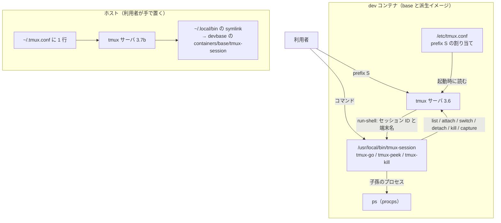
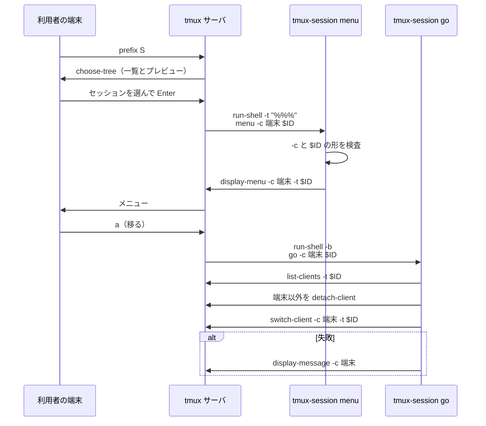

# PLAN69: tmux のセッションを名指しで attach・調査・終了できるようにする の設計

要求と受け入れ条件は [PLAN69_tmux-named-session.md](PLAN69_tmux-named-session.md) にある。
この文書は「どう作るか」だけを扱う。

## 機能一覧

| # | 機能 | 誰が使うか |
| --- | --- | --- |
| F1 | 名指しのセッションへ移り、そのセッションに繋がっている他の端末を外す | コンテナ（とホスト）で tmux を使う利用者 |
| F2 | 名指しのセッションを attach せずに調べる（端末・プロセス・画面の直近） | 同上 |
| F3 | 名指しのセッションを、attach・実行中に関係なく落とす | 同上 |
| F4 | tmux の中で `prefix S` から一覧を出し、選んだセッションに F1〜F3 を行う | tmux の中にいる利用者 |
| F5 | F1〜F4 を base イメージへ入れ、ホストで使う手順を示す | base を建てる利用者と、ホストの tmux の利用者 |

## 構成要素

| 要素 | 変更 | 責務 |
| --- | --- | --- |
| `containers/base/tmux-session` | 足す | 名指しの操作の本体。サブコマンド `go` / `peek` / `kill` / `menu` を持つ POSIX sh の 1 ファイル。呼ばれた名前が `tmux-go` / `tmux-peek` / `tmux-kill` ならそのサブコマンドとして動く（決定 1） |
| `containers/base/tmux.conf` | 変える | 末尾に `prefix S` の割り当てを 1 行足す（決定 2） |
| `containers/base/Dockerfile` の「tmux セッションの整理コマンド」の節 | 変える | `tmux-session` の `COPY` を 1 行足し、symlink の `RUN` に `tmux-go` / `tmux-peek` / `tmux-kill` の 3 つを足す |
| `.github/workflows/ci.yml` の `shellcheck` ジョブ | 変える | `containers/base/tmux-first` / `tmux-clean` / `tmux-session` を検査する step を足す（決定 6） |
| `tests/containers/test_tmux_session.py` | 足す | 専用のソケットの tmux で F1〜F3 と、`prefix S` から `menu` へ渡る値を確かめる。Dockerfile の `COPY` と symlink の形を固定する |
| `tests/containers/test_tmux_conf.py` | 変える | `prefix S` の割り当てがあることを `list-keys` で確かめる |
| `docs/user/environment-variables.md` の「同じプロジェクトのセッションが増え続ける場合」の後 | 変える | 小節「セッションを名指しで扱う」を足す。3 つのコマンド・`prefix S`・ホストで使う手順を書く |
| `CHANGELOG.md` | 変える | `[Unreleased]` の `### Added` に足す。反映に `devbase build base --no-cache` が要ることを書く |

次のものは変えない。

- `containers/base/tmux-first` / `containers/base/tmux-clean`（決定 5）
- `containers/base/entrypoint.sh`
- `lib/` と `bin/`（devbase の CLI）

### 置き場所

```text
containers/base/
├── Dockerfile          変える（tmux の整理コマンドの節）
├── tmux-session        新設
└── tmux.conf           変える（末尾に 1 行）
tests/containers/
├── test_tmux_conf.py   変える
└── test_tmux_session.py 新設
.github/workflows/ci.yml 変える
docs/user/environment-variables.md 変える
CHANGELOG.md 変える
```

### 文脈と配置



tmux と `ps` は変えられない外側である。`tmux-session` は tmux の CLI だけを通して tmux サーバを
操作し、tmux の内部の状態を直接読まない。

## 実測（2026-09-24）

ホストの tmux 3.7b と、`devbase-base:latest`（arm64）の tmux 3.6 で測った。どちらも専用の
ソケットのサーバを立て、`python3` の `pty` で端末を 1 つ attach した。

| 項目 | 結果 |
| --- | --- |
| `prefix S` の既定の割り当て | 3.6・3.7b とも無い（`tmux -f /dev/null` の `list-keys -T prefix`）。`s` は `choose-tree -Zs` |
| `choose-tree -s` の template の `%%` | 選んだセッションの `=名前:` に置き換わる（例 `=a-10:`）。**最初の 1 つだけ**が置き換わる |
| `%%` を `'…'` で囲んだ `run-shell -t '%%'` | 名前に `'` を含むセッションを選ぶと、コマンドの解析に失敗して何も起きない |
| `%%%` を `"…"` で囲んだ `run-shell -t "%%%"` | `'`・`"`・`$`・`;`・`~`・`\`・空白を含む名前のすべてで、正しいセッションを指した。`%%%` は `"` `\` `$` `;` `~` の前に `\` を補う |
| `run-shell -t "%%%"` の中の `#{q:session_name}` / `#{q:session_id}` | 選んだセッションの名前と ID に、シェル向けの引用を付けて展開される。3.6・3.7b とも同じ |
| 同じ位置の `#{q:client_name}` | `prefix S` を押した端末の名前（例 `/dev/pts/4`）に展開される |
| template に `%%` を書かない場合 | 書式は選んだセッションではなく、今いるセッションで展開される |
| `#{session_id}` を `q:` なしで `run-shell` に渡す | `$1` がシェルの位置引数として展開され、値が消える |
| base イメージの道具 | `ps` と `pgrep` はある。`less` は無い（`more` はある） |
| `shellcheck`（base の 0.11.0） | 既存の `tmux-first` / `tmux-clean` は指摘 0 件 |

## 入出力の契約

### コマンド `tmux-session`

```text
tmux-session go   [-c 端末] <セッション>
tmux-session peek [-n 行数] <セッション>
tmux-session kill [-n] [-f] [-c 端末] <セッション>...
tmux-session menu -c 端末 <セッション>
tmux-go   …  = tmux-session go   …
tmux-peek …  = tmux-session peek …
tmux-kill …  = tmux-session kill …
共通: -h / --help で使い方を出して終了コード 0
```

**呼ばれた名前で振り分ける。** `basename "$0"` が `tmux-go` / `tmux-peek` / `tmux-kill` なら
第 1 引数をサブコマンドとして読まない。それ以外は第 1 引数をサブコマンドとして読む。

#### セッションの指し方

| 引数の形 | 解決 |
| --- | --- |
| `$` + 数字（例 `$3`） | その ID のセッション。無ければ同じ文字列の名前として探す |
| それ以外 | 名前の**完全一致**。`devbase-1` は `devbase-10` に当たらない |

`tmux list-sessions -F '#{session_id} #{session_name}'` を読み、最初の空白より後ろ全体を
名前として比べる（`tmux-clean` と同じ方法。名前にどんな文字が入っても取り違えない）。
解決した後の操作はすべて ID（`-t '$3'`）で行う。ID は `$` と数字だけでできているため、
tmux のコマンドにもシェルにも引用 1 段で安全に渡せる。

#### `-c 端末`（UI からの呼び出し）

`-c` は「この端末の代わりに操作する」ことを示す。`menu` が組むメニューの項目は必ず `-c` を付けて
呼ぶ。

| 項目 | `-c` あり | `-c` なし |
| --- | --- | --- |
| 実行元の端末 | `-c` の値。`tmux list-clients` に無ければ終了コード 1 | tmux の中なら `tmux-first` と同じ方法で特定する（最終操作が 10 秒以内の「現在の端末」だけを実行元と認める）。tmux の外なら無し |
| 自分のセッション | `-c` の端末が見ているセッション | tmux の中なら `$TMUX_PANE` の pane があるセッション |
| 知らせの出し先 | `tmux display-message -c 端末`（1 行ずつ）。標準出力には何も出さない | 標準出力と標準エラー |

**`-c` の値は `[A-Za-z0-9/_.-]` だけでできていることを確かめ、外れたら終了コード 2 にする。**
tmux の端末名は tty のパス（`/dev/pts/4`）か `client-<pid>` で、この範囲に収まる。この検査で
`menu` が組む tmux のコマンドへ引用 1 段で埋め込める。

#### `go`

| 状況 | 振る舞い |
| --- | --- |
| tmux の外 | `exec tmux attach-session -d -t '$ID'`。`-d` で、そのセッションに繋がっていた端末を外す |
| tmux の中・実行元を特定できた | 対象のセッションに繋がっている端末のうち実行元以外を `detach-client -t` で外し、**その後で** `switch-client -c 実行元 -t '$ID'`。対象が自分のセッションなら切り替えずに外すだけ |
| tmux の中・実行元を特定できない | 何も外さず、切り替えず、`tmux switch-client -t '=名前'` の手順を標準エラーへ出して終了コード 1 |

外す順序を切り替えより先にするのは、先に切り替えると実行元も対象のセッションの端末になり、
「実行元以外」を選ぶ一覧の取り方次第で自分も外れるためである（#234 の手順 1）。別のセッションに
繋がっている端末は `list-clients -t '$ID'` の一覧に出ないため、触らない。

#### `peek`

読むだけで、tmux の状態を変えない。標準出力へ次の 4 節を出す。

```text
session  devbase-2 ($3)  windows 2  attached 1
clients
  /dev/pts/4  最終操作 Thu Sep 24 10:31:02 2026
panes
  0.0  uv  pid=1234  /work/devbase
    1300  uv run devbase list
      1310  python3 …/devbase list
  1.0  bash  pid=1400  /work
screen (0.0 の直近 20 行)
  …
```

| 節 | 取り方 |
| --- | --- |
| session | `display-message -p -t '$ID'` の `#{session_name}` / `#{session_id}` / `#{session_windows}` / `#{session_attached}` |
| clients | `list-clients -t '$ID' -F '#{client_name}  最終操作 #{t:client_activity}'`。無ければ `(なし)` |
| panes | `list-panes -s -t '$ID' -F '#{window_index}.#{pane_index}  #{pane_current_command}  pid=#{pane_pid}  #{pane_current_path}'`。各行の下へ、`pane_pid` の子孫のプロセスを深さで字下げして並べる |
| screen | 今のウィンドウの今の pane を `capture-pane -p -t '$ID' -S -<行数>` で取る。`-n` の既定は 20。`-n 0` でこの節を出さない |

子孫のプロセスは `ps -A -o pid= -o ppid= -o args=` を 1 回だけ取り、`awk` で `pane_pid` から
辿る。Linux の procps と macOS の `ps` のどちらでも同じ引数で動く。`pgrep -P` は子しか出さず、
`uv` の下の `python3` のような孫が見えない。

#### `kill`

| 状況 | 振る舞い |
| --- | --- |
| 対象が見つかった | `kill-session -t '$ID'`。attach 中・実行中を問わない。`KILL 名前` を出す |
| 対象が無い | 標準エラーへ出し、残りの対象は続ける。最後に終了コード 1 |
| 対象が自分のセッション・`-f` なし | 落とさずに理由を出し、残りは続ける。最後に終了コード 1 |
| 対象が自分のセッション・`-f` あり | **ほかの対象をすべて処理した後で**最後に落とす。自分のシェルに SIGHUP が届き、この処理自身も終わるため |
| `-n` | 落とさずに、落とす予定の `KILL 名前 (dry-run)` と、残す理由を出す |

`kill` は確認を挟まない。非対話でも使うためで、確認はメニューの側が持つ。

#### `menu`

`tmux display-menu -c 端末 -t '$ID' -T '#[align=centre]#{session_name}'` を出す。題名は `-t` の
セッションで書式が展開されるため、名前をコマンドへ埋め込まない。項目は次の 3 つである。

| 表示 | キー | 動かすもの |
| --- | --- | --- |
| 移る（他の端末を外す） | `a` | `run-shell -b "tmux-session go -c '端末' '\$ID'"` |
| 中身を見る | `p` | `display-popup -c '端末' -E -w 90% -h 90% "tmux-session peek '\$ID'; printf '\n[Enter で閉じる]'; read -r _"` |
| 落とす | `k` | `confirm-before -c '端末' -p '#{session_name} を落としますか? (y/n)' "run-shell -b \"tmux-session kill -c '端末' '\$ID'\""` |

上は形の例である。引用の入れ子（`display-menu` の引数 → 項目のコマンド → `run-shell` の
シェル）は実装で組み、受け入れ条件 14・15 で確かめる。埋め込むのは検査済みの ID と端末名だけで、
名前は埋め込まない。

#### 失敗の形（全サブコマンド共通）

| 終了コード | 場合 |
| --- | --- |
| 0 | 成功。`-h` |
| 1 | tmux が無い・サーバが無い・対象が無い・`-c` の端末が無い・実行元を特定できない・自分のセッションを `-f` なしで `kill` しようとした・tmux のコマンドが失敗した |
| 2 | 使い方の誤り（知らないサブコマンドとオプション・引数の不足・`-n` の値が 0 以上の整数でない・`-c` の値の形が外れた・`menu` に `-c` が無い） |

### `/etc/tmux.conf` の割り当て

```tmux
# prefix S: セッションを選び、移る・中身を見る・落とすのメニューを出す (#234)。
# "%%%" は選んだセッションの =名前: に、" \ $ ; ~ を \ で守って置き換わる。'%%' だと ' を
# 含む名前で壊れる。#{q:...} は選んだセッションの ID と、押した端末の名前をシェル向けに引用する。
bind-key S choose-tree -Zs -O name "run-shell -t \"%%%\" \"tmux-session menu -c #{q:client_name} #{q:session_id}\""
```

`choose-tree` の中では tmux の既定の操作がそのまま使える。`v` でプレビューの切り替え、`f` で
絞り込み、`x` で 1 つ落とす、`t` で印を付けて `X` でまとめて落とす。

### 互換性

新しいコマンドとキーの追加だけで、既存の呼び出し側は壊れない。`tmux-first` / `tmux-clean` と
`tmux1` / `tmuxc` はそのまま残る。

## 処理の流れ

`prefix S` から「移る」を選んだとき。



構成要素の表のうち、Dockerfile・CI・テスト・利用者向け文書・CHANGELOG は、動くときの流れに
現れないため図に含めない。

コマンドから使うとき（`tmux-go devbase-3`）は、`menu` を通らずに `go` の実行元の特定から始まる。

```mermaid
graph TD
    A[tmux-go 名前] --> B{セッションを解決}
    B -->|無い| E1[標準エラー・終了コード 1]
    B -->|ある| C{tmux の中か}
    C -->|外| D[attach-session -d]
    C -->|中| F{実行元を特定できたか}
    F -->|できない| E2[手順を出して終了コード 1]
    F -->|できた| G[実行元以外を detach]
    G --> H{自分のセッションか}
    H -->|はい| I[切り替えない]
    H -->|いいえ| J[switch-client -c 実行元]
```



## 決定の記録

### 決定 1: 名指しの操作は別のコマンドにする。本体は 1 ファイルで、短縮名は symlink で振り分ける

`tmux-first` / `tmux-clean` は「ベース名のセッション群」を対象にし、操作中の端末と実行中の
セッションを既定で守る作りである（`TMUX_FIRST_IDLE`・keeper・`-f`）。名指しの操作は 1 つを
狙って強制的に効かせるもので、守りの既定が逆になる。同じコマンドに `-t 名前` を足すと、`-f` と
`TMUX_FIRST_IDLE` が名指しのときだけ意味を失い、使い方の説明が分岐で埋まる。

本体を `tmux-session` の 1 ファイルにし、`tmux-go` / `tmux-peek` / `tmux-kill` は symlink に
する。セッションの解決・実行元の端末の特定・`-c` の検査を、4 つのサブコマンドで共有するためで
ある。POSIX sh にはファイルをまたいで関数を共有する標準の置き場所が無く、3 ファイルに
分けると同じ処理を 3 回書く。短縮名を alias にしないのは、`tmux1` / `tmuxc` と同じく、alias が
bash の対話シェルにしか効かないためである。

`tmux-first` / `tmux-clean` の引数に足す案は上の理由で採らない。3 つの独立したファイルにする案も、
共有する処理を書き写すことになるため採らない。

### 決定 2: TUI は `prefix S` に割り当て、`choose-tree` の template から `menu` を呼ぶ

`S` は tmux 3.6・3.7b の既定で空いており（「実測」）、既定の `s`（`choose-tree -Zs`）と並ぶ
位置にあって覚えやすい。利用者が `~/.tmux.conf` で `S` を使っていれば、後から読むそちらが勝ち、
この割り当ては消える。この場合でも名指しのコマンドは残る。

template は `run-shell -t "%%%" "… #{q:session_id} #{q:client_name}"` の形にする。`%%%` と
`#{q:…}` の組み合わせだけが、`'` を含む名前も含めて選んだセッションを取り違えなかった
（「実測」）。`menu` へ渡すのは名前ではなく ID で、以降の tmux のコマンドに名前を埋め込まない。

`prefix s`（既定の `choose-tree`）を置き換える案は採らない。tmux を使い慣れた利用者の手の
動きを変える。`display-menu` だけで一覧を組む案も採らない。`choose-tree` が持つプレビュー・
絞り込み・`x` / `X` の終了を作り直すことになる。

### 決定 3: ホストの `~/.local/bin` と `~/.tmux.conf` へ配る経路は作らず、手順を文書に書く

devbase には、ホストの利用者のファイル（`~/.local/bin`・`~/.tmux.conf`）へ書く仕組みが無い
（`install.sh` と `lib/` を grep で確かめた）。`~/.tmux.conf` は利用者の個人設定で、devbase が
書き換えると、利用者が消したつもりの行が戻るなどの食い違いを生む。

代わりに利用者向け文書に、**devbase の checkout の中のファイルを指す symlink** を
`~/.local/bin` へ張る手順と、`~/.tmux.conf` へ足す 1 行を書く。symlink にすれば devbase を
`git pull` するだけで更新が届く。今のホストの `~/.local/bin/tmux-first` のような**複写は
勧めない**。版が止まる。

`devbase` の CLI に置くサブコマンド（例 `devbase host-setup`）を作る案は採らない。使う人が限られ、
手順 2 行で足りる。求めが増えたら起票する。

### 決定 4: tmux の外で一覧を選ぶ UI は作らない

名指しの 3 操作は tmux の外からもコマンドで使える。tmux の外で「一覧から選ぶ」ことを求める
使い方は今は挙がっていない。devbase の端末は VS Code の中で常に tmux の中で開く運用である。

求めが出たときの次の手は、base の Python 3 にある標準ライブラリの `curses` で `tmux-session`
の操作を呼ぶ UI を作ることである（#234 の「検討した他の作り方」）。`questionary` は base に無く、
`whiptail` / `dialog` / `fzf` も無い。

### 決定 5: 実行元の端末を特定する処理は `tmux-first` から書き写し、共通化しない

`go` の「tmux の中で実行元を特定する」処理は `tmux-first` と同じ規則（最終操作が 10 秒以内の
現在の端末だけを実行元と認める）で書く。共通化するには `/usr/local/lib` などへ関数のファイルを
置き、`tmux-first` を書き換えることになる。この変更の範囲（`tmux-first` / `tmux-clean` を
変えない）を超える。ホストでは 2 つのファイルへ symlink を張る手間も増える。

書き写した処理が片方だけ直る危険は、`tmux-session` のコメントに「`tmux-first` と同じ規則」と
書いて参照先を残すことで抑える。

### 決定 6: CI の ShellCheck で `containers/base/tmux-*` を検査する

PLAN67（`docs/specifications/base-image-shellcheck.md`）は base イメージへ `shellcheck` を
**入れる**変更である。リポジトリのスクリプトを検査する仕組みではない。CI の ShellCheck ジョブが
検査するのは `bin/` と `install.sh` だけで、`containers/base/` のスクリプトは今どこでも
検査されていない。

`tmux-session` は `tmux-first` / `tmux-clean` と同じく POSIX sh の配布物であるため、3 つを
まとめて CI の ShellCheck ジョブへ足す。既存の 2 つは base の shellcheck 0.11.0 で指摘 0 件で
あり（「実測」）、足しても赤にならない。severity は絞らない（既定の style まで）。今 0 件の
ファイルに緩い基準を置く理由が無い。

`entrypoint.sh` と `ai-cli-aliases.sh` も同じ置き場所にあるが、既存の指摘が 8 件あり、片付けを
伴うためこの変更の範囲外とした（#259）。

### 決定 7: 「中身を見る」は `display-popup` に出し、Enter で閉じる

`display-popup` は今いる pane を覆わずに浮いた窓を出し、閉じれば元の画面に戻る。base に
`less` は無いため、`peek` の出力の後で `read` を待って閉じる。

`run-shell` の出力を今いる pane の view-mode に出す案は採らない。スクロールはできるが、
作業中の pane の表示を置き換える。`more` に通す案も採らない。出力が窓に収まると `more` が
すぐ終わり、窓が閉じる。

popup の高さを超える出力は上が切れる。`peek` の既定の出力（画面の直近 20 行）は 90% の高さの
窓に収まる量にしてある。全体を読むときはシェルで `tmux-peek` を実行する。

## 並行する変更との重なり

#253（`~/.shellrc.d`）の設計は `containers/base/Dockerfile` の、`~/.bashrc` へ追記する
`RUN set -eux; echo 'export PATH=…' >> ~/.bashrc; …` の節と `containers/base/entrypoint.sh` を
触る見込みである。この変更が触るのは、その 2 つ後の「tmux セッションの整理コマンド」の節
（`COPY tmux-first` と `ln -sf` の `RUN`）で、間に `COPY tmux.conf` の節が挟まる。**同じ行は
触らない。** 後からマージする側は `main` を取り込み直してから建て直す。振る舞いの依存は無い。

## テスト設計

`tests/containers/test_tmux_session.py` は `test_tmux_conf.py` と同じく、専用のソケットで tmux を
起動する。ソケットは `$TMPDIR` 直下の短い名前にし、利用者の tmux サーバに触れない。`tmux-session` へは
`TMUX_TMPDIR` を専用の場所へ向け、`TMUX` を消した環境で起動する。attach した端末は `pty` で作る。
tmux が無い環境では skip する。

| 受け入れ条件 | 何で確かめるか |
| --- | --- |
| 1 | `devbase-1` / `devbase-10` を作り、それぞれへ `pty` の端末を 1 つずつ attach する。tmux の外として `tmux-go devbase-1` を `pty` で起動し、`list-clients` で `devbase-1` の端末が新しいものだけになり、`devbase-10` の端末が残ることを見る |
| 2 | 3 つの端末（実行元・対象に繋がる他者・別のセッションの端末）を作り、`tmux-go -c 実行元 devbase-3` の後の `list-clients` を見る |
| 3 | `TMUX` を立て、実行元を特定できない状態（最終操作が 10 秒より前）で `tmux-go` を走らせ、終了コード 1・`list-clients` が変わらないことを見る |
| 4 | pane で `sleep 300 &` と `sh -c 'sleep 300'` を起動したセッションへ `tmux-peek` を走らせ、4 節と `sleep` の行が出ることを見る |
| 5 | 4 の前後で `list-clients` と `list-sessions` の出力が同じ |
| 6 | 端末を attach し `sleep 300` を前面で動かした `devbase-3` と、`devbase-30` を作り、`tmux-kill devbase-3` の後の `list-sessions` を見る |
| 7 | `tmux-kill a b c`（`b` は無い）の終了コード・標準エラー・`list-sessions` |
| 8 | `TMUX` と `TMUX_PANE` を立てて自分のセッションを指し、`-f` なしで終了コード 1・セッションが残ることを見る |
| 9 | `tmux-kill -n` の出力と、`list-sessions` が変わらないこと |
| 10 | 名前に空白・`'`・`"`・`$`・`;` を含むセッションで 1・4・6 と同じ確かめ方をする |
| 11 | 知らないオプション（2）、無いセッション（1）、サーバの無いソケット（1） |
| 12 | 一時ディレクトリに `tmux-go` などの symlink を作り、`tmux-session go` と同じ結果になることを見る |
| 13 | `test_tmux_conf.py` で `containers/base/tmux.conf` を読ませた tmux の `list-keys -T prefix S` が 1 行で `choose-tree` を含む |
| 14 | `PATH` の先頭に、引数を書き出すだけの偽の `tmux-session` を置いてサーバを起動する。`pty` の端末から `C-b S` → 移動 → Enter を送り、書き出された `-c` の値と ID が、選んだセッションと端末に一致することを見る。名前に `'`・`"`・`$`・`;` を含むセッションで行う |
| 15 | 建て直した base のコンテナの tmux で、`prefix S` のメニューから 3 つの操作を手で行う。結果を Pull Request 本文へ書く |
| 16 | `docker run --rm --entrypoint /bin/bash devbase-base:latest -c 'ls -l /usr/local/bin/tmux-*; tmux-go -h; echo exit=$?'` |
| 17 | `docker run --rm -v "$PWD/containers/base:/x" --entrypoint /bin/bash devbase-base:latest -c 'shellcheck /x/tmux-session; echo exit=$?'` |
| 18 | `ci.yml` の差分の目視と、Pull Request の CI の ShellCheck ジョブの結果 |
| 19 | `git diff --stat origin/main -- containers/base/tmux-first containers/base/tmux-clean` が空 |
| 20 | `uv run --locked pytest tests/ -q` |
| 21 | 差分の目視（`docs/user/environment-variables.md` の新しい小節と `CHANGELOG.md`） |

受け入れ条件 16 のうちビルドの前に分かる部分は、`test_tmux_session.py` で Dockerfile の文字列
として固定する。固定するのは次の 2 つである。

- `COPY --chmod=0755 tmux-session /usr/local/bin/tmux-session` が 1 行ある
- symlink の `RUN` に 3 つの短縮名がある

## 未確認のまま残ること

| 項目 | 内容 |
| --- | --- |
| メニューの引用の入れ子 | `display-menu` → 項目のコマンド → `run-shell` / `display-popup` のシェルの 3 段の引用は、形の例までで実行していない。受け入れ条件 14 が `menu` の入口まで、15 が手での確認で埋める |
| `run-shell -b` の中の `display-message -c` | 背景の `run-shell` から、指定した端末へ知らせが届くかは実装で確かめる。届かなければ知らせの出し先を `run-shell`（前面）の出力へ変える |
| amd64 での建て直し | 手元は arm64 のみ。足すのはシェルスクリプトだけで、アーキテクチャに依存するものは無い |
| CI の runner の tmux | ubuntu-latest に tmux が無ければ、tmux を使うテストは CI で skip になる |
| ホストの `sh` | macOS の `/bin/sh`（bash 3.2 の POSIX モード）で動くことは、ホストで走らせるテストが確かめる。WSL のホストは確かめていない |
