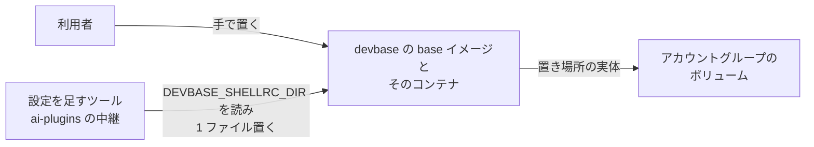
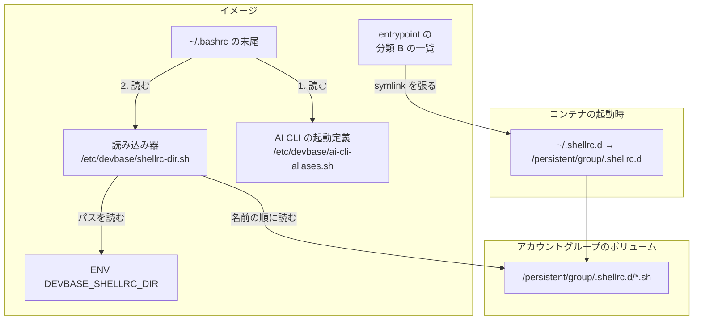
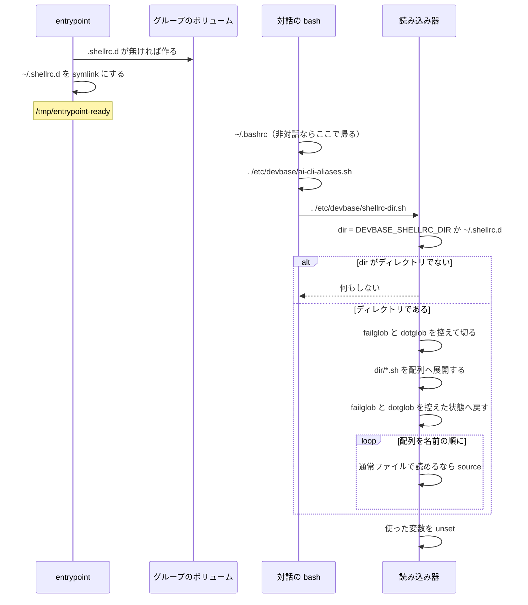

# PLAN70: コンテナを作り直しても残るシェルの設定の読み込み先 の設計

要求と受け入れ条件は [PLAN70_shellrc-dir.md](PLAN70_shellrc-dir.md) にある。
この文書は「どう作るか」だけを扱う。

## 機能一覧

| # | 機能 | 誰が使うか |
| --- | --- | --- |
| F1 | 置き場所 `~/.shellrc.d/` を、アカウントグループのボリュームへ張って作り直しでも残す | コンテナの利用者と、設定を足すツール（最初は ai-plugins の中継。ai-plugins#928） |
| F2 | 対話シェルの起動時に、置き場所の `*.sh` を名前の順に読む | 同上 |
| F3 | 置き場所のパスを、非対話の処理にも見える環境変数 `DEVBASE_SHELLRC_DIR` で示す | 置き場所へファイルを置くツール |
| F4 | 上の 3 つを回帰テストで固定し、利用者向け文書と CHANGELOG を合わせる | devbase の開発者・利用者 |

## 構成要素

| 要素 | 変更 | 責務 |
| --- | --- | --- |
| 永続化のエントリの一覧（`containers/base/entrypoint.sh` の `DEVBASE_GROUP_SETTINGS`） | 変える | 末尾へ `".shellrc.d"` を足す。既存の `devbase_link_setting` が、グループ側にディレクトリを作り、`~/.shellrc.d` をそこへの symlink にする。関数は変えない（決定 6・7） |
| 読み込み器（`containers/base/shellrc-dir.sh`、新設） | 足す | `/etc/devbase/shellrc-dir.sh` として置く。置き場所の `*.sh` を名前の順に読み、使った変数を消す。副作用はそれだけにする（決定 3・4） |
| 読み込み器の配置（`containers/base/Dockerfile` の `COPY` 群） | 変える | `ai-cli-aliases.sh` の `COPY` の次へ、`COPY --chmod=0644 shellrc-dir.sh /etc/devbase/shellrc-dir.sh` を足す。`/etc/devbase` は既存の `install -d -m 0755` が先に作る |
| `~/.bashrc` への 1 行（同じ Dockerfile の `RUN`） | 変える | `. /etc/devbase/ai-cli-aliases.sh` の行の**次**へ `. /etc/devbase/shellrc-dir.sh` を足す（決定 3） |
| 環境変数（同じ Dockerfile の `ENV`） | 足す | `ENV DEVBASE_SHELLRC_DIR=/home/${USERNAME}/.shellrc.d` を読み込み器の `COPY` の直前に置く（決定 2） |
| `tests/containers/test_shellrc_dir.py`（新設） | 足す | 読み込み器を一時ディレクトリで source し、読む順・対象・失敗の扱い・変数の後始末を固定する。Dockerfile の文字列で配置と順序を固定する |
| `tests/containers/test_entrypoint_ai_settings.py` | 変える | 分類 B の張り先の検査（`test_group_entries_point_at_the_group_volume`）の一覧へ `.shellrc.d` を足す。グループの分離の検査（`test_two_groups_share_assets_but_not_credentials`）へ、片方のグループの置き場所に置いたファイルがもう片方から見えないことを足す |
| `docs/user/container-operations.md` | 変える | 「ボリューム構造」の表の `devbase_home_{group}` の行の用途へ置き場所を足す。「AI 設定の永続化」の分類 B の表へ行を足す。新しい小節「作り直しても残るシェルの設定」を「AI CLI の起動定義」の後に立てる |
| `CHANGELOG.md` | 変える | `[Unreleased]` の `### Added` に 1 項目足す |

次のものは変えない。

- `entrypoint.sh` の関数（`devbase_link_setting` / `devbase_seed_group_settings` など）
- `/etc/devbase/ai-cli-aliases.sh` の中身
- `~/.zshrc`（決定 5）
- ホスト側（`lib/devbase/`）。生成する compose に環境変数を足さない（決定 2）
- 派生イメージの Dockerfile（base を継ぐ 7 つはすべて `FROM devbase-base:latest`）と
  `containers/lfm`（決定 8）

### 文脈



ai-plugins は devbase の外にあり、この変更では変えない。devbase が約束するのは置き場所と
環境変数の 2 つだけである（「入出力の契約」）。

### 構成要素と配置



図にはイメージとコンテナの中で動くものだけを描く。テスト・利用者向け文書・CHANGELOG は
描かない。

## 入出力の契約

devbase が外へ約束するのは次の 2 つである。ai-plugins#928 はこの名前を使う。

| 項目 | 約束 |
| --- | --- |
| 名前 | 環境変数 `DEVBASE_SHELLRC_DIR` と、その既定値の置き場所 `~/.shellrc.d/` |
| 値 | `/home/ubuntu/.shellrc.d`（絶対パス。イメージの `ENV` が決める） |
| 存在 | entrypoint が終わった後（`/tmp/entrypoint-ready` がある時点）、値のパスは開発ユーザーが書けるディレクトリで、実体はアカウントグループのボリュームにある |
| 読まれるもの | 置き場所の直下の、名前が `.sh` で終わる通常ファイルで、読めるもの。サブディレクトリの中・`.` で始まる名前・他の拡張子は読まない |
| 読む順 | グロブの展開順（ファイル名の昇順）。`ai-cli-aliases.sh` の**後**なので、同じ名前の alias は置き場所の定義が勝つ |
| 読まれる時点 | 対話の bash の起動時だけ（`devbase login` / tmux の窓 / VS Code の端末）。置いたファイルは次に開くシェルから効く。非対話の処理には読まれない |
| 失敗の形 | 1 つのファイルの誤りは、そのファイルの誤りとして標準エラーに出て、次のファイルへ進む。devbase は誤りを握りつぶさず、起動も止めない |
| 互換性 | 変数が無い（古いイメージ）ときは置き場所も無い。ツールは変数の有無で判定し、無ければ `~/.bashrc` を書き換えずに、イメージの建て直しを案内する。これは ai-plugins 側の扱いで、devbase は約束しない |

**置き場所へ置くファイルの作法**（利用者向け文書に書く）:

- 1 つのツール・1 つの用途につき 1 ファイルにし、`<名前>.sh` とする（例: `ndf-relay.sh`）。
  順序を指定したいときは `10-` のような数字の接頭辞を付ける
- 何度読まれても同じ結果になるように書く。`exit` を書かない（対話シェルが終わる）。
  標準出力へ何も出さない
- devbase は置き場所へ何も書かない。置いたものを消すのは置いた側である

## 処理の流れ



読み込み器の中身は次の形にする。**外部コマンドもサブシェルも起動しない**（非機能の条件）。

```bash
# 置き場所の *.sh を名前の順に読む。対話シェルの ~/.bashrc から読まれる。
__devbase_shellrc_dir="${DEVBASE_SHELLRC_DIR:-$HOME/.shellrc.d}"
if [ -d "$__devbase_shellrc_dir" ]; then
    __devbase_shellrc_opts=
    shopt -q failglob && __devbase_shellrc_opts="$__devbase_shellrc_opts failglob"
    shopt -q dotglob && __devbase_shellrc_opts="$__devbase_shellrc_opts dotglob"
    shopt -u failglob dotglob
    __devbase_shellrc_files=("$__devbase_shellrc_dir"/*.sh)
    if [ -n "$__devbase_shellrc_opts" ]; then
        # 名前ごとに分けて渡すため、引用符で囲まない
        shopt -s $__devbase_shellrc_opts
    fi
    for __devbase_shellrc_file in "${__devbase_shellrc_files[@]}"; do
        if [ -f "$__devbase_shellrc_file" ] && [ -r "$__devbase_shellrc_file" ]; then
            . "$__devbase_shellrc_file"
        fi
    done
fi
unset __devbase_shellrc_dir __devbase_shellrc_file __devbase_shellrc_files __devbase_shellrc_opts
```

- 一致が無いとき bash のグロブは文字列のまま残る。`-f` の判定で落ちるので、`nullglob` を
  切り替えずに済む。`nullglob` が有効なら繰り返しが 0 回になるだけで、結果は同じである
- グロブの展開の間だけ `failglob` と `dotglob` を切る。`failglob` が有効なまま一致が無いと、
  bash は `no match` を標準エラーへ出して展開した文を実行しない（受け入れ条件 6）。`dotglob` が
  有効だと `*.sh` が `.` で始まる名前にも一致する（受け入れ条件 5）
- 有効だった設定の名前を `shopt -q` で控え、展開の結果を配列へ移し、**読む前に** `shopt -s` で
  戻す。置き場所のファイルは利用者の設定のまま読まれ、ファイルの中で変えた設定は読み込みの
  後も残る（受け入れ条件 6a）。控えに `$(shopt -p ...)` と `eval` を使わないのは、サブシェルを
  作らないためである（非機能の条件）
- `if` で包むのは、最後のファイルが読めないときに `&&` の連なりが非 0 を残さないためである。
  末尾の `unset` で終了状態は 0 になる（受け入れ条件 6）
- 変数名を `__devbase_` で始めるのは、利用者の変数（`f` など）を上書きしないためである
  （受け入れ条件 9）。置き場所のファイルが同じ名前の変数を使う場合までは守らない

実測（2026-09-24、手元の `devbase-base:latest` の bash で上の形を source した）:

| 置いたもの | 結果 |
| --- | --- |
| `10-a.sh` と `20-b.sh` が同じ alias を定義 | `20-b.sh` の定義が残った |
| 構文の誤りを持つ `15-bad.sh` | 標準エラーに誤りを出し、次のファイルへ進んだ |
| `x.txt` | 読まれなかった |
| 置き場所が無い / 空 | 何も出さず、終了状態 0 |
| 空の置き場所を `shopt -s failglob` の下で読む | 何も出さず終了状態 0。読んだ後も `failglob` は `on`。控えて切る処理が無い形では `no match` を出し終了状態 1 だった |
| `.hidden.sh` を `shopt -s dotglob` の下で読む | 読まれなかった。読んだ後も `dotglob` は `on` |
| `failglob` が切れた状態で、`shopt -s failglob` を実行する `10-set.sh` と、状態を出す `20-show.sh` | `20-show.sh` は `on` を出し、読んだ後も `on` |

表のすべての行は、macOS の bash 3.2（`/bin/bash`）でも同じ結果だった。テストはホストの bash
でも走る。`PATH` を空にして空の置き場所を読んでも、両方の bash で何も出さず終了状態 0 だった。

## 非機能の実現方式

| 大項目 | 要求の条件 | 実現方式 | 確かめ方 |
| --- | --- | --- | --- |
| セキュリティ | 置き場所に書けるのは、同じアカウントグループのボリュームに書ける者だけである。既に `~/.claude`（hooks を含む）へ書ける者と同じ範囲で、新しい書き手を増やさない。devbase は置き場所へ何も書かない | 実体を `~/.claude` と同じ `/persistent/group` に置き、所有者は既存の `devbase_ensure_entry` と同じく開発ユーザーにする。イメージと entrypoint は置き場所へファイルを書かない | 受け入れ条件 1 の実機で所有者を見る。テストで、entrypoint の後の置き場所が空であることを見る |
| 性能・拡張性 | 置き場所が空のとき、対話シェルの起動にかかる追加の処理は、ディレクトリの有無の判定、グロブの設定 2 つ（`failglob` / `dotglob`）の控えと戻し、1 回のグロブで終わる（外部コマンドもサブシェルも起動しない） | 読み込み器をシェルの組み込み（`[`・`for`・`.`・`shopt`・`unset`）と代入だけで書く。コマンド置換（`$(...)`）とパイプを使わない | 読み込み器のテストで、`PATH` を空にして source しても誤りが出ないことを見る。読み込み器の文字列に `$(`・`` ` ``・`|` が無いことを見る |

## 決定の記録

### 決定 1: 置き場所の名前は `~/.shellrc.d` にする

特定のシェルの名前を含まず、後で zsh を入れたときも同じ置き場所を読ませられる。`.d` の
接尾辞は「中のファイルを全部読む」ディレクトリの慣例で、名前だけで使い方が伝わる。ホームの
直下に置くのは、分類 B の既存のエントリ（`.claude` / `.gemini`）と同じ並びにするためである。
ai-plugins#928 の設計もこの名前で進んでいる。

`~/.bashrc.d` は bash 専用に読め、zsh を足すときに名前が実態と食い違う。
`~/.config/devbase/shellrc.d` は `~/.config` が永続化されない場所で、symlink の親だけが
揮発する構成になり、見つけにくい。

### 決定 2: `DEVBASE_SHELLRC_DIR` はイメージの `ENV` で定める

置き場所のパスはイメージの開発ユーザーのホームで決まるので、イメージが定めるのが筋である。
`ENV` は `docker exec` の非対話の処理にも、派生イメージにも届く。名前は `DEVBASE_` で始め、
ディレクトリを指すので `_DIR` で終える。コンテナの中で読む既存の変数
（`DEVBASE_ACCOUNT_GROUP` / `DEVBASE_PRIMARY_DIR` / `DEVBASE_WORK_ROOT`）と同じ形である。

ホストが生成する compose で渡す形は採らない。古いイメージのコンテナへも、存在しない置き場所を
指す変数が渡ってしまう。entrypoint の `export` は PID 1 の子にしか効かず `docker exec` の
シェルに届かない（`entrypoint.sh` の PLAN39 の注記と同じ理由）。`~/.bashrc` の `export` は
非対話の処理から見えない。

### 決定 3: 読み込みはファイルにして、`~/.bashrc` からは 1 行で読む

ループを `~/.bashrc` へ直接書くと、Docker を起動しないテストで振る舞いを確かめられない。
`ai-cli-aliases.sh` と同じく（PLAN50）`/etc/devbase/` にファイルを置き、テストはそのファイルを
source する。読み込みの中身を直すときも `~/.bashrc` の行は変わらない。

#253 の提案の `for f in ...; unset f` は採らない。利用者が先に置いた `f` を消す。

### 決定 4: 読み込み器は `DEVBASE_SHELLRC_DIR` を読み、空なら `~/.shellrc.d` にする

ツールがファイルを置く先と、読み込み器が読む先を、同じ 1 つの値から決める。利用者が変数を
別の場所へ向ければ、置く側と読む側がそろってそちらへ移る。変数が空になる経路（`env -i` で
開いたシェルなど）でも、既定の置き場所は読まれる。

読み込み器がパスを固定で持つ形は採らない。変数と読む先が別々に決まり、食い違いうる。
なお、変数を既定から変えた先は永続化の対象ではない。文書にそう書く。

### 決定 5: zsh は対象にしない

base に zsh は入っておらず、`~/.zshrc` を読むシェルがいない（要求の前提 1）。devbase 自身の
起動定義も bash だけに効いている。確かめようのない行を `~/.zshrc` へ足すと、壊れていても
誰も気づかない。zsh を入れる変更のときに、起動定義と一緒に読み込みを足す。置き場所の名前は
そのとき変えずに済む（決定 1）。

### 決定 6: 置き場所は分類 B（アカウントグループ単位）に置く

最初の使い手である中継の本体は `~/.claude/ndf/`（分類 B）にある。置き場所を分類 A（全
コンテナ共通）にすると、中継の本体が無い別のグループのコンテナでも中継を読む 1 行が効き、
存在しないファイルを読みに行く。認証情報のように、alias の中身がグループの契約に紐づく
場合もある。

グループをまたいで効かせたい設定の置き場所は作らない。必要になったら分類 A の置き場所を
別の名前で足す。

### 決定 7: `default` グループの初回シードの試行は特別扱いしない

`DEVBASE_GROUP_SETTINGS` へ足すと、`devbase_seed_group_settings` が
`/persistent/ai/.shellrc.d` からのコピーを試みる。シード元が無いので `skip (シード元なし)` の
行を出す。この行が出るのはグループ側に
`.shellrc.d` がまだ無い最初の起動の 1 回だけで、次からはシードが何もしない。除外の一覧を
新しく持つほどの費用に見合わない。

### 決定 8: `containers/lfm` には入れない

lfm は base を継がず、base から `entrypoint.sh` をコピーするだけである。lfm のコンテナでも
`~/.shellrc.d` の symlink は張られるが、`~/.bashrc` と `ENV` は lfm 自身の Dockerfile が
持つので読まれない。lfm は起動定義も base と別に `~/.bashrc` へ直書きしており、base に
そろえる変更は別の課題になる（PLAN67 の決定 5 と同じ扱い）。

## テスト設計

| 受け入れ条件 | 何で確かめるか |
| --- | --- |
| 1. symlink と所有者 | 関数: `test_group_entries_point_at_the_group_volume` の一覧に `.shellrc.d`。実機: 建て直したイメージのコンテナで `readlink ~/.shellrc.d` と `stat -c %U` |
| 2. 作り直しで残る | 実機: `devbase down` → `devbase up` → `devbase login` で `plan70probe` |
| 3. 同じグループの別のコンテナ・別のグループ | 関数: `test_two_groups_share_assets_but_not_credentials` で、片方のグループの置き場所に置いたファイルがもう片方の置き場所から見えない。実機: `--index=2` の対話シェル |
| 4. 名前の昇順 | 読み込み器: `10-a.sh` と `20-b.sh` が同じ alias を定義し、`20-b.sh` の定義が残る |
| 5. `*.sh` 以外を読まない | 読み込み器: `x.txt` / `README` / `sub.sh/`（ディレクトリ）/ `.hidden.sh` が読まれない。`shopt -s dotglob` の下でも `.hidden.sh` が読まれない |
| 6. 無い・空・一致なし | 読み込み器: 3 通りで、標準出力と標準エラーが空、終了状態 0。`shopt -s failglob` の下で空の置き場所を読んでも同じ |
| 6a. 利用者の設定のまま読む | 読み込み器: `failglob` と `dotglob` を有効にして読み、読んだ後も両方 `on`。`failglob` が切れた状態で `shopt -s failglob` を実行するファイルを読み、後ろのファイルと読んだ後の両方で `on` |
| 7. 誤りの後も続く | 読み込み器: 構文の誤りを持つ `15-bad.sh` の後ろの `20-b.sh` が読まれる |
| 8. 起動定義より勝つ | 読み込み器: `ai-cli-aliases.sh` を source した後に読み込み器を source し、置き場所の `alias claude` が残る。Dockerfile: `. /etc/devbase/shellrc-dir.sh` の行が `. /etc/devbase/ai-cli-aliases.sh` の行より後 |
| 9. 変数を残さない | 読み込み器: source の前に `f=keep` を置き、後で `f` が `keep`、`__devbase_` で始まる変数が無い |
| 10. 変数と既定 | 読み込み器: 変数で指した場所を読む。変数が空のとき `$HOME/.shellrc.d` を読む |
| 11. 非対話で見える | Dockerfile: `ENV DEVBASE_SHELLRC_DIR=/home/${USERNAME}/.shellrc.d`。実機: `docker exec <container> printenv DEVBASE_SHELLRC_DIR` |
| 12. 起動定義が変わらない | 既存の `tests/containers/test_ai_cli_aliases.py` |
| 13. 既存のエントリとシード | 既存の `tests/containers/test_entrypoint_ai_settings.py` |
| 14. `~/.zshrc` が変わらない | Dockerfile: `.zshrc` へ書き込む行が無い。実機: 建て直した前後の `cat ~/.zshrc` |
| 15. 全体テスト | `uv run --locked pytest tests/ -q` |
| 16. 建つ | `devbase build base --no-cache`（arm64） |
| 17. 文書 | 目視（4 か所） |

読み込み器のテストは `bash --norc -i` ではなく `bash -c` で `shopt -s expand_aliases` を
付けて source する（`test_ai_cli_aliases.py` と同じ方式）。非機能の性能の条件は、`PATH=`
を空にして source し、`command not found` が出ないことで確かめる。

## 並行する変更との重なり

#234（tmux の名指し。別の設計で進行中）は `containers/base/` の tmux の部分と Dockerfile を
触る見込みである。この変更が Dockerfile で触るのは、`ai-cli-aliases.sh` の `COPY` と
`~/.bashrc` へ書く `RUN` である（2026-09-24 の main で 233〜244 行目）。その直後が tmux の
`COPY` 群（246 行目以降）である。**同じ行は触らないが、隣り合う。** 後からマージする側で
差分の位置がずれることがあるので、実装の持ち場は先にマージされた側の上へ載せ直してから
テストを通す。

## 未確認のまま残ること

| 項目 | 内容 |
| --- | --- |
| amd64 での建て直し | 手元は arm64 のみ。変更はシェルの断片と symlink の一覧・`ENV` で、アーキテクチャに依存しない |
| Claude Code の Bash からの見え方 | 環境変数（受け入れ条件 11）までを確かめる。Claude Code が対話シェルの設定を取り込むかは Claude Code 側の振る舞いで、範囲外 |
| 名前の連絡 | ai-plugins#928 へ決まった名前を知らせるのは実装の持ち場以降 |
