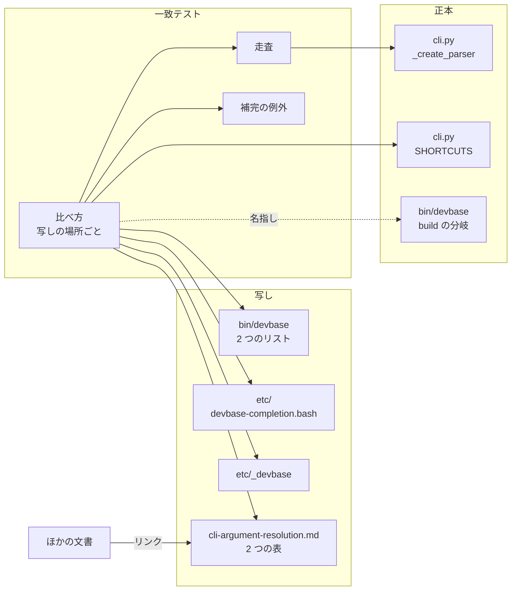
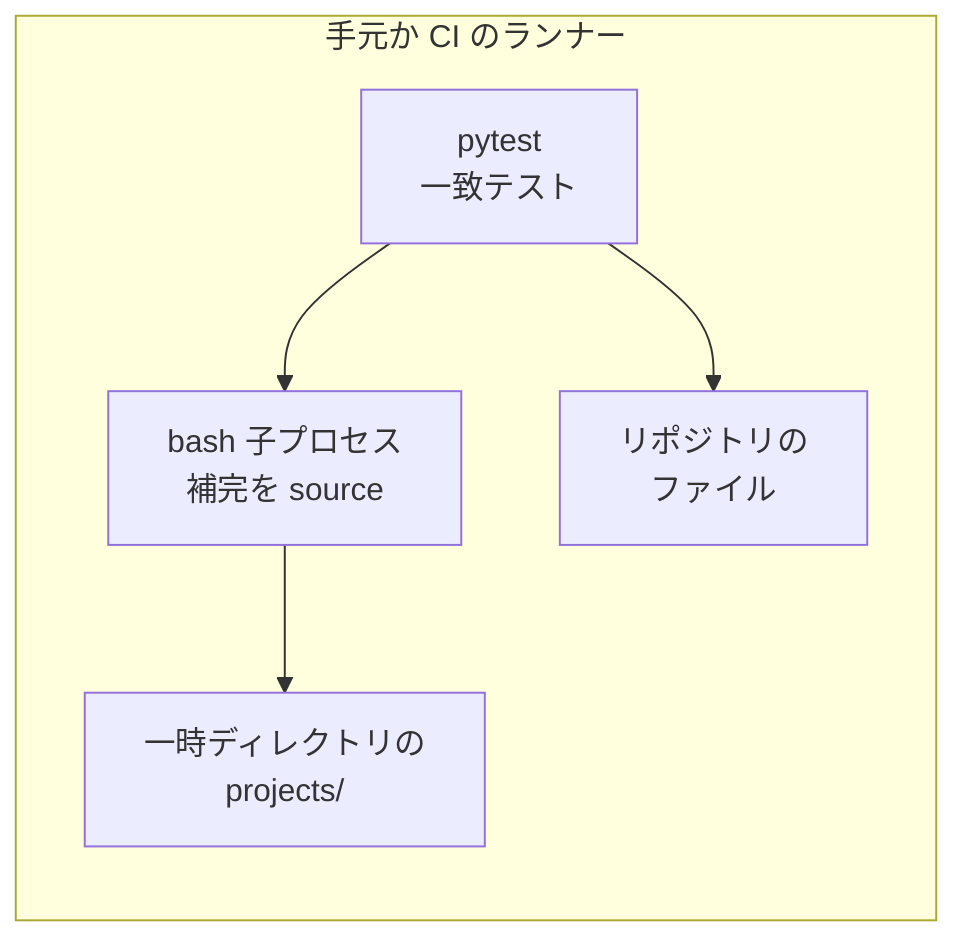
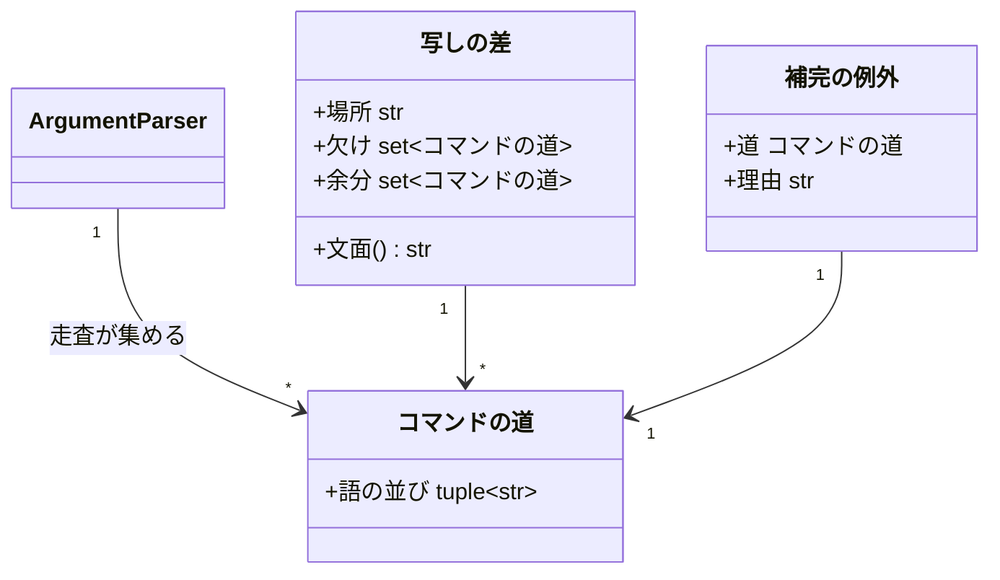
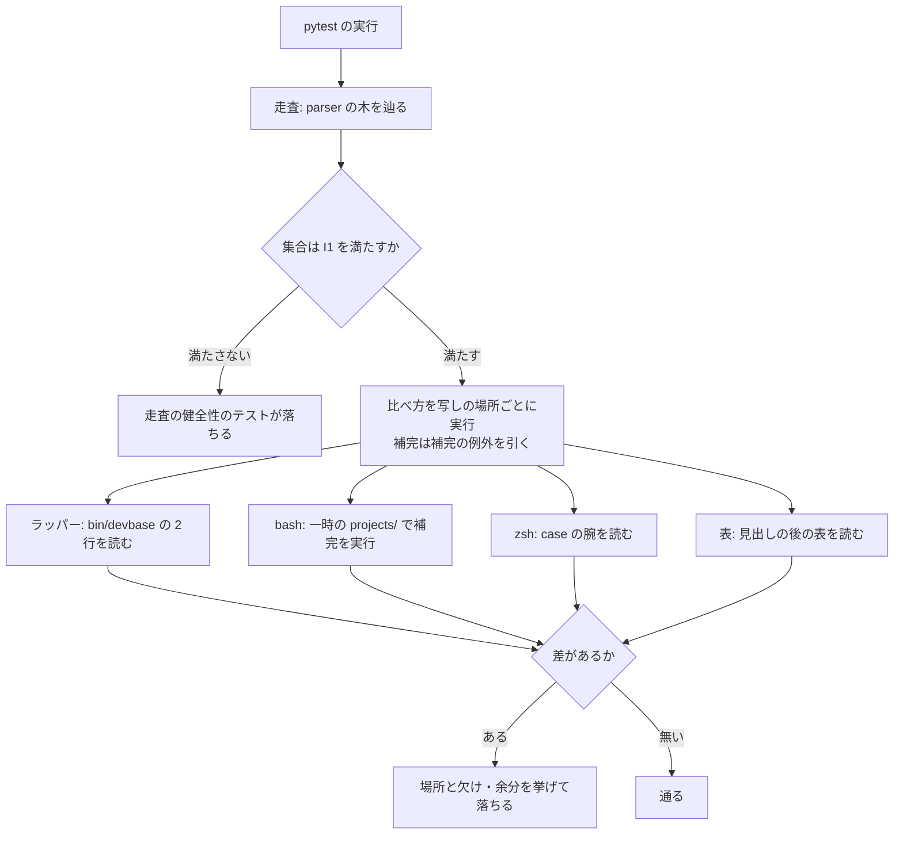

# サブコマンドを足すたびに文書の `[name]` / `--context` の列挙が取り残され、利用者が「そのコマンドは名前を取れない」と読む → 列挙の正本を argparse の 1 か所にし、写しが外れたら CI のテストが場所と名前を挙げて落ちる（#214）

## 目的

- **何が壊れているか**: `[name]` と `--context` を受け付けるサブコマンドの集合が、ラッパー・補完・文書 7 ファイルに手で写されている。一致を見るテストが無く、PLAN49・PLAN59・#371 の 3 回とも文書のどこかが取り残された（`remote-docker-context.md` は今も `post-start` を欠く）
- **誰が困るか**: 文書を読む利用者（名前を渡せるコマンドを渡せないと読んで遠回りする）と、サブコマンドを足す開発者（直す場所を覚えておくしかない）
- **直すと何が成り立つか**: 写しは argparse と比べられ、外れると CI で落ちる。文書は確定仕様の 1 組の表だけが列挙を持ち、ほかはそこへのリンクになる

## 適用範囲

- **働く範囲**: このリポジトリだけ（`tests/cli/` の一致テストと `docs/` の文書）。配布物の振る舞いは変えない
- **プロジェクトごとに違うもの**: 無し（プロジェクトの設定にも引数にも依らない）
- **当たるモード**: `standard`

## あるべき姿の根拠

| 根拠 | 種類 | 何を示すか |
| --- | --- | --- |
| 課題 #214 の本文「修正レイヤー」: 列挙の正本は argparse に置き、他の文書はリンクにする | 利用者の指示の原文 | 正本の置き場と、文書を列挙からリンクへ変える方向 |
| a120d15 で `_create_parser()` を走査した結果が、要求の前提 1 の表と一致した（下の「実測」） | 実測 | parser の木を辿るだけで、入れ子の `profile` と `env exec` / `env token` を含む集合が取れる |
| PLAN49・PLAN59・#371 の 3 回とも、コードと補完は直り文書が取り残された（課題 #214 の本文） | 実測 | テストで縛られていない写しだけが外れる。縛れば外れない |

要求と受け入れ条件は #214 の本文にある（コピーは `issues/issue-214-requirements.md`）。この文書は「どう作るか」だけを扱う。

実測（a120d15、`lib/` を import して parser の木を辿り、位置引数 `name` と `--context` を持つ parser の道を集めた）:

```text
[name]（plugin / pl / snapshot / ss / env を除く）:
  up down open ps rebuild scale
  project {down logs open post-start ps rebuild scale up}
  project profile {down list up}
[name]（除いたもの）:
  env backend use / plugin・pl {info uninstall update repo remove repo refresh} / snapshot・ss {copy delete restore}
--context:
  up down login open ps rebuild scale
  project {build down login logs open post-start ps rebuild scale up} / project profile {down list up}
  container・ct {build down login logs open ps rebuild scale up} / container・ct profile {down list up}
  env {exec token}
```

## ドメインモデル

### コンテキスト

| コンテキスト | 何の語が 1 つの意味に決まるか |
| --- | --- |
| コマンドの入口（`cli`） | サブコマンドが `[name]`（プロジェクト名）と `--context` を受け付けるかどうか。どの写しもこの語で集合を表す |

1 つのコンテキストに閉じる。`--context` の意味（どの daemon へ向けるか）は `docker-context` のコンテキストが持ち、この変更は「どのサブコマンドが受け付けるか」の集合だけを扱う。

### 集約

| 集約 | 持ち主（書き換えてよいもの） | 根 | エンティティ | 値オブジェクト |
| --- | --- | --- | --- | --- |
| 受け付けの集合 | `lib/devbase/cli.py` の `_create_parser()`（トップレベルの `build` の `--context` だけは `bin/devbase` の `build` の分岐） | parser の木 | サブコマンドの parser | コマンドの道（`("project", "profile", "up")` のような語の並び） |
| 写し | 写しのファイルごとの開発者（一致テストは読むだけで書かない） | 写しの場所（ファイルと、その中の箇所） | — | 写された集合 |

写しは 4 種ある。ラッパーの 2 つのリスト（`bin/devbase`）、bash の補完（`etc/devbase-completion.bash`）、zsh の補完（`etc/_devbase`）、確定仕様の 2 つの表（`docs/specifications/cli-argument-resolution.md`）。写しは受け付けの集合をコマンドの道で参照し、集合を書き換えない。

### 不変条件

| # | 集約 | 条件 | 破れたときの扱い |
| --- | --- | --- | --- |
| I1 | 受け付けの集合 | 走査で得る `[name]` の集合と `--context` の集合は空でなく、入れ子の `project profile up` と `env exec` を含み、`plugin info` / `snapshot restore` / `env backend use` を含まない | 一致テストが「走査が集合を取れていない」として落ちる（ほかの比べ方は結果を出す） |
| I2 | 写し | `_PROJECT_NAME_SUBCOMMANDS` は「`project` の直下で `[name]` を取る parser」の名前の集合に等しい | 一致テストが `bin/devbase` と欠け・余分を挙げて落ちる |
| I3 | 写し | `_NAME_RESOLVABLE_SHORTCUTS` は「`cli.SHORTCUTS` のキー ∪ {`build`}」に等しい | 同上 |
| I4 | 写し | bash の補完は、`[name]` の集合から補完の例外を引いたすべての道（今は `project` の直下 8 つとトップレベル 6 つ）の名前の位置で、`projects/` のプロジェクト名を候補に出す | 一致テストが `etc/devbase-completion.bash` と、名前を補完しない道を挙げて落ちる |
| I5 | 写し | zsh の補完は、I4 と同じ道の `case` の腕に `_devbase_project_names` を持つ。腕が無い道は読めなかったとして扱う | 一致テストが `etc/_devbase` と、腕に持たないサブコマンドを挙げて落ちる |
| I6 | 写し | `project` / `container` の直下で `[name]` か `--context` を取るサブコマンド（入れ子は親の名前で数える）は、bash と zsh の補完のサブコマンドの一覧にすべて含まれる | 一致テストが補完のファイルと、一覧に無いサブコマンドを挙げて落ちる |
| I7 | 写し | 補完の例外は 1 件ごとに理由を持ち、受け付けの集合に実在する道だけを指す | 一致テストが、集合に無い道を指す例外を挙げて落ちる |
| I8 | 写し | 確定仕様の `[name]` の表は `[name]` の集合に、`--context` の表は `--context` の集合 ∪ {トップレベルの `build`} に等しい | 一致テストが `cli-argument-resolution.md` と欠け・余分を挙げて落ちる |
| I9 | 写し | `docs/` の下で、`cli-argument-resolution.md` の 2 つの表の外に列挙（要求の前提 7 の意味）が無い | 機械では検出しない。設計 PR・実装 PR のレビューと、検証の検索（要求の「検証手段」）で見る |

### ドメインイベント

| # | イベント | 発生元 | 受け手 |
| --- | --- | --- | --- |
| E1 | 開発者が argparse のサブコマンド・`name` の位置引数・`--context` を足した（外した） | 開発者 | 一致テスト（次の実行で走査する） |
| E2 | 一致テストが `_create_parser()` を走査して 2 つの集合を得た | 一致テストの走査 | ラッパー・補完・表の比べ方 |
| E3 | 一致テストがラッパーの 2 つのリストを読んで比べた | ラッパーの比べ方 | 失敗の出力（E6） |
| E4 | 一致テストが bash の補完を実行し、zsh の補完を読んで比べた | 補完の比べ方 | 失敗の出力（E6） |
| E5 | 一致テストが確定仕様の 2 つの表を読んで比べた | 表の比べ方 | 失敗の出力（E6） |
| E6 | 一致テストが、写しの場所ごとに欠け・余分を挙げて落ちた | E3〜E5 の比べ方 | 開発者 |
| E7 | 開発者が写しを直し、一致テストが通った | 開発者 | CI |

### 用語

| 用語 | 意味 | 用語集への反映 |
| --- | --- | --- |
| 列挙の正本 | `[name]` と `--context` を受け付けるサブコマンドの集合を決める唯一の場所。argparse の `_create_parser()`（トップレベルの `build` の `--context` だけはラッパー） | 無し（要求で追加済み） |
| 一致テスト | 列挙の正本を走査して得た集合と写しを比べ、差があれば写しの場所と差を挙げて落ちるテスト | 無し（要求で追加済み） |
| 写し | 列挙の正本から手で写した集合（ラッパーの 2 つのリスト・bash と zsh の補完・確定仕様の 2 つの表） | 追加（`cli`） |
| 補完の例外 | 列挙の正本では `[name]` を取るが、補完がプロジェクト名を出さないと決めたコマンドの道と理由の組。一致テストが一覧として持つ | 追加（`cli`） |

## 機能一覧

| # | 機能 | 誰が使うか |
| --- | --- | --- |
| F1 | サブコマンドを足し引きしたとき、取り残した写しの場所とサブコマンドの名前を CI と手元のテストが挙げる | サブコマンドを足す開発者 |
| F2 | `[name]` と `--context` を受け付けるサブコマンドを、確定仕様の 1 組の表で引ける | 文書を読む利用者・開発者 |
| F3 | ほかの文書から、列挙の代わりにリンクで表へ辿れる | 文書を読む利用者 |

## 構成要素

| 要素 | 責務 |
| --- | --- |
| 一致テスト `tests/cli/test_name_context_consistency.py`（新設） | `_create_parser()` を走査して 2 つの集合を得て、写しの 4 種と比べる。写しの場所ごとに別のテストにし、差を場所と名前で出す |
| 走査（一致テストの中の関数） | parser の木を辿り、位置引数 `name` を持つ道と `--context` を持つ道を集める。`[name]` は除外のグループを外す。`--context` は名指しの追加（トップレベルの `build`）を足す |
| 補完の例外の一覧（一致テストの中の定数） | `project profile up` / `down` / `list` の 3 つと理由。補完の比べ方だけが使う |
| 確定仕様の表 `docs/specifications/cli-argument-resolution.md`（変更） | `## 仕様` に「プロジェクト名を受け付けるサブコマンド」と「docker context を受け付けるサブコマンド」の 2 節と表を足す。概要の表と「運用」の箇条を表と一致テストを指す形に直す |
| ほかの文書（変更） | 列挙を表へのリンクに置き換える（下の「文書の置き換え」） |
| `bin/devbase` / `lib/devbase/cli.py` のコメント（変更） | 「同期注意」を一致テストのファイルを指す形に直す。リストの値と parser の定義は変えない |
| `tests/cli/test_rebuild.py`（変更） | `test_wrapper_rebuild_in_name_resolvable` を消す（決定 7） |

構成要素図（読む向きの関係だけを描く。一致テストはどれも書き換えない）:



システムの文脈と配置: 一致テストは pytest の 1 ファイルとして、手元（macOS）と CI（ubuntu-latest）で動く。外へ出るのは bash の子プロセス（補完の実行）だけで、docker・実の `DEVBASE_ROOT`・ネットワークに触らない。



### パッケージ・モジュール構成

```text
tests/cli/
├── test_name_context_consistency.py   # 新設: 一致テスト
├── test_completion.py                 # 変更なし（_bash_complete の形を参考にする）
└── test_rebuild.py                    # 変更: test_wrapper_rebuild_in_name_resolvable を消す
docs/specifications/cli-argument-resolution.md   # 2 節と表を足す・概要と運用を直す
docs/specifications/remote-docker-context.md     # 列挙をリンクへ
docs/specifications/compose-profiles.md          # 列挙と写しをリンクへ
docs/user/cli-reference/02-project.md            # 列挙と写しをリンクへ
docs/user/container-operations.md                # 列挙をリンクへ
docs/user/environment-variables.md               # 列挙をリンクへ
bin/devbase                                      # コメントだけ
lib/devbase/cli.py                               # コメントだけ
```

### 確定仕様の表の形

一致テストが読む約束である。2 つの節は `## 仕様` の下に並べ、見出しの文字列で探す。

| 項目 | 形 |
| --- | --- |
| 見出し | `### プロジェクト名を受け付けるサブコマンド` と `### docker context を受け付けるサブコマンド`（リンクの錨は `#プロジェクト名を受け付けるサブコマンド` と `#docker-context-を受け付けるサブコマンド`） |
| 読む表 | 見出しの後で最初に現れる表。次の見出しまでに表が無ければ読めなかったとして落ちる |
| 1 列目 | 入口の形をバッククォートで書く（`devbase project <sub>`・`devbase project profile <sub>`・`devbase <sub>`）。別名は同じセルに並べる（`devbase container <sub>` / `devbase ct <sub>`）。`devbase` と `<sub>` の間の語の並びが道の頭になる |
| 2 列目 | 受け付けるサブコマンドをバッククォートで 1 つずつ書く。道は「1 列目の頭 + この語」 |
| 3 列目以降 | 読み手への注記（ラッパーが受け付けるトップレベルの `build` など）。一致テストは読まない |
| 受け付けるものが無い入口 | 行を置かない（`[name]` の表の `container` の行）。集合の全体を比べるため、行を置いても置かなくても差は出る |

`[name]` の表は 3 行（`project`・`project profile`・トップレベル）、`--context` の表は 6 行（`project`・`project profile`・`container` / `ct`・`container profile` / `ct profile`・トップレベル・`env`）になる。トップレベルの `build` は `--context` の表のトップレベルの行の 2 列目に置き、3 列目に「ラッパーの `cmd_build` が受け付ける（argparse に parser が無い）」と書く。

### 文書の置き換え

置き換える列挙（要求の AC11）と、置き換えた後の形。リンク先はどれも上の 2 つの錨のどちらかである。

| 文書と箇所 | 置き換えた後 |
| --- | --- |
| `remote-docker-context.md` の「context の解決」の 2 段落目 | 受け付けるサブコマンドは `cli-argument-resolution.md` の docker context の表にある、の一文。空文字を終了コード 2 で拒む文は残す |
| `environment-variables.md` の `DEVBASE_DOCKER_CONTEXT` の行 | 「`--context` を受け付けるコマンド（表へのリンク）が向ける docker context」 |
| `02-project.md` の「プロジェクト名指定」の冒頭の文 | 「`[name]` を取るサブコマンドは表（リンク）にあります」。例のコードブロックは残す |
| `02-project.md` の `profile` の注記の `_PROJECT_NAME_SUBCOMMANDS` の括弧書き | 括弧の列挙を消す。`profile` が入らない理由の文は残す |
| `02-project.md` の「`--context NAME`（共通オプション）」の冒頭の文 | 「受け付けるサブコマンドは表（リンク）にあります」 |
| `container-operations.md` の冒頭の注記 | `[name]` の列挙を表へのリンクに置き換え、`profile` の解決の違いの文はリンクと 1 文で済ませる |
| `compose-profiles.md` の「どれも `--context NAME` を受け付ける」 | 表へのリンク。`remote-docker-context.md` へのリンクは残す |
| `compose-profiles.md` の `_PROJECT_NAME_SUBCOMMANDS` の括弧書き | 括弧の列挙を消し、`profile` を入れない理由は残す |
| `cli-argument-resolution.md` の概要の表の「解決するもの」の 2 セル | ショートカットの行は「[name] の表のトップレベルの行に `login` と `build` を足したもの」、`project` の行は「[name] の表の `project` の行」とし、それぞれリンクにする（決定 6） |

使い方の行（`devbase project up [name] [--context NAME]`）・ショートカットの対応表・`cli-reference/README.md` の地図と一覧は、要求の前提 7 のとおり残す。`post-start.md` と `editor-open.md` の構成要素の表が `_PROJECT_NAME_SUBCOMMANDS` の名前を挙げる箇所は、集合を写していないため残す。

## 構造

一致テストが内部で使う型だけを描く。parser の木（`argparse.ArgumentParser`）は既存の型として名前だけを置く。



- コマンドの道は語の並びのタプルで足りる。型を新しく作るかは実装で決める
- 写しの差は比べ方が 1 つの写しについて作り、欠けも余分も空でなければテストを落とす。文面は「場所: 欠けている <道…> / 余分な <道…>」の形で、場所にはファイルのパスと箇所（`_PROJECT_NAME_SUBCOMMANDS`・`[name]` の表など）を入れる
- 補完の例外は道ごとに理由の文字列を持つ。理由の無い例外は書けない形にする（辞書の値を理由にする）

## 処理の流れ



図はテストの実行時に動くものだけを描く。ほかの文書・コメント・`test_rebuild.py` の変更は実行時に動かないため図に現れない。

比べ方は互いの順序を仮定しない。走査はモジュールの読み込みか fixture で 1 回だけ行い、比べ方の各テストが共有する。走査の健全性（I1）が落ちても、比べ方の各テストは結果を出す（空の集合と比べて差を出す）。

写しを読めないとき（リストの行が無い・見出しが無い・`case` の腕が無い・bash が終了コード 0 以外を返した）は、差ではなく「読めなかった」として、場所と読もうとしたものを挙げて落ちる。

## 非機能の実現方式

| 大項目 | 条件 | 実現方式 |
| --- | --- | --- |
| 性能・拡張性 | `tests/cli` の実行時間が 10 秒を超えて延びない | bash の子プロセスは、名前の位置の確かめ（`project` 直下 8・トップレベル 6）とサブコマンドの一覧（2）で 16 回。1 回は数十ミリ秒で、合わせて 1 秒に届かない。走査は 1 回だけ行い共有する |
| 運用・保守性 | 失敗の出力だけで直す場所と名前が分かる | 写しの場所ごとに別のテストにし（決定 1）、写しの差の文面にファイル・箇所・道を入れる |
| システム環境 | CI と macOS で通り、zsh が無くても落ちない | zsh は起動せず、ファイルの `case` の腕を読む。bash の補完は既存の `test_completion.py` と同じく bash 3.2 でも動く形で source する。一時ディレクトリの `projects/` を `DEVBASE_ROOT` に渡し、実の `DEVBASE_ROOT` を継がない |

## 決定の記録

### 決定 1: 取り残した写しを 1 回の実行で全部挙げるため、写しの場所ごとに別のテストにする

1 つのテストで全部の写しを順に `assert` すると、最初の差で止まり、2 つ目以降の取り残しが直した後の実行まで見えない。場所ごとのテスト（`pytest.mark.parametrize` でも関数を分けてもよい）にすれば、サブコマンドを 1 つ足したときに取り残した写しがすべて一度に並ぶ（AC5）。

差をまとめて 1 つの失敗の文面にする形も採らない。どの写しが落ちたかが pytest のテスト名から読めなくなる。

根拠: Value 1（MVV 版 1）

### 決定 2: 写しを 5 か所目に増やさないため、期待の集合をテストに書き写さず走査で得る

一致テストが要求の前提 1 の表を定数として持つと、それ自体が新しい写しになり、サブコマンドを足すたびにテストも直す場所に加わる。走査で得た集合を正とし、走査が壊れていないことは I1 の名指しの確かめ（空でない・入れ子の `profile` と `env exec` を含む・`plugin` などの `name` を含まない）だけで見る。前提 1 の表との一致（AC1・AC2）は、確定仕様の表との一致（I8）を通して成り立つ。表は人が書く写しで、テストが走査と比べるためである。

前提 1 の表をテストの定数にする形は、走査の誤りを直接捕まえられるが、上の理由で採らない。

根拠: Value 1（MVV 版 1）

### 決定 3: 新しいグループの `name` が黙って集合から外れないよう、`[name]` の集合は除外のグループで絞る

`[name]` の集合は、parser の木で位置引数 `name` を持つ道から、頭が `plugin` / `pl` / `snapshot` / `ss` / `env` の道を除いて作る。除外の一覧は理由（プラグイン・スナップショット・backend の名前）と並べて持つ。将来 `name` を持つグループが増えると集合に入り、表と比べて差が出るため、開発者が含めるか除くかを決める契機になる。

含める側の一覧（`project` とトップレベルだけを見る）は、`name` を持つ新しいグループが比べる対象から黙って外れるため採らない。

根拠: Value 1（MVV 版 1）

### 決定 4: 確定仕様の表を人のリンク先と機械の読み口に兼ねるため、`## 仕様` に 2 節を足して見出しの文字列で探す

`[name]` の表と `--context` の表は別の見出しの節に置き、隣り合わせる。見出しがリンクの錨にもなり、ほかの文書からどちらの表へも直接辿れる（AC12）。一致テストは見出しの文字列で節を探し、その後で最初の表を読む。

表の手前に HTML コメントの印を置いて探す形は、読み手に見えない印を誰かが消しても気づきにくく、見出しと印の 2 つを保つことになるため採らない。既存の概要の表に列を足す形は、概要の表がラッパーの name 解決（`login` / `build` を含む）を表しており argparse の集合と食い違うため採らない。

根拠: 根拠なし（MVV 版 1）

### 決定 5: 読み手が集合を見渡せるよう、表は 1 行に 1 つの入口を置きサブコマンドを並べる

1 列目に入口の形（`devbase project <sub>` など）、2 列目に受け付けるサブコマンドを並べる。`--context` の表は 6 行で収まり、入口ごとの違い（`container` に `post-start` が無いなど）が並べて読める。別名（`container` / `ct`）は同じセルに並べ、一致テストは両方の道へ展開する。

1 行に 1 つのコマンドの道を置く形は機械には読みやすいが、`--context` の表が 40 行を超え、入口ごとの違いが読めなくなるため採らない。

根拠: 根拠なし（MVV 版 1）

### 決定 6: 確定仕様の中にテストで縛らない列挙を残さないため、概要の表の「解決するもの」をリンクと規則に置き換える

概要の表の 2 つのセルは、ラッパーの 2 つのリストを写している。一致テストはラッパーのリストを規則（要求の前提 4）で縛るため、概要の表は「`[name]` の表のトップレベルの行に `login` と `build` を足したもの」のように、表へのリンクと規則で書けば写しを持たずに済む。

概要の表も一致テストで読む形は、比べる写しが 1 つ増え、表の形の約束も 2 つになるため採らない。

根拠: 根拠なし（MVV 版 1）

### 決定 7: 同じことを 2 か所で縛らないため、`test_wrapper_rebuild_in_name_resolvable` を消す

このテストは `rebuild` が `bin/devbase` の 2 つのリストにあることだけを見る。一致テストは 2 つのリストが argparse と `SHORTCUTS` から導いた集合に等しいことを見ており、`rebuild` を含むことはその一部である。残すと、`rebuild` を外すときに 2 つのテストを直すことになる。

同じファイルの `build)` の分岐を見るテストは、一致テストが見ない振る舞い（`cmd_build` への委譲）を縛るため残す。

根拠: 根拠なし（MVV 版 1）

### 決定 8: 振る舞いの確かめを既存のテストに任せるため、トップレベルの `build` の `--context` は名指しの一覧で足す

argparse にトップレベルの `build` の parser は無く、`--context` はラッパーの `build` の分岐が抜き取る。一致テストは `--context` の集合にトップレベルの `build` を名指しで足し、足す理由を一覧に添える。受け付けること自体は既存の `tests/cli/test_wrapper_build_context.py` がラッパーを実行して確かめている。

`bin/devbase` の `build` の分岐を文字列で探して `--context` の有無を見る形は、コメントや使い方の文に `--context` があるだけで通り、走査とは別の確かめ方になるため採らない。

根拠: 根拠なし（MVV 版 1）

### 決定 9: 別の分岐の記述で通ってしまわないよう、zsh の補完は `case` の腕ごとに読む

`etc/_devbase` の全体で `_devbase_project_names` を探すと、ほかのサブコマンドの腕にあるだけで通る。一致テストは、トップレベルの `case "$words[2]"` の腕と、`project)` の腕の中の `case "$words[3]"` の腕を、パターン（`up|down|rebuild)` のような `|` 区切り）と本体（次の `;;` まで）の組として読み、サブコマンドの腕の本体に `_devbase_project_names` があるかを見る。

zsh を起動して補完を実行する形は、要求の前提 8 のとおり CI のランナーに zsh があることを前提にするため採らない。

根拠: 根拠なし（MVV 版 1）

### 決定 10: 例外が黙って広がらないよう、補完の例外は理由を持ち、実在する道だけを指す

補完の例外は `project profile up` / `down` / `list` の 3 つで、理由は「1 つ目の位置引数が値の数でプロファイル名にもプロジェクト名にもなり、補完の時点では決まらない」。一致テストは例外の道が `[name]` の集合に実在することも確かめる。`profile` の `[name]` が消えたのに例外が残ると、次に別の理由で同じ道を外したいときに古い理由のまま通るためである。

例外を持たず、補完の比べ方の対象を `project` の直下とトップレベルに限る形は、例外の理由がテストから読めず、どれを外したかが走査の条件に埋もれるため採らない。

根拠: 根拠なし（MVV 版 1）

## テスト設計

| 受け入れ条件・不変条件 | どの振る舞いで縛るか | どう壊したら落ちるべきか |
| --- | --- | --- |
| AC1・I1 | 走査の `[name]` の集合が空でなく、`project profile up` を含み、`plugin info`・`snapshot restore`・`env backend use` を含まない。前提 1 の表との一致は AC10 の表を通して成り立つ | 走査が入れ子の parser を辿らないようにすると落ちる。除外のグループから `plugin` を外すと落ちる |
| AC2・I1 | 走査の `--context` の集合が空でなく、`env exec` と `project profile list` を含み、名指しの追加でトップレベルの `build` を含む | 走査を `project` / `container` の配下だけにすると落ちる。名指しの追加を消すと AC10 の `--context` の表との比べ方で落ちる |
| AC3・I2 | `bin/devbase` の `_PROJECT_NAME_SUBCOMMANDS` が「`project` の直下で `[name]` を取る parser」の名前の集合に等しい | 作業用の写しで `post-start` を消すと落ち、`login` を足しても落ちる。出力に `bin/devbase` と道が出る |
| AC4・I3 | `_NAME_RESOLVABLE_SHORTCUTS` が `cli.SHORTCUTS` のキー ∪ {`build`} に等しい | `open` を消すと落ち、`logs` を足しても落ちる |
| AC5 | `project` の直下に `[name]` を取るサブコマンドを足した parser では、ラッパー・bash・zsh・表の比べ方がそれぞれ落ち、出力に足した名前とファイルが出る | 作業用の写しで `cli.py` に `[name]` 付きのサブコマンドを 1 つ足し、写しを直さずに実行して 4 つ以上の失敗が並ぶことを確かめる（記録は PR 本文） |
| AC6・I4 | 一時の `projects/` に置いたプロジェクト名が、`project` の直下 8 つとトップレベル 6 つの名前の位置で bash の候補に出る | `etc/devbase-completion.bash` の 1 つの腕（例: トップレベルの `scale`）からプロジェクト名の補完を外すと落ちる |
| AC7・I5 | `etc/_devbase` で、同じサブコマンドの `case` の腕の本体が `_devbase_project_names` を持つ | 1 つの腕（例: `project` の `logs`）から外すと落ちる。別の腕にだけ残っていても落ちる |
| AC8・I6 | `project` / `container` の直下で `[name]` か `--context` を取るサブコマンドが、bash の補完が出すサブコマンドの一覧と zsh の `project_subcommands` / `container_subcommands` に含まれる | どちらかの一覧から `post-start`（`project`）か `open`（`container`）を消すと落ちる。`migrate-config` が無いことでは落ちない |
| AC9・I7 | 補完の例外の各道が空でない理由を持ち、`[name]` の集合に実在する。補完の比べ方は `[name]` の集合から例外を引いたすべての道を見るため、例外に無い道を補完が欠くと AC6・AC7 の比べ方で落ちる | 例外に集合に無い道（`project profile stop`）を足すと落ちる。理由を空にすると落ちる。例外から `project profile up` を外すと、補完がその位置でプロジェクト名を出さないため AC6・AC7 の比べ方で落ちる |
| AC10・I8 | 確定仕様の 2 つの表を読んだ集合が、`[name]` の集合と `--context` の集合（トップレベルの `build` を含む）に等しい | 表から 1 つ消すと落ち、余分に足しても落ちる。見出しを変えると「読めなかった」で落ちる |
| AC11・I9 | テストを書かない。検証で `docs/` を `post-start`・`rebuild`・`open`・`--context` で検索し、2 つの表の外に列挙が無いことを確かめる | — |
| AC12 | テストを書かない。置き換えたリンクの錨が、表の見出しから作られる錨と一致することを検証で確かめる | — |
| AC13 | テストを書かない。`bin/devbase`・`cli.py` の「同期注意」と「運用」の箇条が一致テストのファイル名を含むことを差分のレビューで見る | — |
| AC14 | 全体の pytest が通る。`git diff main -- lib/devbase/cli.py bin/devbase etc/` の差がコメントの行だけである | — |
| AC15 | 一致テストは補完に一時ディレクトリを `DEVBASE_ROOT` として渡し、docker を呼ぶ関数を import 以外で呼ばない | 既存の `tests/cli/conftest.py` の隔離のもとで動く。実の `DEVBASE_ROOT` を渡すように壊すと、一時の `projects/` の名前が候補に出ず落ちる |

補完の例外を足すことは、一致テストのファイルの差分として現れ、レビューで人が見る。一致テストは例外の一覧を別の写しと比べない（一覧そのものが、補完がプロジェクト名を出さないと決めた記録であるため）。

## 設計の結果

| 課題 | 扱い | 取り込み先 | 触るファイル |
| --- | --- | --- | --- |
| #214 | 実装する | — | `tests/cli/test_name_context_consistency.py`、`tests/cli/test_rebuild.py`、`docs/specifications/cli-argument-resolution.md`、`docs/specifications/remote-docker-context.md`、`docs/specifications/compose-profiles.md`、`docs/user/cli-reference/02-project.md`、`docs/user/container-operations.md`、`docs/user/environment-variables.md`、`bin/devbase`、`lib/devbase/cli.py` |

## 未確認のまま残ること

| 項目 | 内容 |
| --- | --- |
| zsh の `case` の腕の読み取りの頑健さ | 腕の本体が `;;` を含む入れ子の `case` を持つ形（`plugin` の `repo`）は、`project` とトップレベルの腕には今は無い。読み取りが入れ子に対応するかは実装（`tdd-cycle`）で走らせて決める。対応しない場合も、読めなかったときは落ちる |
| 日本語の見出しの錨 | GitHub が `### docker context を受け付けるサブコマンド` から作る錨を `#docker-context-を受け付けるサブコマンド` と見込んでいる。実装の PR の表示で辿れることを確かめる（AC12） |
| 補完の `--context` の範囲 | 要求の「未決」のとおり、`open` / `post-start` 以外で `--context` を補完するかは課題の棚卸しで決める。一致テストは今の範囲を縛らない |
