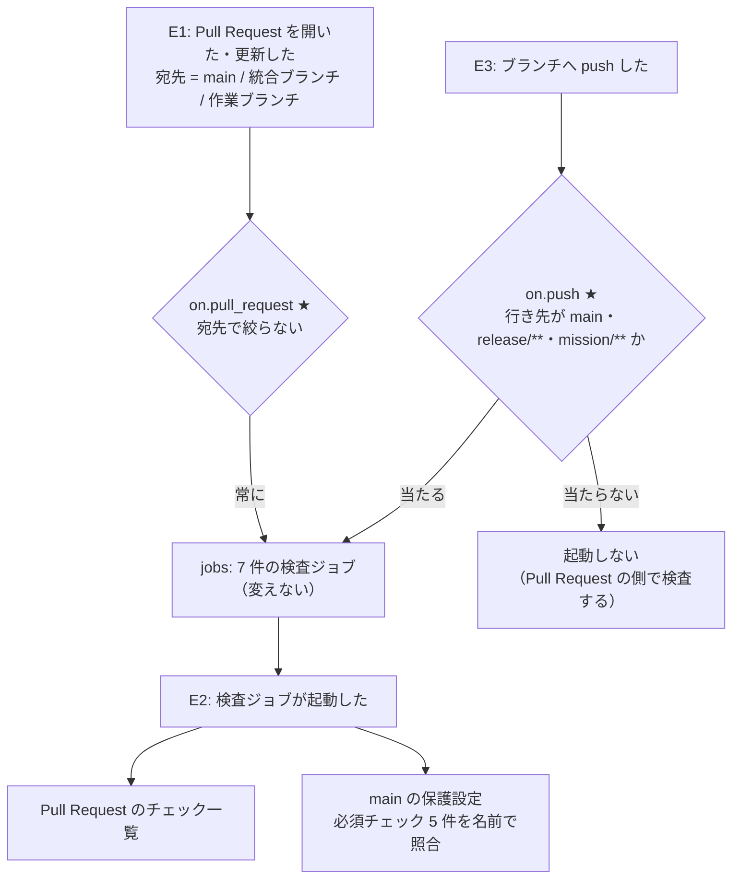

# #216: どの宛先の Pull Request でも検査ジョブを走らせる の設計

要求と受け入れ条件は #216 の本文にある（写しは [issue-216-requirements.md](issue-216-requirements.md)）。
この文書は「どう作るか」だけを扱う。

## ドメインモデル

### コンテキスト

| コンテキスト | 何の語が 1 つの意味に決まるか |
| --- | --- |
| 継続的インテグレーション（`ci`） | `ci.yml` の検査ジョブと、それを起動するトリガー |

外部の系として GitHub の保護設定（`main` の必須チェック）と接する。関係は**順応者**である。
保護設定は検査ジョブを `name` と matrix の値から作られるチェックの名前で照合する。この照合の
規則は GitHub が決め、こちらからは変えられない。そのため `ci.yml` の側が名前を保つ。

### 集約

| 集約 | 持ち主（書き換えてよいもの） | 根 | エンティティ | 値オブジェクト |
| --- | --- | --- | --- | --- |
| CI のワークフロー | `.github/workflows/ci.yml`。この変更で書き換えるのは `on:` の節だけ | ワークフロー（`name: CI`） | 検査ジョブ（`name` で識別する） | トリガー（イベントと、宛先・行き先のブランチの絞り込み） |

### 不変条件

| # | 集約 | 条件 | 破れたときの扱い |
| --- | --- | --- | --- |
| I1 | CI のワークフロー | `pull_request` のトリガーは宛先のブランチで絞らない（`branches` / `branches-ignore` を持たない） | 回帰テストが落ちる |
| I2 | CI のワークフロー | `push` のトリガーの `branches` は、`main`・`release/**`・`mission/**` の 3 つとちょうど一致する | 回帰テストが落ちる |
| I3 | CI のワークフロー | 検査ジョブが作るチェックの名前は次の 7 件である: `Python syntax check (3.10)` / `(3.11)` / `(3.12)`・`Ruff lint`・`ShellCheck`・`Pytest (Python 3.10)`・`Pytest (Python 3.13)` | 回帰テストが落ちる。`main` 宛ての Pull Request で必須チェックが「待ち」のまま残る |

### ドメインイベント

| # | イベント | 発生元 | 受け手 |
| --- | --- | --- | --- |
| E1 | Pull Request を開いた（または push で更新した） | 開発者・エージェント（GitHub が `pull_request` を発行する） | `pull_request` のトリガー |
| E2 | 検査ジョブが起動した | `pull_request` / `push` のトリガー | Pull Request の画面のチェック一覧と、`main` の保護設定の照合 |
| E3 | 統合ブランチへ Pull Request を取り込んだ（push が起きた） | マージ（GitHub が `push` を発行する） | `push` のトリガー |

### 用語

| 用語 | 意味 | 用語集への反映 |
| --- | --- | --- |
| 検査ジョブ | `ci.yml` の jobs の 1 つ（Python syntax check・Ruff lint・ShellCheck・Pytest） | 要求で追加済み（`ci`） |
| 統合ブランチ | 課題の Pull Request の宛先になる `main` 以外のブランチ（`release/**` と `mission/**`） | 要求で追加済み（`ci`） |
| トリガー | `ci.yml` の `on:` に書く 1 つのイベント（`pull_request` / `push`）と、その絞り込み（`branches`） | 追加（`ci`） |
| 積み重ねた Pull Request | 宛先が `main` でも統合ブランチでもない、別の作業ブランチの Pull Request | 追加（`ci`） |

## 機能一覧

| # | 機能 | 誰が使うか |
| --- | --- | --- |
| F1 | どの宛先の Pull Request でも、7 件の検査ジョブが走る | Pull Request を出す開発者・エージェント。CI の結果で収束を判定するレビュー（`/ndf:cross-review` の `CI_VERDICT`） |
| F2 | `main` と統合ブランチへ取り込んだ後の先端を、同じ 7 件で検査する | 統合ブランチを `main` へ出す人 |
| F3 | トリガーの形と検査ジョブの名前を回帰テストで固定する | `ci.yml` を直す devbase の開発者 |

## 構成要素

| 要素 | 変更 | 責務 |
| --- | --- | --- |
| `ci.yml` の `on.pull_request` | 変える | `branches: [main]` を消し、値を持たない `pull_request:` にする。宛先を問わず、既定の種類（`opened` / `synchronize` / `reopened`）で起動する（I1、決定 1） |
| `ci.yml` の `on.push` | 変える | `branches` を `[main, 'release/**', 'mission/**']` にする（I2、決定 2） |
| `ci.yml` の `jobs:` | 変えない | 7 件の検査ジョブ。`name`・matrix・手順を 1 文字も変えない（I3） |
| `tests/ci/__init__.py`（新設） | 足す | `tests/containers/` と同じく、パッケージとして置く空のファイル |
| `tests/ci/test_ci_workflow.py`（新設） | 足す | PyYAML で `ci.yml` を読み、I1〜I3 を 1 条件 1 テストで固定する（決定 3） |
| `docs/developer/contributing.md` の「CI が実行するもの」（249 行目） | 変える | 「`main` 宛ての Pull Request と `main` への push で」を、「宛先を問わない Pull Request と、`main`・`release/**`・`mission/**` への push で」に書き換える |

`docs/developer/contributing.md` の 249 行目は、トリガーの対象が `main` だけであることを前提に書かれている。
トリガーの対象にブランチを足すと、この記述は当てはまらなくなる。そのため変える対象に入れた。
`docs/specifications/tmux-named-session.md` の 48 行目は ShellCheck ジョブの中身を書いていて、トリガーには触れていないため
変えない。

次のものは変えない。

- `.github/workflows/pages.yml`（対象範囲の外）
- `main` の保護の必須チェックの一覧（#277、operation）
- `CHANGELOG.md`（決定 4）

### 置き場所

```text
.github/workflows/ci.yml          # on: の節だけを変える
tests/ci/
├── __init__.py                   # 新設
└── test_ci_workflow.py           # 新設
docs/developer/contributing.md    # 「CI が実行するもの」の 1 文
```

## 入出力の契約

### `ci.yml` の `on:` の節の差分の形

```yaml
on:
  push:
    branches: [main, 'release/**', 'mission/**']
  pull_request:
```

`pull_request:` の値は空（YAML の null）にする。GitHub は値の無いイベントを「絞り込みなし・
既定の種類」として読む。`release/**` と `mission/**` は、`*` が `/` を越えない GitHub の glob の規則に合わせて `**` にする。
`release/v9.9.9` のように 1 段でも、`mission/m6/sub` のように 2 段以上でも当たる。

### 回帰テストが読む形

PyYAML（`yaml.safe_load`）は YAML 1.1 の規則で、キーの `on` を真偽値の `True` として読む。
テストは `doc.get("on", doc.get(True))` でトリガーの節を取り出す。この扱いは、テストの中でも
理由のコメントを添えて書く。

| テスト | 固定すること | 不変条件 |
| --- | --- | --- |
| `test_pull_request_is_not_filtered_by_branch` | `on.pull_request` が null であるか、`branches` と `branches-ignore` のどちらのキーも持たない | I1 |
| `test_push_branches_are_main_and_integration` | `on.push.branches` の集合が `{main, release/**, mission/**}` に等しく、`branches-ignore` を持たない | I2 |
| `test_check_names_match_required_checks` | 各ジョブの `name` を matrix の `python-version` で展開した名前の集合が、I3 の 7 件に等しい | I3 |

3 つ目のテストは、`name` の中の `${{ matrix.python-version }}` を値で置き換える。`name` に
matrix の式を持たないジョブで `strategy.matrix` を持つものは、GitHub の規則に従い
`<name> (<値>)` とする（`python-syntax` がこれに当たる）。

## 処理の流れ

イベントから検査ジョブが起動するまでの分岐。★ はこの変更が触る位置。



`pull_request` のトリガーは、Pull Request の merge commit にある `ci.yml` で判定する。
そのため、この変更の実装 Pull Request では、宛先のブランチがまだ変更を持っていなくても、新しいトリガーで起動する。

図に含めない要素は `tests/ci/`（2 ファイル）と `docs/developer/contributing.md` の 3 つである。
どれも実行時の流れに現れない。

## 決定の記録

### 決定 1: `pull_request` は宛先のブランチで絞らない

宛先で絞る限り、絞り込みに無い宛先の Pull Request は検査が 0 件のまま `CLEAN` になる。
これは #216 が直す状態そのものである。絞らなければ、統合ブランチの名前の規則が増えても
`ci.yml` を直さずに済み、積み重ねた Pull Request も検査される（要求の前提 2）。

`branches: [main, 'release/**', 'mission/**']` と列挙する案は採らない。4 つ目の規則が
できたときに同じ不具合が戻り、積み重ねた Pull Request は最初から対象に入らない。

### 決定 2: `push` は `main`・`release/**`・`mission/**` に限る

作業ブランチへの push は、開いている Pull Request の `pull_request`（`synchronize`）でも起動する。
`push` を絞らないと、同じ変更に検査が 2 回走る。取り込み後の先端を検査したいのは、`main` と、
課題の Pull Request を取り込む統合ブランチだけである（E3）。

統合ブランチから `main` への Pull Request を開いたまま統合ブランチへ取り込むと、統合ブランチの
`push` と、その Pull Request の `synchronize` の 2 回が走る。検査する commit は別物である
（前者は先端、後者は `main` との merge commit）。前者は受け入れ条件 2 が、後者は受け入れ条件 1 が求めるため、この 2 回は受け入れる。

`branches-ignore` で作業ブランチを除く案は採らない。作業ブランチの名前は `feature/` / `design/` /
`docs/` などと増え続け、除く側の一覧を保てない。

### 決定 3: トリガーの形を PyYAML の回帰テストで固定する

`pull_request` に `branches: [main]` が戻っても、`main` 宛ての Pull Request では検査が走る。
そのため、CI の結果からは戻ったことが分からない。#216 の不具合も、統合ブランチ宛ての Pull Request を
出すまで表に出なかった。戻したことを `main` 宛ての Pull Request の時点で捕まえるには、ファイルの形を検査するしかない。
PyYAML は既に `dependencies` にあり、足す依存は無い。

actionlint を CI のジョブとして足す案は採らない。ジョブの追加は対象範囲の外で（要求の「含まない」）、
actionlint が見るのは記述が正しいかどうかであり、トリガーが意図どおりかは見ない。
受け入れ条件 4 の確認では、実装の持ち場で 1 回だけ使う（テスト設計）。

### 決定 4: `CHANGELOG.md` には書かない

devbase の利用者の操作と配布物は変わらない（要求の「影響」: 公開インタフェースは変わらない）。
開発者向けの取り決めは `docs/developer/contributing.md` が持つため、そちらを直す。CI に pytest を足した PLAN60 も、
`CHANGELOG.md` には載せていない。

## テスト設計

| 受け入れ条件・不変条件 | 何で確かめるか |
| --- | --- |
| I1 | `test_pull_request_is_not_filtered_by_branch` |
| I2 | `test_push_branches_are_main_and_integration` |
| I3 | `test_check_names_match_required_checks` |
| 受け入れ条件 1 | I1 のテストに加え、実機で確かめる。実装の Pull Request（宛先 `mission/**`）で `gh pr checks` が 7 件を返す。捨てのブランチ `release/v9.9.9` と `tmp/ci-probe-216` を切り、それぞれを宛先にした下書きの Pull Request で `gh pr checks` が 7 件を返すことを見る。見たら閉じて、2 つのブランチを消す。`main` 宛ては、統合ブランチから `main` への Pull Request で見る |
| 受け入れ条件 2 | I2 のテストに加え、実装の Pull Request を取り込んだ後の `gh run list --branch <mission ブランチ> --event push` が 1 件の run（7 件のジョブ）を返すことを見る。`tmp/ci-probe-216` への push では、`gh run list --branch tmp/ci-probe-216 --event push` が 0 件を返すことを見る |
| 受け入れ条件 3 | I3 のテストに加え、`main` 宛ての Pull Request で `gh pr checks --required` が 5 件とも pass になり、「待ち」が残らないことを見る |
| 受け入れ条件 4 | `docker run --rm -v "$PWD:/repo" -w /repo rhysd/actionlint:latest .github/workflows/ci.yml` が 0 件を返す。Docker が使えなければ、実装の Pull Request で検査ジョブが起動したこと（受け入れ条件 1 の実機の確認）で代える |
| 受け入れ条件 5 | `git diff -U0 <宛先> -- .github/workflows/ci.yml` の hunk がすべて、`jobs:` の行より前にある |
| 既存のテスト | `uv run --locked pytest tests/ -q` |

## 未確認のまま残ること

| 項目 | 内容 |
| --- | --- |
| merge commit の `ci.yml` でトリガーを判定すること | GitHub の文書にある振る舞い。実装の Pull Request で検査ジョブが起動すれば確かめられる。起動しなければ、宛先のブランチへ先に変更を入れる必要があり、実装の手順を組み直す |
| 変更の前に切った統合ブランチ | 変更を持たない統合ブランチへの Pull Request は、merge commit も古い `ci.yml` を持つため起動しない。2026-09-26 の時点で統合ブランチは無い（要求の前提 1）。この変更の後に `main` から切れば当たらない |
| CI の実行数の増え方 | 作業ブランチ宛ての Pull Request と統合ブランチへの push の分だけ run が増える。どれだけ増えるかは multi-PR 運用とミッション運用の頻度で決まり、設計の時点では測れない。run が詰まる場合の `concurrency` は対象範囲の外 |
