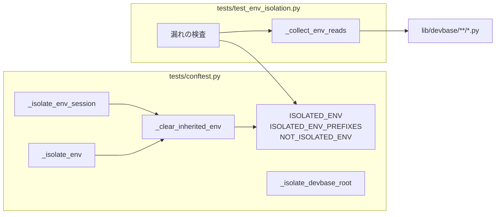
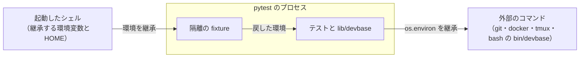
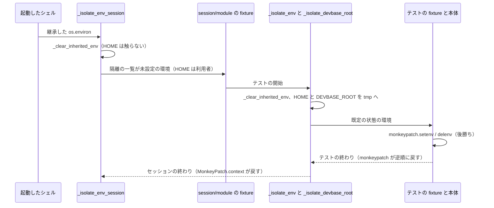
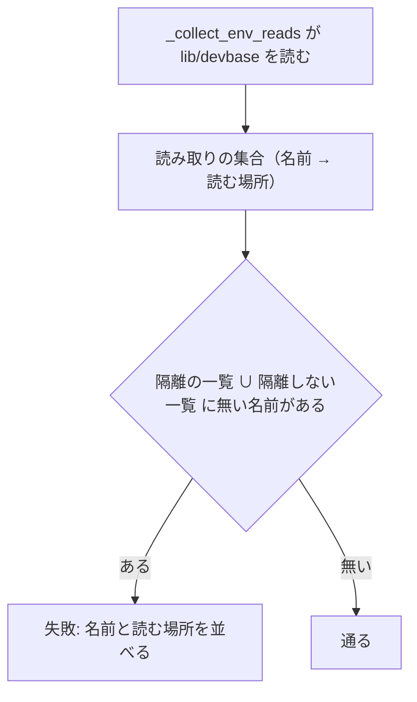

# #218: pytest が継承する環境変数と HOME をテストごとに隔離する の設計

要求と受け入れ条件は #218 の本文にある（写しは [issue-218-requirements.md](issue-218-requirements.md)）。
この文書は「どう作るか」だけを扱う。

## ドメインモデル

### コンテキスト

| コンテキスト | 何の語が 1 つの意味に決まるか |
| --- | --- |
| テストの実行環境（`test`） | pytest のプロセスが持つ環境変数と `HOME` を、どの時点でどの状態にするか |

1 つのコンテキストに収まる。`lib/devbase` の各所（`docker-context`・`editor`・`secret` など）は
環境変数を読む側として現れるだけで、この変更はその振る舞いを変えない。

### 集約

| 集約 | 持ち主（書き換えてよいもの） | 根 | エンティティ | 値オブジェクト |
| --- | --- | --- | --- | --- |
| 隔離の規則 | `tests/conftest.py` | 隔離の一覧（`ISOLATED_ENV`） | — | 変数名・変数名の接頭辞・隔離しない理由 |
| 読み取りの集合 | `lib/devbase` の各ファイル（この変更では書き換えない） | — | — | 変数名と、読む場所（ファイル:行） |
| 読み取りの集め方 | `tests/test_env_isolation.py` | 集める処理（`_collect_env_reads`） | — | 拾う形（文字列・同じファイルの定数・`keys` の定数） |

読み取りの集合は `lib/devbase` のソースから導く値で、持ち主はソースを書く開発者である。
隔離の規則はそれを名前でだけ参照する。2 つを揃えるのは開発者で、揃っていないことを
漏れの検査（I1）が見つける。ソースから読み取りの集合を集める処理は読み取りの集め方の集約にあり、
拾い方の正しさ（I6）はその持ち主が負う。漏れの検査は用語のとおりテストを指し、この集め方を使う側である。

### 不変条件

| # | 集約 | 条件 | 破れたときの扱い |
| --- | --- | --- | --- |
| I1 | 隔離の規則 | 読み取りの集合の変数名はすべて、隔離の一覧か隔離しない一覧のどちらかにある | 漏れの検査が失敗し、載っていない変数名と読む場所を出す |
| I2 | 隔離の規則 | 隔離の一覧と隔離しない一覧は、同じ変数名を持たない | 漏れの検査が失敗し、重なった変数名を出す |
| I3 | 隔離の規則 | function scope の隔離の fixture の設定が終わった直後（テストの側の function scope の fixture が立つ前）に、隔離の一覧の変数と接頭辞に合う変数はすべて未設定である | 隔離のテスト（`test_env_unset_before_test_fixtures`）が失敗する。一覧を消す helper の契約は `test_clear_inherited_env_unsets_listed` が別に確かめる |
| I4 | 隔離の規則 | session scope の隔離の fixture の設定が終わった時点で、起動元から継承した隔離の一覧の変数と接頭辞に合う変数はすべて未設定である（`HOME` は利用者のまま） | 受け入れ条件 2 の起動で、docker を使うテストが skip に回る |
| I5 | 隔離の規則 | テストの側が `monkeypatch.setenv` / `delenv` で書いた値は、隔離の fixture より後に効く | 既存のテストが落ちる |
| I6 | 読み取りの集め方 | 読み取りの集合を集める処理は、既知の読み取りを 3 つの形（文字列・同じファイルの定数・`keys` の定数）のそれぞれで拾う | 漏れの検査の自己点検（`test_collector_finds_known_reads`）が失敗する |
| I7 | 隔離の規則 | function scope の隔離の fixture の設定が終わった直後に、`HOME` はそのテストだけの tmp のディレクトリを指す | `test_home_is_per_test_tmp` が失敗する（受け入れ条件 3） |

### ドメインイベント

| # | イベント | 発生元 | 受け手 |
| --- | --- | --- | --- |
| E1 | 開発者が変数を export した端末で pytest を起動した | 開発者 | session scope の隔離の fixture |
| E2 | autouse fixture が変数と `HOME` を既定の状態へ戻した | `HOME` を置き換える function scope の隔離の fixture（テストごとに 1 回） | 以降に立つ fixture とテストの本体 |
| E2b | session scope の autouse fixture が、継承した隔離の一覧の変数を未設定へ戻した（`HOME` は触らない） | session scope の隔離の fixture（セッションごとに 1 回） | 以降に立つ session / module scope の fixture |
| E3 | テストが自分で変数を設定した | テストの fixture と本体 | `lib/devbase` の読み取り |
| E4 | `lib/devbase` に、環境変数を読むコードが足された | 開発者 | 漏れの検査（I1） |

### 用語

| 用語 | 意味 | 用語集への反映 |
| --- | --- | --- |
| 隔離の一覧 | テストの開始時に未設定へ戻す環境変数の名前と接頭辞。`tests/conftest.py` の `ISOLATED_ENV` と `ISOLATED_ENV_PREFIXES` | 追加（`test`） |
| 隔離しない一覧 | `lib/devbase` が読むが、隔離の fixture が未設定へ戻さない変数の名前と、その理由。`tests/conftest.py` の `NOT_ISOLATED_ENV` | 追加（`test`） |
| 読み取りの集合 | `lib/devbase` のソースから静的に集めた、環境変数として読む変数名の集合 | 追加（`test`） |
| 漏れの検査 | 読み取りの集合が隔離の一覧と隔離しない一覧に収まっていることを確かめるテスト | 追加（`test`） |

「環境の隔離」は用語集にある意味のまま使う。

## 機能一覧

| # | 機能 | 誰が使うか |
| --- | --- | --- |
| F1 | 継承した環境変数を、テストごとに未設定へ戻す | pytest を走らせる devbase の開発者 |
| F2 | `HOME` を、テストごとの tmp のディレクトリへ置き換える | 同上 |
| F3 | session scope と module scope の fixture より前に、継承した環境変数を未設定へ戻す | 同上 |
| F4 | `lib/devbase` が新しく読む変数を隔離の一覧に入れ忘れたとき、pytest を落として変数名を出す | `lib/devbase` に環境変数の読み取りを足す開発者 |

## 構成要素

| 要素 | 責務 |
| --- | --- |
| `ISOLATED_ENV`（`tests/conftest.py`、新規） | 未設定へ戻す変数名の tuple。並びは名前順 |
| `ISOLATED_ENV_PREFIXES`（同、新規） | 未設定へ戻す変数名の接頭辞の tuple。`GCP_CREDENTIALS_BASE64__` の 1 つ |
| `NOT_ISOLATED_ENV`（同、新規） | 隔離しない変数名から理由の文字列への dict |
| `_clear_inherited_env(mp)`（同、新規） | 渡された `MonkeyPatch` で、隔離の一覧の変数と、接頭辞に合う `os.environ` の変数をすべて `delenv` する。終了コードも出力も持たない |
| `_isolate_env_session`（同、新規） | session scope の autouse fixture。`pytest.MonkeyPatch.context()` の中で `_clear_inherited_env` を呼び、セッションの終わりに戻す |
| `_isolate_env`（同、新規） | function scope の autouse fixture。`monkeypatch` で `_clear_inherited_env` を呼び、`HOME` を `tmp_path_factory.mktemp('home')` へ `setenv` する |
| `_isolate_devbase_root`（同、変えない） | `DEVBASE_ROOT` をテストごとの tmp の root へ置く（#209） |
| `tests/test_env_isolation.py`（新規） | 読み取りの集合を AST で集める処理（`_collect_env_reads`）と、漏れの検査・隔離のテスト |

### 構成要素図



### システム構成図（文脈と配置）

すべて開発者の端末（またはコンテナ）の 1 つの pytest のプロセスの中で動く。外部の系は、
pytest を起動したシェルと、テストが起動する外部のコマンドの 2 つである。



外部のコマンドは `os.environ` を引き継ぐため、隔離はテストが起動する `bin/devbase` と
`git` / `docker` にも及ぶ。`bin/devbase` が読む変数（`DEV_SERVICE_NAME`・`DEVBASE_ROOT`・
`HOME`・`PWD`・`PATH`・`PYTHONPATH`）は、この一覧と `_isolate_devbase_root` で覆われる。

### パッケージ・モジュール構成

```text
tests/
├── conftest.py            # 3 つの一覧（ISOLATED_ENV ほか）と 3 つの関数を足す
└── test_env_isolation.py  # 新規。_collect_env_reads と 7 つのテスト
```

漏れの検査は `from tests.conftest import ISOLATED_ENV, ISOLATED_ENV_PREFIXES, NOT_ISOLATED_ENV,
_clear_inherited_env` で一覧を読む（既存のテストが `from tests.conftest import configure_openbao`
と書くのと同じ形）。

## 隔離の一覧の中身

### 読み取りの集合の集め方

`_collect_env_reads` は `lib/devbase/**/*.py` を `ast` で読み、次の 2 つの和を返す。値は
変数名から読む場所（`<ファイル>:<行>` の集合）への dict である。

**1. 読み取りの形。** 受け手 `R` が `os.environ`、または名前が `env` / `environ` の変数のとき:

| 形 | 例 |
| --- | --- |
| `R.get(N, ...)` / `R.pop(N, ...)` / `R.setdefault(N, ...)` | `os.environ.get('DEV_SERVICE_NAME', 'dev')` |
| `R[N]` | `os.environ['COMPOSE_PROJECT_NAME']` |
| `N in R` / `N not in R` | `KEY_FILE_ENV in os.environ` |
| `os.getenv(N, ...)` | — |

`N` は次の 3 つのどれかに解決できたときだけ拾う。解決できない `N`（関数の引数など）は拾わない。

| `N` の書き方 | 解決の仕方 | 例 |
| --- | --- | --- |
| 文字列の定数 | そのまま | `'DEV_SERVICE_NAME'` |
| 名前 | 同じファイルの最上位で文字列を代入した名前、または `keys.py` の最上位の名前 | `KEY_FILE_ENV`（`env/agekeys.py:34`） |
| `keys.X` / `K.X` | `keys.py` の最上位で `X` に代入した文字列 | `keys.GCP_AUTH_MODE` |

**2. `lib/devbase/env/keys.py` の定数。** 最上位の代入の右辺が文字列ならその値を、tuple なら
要素のうち文字列の定数を拾う（`AWS_ALL_KEYS` の要素は名前なので拾わず、名前の側の代入で拾う）。
`__` で終わる値（`GCP_CREDENTIALS_BASE64__`）は接頭辞として扱い、変数名の集合から外す。

**どちらも、大文字・数字・`_` だけの名前に絞る。**

2026-09-26 の `main`（`0174add`）での実測は、1 が 35 個、2 が 46 個と接頭辞 1 つで、重なりが
10 個（`DEVBASE_ACCOUNT_GROUP`・`DEVBASE_EDITOR`・`DEVBASE_EDITOR_DOCKER_CONTEXT`・
`DEVBASE_EDITOR_SSH_HOST`・`DEVBASE_OPEN_EDITOR`・`DEVBASE_OPEN_INDEX`・`DEVBASE_WINDOW_TITLE`・
`GCP_ACTIVE_PROFILE`・`GCP_AUTH_MODE`・`GOOGLE_APPLICATION_CREDENTIALS_BASE64`）あり、
和は 71 個である。

### 3 つの一覧

| 一覧 | 中身 | 数 |
| --- | --- | --- |
| `ISOLATED_ENV` | 読み取りの集合 71 個から `DEVBASE_ROOT` を除いた 70 個と、集め方に掛からない 2 個（下の表） | 72 |
| `ISOLATED_ENV_PREFIXES` | `GCP_CREDENTIALS_BASE64__` | 1 |
| `NOT_ISOLATED_ENV` | `DEVBASE_ROOT`（理由: `_isolate_devbase_root` がテストごとの tmp の root へ固定する。#209） | 1 |

**集め方に掛からないため手で足す 2 個:**

| 変数 | 読む場所 | 掛からない理由 |
| --- | --- | --- |
| `DEVBASE_SNAPSHOT_MIN_INTERVAL_MINUTES` | `commands/container.py:800` | 名前を引数で受ける `_env_non_negative_int` の中で読む |
| `DEVBASE_IMAGE_MAX_AGE_DAYS` | `commands/container.py:2003` | 同上 |

1 の 35 個のうち、受け手が `os.environ` の形で拾うのは 15 個で、残りの 20 個は受け手が
`env` / `environ` の形でだけ拾う（決定 5）。

**受け入れ条件 2 の 16 個はすべて `ISOLATED_ENV` に入る。** 拾う経路は次のとおりである。

| 拾う経路 | 変数 |
| --- | --- |
| 受け手が `os.environ` の形だけ | `DEV_SERVICE_NAME`・`DEVBASE_AGE_KEY_FILE`・`COMPOSE_PROJECT_NAME`・`XDG_CONFIG_HOME`・`EDITOR`・`SHELL` |
| 受け手が `os.environ` の形と `keys.py` | `DEVBASE_ACCOUNT_GROUP`・`DEVBASE_OPEN_INDEX` |
| 受け手が `env` の形と `keys.py` | `DEVBASE_OPEN_EDITOR`・`DEVBASE_EDITOR`・`GCP_AUTH_MODE`・`GCP_ACTIVE_PROFILE` |
| 受け手が `env` / `environ` の形だけ | `DOCKER_CONTEXT`・`DOCKER_HOST`・`DEVBASE_DOCKER_CONTEXT`（`utils/docker_context.py`）・`TMUX`（`editor/opener.py`） |

`PATH`・`TMPDIR`・`LANG` は読み取りの集合に入らないため、どちらの一覧にも載せない
（要求の前提 5）。

## 処理の流れ

### 1 つのテストが走るまで



- **session の段が先に立つ。** pytest は scope の広い fixture から立て、同じ scope では autouse を
  先に立てる。root の `conftest.py` の session scope の autouse は、テストのファイルが持つ
  session / module scope の fixture（`tests/containers/test_base_image_font_matching.py` の
  `probe`、`tests/containers/test_tmux_conf.py` の `options`）より前に立つ
- **テストごとの段でも同じ一覧を消す。** `lib/devbase` は `os.environ` へ直接書く箇所を持つ
  （`commands/container.py:550`・`:631`・`:640`、`tui/actions_env.py:120`、`tui/dispatch.py:57`）。
  テストがそれを呼ぶと、`monkeypatch` を通らない書き込みが次のテストへ残る。テストごとに消せば、
  残った値は次のテストの開始で消える
- **テストの側の設定は後勝ちになる。** root の `conftest.py` の function scope の autouse は、
  テストが明示に求める fixture とテストの本体より先に立つ。テストの側の `monkeypatch.setenv` は
  同じ `monkeypatch` に積まれ、テストの終わりに逆順で戻る

### 漏れの検査



失敗の文言は 1 行目に件数、2 行目以降に 1 変数 1 行で `<変数名>: <ファイル>:<行>, ...` を並べ、
最後の行で「`tests/conftest.py` の `ISOLATED_ENV` か `NOT_ISOLATED_ENV`（理由つき）に足す」と
直し方を示す。

## 決定の記録

### 決定 1: 隔離の fixture を session scope と function scope の 2 段にする

function scope だけでは、それより先に立つ session scope の fixture が継承した値を読む。実測では
受け入れ条件 2 の 16 個を偽の値にして走らせると、`probe`（`docker info` を打つ）が偽の
`DOCKER_HOST` へ繋ぎにいき、`test_base_image_font_matching.py` の 39 件が skip に回った
（3194 passed / 39 skipped）。2 段にすると 3233 passed で skip は 0 だった。

session scope だけにする形は採らない。`lib/devbase` が `os.environ` へ直接書いた値が次の
テストへ残る（処理の流れの 2 つ目の箇条）。

### 決定 2: `HOME` は function scope の段でだけ置き換え、固定値（テストごとの tmp）にする

`HOME` を未設定にすると、`Path.home()` と `os.path.expanduser` がパスワードのデータベースから
利用者のホームを引き、隔離にならない。そのため固定値にする（要求の前提 2 の「固定値にする変数」）。
テストごとに別のディレクトリにするのは、`_isolate_devbase_root` と同じく、書き込んだテストが
隣のテストへ漏らさないためである。

session scope の段では `HOME` を置き換えない。`probe` が打つ docker は `~/.docker` の
context の設定（手元では `desktop-linux`）で daemon を探すため、session の段で `HOME` を
替えると、docker が使える端末でも skip に回る。session / module scope の fixture は
利用者の `HOME` を読むまま残す（未確認のまま残ることの 1 行目）。

実測では、`HOME` をテストごとの tmp にしても落ちるテストは無かった（2026-09-26、
`main` = `0174add` の上で 3233 passed）。要求の前提 4 の「テストの側で必要な設定を与える形に
直す」は、実装の時点で落ちたものだけに行う。

### 決定 3: 隔離の一覧の変数はすべて未設定へ戻し、固定値を置かない

`lib/devbase` は、読む変数に未設定のときの既定を持つ（`DEV_SERVICE_NAME` は `dev`、`SHELL` は
`/bin/bash`、`PWD` は `os.getcwd()`）。実測でも、72 個と接頭辞を未設定へ戻して落ちるテストは
無かった（決定 1 の 3233 passed）。固定値にすると、未設定の分岐を試すテストが毎回 `delenv` を
書くことになる。

`PWD` も未設定へ戻す。`PWD` は起動したシェルの現在地で、`monkeypatch.chdir` と食い違う。
未設定なら `lib/devbase` は `os.getcwd()` を使い、chdir と揃う。

### 決定 4: 漏れの検査は、`keys.py` の定数をすべて読み取りの集合へ入れる

`keys.py` の定数のうち「環境変数として読むもの」を静的に切り分けられない。`env.get(keys.X)` の
`env` は `os.environ` のこともあり、`EnvFile` のこともある。さらに `env/runtime.py:182` は
プロジェクトの `env` に書いたキーを名前を問わず `os.environ` から読むため、`AWS_PROFILE` の
ような機密の名前も継承した値が効きうる。すべてを入れれば、切り分けを誤って漏らすことが無い。
入れすぎた名前は未設定へ戻されるだけで、テストの結果を変えない。

使っている箇所だけを追う形（呼び出しの流れを解析する）は採らない。静的に追い切れず、追えた
範囲だけを信じると漏れが空振りで通る。

### 決定 5: 受け手の名前が `env` / `environ` の `.get` なども読み取りの形として拾う

`utils/docker_context.py`・`editor/opener.py`・`env/gcp_auth.py`・`editor/window_title.py` は
`os.environ` を引数 `env` で受けて読む。`os.environ` の形だけを拾うと、読み取りの形で拾う
名前は 35 個から 15 個へ減り、受け入れ条件 2 の `DOCKER_CONTEXT`・`DOCKER_HOST`・
`DEVBASE_DOCKER_CONTEXT`・`TMUX` が読み取りの集合に入らず、I1 がそれらの漏れを見逃す。受け手が環境変数でない辞書のときも名前が
増えるだけで、決定 4 と同じく結果を変えない。

### 決定 6: 漏れの検査は隔離の一覧の余分な名前を落とさない

`lib/devbase` から読み取りが消えても、一覧に名前が残るだけで隔離は壊れない。余分を落とすと、
読み取りを消す変更のたびにテストの一覧の直しが要る。手で足した 2 個（集め方に掛からない分）も、
余分と区別できない。

### 決定 7: 一覧は `tests/conftest.py` に置き、漏れの検査はそこから読む

隔離の fixture と一覧が同じファイルにあれば、fixture を読む人が一覧へすぐ届く。漏れの検査は
既存のテストと同じく `from tests.conftest import ...` で読む。別のモジュール（`tests/env_isolation.py`
など）へ切り出す形は、`conftest.py` からの読み込みが増えるだけで得るものが無いため採らない。

## テスト設計

`tests/test_env_isolation.py` に置く 7 つのテストと、コマンドの起動 3 つで確かめる。

| 受け入れ条件・不変条件 | 何で確かめるか |
| --- | --- |
| 受け入れ条件 1（`DEV_SERVICE_NAME=bogusdev` で全件通る） | `DEV_SERVICE_NAME=bogusdev uv run --locked pytest tests/ -q -p no:randomly` の passed と skipped の件数が変数なしの起動と同じで、failed が 0 |
| 受け入れ条件 2（16 個を偽の値にして全件通る） | 16 個を実在しない値（`SHELL` は `/bin/zsh`、`DOCKER_HOST` は `tcp://127.0.0.1:1`）にした同じ起動の passed と skipped の件数が変数なしの起動と同じで、failed が 0 |
| 受け入れ条件 3・I7（`HOME` がテストごとの tmp） | `test_home_is_per_test_tmp`: `os.environ['HOME']` が `pwd.getpwuid(os.getuid()).pw_dir` と異なり、`tmp_path_factory.getbasetemp()` の下にある |
| 受け入れ条件 4・I1（漏れがあれば落ちて名前が出る） | `test_every_env_read_is_listed`: 読み取りの集合が 2 つの一覧に収まる。失敗の文言は処理の流れの「漏れの検査」の形 |
| I2（2 つの一覧が重ならない） | `test_isolated_and_not_isolated_are_disjoint` |
| I6（集める処理が空振りしない） | `test_collector_finds_known_reads`: 読み取りの集合に `DEV_SERVICE_NAME`（文字列、`volume/compose.py`）・`DEVBASE_AGE_KEY_FILE`（同じファイルの定数、`env/agekeys.py`）・`GCP_AUTH_MODE`（`keys` の定数、`env/gcp_auth.py`）が、その読む場所つきで入る |
| I3（function scope の隔離の後で未設定） | `test_env_unset_before_test_fixtures`: 同じファイルの module scope の fixture が `pytest.MonkeyPatch.context()` で `DEV_SERVICE_NAME` と `GCP_CREDENTIALS_BASE64__x` を設定し、テストが求める function scope の fixture が立った時点の `os.environ` を記録する。テストの本体は、記録にどちらも無いことを確かめる。module scope の fixture は function scope の autouse より先に立ち、テストの側の function scope の fixture は後に立つため、`_isolate_env` が一覧を消し損ねても、順序が崩れても落ちる |
| I3 の helper の契約 | `test_clear_inherited_env_unsets_listed`: 新しい `MonkeyPatch` で隔離の一覧の全部と `GCP_CREDENTIALS_BASE64__x` を設定してから `_clear_inherited_env` を呼ぶと、どれも `os.environ` に無い。`MonkeyPatch.undo()` で戻す |
| I4（session の段で未設定） | 受け入れ条件 2 の起動で、`test_base_image_font_matching.py` が skip に回らない（docker が使える端末での起動に限る） |
| 受け入れ条件 5・I5（テストの側が後勝ち） | `test_test_side_setenv_wins`: `monkeypatch.setenv('DEV_SERVICE_NAME', 'x')` の後に `get_dev_service_name()` が `'x'` を返す。既存の setenv するテスト（`test_compose_gcp_auth.py` ほか）が変更なしで通ることも同じ条件を示す |
| 受け入れ条件 6（件数が減らない） | 変数なしの `uv run --locked pytest tests/ -q` が、変更前の 3233 件に足したテストの数を足した件数で、すべて通る |

**手の確認（要求の検証手段）:** 実装の後、`ISOLATED_ENV` から `DEV_SERVICE_NAME` を 1 つ外すと、
受け入れ条件 1 の起動で 47 件前後が落ち、`test_every_env_read_is_listed` も
`DEV_SERVICE_NAME: volume/compose.py:37` を出して落ちることを見て戻す。

## 未確認のまま残ること

| 項目 | 内容 |
| --- | --- |
| session / module scope の fixture が読む `HOME` | 決定 2 のとおり利用者の `HOME` のままで、受け入れ条件 3 の対象（テストの実行中）の外にある。いまある 2 つ（`probe`・`options`）は docker と tmux の設定を読むだけで、利用者のファイルへ書かない。広い scope の fixture が増えたときの扱いは決めていない |
| 後から初めて立つ広い scope の fixture が見る変数 | I4 が保証するのは session の隔離が終わった時点までで、その後に別のテストが `os.environ` へ直接書いた値は、後から初めて立つ session / module scope の fixture に残り得る |
| 名前を引数で受けて読む補助関数 | `_env_non_negative_int` の 2 個は手で足した。同じ形の補助関数が増えると、読み取りの集合に掛からず、漏れの検査が見逃す |
| 外部のコマンドが読む変数 | `git`・`docker`・`tmux` が自分で読む変数（`GIT_CONFIG_GLOBAL`・`DOCKER_CONFIG`・`SSH_AUTH_SOCK` など）は、要求の前提 3 の範囲の外で隔離しない。`HOME` の置き換えで既定の置き場は tmp へ移るが、変数で置き場を指している端末では利用者の設定を読む |
| 受け入れ条件 2 の skip 0 | docker が使えない端末では、`test_base_image_font_matching.py` は変数に関係なく skip に回る。そのときは変数なしの起動も同じ数だけ skip し、件数の比較は同じになる |
