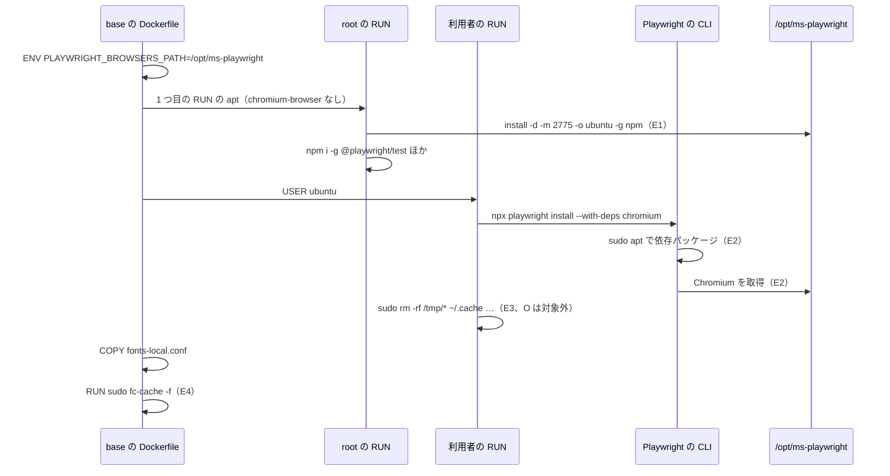
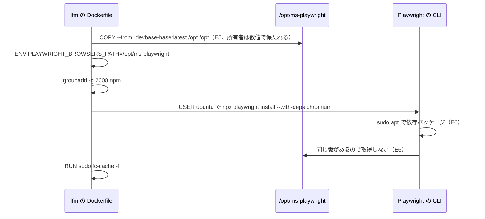

# #220: base が Playwright の Chromium をブラウザの置き場に残し、snap スタブを外す

要求と受け入れ条件は #220 の本文にある（コピーは `issues/issue-220-requirements.md`）。この文書は「どう作るか」だけを扱う。
前提・受け入れ条件・ドメインイベントの番号は、要求の番号をそのまま使う。

## ドメインモデル

### コンテキスト

| コンテキスト | 何の語が 1 つの意味に決まるか |
| --- | --- |
| base イメージのブラウザ（`browser`） | ブラウザの置き場・Playwright の Chromium・システムの Chrome・snap スタブ・ブラウザの依存パッケージ |
| イメージの継承（`image-lineage`） | lfm が base から取り込むもの（`/opt` を含む）と、取り込めずに同じ値で宣言するもの（`ENV`） |

`image-lineage` が `browser` に**順応者**として従う。lfm は base のブラウザの置き場を `/opt` ごと取り込み、
置き場の値も base と同じ値で宣言する。lfm の側で置き場を別の場所へ訳し直す層は持たない（`lfm-base-settings.md` の
「base が正本で、lfm は中身を書かない」と同じ関係）。

### 集約

この変更の「集約」は、Dockerfile の命令の組である。持ち主は、その命令を書き換えてよい Dockerfile を指す。

| 集約 | 持ち主（書き換えてよいもの） | 根 | エンティティ | 値オブジェクト |
| --- | --- | --- | --- | --- |
| base のブラウザの置き場 | `containers/base/Dockerfile` | ブラウザの置き場（`/opt/ms-playwright`） | Playwright の Chromium（版ごとのディレクトリ） | `PLAYWRIGHT_BROWSERS_PATH` の値・置き場の所有者と権限 |
| base の apt のブラウザ | `containers/base/Dockerfile` | 2 回目の `apt-get install` の一覧 | — | システムの Chrome の取得元（`arch=amd64`） |
| lfm のブラウザの宣言 | `containers/lfm/Dockerfile` | lfm の `ENV PLAYWRIGHT_BROWSERS_PATH` | — | `PLAYWRIGHT_BROWSERS_PATH` の値 |

lfm はブラウザの置き場の中身を書き換えない。lfm の `npx playwright install --with-deps chromium` は、取り込んだ置き場に
同じ版の Chromium があることを確かめて取得を飛ばし、ブラウザの依存パッケージだけを入れる（前提 6）。

### 不変条件

| # | 集約 | 条件 | 破れたときの扱い |
| --- | --- | --- | --- |
| I1 | base のブラウザの置き場 | `ENV PLAYWRIGHT_BROWSERS_PATH=/opt/ms-playwright` が 1 つあり、置き場を作る `RUN` と `npx playwright install` を含む `RUN` より前にある | Dockerfile の形の検査が落ちる。前に無いと Chromium が `~/.cache` へ取得され、片付けで消える |
| I2 | base のブラウザの置き場 | `npx playwright install` を含む `RUN` の片付けの `rm -rf` が、`/opt/ms-playwright` もその親の `/opt` も対象にしない | Dockerfile の形の検査が落ちる |
| I3 | base のブラウザの置き場 | 置き場は利用者 `ubuntu` が書き込める（所有者 `ubuntu`、グループ `npm`、`2775`） | 建てたイメージの検査が落ちる。実行時の道具の取得（E8）が失敗する |
| I4 | base のブラウザの置き場 | 置き場の Chromium は、イメージの Playwright の CLI の版が求める版で、ネットワーク無しで起動できる | 建てたイメージの検査が落ちる |
| I5 | base の apt のブラウザ | `apt-get install` に `chromium-browser` が無い | Dockerfile の形の検査と、建てたイメージの `dpkg -s` が落ちる |
| I6 | base の apt のブラウザ | システムの Chrome の取得元は `arch=amd64` に限られている（前提 4・決定 5） | Dockerfile の形の検査が落ちる |
| I7 | base のブラウザの置き場 | ブラウザの依存パッケージ（`fonts-liberation`・`fonts-ipafont-gothic`・`fonts-wqy-zenhei`・`libnss3`）は減らない | 建てたイメージの `dpkg -s` が落ちる |
| I8 | base のブラウザの置き場 | `fc-cache -f` は Playwright の `RUN` より後にある（前提 2 で順序は変わらない） | 既存のフォントの検査が落ちる |
| I9 | lfm のブラウザの宣言 | lfm に base と同じ値の `ENV PLAYWRIGHT_BROWSERS_PATH` があり、lfm の `npx playwright install --with-deps chromium` を含む `RUN` より前にある | 到達の検査（値の一致）と lfm の形の検査（順序）が落ちる |
| I10 | lfm のブラウザの宣言 | lfm の `fc-cache -f` は 1 度だけで、Playwright の `RUN` より後にある | 既存の lfm の形の検査が落ちる |
| I11 | base のブラウザの置き場 | 置き場の Chromium で日本語のページを PDF にすると、埋め込まれる書体は `NotoSansCJKjp` で、`WenQuanYi` を含まない | 建てたイメージの検査が落ちる |

### ドメインイベント

| # | イベント | 発生元 | 受け手 |
| --- | --- | --- | --- |
| E1 | base のビルドがブラウザの置き場を用意した | base の root の `RUN`（npm のグローバル領域を作る `RUN`） | E2 の利用者の `RUN` |
| E2 | base のビルドがブラウザの依存パッケージを入れ、Playwright の Chromium をブラウザの置き場へ取得した | base の利用者の `RUN` | E3 の片付け・E4 の `fc-cache` |
| E3 | base のビルドが一時ファイルを片付けた | base の利用者の `RUN` の末尾 | なし（ブラウザの置き場は対象外。I2） |
| E4 | base のビルドがフォントのキャッシュを作り直した | base の `RUN sudo fc-cache -f` | E7 の描画 |
| E5 | lfm のビルドが base の `/opt` を取り込み、ブラウザの置き場を受け取った | lfm の `COPY --from=devbase-base:latest /opt /opt` | E6 |
| E6 | lfm のビルドがブラウザの依存パッケージを入れた。同じ版のブラウザは取得し直さなかった | lfm の `npx playwright install --with-deps chromium` | lfm の `fc-cache -f` |
| E7 | コンテナの利用者が Playwright の Chromium を起動し、ページを PDF やスクリーンショットにした | 利用者・道具 | 建てたイメージの検査（受け入れ条件 5・7） |
| E8 | 実行時の道具が、別の版の Playwright の Chromium をブラウザの置き場へ取得した | `playwright-kit` の初回の実行など | ブラウザの置き場（I3 で書き込める） |
| E9 | 利用者がシステムの Chrome を起動した | Playwright を介さない道具 | amd64 だけ（I6・決定 5） |

### 用語

用語はすべて要求の段で用語集へ足してある（`browser` のコンテキスト）。この設計で新しく使う語は無い。

| 用語 | 意味 | 用語集への反映 |
| --- | --- | --- |
| ブラウザの置き場 | Playwright がブラウザを取得して置くディレクトリ。`PLAYWRIGHT_BROWSERS_PATH` が指す | 意味の変更（実装で「この変更で」の言い回しを、確定した置き場の記述へ直す） |
| Playwright の Chromium | `playwright install chromium` がブラウザの置き場へ取得する Chromium | 反映済み |
| システムの Chrome | apt で入る `google-chrome-stable` | 反映済み |
| snap スタブ | Ubuntu の `chromium-browser` パッケージ。コンテナの中では起動しない | 反映済み |
| ブラウザの依存パッケージ | `--with-deps` が apt で入れる共有ライブラリとフォント | 反映済み |

## 機能一覧

| # | 機能 | 誰が使うか |
| --- | --- | --- |
| F1 | base（と base を継ぐ派生イメージ）のコンテナで、建て直した直後から Playwright の Chromium を起動できる。ネットワークに繋がなくてよい | コンテナの利用者・AI エージェント・スクリーンショットや PDF を作る道具 |
| F2 | 実行時の道具が、別の版の Playwright の Chromium をブラウザの置き場へ取得できる | `playwright-kit` などの道具 |
| F3 | lfm のコンテナでも、base から取り込んだ Playwright の Chromium を起動できる | lfm の利用者 |
| F4 | base の apt から snap スタブが消え、起動しない `chromium-browser` が見えなくなる | コンテナの利用者 |
| F5 | 建てた base のブラウザと PDF の書体を、`devbase-base:latest` を上書きせずに確かめられる | 開発者（マージ前の確認とリリース後テスト） |

## 構成要素

| 要素 | 責務 | 変え方 |
| --- | --- | --- |
| base の `ENV` の宣言 | ブラウザの置き場の値を 1 か所で決め、以降の `RUN` と `docker exec` の非対話の処理へ届ける | `ENV NPM_CONFIG_PREFIX` / `ENV PATH` の並びへ `ENV PLAYWRIGHT_BROWSERS_PATH=/opt/ms-playwright` を足し、コメントで理由（片付けの外・lfm も同じ値で宣言）を書く |
| base の root の `RUN`（npm のグローバル領域を作る `RUN`） | ブラウザの置き場を、利用者が書き込める形で作る | 先頭の `install -d -m 2775 -o "$USERNAME" -g npm "$NPM_CONFIG_PREFIX"` の隣で、同じ形で `"$PLAYWRIGHT_BROWSERS_PATH"` を作る |
| base の 1 つ目の `RUN` の 2 回目の apt | 外部のリポジトリのパッケージを入れる | 一覧から `chromium-browser` を外す。「ブラウザ: amd64 は Chrome+Chromium、arm64 は Chromium」のコメントを「システムの Chrome は amd64 だけ。Chromium は Playwright のものを使う」へ直す。`BROWSER_PKG` の分岐と `arch=amd64` は変えない |
| base の利用者の `RUN` | Playwright の Chromium を取得し、一時ファイルを片付ける | 命令は変えない（`npx playwright install --with-deps chromium` と `sudo rm -rf /tmp/* ~/.cache …`）。`# Playwright browsers` のコメントを、置き場が `ENV` で `/opt` に向いていて片付けの外であることへ直す |
| base の `fc-cache` の `RUN` とコメント | フォントのキャッシュを作り直す | 変えない。順序も理由も前提 2 で変わらない |
| lfm の `ENV` の宣言 | base と同じ値でブラウザの置き場を示す | `ENV DEVBASE_SHELLRC_DIR` の後へ `ENV PLAYWRIGHT_BROWSERS_PATH=/opt/ms-playwright` を足す（取り込みの直後の `ENV` の並び＝Playwright の `RUN` より前） |
| lfm の Playwright の `RUN` | ブラウザの依存パッケージを lfm でも入れる | 命令は変えない。「ブラウザは devbase-base からコピーされないため個別にインストール」のコメントを、ブラウザは `/opt` の取り込みで届き、この `RUN` は依存パッケージのためにある、へ直す |
| Dockerfile の形の検査（base） | I1・I2・I5・I6 を Docker を起動せずに縛る | 新しく `tests/containers/test_base_dockerfile_browser.py` を置く |
| lfm の形の検査 | I9 の順序を縛る | `tests/containers/test_lfm_base_settings.py` に、`ENV PLAYWRIGHT_BROWSERS_PATH` が Playwright の `RUN` より前にあるケースを足す。値の一致は既存の到達の検査が見る |
| 建てたイメージの検査（base） | I3・I4・I5・I7・I11 と受け入れ条件 9 を、建てたイメージで縛る | 新しく `tests/containers/test_base_image_browser.py` を置く。検査するイメージは環境変数で差し替えられる（決定 3） |
| 確定仕様 | 変更後の置き場と apt の一覧を書く | 下の「文書の直し先」 |
| 用語集 | 「ブラウザの置き場」の意味を確定した記述にする | `docs/glossary/glossary.json` を直し `glossary.py render` で `docs/glossary.md` を作り直す |
| `CHANGELOG.md` | 利用者に見える変更を書く | `[Unreleased]` の `Changed` に 1 項目足す（受け入れ条件 13） |

### 文書の直し先

要求の「影響する検査と仕様」の表の行に加え、値（Chromium の出どころ）が変わったことで当てはまらなくなる行を集めた。
集め方は、`chromium`・`Chromium`・`playwright`・`~/.cache` で `docs/` と `containers/` を検索し、さらに lfm の `ENV` の
一覧（`ENV` の集合へ値を足すと古くなる表）を読んだ。

| 文書 | 行 | 直す中身 |
| --- | --- | --- |
| `docs/specifications/base-image-rendering.md` | 決定 5（192〜195 行目） | 「直後に `~/.cache` を消す」を、片付けが `~/.cache` を消してもブラウザの置き場（`/opt/ms-playwright`）は残る、へ直す。順序の理由は変えない |
| `docs/specifications/base-image-rendering.md` | 257 行目 | 「LibreOffice と Chromium での描画は未検証、どちらも base に無い」を、Chromium は base にあり PDF の書体を建てたイメージの検査が見る、へ直す。LibreOffice は今のまま |
| `docs/specifications/base-image-rendering.md` | 259 行目 | amd64 でシステムの Chrome が追加で入る記述は今のまま正しい。「Chromium の PDF の書体の確認は arm64 で行った」を添える |
| `docs/specifications/base-image-shellcheck.md` | 43 行目 | 2 回目の apt の一覧から `chromium-browser` を除き、amd64 だけの `google-chrome-stable` を書く |
| `docs/specifications/lfm-base-settings.md` | 30 行目 | 「base の apt の道具（… Chromium など）」から Chromium を除く |
| `docs/specifications/lfm-base-settings.md` | 「宣言するもの」の表（95〜96 行目） | `PLAYWRIGHT_BROWSERS_PATH` / `/opt/ms-playwright` の行を足す |
| `docs/specifications/lfm-base-settings.md` | 「命令の順序」の 1 と 5（110〜114 行目） | 1 の `ENV` にブラウザの置き場を含める。5 に、ブラウザは `/opt` の取り込みで届き、この `RUN` は依存パッケージを入れる、を添える |
| `docs/specifications/lfm-base-settings.md` | 「届かないもの」の `chromium-browser` の行（158 行目） | 行を消す。base にも無くなるため。Playwright の Chromium は `/opt` の取り込みで届くことを取り込みの節に書く |
| `docs/specifications/lfm-base-settings.md` | 「データ・設定」の `ENV` の行（241 行目） | `PLAYWRIGHT_BROWSERS_PATH` を足す |

### 構成要素図

```mermaid
graph TD
    subgraph base["containers/base/Dockerfile"]
        BENV[ENV の宣言<br/>PLAYWRIGHT_BROWSERS_PATH]
        BROOT[root の RUN<br/>置き場を作る]
        BAPT[2 回目の apt<br/>snap スタブを外す]
        BUSER[利用者の RUN<br/>取得と片付け]
        BFC[fc-cache の RUN]
    end
    subgraph lfm["containers/lfm/Dockerfile"]
        LCOPY[/opt の取り込み]
        LENV[ENV の宣言<br/>同じ値]
        LPW[Playwright の RUN<br/>依存パッケージ]
    end
    subgraph tests["tests/containers"]
        TSHAPE[base の形の検査]
        TLFM[lfm の形と到達の検査]
        TIMG[建てたイメージの検査]
    end
    BENV --> BROOT --> BUSER --> BFC
    BAPT --> BUSER
    BROOT -. /opt .-> LCOPY
    BENV -. 同じ値 .-> LENV
    LCOPY --> LPW
    LENV --> LPW
    TSHAPE --> base
    TLFM --> lfm
    TIMG --> BUSER
```

### システムの文脈と配置

外部の系のうち、この変更で関わり方が変わるのは Playwright の配布元だけである（取得したものを残すようになる）。
Ubuntu の apt からは snap スタブを取らなくなる。Google の apt（amd64 だけ）と npm は変わらない。

```mermaid
graph LR
    PWCDN[Playwright の配布元] -- Chromium --> BASEIMG
    UAPT[Ubuntu の apt] -- 依存パッケージ --> BASEIMG
    GAPT[Google の apt] -- amd64 だけ Chrome --> BASEIMG
    subgraph host["利用者の端末の docker"]
        BASEIMG[devbase-base]
        DERIVED[派生イメージ<br/>general ほか]
        LFMIMG[devbase-lfm]
        CT[コンテナ]
    end
    BASEIMG -- FROM で層ごと --> DERIVED
    BASEIMG -- COPY --from /opt --> LFMIMG
    BASEIMG --> CT
    DERIVED --> CT
    LFMIMG --> CT
```

派生イメージは base を `FROM` で継ぐため、`ENV` と `/opt/ms-playwright` はそのまま届く（対象範囲の「含まない」）。
lfm だけが `/opt` を取り込み、`ENV` を宣言し直す。

### 置き場所

```text
containers/
├── base/Dockerfile                    # 変更: ENV・置き場の作成・apt の一覧・コメント
└── lfm/Dockerfile                     # 変更: ENV・コメント
tests/containers/
├── test_base_dockerfile_browser.py    # 新設: base の形の検査
├── test_base_image_browser.py         # 新設: 建てたイメージの検査
└── test_lfm_base_settings.py          # 変更: lfm の ENV の順序のケース
docs/
├── specifications/base-image-rendering.md   # 変更
├── specifications/base-image-shellcheck.md  # 変更
├── specifications/lfm-base-settings.md      # 変更
├── glossary/glossary.json                   # 変更（ブラウザの置き場の意味）
└── glossary.md                              # 作り直し
CHANGELOG.md                                 # 変更
```

## 処理の流れ

この節の図は、イメージを建てるときの命令の順序だけを描く。構成要素の表のうち、検査・確定仕様・用語集・
`CHANGELOG.md` はビルドの流れに入らないため描かない（検査が何を見るかは構成要素図とテスト設計にある）。

### base のビルド

変わるのは、置き場の宣言と作成が取得より前に入ることと、片付けが置き場に届かないことである。



### lfm のビルド



lfm の `/usr/local`（npm のグローバル領域）は base から取り込むため、lfm の Playwright の CLI は base と同じ版で、
求める Chromium の版も同じになる。取得し直さないのはこの一致による。

### 実行時

| 場面 | 流れ |
| --- | --- |
| 利用者・道具がイメージの Playwright を使う（E7） | `PLAYWRIGHT_BROWSERS_PATH` を見て `/opt/ms-playwright` の Chromium を起動する。取得は起きない |
| 道具が別の版の Playwright で `playwright install chromium` を打つ（E8） | 同じ環境変数に従って `/opt/ms-playwright` へ別の版のディレクトリを足す。コンテナを作り直すと消える（前提 5） |
| Playwright を介さずに Chrome を呼ぶ（E9） | amd64 はシステムの Chrome、arm64 には無い（決定 5） |

## 非機能の実現方式

| 大項目 | 要求の条件 | 実現方式 | 確かめ方 |
| --- | --- | --- | --- |
| 性能・拡張性 | 建てた base のイメージの大きさの増分を、変更前の同じ手順で建てたイメージとの差として記録する。増分と `du -sb /opt/ms-playwright` の差は 50 MB 以内である | 増えるのは置き場の中身だけにする。取得は既存の利用者の `RUN` の中で行い、新しい層を立てない。置き場を作る `install -d` は空のディレクトリを足すだけである。snap スタブを外した分は減る側に働く | 変更前（`main`）と変更後をそれぞれ別のタグで建て、`docker image inspect -f '{{.Size}}'` の差と、変更後のイメージの `du -sb /opt/ms-playwright` を PR に残す |
| 移行性 | 利用者の移行の操作は無い。base を建て直した後に作ったコンテナから効く。派生イメージと lfm は、base の後に建て直すと届く | 置き場をイメージの中に持ち、ボリュームにも利用者の設定にも書かない。`~/.cache/ms-playwright` は元々コンテナを作り直すと消える場所で、移す中身が無い | `CHANGELOG.md` に建て直しの要否を書く。建てたイメージの検査が、置き場と環境変数をイメージだけで確かめる |
| システム環境 | arm64 と amd64 の両方で建てられる | アーキで分ける命令を足さない。Playwright の CLI がアーキに合う Chromium を選ぶ。システムの Chrome の `amd64` の分岐は今のまま | arm64 は手元で建てて建てたイメージの検査を通す。amd64 は #242 で同じ検査を通す |

## 決定の記録

### 決定 1: ブラウザの置き場は npm のグローバル領域と同じ root の `RUN` で、`ubuntu:npm`・`2775` で作る

置き場は Playwright の取得より前に、利用者 `ubuntu` が書き込める形で存在している必要がある（I3・前提 5）。
base には同じ要件を持つ npm のグローバル領域があり、`install -d -m 2775 -o "$USERNAME" -g npm` で作っている。
同じ形にすると、lfm でも `COPY --from` が数値の所有者を保ち、lfm が同じ GID（2000）で作り直す `npm` グループに
そのまま当たる。`ENV` を先に置き、`RUN` は `"$PLAYWRIGHT_BROWSERS_PATH"` で参照して値を 1 か所に保つ。

利用者の `RUN` の中で `sudo mkdir` と `sudo chown` を打つ形は採らない。root の作業が利用者の `RUN` へ散り、
npm のグローバル領域と作り方が分かれる。`root` の持ち物で読むだけにする形は、実行時の道具の取得（E8）を壊すため
採らない。`777` は書き込める利用者を広げすぎるため採らない。

根拠: Value 1 / Value 3（MVV 版 1）

### 決定 2: Playwright の取得の命令は `npx playwright install --with-deps chromium` のまま変えない

既定の取得は Chromium の本体と headless の shell の両方を置く。lfm も同じ命令を打つため、base と lfm で取得の
対象が一致し、lfm は取り込んだ置き場を使って取得を飛ばせる（E6）。本体があれば、`channel: 'chromium'` の起動や、
Chromium の実行ファイルを直に呼ぶ道具も arm64 で使える。

`--only-shell` で headless の shell だけを置く案は、イメージを小さくできるが採らない。lfm の命令と対象が食い違い、
lfm のビルドが本体を取得し直す。本体を要する使い方も arm64 で使えなくなる。大きさの増分は非機能の表のとおり記録し、
設計の承認（P1）で人が確かめる。

根拠: Value 1 / P1（MVV 版 1）

### 決定 3: 建てたイメージの検査は、検査するイメージを環境変数 `DEVBASE_TEST_BASE_IMAGE` で差し替えられるようにする

マージ前の確認は `devbase-base:latest` を上書きしない別のタグで行う（前提 8）。既定を `devbase-base:latest` にした
検査が環境変数で別のタグも見られれば、マージ前の確認とリリース後テストで同じ検査を走らせられる。Docker が無い・
イメージが無いときは skip する（`test_base_image_font_matching.py` と同じ扱い）。置き場の無いイメージを skip する
のは、`DEVBASE_TEST_BASE_IMAGE` を渡さず既定の `devbase-base:latest` を見るときだけにする。`DEVBASE_TEST_BASE_IMAGE`
を明示したときは、置き場が無くても skip せず落とす。置き場を消して建てたイメージは置き場の無い古いイメージと
見分けられないため、明示したタグまで skip すると、テスト設計の「片付けに置き場を足して建てる」壊し方が skip で通る。

手で打つコマンドの列だけで確かめる案は、同じ確認をリリース後テストと #242 で繰り返せないため採らない。
検査を `devbase-base:latest` に固定する案は、マージ前に利用者の環境が使うイメージを上書きさせるため採らない。

根拠: Value 3 / P3（MVV 版 1）

### 決定 4: 文書の記述（受け入れ条件 12）は pytest で縛らず、PR の検索の出力で確かめる

文書の語を検査に固定すると、言い回しを直すたびに検査が落ちる。確かめるのはこの変更の 1 回だけで、`grep` の出力を
PR に残せば人が読み直せる。Dockerfile の形と建てたイメージは、この変更の後も壊れうるため検査で縛る。

根拠: 根拠なし（MVV 版 1）

### 決定 5: システムの Chrome は amd64 だけに入れ、arm64 には入れない

arm64 で Chromium を使う手段は、Playwright の Chromium（ブラウザの置き場）で足りる。システムの Chrome を arm64 にも
入れると、イメージが大きくなり、受け入れ条件 4・I6 の範囲が変わる。`BROWSER_PKG` の分岐と `arch=amd64` は今のまま残す。
arm64 でシステムの Chrome が要る使い方が出てきたら、別の課題として扱う。

根拠: 設計の承認（P1）で利用者が決めた（2026-10-03）

## テスト設計

| 受け入れ条件・不変条件 | どの振る舞いで縛るか | どう壊したら落ちるべきか |
| --- | --- | --- |
| 受け入れ条件 1 / I1 | base の `ENV PLAYWRIGHT_BROWSERS_PATH` が `/opt/ms-playwright` で 1 つあり、置き場を作る `RUN` と `npx playwright install` の `RUN` より前にある | `ENV` を消す・値を変える・利用者の `RUN` の後へ動かす・2 つ置く |
| 受け入れ条件 2 / I2 | `npx playwright install` を含む `RUN` の `rm -rf` の対象に `/opt/ms-playwright` も `/opt` も無い | 片付けに `/opt/ms-playwright` か `/opt` か `"$PLAYWRIGHT_BROWSERS_PATH"` を足す |
| 受け入れ条件 3 / I5 | base のどの `apt-get install` にも `chromium-browser` が無い | 2 回目の一覧へ `chromium-browser` を戻す |
| 受け入れ条件 4 / I6 | Google の apt の取得元の行が `arch=amd64` を持つ | `arch=$(dpkg --print-architecture)` へ変える |
| 受け入れ条件 5 / I4 | 建てたイメージを `--network none` で起動し、`ubuntu` の非対話の `bash -c` で Playwright の Chromium を headless で起動して `<html lang="ja">` のページを PDF にできる（終了コード 0、1 バイト以上） | 片付けに置き場を足して建てる・`ENV` を外して建てる（Chromium が無く起動が失敗する） |
| 受け入れ条件 6 / I3 | 建てたイメージで `ubuntu` が置き場の直下に `touch` できる | 置き場を root の持ち物のまま作る |
| 受け入れ条件 7 / I11 | 受け入れ条件 5 の PDF の `pdffonts` に `NotoSansCJKjp` を含む書体があり、`WenQuanYi` を含む書体が無い | `/etc/fonts/local.conf` の取り込みを外して建てる（`WenQuanYi Zen Hei` が埋め込まれる） |
| 受け入れ条件 8 / I5・I7 | 建てたイメージで `dpkg -s chromium-browser` が非 0、4 つの依存パッケージは 0 | snap スタブを戻す・`--with-deps` を外す |
| 受け入れ条件 9 | 建てたイメージの `env` に `PLAYWRIGHT_BROWSERS_PATH=/opt/ms-playwright` があり、`~/.cache/ms-playwright` が無い | `ENV` を外す（置き場が `~/.cache` に戻る） |
| 受け入れ条件 10 / I9 | lfm の `ENV PLAYWRIGHT_BROWSERS_PATH` が base と同じ値で、lfm の Playwright の `RUN` より前にある | lfm の `ENV` を消す（到達の検査が `ENV PLAYWRIGHT_BROWSERS_PATH` の名前を出す）・Playwright の `RUN` の後へ動かす（順序のケースが落ちる） |
| 受け入れ条件 11 / I8・I10 | 既存の `test_fc_cache_runs_after_playwright_installs_its_fonts` と `test_fc_cache_runs_once_after_the_fonts_conf_and_playwright` が書き換えずに通る | `fc-cache -f` を Playwright の `RUN` より前へ動かす |
| 受け入れ条件 12 | `grep -rn 'chromium-browser\|ms-playwright\|~/.cache' docs/` の出力に、base に `chromium-browser` が入る行と、置き場を `~/.cache` とする行が無い（決定 4） | 文書の直し先の表の行を 1 つ残す |
| 受け入れ条件 13 | `CHANGELOG.md` の `[Unreleased]` に置き場と snap スタブの項目がある | PR のレビューで見る |
| 受け入れ条件 14 | `.ndf/project.json` の `test.suites` の pytest のコマンドが通る | — |

建てたイメージの検査（受け入れ条件 5〜9）は、`DEVBASE_TEST_BASE_IMAGE` を渡さず既定の `devbase-base:latest` を
見るときに限り、置き場が無い間は skip する。マージ前は `DEVBASE_TEST_BASE_IMAGE` に別のタグを渡して走らせ、出力を
PR に残す。このとき置き場が無ければ skip せず落ちる（決定 3）。表の「どう壊したら落ちるべきか」の壊し方は、
壊して建てたタグを `DEVBASE_TEST_BASE_IMAGE` に渡して確かめる。

## 設計の結果

| 課題 | 扱い | 取り込み先 | 触るファイル |
| --- | --- | --- | --- |
| #220 | 実装する | — | `containers/base/Dockerfile`、`containers/lfm/Dockerfile`、`tests/containers/`、`docs/specifications/`、`docs/glossary/glossary.json`、`docs/glossary.md`、`CHANGELOG.md` |

## 未確認のまま残ること

| 項目 | 内容 |
| --- | --- |
| Ubuntu 26.04 の arm64 で Playwright の Chromium が起動するか | Playwright は Ubuntu 26.04 を公式の対象に挙げていない。今のビルドで取得と `--with-deps` は通っているが、起動は確かめていない。実装の最初に、手元の arm64 で建てて受け入れ条件 5 を走らせる。起動しなければ実装を止め、要求へ戻す |
| 建てたイメージの検査で PDF を作る手段 | イメージにあるのは npm のグローバルの `@playwright/test` だけで、Python の Playwright は無い。Node の 1 行で読むか、`playwright` の CLI の `pdf` で作るかは、実装で走らせて決める |
| イメージの大きさの増分 | 要求の見込みは約 150 MB。本体と headless の shell の両方を置く（決定 2）ため、実測はこれより大きくなりうる。非機能の表の手順で実測し、PR に残す |
| lfm で取得が飛ぶこと | lfm の Playwright の CLI が base と同じ版であることから導いた（処理の流れ）。lfm の実機のビルドは CUDA のイメージを要するため、リリース後テストで確かめる（前提 7） |
| amd64 の振る舞い | 受け入れ条件 5〜9 の amd64 での確認は #242 で行う（前提 7） |
