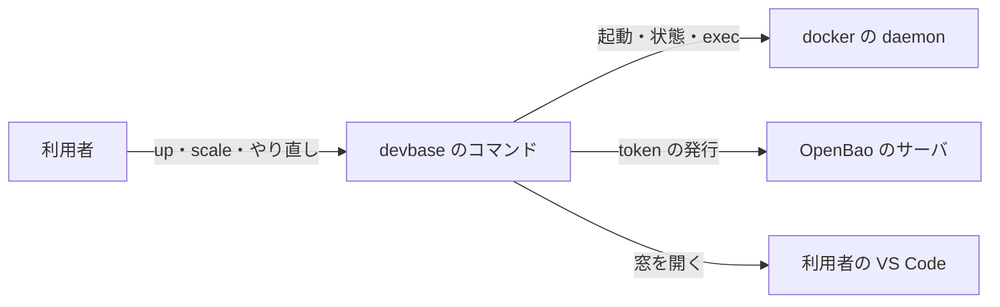
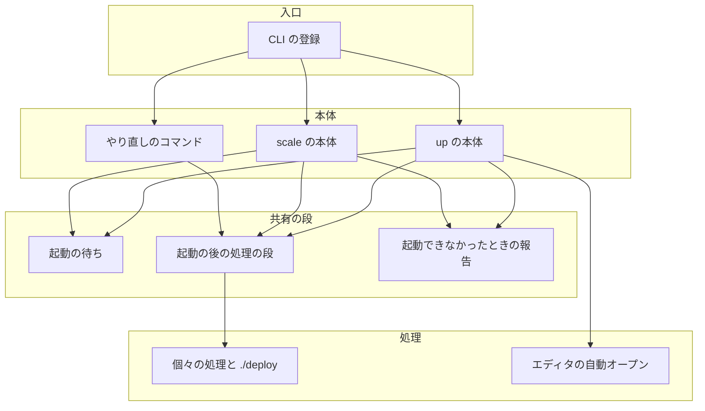
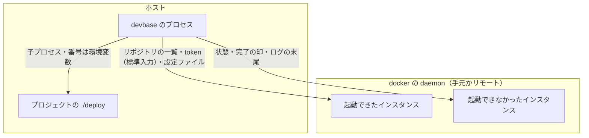
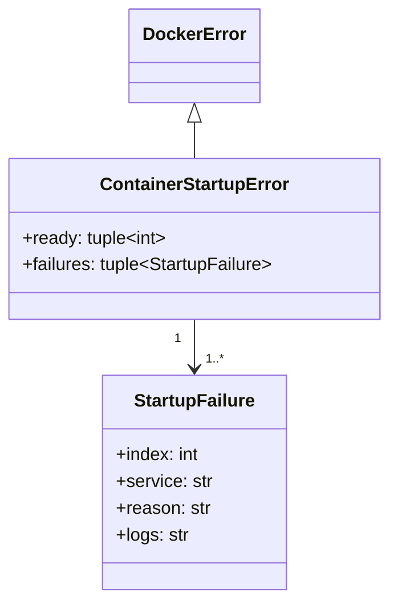
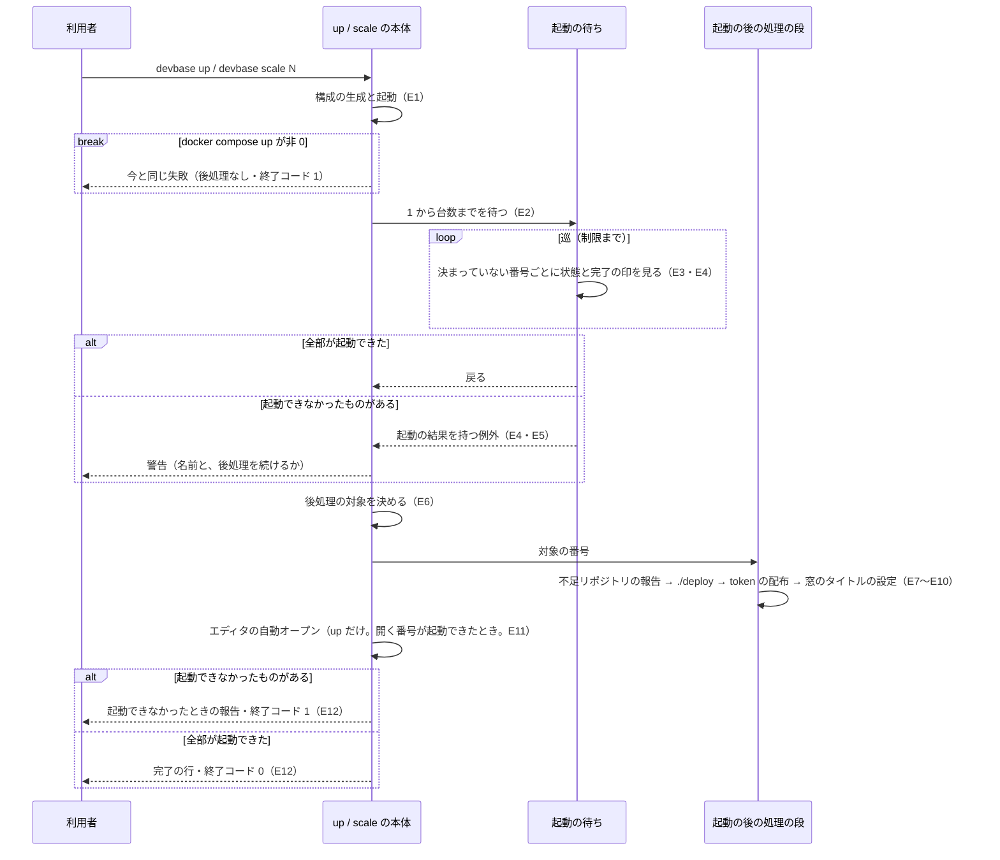
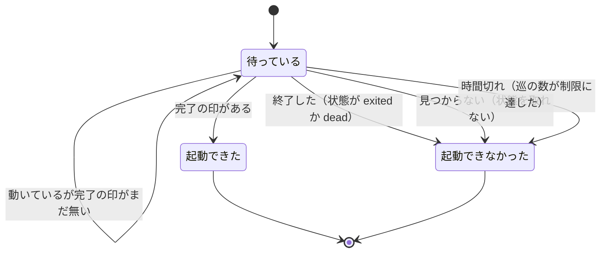
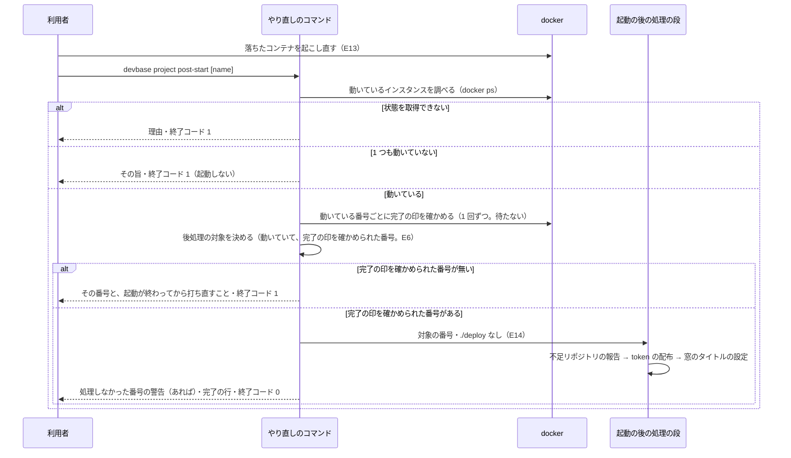

# #224・#371: 起動の後の処理を 1 つの段にまとめ、起動できなかったインスタンスがあっても届ける

要求と受け入れ条件は #224 の本文にある（コピーは [issue-224-requirements.md](issue-224-requirements.md)。
#371 の分もそこにまとめてある）。この文書は「どう作るか」だけを扱う。決定の記録は
[issue-224-design-decisions.md](issue-224-design-decisions.md) に分けた。

要求が設計へ委ねた未決には、次の決定で答える。採否は設計の Pull Request の承認で確定する。

| 要求の未決 | 設計の答え | 決定 |
| --- | --- | --- |
| 1. 起動できなかったインスタンスがあるときの直し方 | 起動できたインスタンスへ後処理を行ってから失敗として終える。加えて、処理だけをやり直すコマンドを用意する | 決定 1 |
| 2. やり直す手段の形と名前 | 新しいサブコマンド `devbase project post-start [name]` | 決定 2 |
| 3. やり直す手段が `./deploy` を走らせるか | 走らせない（要求の前提 10 のまま。承認で決めるための材料を決定 3 に並べた） | 決定 3 |
| 4. `scale` の `./deploy` と token の配布の順 | `up` に合わせて入れ替える | 決定 4 |
| 5. 開く番号のインスタンスが起動できなかったときのエディタ | 開かず、ほかの番号へ替えない | 決定 5 |
| 6. 実物の docker で 1 台を終了させる方法 | 使い捨てのプロジェクトの起動コマンドを包み、印を置いた番号だけを終了させる | 決定 10 |

## ドメインモデル

### コンテキスト

| コンテキスト | 何の語が 1 つの意味に決まるか |
| --- | --- |
| 起動の後の処理（`post-start`） | 起動の待ち・起動の結果・起動できた / 起動できなかったインスタンス・後処理の対象・インスタンスごとの処理・起動の後の処理のやり直し |

変更は 1 つのコンテキストで閉じる。ほかの 3 つのコンテキストには順応者として接し、そのモデルを変えない。

- エディタで開く（`editor`）: 窓のタイトルの設定と、動いているインスタンスの調べ方をそのまま使う
- 機密の置き場（`secret`）: token の発行と、コンテナへの書き込みをそのまま使う
- Compose の構成（`compose`）: 開発サービス名と生成物（`.docker-compose.scale.yml`）をそのまま使う

### 集約

| 集約 | 持ち主（書き換えてよいもの） | 根 | エンティティ | 値オブジェクト |
| --- | --- | --- | --- | --- |
| 起動の結果 | 起動の待ち（`lib/devbase/utils/docker.py`） | 1 回の待ちの結果 | インスタンス（番号で識別する） | 起動できなかった理由・ログの末尾 |
| 起動の後の処理の実行 | `up` / `scale` の本体・やり直しのコマンドと、起動の後の処理の段（どれも `lib/devbase/commands/container.py`） | 1 回の実行 | — | 後処理の対象（番号の集合）・処理の並び |

「起動の後の処理の実行」の中の持ち分は次のとおりである。後処理の対象を決めるのは、`up` / `scale` の本体と
やり直しのコマンド（`cmd_up`・`cmd_scale`・`cmd_post_start`）だけである（E6）。起動の後の処理の段（`_run_post_start`）は、
決まった対象を引数で受け取り、処理の並びをその順に行うだけで、対象を自分で決めず、受け取った対象へ番号を足しも
引きもしない。

どちらの集約も 1 回のコマンドの中だけで生き、保存しない。窓のタイトルの設定ファイルと `~/.vault-token` は
`editor` と `secret` の持ち物で、この変更は書き方を変えない。`project.yml` の `scale` の書き換えも変えない。

### 不変条件

| # | 集約 | 条件 | 破れたときの扱い |
| --- | --- | --- | --- |
| I1 | 起動の結果 | 待った番号（1 から台数まで）はどれも、待ちの終わりに「起動できた」か「起動できなかった（理由は 1 つ）」のどちらか一方に決まる | 決まらない番号が後処理から漏れるか、起動していないものへ処理が走る。テストが落とす |
| I2 | 起動の結果 | あるインスタンスが起動できなかったと決まっても、ほかのインスタンスの待ちを打ち切らない | 番号の小さい 1 台が落ちると、後から起動できるインスタンスへ処理が届かない。テストが落とす |
| I3 | 起動の結果 | 待ちの巡の数は今の制限（60）を超えない。決まったインスタンスへは、その後の巡で問い合わせない（1 巡の docker の呼び出しはインスタンスあたり 2 回まで） | 待ちが延びる、または docker の呼び出しが増える。テストが落とす |
| I4 | 起動の後の処理の実行 | インスタンスごとの処理は、後処理の対象の番号にだけ行う。対象は、`up` では起動できたインスタンス、`scale` では増やしたインスタンスのうち起動できたもの、やり直しでは、動いていて entrypoint の完了の印を確かめられたインスタンスである | 起動できなかったインスタンス・`scale` の既存のインスタンス・entrypoint が終わっていないインスタンスへ処理が走る。テストが落とす |
| I5 | 起動の後の処理の実行 | インスタンスごとの処理の順は、不足リポジトリの報告 → `./deploy` → token の配布 → 窓のタイトルの設定で、`up` と `scale` で同じである。やり直しは同じ順から `./deploy` を除く | 2 つのコマンドの処理が再びずれる。テストが落とす |
| I6 | 起動の後の処理の実行 | 後処理の対象が空なら、処理を 1 つも行わない | 届け先が無いのに token を発行する。テストが落とす |
| I7 | 起動の後の処理の実行 | 起動できなかったインスタンスが 1 つでもあれば、`up` / `scale` は終了コード 1 で終わり、完了の行を出さず、起動できなかった全部の名前・理由と補う手順を出す | 欠けたことが利用者に伝わらない。テストが落とす |
| I8 | 起動の後の処理の実行 | `up` / `scale` は起動の待ちより後に、やり直しはどの時点でも、コンテナを起動・停止・削除しない | 起動できたインスタンスが止まる、または作り直される。テストが落とす |
| I9 | 起動の後の処理の実行 | エディタの自動オープンは、開く番号のインスタンスが起動できたときだけ行い、ほかの番号へ替えない | 利用者が指定していないインスタンスの窓が開く。テストが落とす |
| I10 | 起動の後の処理の実行 | やり直しは `./deploy` を走らせず、エディタを開かない | `./deploy` が済んだインスタンスで、要求（受け入れ条件 B6）に反して `./deploy` がもう一度走る。テストが落とす |
| I11 | 起動の後の処理の実行 | token を書く先は後処理の対象のコンテナに限り、token の値を出力・ログ・`docker exec` の引数・環境変数に載せない | 対象でないコンテナへ token が渡る、または値が漏れる。テストが落とす |

### ドメインイベント

| # | イベント | 発生元 | 受け手 |
| --- | --- | --- | --- |
| E1 | コンテナを起動した | `up` / `scale` の本体 | 起動の待ち |
| E2 | 起動の待ちを始めた | 起動の待ち | 起動の待ち（番号ごとの確認） |
| E3 | インスタンスが起動できた | 起動の待ち | 起動の結果（起動できた側へ入れる） |
| E4 | インスタンスが起動できなかった（終了した・見つからない） | 起動の待ち | 起動の結果（理由とログの末尾を入れる）。ほかの番号の待ちは続ける |
| E5 | 制限時間が切れた | 起動の待ち | 起動の結果（決まっていない番号を時間切れとして入れる） |
| E6 | 後処理の対象を決めた | `up` / `scale` の本体・やり直しのコマンド | 起動の後の処理の段 |
| E7 | 不足リポジトリを報告した | 起動の後の処理の段 | 利用者（警告の行） |
| E8 | `./deploy` を走らせた | 起動の後の処理の段 | プロジェクトの `./deploy`（子プロセス） |
| E9 | token を配った | 起動の後の処理の段 | 対象のコンテナの `~/.vault-token` |
| E10 | 窓のタイトルを設定した | 起動の後の処理の段 | 対象のコンテナの VS Code の設定ファイル |
| E11 | エディタを開いた | `up` の本体 | 利用者の VS Code |
| E12 | 結果を報告して終えた | `up` / `scale` の本体 | 利用者（出力と終了コード） |
| E13 | 利用者が、落ちたインスタンスを起こし直した | 利用者（`docker start` など） | やり直しのコマンド（利用者が続けて打つことで受ける。devbase は自分では受けない） |
| E14 | 起動の後の処理をやり直した | やり直しのコマンド | 起動の後の処理の段 |

### 用語

| 用語 | 意味 | 用語集への反映 |
| --- | --- | --- |
| 起動の後の処理 | `up` と `scale` が、起動の待ちの後にホストの側から行う処理の並び | 追加済み（`post-start`、要求の段階） |
| インスタンスごとの処理 | 起動の後の処理のうち、インスタンスの 1 つ 1 つに行う 4 つ | 追加済み（`post-start`、要求の段階） |
| 起動の待ち | 起動したインスタンスの entrypoint の完了を、制限時間まで待つ段 | 追加済み（`post-start`、要求の段階） |
| 起動できたインスタンス | 起動の待ちで、entrypoint の完了を確かめられたインスタンス | 追加済み（`post-start`、要求の段階） |
| 起動できなかったインスタンス | 起動の待ちで、終了した・見つからない・時間切れのどれかに当たったインスタンス | 追加済み（`post-start`、要求の段階） |
| 増やしたインスタンス | `devbase scale` が足した番号のインスタンス | 追加済み（`post-start`、要求の段階） |
| 後処理の対象 | インスタンスごとの処理を行うインスタンスの集合。`up` は起動できたインスタンス、`scale` は増やしたインスタンスのうち起動できたもの、やり直しは動いていて entrypoint の完了の印を確かめられたインスタンス | 意味の変更（`post-start`。やり直しの対象を足す） |
| 起動の結果 | 起動の待ちが決めた、インスタンスごとの「起動できた」「起動できなかった（理由つき）」の内訳 | 追加（`post-start`） |
| 起動できなかった理由 | 起動できなかったインスタンスに 1 つ付く区分。終了した・見つからない・時間切れの 3 つ | 追加（`post-start`） |
| 起動の後の処理の段 | 後処理の対象を受けて、インスタンスごとの処理を決まった順に行う 1 つの関数 | 追加（`post-start`） |
| 起動の後の処理のやり直し | 動いていて entrypoint の完了の印を確かめられたインスタンスへ、インスタンスごとの処理から `./deploy` を除いた 3 つを行い直すコマンド（`devbase project post-start`） | 追加（`post-start`） |

## 機能一覧

| # | 機能 | 誰が使うか |
| --- | --- | --- |
| F1 | `devbase scale` で増やしたインスタンスにも、`up` と同じ起動の後の処理が届く | 開発者 |
| F2 | 1 台が起動できなくても、起動できたインスタンスには起動の後の処理が届く（`up` / `scale`） | 開発者 |
| F3 | 起動できなかったインスタンスの名前・理由と、補う手順を出力で知る | 開発者 |
| F4 | 動いていて entrypoint が終わっているインスタンスへ、コンテナを作り直さずに起動の後の処理をやり直す | 開発者 |
| F5 | `scale` の後処理・起動できなかったときの振る舞い・やり直しのコマンドを文書で調べる | 開発者 |

## 構成要素

| 要素 | 責務 | 新設 / 変更 | 機能 |
| --- | --- | --- | --- |
| 起動の待ち（`lib/devbase/utils/docker.py` の `wait_for_containers_ready`） | 1 から台数までの番号を、巡ごとに状態と完了の印で確かめる。全部が起動できたら戻る。起動できなかった番号があれば、残りを制限まで待った後に、起動の結果を持つ例外を投げる | 変更 | F2・F3 |
| 起動の結果の型（同ファイルの `StartupFailure`・`ContainerStartupError`） | 起動できた番号と、起動できなかった番号ごとの理由・ログの末尾を運ぶ。利用者へ出す文言（名前・理由・ログ）を組み立てる | 新設 | F2・F3 |
| 起動の後の処理の段（`lib/devbase/commands/container.py` の `_run_post_start`） | 後処理の対象を受け、インスタンスごとの処理を決まった順に呼ぶ。対象は呼び出し元が決め、段は決めない。対象が空なら何も呼ばない。`./deploy` を走らせるかを引数で受ける | 新設 | F1・F2・F4 |
| 個々の処理（同ファイルの `_report_missing_repos`・`_push_bao_token`・`_apply_window_titles`） | 対象の番号の並びを受ける引数を足す。渡されなければ今と同じ範囲に行う | 変更 | F1・F2 |
| エディタの自動オープン（同ファイルの `_maybe_open_editor`） | 起動できた番号の並びを受ける引数を足す。開く番号がそこに無ければ、警告して開かない | 変更 | F2 |
| `up` の本体（`cmd_up`） | 起動の待ちの例外を受けて後処理の対象を決め、段とエディタの自動オープンを呼ぶ。起動できなかったものがあれば報告して 1 で終わる | 変更 | F2・F3 |
| `scale` の本体（`cmd_scale`） | 同じく例外を受け、増やしたインスタンスのうち起動できたものを対象に段を呼ぶ。個別に呼んでいた token の配布と `./deploy` を段へ置き換える | 変更 | F1・F2・F3 |
| 起動できなかったときの報告（`_report_startup_failure`） | `Deploy failed` / `Scale failed` の行、起動できなかった番号ごとの名前・理由・ログ、補う手順を出す | 新設 | F3 |
| やり直しのコマンド（`cmd_post_start`） | 接続先と機密を用意し、動いているインスタンスを調べ、その 1 つ 1 つの完了の印（`/tmp/entrypoint-ready`）を確かめて後処理の対象を決め、段を `./deploy` なしで呼ぶ | 新設 | F4 |
| CLI の登録（`lib/devbase/cli.py`・`bin/devbase`・`_dispatch_lifecycle`・`etc/` の補完 2 つ） | `project` グループへ `post-start [name] [--context NAME]` を足す | 変更 | F4 |
| テスト（`tests/utils/`・`tests/commands/`・`tests/cli/`） | 「テスト設計」の行を縛る | 新設・変更 | — |
| 利用者向けの文書と `CHANGELOG.md` | CLI リファレンス（目次、`up`・`scale`・`post-start` の節、`[name]` を取るサブコマンドの一覧）、コンテナ操作ガイドの同じ一覧、環境変数ガイドの「ウィンドウタイトル」の節、`[Unreleased]` の記入 | 変更 | F5 |
| 確定仕様（`docs/specifications/` の `compose-profiles.md`・`cli-argument-resolution.md`・`secret-backend.md`） | `compose-profiles.md` と `cli-argument-resolution.md` は、`scale` の後処理の順序の記述と、`[name]` を取るサブコマンドの一覧を直す。`secret-backend.md` は、`~/.vault-token` を書く経路の記述（token を渡す表の「いつ」の列とその下の箇条書き、構成要素の表の「`up` / `scale` の前処理と後処理」の行、テストの一覧）を直す。書き手に `devbase project post-start` を足し、`up` / `scale` の書き先を後処理の対象（`up` は起動できたインスタンス、`scale` は増やしたインスタンスのうち起動できたもの）に絞る | 変更 | F5 |
| 用語集（`docs/glossary/glossary.json` と `docs/glossary.md`） | 4 語を足し、1 語の意味を変える | 変更（設計の Pull Request で行う） | — |

起動の待ちが 1 台目で打ち切るために使っていた補助（`check_containers_running`）は、呼び出し元が無くなるため外す
（`grep -rn check_containers_running lib tests` の結果は、`lib/devbase/utils/docker.py` の定義と、起動の待ちからの呼び出しの 2 行）。

**`project` グループのサブコマンドの集合へ `post-start` を足すため、その集合を前提にした既存の規則を確かめた。**
当てはまらない規則は次のとおりで、どれも上の表の「CLI の登録」「利用者向けの文書」「確定仕様」に含めた。

- 前方一致の展開の一覧（`cli.py` の `SUBCMD_MAP` の `project`）と、`project` の parser の登録
- `[name]` をラッパーが解決するサブコマンドの一覧（`bin/devbase` の `_PROJECT_NAME_SUBCOMMANDS`）
- 入口の振り分け（`_dispatch_lifecycle` の `handlers`）
- 補完のサブコマンドの一覧（`etc/devbase-completion.bash` の `project_subcommands` と、`etc/_devbase` の `project` の一覧）
- `[name]` を取るサブコマンドを並べた文書（CLI リファレンスの目次と `project` グループの冒頭、コンテナ操作ガイドの冒頭、確定仕様の `compose-profiles.md` と `cli-argument-resolution.md`）

トップレベルの短縮形（`SHORTCUTS`・`_NAME_RESOLVABLE_SHORTCUTS`）、`container` グループ、TUI の操作の一覧には
足さない（決定 2）。

**`~/.vault-token` を書く経路が変わるため、書き手を列挙している確定仕様も確かめた。**
`docs/specifications/secret-backend.md` は、書く経路を「`up` の [5/6] の後（`scale` は増やしたインスタンスだけ）と
`env token`」と列挙している。この変更は書き手に `devbase project post-start` を足し、`up` / `scale` の書き先を
後処理の対象に絞るため、上の表の「確定仕様」の行に含めた。

### 文脈



外部の系は docker の daemon・OpenBao のサーバ・VS Code の 3 つで、どれも変えない。`./deploy` は利用者のプロジェクトが持つスクリプトで、devbase は呼ぶだけである。

### 構成要素の関係



| 呼ばれる要素 | 呼び出し元 |
| --- | --- |
| `up` の本体・`scale` の本体・やり直しのコマンド | CLI の登録（入口の振り分け） |
| 起動の待ち | `up` の本体（起動の段 `_run_deploy_pipeline` を通す）・`scale` の本体（起動の段 `_run_scale_pipeline` を通す） |
| 起動の後の処理の段 | `up` の本体・`scale` の本体・やり直しのコマンド |
| 起動できなかったときの報告 | `up` の本体・`scale` の本体 |
| 個々の処理と `./deploy` | 起動の後の処理の段 |
| エディタの自動オープン | `up` の本体 |

起動の結果の型は、起動の待ちが作り、`up` / `scale` の本体と報告が読む。テスト・文書・確定仕様・用語集は呼び出しの関係を持たない。

### 配置



配置は変えない。境界をまたいで届く token は、今と同じく `docker exec` の標準入力だけで渡す。

### 置き場所

```text
lib/devbase/
├── utils/docker.py                  # 起動の待ちを変える。起動の結果の型を足す
├── commands/container.py            # 段・報告・やり直しのコマンドを足す。up / scale の本体と個々の処理を変える
└── cli.py                           # project post-start を登録する
bin/devbase                          # [name] を解決するサブコマンドの一覧
etc/
├── devbase-completion.bash          # project のサブコマンドと post-start の補完
└── _devbase                         # 同上（zsh）
tests/
├── utils/test_wait_for_containers.py        # 新設（起動の待ち）
├── commands/test_container_post_start.py    # 新設（up / scale の後処理と報告・やり直し）
├── commands/test_container_scale_order.py   # 2 つのテストを書き換える（テスト設計）
└── cli/test_post_start_command.py           # 新設（登録・補完・ラッパーの一覧）
docs/
├── user/                            # cli-reference（README.md・02-project.md）・environment-variables.md・container-operations.md
├── specifications/                  # compose-profiles.md・cli-argument-resolution.md・secret-backend.md
└── glossary/glossary.json           # glossary.md は render で作り直す
CHANGELOG.md
```

## 構造



`ready` と `failures` は番号の昇順で、合わせると待った番号の全部になる（I1）。`reason` は起動できなかった理由の
3 つの値（`exited`・`not_found`・`timeout`）のどれかで、`logs` は `exited` のときだけ中身を持つ。

| 関数 | 入力 | 出力 | 失敗 |
| --- | --- | --- | --- |
| `wait_for_containers_ready(container_prefix, scale, ready_file, timeout, compose_file)` | 今と同じ | 全部が起動できたら `True` | 起動できなかった番号が 1 つ以上: `ContainerStartupError` |
| `_run_post_start(project_name, scale, indices, dev_service_name, config, compose_file, run_deploy=True)` | 後処理の対象の番号の並び | 無し（出力は個々の処理が出す） | 投げない。個々の処理の失敗は今のまま警告か debug のログにとどまる（前提 5） |
| `_report_missing_repos(...)`・`_push_bao_token(...)`・`_apply_window_titles(...)` | 今の引数に、キーワード引数 `indices`（既定 `None`）を足す | 無し | 今と同じ |
| `_maybe_open_editor(...)` | 今の引数に、キーワード引数 `started`（既定 `None`。起動できた番号の並び）を足す | 無し | 今と同じ |
| `_report_startup_failure(label, error, project_name)` | `Deploy` か `Scale`、起動の待ちの例外、プロジェクト名 | 無し（ログへ出す） | 投げない |
| `cmd_post_start(project_name=None, context=None)` | プロジェクト名と接続先（どちらも省略できる） | 終了コード 0 / 1 | 終了コードで返す（入出力の契約） |

`up` と `scale` の起動の段（`_run_deploy_pipeline`・`_run_scale_pipeline`）は、戻り値も、起動の待ちを最後に呼ぶことも
変えない。起動の待ちの例外はそのまま通し、`up` / `scale` の本体が受ける。例外を受けた本体は、後処理へ渡す
構成のファイルとして生成物の決まった置き場（`.docker-compose.scale.yml`）を使う。

## 入出力の契約

### 起動の待ち（関数）

| 項目 | 内容 |
| --- | --- |
| 名前 | `wait_for_containers_ready` |
| 入力 | 今と同じ（開発サービス名・台数・完了の印のパス・制限・構成のファイル） |
| 出力 | 全部が起動できたら `True`（今と同じ） |
| 失敗の形 | 起動できなかった番号が 1 つ以上あれば `ContainerStartupError`。文言は下の形 |
| 互換性 | 引数と成功時の戻り値は変わらない。例外は `DockerError` の派生で、今の `except DevbaseError` がそのまま受ける。文言は 1 台分から全部の分へ変わる |

```text
Container startup failed: 2 of 3 instances did not become ready.
  - dev-2: exited unexpectedly
    Last logs:
    <そのコンテナのログの末尾。10 行まで>
  - dev-3: timeout (60s) waiting for the entrypoint to complete
```

| 起動できなかった理由 | 決まる条件 | 番号の行の文言 |
| --- | --- | --- |
| 終了した（`exited`） | 状態が `exited` か `dead` を含む | `exited unexpectedly` と、続く `Last logs:` とログの末尾 |
| 見つからない（`not_found`） | 状態を取れない | `container not found` |
| 時間切れ（`timeout`） | 巡の数が制限に達した時点で、完了の印を確かめられていない | `timeout (<制限>s) waiting for the entrypoint to complete` |

### `up` と `scale` の出力と終了コード

| 場合 | 後処理 | 出力 | 終了コード |
| --- | --- | --- | --- |
| 全部が起動できた | 後処理の対象の全部へ行う | 今と同じ完了の行（`scale` は `devbase login <番号>` の行も） | 0 |
| 起動できなかったものがあり、後処理の対象（I4）が空でない | 後処理の対象へ行う。エディタは I9 に従う | 続ける旨の警告（処理先として後処理の対象の名前を出す） → 個々の処理の出力 → 報告 | 1 |
| 起動できなかったものがあり、後処理の対象が空である | 行わない（I6） | 行わない旨の警告（処理先の名前を出さない） → 報告 | 1 |
| `docker compose up` が非 0（前提 6） | 行わない | 今と同じ | 1 |
| 内訳を持たない失敗（構成の生成の失敗など） | 行わない | 今と同じ `Deploy failed: ...` / `Scale failed: ...` | 1 |

場合は「起動できたものがあるか」ではなく「後処理の対象が空か」で分ける。`scale` では、起動できたインスタンスと
後処理の対象が一致しないためである（既存のインスタンスは起動できていても対象に入らない）。

| 例 | 起動できたインスタンス | 後処理の対象 | 1 行目の警告 |
| --- | --- | --- | --- |
| `up`（台数 2）で `dev-2` が終了した | `dev-1` | `dev-1` | 続ける旨（処理先は `dev-1`） |
| `up`（台数 2）で全部が起動できなかった | 無し | 空 | 行わない旨 |
| `scale`（1 から 3）で増やした `dev-3` が起動できなかった | `dev-1`・`dev-2` | `dev-2` | 続ける旨（処理先は `dev-2` だけ。`dev-1` は出さない） |
| `scale`（1 から 3）で既存の `dev-1` が終了した | `dev-2`・`dev-3` | `dev-2`・`dev-3` | 続ける旨（処理先は `dev-2`・`dev-3`） |
| `scale`（1 から 2）で増やした `dev-2` が起動できなかった | `dev-1` | 空 | 行わない旨（`dev-1` へ続けるとは出さない） |

出力は次の形になり、報告（`Deploy failed` 以降）を最後に置く（`up` でプロジェクト `myapp` の `dev-2` が終了した例）。

```text
起動できなかったインスタンスがあります: dev-2。dev-1 へ起動の後の処理を続けます
…（個々の処理の出力）…
Deploy failed: Container startup failed: 1 of 2 instances did not become ready.
  - dev-2: exited unexpectedly
    Last logs:
    …
起動できなかったインスタンスには、起動の後の処理を行っていません。補う手順:
  落ちたコンテナを起こし直し、その起動が終わった後に、次のコマンドで起動の後の処理をやり直します（./deploy は走りません）
  devbase project post-start myapp
  docker start で起こし直しただけでは、起動の後の処理（token の配布・窓のタイトルの設定など）は行われません
  ./deploy を含めて最初からやり直すには devbase up myapp を打ちます（全インスタンスを作り直します）
```

後処理の対象が空のときは、1 行目が次の形になり、個々の処理の出力は無い（`scale`（1 から 2）で `dev-2` が終了した例）。

```text
起動できなかったインスタンスがあります: dev-2。起動の後の処理を行うインスタンスが無いため、起動の後の処理は行いません
```

- 1 行目は警告、`Deploy failed` 以降はエラーの水準で出す。`scale` では `Deploy failed` が `Scale failed` になる
- 1 行目の処理先に出す名前は、後処理の対象の名前だけである。起動できていても対象でないインスタンス（`scale` の既存の
  インスタンス）の名前を、処理先として出さない
- テストが縛るのは、`Deploy failed` / `Scale failed`、起動できなかった全部の名前と理由、コマンドだけの行
  （`devbase project post-start <プロジェクト名>`）、`docker start` では行われない旨の文、1 行目の処理先の名前
  （後処理の対象と一致する。対象が空なら処理先の名前が出ない）の 5 つである
- プロジェクト名は、既存の案内（`devbase project logs <プロジェクト名>`）と同じ値を使う

### やり直しのコマンド

| 項目 | 内容 |
| --- | --- |
| 名前 | `devbase project post-start [name] [--context NAME]` |
| 入力 | `name`: 対象のプロジェクト（省略時は実行時のディレクトリ）。`--context`: 接続先（ほかの `project` のサブコマンドと同じ） |
| 出力 | 個々の処理の出力（不足リポジトリの警告・token を書いたコンテナ名）、処理しなかった番号の警告（動いていない番号と、entrypoint の完了を確かめられない番号を、理由を分けて出す）、完了の行（`=== Post-start completed ===`） |
| 失敗の形 | 下の表 |
| 互換性 | 新設。既存のコマンド・オプション・環境変数は変えない。前方一致は `project po` で解決され、`project p`（`ps`）と `project pr`（`profile`）は今のままである |

| 状態 | 動き | 終了コード |
| --- | --- | --- |
| 後処理の対象（動いていて、完了の印を確かめられたインスタンス）が 1 つ以上ある | それらへ、不足リポジトリの報告 → token の配布 → 窓のタイトルの設定を行う。`project.yml` の `scale` までの番号のうち、動いていないものと、動いているが完了の印を確かめられないものを、理由を分けて警告で出す。後者には、起動が終わってからもう一度打つことを添える | 0 |
| 動いているインスタンスはあるが、完了の印を確かめられたものが 1 つも無い | 処理を行わず、その番号と、起動が終わってからもう一度打つことを出す。完了を待たない | 1 |
| 1 つも動いていない | 処理を行わず、その旨と、起動には `devbase up` を使うことを出す。起動しない | 1 |
| 状態を取得できない（docker の daemon に届かない） | 処理を行わない | 1 |
| プロジェクトか接続先を解決できない | ほかの `project` のサブコマンドと同じ | 1 |

やり直しの対象は、`up` / `scale` と同じ 2 つの印（コンテナの状態と、コンテナの中の `/tmp/entrypoint-ready`。要求の前提 4）で
決める（決定 13）。`docker start` で起こし直した直後は entrypoint がまだ走っていて、リポジトリの clone も終わっていない。その時点で
処理を行うと、不足リポジトリを誤って報告し、用意の途中のホームへ token と窓のタイトルを書くことになるためである。

- 完了の印は、動いているインスタンスごとに 1 回だけ確かめる（`docker exec <コンテナ> test -f /tmp/entrypoint-ready`）。
  待たず、繰り返さない。対象を決めるための docker の呼び出しは、`docker ps` の 1 回と、動いているインスタンスあたり 1 回になる
- 確認の呼び出しそのものが失敗した番号は、完了の印を確かめられない番号として扱う（処理しない側へ倒す）
- 完了の印を確かめられない番号は、動いていない番号と同じく警告に出し、処理を行わない。終了コードは、後処理の対象が
  1 つ以上あれば 0、空なら 1 である（決定 11）

接続先の反映と機密の用意は `devbase project login` と同じ手順（`_prepare_compose`）で行う。グループの宣言の検査と
`project.yml` の書き換えは行わない（ボリュームも構成も作らないため）。

## 処理の流れ

### `up` と `scale`



2 つのコマンドの違いは次の 3 点だけである。

| 項目 | `up` | `scale` |
| --- | --- | --- |
| 待つ番号 | 1 から台数まで | 1 から新しい台数まで（既存のインスタンスを含む） |
| 後処理の対象 | 起動できたインスタンス | 増やしたインスタンスのうち起動できたもの |
| エディタの自動オープン | 行う（I9） | 行わない |

### 起動の待ちの中のインスタンスの状態



「起動できた」「起動できなかった」から「待っている」へ戻る遷移は無い（I3）。起動できたと決まった後に
終了したインスタンスは、個々の処理が今の扱い（警告か無言）で飛ばす（前提 5）。

1 巡では、決まっていない番号ごとに、状態の確認（`docker compose ps`）を 1 回、動いていれば完了の確認（`docker compose exec ... test -f`）を 1 回行う。
終了した番号のログの末尾は、決まったときに 1 回だけ取る。決まっていない番号が残っていれば 1 秒休んで次の巡へ進み、巡の数が制限に達したら終える。

### やり直し



処理の流れの図に含めない構成要素は、CLI の登録・テスト・利用者向けの文書・確定仕様・用語集である。
起動の結果の型は「起動の結果を持つ例外」として、起動できなかったときの報告は「起動できなかったときの報告」として現れる。

## 非機能の実現方式

| 大項目 | 要求の条件 | 実現方式 | 確かめ方 |
| --- | --- | --- | --- |
| 性能・拡張性 | 起動の待ちの制限時間（60 秒）を超えて待たない。全インスタンスが起動できたとき、待ちの 1 巡で docker を呼ぶ回数はインスタンスあたり 2 回（状態の確認と完了の確認）を超えない。1 台が落ちた `up` / `scale` が終わるまでの時間は、残りのインスタンスの完了を待つ分だけ延びる（最長で制限時間まで） | 巡の数の上限を今の 60 のまま変えず、1 台が落ちても延ばさない（決定 8）。決まった番号へは問い合わせ直さず、決まっていない番号だけを、状態 1 回と完了の印 1 回で確かめる（I3） | 関数のテストで、巡ごとの docker の呼び出しを数える。制限に達した巡で終わることを見る |
| 運用・保守性 | 起動できなかったインスタンスごとに、名前と理由（終了した・見つからない・時間切れ）が出力に出る。利用者は出力だけで、どのインスタンスの何が欠けたかと、次に打つコマンドを読み取れる | 起動の結果の型が全部の名前・理由・ログの末尾を文言にし、報告がコマンドだけの行を出す（入出力の契約）。報告は出力の最後に置く（決定 12） | 受け入れ条件 10〜15 のテストと、受け入れ条件 24 の実物の docker での出力 |
| セキュリティ | token を書く先は、後処理の対象（やり直しでは、対象のプロジェクトの動いているインスタンス）に限る。token の値を、出力・ログ・`docker exec` の引数・コンテナの環境変数に載せない（今のまま） | 段が、対象の番号だけを token の配布へ渡す。やり直しは、プロジェクトのラベルと開発サービス名の形で絞った `docker ps` の番号のうち、完了の印を確かめられたものだけを渡す。値の受け渡しは今の書き込み（標準入力）を変えない（I11） | 書き込み先のコンテナ名を見るテストと、出力に値が無いことを見るテスト |

## テスト設計

コマンドの水準のテストは、今の `tests/commands/` と同じく docker と `subprocess` を差し替え、実物の docker と
実物の `DEVBASE_ROOT` に触れない（前提 9）。起動の結果は、起動の待ちを差し替えて例外を投げさせて作る。

| 受け入れ条件・不変条件 | どの振る舞いで縛るか | どう壊したら落ちるべきか |
| --- | --- | --- |
| 受け入れ条件 1・5 | `scale` を 1 から 3 にすると、`dev-2` と `dev-3` に、それぞれの実コンテナ名で始まるタイトルが設定される。`DEVBASE_WINDOW_TITLE=off` ではどの番号にも設定されない | `scale` の本体から段の呼び出しを外す。止める値を読まずに設定する |
| 受け入れ条件 2・I4 | `scale` を 1 から 3 にしたとき、`dev-1` を対象にした処理の呼び出しが、4 つの処理のどれにも無い | 段へ 1 から全部の番号を渡す |
| 受け入れ条件 3・4 | 増やしたインスタンスの `/work` にリポジトリが無いと `up` と同じ文言の警告が出る。揃っていれば不足の警告が 1 行も出ない | `scale` から不足リポジトリの報告を外す。既存の番号も報告する |
| 受け入れ条件 6・7・I5 | `scale`（1 から 3）の処理が、不足リポジトリの報告 → `./deploy` → token の配布 → 窓のタイトルの設定の順で `dev-2`・`dev-3` に行われ、`up`（台数 2）が `dev-2` に行う処理の並びと一致する | `scale` の token の配布と `./deploy` の順を今のまま残す。段の中の順を入れ替える |
| 受け入れ条件 8 | 全部が起動できた `scale` は 0 で終わり、完了の行と `devbase login <番号>` の行を出し、エディタを開かない | 完了の行を消す。`scale` がエディタを開く |
| 受け入れ条件 9 | 全部が起動できた `up`（台数 2）は、`dev-1` と `dev-2` に 4 つの処理を今と同じ順で行い、エディタを今と同じ条件で開き、0 と完了の行で終わる | 段が対象の一部を落とす。エディタへ渡す引数を変える |
| 受け入れ条件 10・17・18・I7 | 1 台が起動できなかった（`up` の `dev-2`、`scale` の増やした `dev-3`、`scale` の既存の `dev-1`）とき、1 で終わり、`Deploy failed` / `Scale failed` とその名前が出て、完了の行が出ない | 起動できなかったものがあっても 0 を返す。完了の行を出す。既存の番号の失敗を読み捨てる |
| 受け入れ条件 11・12・13・I1 | 起動の待ちの関数で、最初の巡に `dev-2` と `dev-3` が終了していると、例外の内訳と文言に両方の名前・理由・ログの末尾が入る。制限まで完了の印が無い番号は時間切れとして名前が入る。待った番号は、起動できた側とできなかった側のどちらか一方にだけ現れる | 最初の 1 台で打ち切る。時間切れの番号を内訳に入れない。ログの末尾を付けない |
| 受け入れ条件 A2・I2 | 起動の待ちの関数で、`dev-1` が最初の巡で終了し、`dev-2` が後の巡で完了すると、内訳の起動できた側に `dev-2` が入る | 1 台が終了した時点で例外を投げる |
| I3 | 起動の待ちの関数で、1 巡の docker の呼び出しがインスタンスあたり 2 回以下で、決まった番号がその後の巡で問い合わされず、巡の数が制限を超えない | 決まった番号を毎巡問い合わせ直す。制限を超えて巡を続ける |
| 受け入れ条件 14・A1・A5・A6・I4 | `up`（台数 2、`dev-2` が終了）では `dev-1` に 4 つとも行われ（`./deploy` は `DEVBASE_INSTANCE_INDEX=1` で 1 回）、`dev-2` には 1 つも行われない。`scale`（1 から 3、`dev-3` が起動できない）では `dev-2` にだけ行われる。時間切れのときも、起動できた番号にだけ行われる | 起動できなかったものがあると後処理を全部飛ばす。起動できなかった番号も対象に入れる |
| 受け入れ条件 A4・I6 | 全部が起動できなかったとき、処理が 1 つも呼ばれず、エディタも開かず、1 で終わる。`scale`（1 から 2）で増やした `dev-2` が起動できなかったとき（既存の `dev-1` は起動できている）も、処理が 1 つも呼ばれず、1 で終わる | 対象が空でも token の発行へ進む。`scale` で対象が空のときに既存の番号へ処理を行う |
| 出力の契約（1 行目の処理先の名前） | 1 行目の警告に処理先として出る名前が、後処理の対象と一致する。`up`（台数 2、`dev-2` が終了）では `dev-1`、`scale`（1 から 3、`dev-3` が起動できない）では `dev-2` だけで `dev-1` は出ない。`scale`（1 から 2、`dev-2` が起動できない）では、処理先の名前が出ない | 処理先に、起動できた番号の全部を出す。対象が空でも、続ける旨と既存の番号の名前を出す |
| 受け入れ条件 A3・I9 | 開く番号のインスタンスが起動できなかったとき、エディタを開かず、警告が出て、ほかの番号でも開かない。開く番号が起動できていれば、ほかの番号が落ちていても今と同じ条件で開く | 起動できた別の番号へ替えて開く。警告を出さずに飛ばす |
| 受け入れ条件 15・B7 | 起動できなかったインスタンスがある `up` / `scale` の出力に、`devbase project post-start <プロジェクト名>` だけの行と、`docker start` では起動の後の処理が行われない旨の文がある | 手順の行を消す。コマンドを文の途中へ埋める |
| 受け入れ条件 16・I8 | 起動できなかったものがある `up` / `scale` が、起動の待ちより後に `down`・`stop`・`rm` を含む docker の呼び出しをしない。やり直しは `up`・`start`・`down`・`stop`・`rm` を呼ばない | 失敗の後に片付けの停止を足す。やり直しが起動を試みる |
| 受け入れ条件 B1・B5 | `dev-1` と `dev-2` が動いていて、どちらにも完了の印があるときのやり直しは、両方へ窓のタイトルの設定と token の配布を行い、不足リポジトリを `up` と同じ文言で報告し、0 で終わる。2 回続けても、2 回目に渡るタイトルの値と token の書き込みの形（権限 `0600` での置き換え）が 1 回目と同じである | 対象の番号の一部しか段へ渡さない。2 回目で書き込みの形を変える |
| 受け入れ条件 B2・B4・B6・I10 | やり直しは `./deploy` を走らせず、エディタを開かない。動いているインスタンスが無ければ処理を行わず 1 で終わり、コンテナを起動しない。状態を取得できなければ 1 で終わる | やり直しが `./deploy` を走らせる。動いていないときに `up` へ委ねる |
| I4（やり直しの対象）・前提 4 | 台数 3 で `dev-2` が動いているが完了の印が無いとき、やり直しは `dev-1` と `dev-3` にだけ処理を行い（`dev-2` には token の書き込みも無い）、出力に `dev-2` が完了を確かめられない番号として出て、0 で終わる。動いている全部に完了の印が無ければ、処理を 1 つも行わず、token を発行せず、1 で終わる。完了の印の確認は、動いているインスタンスあたり 1 回である | 完了の印を見ずに、動いている番号の全部を段へ渡す。印の無い番号を出力に出さない。印が置かれるまで待つ |
| 受け入れ条件 B8 | 当たらない（やり直しの手段だけを採るときの条件。決定 1） | — |
| 受け入れ条件 B3 | 台数 3 で `dev-2` が動いていないとき（`dev-1` と `dev-3` は動いていて完了の印がある）、やり直しは `dev-1` と `dev-3` にだけ処理を行い、出力に `dev-2` が出る | 1 から台数までの全部へ行う。動いていない番号を出さない |
| I11 | token の書き込み先のコンテナ名が、後処理の対象の番号の実コンテナ名だけである。出力とログに token の値が現れない | 起動できなかった番号にも書く。token の値をログへ出す |
| やり直しのコマンドの登録（決定 2） | `devbase project post-start [name] [--context NAME]` が解釈され、`project po` が展開され、ラッパーの `[name]` を解決する一覧と bash / zsh の補完に現れる。トップレベルと `container` グループには無い | 前方一致の一覧・ラッパーの一覧・補完のどれかから登録を外す |
| 受け入れ条件 19・20・21 | 文書と `CHANGELOG.md` の差分を、実装の Pull Request のレビューで読む | 自動のテストにしない（文書の文言を固定するテストを置かない） |
| 受け入れ条件 22 | 受け入れ条件 1・3・A1・B1 のテストを、実装より先に書いて失敗を見る（変更の前のコードに当てる） | 変更の前のコードで通るテストは、この行を満たさない |
| 受け入れ条件 23 | 下の表のテストだけを書き換え、`env -u DEVBASE_ROOT uv run --locked pytest tests/ -q` が通る | 表に無い既存のテストが 1 件でも落ちる |
| 受け入れ条件 24 | 使い捨てのプロジェクト（台数 2）と実物の docker で、1 台を起動の待ちの間に終了させて `devbase up` を打ち、出力の手順に従う（決定 10）。前後で、起動できたインスタンスのコンテナの ID と起動した時刻が変わらないことも見る（受け入れ条件 B2） | 人と機械が完了判定で 1 回確かめる |

書き換える既存のテストは次の 2 つで、どちらも `tests/commands/test_container_scale_order.py` にある。

| テスト | 固定している今の形 | 書き換える内容 |
| --- | --- | --- |
| `test_scale_runs_the_steps_in_order` | 起動の待ち → token の配布 → `./deploy` の順 | `./deploy` → token の配布の順にする（受け入れ条件 23 に挙がっている順序の変更） |
| `test_scale_hooks_cover_only_the_new_instances` | token の配布の対象を、開始の番号（`start=2`）で渡す | 対象を番号の並びで渡す形にする。固定する条件（増やした番号だけ）は変えない |

2 つ目は、受け入れ条件 23 の括弧に挙がっていない。対象の渡し方が変わるために必要になる書き換えで、要求の境界の
「確認してから行う」に当たるため、設計の Pull Request の承認で確かめる。同じファイルの「起動の待ちが失敗したら
`./deploy` を走らせない」のテストは、内訳を持たない失敗として今のまま通るため、書き換えない。

## 未確認のまま残ること

| 項目 | 内容 |
| --- | --- |
| 窓のタイトルが VS Code に描かれること | 設定ファイルへ値が書かれることまでを機械が確かめる。描画は人が見る（#246 の実環境の確認と併せてよい） |
| 制限時間の数え方 | 制限は巡の数（1 秒の休みを 60 回）で数えており、docker の呼び出しにかかる分だけ実際の時間は 60 秒を超える。今も同じで、この変更では変えない（決定 8）。要求の非機能の条件を実際の時間の意味で読むなら、要求へ戻して決め直す。数え方そのものは #374 で扱う |
| 起こし直したインスタンスの `./deploy` | やり直しは `./deploy` を走らせない（決定 3）。そのインスタンスの `./deploy` を補う道は `devbase up` の打ち直しだけである。確定仕様は `./deploy` を冪等としているため、やり直しで走らせる形も取れる。どちらにするかは、利用者が設計の Pull Request の承認で決める（要求の未決 3。材料は決定 3） |
| リモート扱いの接続先でのやり直し | 接続先の扱いは `devbase project login` と同じ手順を通すが、リモートの実機では確かめていない。受け入れ条件 24 は手元の docker で行う |
| TUI からのやり直し | TUI の操作の一覧には足していない。足すかは利用者が決める |
| 前の起動の完了の印が残っているインスタンス | 完了の印（`/tmp/entrypoint-ready`）は entrypoint が最後に置き、起動のはじめには消さない。一度 entrypoint を終えたコンテナを `docker start` / `docker restart` で起こし直した直後は、entrypoint が走り直している間も前の印が残り、やり直しの対象に入る。起動の待ちの間に終了したインスタンス（印が置かれる前に終了した。この変更が補う場面）には当たらない。印を起動のはじめに消すのは entrypoint の変更で、要求の境界の「行わない」に当たるため、この変更では扱わない |
| 起動できたと決まった後に終了したインスタンス | 個々の処理が今の扱い（警告か無言）で飛ばし、終了コードへ反映しない（前提 5）。見せ方は要求の範囲の外である |
