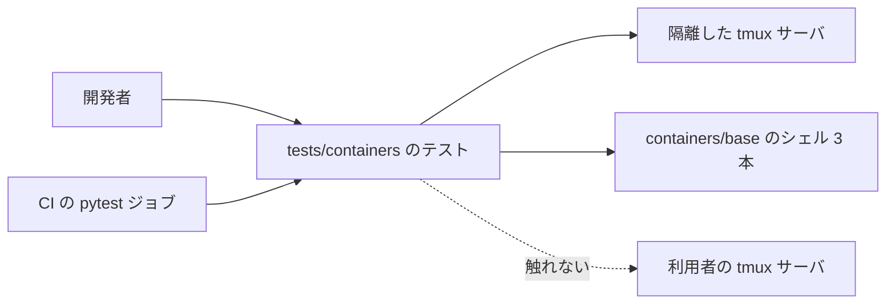
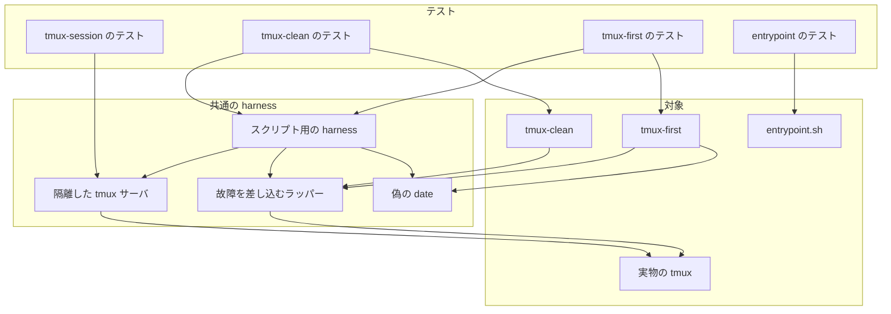
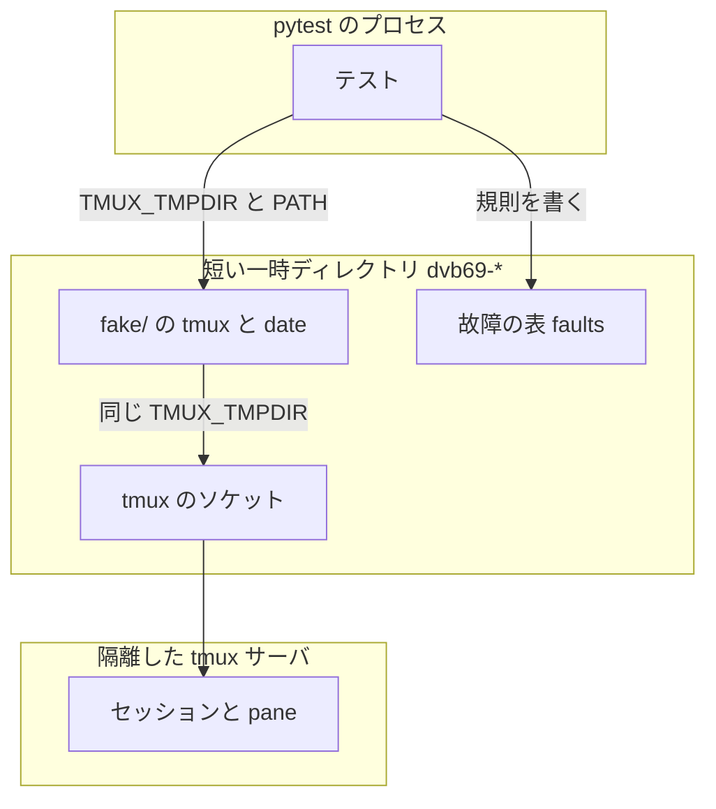
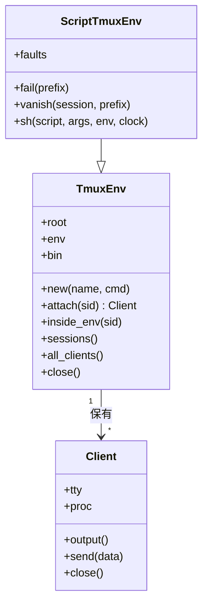
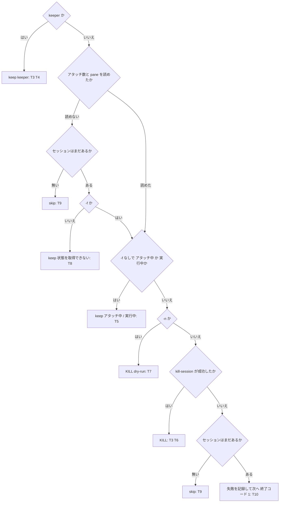
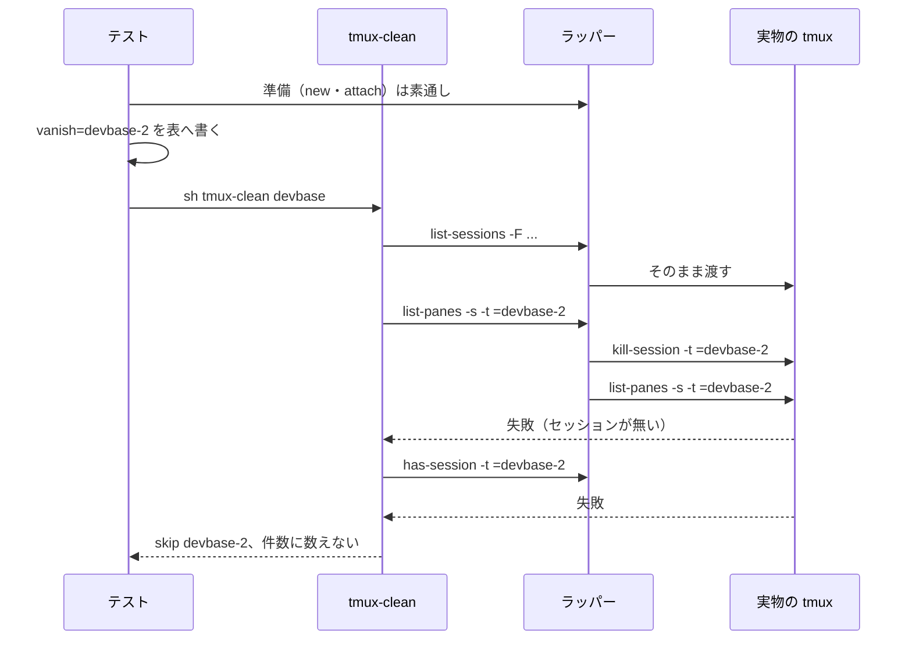
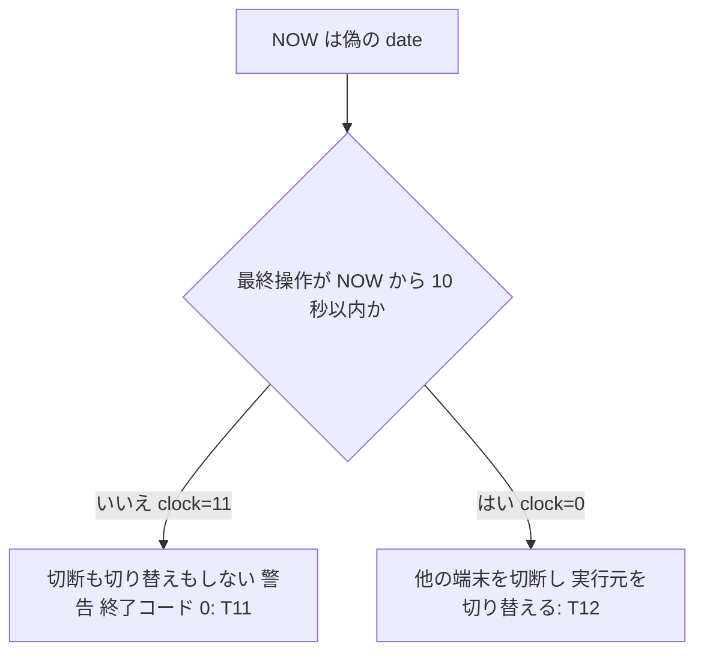

# #239: containers/base のシェル 3 本の異常系と分岐を固定するテスト

要求と受け入れ条件は #239 の本文にある（写しは `issues/issue-239-requirements.md`）。この文書は
「どう作るか」だけを扱う。

スクリプト（`entrypoint.sh`・`tmux-clean`・`tmux-first`・`tmux-session`）は 1 行も変えない。
作るのはテストと、テストが共有する harness だけである。

## ドメインモデル

### コンテキスト

| コンテキスト | 何の語が 1 つの意味に決まるか |
| --- | --- |
| base イメージの tmux のコマンド（`tmux`） | `tmux-clean` / `tmux-first` が扱うセッション・クライアント・keeper・実行元のクライアント |
| テストの実行環境（`test`） | 隔離した tmux サーバ・故障の差し込み・偽の date |

`test` が `tmux` の顧客になる（顧客 / 供給者）。テストは `tmux` のスクリプトの振る舞いを変えずに
受け取り、出力・終了コード・セッションとクライアントの一覧だけを観察する。`entrypoint.sh` の
workspace の書き出しは用語を新しく持たないため、コンテキストに挙げない。

### 集約

この変更が書き換えるのは試験のための状態だけである。スクリプトの状態（セッション・クライアント・
workspace の定義）は観察の対象で、テストは書き換える側に回らない。

| 集約 | 持ち主（書き換えてよいもの） | 根 | エンティティ | 値オブジェクト |
| --- | --- | --- | --- | --- |
| 隔離した tmux サーバ | 共通の harness の `TmuxEnv` | `TmuxEnv`（1 テストに 1 つ） | セッション・クライアント（端末） | ソケットのディレクトリ（`TMUX_TMPDIR`）・環境 |
| 故障の差し込み | 共通の harness の `ScriptTmuxEnv` | 故障の表（1 テストに 1 つのファイル） | — | 規則（動作と引数の前方一致） |
| workspace の書き出し先 | テストの一時ディレクトリ（`tmp_path`） | 書き出し先のファイル | — | 完成品の文書（`DEVBASE_WORKSPACE_B64`） |

### 不変条件

| # | 集約 | 条件 | 破れたときの扱い |
| --- | --- | --- | --- |
| I1 | 隔離した tmux サーバ | harness が起動する tmux とスクリプトの環境には、pytest が継承した `TMUX` / `TMUX_PANE` が無い。`TMUX` を持たせるのは `inside_env` が隔離したサーバの pane を指す値として与えたときだけ | テストが落ちる（harness の環境を検査するテスト） |
| I2 | 隔離した tmux サーバ | 利用者の tmux サーバのセッション一覧とクライアント一覧は、テストの前後で変わらない | 手で比べて見つける（テスト設計の「手の確認」） |
| I3 | 故障の差し込み | 故障の表に当たらない tmux の呼び出しは、実物の tmux へ引数と環境をそのまま渡す | ラッパーを通したセッション操作のテストが落ちる |
| I4 | workspace の書き出し先 | 書き出しが失敗しても、`<書き出し先>.tmp` が残らず、既にある書き出し先が上書きされない | テストが落ちる |
| I5 | 隔離した tmux サーバ | `tmux-clean` は keeper を、どの分岐・どのオプションでも消さない | テストが落ちる |
| I6 | 隔離した tmux サーバ | `tmux-first` は実行元のクライアントを特定できないとき、`-f` の有無によらず、どの端末も切断も切り替えもしない | テストが落ちる |
| I7 | — | 新しいテストは時刻を待つための `sleep` を使わない。時刻は偽の date で進める | テスト全体の時間の合計を見て見つける（テスト設計） |

### ドメインイベント

| # | イベント | 発生元 | 受け手 |
| --- | --- | --- | --- |
| E1 | コンテナの起動で workspace の定義を書いた | `devbase_write_workspace` | テスト（書き出し先の中身・`.tmp` の有無・標準出力を見る） |
| E2 | `tmux-clean` が同じベース名のセッションを走査した | `tmux-clean` | テスト（1 行ずつの `keep` / `skip` / `KILL` を見る）。故障の差し込みはこの走査の途中の tmux の呼び出しに割り込む |
| E3 | `tmux-clean` がセッションを消した | `tmux-clean` | テスト（隔離したサーバのセッション一覧・件数の行・終了コードを見る） |
| E4 | `tmux-first` が他の端末を切断し、自分の端末を切り替えた | `tmux-first` | テスト（隔離したサーバのクライアント一覧を見る） |

### 用語

| 用語 | 意味 | 用語集への反映 |
| --- | --- | --- |
| 隔離した tmux サーバ | `TMUX` を外し、専用のソケットで起動した試験用の tmux サーバ。利用者の tmux サーバに触れない | 追加済み（`test`、要求で登録） |
| keeper | `tmux-clean` が必ず残すセッション。tmux の中なら今のセッション、外ならベース名に属するうち番号が最小のもの | 追加済み（`tmux`、要求で登録） |
| 実行元のクライアント | `tmux-first` を起動した端末として扱うクライアント。tmux の「現在のクライアント」のうち、最終操作が 10 秒以内のものだけを認める | 追加（`tmux`） |
| 故障の差し込み | 実物の tmux の前に置いたラッパーが、故障の表に当たる呼び出しだけを失敗させるか、呼び出しの前にセッションを消すこと | 追加（`test`） |
| 偽の date | `PATH` の先に置き、`date +%s` にだけ実時刻へ指定の秒数を足した値を返す試験用の `date` | 追加（`test`） |

## 機能一覧

| # | 機能 | 誰が使うか |
| --- | --- | --- |
| F1 | workspace の復号の失敗を固定する（完成品への切り替え・完成品も壊れたときの警告） | `entrypoint.sh` を変える開発者 |
| F2 | `tmux-clean` の分岐を固定する（keeper・利用中の保護・`-f`・`-n`） | `tmux-clean` を変える開発者 |
| F3 | `tmux-clean` の異常系を固定する（状態の取得の失敗・走査中の消失・削除の失敗） | `tmux-clean` を変える開発者 |
| F4 | `tmux-first` が実行元を特定できないときに何もしないことを固定する | `tmux-first` / `tmux-session` を変える開発者 |
| F5 | tmux を使うテストを複数のファイルから同じ harness で書けるようにする | テストを書く開発者 |

## 構成要素

| 要素 | 変え方 | 責務 |
| --- | --- | --- |
| 共通の harness（`tests/containers/tmux_harness.py`） | 新設（`test_tmux_session.py` から移す） | 隔離した tmux サーバを作って片付ける。端末を `pty` で繋ぐ。待ちの関数・短い一時ディレクトリ・`needs_tmux` を持つ |
| スクリプト用の harness（同じファイルの `ScriptTmuxEnv`） | 新設 | 故障を差し込むラッパーと偽の date を置いた隔離環境を作る。`sh <スクリプト>` で呼ぶ |
| 故障を差し込むラッパー（`ScriptTmuxEnv` が書き出す `tmux`） | 新設（テストの実行時に生成） | 故障の表に当たる呼び出しだけを失敗させるか、先にセッションを消す。当たらない呼び出しは実物の tmux へ渡す |
| 偽の date（`ScriptTmuxEnv` が書き出す `date`） | 新設（テストの実行時に生成） | `date +%s` だけに `FAKE_DATE_OFFSET` 秒を足す。ほかの引数は実物の `date` へ渡す |
| tmux-session のテスト（`tests/containers/test_tmux_session.py`） | 変える | harness の定義を消し、共通の harness から読み込む。テストの本体・件数（108）は変えない |
| tmux-clean のテスト（`tests/containers/test_tmux_clean.py`） | 新設 | F2・F3 |
| tmux-first のテスト（`tests/containers/test_tmux_first.py`） | 新設 | F4 |
| entrypoint のテスト（`tests/containers/test_entrypoint_repos.py`） | 変える | F1。既存の `write_workspace` の補助を使い、workspace の節へ足す |
| tmux の確定仕様（`docs/specifications/tmux-named-session.md`「テスト観点」） | 変える（`plan-to-spec` の時点） | harness の置き場所が `test_tmux_session.py` から共通の harness へ移ったことを書く |

### 文脈



利用者の tmux サーバは、テストが変えられない外部の系である。テストはここへの経路を持たない
（I1）。CI（ubuntu-latest）の手順と `.github/workflows/ci.yml` は変えない。新しいファイルは
既存の `uv run --locked pytest tests/ -q` が拾う。

### 構成要素図



tmux の確定仕様（`plan-to-spec` の時点で直す文書）は実行の関係を持たないため図に載せない。
`entrypoint.sh` のテストは tmux を使わず、既存の `run_entrypoint_fn`（関数だけを source して
bash で呼ぶ）をそのまま使う。

### 配置



境界をまたぐのは環境変数だけである。テストのプロセスからスクリプトへ渡る環境は、`TMUX` /
`TMUX_PANE` を除いた上で `TMUX_TMPDIR`（一時ディレクトリ）と `PATH`（先頭に `fake/`）を
上書きしたものになる。tmux の中を模すときだけ、`inside_env` が隔離したサーバの pane を指す
`TMUX` / `TMUX_PANE` を足す。

### 置き場所

```text
tests/containers/
├── tmux_harness.py        新設（Client・TmuxEnv・wait・short_root・needs_tmux を移す。ScriptTmuxEnv を足す）
├── test_tmux_session.py   変える（harness の定義を消して読み込む）
├── test_tmux_clean.py     新設
├── test_tmux_first.py     新設
└── test_entrypoint_repos.py  変える（workspace の節へ 2 つ足す）
```

`tmux_harness.py` は `test_` で始まらないため、pytest は収集しない。`tests/containers/` は
`__init__.py` を持つパッケージで、テストは相対の読み込み（`from .tmux_harness import ...`）で
使う（`tests/snapshot/test_auto_snapshot_series.py` と同じ形）。

## 構造



| 型・関数 | 変え方 | 内容 |
| --- | --- | --- |
| `Client` | 移す（中身は変えない） | pty に繋いだ tmux のクライアント |
| `TmuxEnv` | 移す（中身は変えない） | 隔離した tmux サーバと、それを指す環境 |
| `ScriptTmuxEnv` | 新設 | `TmuxEnv` を継承し、`fake/` へラッパーと偽の date を書いてから `super().__init__(root, fake=root / "fake")` を呼ぶ |
| `wait` / `short_root` / `needs_tmux` | 移す（名前から先頭の `_` を外す） | 待ちの関数・短い一時ディレクトリ・tmux が無いときの skip |
| `BASE_DIR` / `SCRIPT` / `SHORT_NAMES` | 移す | `TmuxEnv` が `bin/` に張る symlink の元。`test_tmux_session.py` も読み込んで使う |

`test_tmux_session.py` は `from .tmux_harness import wait as _wait, short_root as _short_root, ...`
の形で読み込み、テストの本体の呼び出し（`_wait(...)` など）を書き換えない。`TMUX_CONF` と
`DOCKERFILE` は `test_tmux_session.py` だけが使うため、そこに残す。

## 入出力の契約

呼び出される約束は変えない。ここに書くのは、テストが作るラッパーと偽の date の契約である。

### 故障を差し込むラッパー（`fake/tmux`）

| 項目 | 内容 |
| --- | --- |
| 呼ばれ方 | `PATH` の先頭の `fake/` にあり、スクリプトとテスト側の tmux の操作の両方から `tmux` として呼ばれる |
| 実物の場所 | 生成の時点で `shutil.which("tmux")` を解いた絶対パスを埋め込む。ラッパー自身を再び呼ばない |
| 故障の表 | `<root>/faults`。無ければすべての呼び出しを実物へ渡す。1 行 1 規則で、`<動作>` と `<前方一致の文字列>` をタブで区切る |
| 照合 | 引数を空白 1 つで連結した文字列（`"$*"`）が、規則の文字列で始まるか。規則の文字列は文字どおりに比べ、glob として読まない |
| 動作 `fail` | 標準エラーへ `injected failure: <引数>` を書き、終了コード 1 で終わる。実物を呼ばない |
| 動作 `vanish=<名前>` | 実物で `kill-session -t =<名前>` を打ってから（失敗は無視）、元の呼び出しを実物へ渡す |
| 当たらないとき | `exec <実物> "$@"`。引数・環境・標準入出力・終了コードをそのまま渡す（I3） |

`ScriptTmuxEnv.fail(prefix)` と `vanish(session, prefix)` は、故障の表へ 1 行を足すだけである。
表はテストの準備（セッションと端末を作る）が終わってから書く。準備の tmux の操作もラッパーを通るため、
先に書くと準備そのものが失敗する。

テストが使う規則は次の 5 つである。

| 再現する状況 | 動作 | 前方一致の文字列 |
| --- | --- | --- |
| 1 つのセッションの pane を読めない | `fail` | `list-panes -s -t =devbase-2` |
| アタッチ数の一覧を読めない | `fail` | `list-sessions -F #{session_attached}` |
| 状態を読む間にセッションが終わる | `vanish=devbase-2` | `list-panes -s -t =devbase-2` |
| 削除の直前にセッションが終わる | `vanish=devbase-2` | `kill-session -t =devbase-2` |
| 削除を tmux が拒む | `fail` | `kill-session -t =devbase-2` |

### 偽の date（`fake/date`）

| 項目 | 内容 |
| --- | --- |
| 引数が `+%s` の 1 つだけ | 実物の `date +%s` に `FAKE_DATE_OFFSET`（未設定なら 0）を足した整数を出す |
| それ以外 | `exec <実物> "$@"` |
| 秒数の渡し方 | `ScriptTmuxEnv.sh(..., clock=N)` が実行する環境に `FAKE_DATE_OFFSET=N` を足す |

`tmux-first` が時刻を読むのは `NOW=$(date +%s)` の 1 か所で、クライアントの最終操作
（`#{client_activity}`）は tmux サーバが実時刻で持つ。偽の date で `NOW` だけを進めると、端末を
操作しないまま「最終操作から N 秒」の状態を作れる。

### スクリプトの呼び出し（`ScriptTmuxEnv.sh`）

| 項目 | 内容 |
| --- | --- |
| 形 | `sh <containers/base/スクリプト> <引数...>` を `subprocess.run` で実行する（git の上で実行権が無いため、要求の前提 4） |
| 環境 | 既定は `self.env`（tmux の外）。tmux の中を模すときは `inside_env(sid)` を渡す |
| 返すもの | `CompletedProcess`（標準出力・標準エラー・終了コード）。`timeout=30` |

## 処理の流れ

### `tmux-clean` の 1 セッションの判定と、テストが通す経路

テストが固定する経路を、`tmux-clean` の判定の順に並べる。枠の中の `T` の番号はテスト設計の行を指す。



### 故障の差し込みの順序（走査中にセッションが消える場合）



### `tmux-first` の実行元の判定と、テストが通す経路



## 決定の記録

### 決定 1: `tmux-first` と `tmux-session go` の、実行元を特定できないときの終了コードの違いを揃えない

`tmux-first` は「若い番号へ戻す」補助で、何もしないことが安全側の完了にあたるため 0 で終わり、
手で切り替える手順を案内する。`tmux-session go` は名指しの移動の依頼で、移れなかったことは
依頼の失敗であり 1 で終わる（`docs/specifications/tmux-named-session.md`）。役割の違いによる差で、
テストはそれぞれの今の値（`tmux-first` は 0）を固定する。揃えるとどちらかの呼び出し側の判定が
変わるため、この変更の範囲（振る舞いを変えない）から外れる。

### 決定 2: 失敗の経路は、実物の tmux の前に置くラッパーで作る

`tmux-clean` の「状態を取得できない」「削除できない」は、実物の tmux だけでは狙って起こせない。
ラッパーは当たらない呼び出しを実物へそのまま渡すため、セッションの作成・アタッチ・一覧は本物の
振る舞いのまま、1 つの呼び出しだけを失敗させられる。要求の「モックの tmux は使わない」は、tmux の
振る舞いを作り物で置き換えないことと読み、故障を 1 か所へ差し込むことはこれに当たらないと判断した。
`test_tmux_session.py` の `_KILL_FAIL_STUB` のように tmux 全体を Python の作り物にする形は、
セッションとクライアントの実際の変化を見られないため採らない。権限やソケットの操作で実際に
失敗させる形は、OS ごとに再現の手順が変わるため採らない。

### 決定 3: 走査中の消失は、呼び出しの直前にセッションを消して作る

`vanish` は、スクリプトが次に読むセッションを、その呼び出しの直前に実物で消す。時間差で別の
プロセスから消す形は、消える時点がスクリプトの進みに左右されて結果が揺れる。直前に消せば、
スクリプトが「一覧にはあったが次の呼び出しでは無い」状態を毎回同じ位置で踏む。

### 決定 4: 時刻は `NOW` だけを偽の date で進める

実行元の判定は `NOW - #{client_activity}` で決まる。既存の `test_go_inside_without_known_client_does_nothing`
は 11 秒 `sleep` して最終操作を古くしているが、受け入れ条件は 10 秒以上の待ちを禁じる。tmux サーバの
時刻は変えられないため、スクリプトが読む `NOW` の側を進める。既存のテストの `sleep` は、件数と中身を
変えない条件（受け入れ条件）があるため直さない。

### 決定 5: harness は通常のモジュールへ移し、`conftest.py` へは置かない

`Client` / `TmuxEnv` は型であり、テストが型注釈（`_observe(tm: TmuxEnv)` など）で名前を使う。`conftest.py` の
fixture は名前で読み込めないため、型の置き場に向かない。`tests/snapshot` に相対の読み込みの前例が
ある。fixture（`tm` など）は各テストファイルに置いたままにする。

### 決定 6: `test_tmux_session.py` は別名で読み込み、本体を書き換えない

移した関数は、共通の harness では先頭の `_` を外した名前（`wait` / `short_root`）にする。
`test_tmux_session.py` は `wait as _wait` の形で読み込み、100 行近い呼び出しを書き換えない。
件数と中身を変えないこと（受け入れ条件）を差分の小ささで確かめられる。

## テスト設計

新しいテストは tmux を使うものに `needs_tmux` を付ける。`T1`〜`T13` はテストの 1 関数を指す
（`parametrize` は同じ行にまとめる）。

| # | テスト | 置き場所 | 何を確かめるか |
| --- | --- | --- | --- |
| T1 | `test_workspace_falls_back_when_the_folders_cannot_be_decoded` | `test_entrypoint_repos.py` | `DEVBASE_WORKSPACE_FOLDERS=%%%%`・B64 が正しい。標準出力に `Warning: Failed to decode DEVBASE_WORKSPACE_FOLDERS`、書き出し先が B64 の復号結果と一致、終了コード 0 |
| T2 | `test_a_broken_prebuilt_document_keeps_the_old_workspace`（`parametrize`: FOLDERS なし / `%%%%`） | `test_entrypoint_repos.py` | B64=`%%%%`、書き出し先に `old` を置く。`Warning: Failed to write workspace file: <書き出し先>`、`<書き出し先>.tmp` が無い、書き出し先が `old` のまま、終了コード 0 |
| T3 | `test_outside_keeps_the_lowest_number` | `test_tmux_clean.py` | tmux の外、`devbase-2`・`devbase-10`、ベース名を指定。`keeper=devbase-2`（数の昇順）、`devbase-10` だけが消える |
| T4 | `test_inside_keeps_the_current_session` | `test_tmux_clean.py` | `inside_env(devbase-2)`、引数なし。ベース名を推定し、`devbase-1`・`devbase-3` が消えて `devbase-2` が残る |
| T5 | `test_attached_and_running_sessions_are_kept` | `test_tmux_clean.py` | `devbase-2` に端末を繋ぎ、`devbase-3` で `sleep 600` を動かす。`-f` なしで `(アタッチ中: クライアント 1 個)`・`(実行中: sleep)` と出て残り、`devbase-4` だけ消える |
| T6 | `test_force_removes_attached_and_running_but_not_the_keeper` | `test_tmux_clean.py` | T5 と同じ準備に `-f`。keeper の `devbase-1` だけが残る |
| T7 | `test_dry_run_removes_nothing`（`parametrize`: `-n` / `-n -f`） | `test_tmux_clean.py` | セッション一覧が前後で同じ、`  KILL  devbase-4  (dry-run)` が出る、終了コード 0 |
| T8 | `test_unreadable_state_is_kept_without_force`（`parametrize`: pane を読めない / アタッチ数を読めない、`-f` なし / あり） | `test_tmux_clean.py` | `-f` なし: `devbase-2` が残り、標準エラーに `セッションの状態を取得できないため削除しません: devbase-2`、終了コード 0。`-f` あり: `devbase-2` が消える。アタッチ数の一覧は全セッションに効くため、セッションは `devbase-1`・`devbase-2` の 2 つにする |
| T9 | `test_a_session_that_vanished_is_skipped`（`parametrize`: pane を読む前 / 削除の直前） | `test_tmux_clean.py` | `  skip  devbase-2  (既に終了していました)`、件数の行が `削除 1 件`（`devbase-3` の分だけ）、`失敗 0 件`、終了コード 0 |
| T10 | `test_a_failed_kill_is_reported_and_the_rest_continue` | `test_tmux_clean.py` | 標準エラーに `セッションを削除できませんでした: devbase-2`、`devbase-2` が残り `devbase-3` が消える、`失敗 1 件`、終了コード 1 |
| T11 | `test_unknown_caller_touches_no_client`（`parametrize`: `-f` なし / あり） | `test_tmux_first.py` | 実行元の端末を `home`、他の端末を `proj-1` に繋ぎ、`clock=11` で `inside_env(home)` から実行。`all_clients()` が前後で同じ、標準エラーに `実行元のクライアントを特定できないため` が出る、終了コード 0 |
| T12 | `test_known_caller_detaches_others_and_switches` | `test_tmux_first.py` | T11 と同じ準備に `clock=0`・`-f`。`proj-1` の他の端末が外れ、`clients_of(proj-1) == {実行元}` |
| T13 | `test_harness_env_has_no_inherited_tmux` | `test_tmux_first.py` | `monkeypatch.setenv` で pytest のプロセスに `TMUX` / `TMUX_PANE` を仕込んでから `ScriptTmuxEnv` を作り、`env` に両方が無い。`inside_env` の `TMUX` のソケットが `TMUX_TMPDIR` の下にある |

### 受け入れ条件との対応

| 受け入れ条件 | 何で確かめるか |
| --- | --- |
| FOLDERS が壊れて B64 が正しい | T1 |
| B64 が壊れている | T2 |
| `tmux-clean` の分岐 | T3（外の keeper）・T4（中の keeper）・T5（利用中の保護）・T6（`-f`）・T7（`-n`） |
| `tmux-clean` の異常系 | T8（状態を取得できない）・T9（走査中に消えた）・T10（削除に失敗） |
| `tmux-first` が実行元を特定できない | T11。対照は T12 |
| 利用者の tmux の中から走らせても利用者のサーバが変わらない | T13 と手の確認（利用者の tmux の中で `tmux list-sessions` と `tmux list-clients` を控え、`uv run --locked pytest tests/containers -q` の後に比べる） |
| `test_tmux_session.py` の件数が変わらず通る | 移す前後で `pytest tests/containers/test_tmux_session.py --collect-only -q` が `108 tests collected`、かつ全件が通る |
| 新しいテストの時刻の待ちが合計 10 秒未満 | 新しい 3 ファイルに `time.sleep` を書かない（`grep -n "sleep(" tests/containers/test_tmux_clean.py tests/containers/test_tmux_first.py` が 0 件。`sleep 600` はセッションのコマンドで待ちではない）。T1・T2 の追加分も待たない |
| `uv run --locked pytest tests/ -q` がすべて通る | 同じコマンド（CI の pytest ジョブと同じ） |

### 不変条件との対応

| 不変条件 | 何で確かめるか |
| --- | --- |
| I1 | T13 |
| I2 | 手の確認（上の表の 6 行目） |
| I3 | T3〜T7（ラッパーを置いたまま、故障の表なしで tmux の操作とスクリプトが本物どおりに動く） |
| I4 | T2 |
| I5 | T3・T4・T6・T7（`-n -f`）・T8（`-f` あり）で keeper が残ることを毎回確かめる |
| I6 | T11 |
| I7 | 受け入れ条件との対応の「時刻の待ち」の行 |

### 壊して確かめる手の確認

要求の検証手段に従い、実装の後に次の行を 1 つずつ壊して、対応するテストが落ちることを見てから
戻す。壊したまま commit しない。

| 壊す行 | 落ちるテスト |
| --- | --- |
| `entrypoint.sh` の `devbase_write_workspace` で、復号の失敗の分岐から `devbase_write_workspace_verbatim` の呼び出しを消す | T1 |
| `entrypoint.sh` の `devbase_write_workspace_verbatim` の `rm -f "$dest.tmp"` を消す | T2 |
| `tmux-clean` の `[ "$s" = "$KEEP" ]` の分岐を消す | T3・T4 |
| `tmux-clean` の `STATE_OK=0` の後の `FORCE = 0` の keep を消す | T8 |
| `tmux-clean` の `has-session` による `skip` の分岐（2 か所）を消す | T9 |
| `tmux-clean` の最後の `[ "$FAILED" = 0 ] \|\| exit 1` を消す | T10 |
| `tmux-first` の `[ "$ME_VERIFIED" = 1 ] \|\| ME=""` を消す | T11 |

## 未確認のまま残ること

| 項目 | 内容 |
| --- | --- |
| CI の dash と GNU coreutils | 故障を差し込むラッパーと偽の date、`tmux-clean` の失敗の経路は、手元（macOS・tmux 3.7b・`/bin/sh` は bash 3.2）で使い捨ての試作を通して確かめた。CI（ubuntu-latest の dash・GNU coreutils）では実装の PR の CI で初めて確かめる |
| `has_child_process` の Linux の経路 | T5 は foreground のコマンド（`sleep`）で「実行中」を作る。`/proc/<pid>/task/*/children` を読むバックグラウンドジョブの経路は受け入れ条件に無く、固定しない |
| `-n` と故障の表の組み合わせ | dry-run の途中で状態を読めない経路は、受け入れ条件に無く固定しない |
