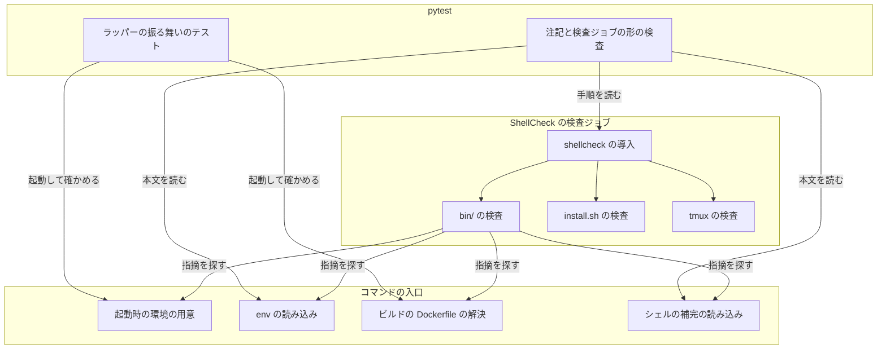
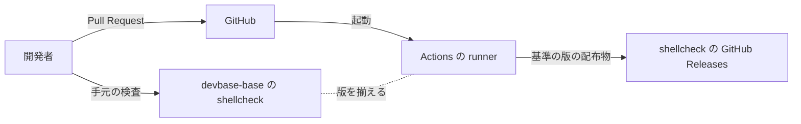
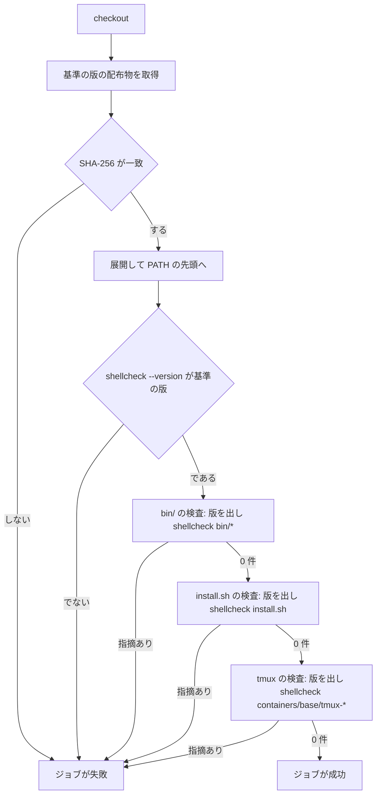
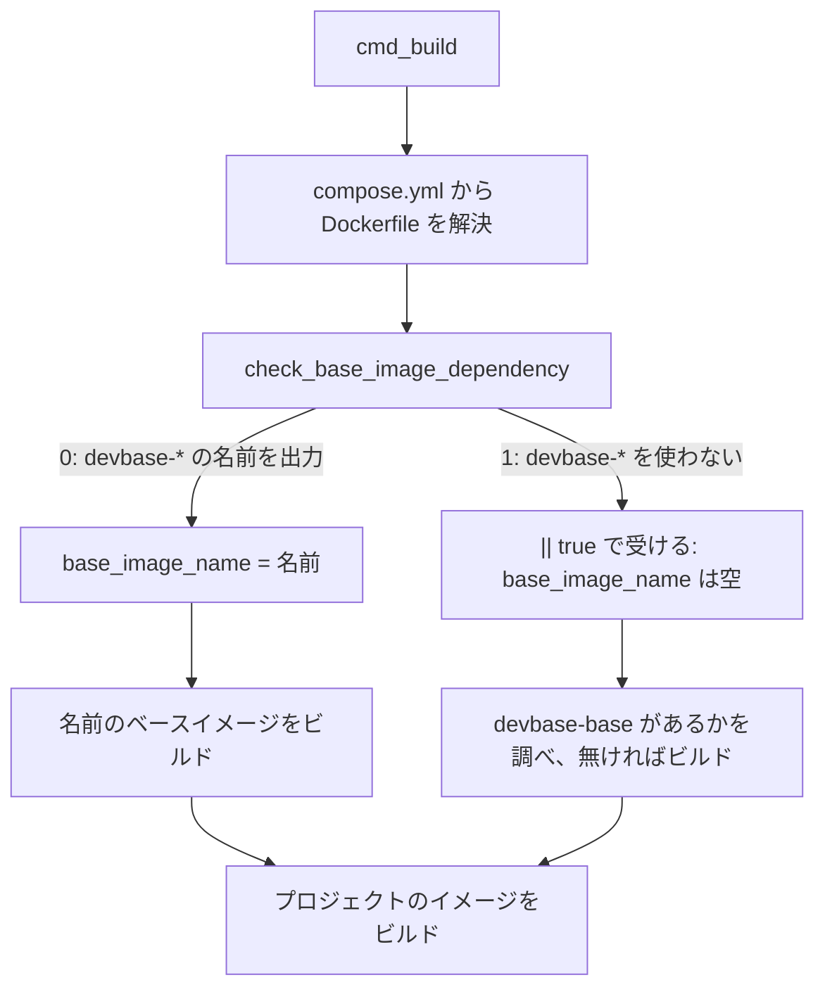

# #247: shellcheck の既存の指摘を片付け、CI を基準の版と既定の水準で走らせる

要求と受け入れ条件は #247 の本文にある（写しは [issue-247-requirements.md](issue-247-requirements.md)）。
この文書は「どう作るか」だけを扱う。

行番号は `main` = `0174add` の `bin/devbase` のものである。実装で行がずれても、指摘は SC の番号と
その行の中身で指す。

## ドメインモデル

### コンテキスト

| コンテキスト | 何の語が 1 つの意味に決まるか |
| --- | --- |
| 継続的インテグレーション（`ci`） | 指摘・抑止の注記・基準の版・ShellCheck の検査ジョブ |
| コマンドの入口（`cli`） | ラッパー（`bin/devbase`）の起動時の環境と、`devbase build` の shell の経路 |

`cli` が供給者、`ci` が顧客の関係（顧客 / 供給者）。`ci` は「基準の版の既定の水準で指摘が 0 件」を
`cli` へ求め、`cli` はその要求を満たすようにラッパーの本文を直す。`ci` はラッパーの本文を書き換えない。

### 集約

| 集約 | 持ち主（書き換えてよいもの） | 根 | エンティティ | 値オブジェクト |
| --- | --- | --- | --- | --- |
| 検査の対象 | 対象のファイルの本文（`bin/devbase`・`bin/rc`・`install.sh`） | 検査の対象のファイル | 指摘 | 抑止の注記（指示と理由の組）・SC の番号・水準 |
| ShellCheck の検査ジョブ | `.github/workflows/ci.yml` の `shellcheck` ジョブ | ジョブ | 検査の手順（step） | 基準の版・配布物の SHA-256 |
| ラッパーの振る舞い | `bin/devbase` の冒頭の環境の用意と `cmd_build` | ラッパーの 1 回の起動 | — | `DOCKER_GID`・`COMPOSE_PROJECT_NAME`・ベースイメージの名前 |

**検査の対象とラッパーの振る舞いは、同じ `bin/devbase` を持ち主にする。** 分けるのは、守る条件が
違うためである。検査の対象は「指摘が無い」ことを、ラッパーの振る舞いは「直しても動きが変わらない」
ことを守る。直すたびに両方の条件を満たす。

### 不変条件

| # | 集約 | 条件 | 破れたときの扱い |
| --- | --- | --- | --- |
| I1 | 検査の対象 | 基準の版・既定の水準で、`bin/*` と `install.sh` の指摘が 0 件 | ShellCheck の検査ジョブが失敗し、Pull Request のチェックが赤になる |
| I2 | 検査の対象 | `# shellcheck` の指示の行は、同じ行か直前の行に抑える理由のコメントを持つ | pytest が失敗する |
| I3 | ShellCheck の検査ジョブ | どの検査の手順も水準（`severity` / `--severity` / `-S`）を指定しない | pytest が失敗する |
| I4 | ShellCheck の検査ジョブ | すべての検査の手順が、SHA-256 を照合して入れた基準の版の shellcheck を使い、手順ごとにその版をログへ出す | 照合か版の確認が合わなければ、導入の手順でジョブが失敗する。形が崩れれば pytest が失敗する |
| I5 | ラッパーの振る舞い | Dockerfile が `devbase-*` を使わないとき、`cmd_build` はベースイメージの判定の非 0 で止まらず、`devbase-base` を前提にプロジェクトのビルドへ進む | pytest が失敗する |
| I6 | ラッパーの振る舞い | `DOCKER_GID` は Darwin で `0`、それ以外で `/etc/group` の docker の行の gid、行が無ければ空。いずれでもラッパーは止まらない。`COMPOSE_PROJECT_NAME` はカレントディレクトリの名前 | pytest が失敗する |

### ドメインイベント

| # | イベント | 発生元 | 受け手 |
| --- | --- | --- | --- |
| E1 | `bin/devbase` を変える Pull Request を出した | 開発者 | ShellCheck の検査ジョブ |
| E2 | ShellCheck の検査ジョブが既定の水準で `bin/` と `install.sh` を検査した | ShellCheck の検査ジョブ | 開発者とレビュアー（Pull Request のチェックの結果） |
| E3 | base イメージの shellcheck の版が上がった | Ubuntu のアーカイブの更新と base の再ビルド | 保守者（`ci.yml` の基準の版と SHA-256 を手で上げる） |

E3 は受け入れ条件に含めない。要求の前提 5 のとおり、手で上げる運用で扱う。

### 用語

| 用語 | 意味 | 用語集への反映 |
| --- | --- | --- |
| 指摘 | shellcheck が出す 1 件（SC の番号・水準・行） | 既にある（`ci`） |
| 抑止の注記 | 指摘を抑える `# shellcheck` の指示と、抑える理由のコメントの組 | 既にある（`ci`） |
| 基準の版 | 手元の基準（`devbase-base:latest` の shellcheck）と CI の ShellCheck の検査ジョブが揃える shellcheck の版。現在は 0.11.0 | 追加（`ci`） |
| 検査ジョブ | `ci.yml` の jobs の 1 つ | 既にある（`ci`） |
| ラッパー | `bin/devbase`（bash 実装の入口） | 既にある（`cli`） |

## 機能一覧

| # | 機能 | 誰が使うか |
| --- | --- | --- |
| F1 | `bin/` と `install.sh` へ入った新しい指摘を、水準によらず CI で止める | 開発者とレビュアー |
| F2 | 手元で基準の版の shellcheck を `bin/devbase bin/rc install.sh` へ打つと 0 件で終わる | 開発者 |
| F3 | ラッパーの起動時の環境と `devbase build` の shell の経路が、直す前と同じに動く | devbase の利用者 |

## 構成要素

### 指摘ごとの扱い

**9 件のうち、直すのが 6 件、抑止の注記にするのが 3 件である。** 直す 6 件のうち、非 0 を明示的に
受けるのは 163 行の 1 件だけになる。

| 行 | SC（水準） | 中身 | 扱い | 決定 |
| --- | --- | --- | --- | --- |
| 37 | SC2155（warning） | `export DOCKER_GID=$( … )` | 直す（代入と `export` を分ける） | 決定 1・2 |
| 37 | SC2015（info） | `[ Darwin ] && echo 0 \|\| grep … \| cut …` | 直す（`if` / `else` にする） | 決定 2 |
| 38 | SC2155（warning） | `export COMPOSE_PROJECT_NAME=$(basename "$PWD")` | 直す（代入と `export` を分ける） | 決定 1 |
| 50 | SC1091（info） | `source "${DEVBASE_ROOT}/env"` | 抑止の注記 | 決定 4 |
| 61 | SC1091（info） | `source ./env`（呼び出し元の env） | 抑止の注記 | 決定 4 |
| 147 | SC2155（warning） | `local dockerfile_line=$(grep … \| awk …)` | 直す（`local` と代入を分ける） | 決定 1 |
| 153 | SC2155（warning） | `local context_line=$(grep … \| awk …)` | 直す（`local` と代入を分ける） | 決定 1 |
| 163 | SC2155（warning） | `local base_image_name=$(check_base_image_dependency …)` | 直す（分けて `\|\| true` で受ける） | 決定 3 |
| 378 | SC1091（info） | `source ./env`（切り替え先のプロジェクトの env） | 抑止の注記 | 決定 4 |

**直した後の形**（`main` の写しへ当てて、基準の版の既定の水準で 0 件になることを確かめた形）:

```bash
# 37-38 行
if [ "$(uname)" = "Darwin" ]; then
    DOCKER_GID=0
else
    DOCKER_GID=$(grep docker /etc/group | cut -d: -f3)
fi
export DOCKER_GID
COMPOSE_PROJECT_NAME=$(basename "$PWD")
export COMPOSE_PROJECT_NAME

# 50・61・378 行（理由は行ごとに書く。文言は実装で決める）
# shellcheck disable=SC1091  # env は利用者が置くファイルで、実行時にしか場所が決まらない
[ -f "${DEVBASE_ROOT}/env" ] && set -a && source "${DEVBASE_ROOT}/env" && set +a

# 147・153 行
local dockerfile_line
dockerfile_line=$(grep -A 3 "build:" compose.yml | grep "dockerfile:" | head -1 | awk '{print $2}')

# 163 行（非 0 は「devbase-* を使わない」の意味で、失敗ではない）
local base_image_name
base_image_name=$(check_base_image_dependency "$dockerfile_path") || true
```

指示の後ろに `# 理由` を続ける形は、基準の版が指示として読み、指摘を抑えることを確かめた。

### 作るもの・変えるもの

| 要素 | 責務 |
| --- | --- |
| ラッパーの冒頭の環境の用意（`bin/devbase` 37-38 行） | `DOCKER_GID` と `COMPOSE_PROJECT_NAME` を決めて export する。形だけを変え、値は変えない |
| ラッパーの env の読み込み（`bin/devbase` 50・61・378 行） | 抑止の注記を足す。読み込みの処理は変えない |
| シェルの補完の読み込み（`bin/rc` 33 行） | 既存の `# shellcheck source=/dev/null` の直前へ理由のコメントを足す。指示と処理は変えない |
| ビルドの Dockerfile の解決（`bin/devbase` の `cmd_build` 147・153・163 行） | compose.yml から Dockerfile を探し、ベースイメージの名前を決める。形だけを変え、分岐は変えない |
| shellcheck の導入の手順（`ci.yml`、新設） | 基準の版の配布物を取得し、SHA-256 を照合して展開し、`PATH` の先頭へ置く。版が基準の版でなければ失敗する |
| `bin/` の検査の手順（`ci.yml`） | `ludeeus/action-shellcheck` をやめ、`shellcheck bin/*` を既定の水準で打つ。先に版を出す |
| `install.sh` の検査の手順（`ci.yml`） | `--severity=error` を外す。先に版を出す |
| `containers/base/tmux-*` の検査の手順（`ci.yml`） | 先に版を出す。bin/ の水準に触れたコメント（#247）を今の形へ直す |
| ラッパーの振る舞いのテスト（`tests/cli/test_wrapper_shellcheck_fixes.py`、新設） | I5・I6 を、`bin/devbase` を実プロセスで起動して固定する |
| 抑止の注記の検査（`tests/ci/test_shellcheck_job.py`、新設） | I2 を、`bin/*` と `install.sh` の本文を読んで固定する |
| 検査ジョブの形の検査（`tests/ci/test_shellcheck_job.py`、同上） | I3・I4 の形を、`ci.yml` を読んで固定する |
| 仕様の記述（`docs/specifications/base-image-shellcheck.md`・`tmux-named-session.md`） | 「CI は runner の shellcheck を使う」を「基準の版を入れて使う」へ直す |
| 開発者向けの記述（`docs/developer/contributing.md` の「CI が実行するもの」・`CONTRIBUTING.md` の「コーディング規約」） | ShellCheck を基準の版の既定の水準で走らせること、シェルは指摘 0 件を保つことを書く |
| 用語集（`docs/glossary/glossary.json` と `docs/glossary.md`） | 「基準の版」を足す |

**書き換えないもの。** 指摘の無い行、`containers/base/` のシェル（#259）、ShellCheck 以外の検査ジョブ。

### 構成要素図



図に含めないもの: 仕様・開発者向けの記述・用語集（処理の順序にも検査にも関わらない）。

### システム構成図



| 境界 | 流れるもの | 条件 |
| --- | --- | --- |
| runner → shellcheck の GitHub Releases | `shellcheck-v0.11.0.linux.x86_64.tar.xz` | `ci.yml` に書いた SHA-256 と一致しなければ展開しない |
| 手元の base ↔ runner | 版の番号（人が揃える） | 自動では揃わない（E3） |

### 置き場所

```text
bin/devbase                                  （変える）
bin/rc                                       （変える: 理由のコメント 1 行）
.github/workflows/ci.yml                     （変える: shellcheck ジョブ）
tests/
├── ci/                                      （新設）
│   ├── __init__.py
│   └── test_shellcheck_job.py
└── cli/
    └── test_wrapper_shellcheck_fixes.py     （新設）
docs/
├── specifications/base-image-shellcheck.md  （変える: 対象範囲）
├── specifications/tmux-named-session.md     （変える: CI の記述）
├── developer/contributing.md                （変える: CI が実行するもの）
└── glossary/glossary.json → glossary.md     （変える: 基準の版）
CONTRIBUTING.md                              （変える: コーディング規約）
```

## 処理の流れ

順序と分岐が変わるのは、ShellCheck の検査ジョブとラッパーのベースイメージの判定の 2 つである。
起動時の環境の用意・env の読み込み・シェルの補完の読み込みは形だけを変え、順序は変えないため図にしない。

### ShellCheck の検査ジョブ



基準の版と SHA-256 はジョブの `env` の 1 か所に置き、導入の手順だけが読む。手順の形は次のとおり
（値の取り方は「未確認のまま残ること」）。

```yaml
  shellcheck:
    name: ShellCheck
    runs-on: ubuntu-latest
    env:
      # 手元の基準 (devbase-base:latest の shellcheck) に揃える。base の版が上がったら手で上げる (#247)
      SHELLCHECK_VERSION: v0.11.0
      SHELLCHECK_SHA256: 8c3be12b05d5c177a04c29e3c78ce89ac86f1595681cab149b65b97c4e227198
    steps:
      - uses: actions/checkout@v4
      - name: Install ShellCheck ${{ env.SHELLCHECK_VERSION }}
        run: |
          f="shellcheck-${SHELLCHECK_VERSION}.linux.x86_64.tar.xz"
          curl -fsSL -o "$RUNNER_TEMP/$f" "https://github.com/koalaman/shellcheck/releases/download/${SHELLCHECK_VERSION}/$f"
          echo "${SHELLCHECK_SHA256}  $RUNNER_TEMP/$f" | sha256sum -c -
          tar -xJf "$RUNNER_TEMP/$f" -C "$RUNNER_TEMP"
          echo "$RUNNER_TEMP/shellcheck-${SHELLCHECK_VERSION}" >> "$GITHUB_PATH"
      - name: Check ShellCheck version
        run: shellcheck --version | grep -Fx "version: ${SHELLCHECK_VERSION#v}"
      - name: Run ShellCheck on bin/
        run: shellcheck --version | sed -n 2p && shellcheck bin/*
      - name: Run ShellCheck on install.sh
        run: shellcheck --version | sed -n 2p && shellcheck install.sh
      - name: Run ShellCheck on containers/base/tmux-*
        run: shellcheck --version | sed -n 2p && shellcheck containers/base/tmux-first containers/base/tmux-clean containers/base/tmux-session
```

`GITHUB_PATH` へ書いた場所は次の手順から効くため、版の確認は導入の手順と分ける。

### ラッパーのベースイメージの判定



**`|| true` が無いと、1 の経路で `set -e` によりラッパーが止まる。** `main` の写しで分けただけの形を
試し、devbase-* を使わない Dockerfile で `=== Building devbase images ===` の直後に終了コード 1 で
止まることを確かめた。`|| true` を付けた形は `[2/2] Building project image...` まで進み、終了コード 0 で
終わった。

## 決定の記録

### 決定 1: 非 0 が止まる理由にならない SC2155 は、宣言と代入を分けるだけで直す

37・38・147・153 行の置換は、終了コードが最後のコマンドのものになる。37 行の `grep docker /etc/group`
が 1 を返しても、パイプの最後の `cut` が 0 を返す。147・153 行も最後の `awk` が 0 を返す。
`bin/devbase` は `pipefail` を使わないため、分けても `set -e` で止まる経路は増えない。38 行の
`basename "$PWD"` は引数があれば失敗しない。

`|| true` を足す案は採らない。止まりうる経路が無いところへ付けると、読み手が止まりうると誤解する。
振る舞いが変わらないことは I6 と I5 のテストが固定し、将来 `pipefail` を足したときはこのテストが
先に落ちる。

要求の前提 3 は 37 行を「分けると止まる」側に数えていたが、上の理由で止まらない。前提が挙げた
振る舞いは、止まらないことを含めて I6 で固定する。

### 決定 2: SC2015 の 37 行は `if` / `else` へ書き換える

`A && B || C` を `if A; then B; else C; fi` にすると、SC2015 と SC2155 を同じ書き換えで片付けられる。
2 つの形が違う結果を出すのは `echo "0"` が失敗したときだけで、起こりうる経路は無い。

抑止の注記にする案は採らない。書き換えで意図がそのまま読める形になり、抑える理由が残らない。

### 決定 3: 163 行は分けた代入を `|| true` で受ける

`check_base_image_dependency` の 1 は「devbase-* を使わない」という判定の結果で、失敗ではない。
出力は空のままで、次の行の `${base_image_name:-devbase-base}` が既定のベースイメージを選ぶ。
`|| true` は、非 0 を承知で受けていることを行の上に書き出す。

抑止の注記（`disable=SC2155`）の案は採らない。非 0 を隠す形が残り、次に直す人が分けた途端に
止まる罠がそのまま残る。`if base_image_name=$(…); then` で分岐させる案も採らない。後段の分岐が
既に空かどうかで分かれており、同じ判定が 2 か所に分かれる。

### 決定 4: SC1091 の 3 件は、行ごとの抑止の注記にする

3 件とも、読み込む `env` は利用者が置くファイルで、場所は実行時のカレントディレクトリか
`DEVBASE_ROOT` で決まる。shellcheck が静的に辿る先が無いため、直す手段が無い。指示は
`disable=SC1091` とし、理由を同じ行の後ろへ書く。

`.shellcheckrc` で全体を抑える案は採らない。`bin/` と `install.sh` の全体へ効き、今後の本当に
辿れるはずの `source` の指摘まで消える。`# shellcheck source=/dev/null` の案も採らない。
抑える指摘の番号が行に現れず、SC1091 で検索しても見つからない。CI で `-e SC1091` を渡す案は、
手元で打った結果と CI の結果が食い違うため採らない。

### 決定 5: CI の shellcheck は公式の配布物を SHA-256 で照合して入れ、全手順で共有する

基準の版を CI の全手順で確実に使うには、ジョブの中で 1 つの実行ファイルを用意して `PATH` の先頭へ
置くのが最も少ない手段である。`ludeeus/action-shellcheck` は `bin/` の手順にしか効かず、
`install.sh` と tmux の手順は runner に入っている shellcheck を使い続ける。配布物は取得のたびに
SHA-256 を照合し、置き換えられた物を実行しない。

`ludeeus/action-shellcheck` に `version` を渡す案は採らない。`@master` という動く参照を使い続け、
残りの 2 手順の版は揃わない。runner の `apt-get install shellcheck` の案は、runner の Ubuntu の
アーカイブが持つ版に縛られ、版を選べない。CI で base イメージを建てて中の shellcheck を使う案は、
ShellCheck のジョブへ base のビルドが加わり、それでも E3 の運用（手で上げる）は無くならない。

### 決定 6: `bin/` は `shellcheck bin/*` で検査する

`bin/` の中身は `devbase` と `rc` の 2 つで、どちらも Bash である。glob で渡すと、足したファイルも
自動で検査に入る。シェルでないファイルが入ればその手順が失敗し、見落とされずに気づける。

ファイル名を並べる案は採らない。`bin/` へ足したシェルが黙って検査の外に残る。`ludeeus` のように
shebang で選ぶ仕組みを自前で書く案は、2 ファイルのためには大きすぎる。

### 決定 7: 抑止の注記と検査ジョブの形は pytest で固定する

I2〜I4 は、shellcheck の実行では確かめられない。I2 は指示の行さえあれば shellcheck が 0 件を
返すため、理由の有無は本文を読むほかない。I3・I4 は、検査ジョブが成功していても水準が絞られていれば
破れている。pytest は Pull Request ごとに走るため、ここへ置けば壊した Pull Request で止まる。

### 決定 8: `bin/rc` の理由の無い既存の指示には、理由のコメントだけを足す

I2 は `bin/*` の全体に掛けるため、`bin/rc` 33 行の `# shellcheck source=/dev/null` も対象になる。
この行は指摘ではなく、既に抑えている行である。直前へ理由のコメントを 1 行足せば I2 を満たし、
処理は変わらない。

I2 の検査を `bin/devbase` だけに絞る案は採らない。受け入れ条件 2 は抑止の注記を置いた行すべてを
対象にしており、`bin/rc` へ足した次の指示も検査の外に残る。33 行を決定 4 の `disable=SC1091` の形へ
揃える案も採らない。指示の書き換えは、この変更が片付ける 9 件の外にある。

## テスト設計

`tests/ci/test_shellcheck_job.py` は `ci.yml` を `yaml.safe_load` で読み、`shellcheck` ジョブの
手順の `run` と `uses` を調べる。`tests/cli/test_wrapper_shellcheck_fixes.py` は `tests/cli/conftest.py`
の `exec_wrapper`（`bin/devbase` の複製と偽の `uv`）を使い、偽の `uv` をテストの中で環境変数を出す
形に書き換える。

| 受け入れ条件・不変条件 | 何で確かめるか |
| --- | --- |
| 条件 1・I1: 基準の版の既定の水準で `bin/devbase bin/rc install.sh` が 0 件 | 手元で `docker run --rm -v "$PWD":/w -w /w --entrypoint shellcheck devbase-base:latest bin/devbase bin/rc install.sh` が終了コード 0。CI では ShellCheck の検査ジョブの成功 |
| 条件 2・I2: 抑止の注記に理由がある | `test_shellcheck_job.py`: `bin/*` と `install.sh` の `# shellcheck ` で始まる行ごとに、同じ行の指示の後ろに `#` で始まる理由があるか、直前の行が指示でないコメントであることを確かめる。直す前の指示の行は `bin/rc` の 2 行だけで、28 行は直前に理由があり、33 行には無い（決定 8）。`bin/devbase` へ足す 3 行と合わせて 5 行が対象になる |
| 条件 3・I3: 検査の手順が水準を指定しない | `test_shellcheck_job.py`: `shellcheck` ジョブの手順の `run` に `--severity` / `-S` が無く、`with` に `severity` が無いことを確かめる |
| 条件 4・I4: 両方の検査が基準の版を使い、ログに `0.11.0` が出る | `test_shellcheck_job.py`: ジョブの `env` の `SHELLCHECK_VERSION` が `v0.11.0` で `SHELLCHECK_SHA256` が 64 桁の 16 進であること、導入の手順が `sha256sum -c` を打ち `GITHUB_PATH` へ書くこと、`shellcheck` を打つ手順がすべて導入より後にあり `shellcheck --version` を先に打つこと、`ludeeus/action-shellcheck` を使わないことを確かめる。ログは実装の Pull Request の ShellCheck の検査ジョブで `version: 0.11.0` を目で見る |
| 条件 5・I5: devbase-* を使わない Dockerfile で止まらない | `test_wrapper_shellcheck_fixes.py`: `work/myproj/Dockerfile` を `FROM ubuntu:26.04` にして `devbase build` を起動し、終了コード 0 で偽の `uv` へ `docker compose build dev` が届くこと。`|| true` を外した形ではこのテストが落ちる |
| 条件 5・I5（147・153 行の解決の経路） | 同上: compose.yml に `build:` の `context: .` と `dockerfile: Dockerfile.dev` を書き、`Dockerfile.dev` を `FROM devbase-general:latest` にすると、`Project uses devbase-general` を出して偽の `uv` へ `-t devbase-general:latest` のビルドが届くこと。`build:` はあるが `dockerfile:` の無い compose.yml でも止まらずに `docker compose build dev` まで進むこと |
| 条件 6・I6: `DOCKER_GID` と `COMPOSE_PROJECT_NAME` | 同上: `fakebin` に偽の `uname`（`Darwin` か `Linux` を返す）と偽の `grep`（引数が `docker /etc/group` のときだけテストの用意したファイルを読み、他は本物へ渡す）を置き、`devbase --help` を起動して偽の `uv` が出す値を見る。Darwin で `0`、Linux で用意した docker の行の gid、docker の行が無いと空で、3 つとも終了コード 0。`COMPOSE_PROJECT_NAME` は `myproj` |
| 条件 7: 全体の件数が減らずに通る | `uv run --locked pytest tests/ -q` の件数が `main` の件数に新設のテストを足した数で、失敗が 0 |

## 未確認のまま残ること

| 項目 | 内容 |
| --- | --- |
| CI のログの形 | 手順ごとに `version: 0.11.0` が出ることは、実装の Pull Request の ShellCheck の検査ジョブで確かめる。手元では GitHub Actions を走らせない |
| SHA-256 の出所 | 上の値は 2026-09-26 に配布物を取得して手元で計算したもので、配布元が公開する値との突き合わせはしていない。実装で配布元の Release の資産から計算し直し、一致を確かめてから書く |
| runner の既存の shellcheck | ubuntu-latest に入っている shellcheck の版は確かめていない。`GITHUB_PATH` の先頭へ置けば版によらず基準の版が先に見つかり、版の確認の手順が食い違いを止める |
| 偽の `grep` の効き方 | ラッパーが `grep` を `PATH` から探すことを前提にする（絶対パスで呼んでいないことは `main` の本文で確かめた）。偽の `grep` が他の `grep` の呼び出しを本物へ渡すことは、実装のテストで確かめる |
