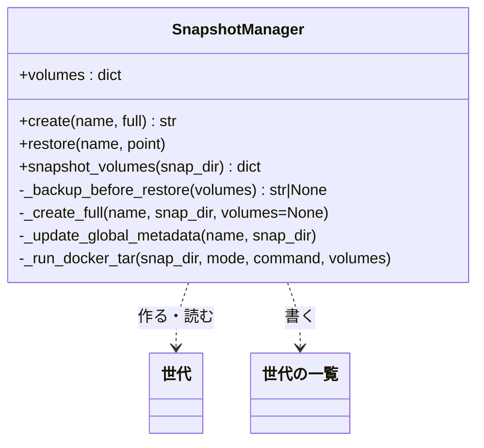
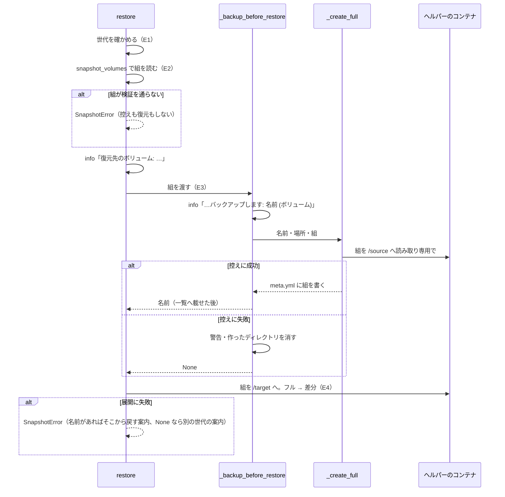

# #255: 復元前バックアップが控えるボリュームを、復元する世代の組にする の設計

要求と受け入れ条件は #255 の本文にある（コピーは [issue-255-requirements.md](issue-255-requirements.md)）。
この文書は「どう作るか」だけを扱う。

## ドメインモデル

### コンテキスト

| コンテキスト | 何の語が 1 つの意味に決まるか |
| --- | --- |
| スナップショット（`snapshot`） | 世代・対象ボリュームの組・系列・復元前バックアップ |

変更はこのコンテキストの中で閉じる。アカウントグループ（`DEVBASE_ACCOUNT_GROUP` と宣言）は、
`snapshot create` と自動スナップショットの対象を決めるためだけに読み、復元の経路では読まない。

### 集約

| 集約 | 持ち主（書き換えてよいもの） | 根 | エンティティ | 値オブジェクト |
| --- | --- | --- | --- | --- |
| 世代の保管（`backups/`） | `SnapshotManager` | 世代の一覧（`snapshot.yml`） | 世代（`backups/<名前>/` と、その `meta.yml`） | 対象ボリュームの組 |

世代の一覧と各世代の `meta.yml` は、どちらも `SnapshotManager` だけが書く。この変更は持ち主を変えない。
復元前バックアップは世代の 1 つで、ほかの世代と同じ形で一覧に載る。

### 不変条件

| # | 集約 | 条件 | 破れたときの扱い |
| --- | --- | --- | --- |
| I1 | 世代の保管 | 復元前バックアップが控える対象ボリュームの組は、復元する世代の対象ボリュームの組（`snapshot_volumes` が返す、検証済みの組）と等しい。実行時の `DEVBASE_ACCOUNT_GROUP` の有無と値に依らない | 起きない形にする。復元の経路は `self.volumes` を読まない（決定 1） |
| I2 | 世代の保管 | 復元前バックアップの `meta.yml` の `volumes` と、`snapshot.yml` のそのエントリの `volumes` は、控えた組と等しい | 起きない形にする。控えた組を `_create_full` がそのまま `meta.yml` へ書き、一覧は `meta.yml` から写す |
| I3 | 世代の保管 | 控えに失敗した呼び出しは、`backups/` にその呼び出しで作ったディレクトリも、`snapshot.yml` のエントリも残さない | 失敗を捕まえた側でディレクトリを消す。消すのに失敗したら警告を 1 行足し、復元は続ける（決定 3） |
| I4 | 世代の保管 | 復元する世代の対象ボリュームの組が検証を通らなければ、控えの `docker run` も復元の `docker run` も行わず、`pre-restore-*` のディレクトリも作らない | `SnapshotError` で止める。組を控えより先に読む（決定 2） |
| I5 | 世代の保管 | 失敗の案内が `pre-restore-*` の名前を示すのは、その控えが成功したときだけ | 控えが失敗したら名前を捨て、別の世代から戻す案内にする（今の `_restore_failure_message` のまま） |
| I6 | 世代の保管 | `snapshot create` と自動スナップショットの対象ボリュームの組は、今までどおり宣言か `--group`（`self.volumes`）から決まる | 起きない形にする。`create` の引数と中身を変えない（決定 1） |

### ドメインイベント

| # | イベント | 発生元 | 受け手 |
| --- | --- | --- | --- |
| E1 | 復元する世代を確かめた（場所・`full.tar.zst` の有無） | `SnapshotManager.restore` | E2 |
| E2 | 復元する世代の対象ボリュームの組を読んだ | `SnapshotManager.restore`（`snapshot_volumes`） | E3（控える組）と E4（書き戻す組） |
| E3 | 復元前バックアップを作った（E2 の組を控え、`meta.yml` と `snapshot.yml` へ記録した） | `SnapshotManager._backup_before_restore` | E4（失敗の案内に使う名前）。一覧の上ではその組の系列 |
| E4 | 対象ボリュームを世代の中身で書き戻した（フル → 差分） | `SnapshotManager.restore`（`_extract_archive`） | 利用者（ログと、失敗なら `SnapshotError` の案内） |

E2 を E3 の前へ移す。今は E3 の後で読むため、不正な世代でも控えが作られる。

### 用語

| 用語 | 意味 | 用語集への反映 |
| --- | --- | --- |
| 復元前バックアップ | `restore` が書き戻す前に自動で作るフルの世代 `pre-restore-<時刻>`。復元する世代の対象ボリュームの組を控える | 仕様の段階で追加済み（`snapshot`、正本は未定で `pending_source` が要求の写し）。実装で `snapshot-series.md` の用語の表へ載せたときに正本をそこへ移す |

## 機能一覧

| # | 機能 | 誰が使うか |
| --- | --- | --- |
| F1 | 復元の前に、復元する世代の対象ボリュームの組を控える。実行時のグループに依らない | `devbase snapshot restore` と TUI の復元を使う利用者 |
| F2 | 控えに失敗したとき、その呼び出しで作ったディレクトリを残さない | 同上 |
| F3 | 控える対象のボリュームを info のログで 1 行示す | 同上 |
| F4 | 仕様と利用者文書を、控えるのは復元する世代の対象ボリュームだと読める形に直す | devbase の開発者・利用者 |

## 構成要素

| 要素 | 変更 | 責務 |
| --- | --- | --- |
| 復元（`lib/devbase/snapshot/manager.py` の `SnapshotManager.restore`） | 変える | 世代を確かめ（E1）、組を読み（E2）、復元先を info で出し、組を渡して控えを作らせ（E3）、書き戻す（E4）。`self.volumes` を読まない |
| 復元前バックアップの作成（同 `SnapshotManager._backup_before_restore`、新設） | 足す | 受け取った組で `pre-restore-<時刻>` のフルの世代を作り、一覧へ載せて名前を返す。失敗したら警告を 1 行出し、作ったディレクトリを消して `None` を返す（決定 1・3） |
| フルの作成（同 `SnapshotManager._create_full`） | 変える | 省略できる引数 `volumes` を足す。渡されたらその組をマウントし、`meta.yml` の `volumes` に書く。省いたら今の `self.volumes`（決定 1） |
| `tests/snapshot/test_pre_restore_backup.py`（新設） | 足す | 受け入れ条件と I1〜I5 を固定する。`DEVBASE_ACCOUNT_GROUP` を置かない形・別グループの値を置く形・旧レイアウト・旧既定のボリューム・控えの失敗・展開の失敗・不正な組・ログ（「テスト設計」） |
| `docs/specifications/snapshot-series.md` | 変える | 「含まない」の `#255` の記述を消し、「世代を名前で区別すること」の項へ、`pre-restore-*` は復元する世代の組で作られ、その系列に入ることを書く。用語の表へ「復元前バックアップ」を足す |
| `docs/specifications/secret-backend.md` | 変える | 旧既定のボリュームの系列の段落の「新しい世代は作られない」へ、例外として復元前バックアップを書き足す（決定 4） |
| `docs/user/snapshot-guide.md`（「復元の安全性」） | 変える | 「現在の対象ボリュームの状態」を「復元する世代の対象ボリュームの、復元前の状態」に直す。控えに失敗しても復元は続き、そのときは失敗の案内が別の世代を示すことを 1 文足す。Note の「この自動バックアップから再度復元できます」へ、元に戻せるのは次の `devbase up` より前に限ること（次の自動スナップショットが控えへ差分を積むため）を足す（決定 6） |
| `docs/user/cli-reference/05-snapshot.md`（`restore` の Warning） | 変える | 同じ読み方に直す。控えから元に戻せるのは次の `devbase up` より前に限ることを 1 文足す（決定 6） |
| `docs/glossary/glossary.json` と `docs/glossary.md` | 変える | 「復元前バックアップ」の `source` を `docs/specifications/snapshot-series.md` にして `pending_source` を外し、`glossary.py render` で作り直す |
| `CHANGELOG.md` | 変える | `[Unreleased]` の `### Fixed` に 1 項目足す |

次のものは変えない。

- `SnapshotManager.create` の引数と中身（I6）。`snapshot create` の終了コードと、作った世代の `volumes`
- `lib/devbase/commands/snapshot.py` と TUI（`lib/devbase/tui/actions_snapshot.py`）。グループを渡す経路を足さない
- `snapshot_volumes` / `_validate_volumes` / `_run_docker_tar` / `volume_mount_args` / `_update_global_metadata` /
  `_restore_failure_message`。控えの組は既存の検証をそのまま通ったもので、書き方も既存のまま使える
- `snapshot.yml` と `meta.yml` の形
- `auto_snapshot_target` と `rotate` の規則（「処理の流れ」の最後の段落）

構成要素図は描かない。変える要素はすべて `SnapshotManager` の中にあり、要素どうしの関係は下の
クラス図と処理の流れが示す。文脈と配置は変わらない（ホストのプロセスが Docker のヘルパーのコンテナを
起こす形のまま）。

### 置き場所

```text
lib/devbase/snapshot/
└── manager.py                     # restore を変え、_backup_before_restore を足し、_create_full に volumes を足す
tests/snapshot/
└── test_pre_restore_backup.py     # 新設
docs/specifications/
├── snapshot-series.md
└── secret-backend.md
docs/user/
├── snapshot-guide.md
└── cli-reference/05-snapshot.md
docs/glossary/glossary.json        # 変えたあと docs/glossary.md を render で作り直す
CHANGELOG.md
```

## 構造



| メソッド | 入力 | 出力 | 失敗の形 |
| --- | --- | --- | --- |
| `_backup_before_restore(volumes: dict)` | 検証済みの対象ボリュームの組（`snapshot_volumes` の戻り値） | 作った世代の名前 `pre-restore-<YYYYmmdd-HHMMSS>`。失敗したら `None` | 例外を外へ出さない。警告を 1 行出し、作ったディレクトリを消す |
| `_create_full(name, snap_dir, volumes: Optional[dict] = None)` | `volumes` を省いたら `self.volumes` | 無し（`full.tar.zst`・`snapshot.snar`・`meta.yml` を書く） | 今と同じ（`_run_docker_tar` の `SnapshotError`、組の解決の `DevbaseError`） |

`_create_full` の既存の呼び出し元（`create` と `_create_incremental` の snar 無しのフォールバック）は
`volumes` を渡さない。したがって `snapshot create` と自動スナップショットの振る舞いは変わらない（I6）。

`_backup_before_restore` の中身は、`create` の新規の経路（名前の検証・`mkdir`・`_create_full`・
`_update_global_metadata`）と同じ並びで、`_create_full` へ組を渡す点と、失敗の後始末を持つ点だけが違う。

| 手順 | 中身 |
| --- | --- |
| 名前 | `pre-restore-` に今の時刻（秒まで）を付ける |
| 場所 | `_safe_snap_dir(name)` で解決する。既にあれば作らずにそのまま使う（前提 3。`create` に `full=True` を渡したときと同じ） |
| ログ | `復元前に復元先のボリュームの状態をバックアップします: <名前> (<ボリューム名をカンマで並べたもの>)` を info で 1 行 |
| 作成 | ディレクトリが無ければ作り、`_create_full(name, snap_dir, volumes)`、`_update_global_metadata(name, snap_dir)` |
| 失敗 | `Exception` を捕まえ、`復元前バックアップに失敗しましたが続行します: <例外>` を警告で出す。この呼び出しでディレクトリを作ったときだけ `shutil.rmtree` で消し、消すのに失敗したら `復元前バックアップの作りかけ <パス> を消せませんでした: <例外>` を警告で足す。`None` を返す |

## 処理の流れ



図には `manager.py` の中で動く要素とヘルパーのコンテナだけを描く。試験・仕様・利用者文書・用語集・
CHANGELOG は描かない。

`restore` の中の順序は次のとおりである。E1 の検証（`point`・場所・`full.tar.zst`）は今のまま最初に置く。

1. `volumes = self.snapshot_volumes(snap_dir)`（E2）
2. `logger.info("復元先のボリューム: %s", ...)`（今は控えの後にある行を前へ移す）
3. `pre_restore_name = self._backup_before_restore(volumes)`（E3）
4. フルと差分の展開、rename の検証、完了のログ（E4。今のまま。`volumes` と `pre_restore_name` を渡す）

`restore` の経路で `self.volumes` を読む箇所は残らない。`_run_docker_tar` の `volumes or self.volumes` は、
渡す組が常に空でないため後ろへ落ちない。`_update_global_metadata` の `snap_meta.get('volumes') or ...` も、
`_create_full` が `volumes` を書いた後に呼ぶため後ろへ落ちない。

組ごとの控えの形は次の 4 つになる。どれも既存の `volume_mount_args` と `_validate_volumes` がそのまま扱う。

| 復元する世代の組 | 控えのマウント | 控えの `volumes` |
| --- | --- | --- |
| `{ai: devbase_home_ubuntu, group: devbase_home_<g>}` | `devbase_home_ubuntu:/source/ai:ro`・`devbase_home_<g>:/source/group:ro` | 同じ組 |
| `{ai: devbase_home_ubuntu, group: devbase_home_default}`（旧既定のボリューム） | `…:/source/ai:ro`・`devbase_home_default:/source/group:ro` | 同じ組 |
| `volumes` が無い旧レイアウト（`volume:` か、どちらも無い） | `devbase_home_ubuntu:/source:ro` | `{'': devbase_home_ubuntu}` |
| 検証を通らない組 | 無し（I4） | 無し |

**控えは復元する世代と同じ系列に入る。** 系列の規則は変えないため、次の 2 つが従う。どちらも
`pre-restore-*` を名前で区別しない今の規則（snapshot-series.md の「含まない」）の結果で、#256 の範囲である。

- その系列の最新の世代になるので、同じグループの次の自動スナップショットは控えへ差分を積む。積まれた後に控えを `restore` すると差分まで当たり、復元前の状態には戻らない（`--point` は 1 以上で、フルだけは取り出せない）。この変更では積み先の規則を変えず、控えから元に戻せるのは次の `devbase up` より前に限ると利用者文書に書く（決定 6）
- その系列の保持数を超えれば、ほかの世代と同じ順で消える

## 非機能の実現方式

| 大項目 | 要求の条件 | 実現方式 | 確かめ方 |
| --- | --- | --- | --- |
| 可用性 | 控えの失敗で復元を止めない（前提 2）。控えの失敗が残すディスク上の痕跡は 0（空のディレクトリを残さない） | `_backup_before_restore` が例外を外へ出さず `None` を返す。この呼び出しで作ったディレクトリを `shutil.rmtree` で消す。一覧への追記は最後の手順なので、失敗した控えのエントリは書かれない | 控えの `docker run` を失敗させて `restore` し、復元の `docker run` が行われ、`backups/pre-restore-*` と一覧のエントリが無いことを見る |
| 運用・保守性 | 控えの対象ボリュームを info のログで 1 行示し、失敗時の案内が実際に戻せるかどうかと一致する | 控えの前に名前とボリューム名を並べた info を 1 行出す。案内は `pre_restore_name` の有無で分ける今の `_restore_failure_message` を使い、名前は控えが成功したときだけ返す | ログの行を読む試験と、控えの成否 × 展開の失敗の 2 通りで案内を読む試験 |
| セキュリティ | 控えでマウントする組は `snapshot_volumes` の検証（devbase のボリュームだけを許す）を通ったものに限る。検証を通らない世代では控えの `docker run` を行わない | 控えへ渡す組は `snapshot_volumes` の戻り値だけにし、組を読む手順を控えより前に置く。検証が `SnapshotError` を投げれば `_backup_before_restore` へ届かない | 検証を通らない `meta.yml` の世代で `restore` し、`docker run` が 1 回も行われないことを見る |

## 決定の記録

### 決定 1: 組は復元前バックアップ専用の内部メソッドへ渡し、`create` の引数にしない

`create` は `full=False` のとき差分を積み、そのとき記録された組と `self.volumes` を突き合わせる。
`create` に組の引数を足すと、差分の経路でどちらの組と比べるか、`snapshot create` の CLI から渡せるかを
新しく決めることになり、I6 を守る範囲が広がる。復元前バックアップは常にフルで新規の世代なので、
`create` の新規の経路と同じ手順を持つ小さなメソッドにし、組を受けるのは `_create_full` だけにする。
失敗の後始末（決定 3）もこのメソッドの中に閉じられ、`snapshot create` の失敗の振る舞いを変えずに済む。

`SnapshotManager(root, group=...)` を控えのためだけに作り直す案は採らない。`group` から作る組は
`{ai, group}` の形に限られ、旧レイアウト（`{'': …}`）と旧既定のボリューム（`default` は予約語で
グループ名の検証を通らない）の世代を控えられない。

### 決定 2: 組を読む手順を控えより前に置く

控える組を決めるために要る。副作用として、`meta.yml` が検証を通らない世代では控えも作られなくなる（I4）。
今は控えが作られてから検証で止まるため、壊れた世代を指定するたびに中身のある `pre-restore-*` が増え、
一覧とローテーションに乗っていた。

### 決定 3: 後始末は、その呼び出しで作ったディレクトリだけを消す

`pre-restore-<時刻>` の名前が既にある場合（同じ秒の 2 回目の復元）、そのディレクトリは前の控えのもので、
消すと戻す先を失う。作ったかどうかは `mkdir` の前の `exists()` で決める。既にあった場合は、今の `create` と
同じく上書きを試み、失敗しても消さない（前提 3。同じ秒に 2 回復元することは想定しない）。

後始末が失敗しても復元は続ける。後始末の失敗で止めると、控えの失敗で止めない前提 2 と食い違う。
残ったディレクトリは一覧に載らない（一覧への追記は作成の最後）ため、警告にパスを出して利用者が消せるようにする。

### 決定 4: 旧既定のボリュームの世代の復元でも、その組で控えを作る

控えは、書き戻すボリュームを戻せる状態にするためにある。旧既定のボリュームへの復元はロールバックの経路
（secret-backend.md）で、書き戻す先は `devbase_home_default` である。ここで控えを作らなければ、
ロールバックの途中で失敗したときに戻す手段が無い。したがって「旧既定のボリュームの系列に新しい世代は
作られない」は、`snapshot create` と自動スナップショットについての規則として残し、復元前バックアップを
その例外として仕様に書く。

旧既定のボリュームの世代の復元だけ控えを作らない案は採らない。書き戻す前の状態を失う経路が残る。

### 決定 5: 控えの失敗で復元を止めるかは、この変更では決めない

前提 2 のとおり、控えに失敗しても今と同じく復元を続ける。止める（または確認を求める）かは要求の未決に
あり、利用者が設計 PR のレビューで判断する。止めると決まったら別の課題にする。この設計は、止める
ときに `_backup_before_restore` の戻り値の `None` を見て `restore` が止めれば足りる形にしてある。

### 決定 6: 控えへ差分が積まれる点は、積み先の規則を変えずに利用者文書で扱う

控えは系列の最新の世代になるため、次の `devbase up` の自動スナップショット（`auto_snapshot_target`）が控えへ
差分を積む。その後に控えを `restore` すると差分まで当たり、「元に戻す」経路が成り立たない。この変更では
`auto_snapshot_target` の積み先の規則を変えず、`snapshot-guide.md` の「復元の安全性」と `05-snapshot.md` の
`restore` の Warning に「控えから元に戻せるのは次の `devbase up` より前に限る」と書く。

`auto_snapshot_target` が `pre-restore-*` を積み先に選ばず新しい世代へ倒す案は採らない。積み先の規則は
PLAN68 決定 2 の範囲で、`pre-restore-*` を名前で区別しない今の規則（snapshot-series.md の「含まない」）を
変えることになり、本件の受け入れ条件 12（自動スナップショットの積み先を変えない）から外れる。
積み先を変えるなら別の課題にする。

## テスト設計

`_run_docker_tar` を差し替えて、マウントの組・コマンド・失敗を記録する（`test_manager_volumes.py` の
`RecordingManager` の形）。`DEVBASE_ACCOUNT_GROUP` を置かない試験は、環境変数を消した状態で走らせる。

| 受け入れ条件・不変条件 | どの振る舞いで縛るか | どう壊したら落ちるべきか |
| --- | --- | --- |
| 受け入れ条件 1・I1（グループ未設定） | `devbase_home_ubuntu, devbase_home_with` の世代を、グループを置かずに `restore` すると、控えの `docker run` が 1 回行われ、マウントが `devbase_home_ubuntu` と `devbase_home_with` になる。`GroupDeclarationError` の警告が出ない | 控えを `self.volumes` から作るよう戻すと、警告が出て控えの `docker run` が行われず落ちる |
| 受け入れ条件 2・I2 | 上の後、控えの `meta.yml` の `volumes` と一覧のエントリの `volumes` が世代の `volumes` と一致する | `_create_full` が渡された組を無視して `self.volumes` を書くと落ちる |
| 受け入れ条件 3・I1（別グループの値） | `DEVBASE_ACCOUNT_GROUP=nyle` で同じ世代を `restore` すると、控えのマウントに `devbase_home_with` が含まれ、`devbase_home_nyle` が含まれない | 控えの組を実行時のグループで作ると落ちる |
| 受け入れ条件 4 | `volumes` を持たない旧レイアウトの世代で、控えが `devbase_home_ubuntu` 1 本を `/source` へマウントし、控えの `volumes` が `{'': 'devbase_home_ubuntu'}` になる | 組を `{ai, group}` の形へ組み直すと落ちる |
| 受け入れ条件 5 | `devbase_home_default` を含む世代で、控えが `devbase_home_ubuntu` と `devbase_home_default` を対象に作られる | 控えの前にグループ名の検証を通すと、`default` が予約語で弾かれ落ちる |
| 受け入れ条件 6・I3 | 控えの `docker run` を失敗させると、警告が 1 行出て復元の `docker run` が行われ、`backups/pre-restore-*` が無く、一覧にそのエントリが無い | 後始末を外すと空のディレクトリが残り落ちる。例外を外へ出すと復元が行われず落ちる |
| I3（既にある名前） | 同じ名前の `pre-restore-*` が既にある状態で控えを失敗させると、そのディレクトリと中身が残る | 作ったかどうかを見ずに消すと、前の控えが消えて落ちる |
| 受け入れ条件 7・I5 | 控えも展開も失敗させると、案内が「復元前の自動バックアップは作成できていません」の側になり、`pre-restore-` を含まない | 控えの失敗で名前を捨てないと落ちる |
| 受け入れ条件 8・I5 | 控えが成功し展開が失敗すると、案内が控えの名前を含み、その控えの `volumes` が復元先の組と一致する | 控えの組と書き戻す組が別々に決まると落ちる |
| 受け入れ条件 9・I4 | `volumes` が検証を通らない世代で `restore` すると `SnapshotError` になり、`docker run` が 1 回も行われず、`pre-restore-*` が作られない | 組を読む手順を控えの後へ戻すと、控えの `docker run` とディレクトリができて落ちる |
| 受け入れ条件 10 | 控えの `docker run` より前に、控える対象のボリューム名を並べた info の行が 1 行出る | ログを消すか、ボリューム名を並べないと落ちる |
| 受け入れ条件 11・12・I6 | 既存の `tests/snapshot/` がすべて通る（`--group` あり・宣言ありの `create` の対象と `volumes`、自動スナップショットの積み先） | `create` や `_create_full` の既定を `self.volumes` 以外にすると、既存の試験が落ちる |
| 受け入れ条件 13〜15・決定 6 | 仕様 2 本と利用者文書 2 本の差分をレビューで読む。利用者文書 2 本に、控えから元に戻せるのは次の `devbase up` より前に限ることが書かれているかも見る | 自動の試験は置かない（文書の文言のため） |

既存の `test_restore_incremental.py` と `test_manager_volumes.py` の `restore` の試験は、`DEVBASE_ACCOUNT_GROUP`
を置いたまま残す。控えの組が世代から決まるようになっても、通ることが I6 と退行しないことの確かめになる。

手動確認（要求の検証手段）は、実機でグループ `A` の世代を `DEVBASE_ACCOUNT_GROUP` を置かずに
`devbase snapshot restore` し、`backups/pre-restore-*/meta.yml` の `volumes` が `devbase_home_A` を含むことを見る。

## 並行する変更との重なり

#266（アーカイブ名と展開コマンドの整理）は同じ `restore` / `_create_full` に触る。前提 4 のとおり本件を先に
入れ、#266 は本件のマージの後に差分を取り込み直す。#266 が `_create_full` のコマンドを組み立て直すときは、
足した `volumes` の引数を保つ。

## 未確認のまま残ること

| 項目 | 内容 |
| --- | --- |
| 控えの失敗で復元を止めるか | 要求の未決。利用者が設計 PR のレビューで判断する（決定 5）。止めるなら別の課題 |
| 後始末の権限 | Linux の Docker で、ヘルパーのコンテナが root で書いたファイルを、ホストの利用者が `shutil.rmtree` で消せるか。ディレクトリはホストの利用者が作るため消せる見込みだが、実機では確かめていない。消せなければ決定 3 の警告が出る。手動確認のときに控えを失敗させて確かめる |
