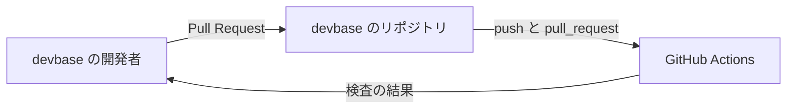
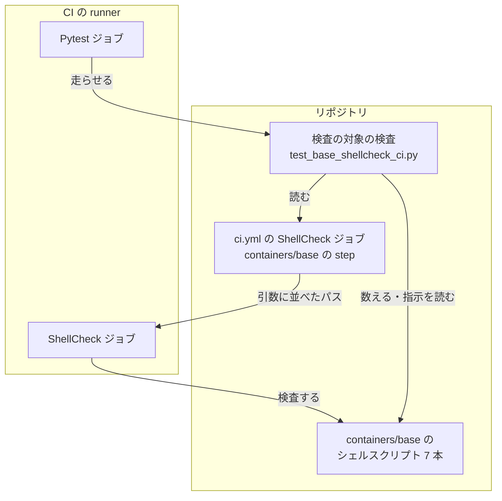
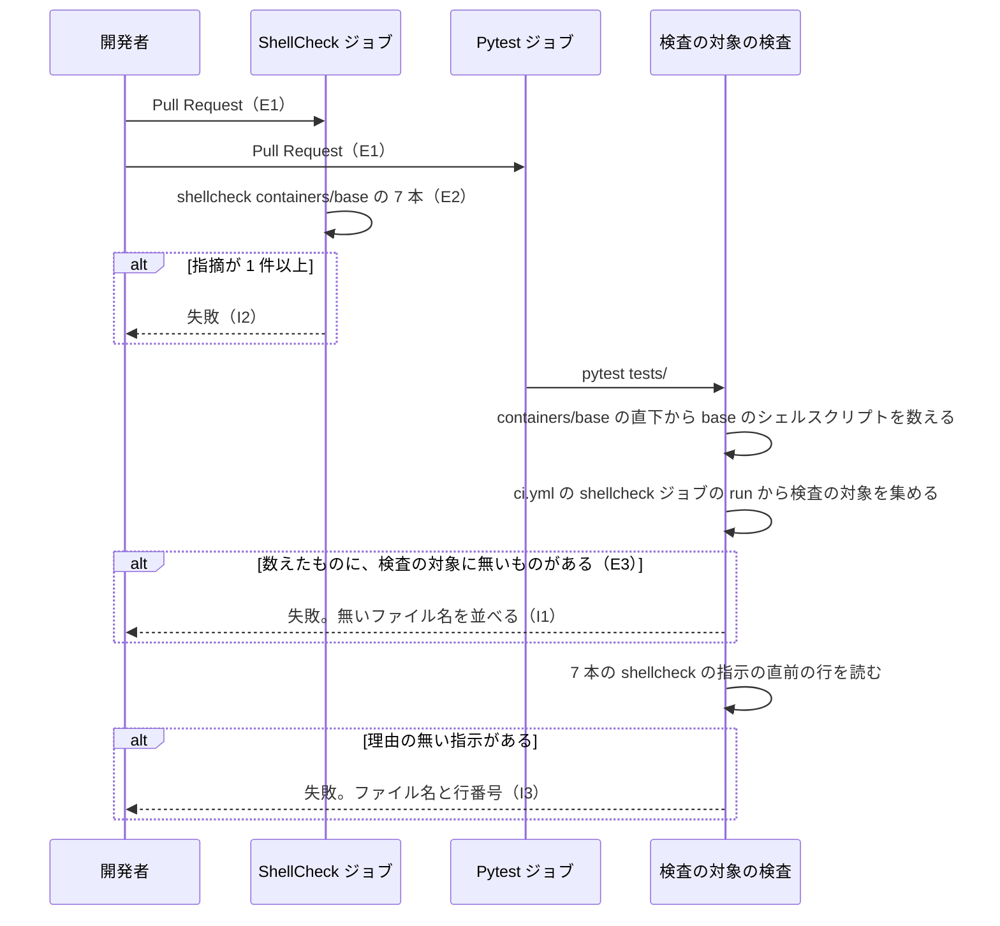

# #259: containers/base のシェルスクリプトをすべて CI の ShellCheck に載せる の設計

要求と受け入れ条件は #259 の本文にある（写しは [issue-259-requirements.md](issue-259-requirements.md)）。
この文書は「どう作るか」だけを扱う。

## ドメインモデル

### コンテキスト

| コンテキスト | 何の語が 1 つの意味に決まるか |
| --- | --- |
| 継続的インテグレーション（`ci`） | ShellCheck ジョブが何を検査し、何を指摘と数えるか |

1 つのコンテキストに収まる。`containers/base/` のファイルは base イメージに入るが、この変更が
変えるのはコメントと変数名だけで、イメージの中の振る舞い（`base-image` と `tmux` のコンテキスト）は
変えない。

### 集約

| 集約 | 持ち主（書き換えてよいもの） | 根 | エンティティ | 値オブジェクト |
| --- | --- | --- | --- | --- |
| 検査の対象 | `.github/workflows/ci.yml` の `shellcheck` ジョブの、`containers/base/` を検査する 1 つの step | その step の `shellcheck` の呼び出し | — | 検査するファイルのパス |
| base のシェルスクリプト | `containers/base/` の直下の各ファイル | 1 本のファイル | — | 指摘・shellcheck の指示（抑止の注記の指示と `shell=`）・理由のコメント |

検査の対象は base のシェルスクリプトをパスでだけ参照する。2 つの集約を揃えるのは開発者で、
揃っていないことを pytest が見つける（I1）。

### 不変条件

| # | 集約 | 条件 | 破れたときの扱い |
| --- | --- | --- | --- |
| I1 | 検査の対象 | base のシェルスクリプトはすべて、検査の対象の呼び出しの引数にある | pytest が失敗し、載っていないファイル名を出す |
| I2 | base のシェルスクリプト | shellcheck 0.11.0 の既定の水準で指摘が 0 件 | 0.11.0 の指摘は、手元の base イメージでの検査（テスト設計の条件 1）で見つかる。CI の ShellCheck ジョブが失敗するのは、runner の `PATH` にある版が指摘を出したときだけで、#247 が版を 0.11.0 に揃えるまでは 0.11.0 だけが出す指摘で CI は落ちない（決定 9） |
| I3 | base のシェルスクリプト | shellcheck の指示の行は 1 行ずつ、同じ行か直前の行に理由を持つ。直前の行が別の指示の行なら理由とみなさない | pytest が失敗し、ファイル名と行番号を出す |
| I4 | base のシェルスクリプト | コメントと変数名の変更の前後で、ファイルの振る舞いが変わらない | source する経路の前（`DEVBASE_ENTRYPOINT_LIB_ONLY` の `return` より前と、`ai-cli-aliases.sh`・`shellrc-dir.sh` の全体）は、既存の source するテストが失敗する。`return` より後の変更（決定 5 の変数名だけ）はテストで通らず、実装 Pull Request のレビューが場合分けで確かめる |

### ドメインイベント

| # | イベント | 発生元 | 受け手 |
| --- | --- | --- | --- |
| E1 | `containers/base/` のシェルを変える Pull Request を出した | 開発者 | ShellCheck ジョブと Pytest ジョブ |
| E2 | ShellCheck ジョブが `containers/base/` のシェルを検査した | ShellCheck ジョブ | 開発者（Pull Request の検査の結果を見て、指摘があれば直す） |
| E3 | `containers/base/` に新しいシェルスクリプトを足した | 開発者 | Pytest ジョブの漏れの検査（I1） |

### 用語

| 用語 | 意味 | 用語集への反映 |
| --- | --- | --- |
| base のシェルスクリプト | `containers/base/` の直下の通常のファイルのうち、先頭行が `sh` か `bash` を指す shebang か、名前が `.sh` で終わるもの | 追加（`ci`） |
| 検査の対象 | CI の ShellCheck ジョブで、引数に `containers/base/` のパスを持つ `shellcheck` の行が並べたファイル | 追加（`ci`） |
| shellcheck の指示 | `# shellcheck` で始まるコメント（`disable=` / `source=` / `shell=`）。`disable=` と `source=` は抑止の注記の指示の側で、`shell=` は指摘を抑えない | 追加（`ci`） |

「指摘」と「抑止の注記」は用語集にある意味のまま使う。

## 機能一覧

| # | 機能 | 誰が使うか |
| --- | --- | --- |
| F1 | CI が `containers/base/` のシェルスクリプト 7 本を既定の水準で検査する | devbase の開発者（Pull Request を出す人とレビューする人） |
| F2 | 既存の 10 件の指摘を 1 件ずつ、直す・抑止の注記にする・`shell=` の指示を足すのいずれかで片付ける | 同上 |
| F3 | `containers/base/` に足したシェルスクリプトが検査の対象から漏れていたら、pytest が落ちてファイル名を示す | 同上 |
| F4 | shellcheck の指示に理由が添えてあることを、pytest が確かめる | 同上 |
| F5 | 開発者向け文書の「CI が実行するもの」を合わせる | devbase の開発者 |

## 構成要素

| 要素 | 変更 | 責務 |
| --- | --- | --- |
| ShellCheck ジョブ（`.github/workflows/ci.yml`） | 変える | step「Run ShellCheck on containers/base/tmux-*」を「Run ShellCheck on containers/base/」へ置き換え、7 本を並べた 1 つの `shellcheck` の呼び出しにする。水準は指定しない（既定の style まで）。`bin/` と `install.sh` の step は変えない（#247 の範囲） |
| 起動の処理（`containers/base/entrypoint.sh`） | 変える | 指摘 7 件を「指摘ごとの判断」の表のとおりに片付ける（決定 3・4・5） |
| AI CLI の起動定義（`containers/base/ai-cli-aliases.sh`） | 変える | 先頭に理由のコメントと `# shellcheck shell=bash` を足す（決定 2） |
| 読み込み器（`containers/base/shellrc-dir.sh`） | 変える | 先頭に理由のコメントと `# shellcheck shell=bash` を足す。`. "$__devbase_shellrc_file"` の直前に理由のコメントと `# shellcheck source=/dev/null` を足す（決定 2・6） |
| 検査の対象の検査（`tests/containers/test_base_shellcheck_ci.py`、新設） | 足す | base のシェルスクリプトを数える判定、`ci.yml` の読み取り、漏れの検査（I1）、指示の理由の検査（I3）を持つ（決定 7・8） |
| 開発者向け文書（`docs/developer/contributing.md` の「CI が実行するもの」） | 変える | 「`bin/` と `install.sh` の ShellCheck」を「`bin/`・`install.sh`・`containers/base/` のシェルスクリプトの ShellCheck」にする |

次のものは変えない。

- `containers/base/dind`・`tmux-first`・`tmux-clean`・`tmux-session`（指摘 0 件。検査の対象に載るだけ）
- `containers/base/Dockerfile`。`COPY` の権限（`ai-cli-aliases.sh` と `shellrc-dir.sh` は `0644`）も変えない（決定 2）
- ShellCheck ジョブの `bin/` と `install.sh` の step、shellcheck の版の揃え方（#247。決定 9）
- 確定仕様 `docs/specifications/tmux-named-session.md` の「静的検査」の行。tmux の 3 本は引き続き既定の水準で検査され、記述は正しいまま残る
- `CHANGELOG.md`。利用者に届く振る舞いが変わらないため載せない（決定 10）

### 文脈



GitHub Actions の runner と、そこへ入っている shellcheck の版はこの変更では変えない（決定 9）。

### 構成要素と配置



2 つのジョブは互いを待たない。漏れは Pytest ジョブが、指摘は ShellCheck ジョブが見つける。
図に開発者向け文書は描かない。

### 置き場所

```text
.github/workflows/ci.yml               # 変える: containers/base の step
containers/base/
├── entrypoint.sh                      # 変える: 7 件
├── ai-cli-aliases.sh                  # 変える: 1 件
└── shellrc-dir.sh                     # 変える: 2 件
tests/containers/
└── test_base_shellcheck_ci.py         # 新設
docs/developer/contributing.md         # 変える: 「CI が実行するもの」
```

## 指摘ごとの判断

shellcheck 0.11.0（`devbase-base:latest`）で数えた 10 件である。行番号は変更前の `main` = `0174add` のもの。

| # | ファイル:行 | 指摘 | 判断 | 書き換え | 振る舞い |
| --- | --- | --- | --- | --- | --- |
| 1 | `entrypoint.sh:596` | SC2317（`exit 0` に届かない） | 抑止の注記（決定 3） | `return 0 2>/dev/null \|\| exit 0` の直前に理由と `# shellcheck disable=SC2317` | 変わらない（コメントだけ） |
| 2 | `entrypoint.sh:631` | SC2046（`$(id -u)`） | 抑止の注記（決定 4） | `sudo install ...` の直前に理由と `# shellcheck disable=SC2046`（3 と合わせて 1 つ） | 変わらない（コメントだけ） |
| 3 | `entrypoint.sh:631` | SC2046（`$(id -g)`） | 抑止の注記（決定 4） | 2 と同じ注記 | 同上 |
| 4 | `entrypoint.sh:652` | SC2046（`$(id -u)`） | 抑止の注記（決定 4） | `sudo install ...` の直前に理由と `# shellcheck disable=SC2046`（5 と合わせて 1 つ） | 同上 |
| 5 | `entrypoint.sh:652` | SC2046（`$(id -g)`） | 抑止の注記（決定 4） | 4 と同じ注記 | 同上 |
| 6 | `entrypoint.sh:749` | SC2034（`i` を使っていない） | 直す（決定 5） | `for i in {1..30}` を `for _ in {1..30}` | 変わらない（`i` を読む箇所が無い） |
| 7 | `entrypoint.sh:761` | SC2009（`ps` を `grep` している） | 抑止の注記（決定 5） | `ps aux \| grep dockerd` の直前に理由と `# shellcheck disable=SC2009` | 変わらない（コメントだけ） |
| 8 | `ai-cli-aliases.sh:1` | SC2148（対象のシェルが分からない） | 指示を足す（決定 2） | 先頭に理由と `# shellcheck shell=bash` | 変わらない（コメントだけ） |
| 9 | `shellrc-dir.sh:1` | SC2148（対象のシェルが分からない） | 指示を足す（決定 2） | 先頭に理由と `# shellcheck shell=bash` | 変わらない（コメントだけ） |
| 10 | `shellrc-dir.sh:27` | SC1090（読む先が定数でない） | 抑止の注記（決定 6） | `. "$__devbase_shellrc_file"` の直前に理由と `# shellcheck source=/dev/null` | 変わらない（コメントだけ） |

表の判断は 3 種で、直す 1 件（6）、抑止の注記 7 件（1〜5・7・10。注記は 5 つ）、指示を足す 2 件（8・9）である。

書き換えた後の形は次のとおりにする。理由の文面は実装で整えてよいが、**理由は指示の直前の行に置く**（決定 1）。

```bash
# entrypoint.sh の 1（2〜5・7 も同じ形）
if [ -n "${DEVBASE_ENTRYPOINT_LIB_ONLY:-}" ]; then
    # 実行したときは return が失敗して exit へ進む。shellcheck は source を想定せず exit を届かないと読む
    # shellcheck disable=SC2317
    return 0 2>/dev/null || exit 0
fi
```

```bash
# ai-cli-aliases.sh と shellrc-dir.sh の先頭
# ~/.bashrc から bash が source する。実行しないため shebang を置かない
# shellcheck shell=bash
# AI CLI の起動定義。対話シェルの ~/.bashrc から読み込まれる。
```

試しに 10 件を書き換えた写しを一時ディレクトリで検査し、shellcheck 0.11.0（base イメージ）と
0.9.0（公式の配布物、GitHub の `ubuntu-24.04` の runner が apt で持つ版）の両方で exit 0 になることを確かめた（2026-09-26）。
このときは 2〜5 を引用の追加で直していた。2〜5 を注記に改めた後、`sudo install` の 2 つの行の直前へ
`# shellcheck disable=SC2046` を置いた写しでも、両方の版で SC2046 が 0 件になることを確かめた（2026-09-26）。
書き換える前は、0.9.0 も 0.11.0 と同じ 10 件を出す。

## 処理の流れ



図の「containers/base の 7 本」は、構成要素の表の起動の処理・AI CLI の起動定義・読み込み器と、変えない 4 本を指す。
開発者向け文書は処理に加わらないため描かない。

### base のシェルスクリプトを数える判定

`containers/base/` の直下の各項目を名前の順に見て、次のすべてを満たすものを数える。

| 条件 | 判定 |
| --- | --- |
| 通常のファイル | `is_file()` が真で、`is_symlink()` が偽。ディレクトリは下へ降りない |
| シェルを指す | 名前が `.sh` で終わる、または先頭行が正規表現 `^#!\s*(\S*/)?(env\s+)?(sh\|bash)(\s\|$)` に一致する |

先頭行は最初の 1 行だけを読み、UTF-8 で読めない文字は置き換えて読む。2026-09-26 時点で数えるのは
`ai-cli-aliases.sh`・`dind`・`entrypoint.sh`・`shellrc-dir.sh`・`tmux-clean`・`tmux-first`・`tmux-session` の 7 本で、
`Dockerfile`・`fonts-local.conf`・`tmux.conf` は数えない。

### 検査の対象を集める規則

1. `ci.yml` を `yaml.safe_load` で読み、`jobs.shellcheck.steps` の各 step の `run` を取る。`uses` の step
   （`ludeeus/action-shellcheck` の `scandir`）は見ない
2. `run` の中の行末の `\` と改行の組を空白に置き換え、行に分ける
3. 各行を `shlex.split(行, comments=True)` で語に分け、先頭の語の basename が `shellcheck` で、かつ
   `-` で始まらない語のどれかが（先頭の `./` を取り除いて）`containers/base/` で始まる行だけを採る。
   `install.sh` だけを検査する行や `bin/` の行は採らない
4. 採った行の、`-` で始まらない語を検査の対象とする。先頭の `./` は取り除く
5. 採った行の `-` で始まる語のうち、`--severity` / `--severity=<値>`、または `-S` で始まる語（`-S` と
   `-Swarning` の両方）を水準の指定とする。水準の指定を持つ行があれば、水準の検査（テスト設計の条件 2）が
   その行を示して失敗する

漏れの検査と水準の検査は、3 で採った行にだけ掛ける。漏れの検査は、数えた各ファイルの `containers/base/<名前>` が検査の対象に含まれることを確かめる。
含まれないものを名前の順に並べて失敗の文面へ入れる。

### 指示の理由を確かめる規則

数えた 7 本の各行のうち、`^\s*#\s*shellcheck\s+\w+=` に一致する行を指示の行とする。指示の行は、次の
どちらかを満たせば理由を持つ。

- 同じ行の指示の後に ` # ` と 1 文字以上の文がある
- 直前の行が、指示の行でも shebang でもない、空でないコメント（`#` の後に 1 文字以上）である

指示の行を 2 行続けると、2 行目の直前は指示の行になり理由を持たない（I3）。2 つの指示が要るときは、
それぞれの直前に理由を置くか、`disable=SC1090,SC2046` のように 1 行にまとめて理由を 1 つ置く。

ci.yml の step の最終形は次のとおりにする。

```yaml
      # containers/base のシェルスクリプト (#259)。指摘 0 件の状態なので水準は絞らない (既定の style まで)。
      # シェルスクリプトを足したらここへも足す。漏れは tests/containers/test_base_shellcheck_ci.py が落とす
      - name: Run ShellCheck on containers/base/
        run: |
          shellcheck \
            containers/base/ai-cli-aliases.sh \
            containers/base/dind \
            containers/base/entrypoint.sh \
            containers/base/shellrc-dir.sh \
            containers/base/tmux-clean \
            containers/base/tmux-first \
            containers/base/tmux-session
```

## 決定の記録

### 決定 1: 理由は指示の直前の行にコメントで置く

`bin/rc` の既存の指示（`# shellcheck disable=SC2206` の直前の行の理由）と同じ形にそろえる。同じ行の後ろへ
` # 理由` を続ける形は 0.9.0 と 0.11.0 のどちらでも読めたが、日本語の理由を足すと行が長くなり、指示の行を
grep したときに理由が混ざる。検査の規則（「指示の理由を確かめる規則」）は受け入れ条件の文言どおり
同じ行の形も受け付け、書く側の形は直前の行に決める。

### 決定 2: `ai-cli-aliases.sh` と `shellrc-dir.sh` には shebang でなく `# shellcheck shell=bash` を置く

2 本は `~/.bashrc` から bash が source するファイルで、`0644` で置かれ実行されない。shebang を置くと実行できる
スクリプトに見え、権限との食い違いを読み手が疑う。`shell=bash` の指示は shellcheck にだけ効き、bash には
ただのコメントである。bash-language-server は拡張子 `.sh` のファイルを bash として扱い、診断を shellcheck に
任せるため、shellcheck が対象のシェルを知れば診断も正しくなる。

shebang の `#!/bin/bash` を置く形は採らない。実行権限を付けない以上、shebang は読まれない行になる。

### 決定 3: SC2317（`entrypoint.sh:596`）は抑止の注記にする

`return 0 2>/dev/null || exit 0` は、source したときは `return` で抜け、実行したときは `return` が失敗して
`exit 0` へ進む。shellcheck はファイルが実行されるとだけ読むため、`exit 0` を届かないと判定する。
書き方を変える（`[ "${BASH_SOURCE[0]}" = "$0" ]` で分岐するなど）と、テストが source する経路の振る舞いに
触れるため、注記で抑える。

### 決定 4: SC2046（`$(id -u)` / `$(id -g)` の 4 件）は抑止の注記にする

前提 3 は、引用の追加で単語分割がなくなる箇所を「変わらないことをテストで確かめてから直すか、抑止の注記にする」
と定める。確かめた結果、引用を足すと振る舞いが変わる場合があったため、注記で抑える。

`id -u` と `id -g` の出力は、成功すれば空白もグロブの文字も持たない 10 進の 1 語で、引用の有無で引数は
変わらない。変わるのは `id` が失敗して出力が空のときである。base イメージ（Ubuntu 26.04）の `install` は
uutils coreutils 0.8.0 で、GNU の `install` と空の持ち主の扱いが違う。`id` を「何も出さず exit 1」の stub に
差し替え、`sudo install -m 600 -o ... -g ... "$TMP_CRED" ~/.git-credentials 2>/dev/null || (cat ... && chmod 600 ...)`
を 2 つの形で実行した（`devbase-base:latest`、利用者 `ubuntu`、2026-09-26）。

| `id` | 形 | `install` | `~/.git-credentials` |
| --- | --- | --- | --- |
| 成功 | 引用なし・引用あり | exit 0 | `600 ubuntu:ubuntu`、中身あり（2 つの形で同じ） |
| 失敗（空） | 引用なし（`-o -g "$TMP_CRED" ...`） | `a value is required for '--owner'` で exit 1。`\|\|` の右が書く | `600 ubuntu:ubuntu`、中身あり |
| 失敗（空） | 引用あり（`-o "" -g "" ...`） | 空の持ち主を「変えない」と読み exit 0。root が書く | `600 root:root`。利用者 `ubuntu` は読めない |

GNU coreutils 9.7 の `install`（同じイメージの `gnuinstall`）は、どちらの形も `invalid user` で exit 1 を返し、
差は出ない。`install` の実装で結果が分かれるため、引用の追加は「振る舞いが変わりうる」に当たる。
`id` が失敗する場面は起動の処理では考えにくいが、変わらないことをテストで確かめられない以上、直さない。

注記は `sudo install` の 2 つの行の直前にそれぞれ 1 つ置き、理由（`id` が失敗したとき、引用があると
uutils の `install` が root の持ち主で書いてしまうため引用しない）をその直前の行に書く。1 つの注記が
`||` の右まで続く 1 つのコマンドの両方の SC2046 を抑える。

### 決定 5: SC2034 は変数名を `_` にして直し、SC2009 は抑止の注記にする

`for i in {1..30}` の `i` はファイルのどこからも読まれない（`$i` と `${i` の出現は 0 件）。shellcheck は
`_` を使わない変数として扱うため、名前を変えれば指摘が消える。`_` は bash が毎回のコマンドで上書きする
変数で、`entrypoint.sh` は `$_` を読まない。抑止の注記にしないのは、意図して使わない変数であることを
名前だけで示せるためである。

SC2009 の `ps aux | grep dockerd` は、dockerd が起動しなかったときに利用者と起動の引数を含む全列を
診断として出す。`pgrep dockerd` は PID だけを出し、`pgrep -a` でも列が変わる。診断の出力を変えないため、
注記で抑える。

### 決定 6: SC1090（`shellrc-dir.sh:27`）は `source=/dev/null` で抑える

読むのは利用者が置き場所に置くファイルで、検査の時点では存在しない。`disable=SC1090` と
`source=/dev/null` はどちらも指摘を消すが、`bin/rc` が同じ場面で `source=/dev/null` を使っており、
それにそろえる。

### 決定 7: 検査の対象は ci.yml へファイル名を並べて書き、テストで漏れを見る

受け入れ条件は「7 本を並べた 1 つの呼び出し」と「漏れたら pytest が落ちる」を求める。ファイル名を並べた
呼び出しは、ジョブのログにパスが出て、何を検査したかが ci.yml だけで読める。

CI の step の中で `containers/base/` を走査して対象を決める形は採らない。漏れが構造上起きなくなる代わりに、
何を検査したかが走査の規則を読まないと分からず、受け入れ条件の「並べた呼び出し」に当たらない。
`containers/base/*.sh` のグロブも採らない。拡張子を持たない `dind` と `tmux-*` を拾えない。

### 決定 8: 漏れの検査は 1 本の新しいテストファイルに置き、ci.yml は PyYAML で読む

PyYAML は `pyproject.toml` の実行時の依存にあり、テストが新しい依存を要さない。既存のテストに ci.yml を
読むものは無い。判定・読み取り・2 つの検査は同じ判定（base のシェルスクリプトを数える）を共有するため、
1 本のファイルにまとめる。`test_base_dockerfile_shellcheck.py` は base イメージへの shellcheck の導入を
固定するもので、CI の検査の対象とは対象が違うため足さない。

### 決定 9: shellcheck の版はこの変更で揃えず、#247 の揃え方に乗る

前提 4 のとおり版の揃え方は #247 が決める。この変更の step は、ジョブの中で `PATH` の先にある
`shellcheck` を呼ぶだけにし、#247 が版を揃えればそのまま同じ版で検査される。書き換えた後の 7 本は
0.9.0 と 0.11.0 の両方で 0 件のため、どちらが先に `main` へ入っても ShellCheck ジョブは成功する
（「並行する変更との重なり」）。

この変更で 0.11.0 を入れる step を足す形は採らない。#247 の対象範囲の「CI の ShellCheck ジョブの
shellcheck の版を 0.11.0 に揃えること」と重なり、同じ仕組みが 2 つできる。

### 決定 10: CHANGELOG には載せない

base イメージの中身はコメントと変数名だけが変わり、利用者から見える振る舞い・コマンド・出力は
変わらない。CI の対象の拡大は開発者向けで、開発者向け文書（`contributing.md`）に書く。

## 並行する変更との重なり

| 変更 | 重なるところ | 扱い |
| --- | --- | --- |
| #247（`bin/devbase` の指摘の片付けと版の揃え） | `ci.yml` の `shellcheck` ジョブを両方が書き換える | 後から `main` へ入る側が競合を解く。この変更は `containers/base/` の step だけを持ち、`bin/` と `install.sh` の step には触れない。#247 が `shellcheck` を別名の変数で呼ぶ形にしたときは、「検査の対象を集める規則」の 3 の判定を合わせる |
| #247 | `docs/developer/contributing.md` の「CI が実行するもの」 | 同じ文を両方が書き換えうる。後から入る側が両方の内容を 1 文にまとめる |

## テスト設計

| 受け入れ条件・不変条件 | 何で確かめるか |
| --- | --- |
| 条件 1: 0.11.0 の既定の水準で 7 本が 0 件 / I2 | 手元で `docker run --rm -v "$PWD":/w -w /w --entrypoint shellcheck devbase-base:latest <7 本>` が exit 0。実装 Pull Request の ShellCheck ジョブの成功 |
| 条件 2: CI が 7 本を既定の水準で検査する | `test_base_shellcheck_ci.py` の漏れの検査が、7 本すべてを検査の対象に見つける。同じファイルに、「検査の対象を集める規則」の 3 で採った行が水準の指定（同 5）を持たないことの検査を置く。規則の単体テスト: `containers/base/` の行に `--severity=warning`・`-S warning`・`-Swarning` を持たせると失敗し、`shellcheck --severity=error install.sh` の行は採らないため失敗しない。`containers/base/` のスクリプトを `install.sh` の行へ足した形は、その行を採って水準の指定で失敗する。実装 Pull Request のジョブのログに 7 本のパスが出る |
| 条件 3: 漏れたら pytest が落ち、ファイル名が出る / I1 | 判定の単体テスト: `tmp_path` に `#!/bin/sh` のファイル・`#!/usr/bin/env bash` のファイル・shebang の無い `x.sh` を置くと 3 本とも数える。漏れの検査の関数を、1 本足りない検査の対象で呼ぶと、そのファイル名を含む文面で失敗する。手動確認: `containers/base/` に空の `probe.sh` を置いて `pytest tests/containers/test_base_shellcheck_ci.py` が `probe.sh` を出して落ちることを見て消す |
| 条件 4: シェルスクリプトでないファイルを数えない | 判定の単体テスト: `tmp_path` に `#!/usr/bin/python3` のファイル・shebang の無い拡張子の無いファイル・サブディレクトリの中の `y.sh`・`.sh` への symlink を置くと数えない。実物の検査: `containers/base/` で数えたものが `Dockerfile`・`fonts-local.conf`・`tmux.conf` を含まず、7 本を含む |
| 条件 5: 抑止の注記に理由がある / I3 | `test_base_shellcheck_ci.py` の指示の検査を 7 本へ走らせて失敗が 0 件。規則の単体テスト: 理由の無い指示・直前が空行の指示・直前が shebang の指示・指示が 2 行続いてその上に理由がある形の 2 行目を失敗と数え、直前の行の理由・同じ行の ` # 理由`・理由と指示の組が 2 つ続く形を通す |
| 条件 6: 振る舞いが変わらない / I4 | `tests/containers/test_entrypoint_*.py`・`test_ai_cli_aliases.py`・`test_shellrc_dir.py` の 158 件（2026-09-26 に collect した数）がすべて通り、数が減らない。source する経路で通らない書き換えは決定 5 の変数名の 1 件で、実装 Pull Request のレビューが場合分け（`i` を読む箇所が 0 件）で確かめる。決定 4 は注記だけで、引用を変えない |
| 条件 7: `uv run --locked pytest tests/ -q` がすべて通る | 同コマンド。2026-09-26 に collect した 3233 件に新しいテストを足した数 |

## 未確認のまま残ること

| 項目 | 内容 |
| --- | --- |
| source する経路で通らない書き換え | `entrypoint.sh` の変数名の変更（決定 5）は、`DEVBASE_ENTRYPOINT_LIB_ONLY` の `return` より後にあり、テストで実行されない。場合分けで変わらないことを示す。base を建て直したコンテナでの確かめは対象範囲に含まない |
| runner の shellcheck の版 | 0.9.0 は公式の配布物で確かめた。GitHub の `ubuntu-latest` が指す版の shellcheck が別の指摘を出すかは、実装 Pull Request の ShellCheck ジョブで初めて分かる。#247 が版を揃えた後は 0.11.0 で走る |
| bash-language-server の判定 | `# shellcheck shell=bash` で言語サーバの診断が正しくなることは、shellcheck が指示を読むことから導いた。言語サーバを起動して確かめていない |
