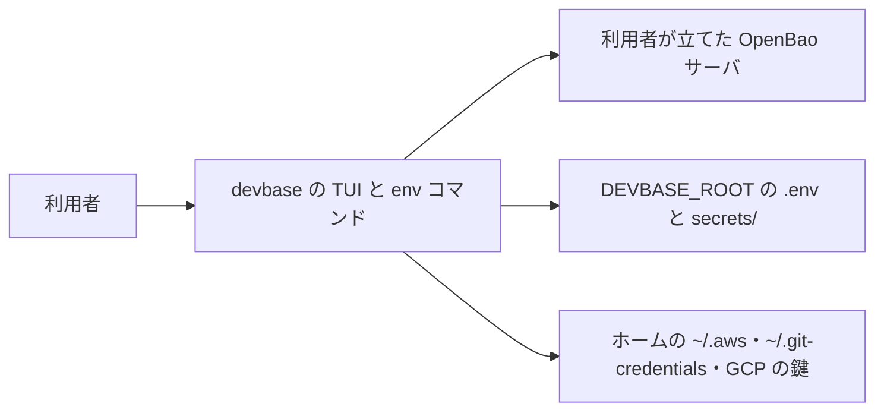
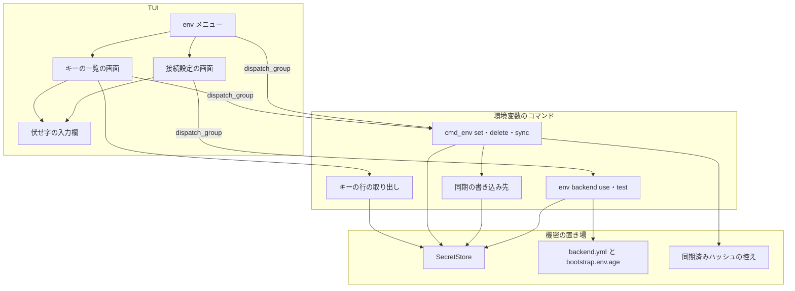
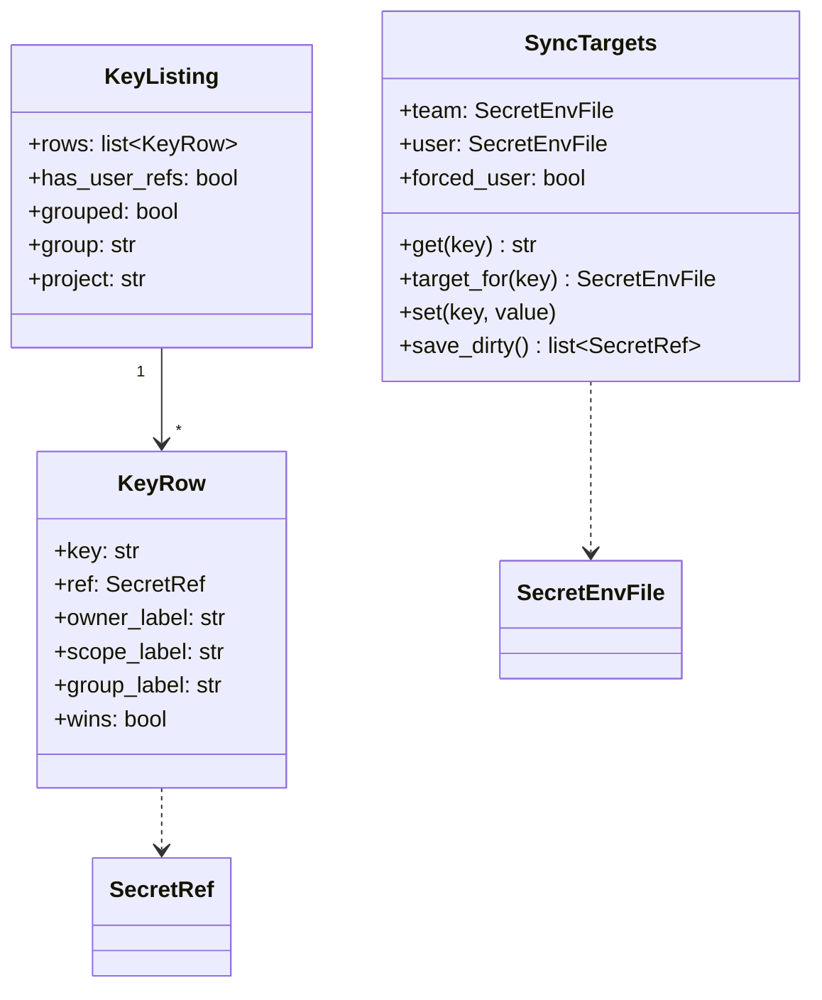
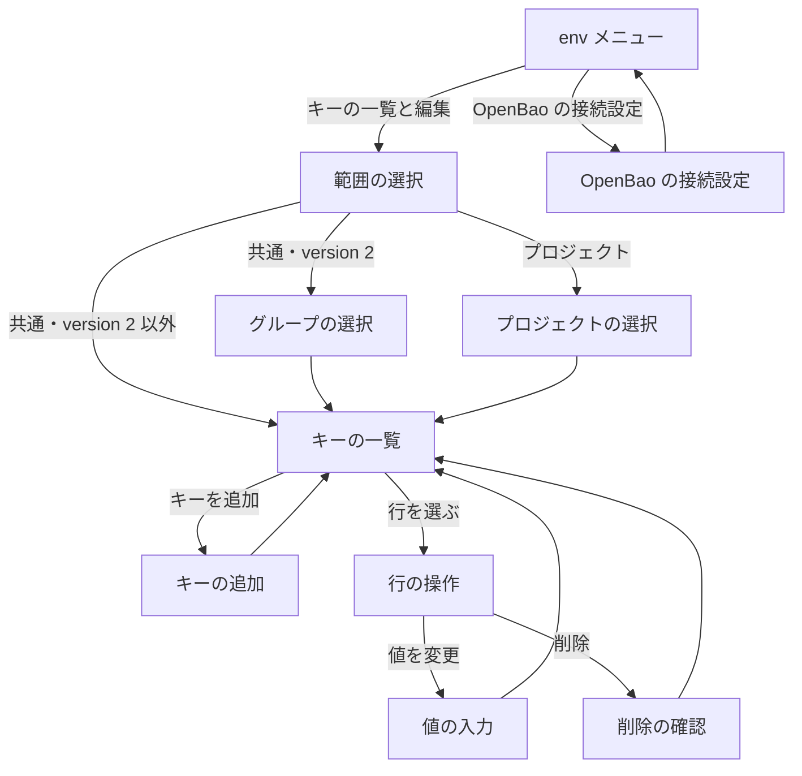
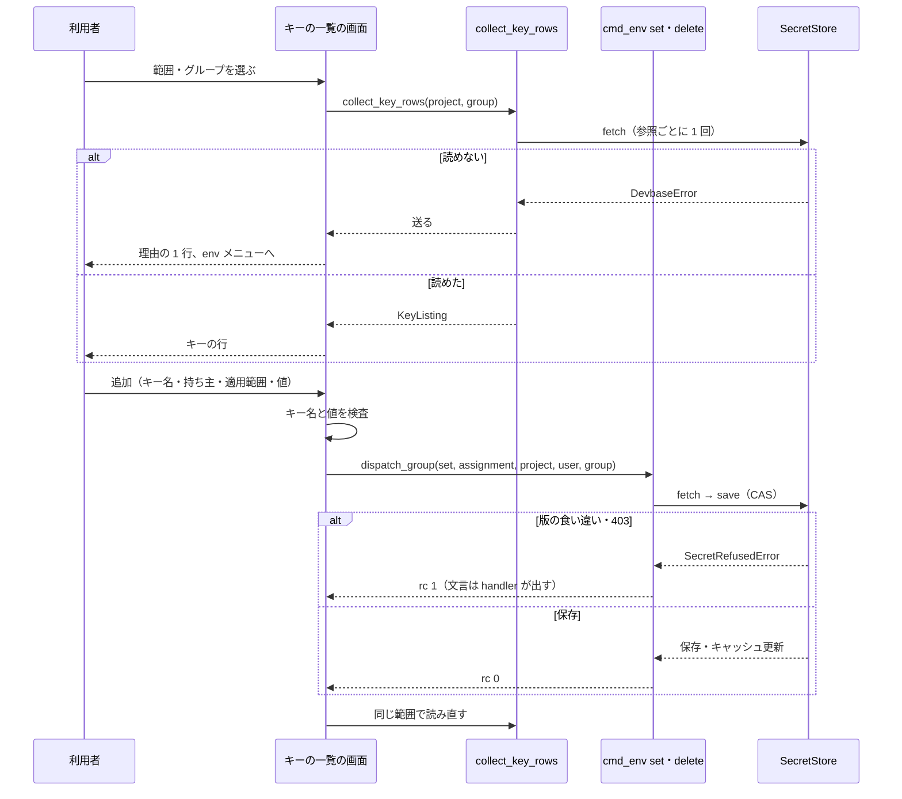
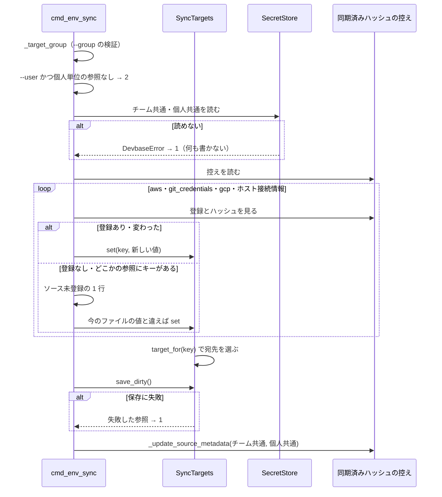

# #273: `devbase list` の TUI で env のキーを編集し、`env sync` の書き込み先と OpenBao の接続設定を揃える

要求と受け入れ条件は #273 の本文にある（コピーは `issues/issue-273-requirements.md`）。この文書は
「どう作るか」だけを扱う。前提 1〜8 は仕様のコピーの番号を指す。

#268（`env sync` が個人の参照を書き換えない）は、この設計で直す（決定 1）。#295 の決定に合わせ、
接続先の既定値を持たない（決定 7）。

決定の記録・テスト設計・未確認のまま残ることは `issues/issue-273-design-decisions.md` に分けて置く
（1 ファイル 500 行の基準）。本文の「決定 N」はそのファイルの見出しを指す。

## ドメインモデル

### コンテキスト

| コンテキスト | 何の語が 1 つの意味に決まるか |
| --- | --- |
| 機密の置き場（`secret`） | 参照・対象のグループ・チーム単位の機密・個人単位の機密・ブートストラップ機密・キャッシュ・同期の書き込み先 |

TUI は新しいコンテキストを作らない。画面の語（キーの行・勝つ行）は `secret` の語を画面へ写したもので、
意味は `secret` が決める。

### 集約

| 集約 | 持ち主（書き換えてよいもの） | 根 | エンティティ | 値オブジェクト |
| --- | --- | --- | --- | --- |
| 参照の内容 | `cmd_env_set` / `cmd_env_delete` / `cmd_env_edit` / `cmd_env_sync` / `cmd_env_init`（いずれも `SecretStore.save` を通す） | 参照（`SecretRef`） | — | キーと値の組・版（CAS の基準） |
| 接続設定 | `cmd_env_backend_use` | `backend.yml` の `openbao` 節 | ブートストラップ機密 | `url`・`mount`・`user`・`layout`・`group_aliases` |
| 同期済みハッシュの控え | `_update_source_metadata`（`sync` / `init` から呼ぶ） | 置き場のグループごとの控え | ソース（aws・git_credentials・gcp） | ファイルの位置・ハッシュ・キー名 |

- TUI はどの集約の持ち主でもない。書き込みはすべて上の持ち主へ委譲する（I1）
- `env sync` は 1 回の実行で最大 2 つの参照（チーム共通・個人共通）を書く。1 つのキーは必ず 1 つの参照だけへ
  書く（I2）。2 つの参照の保存は同じトランザクションにならない（決定 3）

### 不変条件

| # | 集約 | 条件 | 破れたときの扱い |
| --- | --- | --- | --- |
| I1 | 参照の内容 | TUI のキーの追加・変更・削除は、`cmd_env` の `set` / `delete` を、選んだ置き場を写した属性で呼ぶ。TUI から `SecretStore` へ書かない | 構造で防ぐ（TUI のモジュールは `SecretStore.save` を呼ばない） |
| I2 | 参照の内容 | `env sync` が書くキーの宛先は「`--user` なら個人共通。無ければ、個人共通にあれば個人共通、無くチーム共通にあればチーム共通、どちらにも無ければチーム共通」の 1 つ | 宛先の判定を 1 か所（`SyncTargets.target_for`）に置き、ほかの場所で宛先を決めない |
| I3 | 参照の内容 | 個人単位の参照を持たない backend では、個人単位の参照を読まず、書かない | `env sync --user` は終了コード 2 で止める。TUI は個人単位の行と持ち主の選択を出さない |
| I4 | 参照の内容 | TUI の一覧は現物から読む。キャッシュの内容を一覧に出さない | 読めなければ理由を 1 行出してサブメニューへ戻る（一覧を出さない） |
| I5 | 参照の内容 | 版の食い違い（CAS）では上書きしない | 既存の `SecretConflictError`。TUI は一覧を読み直す |
| I6 | 接続設定 | TUI の接続設定の変更は、値を入れた欄だけを変える。空の欄・`mount`・`user`・`layout`・`group_aliases`・キャッシュの設定は保つ | `use` の既存の引き継ぎ（引数が `None` の欄は既存の値）で保つ |
| I7 | 接続設定 | 形の不正な `url` では、`backend.yml` も `bootstrap.env.age` も書かない | `use` が検証を書き込みより先に行う（今の順を保つ） |
| I8 | 接続設定 | token をホストのディスクへ書かない | token を入力させない（前提 1）。`bootstrap.env.age` には `role_id` / `secret_id` だけを書く |
| I9 | 全体 | 機密の値・`role_id`・`secret_id` を画面の出力・ログ・子プロセスの引数に出さない | 入力は伏せ字の欄だけで受ける。値は同じプロセスの中の属性で渡し、`argv` を組まない |
| I10 | 同期済みハッシュの控え | 控えに登録の無いソースのキーが参照にあるとき、黙って飛ばさない | 「ソース未登録」を含む 1 行を出し、今のファイルと値を比べて更新してから控えに登録する（決定 2） |
| I11 | 参照の内容 | TUI の削除は、確認で「はい」を選んだときだけ行う | Esc・「いいえ」は `delete` を呼ばずに一覧へ戻る |

### ドメインイベント

| # | イベント | 発生元 | 受け手 |
| --- | --- | --- | --- |
| E1 | 利用者が TUI で env のキーの一覧を開いた | env メニュー | キーの一覧の画面 |
| E2 | 対象のグループと共通 / プロジェクトが決まった | 範囲の選択 | キーの行の取り出し（`collect_key_rows`） |
| E3 | 参照の中身が行として並んだ | `collect_key_rows` | キーの一覧の画面 |
| E4 | 利用者がキーを追加・変更した | キーの一覧の画面 | `cmd_env_set` |
| E5 | 参照が保存された | `cmd_env_set` / `cmd_env_delete` | キャッシュ（`OpenBaoBackend._remember`）・キーの一覧の画面（読み直す） |
| E6 | 利用者がキーを削除した | キーの一覧の画面 | `cmd_env_delete` |
| E7 | `env sync` が同期するキーの書き込み先を決めた | `SyncTargets.target_for` | `cmd_env_sync` の保存 |
| E8 | `env sync` が控えに無いソースのキーを見つけた | `cmd_env_sync` | 標準エラーの 1 行・同期済みハッシュの控え |
| E9 | 利用者が OpenBao の接続設定を開いた | env メニュー | 接続設定の画面 |
| E10 | 接続先かブートストラップ機密が保存された | `cmd_env_backend_use` | 接続設定の画面 |
| E11 | 保存した設定で接続を確かめた | 接続設定の画面（E10 の後に自動） | `cmd_env_backend_test` |

### 用語

| 用語 | 意味 | 用語集への反映 |
| --- | --- | --- |
| キーの行 | TUI の一覧の 1 行。キーと、そのキーがある参照（グループ・持ち主・適用範囲）の組。値の平文を持たない | 追加（`secret`） |
| 勝つ行 | 同じキーの行のうち、重ね順でコンテナに渡る値を持つ行。一覧に並べた参照の中だけで決める | 追加（`secret`） |
| 同期の書き込み先 | `env sync` がキーごとに選ぶ参照。I2 の規則で決まる | 追加（`secret`） |
| 同期済みハッシュの控え | `env sync` がソースファイルの位置とハッシュを記録する `.env.sources[.<g>].yml`。キャッシュ（機密の控え）とは別のもの | 追加（`secret`） |

## 機能一覧

| # | 機能 | 誰が使うか |
| --- | --- | --- |
| F1 | TUI でキーの一覧を、グループ・持ち主・適用範囲を添えて見る | 端末で `devbase list` を使う利用者 |
| F2 | TUI でキーを追加する（持ち主と適用範囲を選ぶ） | 同上 |
| F3 | TUI でキーの値を変える | 同上 |
| F4 | TUI でキーを削除する | 同上 |
| F5 | `env sync` が、キーが現にある参照（個人共通・チーム共通）へ書く | `env sync` を打つ利用者（CLI・TUI） |
| F6 | `env sync --user` / `--group` で書き込み先の持ち主とグループを選ぶ | CLI の利用者 |
| F7 | `env sync` が控えに無いソースのキーを見つけたら知らせて同期する | `env sync` を打つ利用者 |
| F8 | TUI で OpenBao の接続先とブートストラップ機密を変え、接続を確かめる | openbao の端末の利用者 |
| F9 | ファイルの backend の端末で、OpenBao への切り替えの CLI を案内する | ファイルの backend の端末の利用者 |

## 構成要素

| 要素 | 責務 | 変更 |
| --- | --- | --- |
| env メニュー（`tui/actions_env.py`） | 操作の一覧に「キーの一覧と編集」と「OpenBao の接続設定」を末尾へ足し、2 つの画面へ振り分ける。モジュールの注記の「get/set/delete は TUI から除外」を直す | 変更 |
| キーの一覧の画面（`tui/actions_env_keys.py`） | 範囲の選択・一覧の表示・行の操作・追加の入力。入力の形の検査（キー名・値）。書き込みは `cmd_env` へ委譲 | 新設 |
| 接続設定の画面（`tui/actions_env_openbao.py`） | 今の設定の表示・3 つの欄の入力・`backend use` と `backend test` への委譲。openbao でなければ案内だけ | 新設 |
| 伏せ字の入力欄（`tui/menu.py` の `secret`） | 入力した文字を画面に出さない 1 行入力。Esc・Ctrl-C の規約は `text` と同じ | 変更 |
| キーの行の取り出し（`commands/env_rows.py` の `collect_key_rows`） | 選んだ範囲の参照を現物から 1 回ずつ読み、キーの行と勝つ行の印を返す。値の平文を返さない | 新設 |
| `env sync`（`commands/env.py` の `cmd_env_sync`） | `--user` / `--group` を受け、個人共通とチーム共通を読み、キーごとに同期の書き込み先を選んで保存する | 変更 |
| 同期の書き込み先（`commands/env.py` の `SyncTargets`） | 読んだ 2 つの参照を持ち、I2 の規則でキーの宛先を返す。書いた参照を覚えて保存する | 新設 |
| 控えの更新（`commands/env.py` の `_update_source_metadata`） | 複数の参照のどれかにキーがあればソースを登録する（前提 5） | 変更 |
| `env backend use`（`commands/env_backend.py`） | 同じプロセスの中から渡された `secret_id` の値を受ける（`_read_secret_id` / `_store_credentials`） | 変更 |
| env の引数（`cli.py` の `_add_env_parser`） | `sync` に `--user` / `--group` を足す。持ち主の軸を持つ引数の組の注記（「init / sync / … には足さない」）から `sync` を外す | 変更 |
| env メニューの既存のテスト（`tests/cli/tui/test_actions_env.py`） | 操作の値の並びの等値を 7 つに直す。「get/set/delete は CLI 専用」の注記を直す。`sync` を属性なしで委譲するテストは変えない | 変更 |
| 持ち主の軸の引数のテスト（`tests/commands/test_env_user_axis.py`） | `['env', 'sync', '--user']` を拒む組から受け付ける組へ移す | 変更 |
| 利用者向けの文書 | `docs/user/cli-reference/02-project.md`（TUI の画面と「TUI が提供しない細かいオプション」から `env set/delete` を外す）・`03-env.md`（`sync` の `--user` / `--group` と宛先）・`env-backend.md`（「`init` / `sync` / `project` / `export` / `import`」の節から `sync` を分け、TUI の接続設定を足す） | 変更 |
| 確定仕様（`docs/specifications/secret-backend.md`） | 「参照の持ち主と `--user`」の「`init` / `sync` / … は `--user` を受け付けず」を `sync` を除く形に、「`init` / `sync` / `project` / `export` / `import`」の表の `env sync` の行を I2 と控えの登録（前提 5・決定 2）に書き換える | 変更 |

変えないもの: `SecretStore` / `OpenBaoBackend` / `bootstrap` / `backend_config` の読み書きと形、`set` / `delete` /
`edit` / `list` / `get` の宛先と出力、`init` / `project` / `export` / `import` の持ち主の軸、既存の env メニュー 5 つの名前と順。

### 文脈



OpenBao サーバは利用者が個人かチームで立てたもので、devbase は接続先を持たない（#295）。ソースファイルは
`env sync` が読むだけで、書かない。

### 構成要素の関係



TUI から機密の置き場へ直接つながる線は無い。読むのは `collect_key_rows`、書くのは `cmd_env` と
`cmd_env_backend` だけである（I1）。`set` / `delete` は今どおり `SecretStore` へ直接書き、`sync` だけが
同期の書き込み先を通す。`backend test` は `SecretStore` 越しにサーバを読む。図に含めない要素は、env の引数・
テスト・文書の 3 つ（処理の流れを持たない）である。

### 配置

変更は利用者の端末の 1 プロセスの中で完結する。TUI・`cmd_env`・`cmd_env_backend` は同じプロセスで動き、
TUI が集めた値は `types.SimpleNamespace` の属性として渡る。子プロセスは起動しない（I9）。OpenBao サーバへの
要求は今と同じ HTTPS（ループバック宛てだけ `http`）である。

### 置き場所

```text
lib/devbase/
├── cli.py                      # 変更: sync に --user / --group
├── commands/
│   ├── env.py                  # 変更: cmd_env_sync・SyncTargets・_update_source_metadata
│   ├── env_backend.py          # 変更: _read_secret_id・_store_credentials
│   └── env_rows.py             # 新設: collect_key_rows・KeyRow・KeyListing
└── tui/
    ├── actions_env.py          # 変更: _ENV_OPS に 2 つ・_OP_HANDLERS
    ├── actions_env_keys.py     # 新設: キーの一覧の画面
    ├── actions_env_openbao.py  # 新設: 接続設定の画面
    └── menu.py                 # 変更: secret（伏せ字の入力欄）
tests/
├── commands/test_env_sync_owner.py   # 新設: 同期の書き込み先
├── commands/test_env_rows.py         # 新設: キーの行
├── commands/test_env_backend.py      # 変更: 値で渡す secret_id
├── commands/test_env_user_axis.py    # 変更: sync を受け付ける組へ
└── cli/tui/
    ├── test_actions_env_keys.py      # 新設
    ├── test_actions_env.py           # 変更: 操作の並び
    ├── test_actions_env_openbao.py   # 新設
    └── test_menu_pty.py              # 変更: 伏せ字の入力欄
```

## 構造



- `KeyRow` は値の平文も長さも持たない。画面の値の列は常に同じ伏せ字（`******`）である（受け入れ条件「一覧の値は伏せ字」）
- `KeyListing.group` は表示用の名前（`display_group`）ではなく、`--group` に渡す名前。`grouped` が偽なら `None`
- `SyncTargets.user` は個人単位の参照を持たない backend では `None`。`target_for` はそのとき常に `team` を返す
- `SyncTargets.get(key)` は重ね順と同じく個人共通を先に見る（sync の「欠けたキーの補完」と比較に使う）

### キーの行の取り出しの契約（`collect_key_rows`）

| 項目 | 内容 |
| --- | --- |
| 入力 | `devbase_root`、`project: Optional[str]`（`None` なら共通）、`group: Optional[str]`（`--group` と同じ検証。`project` があれば無視してプロジェクトのグループを使う） |
| 読む参照 | 共通: チーム共通・個人共通。プロジェクト: 加えてチームのプロジェクト・個人のプロジェクト。個人単位の参照を持たない backend では個人の 2 つを読まない |
| 読み方 | 1 つの `SecretStore` で参照ごとに `fetch` を 1 回（キャッシュへ落ちない。I4）。`exists` を別に呼ばない |
| 行の順 | 参照の重ね順（チーム共通 → 個人共通 → チームのプロジェクト → 個人のプロジェクト）、同じ参照の中はキーの昇順 |
| 勝つ行 | 同じキーの行のうち、重ね順で最後の行に `wins=True`。1 つしか無いキーの行も `wins=True` |
| 外す行 | `DEVBASE_ACCOUNT_GROUP`（`runtime.resolve` が合成しないため、勝ち負けの対象にしない）。表示だけはする（`wins=False`） |
| 失敗の形 | `GroupOptionError`（終了コードを持つ）と `DevbaseError`（接続・403・復号）をそのまま送る。呼び出し元の画面が 1 行にして戻る |

勝つ行は一覧に並べた参照の中だけで決める。プロジェクトの非機密設定（`projects/<name>/env`、重ね順 3）は
一覧に出さないため勝ち負けに入れない（未確認のまま残ること）。

## 入出力の契約

### `devbase env sync`

| 項目 | 内容 |
| --- | --- |
| 形 | `devbase env sync [--user] [--group NAME]` |
| `--group` | `set` と同じ検証（`_target_group`）。`version: 2` の openbao でなければ終了コード 2 |
| `--user` | 全てのキーの宛先を個人共通にする（前提 4 の「`--user` を付けると個人共通へ書く」）。個人単位の参照を持たない backend では終了コード 2（チーム共通へ落とさない） |
| 宛先 | キーごとに I2 |
| 同期済みハッシュの控え | 対象のグループの `.env.sources.<g>.yml`（`version: 2`）、それ以外は `.env.sources.yml`（今と同じ） |
| 出力 | 今の行（`AWS認証: 更新しました` など）。個人共通へ書いた行だけ末尾に `（個人共通）` を付ける。チーム共通へ書いた行は今と同じ文言 |
| 未登録の行 | `<ソース名>: ソース未登録（<参照の表示>にキーがあります）。今のファイルと比べて更新しました` / `…比べて変更なし` / `…元のファイルがありません` のどれか 1 行 |
| 終了コード | 0: 成功（変更なしを含む）。1: 参照を読めない・保存に失敗（どの参照かを 1 行で示す）。2: 引数の誤り |

`--user` を足すため、`test_commands_without_the_owner_axis_reject_user` の `sync` の行を
`test_commands_with_the_owner_axis_accept_user` へ移す。`init` / `project` / `export` / `import` は今と同じく拒む。

互換性: ファイルの backend で `--user` 無しの `sync` は、宛先・出力とも変わらない（個人の参照が無いため
I2 は常にチーム共通を返す）。openbao で個人共通にキーがある端末だけ、宛先が個人共通に変わる（#268 の直し）。

### `devbase env backend use` の内部の入力

| 属性 | 出所 | 扱い |
| --- | --- | --- |
| `secret_id`（値） | TUI の接続設定の画面だけ。CLI の引数には足さない | `None` でなければ `_read_secret_id` はこれを返し、標準入力も TTY の伏せ字入力も使わない。空文字は「入力なし」 |
| `role_id` / `url` | CLI の `--role-id` / `--url` と同じ属性 | 空なら `None` で渡し、既存の値を引き継ぐ |

`_store_credentials` の「引数が無ければ既存を使う」の判定に `secret_id` の値を含める。`role_id` を変えずに
`secret_id` だけを入れた場合は、既存の `role_id` と組にして保存する。CLI の振る舞いは変わらない
（CLI の名前空間には `secret_id` の属性が無い）。

### 画面

| 画面 | 何をする場所か |
| --- | --- |
| env メニュー（既存） | 操作を選ぶ。既存の 5 つの後に「キーの一覧と編集」「OpenBao の接続設定」 |
| 範囲の選択 | 「共通」か「プロジェクト」を選ぶ |
| グループの選択 | `version: 2` のときだけ。共通でどのグループの参照を見るかを選ぶ |
| プロジェクトの選択（既存の部品） | プロジェクトを選ぶ。グループはそのプロジェクトのグループに決まる |
| キーの一覧 | キーの行を並べる。先頭に「キーを追加」、行を選ぶと行の操作へ |
| 行の操作 | 「値を変更」「削除」を選ぶ |
| キーの追加 | キー名 → 持ち主 → 適用範囲 → 値の順に入れる |
| OpenBao の接続設定 | 今の設定の表示と 3 つの欄の入力。openbao でなければ案内だけ |



Esc はどの画面でも 1 つ前へ戻る（キーの一覧の Esc は env メニューへ）。Ctrl-C は TUI 全体を終える（今の規約）。
保存・削除の後は一時停止（`pause_for_review`）して出力を読ませ、同じ範囲の一覧を読み直して出す。

#### キーの一覧の行

```text
★ AWS_CONFIG_BASE64            個人    共通              group-a   ******
  AWS_CONFIG_BASE64            チーム  共通              group-a   ******
★ GITHUB_TOKEN                 チーム  共通              group-a   ******
★ DB_PASSWORD                  個人    プロジェクト app  group-a   ******
```

| 列 | 内容 | 出さないとき |
| --- | --- | --- |
| 印 | 勝つ行に `★`、ほかは空白 | — |
| キー | キー名。32 桁で揃え、長いキーはそのまま右へ伸ばす | — |
| 持ち主 | `チーム` / `個人` | 個人単位の参照を持たない backend でも `チーム` は出す |
| 適用範囲 | `共通` / `プロジェクト <name>` | — |
| グループ | `display_group`（読み替えがあれば `default → group-a` の形） | `version: 2` でないとき列ごと出さない |
| 値 | 常に `******` | — |

見出しの 1 行に、対象の参照の数と行の数、backend の名前を出す。

#### 項目定義

| 画面 | 項目 | 型 | 必須 | 満たさないときの表示 |
| --- | --- | --- | --- | --- |
| キーの追加 | キー名 | 1 行の文字列。`^[A-Za-z_][A-Za-z0-9_]*$` | 必須 | `キー名は英字か _ で始まり、英数字と _ だけにしてください` |
| キーの追加 | キー名 | `DEVBASE_ACCOUNT_GROUP` でない | — | `DEVBASE_ACCOUNT_GROUP は機密の置き場へは書けません（projects/<name>/env か $DEVBASE_ROOT/env に書いてください）` |
| キーの追加 | 持ち主 | 選択（チーム / 個人） | 個人単位の参照を持つ backend だけ出す | — |
| キーの追加 | 適用範囲 | 選択（共通 / プロジェクト <name>） | プロジェクトの範囲で開いたときだけ出す | — |
| キーの追加・値の入力 | 値 | 伏せ字の 1 行 | 必須 | 空: `値を入力してください`。改行を含む: `改行を含む値は TUI では扱えません。devbase env edit で編集してください` |
| 削除の確認 | 確認 | はい / いいえ（既定 いいえ） | — | — |
| OpenBao の接続設定 | 接続先（`url`） | 1 行の文字列。見出しに今の値を出す | 空なら変えない | `use` の検証の文言をそのまま出す |
| OpenBao の接続設定 | `role_id` | 伏せ字の 1 行 | 空なら変えない | — |
| OpenBao の接続設定 | `secret_id` | 伏せ字の 1 行 | 空なら変えない。`role_id` を変えたときは必須 | `role_id を変えるときは secret_id も入れてください` |

キー名と値の検査は TUI の側で行い、通らなければ `set` を呼ばずに同じ欄へ戻る。CLI の `set` の検査は
今のまま足さない（CLI の出力を変えないため）。キーの追加で既にあるキーを入れたときは、同じ置き場の値の
変更として扱う（`set` の振る舞いと同じ）。

#### 状態

| 画面 | 状態 | 出すもの |
| --- | --- | --- |
| キーの一覧 | 読み込み中 | 出さない（読み終わるまで待つ） |
| キーの一覧 | 空 | 「キーを追加」の 1 行だけと、見出しに `0 件` |
| キーの一覧 | 読めない（接続・403・復号） | 参照とグループと理由の 1 行を標準エラーへ出し、一時停止して env メニューへ戻る |
| キーの一覧 | `--group` に使えない名前 | 理由の 1 行を出してグループの選択へ戻る |
| キーの一覧 | プロジェクトが 0 件 | 範囲の選択で「プロジェクト」を出さない |
| OpenBao の接続設定 | backend が openbao でない | 今の backend の名前と、`devbase env backend use openbao --url <OpenBao の URL> --role-id <role_id> --secret-id-stdin` と `devbase env backend migrate --to openbao` の 2 行を出す。欄を出さない |
| OpenBao の接続設定 | 保存に失敗 | `use` の文言を出し、`test` を呼ばずに欄の入力へ戻る |
| OpenBao の接続設定 | 接続の確認に失敗 | `test` の文言を出す。保存した設定は残し、欄の入力へ戻れる |

接続設定の画面の見出しには `url` と、ブートストラップ機密が `設定済み` / `未設定` かだけを出す。
`role_id` と `secret_id` の値は出さない。案内の URL は `<OpenBao の URL>` のまま出し、例の接続先を埋めない（#295）。

## 処理の流れ

### キーの追加・変更・削除



委譲の属性の写し（受け入れ条件「写しの表は設計で固定する」）:

| 選んだ置き場 | サブコマンドと属性 | 実行時のディレクトリ |
| --- | --- | --- |
| チーム・共通・グループ g | `set` / `delete`、`project=False`、`user=False`、`group=g` | 変えない |
| 個人・共通・グループ g | `set` / `delete`、`project=False`、`user=True`、`group=g` | 変えない |
| チーム・プロジェクト p | `set` / `delete`、`project=True`、`user=False`、`group=None` | `projects/p`（`_run_in_project`） |
| 個人・プロジェクト p | `set` / `delete`、`project=True`、`user=True`、`group=None` | `projects/p` |

- `set` は `assignment=f"{key}={value}"`、`delete` は `key=key` を渡す
- `version: 2` でないときは共通でも `group=None`
- プロジェクトで `group=None` にするのは、`-p` はプロジェクトのグループの置き場だけを読み書きし、
  実行時のディレクトリからそのグループが決まるため。違うグループを渡して終了コード 1 になる経路を作らない

### `env sync`



- ホスト接続情報（`HOST_SSH_USER` / `HOST_SSH_HOST`）は `SyncTargets.get` で両方の参照を見て、どちらにも
  無いときだけ補う。宛先は I2（どちらにも無いため、`--user` なら個人共通、無ければチーム共通）
- GCP はプロファイルのキー（`GCP_CREDENTIALS_BASE64_<p>`）ごとに同じ規則を当てる
- 保存は書いた参照だけ行う。個人共通 → チーム共通の順に保存し、先の保存が失敗したら後を保存しない
- 控えの更新は、更新が 1 件以上あったときと、未登録のソースを登録したときに行う

## 非機能の実現方式

| 大項目 | 要求の条件 | 実現方式 | 確かめ方 |
| --- | --- | --- | --- |
| 性能・拡張性 | 一覧を 1 回開いたときの OpenBao への要求は、認証 1 回と、選んだ置き場の参照の取得（共通なら 2 回、プロジェクトなら 4 回）に収まる。`LIST` を使わない | `collect_key_rows` が 1 つの `SecretStore` で参照ごとに `fetch` を 1 回だけ呼ぶ。token はその `OpenBaoBackend` の中で使い回す。グループの候補は設定とプロジェクトの `env` から作り、サーバへ尋ねない | 偽の OpenBao サーバの要求の記録を数える（共通・プロジェクトの 2 通り）。`LIST` の要求が 0 |
| 運用・保守性 | 失敗の表示は、どの参照（グループ・持ち主・共通 / プロジェクト）で何が起きたかを 1 行で示す。値は含めない | 既存の例外の文言は `ref.label()` を先頭に持つ。画面は `store.display_label(ref)` と例外の 1 行目を並べて出す。`sync` の保存の失敗も同じ形 | 403・接続断・CAS の 3 つで出力を見る。値の文字列が出力に無い |
| セキュリティ | 機密の値・`role_id`・`secret_id` は伏せ字で入力し、画面の出力・ログ・子プロセスの引数・一時ファイル以外のディスクに平文で残らない。token をホストのディスクへ保存しない | 入力は `menu.secret`（questionary の `password`、無ければ `getpass`）。値は同じプロセスの属性で渡し、子プロセスを起動しない。TUI は値を `logger` に渡さない。token は入力させず、`OpenBaoBackend` のプロセスの中だけに持つ（今と同じ） | 擬似端末で打った値が出力に無い。`caplog` に値が無い。`subprocess` を差し替えて呼ばれない。`bootstrap.env.age` を復号して 2 キーだけ |
