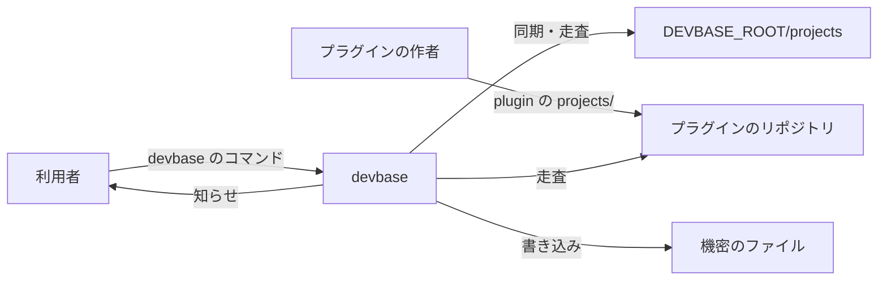
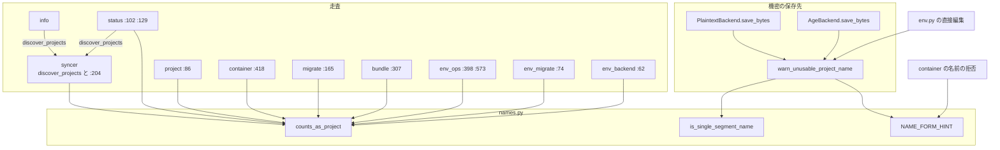
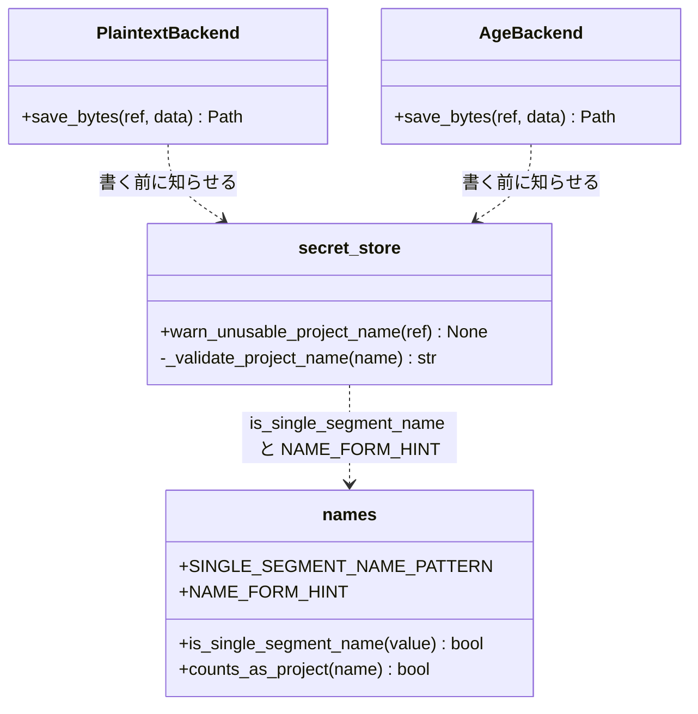
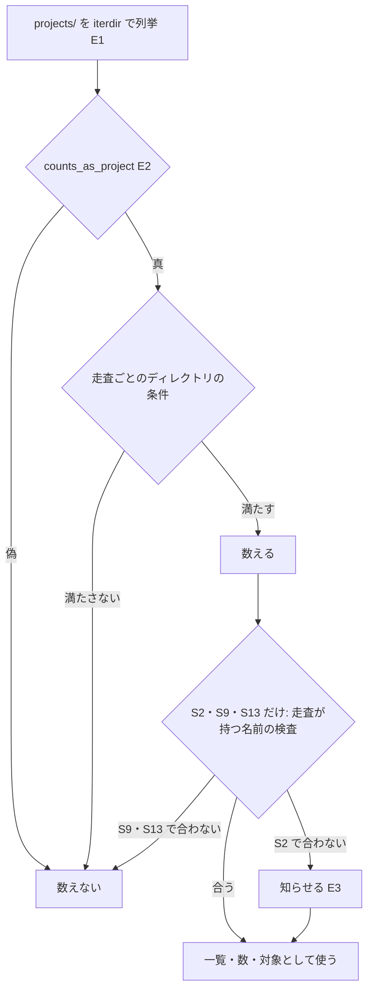
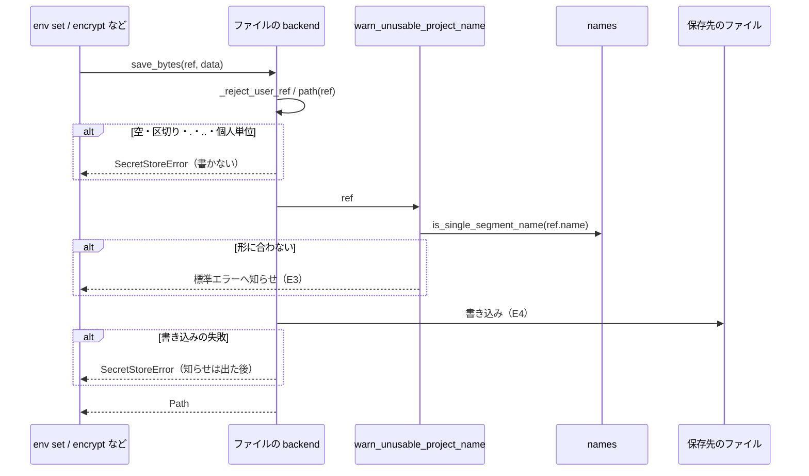

# #276: プロジェクトとして数える名前の述語と説明の文言を utils/names.py に 1 つ置く の設計

要求と受け入れ条件は #276 の本文にある（写しは [issue-276-requirements.md](issue-276-requirements.md)）。
この文書は「どう作るか」だけを扱う。対象は子 issue #226（走査）・#229（文言）・#245（機密の保存先）の
消費側のすべてである。同じミッションの #227（書庫の名前の `fullmatch` 化）は、この変更の述語との関係だけを
決定 7 に書く。

## ドメインモデル

### コンテキスト

| コンテキスト | 何の語が 1 つの意味に決まるか |
| --- | --- |
| コマンドの入口（`cli`） | 名前の形・プロジェクトとして数える名前・名前の形の説明。`projects/` の直下のどの名前を誰がどう扱うか |
| 機密の置き場（`secret`） | 機密の保存先が受け付けるプロジェクト名と、書き込みの知らせ |

2 つのコンテキストは **共有カーネル** の関係に置く。共有するのは `lib/devbase/utils/names.py` の
3 つ（名前の形の述語・プロジェクトとして数える名前の述語・名前の形の説明）だけである。同じ開発者が両方を持ち、
共有部分は `re` だけに依存する 1 ファイルに収まる。`secret` はこの 3 つを呼ぶだけで、自前の写しを持たない。

プラグインの同期（`plugin/`）とプロジェクトの一覧・状態（`commands/project.py`・`commands/status.py`）は
用語集にコンテキストを持たない。この文書では `cli` のコンテキストに含めて扱う。

### 集約

| 集約 | 持ち主（書き換えてよいもの） | 根 | エンティティ | 値オブジェクト |
| --- | --- | --- | --- | --- |
| 名前の規則 | `lib/devbase/utils/names.py` | module | — | 名前の形のパターン（`SINGLE_SEGMENT_NAME_PATTERN`）・名前の形の説明（`NAME_FORM_HINT`）・2 つの述語（`is_single_segment_name`・`counts_as_project`） |
| 機密の保存先 | `lib/devbase/env/secret_store.py` | `SecretStore` | ファイルの backend（`PlaintextBackend`・`AgeBackend`） | 参照（`SecretRef`）・保存先が受け付ける名前の検査（`_validate_project_name`） |

走査を持つ 13 か所（[走査ごとの書き換え](#走査ごとの書き換え)）は集約を持たない。**名前の規則を読むだけで、
書き換えない。** 走査ごとに違うディレクトリの条件（`is_dir()` など）は、それぞれの走査が持つ（要求の前提 3）。

### 不変条件

| # | 集約 | 条件 | 破れたときの扱い |
| --- | --- | --- | --- |
| I1 | 名前の規則 | プロジェクトとして数える名前の述語は、名前が空でなく `.` で始まらないことだけを見る。名前の形は見ない（`_foo`・`-x`・`café`・`a b` は真） | 単体テストが落ちる |
| I2 | 名前の規則 | 13 か所の走査は、名前の条件としてこの述語だけを使う。述語が偽を返す名前を数える走査は無い | 述語を差し替えるテストが落ち、数えた走査を示す |
| I3 | 名前の規則 | `plugin info` の一覧と `status` のプロジェクト数は、プラグインの同期（`discover_projects`）と同じ名前の集合を見る | 結合テストが落ちる |
| I4 | 名前の規則 | 名前の形の説明は `NAME_FORM_HINT` 1 つで、`lib/` に同じ文を持つ別の場所は無い | `grep` を回すテストが落ちる |
| I5 | 機密の保存先 | 受け付ける名前は変わらない。空・パス区切り・`.`・`..` は `SecretStoreError` で拒否し、ファイルを書かない。それ以外は受け付ける | 既存と追加のテストが落ちる |
| I6 | 機密の保存先 | ファイルの backend へプロジェクトの機密を書くとき、名前が名前の形に合わなければ知らせを 1 回出す。形に合う名前・共通の参照・読み取りでは知らせを出さない | 結合テストが落ちる |
| I7 | 名前の規則 | 名前の形のパターンの文字列は変わらず、`bin/devbase` の `_SINGLE_SEGMENT_NAME_RE` と一致する | 既存の同期テストが落ちる |

### ドメインイベント

| # | イベント | 発生元 | 受け手 |
| --- | --- | --- | --- |
| E1 | `projects/` の直下の名前を列挙した | 13 か所の走査 | 同じ走査の中の、E2 の判定 |
| E2 | 列挙した名前をプロジェクトとして数えるかを決めた | `names.counts_as_project` | 走査の続き（一覧・数・移行の対象・候補の表示） |
| E3 | 数えた名前が名前の形に合わないことを利用者へ知らせた | 同期（`syncer._warn_unusable_name`、既存）・取り込み（`io_import._warn_unusable_project_names`、既存）・機密の書き込み（`secret_store.warn_unusable_project_name`、新設） | 利用者（標準エラー） |
| E4 | 機密をプロジェクトの保存先へ書き込んだ | ファイルの backend の `save_bytes`・`env edit` の直接編集 | 保存先のファイル |
| E5 | 名前の形の説明を利用者へ示した | `container._resolve_project_name` の拒否と、E3 の各知らせ | 利用者（標準エラー） |

### 用語

| 用語 | 意味 | 用語集への反映 |
| --- | --- | --- |
| プロジェクトとして数える名前 | `projects/` の直下の名前のうち、同期・一覧・状態・機密の操作がプロジェクトとして扱うもの。空でなく `.` で始まらない名前。判定は `utils/names.counts_as_project` | 意味の変更（`cli`。要求の工程で足した意味に「空でない」と判定の関数名を書き足す） |
| 機密の書き込みの知らせ | ファイルの backend へプロジェクトの機密を書くとき、名前が名前の形に合わなければ標準エラーへ出す 1 行 | 追加（`secret`） |

「名前の形」「名前の形の説明」「参照」「backend」は用語集にある意味のまま使う。2 つの語の正本は、
`plan-to-spec` が `docs/specifications/cli-argument-resolution.md` へ移すときに決める（今は `pending_source`）。

## 機能一覧

| # | 機能 | 誰が使うか |
| --- | --- | --- |
| F1 | プロジェクトとして数える名前を 1 つの述語で決める | devbase の開発者（消費側の実装） |
| F2 | `plugin info`・`status`・`project list`・候補の表示・`project migrate-config` が、`.` 始まりのディレクトリをプロジェクトとして出さない | devbase の利用者・プラグインの作者 |
| F3 | `env export`・`env encrypt`・`env decrypt`・`env doctor`・`env backend status` と移行が、`.` 始まりのディレクトリを対象にも報告にも出さない | devbase の利用者 |
| F4 | 名前の形に合わない名前のプロジェクトへ機密を書くと、書き込みは通して知らせを出す | devbase の利用者 |
| F5 | 名前の形の説明を `NAME_FORM_HINT` 1 つから出す | devbase の利用者（受け取る文は変わらない） |
| F6 | 述語を差し替えたときに、独自の規則を持つ消費側がテストで分かる | devbase の開発者 |

## 構成要素

| 要素 | 変更 | 責務 |
| --- | --- | --- |
| 名前の規則（`lib/devbase/utils/names.py`） | 変える | `counts_as_project(name: str) -> bool` を足す（決定 1）。module の docstring に、2 つの述語の違いと、消費側が module の属性として呼ぶ約束（決定 2）を書く |
| プラグインの同期（`lib/devbase/plugin/syncer.py`） | 変える | `discover_projects` と実ディレクトリの知らせ（`:204`）の `startswith('.')` を述語に替える。`:197` の実ディレクトリの集合と `:207` の symlink の掃除は変えない（決定 4） |
| プラグインの情報（`lib/devbase/plugin/info.py`） | 変える | プロジェクトの一覧を `discover_projects` から取る（決定 3）。一覧を出す条件（`projects/` があるとき）は変えない |
| 状態（`lib/devbase/commands/status.py`） | 変える | `:102` の走査に述語を足す。`:129` のプラグインのプロジェクト数を `discover_projects` の件数にする（決定 3） |
| 一覧（`lib/devbase/commands/project.py`） | 変える | `:86` の走査に述語を足す |
| 起動の入口（`lib/devbase/commands/container.py`） | 変える | `:418` の候補の走査に述語を足す。`:594-598` のインラインの文を `NAME_FORM_HINT` の埋め込みに替える（決定 6） |
| 設定の移行（`lib/devbase/project/migrate.py`） | 変える | `:165` の走査に述語を足す |
| 書庫の書き出し（`lib/devbase/env/bundle.py`） | 変える | `_collect_projects`（`:307`）で、`_should_skip_project` より前に述語で外す。`is_valid_project_name` は変えない（決定 7） |
| 機密の点検（`lib/devbase/commands/env_ops.py`） | 変える | `:398`・`:573` の走査に述語を足す |
| 暗号化の移行（`lib/devbase/commands/env_migrate.py`） | 変える | `_project_names`（`:74`）に述語を足す |
| backend の移行（`lib/devbase/commands/env_backend.py`） | 変える | `_project_names`（`:62`）に述語を足す。`SecretRef.for_project` で外す既存の検査は残す |
| 機密の保存先（`lib/devbase/env/secret_store.py`） | 変える | 機密の書き込みの知らせを出す `warn_unusable_project_name(ref)` を足し、`PlaintextBackend.save_bytes` と `AgeBackend.save_bytes` から呼ぶ（決定 5）。`_validate_project_name` は変えない |
| 機密のコマンド（`lib/devbase/commands/env.py`） | 変える | `cmd_env_edit` の直接編集の分岐で、エディタを開く前に `warn_unusable_project_name` を呼ぶ（決定 5） |
| 確定仕様（`docs/specifications/cli-argument-resolution.md`） | 変える | 構成要素の表の `names.py` の行に述語を足す。「寄せていない 2 つ」の記述を、プロジェクトとして数える名前の規則・機密の書き込みの知らせ・`_validate_project_name` が残る理由に書き換える |
| 用語集（`docs/glossary/glossary.json` と `docs/glossary.md`） | 変える | 用語の表のとおりに直し、`glossary.py render` で作り直す |
| 変更履歴（`CHANGELOG.md` の `[Unreleased]`） | 変える | Changed に、`.` 始まりのディレクトリが一覧・状態・機密の操作と移行から外れることを書く。Added に、機密の書き込みの知らせを書く |
| テスト（`tests/utils/test_names.py`・新設の `tests/utils/test_project_name_consumers.py`・`tests/env/` の既存ファイル） | 足す | [テスト設計](#テスト設計) |

次のものは変えない。

- `SINGLE_SEGMENT_NAME_PATTERN` と `bin/devbase` の `_SINGLE_SEGMENT_NAME_RE`（I7）
- `_validate_project_name` が受け付ける名前（I5。#245 の本文の案 A）
- `env/bundle.py` の `is_valid_project_name` と `env/_import_merge.py` の `_PROJECT_ENV_RE`（決定 7、#227 の範囲）
- `env/io_import.py` の取り込みの知らせ（`_warn_unusable_project_names`）。取り込みはファイルの backend の
  `save_bytes` を通らず（`_import_atomic` が書く）、この知らせだけが出る（決定 5）
- サーバの backend（`env/openbao.py`）の書き込み（決定 5）
- `tui/actions_project.py:111`（`containers/` の走査）と、`env_ops.py:432`（`projects/*/` の一時ファイルの掃除）

### 文脈



サーバの backend（OpenBao）への書き込みの振る舞いは変えないため、図に描かない。

### 構成要素と依存



`syncer` の知らせ（`_warn_unusable_name`）と `io_import` の取り込みの知らせは、既に `is_single_segment_name` と
`NAME_FORM_HINT` を呼んでおり変えないため、図に描かない。

### 置き場所

```text
lib/devbase/
├── utils/names.py                # 変える: counts_as_project
├── plugin/
│   ├── syncer.py                 # 変える: :59-60, :204
│   └── info.py                   # 変える: :36
├── commands/
│   ├── status.py                 # 変える: :102, :129
│   ├── project.py                # 変える: :86
│   ├── container.py              # 変える: :418, :594-598
│   ├── env.py                    # 変える: cmd_env_edit の直接編集
│   ├── env_ops.py                # 変える: :398, :573
│   ├── env_migrate.py            # 変える: :74
│   └── env_backend.py            # 変える: :62
├── project/migrate.py            # 変える: :165
└── env/
    ├── bundle.py                 # 変える: :307
    └── secret_store.py           # 変える: 知らせと 2 つの save_bytes
tests/utils/
├── test_names.py                 # 足す: counts_as_project
└── test_project_name_consumers.py  # 新設: 述語の差し替えと文言の所在
```

行番号は `main` = `71a81a3` のものである。

## 走査ごとの書き換え

要求の前提 2 は「14 か所」と数えているが、これは `grep -rn "iterdir()" lib/ | grep project` の当たりから
`tui/actions_project.py:111` を除いた行数である。当たりの行には `syncer.py:197`・`:207` が含まれ、
実ディレクトリの知らせの判定がある `:204` は含まれない。**名前の条件を持つ走査は次の 13 か所である**
（#226 の表の 11 か所と `syncer.py` の 2 か所）。`:197` と `:207` を外す理由は決定 4 にある。

| # | 場所 | 用途 | 今の名前の条件 | 変更後の名前の条件 | 残すディレクトリの条件 |
| --- | --- | --- | --- | --- | --- |
| S1 | `plugin/syncer.py:59-60` `discover_projects` | プラグインの `projects/` の名前を載せる | `startswith('.')` を除外 | 述語 | `is_dir()` |
| S2 | `plugin/syncer.py:204` `sync_projects` | 実ディレクトリの名前の形の知らせ | `startswith('.')` を除外 | 述語 | 実ディレクトリ（`:197`） |
| S3 | `plugin/info.py:36` | `plugin info` の一覧 | 無し | S1 を呼ぶ | S1 と同じ |
| S4 | `commands/status.py:129` | プラグインごとのプロジェクト数 | 無し | S1 を呼ぶ | S1 と同じ |
| S5 | `commands/status.py:102` | コンテナの状態 | 無し | 述語 | `is_dir()`・`compose.yml` の有無 |
| S6 | `commands/project.py:86` | `project list` | 無し | 述語 | `is_symlink()` または `is_dir()` |
| S7 | `commands/container.py:418` | 見つからないときの候補 | 無し | 述語 | `is_dir()` または `is_symlink()` |
| S8 | `project/migrate.py:165` | `project migrate-config` の対象 | 無し | 述語 | `is_dir()` |
| S9 | `env/bundle.py:307` `_collect_projects` | `env export` の対象 | `is_valid_project_name`（警告して外す） | 述語で黙って外し、その後に `is_valid_project_name` | `is_dir()` |
| S10 | `commands/env_ops.py:398` `_check_conflicts` | `env doctor` の平文と暗号の重なり | 無し | 述語 | `is_dir()` |
| S11 | `commands/env_ops.py:573` `_ignore_probe_paths` | `env doctor` の除外設定の確認 | 無し | 述語 | `is_dir()` |
| S12 | `commands/env_migrate.py:74` `_project_names` | `env encrypt` / `env decrypt` の対象 | 無し | 述語 | `is_dir()` |
| S13 | `commands/env_backend.py:62` `_project_names` | `env backend status` と backend の移行の対象 | `SecretRef.for_project` が通るもの | 述語の後に `SecretRef.for_project` | `is_dir()` |

名前の条件とディレクトリの条件は、どちらも満たすものだけを数える（論理積）。どの走査でも、名前の条件は
ディレクトリの条件より先に評価する。壊れた symlink を名前だけで外せるためである（`stat` を打たない）。

## 構造

変更が触る型と関数だけを描く。



`SecretRef` と `SecretStore` は変えない。`save` は `save_bytes` を通るため（`secret_store.py:253`・`:383`）、
知らせを呼ぶのは `save_bytes` の 2 つだけである。

## 入出力の契約

### `names.counts_as_project`

| 項目 | 内容 |
| --- | --- |
| 入力 | `name: str`（`projects/` の直下の 1 つの名前。`Path.name` の値） |
| 出力 | 空でなく `.` で始まらなければ `True`、それ以外は `False` |
| 失敗の形 | 無い（例外を出さない。E2） |
| 副作用 | 無い（ログを出さない。module の契約のまま） |
| 例 | 真: `foo`・`_foo`・`-x`・`carmo-ai`・`café`・`a b`。偽: `.vscode`・`.`・`..`・`''` |

### `secret_store.warn_unusable_project_name`

| 項目 | 内容 |
| --- | --- |
| 入力 | `ref: SecretRef` |
| 出力 | 無い（`None`）。呼び出し側はこの関数の結果で分岐しない |
| 知らせを出す条件 | `ref.kind == 'project'` で、`names.is_single_segment_name(ref.name)` が偽のとき |
| 知らせ | `logger.warning` で 1 行（標準エラー）。名前と `NAME_FORM_HINT` を含む。文は下のとおり |
| 失敗の形 | 無い。知らせは書き込みを止めない（E3） |

知らせの文は、同期の知らせ（`syncer._warn_unusable_name`）と同じ組み立てにする。

```text
プロジェクト名として使えない形の名前のプロジェクトへ機密を書き込みます: '<name>'。この名前では、名前を指定した操作（devbase up <name> など）ができません（<NAME_FORM_HINT>）。projects/<name> の中で名前なしに打てば動きます。
```

### ファイルの backend の `save_bytes`

処理の順序だけが変わる。受け付ける参照・戻り値・例外は変えない。

1. `_reject_user_ref`（個人単位の参照を拒否。今と同じ）
2. `self.path(ref)`（`_validate_project_name` で空・区切り・`.`・`..` を拒否。今と同じ）
3. `warn_unusable_project_name(ref)`（新設）
4. 暗号化（age だけ）と書き込み（今と同じ）

拒否される参照は 2 までに止まり、知らせは出ない。そもそも `SecretRef.for_project` が同じ検査を先に行う。

### コマンドの出力

| コマンド | 変わること |
| --- | --- |
| `plugin info <plugin>` | `Projects (N)` と一覧から `.` 始まりが消える |
| `status` | コンテナの状態とプラグインのプロジェクト数から `.` 始まりが消える |
| `project list`・存在しない名前での `up` の候補・`project migrate-config` | `.` 始まりが出ない。`project migrate-config` は `.` 始まりのディレクトリのファイルを書き換えない |
| `env export` | `.` 始まりについての警告が出ない。`a b` のような名前の警告は今と同じ |
| `env encrypt`・`env decrypt`・`env doctor`・`env backend status`・`env backend` の移行 | `.` 始まりが対象にも報告にも出ない |
| `env set --project`・`env edit --project`・`env encrypt`・`env decrypt`・ファイルの backend への移行 | 名前の形に合わないプロジェクトへ書くとき、機密の書き込みの知らせが出る |
| `up '../etc'` など形に合わない名前 | 出力は 1 文字も変わらない |

引数と終了コードはどのコマンドも変わらない。

## 処理の流れ

### 走査（S1〜S13 に共通）



S2 は名前の形に合わない名前を「知らせて数える」。S9 は `is_valid_project_name` に合わない名前を「警告して
外す」。S13 は `SecretRef.for_project` が拒む名前を黙って外す（今と同じ）。ほかの走査は述語の後に名前を見ない。

図には、順序を持たない変更（`container.py` の文の差し替え・文書・用語集・変更履歴・テスト）を描かない。

### 機密の書き込み（E3 → E4）



`env edit --project` の平文の backend（直接編集）は `save_bytes` を通らない。`cmd_env_edit` が
エディタを開く前に `warn_unusable_project_name` を呼び、書くのはエディタである。

取り込み（`env import`）は、ファイルの backend では `_import_atomic` が書き、`save_bytes` を通らない。
知らせは既存の `_warn_unusable_project_names` の 1 回だけになる。

## 非機能の実現方式

| 大項目 | 条件 | 実現方式 |
| --- | --- | --- |
| 運用・保守性 | 規則を変えるときに直す場所が 1 ファイルで済み、取り残しがテストで分かる | 名前の条件は `names.counts_as_project` 1 つ。消費側は module の属性として呼ぶ（決定 2）。差し替えのテストが 13 か所を 1 つずつ見る（I2） |
| 移行性 | `projects/.<名前>/.env` が移行の対象から外れることを `CHANGELOG.md` の Changed に書く | Changed に、外れるコマンドの名前と、`.` 始まりのディレクトリに機密を置いている場合は名前を変えてから移行する案内を書く |
| セキュリティ | パスを跨がせない検査を弱めない | `_validate_project_name` と `SecretRef.for_project` は変えない。知らせは `path(ref)` の検査の後に置く（I5） |

## 決定の記録

### 決定 1: 述語は `counts_as_project(name)` とし、空と `.` 始まりだけを偽にする

要求の前提 1 のとおり、名前の形を見ない。空を偽に含めるのは、受け入れ条件が空文字で偽を求めるためと、
`''.startswith('.')` が偽のため `.` の判定だけでは空が真になるためである。名前は用語「プロジェクトとして
数える名前」から取った。`is_project_name` は名前の形の述語（`is_single_segment_name`）と読み違えやすいため
採らない。

### 決定 2: 消費側は述語を module の属性として呼ぶ

消費側は `from devbase.utils import names` と読み込み、`names.counts_as_project(...)` と呼ぶ。
食い違いのテストは定義元の `devbase.utils.names.counts_as_project` を 1 か所差し替え、それが 13 か所
すべてに届くことを見る。`from devbase.utils.names import counts_as_project` と書いた消費側には差し替えが
届かず、テストが落ちる。**独自の規則を持つ場合と同じく検出される。** 機密の書き込みの知らせも、
`names.is_single_segment_name` を同じ形で呼ぶ（受け入れ条件「`is_single_segment_name` を差し替えると
知らせの有無が従う」）。既存の `from ... import is_single_segment_name` の消費側（`cli.py` など）は、
この変更の範囲外のため書き換えない。

消費側の module ごとに差し替える組み方は採らない。消費側の一覧をテストが持つことになり、一覧に無い
新しい走査を検出できない。

### 決定 3: `plugin info` と `status` のプロジェクト数は `discover_projects` を呼ぶ

述語を個別に足すのではなく、同期と同じ関数を通す。受け入れ条件は「`discover_projects` が返す名前と
一致する」ことで、同じ関数を呼べばディレクトリの条件（`is_dir()`）まで構造的に一致する。どちらも
ディレクトリの条件は `is_dir()` だけで、呼び替えても `.` 始まり以外の結果は変わらない。

### 決定 4: `syncer.py` の `:197` と `:207` は述語を通さない

`:207` は同期が張った symlink を名前によらずすべて消す掃除で、プロジェクトを数えない。述語を通すと、
述語が偽を返す名前の symlink が残る。`:197` は実ディレクトリの集合で、別名（`<proj>.<owner>`）が実ディレクトリと
ぶつからないかを見るために使う。ここで数えるのは「実在するか」であって「プロジェクトか」ではない。
数えるのは `:204` の知らせの判定だけで、要求の前提 2 の「実ディレクトリの知らせ」はこの行を指す。

### 決定 5: 機密の書き込みの知らせは、ファイルの backend の `save_bytes` で出す

`SecretStore.save` / `save_bytes`（ストアの入口）には置かない。`env encrypt`・`env decrypt`（`env_migrate.py:253`・
`:466`）とファイルの backend への移行（`env_backend.py:749`）は、ストアを通らず backend を直に呼ぶため、
入口に置くとこれらの書き込みで知らせが漏れる。`path()` には置かない。`exists`・`load` の読み取りでも
呼ばれ、読み取りで知らせを出さない条件（I6）を破る。`save` は `save_bytes` を通るので、2 つの `save_bytes`
で書き込みのすべてを押さえられる。

直接編集（`env edit --project` の平文）は devbase が書かないため、`cmd_env_edit` が同じ関数を呼ぶ。

サーバの backend（`openbao.py`）では出さない。受け入れ条件の範囲は平文と age で、サーバの backend に
足すと、取り込みがサーバへ書く経路（`io_import._apply_via_backend`）で既存の取り込みの知らせと 2 回出る。
知らせは弾かずに伝えるだけで、`_validate_project_name` の検査は backend によらず効く。

要求の未決「知らせを出す位置」はこの決定で閉じる。

### 決定 6: `container.py` の文は `NAME_FORM_HINT` を `%s` で埋め込み、括弧は呼び出し側に残す

`"プロジェクト名に使えない形です: '%s'（%s）"` に `project_name, NAME_FORM_HINT` を渡す。`NAME_FORM_HINT` は
末尾に句点も括弧も持たない（`names.py:26-27` の契約）ので、全角の括弧は呼び出し側が持つ。組み立てた
文字列は今のインラインの文と 1 文字も変わらない。

### 決定 7: #227 の書庫の名前の規則は、この述語へ寄せず別に保つ

`bundle.is_valid_project_name` と `_import_merge._PROJECT_ENV_RE` は、書庫の中の名前（先頭の `_` を許し、
`.` 始まりを弾く）の規則で、export と import の往復の互換を持つ（要求の前提 5）。プロジェクトとして
数える名前は `projects/` の直下のどれを扱うかの規則で、書庫の側には `projects/` の走査が無い（import は
書庫のメンバー名だけを見る）。2 つは別の集合を決めるので、`names.py` へ寄せない。#227 の `fullmatch` 化は
書庫の規則の中で閉じ、`names.py` を変えない。

2 つが同じ場所で出会うのは S9（`_collect_projects`）だけである。この変更は S9 に「述語で外す」を前段として
足し、#227 は後段の `is_valid_project_name` の中身を変える。**どちらを先にマージしても意味はぶつからない。**
`projects/foo\n` のような名前は前段を通り（`.` で始まらない）、#227 の後は後段が警告して外す。

`is_valid_project_name` を `is_single_segment_name` と `counts_as_project` の組み合わせで書き直す案は
採らない。先頭の `_` を許すかどうかが違い、書き直すと書庫が受け付ける名前が変わる。

### 決定 8: 食い違いのテストは 1 ファイルに集め、13 か所を 1 つずつ行にする

述語の差し替えは同じ手順で 13 か所へ当たるため、消費側のテストファイルへ散らさず
`tests/utils/test_project_name_consumers.py` に集める。行ごとに走査の番号（S1〜S13）を名前に持たせ、
落ちたときにどの走査が独自の規則を持つかが分かるようにする。文言の所在（I4）と `startswith('.')` の
所在（受け入れ条件の `grep`）も同じファイルで見る。

## テスト設計

| 受け入れ条件・不変条件 | どの振る舞いで縛るか | どう壊したら落ちるべきか |
| --- | --- | --- |
| 述語の真偽（I1） | `counts_as_project` が `foo`・`_foo`・`-x`・`carmo-ai`・`café`・`a b` で真、`.vscode`・`.`・`..`・`''` で偽 | 空を真にする、名前の形を見るように変える、`..` だけを特別扱いする |
| `startswith('.')` の所在 | `lib/` の中で、プロジェクトの名前に `startswith('.')` を当てる箇所が `utils/names.py` の外に無い | S1 か S2 に `startswith('.')` を戻す |
| 文言の所在（I4・#229） | `lib/` の中で `英数字で始まり、英数字` を含むファイルが `utils/names.py` だけ | `container.py` にインラインの文を戻す |
| `plugin info` と `status` の一致（#226 (a)・I3） | プラグインの `projects/` に `bar` と `.foo` を置くと、`plugin info` は `bar` だけで `Projects (1)`、`status` のそのプラグインの数は 1 で、`discover_projects` の結果と同じ | `info.py` か `status.py:129` を独自の走査に戻す |
| `DEVBASE_ROOT/projects` の `.vscode`（#226 (b)） | `bar` と `.vscode` があるとき、`project list`・候補の表示・`project migrate-config`・`status` のどれにも `.vscode` が出ず、`.vscode` の中のファイルの中身が変わらない | S5〜S8 のどれかから述語を外す |
| 機密の操作の `.vscode`（#226 (b)） | `.vscode/.env` と `bar/.env` があるとき、`env export`・`env encrypt`・`env decrypt`・`env doctor`・`env backend status` で `.vscode` が対象にも報告にも出ず、`env export` は `.vscode` の警告を出さない。`bar` の扱いは変更前と同じ | S9〜S13 のどれかから述語を外す、S9 で述語を `_should_skip_project` の後に置く |
| `a b` の警告 | `projects/a b` があると `env export` がこれまでどおり警告して外す | S9 の後段（`is_valid_project_name`）を述語だけに置き換える |
| 13 か所の食い違い（I2） | 述語を「`bar` も偽」に差し替えると、S1〜S13 のどの走査も `bar` を数えない（行ごとに 1 つ） | どれか 1 か所で述語を呼ばずに独自の条件を書く、または `from ... import counts_as_project` で読み込む |
| `container.py` の文（#229） | `_resolve_project_name` に `../etc` を渡したときのエラーの文字列が、変更前の文字列の定数と完全に一致する | 括弧を落とす、句点を足す、`NAME_FORM_HINT` の前後の文字を変える |
| `_foo` への書き込み（#245・I6） | 平文と age のそれぞれで `_foo` の参照へ `save` すると書き込みが成功し、標準エラーに `_foo` と `NAME_FORM_HINT` を含む知らせがちょうど 1 回出る | 知らせを消す、`save` と `save_bytes` の両方で知らせて 2 回にする、知らせを書き込みの後に置く |
| `env edit` の直接編集（I6） | 平文の backend で `_foo` のディレクトリから `env edit --project` を打つと、エディタを開く前に知らせが 1 回出る | 直接編集の分岐で呼び出しを落とす |
| 取り込みの知らせの重なり（I6） | ファイルの backend で `_foo` を含む書庫を `env import` すると、`_foo` についての知らせは取り込みの知らせの 1 回だけ | 取り込みの経路にも機密の書き込みの知らせを足す |
| 知らせを出さない場合（I6） | `bar` への書き込み、共通の参照への書き込み、どの名前でも `load`・`exists` では知らせが出ない | `path()` で知らせる、`kind` を見ずに知らせる |
| 拒否（I5） | 空・`a/b`・`.`・`..` は `SecretStoreError` で止まり、ファイルが作られず、知らせも出ない | `_validate_project_name` を緩める、知らせを `path(ref)` の前に置く |
| 名前の形の差し替え | `names.is_single_segment_name` を「`bar` も偽」に差し替えると `bar` への書き込みで知らせが出て、「すべて真」に差し替えると `_foo` への書き込みで出ない | 知らせの判定を自前の正規表現で書く、`from ... import is_single_segment_name` で読み込む |
| パターンの同期（I7） | 既存の同期テストが通り、`SINGLE_SEGMENT_NAME_PATTERN` の文字列が変わらない | パターンを変える |
| 退行 | `uv run --locked pytest tests/ -q` と `uv run ruff check lib tests` がすべて通る | — |

テストは実環境の `DEVBASE_ROOT` を継承しない（`tests/conftest.py` の `_isolate_devbase_root`）。
`status`・`project list` はコンテナの状態を `docker ps` で取るため、docker を呼ばずに走査の結果だけを見る
組み方は実装（`tdd-cycle`）で決める。

## 未確認のまま残ること

| 項目 | 内容 |
| --- | --- |
| 要求の前提 2 の数 | 課題の本文は「12 か所 + 2 か所 = 14 か所」と書くが、名前の条件を持つ走査は 13 か所である（[走査ごとの書き換え](#走査ごとの書き換え)）。受け入れ条件の「14 か所の走査のどれもが `bar` を数えない」は S1〜S13 で満たす。本文の数を直すかは設計 PR のレビューで決める |
| `.` 始まりのディレクトリでの `env set --project` | 要求の未決のとおり、知らせだけにする（`.foo` は名前の形に合わないので知らせが出る）。拒否へ変えるかは設計 PR のレビューで利用者が決める。変えるなら `_validate_project_name` を変える別の変更になり、I5 が変わる |
| サーバの backend の書き込み | `env set --project` をサーバの backend で `_foo` へ打っても知らせは出ない（決定 5）。要るなら取り込みの経路との重なりを避けて足す別の変更になる |
| `status` と `project list` の結合テストの組み方 | `docker ps` を呼ぶ既存の関数を差し替えるか、走査の関数を直に呼ぶかは、`tdd-cycle` で走らせて決める |
