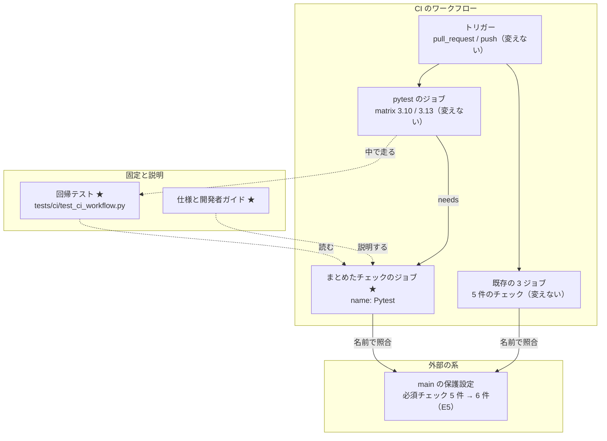
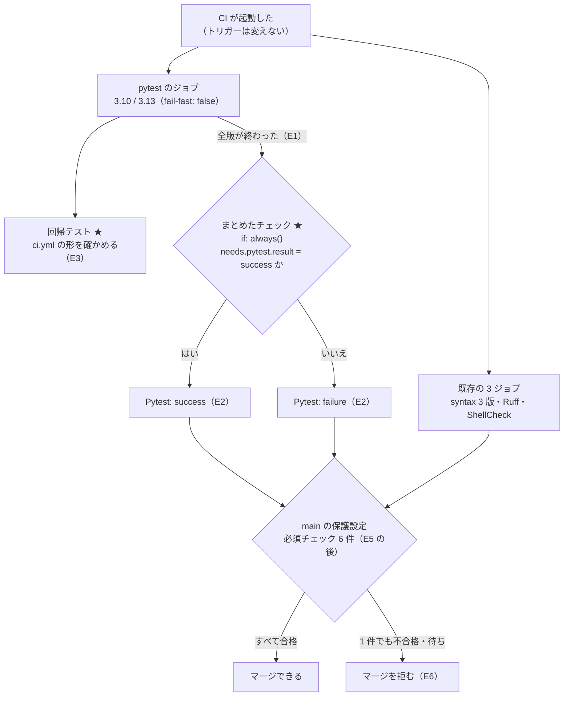
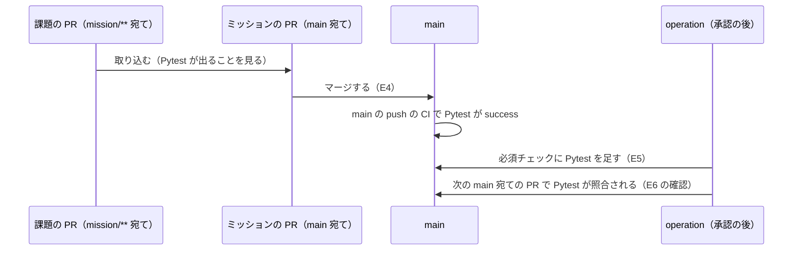

# #277: pytest を main の必須チェックに入れる の設計

要求と受け入れ条件は #277 の本文にある（写しは [issue-277-requirements.md](issue-277-requirements.md)）。
この文書は「どう作るか」だけを扱う。#291（`ci.yml` のトリガーと検査ジョブの名前を固定する回帰テスト）も範囲に含める。

## ドメインモデル

### コンテキスト

| コンテキスト | 何の語が 1 つの意味に決まるか |
| --- | --- |
| 継続的インテグレーション（`ci`） | `ci.yml` の検査ジョブとトリガー、まとめたチェック、`main` の必須チェック |

外部の系として GitHub の保護設定（`main` の必須チェック）と接する。関係は**順応者**である。
保護設定は、ジョブの `name` と matrix の値から GitHub が作るチェックの名前で照合する。照合の規則は
GitHub が決め、こちらからは変えられない。そのため `ci.yml` の側が名前を保つ。

この変更は、保護設定の中身（必須チェックの一覧）も 1 度だけ書き換える（E5）。書き換えは、承認を得た
operation が `gh api` で行う。リポジトリの差分からは書き換えない。

### 集約

| 集約 | 持ち主（書き換えてよいもの） | 根 | エンティティ | 値オブジェクト |
| --- | --- | --- | --- | --- |
| CI のワークフロー | `.github/workflows/ci.yml`。この変更で書き換えるのは `jobs:` へのジョブ 1 つの追加だけ | ワークフロー（`name: CI`） | 検査ジョブ（`name` で識別する） | トリガー・チェックの名前・まとめの判定（待つ相手と、合格とみなす結論） |
| `main` の保護設定 | 承認を得た operation（E5）。`ci.yml` とテストは読むだけで、書き換えない | `main` の branch protection | — | 必須チェック（名前と提供元の組）・`strict` |

`tests/ci/`・`docs/specifications/ci-checks.md`・`docs/developer/contributing.md` はどの集約にも属さない。
回帰テストは CI のワークフローの状態を読んで固定するだけで、文書はそれを説明するだけである。

2 つの集約は名前でだけつながる。必須チェックの名前が、CI のワークフローの作るチェックの名前に含まれていることを
揃えるのは operation の側である（E5 の前後の確認）。

### 不変条件

| # | 集約 | 条件 | 破れたときの扱い |
| --- | --- | --- | --- |
| I1 | CI のワークフロー | `pull_request` のトリガーは宛先のブランチで絞らない（`branches` / `branches-ignore` を持たない） | 回帰テストが落ちる |
| I2 | CI のワークフロー | `push` のトリガーの `branches` は、`main`・`release/**`・`mission/**` の 3 つとちょうど一致する | 回帰テストが落ちる |
| I3 | CI のワークフロー | 検査ジョブが作るチェックの名前は次の 8 件とちょうど一致する: `Python syntax check (3.10)` / `(3.11)` / `(3.12)`・`Ruff lint`・`ShellCheck`・`Pytest (Python 3.10)`・`Pytest (Python 3.13)`・`Pytest` | 回帰テストが落ちる。必須チェックの名前が消えれば、`main` 宛ての Pull Request で必須チェックが「待ち」のまま残る |
| I4 | CI のワークフロー | まとめたチェックのジョブは、pytest のジョブ（matrix の全版）が終わるまで待つ | 回帰テストが落ちる |
| I5 | CI のワークフロー | まとめたチェックのジョブは、pytest のジョブの結論に関わらず走る。`skipped` にならない | 回帰テストが落ちる |
| I6 | CI のワークフロー | まとめたチェックは、pytest のジョブの結果が `success` のときだけ成功し、それ以外（`failure`・`cancelled`・`skipped`）はすべて失敗する | 回帰テストが落ちる |
| I7 | `main` の保護設定 | 必須チェックは既存の 5 件と `Pytest` の 6 件で、どれも提供元は GitHub Actions（app_id 15368）、`strict` は `true` | E5 の後の `gh api` の確認で食い違いを見つけ、保護設定を戻す |

I3 の 8 件のうち、E5 の後に必須になるのは I7 の 6 件である。`Pytest (Python 3.10)` と `Pytest (Python 3.13)` は
必須にしない。matrix の版に依存する名前だからである（決定 2）。

### ドメインイベント

要求の番号を引き継ぐ。

| # | イベント | 発生元 | 受け手 |
| --- | --- | --- | --- |
| E1 | pytest の matrix の各版が終わった（成功・失敗・取り消し・時間切れ） | pytest のジョブ | まとめたチェックのジョブ（`needs` で待つ） |
| E2 | まとめたチェックの結論が出た | まとめたチェックのジョブ | Pull Request のチェック一覧と、`main` の保護設定の照合 |
| E3 | 回帰テストが `ci.yml` の形を確かめた | pytest のジョブの中の `tests/ci/test_ci_workflow.py` | pytest のジョブの結論（崩れていれば失敗し、E2 が `failure` になる） |
| E4 | この課題の変更が `main` へ入った | 人のマージ（ミッション m02-ci の Pull Request） | E5 を行う operation（前に進めてよい合図） |
| E5 | `main` の必須チェックに `Pytest` が足された | 承認を得た operation（`gh api`） | `main` 宛ての Pull Request のマージの判定 |
| E6 | pytest が落ちた Pull Request の `main` へのマージが拒まれた | GitHub の保護設定 | Pull Request を出した開発者・エージェント |

### 用語

| 用語 | 意味 | 用語集への反映 |
| --- | --- | --- |
| まとめたチェック | pytest の matrix の全版の結果を 1 つにまとめ、版に依存しない名前 `Pytest` で出るチェック。全版が成功したときだけ成功する | 追加（`ci`） |
| 必須チェック | `main` の保護設定の `required_status_checks` に並ぶチェックの名前。すべてが合格しないと `main` へマージできない | 要求で追加済み（`ci`） |
| 検査ジョブ | `ci.yml` の jobs の 1 つ。まとめたチェックのジョブも検査ジョブの 1 つとして数える | 変更（`ci`。意味の列挙に `pytest-all` を足す） |

## 機能一覧

| # | 機能 | 誰が使うか |
| --- | --- | --- |
| F1 | pytest の matrix の全版の結果を、1 つのチェック `Pytest` で見る | Pull Request を出す開発者・エージェント、CI の結果で収束を判定するレビュー |
| F2 | pytest が 1 版でも落ちた（または走り切らなかった）Pull Request を `main` へマージさせない（E5 の後） | `main` へマージする人 |
| F3 | pytest の matrix の版を足し引きしても、保護設定を直さずに照合が続く | `ci.yml` を直す devbase の開発者 |
| F4 | トリガーの形と検査ジョブの名前が崩れたら、CI の pytest で気づく（#291） | `ci.yml` を直す devbase の開発者 |

## 構成要素

| 要素 | 変更 | 責務 |
| --- | --- | --- |
| `ci.yml` の `jobs.pytest-all`（新設） | 足す | `name: Pytest`。`needs: pytest` と `if: always()` で pytest の全版を待ち、`needs.pytest.result` が `success` のときだけ終了コード 0 を返す（I4〜I6、決定 1・3・4） |
| `ci.yml` のほかの 4 ジョブと `on:` | 変えない | `name`・matrix・手順・トリガーを 1 文字も変えない（I1〜I3 の既存 7 件） |
| `tests/ci/test_ci_workflow.py`（新設） | 足す | PyYAML で `ci.yml` を読み、I1〜I6 を 1 条件 1 テストで固定する。I6 は判定の手順を bash で走らせて確かめる（決定 5） |
| `docs/specifications/ci-checks.md` | 変える | まとめたチェックのジョブ・8 件の名前・必須チェック 6 件を書き、回帰テストの名前を「止めるもの」として書く（下の「文書の差分の対象」） |
| `docs/developer/contributing.md` の「CI が実行するもの」 | 変える | まとめたチェック `Pytest` と、それが `main` の必須チェックであることを 1 段落で足す |
| `docs/glossary/glossary.json` と `docs/glossary.md` | 変える | 語「まとめたチェック」を足し、語「検査ジョブ」の意味の列挙に `pytest-all` を足して、`glossary.py render` で作り直す |
| `main` の保護設定の `required_status_checks` | E5 で変える（operation） | `checks` に `{"context": "Pytest", "app_id": 15368}` を足す。`strict` と既存の 5 件はそのまま（I7、決定 6） |

次のものは変えない。

- `.github/workflows/pages.yml`（対象範囲の外）
- 統合ブランチの保護・`enforce_admins`・レビューの必須化（要求の前提 1・4）
- `CHANGELOG.md`（決定 7）
- `tests/ci/test_shellcheck_job.py` と `tests/containers/` の `ci.yml` を読むテスト。どれも `jobs.shellcheck` だけを読み、
  ジョブの数や名前の一覧を前提にしていない

### 文書の差分の対象

チェックの名前の集合（7 件）と必須チェックの集合（5 件）へ値を足すため、この 2 つの集合を前提にした記述を
`ci-checks.md` と `contributing.md` から集め、1 つずつ判定した。当てはまらなくなる記述は次のとおりで、どれも変える。

| 置き場所（変更前） | 今の記述 | 変えた後 |
| --- | --- | --- |
| `ci-checks.md` の「検査ジョブ」の表と直後の文（77〜85 行目） | 4 ジョブの表と「走るチェックは 7 件」 | `pytest-all` の行を足し、8 件にする |
| `ci-checks.md` の「常に成り立つ条件」（200〜202 行目） | トリガー 2 行と名前の行が「止める pytest は無い」 | `tests/ci/test_ci_workflow.py` のテスト名を書く。名前は 8 件にする。まとめの判定（I4〜I6）の行を足す |
| `ci-checks.md` の「ドメインイベント」（217〜218 行目） | 「7 件の検査ジョブ」 | 8 件にし、まとめたチェックの結論が出るイベントを足す |
| `ci-checks.md` の「エラー処理」の末尾（245 行目） | 「検査ジョブどうしは互いを待たない」 | まとめたチェックのジョブだけが pytest を待つ、に改める |
| `ci-checks.md` の「運用」（256〜258 行目） | 必須チェック 5 件、「`Pytest` は必須に入っていない」 | 必須チェック 6 件にし、matrix の版を変えても保護設定は直さなくてよいことを書く |
| `ci-checks.md` の「テスト観点」の「pytest で確かめないもの」（311〜314 行目） | トリガーの形と検査ジョブの名前を pytest で確かめない、7 件、必須 5 件 | 回帰テストの観点を足し、この項目を「実際の起動と保護設定の照合は GitHub の上で見る」に改める |
| `ci-checks.md` の「対象範囲」と「含まないもの」（46〜56 行目） | 保護設定そのものは含まない | 保護設定の中身は含まないまま、必須チェックの一覧（E5 の後の 6 件）を運用の節で書くことを足す |
| `contributing.md` の「CI が実行するもの」（251〜266 行目） | pytest の 2 版を実行する、とだけ書く | まとめたチェック `Pytest` が `main` の必須チェックであることを足す |

`ci-checks.md` の概要の「4 種の検査ジョブ」は変えない。まとめたチェックは新しい検査を持たず、pytest の結果を
まとめるだけである。値ごとに分岐する記述は、ほかの `docs/`・`tests/`・`lib/`・`bin/` には無い
（`grep -rn -E "7 件|5 件|Pytest \(Python|必須チェック|Python syntax check"` を `issues/old/` を除いて打った結果）。

### 構成要素図



★ はこの変更で足す・変えるもの。点線は実行時の流れではなく、読む・説明する関係である。用語集は図に含めない。

### 置き場所

```text
.github/workflows/ci.yml              # jobs の末尾へ pytest-all を足す
tests/ci/
└── test_ci_workflow.py               # 新設（__init__.py は既にある）
docs/specifications/ci-checks.md      # 上の表の 7 か所
docs/developer/contributing.md        # 「CI が実行するもの」の 1 段落
docs/glossary/glossary.json           # 語「まとめたチェック」を足し、語「検査ジョブ」を直す
docs/glossary.md                      # glossary.py render で作り直す
```

## 入出力の契約

### `ci.yml` に足すジョブの形

`jobs:` の末尾（`pytest` の後）へ足す。

```yaml
  # pytest の matrix の全版を 1 つのチェックにまとめる (#277)。main の必須チェックはこの名前で照合する。
  # matrix の版を変えても名前は変わらないため、保護設定を直さずに済む。
  # always() で pytest の結論に関わらず走らせる。skipped は必須チェックで合格と扱われるため出さない。
  pytest-all:
    name: Pytest
    needs: pytest
    if: always()
    runs-on: ubuntu-latest
    timeout-minutes: 5
    steps:
      - name: Check all pytest versions passed
        env:
          RESULT: ${{ needs.pytest.result }}
        run: |
          echo "pytest の matrix の結果: ${RESULT}"
          test "${RESULT}" = success
```

| 項目 | 値 | 理由 |
| --- | --- | --- |
| ジョブ ID | `pytest-all` | ID は照合に使われない。`needs` と回帰テストが引く |
| `name` | `Pytest`（固定の文字列。matrix の式を含まない） | 必須チェックの名前になる。既存の 7 件と重ならない（決定 2） |
| `needs` | `pytest` | matrix のジョブを `needs` に書くと、全版が終わるまで待つ（I4） |
| `if` | `always()` | pytest が失敗・取り消しでも走る（I5、決定 3） |
| 判定 | `needs.pytest.result` を `env` で渡し、`success` と等しいかを `test` で見る | 全版が成功したときだけ `success` になる。それ以外の値はすべて非 0 で終わる（I6、決定 4） |
| `strategy` | 持たない | matrix を持つと GitHub が名前に値を付け、名前が版に依存する |
| `actions/checkout` | 使わない | リポジトリの中身を読まないため |

`needs.<job>.result` は、matrix のジョブでは全版をまとめた 1 つの値になる。どれか 1 版が `failure` なら
`failure`、取り消されれば `cancelled` になる（GitHub の文書の `needs` コンテキスト）。判定は `success` との一致だけを
見るため、ほかにどの値が来ても失敗する。

### まとめたチェックの結論

| pytest の全版 | `needs.pytest.result` | まとめたチェックのジョブ | 結論 | 必須チェックとして |
| --- | --- | --- | --- | --- |
| すべて成功 | `success` | 走り、0 で終わる | `success` | 合格 |
| 1 版でも失敗・時間切れ | `failure` | 走り、非 0 で終わる | `failure` | 不合格 |
| 取り消された（ワークフローの取り消しを含む） | `cancelled` | 走り、非 0 で終わる | `failure` | 不合格 |
| 走らなかった | `skipped` | 走り、非 0 で終わる | `failure` | 不合格 |

pytest のジョブは `if` を持たないため、今の `ci.yml` で `skipped` は来ない。来ても不合格にするため、判定を `success` との
一致にしてある。

### 保護設定の変更（E5）

E4 の後、承認を得て次を打つ。`checks` は置き換えのため、既存の 5 件を含めた 6 件を渡す。`app_id` の `15368` は
2026-09-28 に既存の 5 件で実測した値である（決定 6）。`before.json` の `.checks[].app_id` が 5 件とも `15368` でなければ
`PATCH` を打たずに止め、本文を実値に直してから打ち直す。

```bash
gh api repos/devbasex/devbase/branches/main/protection/required_status_checks > before.json
gh api -X PATCH repos/devbasex/devbase/branches/main/protection/required_status_checks --input - <<'JSON'
{"strict": true, "checks": [
  {"context": "Python syntax check (3.10)", "app_id": 15368},
  {"context": "Python syntax check (3.11)", "app_id": 15368},
  {"context": "Python syntax check (3.12)", "app_id": 15368},
  {"context": "Ruff lint", "app_id": 15368},
  {"context": "ShellCheck", "app_id": 15368},
  {"context": "Pytest", "app_id": 15368}
]}
JSON
gh api repos/devbasex/devbase/branches/main/protection/required_status_checks > after.json
```

| 確かめること | コマンド | 期待 |
| --- | --- | --- |
| 必須チェックの名前 | `gh api .../required_status_checks -q .contexts` | 既存の 5 件と `Pytest` の 6 件 |
| 提供元 | `gh api .../required_status_checks -q '.checks[].app_id'` | 6 行とも `15368` |
| `strict` | `gh api .../required_status_checks -q .strict` | `true` |

戻すときは、同じ `PATCH` に `Pytest` を除いた 5 件を渡す。`before.json` と `after.json` は E5 の記録に残す。

## 処理の流れ

Pull Request か push で CI が起動してから、`main` のマージの判定までの流れ。★ はこの変更が足す位置。



- 回帰テストは pytest のジョブの中で走る。崩れていれば pytest が落ち、まとめたチェックも `failure` になる
- 失敗したジョブを「Re-run failed jobs」で再実行すると、GitHub は失敗したジョブとそれに依存するジョブを走らせ直す。
  まとめたチェックも走らせ直され、結論が更新される
- 宛先が `main`・統合ブランチ・それ以外のどれでも、同じ `ci.yml` で同じ 8 件が出る。保護設定が照合するのは `main` 宛てだけである
- 図に含めない要素は、`ci-checks.md`・`contributing.md`・用語集の 3 つである。どれも実行時の流れに現れない

### E4 と E5 の順序



E5 を E4 より先に行うと、まとめたチェックを出さない `ci.yml` を持つ `main` 宛ての Pull Request で、`Pytest` が
「待ち」のまま残る。E4 の後は、`main` 宛ての Pull Request の merge commit が `main` の `ci.yml` を含むため、
`Pytest` が出る。E4 より前に検査を終えた開いたままの Pull Request は、`strict: true` のため `main` を取り込む
必要があり、取り込んだ時点の検査で `Pytest` が出る。

## 非機能の実現方式

| 大項目 | 要求の条件 | 実現方式 | 確かめ方 |
| --- | --- | --- | --- |
| 運用・保守性 | pytest の matrix の版を足し引きしても、保護設定を直さずにまとめたチェックの照合が続く | 必須にするのは `strategy` を持たない `pytest-all` の固定の名前 `Pytest` だけにし、版ごとの名前を必須にしない | 回帰テストが `Pytest` の名前に `${{` を含まず、`pytest-all` が `strategy` を持たないことを見る |
| 性能・拡張性 | まとめたチェックの追加で、CI の 1 回の所要（最も遅いジョブの終わりまで）が 1 分を超えて延びない | `pytest-all` は checkout もしない 1 手順だけのジョブにする。pytest の後に runner を 1 つ取るだけ延びる | この課題の Pull Request の check-runs で、`Pytest` の `completed_at` と、`Pytest (Python 3.10)` / `(3.13)` の遅い方の `completed_at` の差が 60 秒以内であることを見る |

変更前の基準: `main` の直近の CI（run 36380910108、2026-09-28）で、最も遅いジョブは `Pytest (Python 3.10)` の
約 58 秒（05:12:41 開始 〜 05:13:39 終了）である。

## 決定の記録

### 決定 1: pytest の結果は `needs` と `if: always()` の集約用のジョブで 1 つにまとめる

matrix の全版を待って結論を出す手段は、GitHub Actions の中では `needs` を持つジョブだけである。依存を足さず、
`ci.yml` の中だけで完結し、判定の形を回帰テストで読める。判定は 1 行の `test` で足りる。

外部のアクション（`re-actors/alls-green` など）を使う案は採らない。取得物が 1 つ増え、版と供給元の確認が要る。
判定が 1 行で済むため、得るものが無い。

### 決定 2: まとめたチェックの名前は `Pytest` にする

既存の `Pytest (Python 3.10)` / `(3.13)` と並べたとき、同じ pytest の結果をまとめたものだと読める。必須チェックの
照合は名前の完全一致のため、前方一致で `Pytest (Python 3.10)` と取り違えられることは無い。既存の 7 件のどれとも
重ならない（要求の前提 5）。

版ごとの名前（`Pytest (Python 3.10)` / `(3.13)`）を必須チェックに並べる案は採らない。matrix の版を変えるたびに
保護設定も直すことになり、要求の目的の 2 つ目を満たせない。既存の `pytest` ジョブの `name` から matrix の式を外す案も
採らない。GitHub が `Pytest (3.10)` のように値を付け足し、既存の名前が変わる（要求の前提 5）。

### 決定 3: 常に走る指定は `always()` にし、`!cancelled()` にしない

必須チェックは、結論が `skipped` のチェックを合格と扱う。`!cancelled()` ではワークフローが取り消されたときに
まとめたチェックが `skipped` になり、走り切らなかった pytest のままマージできてしまう。`always()` なら取り消しの
後も走り、判定で `failure` を返す。

`success()`（`if` を書かない既定）も採らない。pytest が失敗したときにまとめたチェックが `skipped` になり、
同じ理由で合格と扱われる。

### 決定 4: 判定は `success` との一致で行い、`failure` や `cancelled` を列挙しない

`contains(needs.*.result, 'failure')` のように失敗の値を並べる形では、並べ忘れた値（`cancelled`・`skipped`）が
合格になる。合格の値を 1 つだけ書けば、ほかのどの値も不合格になる。値は式を `run` に埋めず `env` で渡す。
`run` の本文を固定の文字列にでき、回帰テストが bash で走らせて確かめられる。

### 決定 5: 回帰テストは `ci.yml` を読む単体テストにし、判定の手順だけ bash で走らせる

トリガーの形と名前は、CI の結果からは崩れたことが分からない（`main` 宛ての Pull Request では検査が走り続ける）。
ファイルの形を読むしかない。PyYAML は既に依存にあり、足す依存は無い。まとめの判定は形だけでは正しさが
分からないため、`run` の本文を `RESULT` の 4 つの値で走らせ、`success` だけが 0 で終わることを見る。

テストの置き場所は #216 の設計と #291 が指していた `tests/ci/test_ci_workflow.py` にする。`test_shellcheck_job.py` へ
足す案は採らない。あちらは ShellCheck のジョブの中身を固定するファイルで、ワークフロー全体の形とは持ち場が違う。

I3 は matrix の値まで固定するため、matrix の版を変えるときは回帰テストの期待値も一緒に直す。直すのはリポジトリの
中だけで、保護設定は直さない（F3）。版の変更を、名前が変わることとして Pull Request の差分に出すためである。

### 決定 6: 保護設定は `PATCH` の `checks` で提供元を付けて足す

今の必須チェック 5 件は、すべて提供元が GitHub Actions（app_id 15368）に固定されている
（2026-09-28、`gh api repos/devbasex/devbase/branches/main/protection/required_status_checks -q '.checks[]'` の出力で
5 件とも `"app_id":15368`）。E5 の直前にも同じ `gh api` を打ち、5 件の `app_id` が `15368` のままであることを確かめてから
`PATCH` する。食い違えば `PATCH` せずに止め、本文の `app_id` を実値に直す。要求の前提 3 は提供元を
GitHub Actions のまま保つとしている。`checks` に `app_id` を付けて渡せば、足した `Pytest` も同じ提供元に固定され、
ほかの提供元が同じ名前の状態を出しても合格にならない。

要求の検証手段にある `POST .../required_status_checks/contexts` は採らない。名前だけを渡すため、足した 1 件の
提供元がどう記録されるかをこの設計の時点で確かめていない（未確認のまま残ること）。

### 決定 7: `CHANGELOG.md` には書かない

devbase の利用者の操作と配布物は変わらない（要求の「影響」: 公開インタフェースは変わらない）。開発者向けの
取り決めは `docs/developer/contributing.md` と `docs/specifications/ci-checks.md` が持つ。#216 と PLAN60 も
`CHANGELOG.md` に載せていない。

## テスト設計

| 受け入れ条件・不変条件 | どの振る舞いで縛るか | どう壊したら落ちるべきか |
| --- | --- | --- |
| I1 | `on.pull_request` が値を持たないか、`branches` と `branches-ignore` のどちらも持たない | `pull_request` に `branches: [main]` か `branches-ignore` を足すと落ちる |
| I2 | `on.push.branches` の集合が `main`・`release/**`・`mission/**` とちょうど一致し、`branches-ignore` を持たない | 3 つのどれかを消す・4 つ目を足すと落ちる |
| I3 | 各ジョブの `name` を matrix の値で展開した名前の集合が 8 件とちょうど一致する | 既存の `name` か matrix の値を 1 つ変える、`pytest-all` の `name` を変える・消すと落ちる |
| I4 | `pytest-all` の `needs` が `pytest` を含む | `needs` を外すと落ちる |
| I5 | `pytest-all` の `if` が `always()` である | `if` を外す、`!cancelled()` か `success()` にすると落ちる |
| I6 | 判定の手順を `RESULT` の 4 つの値（`success`・`failure`・`cancelled`・`skipped`）で bash に走らせると、`success` だけが 0 で終わる。`RESULT` は `${{ needs.pytest.result }}` から渡る | 判定を `test "${RESULT}" != failure` にする、`\|\| true` を付ける、`env` の元を別のジョブにすると落ちる |
| I7 | E5 の後、「保護設定の変更（E5）」の表の 3 つのコマンドの出力を見る | pytest では確かめない（外部の系の状態）。食い違えば保護設定を戻す |
| 受け入れ条件 1（名前が固定の文字列） | I3 のテストに加え、`pytest-all` の `name` に `${{` が無く、`strategy` を持たない | `name` に matrix の式を入れる、`strategy` を足すと落ちる |
| 受け入れ条件 2・3（結論が `success` / `failure`） | I6 のテスト。加えて、この課題の Pull Request の check-runs で `Pytest` が `success` で出る。pytest を 1 版だけ落とす使い捨てのコミットを積んだ Draft の Pull Request で `Pytest` が `failure`（`skipped` でない）になることを check-runs で見て、閉じる | — |
| 受け入れ条件 4（宛先を問わず出る） | I1・I2 のテスト。加えて、この課題の Pull Request（`mission/**` 宛て）とミッションの Pull Request（`main` 宛て）の check-runs に `Pytest` が出る | — |
| 受け入れ条件 5（既存の 7 件が変わらない） | I3 のテスト | — |
| 受け入れ条件 6〜9（回帰テスト） | I1〜I6 のテストそのもの。各テストが上の壊し方で落ちることを、実装の持ち場で 1 度ずつ `ci.yml` を壊して確かめ、戻す | — |
| 受け入れ条件 10・11（文書） | 「文書の差分の対象」の表の各行を、差分で 1 つずつ見る | — |
| 受け入れ条件 12〜14（保護設定） | E5 の前後の `gh api` の出力と、E5 の後の最初の `main` 宛ての Pull Request の check-runs と `mergeable_state` | — |
| 非機能（性能・拡張性） | 「非機能の実現方式」の確かめ方 | — |
| 既存のテスト | `uv run --locked pytest tests/ -q` | — |

## 未確認のまま残ること

| 項目 | 内容 |
| --- | --- |
| 取り消しと時間切れの実際の結論 | `needs.pytest.result` が取り消しで `cancelled`、時間切れで `failure` か `cancelled` になることは GitHub の文書に拠る。判定は `success` 以外をすべて失敗にするため、どちらの値でも結論は変わらない。GitHub の上で確かめるのは失敗の経路（Draft の Pull Request）だけである |
| ワークフローの取り消しの後に `always()` のジョブが走ること | GitHub の文書にある振る舞い。走らなかった場合も、結論は `cancelled` で `skipped` にはならず、必須チェックでは不合格と扱われる。E5 の後に取り消しで合格になる経路は無い |
| `POST .../contexts` で足した名前の提供元 | 決定 6 で使わないため確かめていない。E5 の手順を `PATCH` から変えるときに確かめる |
| E5 を行う時点と承認者 | 要求の未決のとおり、ミッション m02-ci の Pull Request が `main` へ入った後に利用者が決める |
| 既存の必須チェック 5 件のまとめ直し | 要求の未決のとおり範囲外。`Python syntax check` の 3 版も matrix の版に依存する名前で、版を変えると保護設定を直す必要がある。仕上げの振り返りまでに、別の課題にするかを利用者が決める |
