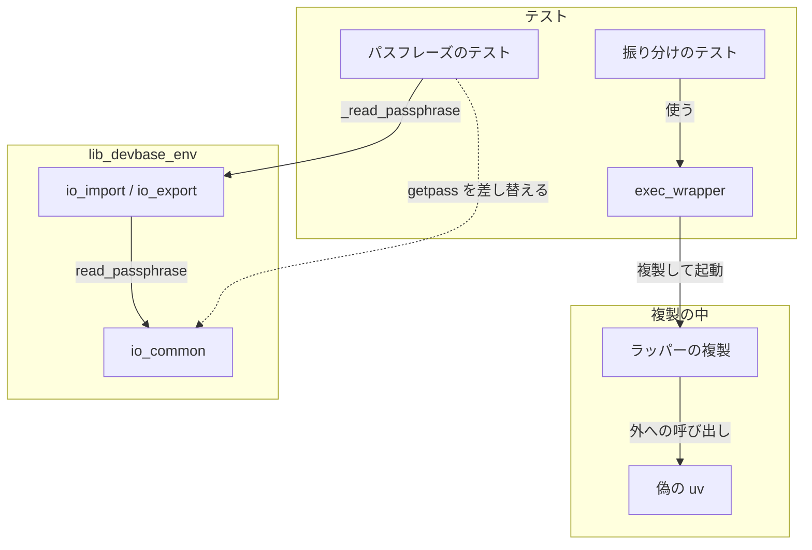
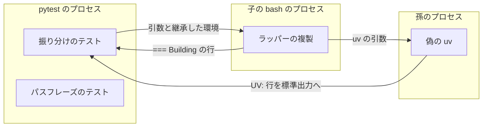
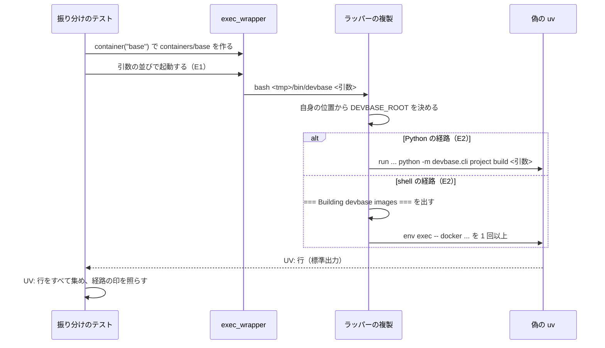
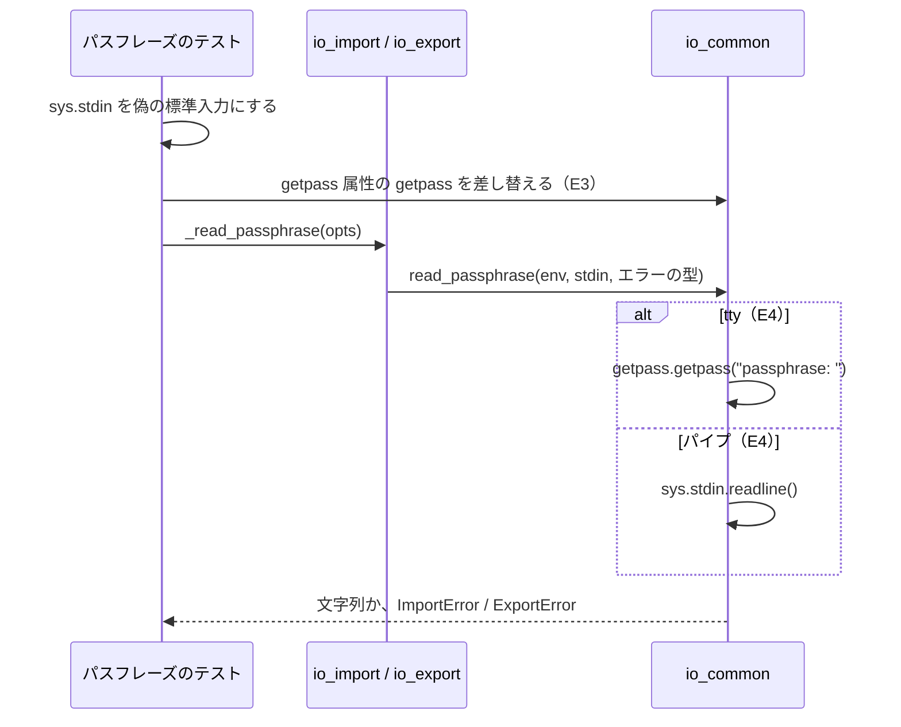

# #305: 振り分けとパスフレーズのテストを、実装の内部に頼らない観測点へ移す の設計

要求と受け入れ条件は #305 の本文にある（コピーは [issue-305-requirements.md](issue-305-requirements.md)）。
この文書は「どう作るか」だけを扱う。

## ドメインモデル

### コンテキスト

| コンテキスト | 何の語が 1 つの意味に決まるか |
| --- | --- |
| テストの実行環境（`test`） | テストが起動するラッパーの複製と偽の `uv`、テストが差し替える属性 |
| コマンドの入口（`cli`） | ラッパー・`build` の振り分け・単体ビルド |
| 機密の置き場（`secret`） | `env import` / `env export` が読むパスフレーズ |

`test` は `cli` と `secret` に対して**順応者**である。テストは `cli` と `secret` の振る舞いをそのまま
受け入れて観測し、観測のために `cli` や `secret` の形を変えさせない。今の
`import getpass  # noqa: F401` は、テストの都合が `secret` の実装へ入り込んだ形で、この関係に反する。

### 集約

| 集約 | 持ち主（書き換えてよいもの） | 根 | エンティティ | 値オブジェクト |
| --- | --- | --- | --- | --- |
| ラッパーの複製 | `tests/cli/conftest.py` の `exec_wrapper` フィクスチャ | 一時の `DEVBASE_ROOT`（`WrapperRoot`） | `projects/<名前>`・`containers/<名前>` | 偽の `uv` が出す行（`UV:` / `PWD:`）、経路の印 |
| パスフレーズの差し替え | 各テストの `monkeypatch` | 差し替え先（`devbase.env.io_common` のモジュール属性 `getpass`） | — | 偽の標準入力（tty か否かと中身） |

この変更は `exec_wrapper` とその集約の形を変えない。振り分けのテストを、その使い手に加えるだけである。

### 不変条件

| # | 集約 | 条件 | 破れたときの扱い |
| --- | --- | --- | --- |
| I1 | ラッパーの複製 | 振り分けのテストは `bin/devbase` の本文を削らず、そのまま複製して起動する | 受け入れ条件の `grep` が 1 件以上を返し、レビューで差し戻す |
| I2 | ラッパーの複製 | ラッパーは複製した位置から `DEVBASE_ROOT` を決め、継承した `DEVBASE_ROOT` を見ない | 継承した側の `projects/` が名前を吸い、テストが落ちる |
| I3 | ラッパーの複製 | Python の経路の印と shell の経路の印は、1 回の起動で片方だけが出る | 両方か両方無しなら、そのケースのテストが落ちる |
| I4 | パスフレーズの差し替え | テストは `getpass` を呼ぶモジュール（`io_common`）の属性で差し替え、`io_import` / `io_export` は `getpass` を持たない | `io_import` / `io_export` へ `getpass` を戻すと受け入れ条件の `grep` が拾う。`io_common` の読み込みの形を変えると差し替えが `AttributeError` で落ちる |
| I5 | （両方） | `bin/devbase` と `lib/devbase` の振る舞い（出力・終了コード）は変わらない | 全体の pytest の既存のテストが落ちる |

### ドメインイベント

| # | イベント | 発生元 | 受け手 |
| --- | --- | --- | --- |
| E1 | テストが本物のラッパーの複製を起動した | 振り分けのテスト（`exec_wrapper` の呼び出し） | ラッパーの複製 |
| E2 | ラッパーが `build` の引数を Python と shell のどちらかへ振り分けた | ラッパーの複製 | 偽の `uv`（`UV:` 行）と標準出力（`=== Building devbase images ===`）。テストが両方を読む |
| E3 | テストが `getpass.getpass` を差し替えた | パスフレーズのテスト | `io_common` のモジュール属性 `getpass` |
| E4 | `read_passphrase` が tty では `getpass`、パイプでは `readline` で読んだ | `io_common.read_passphrase`（`_read_passphrase` 経由） | パスフレーズのテスト（戻り値と例外） |

### 用語

| 用語 | 意味 | 用語集への反映 |
| --- | --- | --- |
| ラッパーの複製 | `exec_wrapper` が一時ディレクトリの `bin/devbase` へ写した本物のラッパー。複製した位置から `DEVBASE_ROOT` が決まる | 追加（`test`） |
| 偽の uv | `PATH` の先頭に置き、受け取った引数を `UV:` 行で出して 0 で終わる試験用の `uv`。ラッパーの外へ出る呼び出しはすべてこれを通る | 追加（`test`） |
| 経路の印 | `build` の振り分け先を見分ける出力の行。Python の経路は ` devbase.cli project build <引数>` で終わる `UV:` 行、shell の経路は `=== Building devbase images ===` の行 | 追加（`test`） |
| 差し替え先 | テストが `monkeypatch` で置き換える属性を持つモジュール。置き換える関数を実際に呼ぶモジュールにする | 追加（`test`） |

## 機能一覧

| # | 機能 | 誰が使うか |
| --- | --- | --- |
| F1 | `build` の振り分けを、本物のラッパーの複製で確かめる | devbase の開発者（`bin/devbase` を変える人） |
| F2 | パスフレーズの読み取りを、`getpass` を呼ぶモジュールでの差し替えで確かめる | devbase の開発者（`lib/devbase/env` を変える人） |
| F3 | テストのためだけの `import getpass` を実装から除く | devbase の開発者（`io_import` / `io_export` を分ける人） |

## 構成要素

| 要素 | 変更 | 責務 |
| --- | --- | --- |
| 振り分けのテスト（`tests/cli/test_build_image_argument.py` の wrapper の節） | 変える | `_run_wrapper`・`_line`・`wrapper_root` を消し、7 関数 8 ケースを `exec_wrapper` の上に書き直す。入力（引数の並び）は元のテストと同じにする（決定 2・3） |
| `UV:` 行を集める関数（同じファイルに置く、新設） | 足す | 標準出力から `UV:` で始まる行をすべて取り出す。`stdout_field` は最初の 1 行だけを返すため、shell の経路の 2 行目以降を見られない（決定 2） |
| 同じファイルの冒頭の説明 | 変える | `sed` のハーネスの説明を消し、wrapper の節が `exec_wrapper` で動くことに書き換える |
| `tests/cli/conftest.py` の冒頭の説明 | 変える | `sed` のハーネスの例に挙げた `test_build_image_argument.py` を、`sed` のハーネスが残る `test_wrapper_dispatch.py` へ差し替える。この変更の後は例として誤りになるため |
| パスフレーズのテスト（`tests/cli/test_env_import.py` の 3 件、`test_env_export.py` の 4 件のうち差し替えを持つ 3 件） | 変える | 差し替え先を `devbase.env.io_import.getpass` / `io_export.getpass` から `io_common` のモジュール属性 `getpass` へ変える。期待する値は変えない（決定 1） |
| `lib/devbase/env/io_import.py` / `io_export.py` | 変える | `import getpass  # noqa: F401` の 1 行ずつを消す。ほかは変えない |

次のものは変えない。

- `bin/devbase`（`cmd_build` と `build)` の振り分け）と `exec_wrapper` の本体（`WrapperRoot` と偽の `uv`）
- `io_common.read_passphrase` と、`io_import._read_passphrase` / `io_export._read_passphrase`
- `test_build_image_argument.py` の Python 側（`container.cmd_build(image=...)`）と、既に
  `exec_wrapper` を使う節（`build --help`・名前の形・イメージとプロジェクトの衝突）
- `sed` のハーネスを持つほかの 4 ファイル（#339 で扱う）
- `test_env_export.py` の `test_read_passphrase_strips_crlf_from_pipe`（`getpass` を差し替えないため）

### 構成要素図



### システム構成図（配置）

テストが起動するプロセスの境界を示す。外部の系（docker・実環境の `DEVBASE_ROOT`）へは届かない。



パスフレーズのテストはプロセスを起こさず、pytest のプロセスの中で完結する。

### パッケージ・モジュール構成

```text
lib/devbase/env/
├── io_common.py          # 変えない（getpass を呼ぶ唯一のモジュール）
├── io_import.py          # import getpass を消す
└── io_export.py          # import getpass を消す
tests/cli/
├── conftest.py           # 冒頭の説明の例だけを変える
├── test_build_image_argument.py  # wrapper の節を exec_wrapper へ移す
├── test_env_import.py    # 差し替え先を変える（3 件）
└── test_env_export.py    # 差し替え先を変える（3 件）
```

クラス図は描かない。この変更は型を足さず、`WrapperRoot` を含むどの型も変えない。

## 処理の流れ

構成要素のうち、2 つの説明の文（`test_build_image_argument.py` と `conftest.py` の冒頭）と
`io_import.py` / `io_export.py` の `import getpass` の削除は、処理の順序を持たないため図に含めない。

### 振り分けのテスト



実測した出力（2026-09-28、`containers/base` だけを持つ複製、`<R>` は一時ディレクトリ）:

```text
build base                -> UV:run --project <R> python -m devbase.cli project build base
build base --no-cache     -> UV:run --project <R> python -m devbase.cli project build base --no-cache
build                     -> === Building devbase images ===
                             UV:run --project <R> python -m devbase.cli env exec -- docker compose build dev
build --no-cache          -> === Building devbase images ===
                             UV:... env exec -- docker buildx build --load -t devbase-base:latest <R>/containers/base --no-cache
                             UV:... env exec -- docker compose build dev --no-cache
build --project-no-cache  -> === Building devbase images ===
                             UV:... env exec -- docker buildx build --load -t devbase-base:latest <R>/containers/base
                             UV:... env exec -- docker compose build dev --no-cache
build --expires           -> UV:run --project <R> python -m devbase.cli project build --expires
build --expires=7         -> UV:run --project <R> python -m devbase.cli project build --expires=7
build base --expires=7    -> UV:run --project <R> python -m devbase.cli project build base --expires=7
```

すべて終了コード 0 だった。

### パスフレーズのテスト



## 非機能の実現方式

| 大項目 | 要求の条件 | 実現方式 | 確かめ方 |
| --- | --- | --- | --- |
| 運用・保守性 | `bin/devbase` の関数の定義の順序を入れ替えても、振り分けのテストの結果が変わらない（`sed` の範囲指定に頼らない） | ラッパーを複製して本文を削らずに起動し、外への呼び出しを `uv` の境界だけで受ける。関数の名前・順序・表記はテストのどこにも現れない | 受け入れ条件の `grep` が 0 件であること。手元で `bin/devbase` の `run_python()` と `cmd_build()` の定義の位置を入れ替えて振り分けのテストを流し、結果が変わらないことを見る（確かめた後は戻す） |

## 決定の記録

### 決定 1: `getpass` の差し替え先は `io_common` のモジュール属性 `getpass` にする

テストは `from devbase.env import io_common` を読み、`monkeypatch.setattr(io_common.getpass, "getpass", ...)`
で差し替える。関数を実際に呼ぶモジュールの属性で差し替える形は、既存のテスト
（`tests/commands/test_env_backend.py` の `env_backend.getpass`、`tests/env/test_collector_host.py` の
`host.getpass`）と同じである。`io_common` が `from getpass import getpass` のように読み込みの形を変えると、
差し替えが `AttributeError` で落ち、差し替えが効かないまま走ることがない。

標準ライブラリの `getpass` を直接差し替える形は採らない。今は同じ関数を置き換えるが、`io_common` が読み込みの
形を変えると差し替えが効かないまま本物の `getpass` が呼ばれ、テストの結果が端末の有無で変わる。

### 決定 2: 経路の判定は `UV:` 行をすべて集めて行う

Python の経路は「` devbase.cli project build <引数>` で終わる `UV:` 行がある、かつ
`=== Building devbase images ===` が無い」、shell の経路は「`=== Building devbase images ===` がある、かつ
` devbase.cli project build` で終わる `UV:` 行が無い」で判定する（不変条件 I3）。shell の経路は `UV:` 行を
2 行以上出すため（実測の `build --no-cache`）、最初の 1 行だけを返す `stdout_field` では 2 行目以降の
再帰を見落とす。集める関数は `test_build_image_argument.py` の中に置く。使うのがこのファイルだけのためで、
#339 で 4 ファイルを移すときに共有が要れば `conftest.py` へ上げる。

Python の経路で Python の `UV:` 行を「ちょうど 1 行」と数える形は採らない。受け入れ条件は末尾の一致だけを
求めており、ラッパーの前処理が `uv` を足しただけで落ちるテストになる。

### 決定 3: `build --no-cache` の到達は `docker buildx build` の `UV:` 行の末尾で見る

`build --no-cache` では、`docker buildx build` を含む `UV:` 行が `--no-cache` で終わることを確かめる。
受け入れ条件の「`UV:` 行のどれかが `--no-cache` を含む」は、この確かめ方で満たされる。実測では
`build --project-no-cache` も `docker compose build dev --no-cache` の行を出すため、「どれかが含む」だけでは
`--no-cache` を `--project-no-cache` と同じに扱う壊し方を見分けられない。`--project-no-cache` の側では、
`docker buildx build` の行が `--no-cache` を含まないことを確かめる。

### 決定 4: `DEVBASE_ROOT` の継承は、同じ名前のプロジェクトを持つ別の root で確かめる

`build base` のテストの 1 つで、`monkeypatch.setenv` により継承する `DEVBASE_ROOT` を、`projects/base`
だけを持つ別の一時ディレクトリへ向ける。ラッパーがこの値を使えば `base` は name 解決に吸われて shell の
経路になり、使わなければ Python の経路のままになる（2026-09-28 に手元で両方の出力を確かめた）。
`tests/conftest.py` の `_isolate_devbase_root` は継承した値を空の一時の root へ置き換えるが、テストの中の
`monkeypatch.setenv` は後勝ちで効く。

実環境の `DEVBASE_ROOT` を消すだけで確かめる形は採らない。ラッパーが継承した値を見るように壊れても、
空の root では振り分けが変わらず、落ちない。

## テスト設計

受け入れ条件の番号は、仕様の受け入れ条件を上から数えたもの（振り分け 8 件を A1〜A8、パスフレーズ 6 件を
B1〜B6、退行 2 件を C1〜C2）である。

| 受け入れ条件・不変条件 | どの振る舞いで縛るか | どう壊したら落ちるべきか |
| --- | --- | --- |
| A1・I1 | `grep -nE "_run_wrapper\|sed -e\|eval " tests/cli/test_build_image_argument.py` が 0 件（静的な確認） | `sed` のハーネスを残すと 1 件以上になる |
| A2・I3 | `build base` で Python の経路の印（末尾 ` devbase.cli project build base`）が出て、shell の経路の印が出ない | `build)` の振り分けで位置引数を shell へ流すと落ちる |
| A3 | `build base --no-cache` の Python の `UV:` 行が ` devbase.cli project build base --no-cache` で終わる | 引数の順序を入れ替える・`--no-cache` を落とすと落ちる |
| A4・I3 | `build` だけで shell の経路の印が出て、Python の経路の印が無い | 引数なしを Python へ送ると落ちる |
| A5 | `build --no-cache` で shell の経路に入り、`docker buildx build` の `UV:` 行が `--no-cache` で終わる（決定 3） | `--no-cache` を shell のビルドへ渡さない、または `--project-no-cache` と同じに扱うと落ちる |
| A6・I3 | `build --project-no-cache` で shell の経路に入り、Python の経路の印が無い。`docker buildx build` の行は `--no-cache` を含まない | `--project-no-cache` を Python へ送る（再帰する）と落ちる |
| A7 | `build --expires` / `--expires=7` / `base --expires=7` の Python の `UV:` 行が同じ引数で終わる（parametrize を含めて 3 ケース） | `--expires` を shell へ流す・値を落とすと落ちる |
| A8・I2 | 継承する `DEVBASE_ROOT` を `projects/base` だけを持つ別の root へ向けても、`build base` が Python の経路になる（決定 4） | ラッパーが継承した `DEVBASE_ROOT` を使うと shell の経路になって落ちる |
| B1 | `grep -rnE "io_(import\|export)\.getpass" tests/` が 0 件（静的な確認） | 旧い差し替え先を 1 か所でも残すと 1 件以上になる |
| B2・I4 | `grep -n "^import getpass" lib/devbase/env/io_import.py lib/devbase/env/io_export.py` が 0 件（静的な確認） | `import getpass` を残すと 1 件以上になる |
| B3・I4 | tty の偽の標準入力で、差し替えた `getpass` が `passphrase: ` で呼ばれ、標準入力が消費されない（import・export の両方） | `io_common` が tty でも `readline` を使うと落ちる。差し替え先の属性が無くなると `AttributeError` で落ちる |
| B4 | パイプの偽の標準入力で、差し替えた `getpass` が呼ばれず 1 行が返る（import・export の両方） | パイプでも `getpass` を呼ぶと落ちる |
| B5 | パイプの `hunter2\r\n` が `hunter2` になる（export の既存テストをそのまま保つ） | `\r` を剥がさないと落ちる |
| B6 | tty で差し替えた `getpass` が `EOFError` を投げると、import は `ImportError`、export は `ExportError` で、メッセージに「パスフレーズを読み取れません」を含む | `EOFError` を変換せずに漏らすと落ちる |
| C1・I5 | `uv run --locked pytest tests/ -q` がすべて通る | 振る舞いを変えると既存のテストが落ちる |
| C2・I5 | `git diff main -- bin/devbase lib/devbase` が `import getpass` の 2 行の削除だけ（静的な確認） | ほかの行を変えると差分に現れる |

## 未確認のまま残ること

| 項目 | 内容 |
| --- | --- |
| 非機能の確かめ方の手作業 | `bin/devbase` の関数の定義の位置を入れ替えて流す確認は、CI では行わない。実装の Pull Request のテスト計画に 1 行で書き、手元で 1 回流す |
| macOS の bash 3.2 | `exec_wrapper` は `bash` を `PATH` から引く。手元の `PATH` 先頭が bash 5 のとき、3.2 での振り分けは確かめない（仕様の「macOS の `/bin/bash` で `tests/cli` を流すことは手元で行う」の扱いのまま） |
