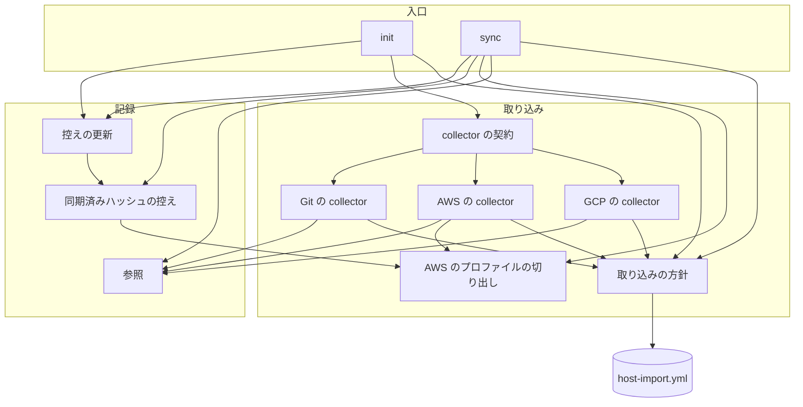
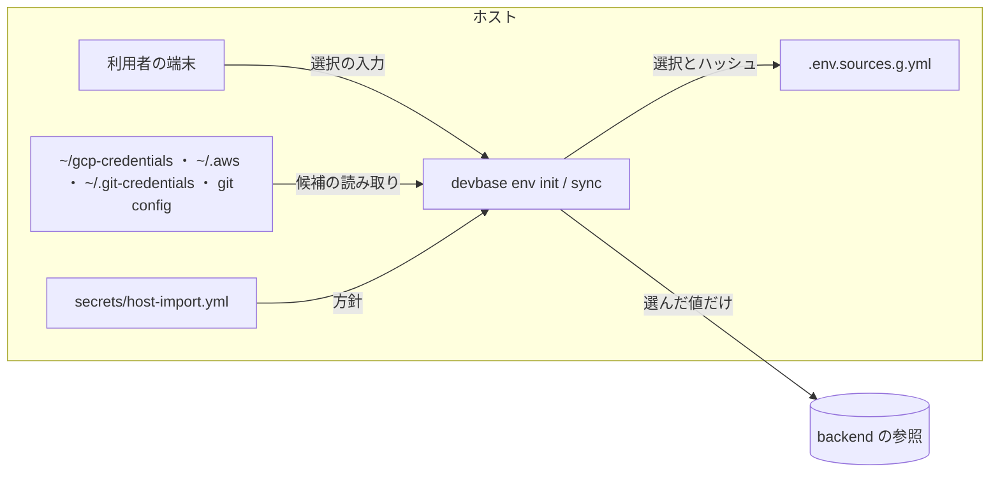
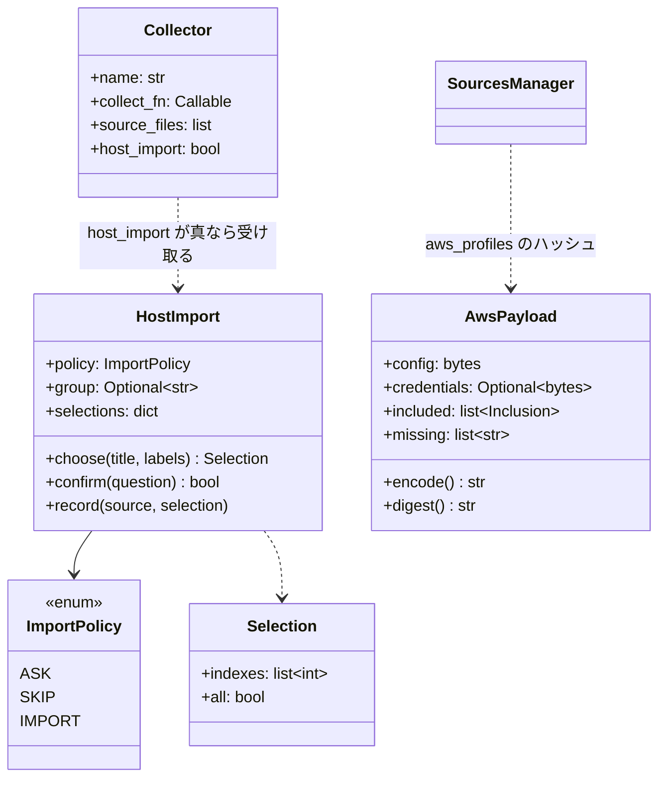
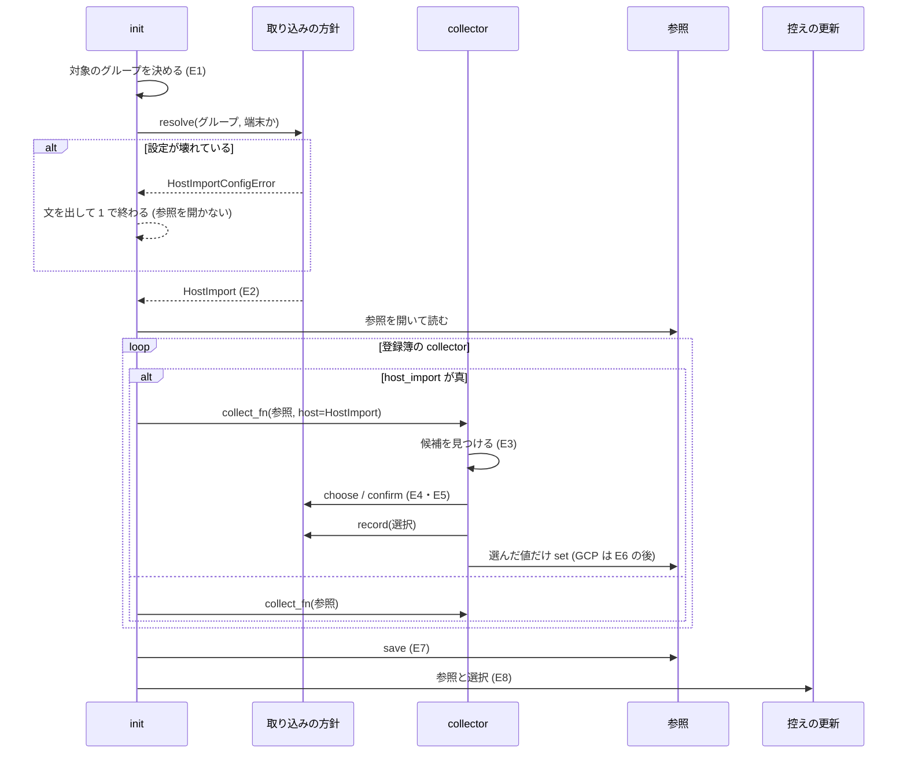
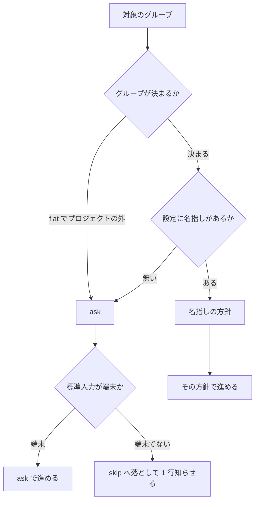
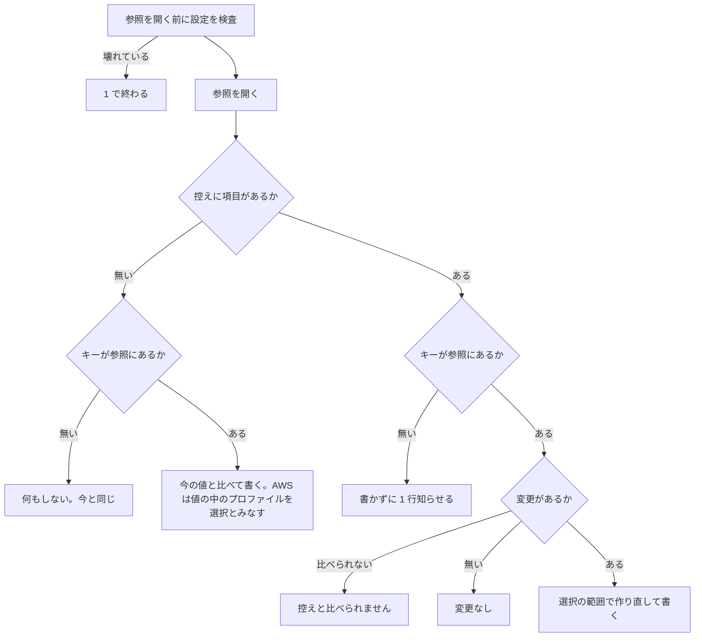

# #314: ホストの資格情報を、利用者が選ばない限りグループの参照へ取り込まない

要求と受け入れ条件は #314 の本文にある（コピーは `issues/issue-314-requirements.md`）。この文書は
「どう作るか」だけを扱う。前提 1〜11 は仕様のコピーの前提の番号を、E1〜E10 はドメインイベントの番号を、
AC1〜AC15 は受け入れ条件の番号を指す。

仕様の未決 4 件は次の決定で閉じる。

| 未決 | 閉じる決定 |
| --- | --- |
| 1. 取り込みを許すグループの設定の置き場所と書式 | 決定 1（利用者の承認は設計 PR で受ける） |
| 2. 候補の選び方の入力の形 | 決定 4 |
| 3. GCP のアクティブプロファイルに未知の名前を入れたとき | 決定 5 |
| 4. 取り込みの選択を残す場所と形 | 決定 6 |

## ドメインモデル

### コンテキスト

| コンテキスト | 何の語が 1 つの意味に決まるか |
| --- | --- |
| 機密の置き場（`secret`） | 取り込み・取り込みの候補・取り込みの方針・取り込みを許すグループの設定・取り込みの選択・AWS のプロファイル・AWS の丸ごとの取り込み・対象のグループ・参照・同期済みハッシュの控え |

変更は `secret` の中で閉じる。対象のグループ（`_target_group`）と参照の組み立ては今のものをそのまま使う。

### 集約

| 集約 | 持ち主（書き換えてよいもの） | 根 | エンティティ | 値オブジェクト |
| --- | --- | --- | --- | --- |
| 取り込みを許すグループの設定 | 利用者の手。devbase は読むだけで書かない | `secrets/host-import.yml` | — | グループ名・取り込みの方針 |
| 取り込みの場 | `cmd_env_init`（1 回の `init` で 1 つ作り、終われば捨てる） | `HostImport` | — | 取り込みの方針（実際に使うもの）・取り込みの選択 |
| 参照 | `cmd_env_init`（collector を通して書く）・`cmd_env_sync` | 対象のグループのチーム共通・個人共通 | キー | 値 |
| 同期済みハッシュの控え | `_update_source_metadata`（`SourcesManager` を通して書く） | `.env.sources[.<g>].yml` の `sources` | ソースの項目（`aws` / `git_credentials` / `gcp`） | ハッシュ・取り込みの選択 |

- 取り込みの場は永続しない。collector は取り込みの場に選んだ結果を記録し、`cmd_env_init` がそれを控えへ渡す
- `init` と `sync` は参照を保存した後に控えを書く（今と同じ順。E7 → E8）。控えの失敗で参照を巻き戻さない
- collector は取り込みの方針を読むだけで決めない。方針を決めるのは `cmd_env_init` だけである（I1）

### 不変条件

| # | 集約 | 条件 | 破れたときの扱い |
| --- | --- | --- | --- |
| I1 | 取り込みの場 | collector はグループ名を比べない。取り込みの方針は呼び出し側が決め、collector へ必須の引数で渡す | 方針を渡さずにホストを読む collector を呼ぶと `TypeError`（AC15） |
| I2 | 参照 | 方針が「取り込む」でない限り、利用者が選ばなかった候補の値を参照へ書かない | 選ばれた候補の分だけを `env_file.set` する。選ばれなければ何も書かない |
| I3 | 取り込みの場 | 方針が「尋ねる」で標準入力が端末でないとき、取り込みの質問を出さずに「取り込まない」として扱う | 呼び出し側が方針を決める時点で落とし、1 行知らせる |
| I4 | 取り込みを許すグループの設定 | 設定が壊れていれば、`init` / `sync` は参照を開く前に止まる | 場所と直す箇所を出して終了コード 1（AC13） |
| I5 | 参照 | `sync` は参照（個人共通・チーム共通のどちらにも）に無い資格情報のキーを書かない。控えに項目があっても同じ | 書かずに 1 行知らせる（AC9・AC11） |
| I6 | 参照 | AWS の選んだ取り込みの `AWS_CONFIG_BASE64` は、選んだプロファイル・その連なり（`sso_session` の節と `source_profile` の連なり）・それらと同じ名前の `credentials` の節だけを含む | 切り出しの処理 1 か所（`aws_profiles`）でだけ tar を作る |
| I7 | 同期済みハッシュの控え | AWS の選んだ取り込みでは、`sync` は控えに残した選択の範囲だけで変更を見て、入れ直す。選ばなかった節の変更は変更に数えない | ハッシュを切り出した中身から取る |
| I8 | 同期済みハッシュの控え | 取り込みの選択を持たない AWS の項目（この変更より前の控え）は、丸ごとの取り込みとして扱う | 今の `tar_base64` の項目をそのまま読む（前提 10） |
| I9 | 参照 | 方針が「取り込む」のグループでは、`init` の質問の並びと、同じ入力に対して書くキーと値が、この変更の前と同じである。ただし GCP のアクティブプロファイルに `none` または選んだ鍵に無い名前を入れた入力は除く（E6・決定 5 に従い、`none` は何も書かず、未知の名前は尋ね直す） | 「取り込む」の経路は取り込みの確認を通らず、AWS は丸ごとの取り込みにする（AC12） |
| I10 | 取り込みの場 | 候補の一覧に機密の値を出さない。出すのは鍵ファイル名・`project_id`・プロファイル名・キーの名前だけ | 一覧を作る関数が名前だけを受け取る |
| I11 | 取り込みの場 | ホストのファイルを読む collector（`source_files` を持つもの）は、契約でそれを宣言し、方針を受け取らなければ登録されない | `Collector` の生成時に `ValueError`。登録簿は読み込みの失敗として飛ばし、警告を出す |

### ドメインイベント

| # | イベント | 発生元 | 受け手 |
| --- | --- | --- | --- |
| E1 | 対象のグループを決めた | `_target_group`（今のまま） | 取り込みの方針の決定（E2）・参照の組み立て |
| E2 | 取り込みの方針を決めた | `host_import.resolve` | `cmd_env_init`（取り込みの場を作る）。`sync` は設定の検査だけに使う |
| E3 | ホストの取り込みの候補を見つけた | GCP・AWS・Git の collector | 候補の一覧の表示（E4） |
| E4 | 候補を示して取り込むかを尋ねた | collector（`host_import.choose` / `confirm` を呼ぶ） | 利用者 |
| E5 | 取り込む候補を選んだ | `host_import.choose` / `confirm` | collector（書く範囲を決める）・取り込みの場（選択を記録する） |
| E6 | GCP のアクティブプロファイルを決めた | GCP の collector | GCP の collector（書くか、「設定しない」で何も書かないか） |
| E7 | 選んだ値を参照へ書いた | `cmd_env_init` の `env_file.save()` | 控えの更新（E8） |
| E8 | 取り込みの選択を控えへ残した | `_update_source_metadata` | `sync`（E9） |
| E9 | `sync` がソースの変更を見つけた | `SourcesManager.check_changed` / `check_gcp_changed` | `_sync_source` / `_sync_gcp`（E10） |
| E10 | `sync` が選んだ範囲だけを入れ直した | `_sync_source` / `_sync_gcp` | 参照の保存と控えの更新（E8） |

### 用語

| 用語 | 意味 | 用語集への反映 |
| --- | --- | --- |
| 取り込みの選択 | 取り込みの候補のうち、利用者が選んだもの。AWS は選んだプロファイルの名前の並び、GCP は参照に書いたプロファイル。同期済みハッシュの控えに残り、`sync` はこの範囲だけを入れ直す | 追加（`secret`） |
| AWS の丸ごとの取り込み | `~/.aws/config` と `~/.aws/credentials` を切り出さずにそのまま 1 つの tar にして `AWS_CONFIG_BASE64` へ書くこと。この変更の前の振る舞い | 追加（`secret`） |
| AWS のプロファイルの連なり | 選んだ AWS のプロファイルが動くのに要る節。`sso_session` が指す `[sso-session <名前>]` と、`source_profile` が指すプロファイル（たどれる限り） | 追加（`secret`） |
| 取り込みを許すグループの設定 | 取り込みの方針をグループごとに名指しする端末の設定。`$DEVBASE_ROOT/secrets/host-import.yml` に置く。名指しの無いグループは「尋ねる」 | 意味の変更（`secret`。置き場所を足す） |

## 機能一覧

| # | 機能 | 誰が使うか |
| --- | --- | --- |
| F1 | 取り込みの方針をグループごとに名指しする（`secrets/host-import.yml`） | 端末の利用者 |
| F2 | `env init` で、GCP の鍵ファイルを選んで取り込む（「設定しない」を含む） | `env init` を打つ利用者・`up` の子プロセス |
| F3 | `env init` で、AWS のプロファイルを選んで取り込む | 同上 |
| F4 | `env init` で、ホストの Git の設定を取り込むかを 1 回で決める | 同上 |
| F5 | `env sync` で、取り込みの選択の範囲だけを入れ直し、参照に無いキーを書かない | `env sync` を打つ利用者・TUI の再同期 |
| F6 | 取り込みを許したグループで、今までどおり尋ねずに取り込む | 端末の利用者 |

## 構成要素

| 要素 | 責務 | 変更 |
| --- | --- | --- |
| 取り込みの方針（`lib/devbase/env/host_import.py`） | 設定の読み込みと検査、対象のグループの方針の決定（端末でない「尋ねる」を「取り込まない」へ落とす）、取り込みの場（`HostImport`）、候補の番号の選択と y/N の確認 | 新設 |
| AWS のプロファイルの切り出し（`lib/devbase/env/aws_profiles.py`） | `~/.aws/config` の節の読み取り、連なりの解決と含めた理由、選んだ節だけの tar（時刻を固定）、切り出した中身のハッシュ、`AWS_CONFIG_BASE64` の値に入っているプロファイルの読み取り。ファイルの中身を受け取って結果を返す純粋な処理で、出力も終了コードも持たない。含めた理由・見つからない名前は `AwsPayload` に入れて返し、表示は呼び出し側（collector・`sync`）が行う | 新設 |
| collector の契約（`lib/devbase/env/collector.py`） | `Collector.host_import`（ホストのファイルを読むかの宣言）と、`source_files` を持つのに宣言しない定義を生成時に拒む検査 | 変更 |
| GCP の collector（`collectors/google.py`） | 候補の一覧と選択、アクティブプロファイルの質問（「設定しない」と未知の名前のやり直し）、選んだ鍵だけの登録。登録をアクティブプロファイルの決定の後へ移す | 変更 |
| AWS の collector（`collectors/aws.py`） | 方針ごとの認証方法の既定、Config Files でのプロファイルの選択と連なりの表示、Access Key の `[default]` の確認。`_encode_aws_config_files`（丸ごと）は残す | 変更 |
| Git の collector（`collectors/git.py`） | 取り込めるキーの名前を並べた 1 回の確認。断れば Git の値を書かず、手入力へ進まない | 変更 |
| `init`（`commands/env.py` の `cmd_env_init`） | 対象のグループを決めた直後、参照を開く前に方針を決める。ホストを読む collector へ取り込みの場を渡し、選択を控えの更新へ渡す | 変更 |
| `sync`（`commands/env.py` の `_open_sync_targets` / `_sync_source` / `_sync_gcp` / `_sync_credential_sources`） | 参照を開く前の設定の検査、参照に無いキーを書かない判定、AWS の選択の範囲での入れ直し、控えに項目の無い AWS のキーの選択の読み取り | 変更 |
| 控えの更新（`commands/env.py` の `_update_source_metadata`） | AWS の項目を、選択に応じて丸ごと（`tar_base64`）か選んだ取り込み（`aws_profiles`）で書く。選択が渡らなければ今の項目の形を保つ | 変更 |
| 同期済みハッシュの控え（`lib/devbase/env/sources.py`） | `aws_profiles` の項目の今のハッシュを、切り出した中身から求める | 変更 |
| `backend use` の設定の組み立て | 変えない。取り込みの設定を `backend.yml` に置かないため（決定 1） | — |
| 仕様書（`docs/specifications/secret-backend.md`） | 取り込みの方針・設定の書式・控えの `aws_profiles`・`sync` の参照に無いキーの扱い | 変更 |
| 利用者向けの文書（`docs/user/cli-reference/03-env.md`・`docs/user/environment-variables.md`・`docs/user/getting-started.md`） | `init` の質問・`host-import.yml`・`sync` の出力の行と「どちらにも無い」の行の意味の変化 | 変更 |

範囲外の collector（Slack・API キー・Devin・エディタ・Host）は `host_import` を宣言せず、呼び方も今のまま
`collect_fn(env_file)` である。

### 構成要素図



collector から取り込みの方針への辺は、選択と確認の関数（`choose` / `confirm`）の呼び出しと選択の記録である。
図には、表のうち文書の 2 行と、変えない `backend use` の行を含めない。

### 文脈と配置

変更はホストで動く `devbase` のプロセスの中で閉じる。新しく読むのはホストの 1 ファイルだけで、
backend（平文・age・OpenBao）との出入りは変わらない。



### パッケージ構成

```text
lib/devbase/
├── commands/env.py            # 変更: cmd_env_init / cmd_env_sync / _sync_* / _update_source_metadata
└── env/
    ├── host_import.py         # 新設: 設定・方針・取り込みの場・選択の入力
    ├── aws_profiles.py        # 新設: AWS の節の切り出し・連なり・tar・ハッシュ
    ├── collector.py           # 変更: host_import の宣言と検査
    ├── sources.py             # 変更: aws_profiles のハッシュ
    └── collectors/
        ├── google.py          # 変更
        ├── aws.py             # 変更
        └── git.py             # 変更
```

## 構造



| 型 | 責務 | 変更 |
| --- | --- | --- |
| `ImportPolicy` | 方針の 3 値。設定の値 `ask` / `skip` / `import` と 1 対 1 | 新設 |
| `HostImport` | 1 回の `init` の取り込みの場。`policy` は実際に使う方針（端末でない「尋ねる」を落とした後）。`choose` / `confirm` は `policy` が `ASK` のときだけ質問を出し、`SKIP` なら何も選ばず、`IMPORT` なら全部を選ぶ | 新設 |
| `Selection` | 番号の選択の結果。`all` は「all」と入れたこと（AWS では丸ごとの取り込みを意味する） | 新設 |
| `HostImportConfigError` | 設定の誤り。`DevbaseError` の子で、ファイルの場所と直す箇所を文に持つ | 新設 |
| `AwsPayload` | 切り出した `config` / `credentials` の中身と、連なりで含めた節とその理由（`included`）、指す先が見つからなかった名前（`missing`） | 新設 |
| `Collector` | `host_import: bool = False` を足す。`source_files` があり `host_import` が偽なら生成時に `ValueError` | 変更 |

ホストを読む 3 つの `collect_fn` は `(env_file, *, host: HostImport)` の形で、`host` に既定の値を置かない（I1・AC15）。

## データ構造

### `$DEVBASE_ROOT/secrets/host-import.yml`（新設・`0600` を推奨・利用者が書く）

```yaml
groups:
  nyle: import    # 尋ねずに取り込む（この変更の前と同じ）
  kkg: skip       # 尋ねずに取り込まない
  # 名指しの無いグループは ask（尋ねる）
```

| キー | 型 | 必須 | 意味 | 空・不在 |
| --- | --- | --- | --- | --- |
| `groups` | マッピング | いいえ | グループ名から方針への対応 | 不在・空はすべてのグループが `ask` |
| `groups.<名前>` | 文字列 | — | `ask` / `skip` / `import` のどれか | 空の値は誤り |

- ファイルが無ければ、すべてのグループが `ask` である（移行性の条件）。backend が `auto` でも読める
- 最上位に `groups` 以外のキーがあれば誤りにする。書き損じた設定が黙って `ask` になると、名指ししたつもりの
  グループで確認が出続け、原因を探せない
- グループ名は `validate_account_group` の規則で検査する（`default`・`ubuntu`・数字だけを拒む）
- 引くのは対象のグループの名前（`group_aliases` で読み替える前の名前）である（決定 11）
- 機密は置かない。devbase はこのファイルを書かない

### 同期済みハッシュの控えの `aws` の項目

AWS の項目の `type` を、取り込みの形で 2 つに分ける。GCP と Git の項目は変えない。

| `type` | いつ書くか | `hash` の元 | 足す列 |
| --- | --- | --- | --- |
| `tar_base64` | 丸ごとの取り込み（方針が「取り込む」・「尋ねる」で `all`）と、選択を持たない既存の項目 | `dir_hash(~/.aws, [config, credentials])`（今と同じ） | — |
| `aws_profiles` | 「尋ねる」でプロファイルを選んだ取り込み | 切り出した `config` と `credentials` の中身（`AwsPayload.digest`） | `profiles`: 利用者が選んだプロファイルの名前の並び（連なりは含めない。連なりは `sync` の時点のファイルから求め直す） |

```yaml
sources:
  aws:
    type: aws_profiles
    files: [~/.aws/config, ~/.aws/credentials]
    env_key: AWS_CONFIG_BASE64
    profiles: [kkg]
    hash: 3f1c...           # 切り出した中身のハッシュ
    synced_at: '2026-09-28T10:00:00'
```

- 上書きの構造を採る（時系列を持たない）。控えは「最後に同期した時点」との比較にだけ使い、過去の選択を
  問う機能が無い。過去の選択は参照の値（`AWS_CONFIG_BASE64` の中の節）と backend の版が持つ
- GCP の取り込みの選択は、今の `gcp.profiles`（参照に書いたプロファイルだけが載る）がそのまま担う。列を足さない
- 移行はしない。既存の `tar_base64` の項目は丸ごとの取り込みとして読む（I8）
- この変更より前の devbase が `aws_profiles` の項目を読むと、`_current_hash` が `None` を返し「控えと比べられません」
  を出して書かない（書き戻しで選択を失う経路は「未確認のまま残ること」）

### CRUD 図

| 機能 | `host-import.yml` | 参照 | 控えの `aws` | 控えの `gcp` / `git_credentials` |
| --- | --- | --- | --- | --- |
| F1 方針を名指しする | C/U（利用者の手） | — | — | — |
| F2 GCP を選ぶ | R | C | — | C/U |
| F3 AWS を選ぶ | R | C | C/U | — |
| F4 Git を決める | R | C | — | C/U |
| F5 `sync` | R（検査だけ） | U（キーがあるものだけ） | R/U | R/U |
| F6 許したグループの取り込み | R | C | C/U | C/U |

## 入出力の契約

### 変わるコマンド

| コマンド | 変わること | 変わらないこと |
| --- | --- | --- |
| `devbase env init [--reset] [--group G]` | 方針が「尋ねる」のとき、GCP・AWS・Git の各ステップが候補の一覧を出して尋ねる。GCP のアクティブプロファイルに `none`（設定しない）が加わる。AWS の認証方法の既定が「尋ねる」「取り込まない」で `4`（スキップ）になる | 引数・終了コードの意味・範囲外の collector の質問 |
| `devbase env sync [--user] [--group G]` | 参照に無い資格情報のキーを書かず 1 行知らせる。AWS の選んだ取り込みは選んだ範囲だけで比べて入れ直す | 引数・キーの宛先の規則（キーがある参照へ書く） |
| `devbase up` の子プロセスの `env init` | 標準入力が端末でなければ、「尋ねる」のグループでは何も取り込まない | 呼び方（`--group` を渡す） |

### 方針ごとの質問

| ステップ | 「尋ねる」 | 「取り込まない」 | 「取り込む」 |
| --- | --- | --- | --- |
| GCP（候補あり） | 一覧 → 番号の選択（既定は空＝取り込まない）→ 1 件以上ならアクティブプロファイル | 質問を出さず、GCP を何も書かない | 今と同じ（全部を選び、アクティブプロファイルを尋ねる） |
| GCP（候補なし） | 今と同じ（鍵ファイルのパスを手で入れる。前提 6） | 同左 | 同左 |
| AWS の認証方法 | 既定 `4` | 既定 `4` | 既定 `1`（今と同じ） |
| AWS `1` Config Files | 番号の選択（`all` で丸ごと）→ 連なりの表示 → `AWS_PROFILE` | 読まずに 1 行知らせて何も書かない | 今と同じ（丸ごと） |
| AWS `2` SSO Profile | 今と同じ（名前を手で入れる） | 同左 | 同左 |
| AWS `3` Access Key | `[default]` の鍵があれば y/N（既定 N）。N なら手入力 | 手入力 | 今と同じ（自動で拾う） |
| Git（候補あり） | キーの名前を並べて y/N（既定 N）。N なら何も書かない | 質問を出さず、何も書かない | 今と同じ |
| Git（候補なし） | 今と同じ（手入力） | 同左 | 同左 |

「取り込まない」は「尋ねる」で全部を断ったときと同じ結果・同じ後続の質問になる（候補を尋ねる質問だけを出さない）。

### 出力と入力の形

```text
=== Google Cloud認証情報 ===
ホストで見つけた GCP の鍵 (2件):
  1) bigquery_full (project: nyle-carmo-analysis)
  2) analytics (project: N/A)
取り込む番号 (例: 1,2 / all で全部 / 空で取り込まない):
アクティブプロファイル (名前 / none で設定しない、デフォルト: bigquery_full):
```

```text
~/.aws/config のプロファイル (4件):
  1) default
  2) carmo-dev
  3) kkg
  4) lixil
取り込む番号 (例: 3 / all で ~/.aws を丸ごと / 空で取り込まない): 3
含めます: [sso-session kkg-sso] (profile kkg の sso_session)
含めます: [profile kkg-base] (profile kkg の source_profile)
```

```text
=== Git認証情報 ===
ホストの Git の設定から取り込めるキー: GIT_USER_NAME, GIT_USER_EMAIL, GIT_CREDENTIALS_BASE64, GITHUB_PERSONAL_ACCESS_TOKEN, GH_TOKEN
取り込みますか? [y/N]:
```

| 入力 | 扱い |
| --- | --- |
| 空 | 取り込まない（0 件） |
| `1,3`・`1 3` | その番号の候補 |
| `all` | 全部（AWS では丸ごとの取り込み） |
| 範囲外の番号・数字でない語 | 0 件として扱い、`取り込む番号として読めないため、取り込みません: <入力>` を 1 行出す（E5） |
| アクティブプロファイルの `none` | 設定しない。GCP のキーを 1 つも書かない（AC5） |
| アクティブプロファイルの未知の名前 | `'<名前>' は選んだ鍵にありません` を出して尋ね直す。EOF は既定の値で終わる（決定 5） |

取り込みの設定の方針が「取り込む」でも、アクティブプロファイルの質問の文には `none` の案内が加わる。既定の値と、
選んだ鍵にある名前を入れたときの結果は今と同じである（「未確認のまま残ること」）。`none` と未知の名前の入力は E6・決定 5 に従い、
今と結果が変わる（I9 の除外）。

### 知らせる行と止める文

| 場面 | 出力 | 終了コード |
| --- | --- | --- |
| 「尋ねる」で標準入力が端末でない | `標準入力が端末でないため、ホストの資格情報は取り込みません (<グループ>)。取り込むなら secrets/host-import.yml で import を指定します` | 続ける |
| 「取り込まない」のステップ | `<ステップ>: 取り込まない設定のため飛ばしました (<グループ>)` | 続ける |
| 設定が YAML でない・形が不正・未知の方針・使えないグループ名 | `<ファイルの場所>: <キー> <直す内容> (受け付ける値: ask, skip, import)` | 1（参照を開く前） |
| `sync` で参照にキーが無い | `<ソース>: 参照にキーが無いため書きません。取り込むなら devbase env init --reset、手で入れるなら devbase env set` | 0 |
| `sync` で選んだプロファイルがファイルから消えた | `AWS認証: 選んだプロファイル <名前> が ~/.aws/config にありません` と今の「控えと比べられません」 | 0 |

## 処理の流れ

### `init`



方針の決定は次の順で行う。



`layout: flat` の設定では `_target_group` が `None` を返すため、方針を引くグループはプロジェクトの中なら
宣言のグループ（`groups.declare`）、外なら無し（前提 4）とする。

### GCP の collector

1. 候補を見つける。無ければ今の手入力の経路（前提 6）
2. `host.choose` で選ぶ。0 件なら「取り込みません」を出して GCP を何も書かない（共通設定も書かない。前提 5）
3. 選んだものの中からアクティブプロファイルを決める。既定は選んだものに `default` があれば `default`、無ければ先頭
4. `none` なら何も書かない。それ以外は選んだ鍵を登録し、アクティブの `project_id` と共通設定を書く（今の順）
5. `host.record('gcp', 選んだ名前)` を呼ぶ（控えは参照のキーから作るため、記録は表示と試験のためだけに使う）

### AWS の collector の Config Files

1. `~/.aws/config` のプロファイルを並べる。`config` が無く `credentials` だけのときは、`credentials` の節名を候補にする
2. `host.choose` で選ぶ。0 件なら何も書かない。`all`（「取り込む」の全部を含む）なら `_encode_aws_config_files` で丸ごと
3. 選んだものがあれば `aws_profiles.build` で連なりを解決し、含めた節を 1 行ずつ出して tar を作る
4. `AWS_PROFILE` を尋ねる。既定は選んだものの先頭（丸ごとなら今と同じ）。region の取り方は今と同じ
5. `host.record('aws', 選んだ名前の並び または ALL)` を呼ぶ

連なりの解決は次の規則による。

| 節 | 含める条件 | 含めた理由の行 |
| --- | --- | --- |
| `[profile <名前>]` / `[default]` | 選んだ | 出さない |
| `[sso-session <名前>]` | 含めたプロファイルの `sso_session` が指す | 出す |
| `[profile <名前>]` | 含めたプロファイルの `source_profile` が指す（たどれる限り。一度含めたものは再び数えない） | 出す |
| `credentials` の `[<名前>]` | 含めたプロファイルと同じ名前 | 出さない |
| それ以外（`[services …]`・`[plugins]` など） | 含めない | — |

指す先がファイルに無ければ、その名前を 1 行知らせて含めずに続ける。節の中身は元のファイルの行をそのまま写し、
configparser で書き直さない（決定 7）。

### `sync`



- 判定は AWS・Git・GCP のプロファイルごとに行う。キーの有無は個人共通とチーム共通の両方で見る（`targets.holder`）
- AWS の「選択の範囲」は、項目が `aws_profiles` なら `profiles` から切り出した tar、`tar_base64` なら丸ごとの tar である
- 控えに項目の無い AWS のキーは、参照の値のプロファイルの集合と、今の `~/.aws/config` と `~/.aws/credentials` の
  プロファイルの集合を比べる。一致すれば丸ごと、今のファイルにだけあるプロファイルがあれば値に入っているプロファイルを
  選択とみなして切り出す。値にあって今のファイルに無いプロファイルがあれば、選んだプロファイルが無いと知らせて書かない。
  値が読めなければ書かずに 1 行知らせる（決定 10）
- `sync` は方針で分岐しない（決定 9）。方針を読むのは設定の検査（I4）のためだけである

## 非機能の実現方式

| 大項目 | 要求の条件 | 実現方式 | 確かめ方 |
| --- | --- | --- | --- |
| セキュリティ | 候補の一覧に機密の値を出さない。設定に機密を置かない | 一覧は名前（鍵ファイル名・`project_id`・プロファイル名・キーの名前）だけから作る。`host-import.yml` は方針の語だけを受け付け、それ以外の値を誤りにする | 一覧の出力に鍵・token・`aws_secret_access_key` の値が現れないことをテストで見る |
| 移行性 | 既存の参照と控えを書き換えない。設定の無い端末は全グループが「尋ねる」 | 設定の不在を `ask` とする。既存の `tar_base64` の項目を丸ごととして読む。参照はこの変更で移さない | 設定の無い状態の `init` の試験、`tar_base64` の控えでの `sync` の試験 |
| 運用・保守性 | 新しい collector がホストのファイルを読むとき、方針を受け取らなければ登録できない | `Collector` の生成時の検査（`source_files` と `host_import`）と、`host` に既定の値を置かない関数の形 | `source_files` を持ち宣言しない `Collector` の生成が `ValueError` になる試験。3 つの `collect_fn` を `host` 無しで呼ぶと `TypeError` になる試験 |

## 決定の記録

### 決定 1: 取り込みを許すグループの設定は `secrets/host-import.yml` に置き、`backend.yml` に足さない

`backend.yml` は `env backend use` が引数と今の設定から `BackendConfig` を組み立て直して書き（`env_backend.py` の
`_build_backend_config`）、`backend migrate` も書き換える。そこへ節を足すと、書き換える 2 つの経路のどちらかが節を
運び損ねたときに、利用者の名指しが黙って消えて「尋ねる」へ戻る。別のファイルなら devbase に書く経路が 1 つも無い。
また、`backend.yml` の読み込みの誤りは機密のコマンドをすべて止めるが、取り込みの設定の誤りは `init` と `sync` だけを
止めればよい（AC13）。置き場は `backend.yml` と同じ `secrets/` で、`.gitignore` の除外と端末ごとの扱いをそのまま受ける。

`backend.yml` に `host_import:` 節を足し、読み込みを遅らせて誤りの範囲を狭める案は、`BackendConfig` に検査しない生の値を
持たせることになり、`validate` で検査し終えた設定という今の約束が崩れるため採らない。

### 決定 2: 方針は `init` が 1 回だけ決め、端末でない「尋ねる」はその時点で「取り込まない」へ落とす

collector ごとに端末かどうかを見ると、3 つの collector に同じ判定が 3 回書かれ、1 つが書き漏らすと `up` の子プロセスで
取り込みが起きる。落とした後の方針を `HostImport.policy` に持たせれば、collector は「尋ねる」を見たとき必ず尋ねてよい。
`safe_input` の EOF の既定に頼る案は、パイプで入力を渡したとき（端末でないが EOF でもない）に尋ねてしまうため採らない。

### 決定 3: collector へは方針と選択の記録を持つ `host` を、既定の値の無い keyword 引数で渡し、ホストを読む collector は契約で宣言させる

登録簿は全 collector を同じ形で呼んでいるため、範囲外の collector の形を変えずに 3 つだけへ渡すには、どれに渡すかを
collector の定義が宣言する必要がある。`host_import` の旗を `source_files` と組にして生成時に検査すれば、ホストの
ファイルを読む新しい collector は宣言しない限り登録されず、宣言すれば `host` を受け取らない限り呼べない（I11・AC15）。
全 collector の形を `(env_file, host)` に揃える案は、範囲外の 5 つの collector を変えることになるため採らない。

### 決定 4: 候補は番号の列で選ぶ（未決 2）

GCP の鍵と AWS のプロファイルは名前が長く、打ち間違えると別の名前として扱われうる。番号なら範囲外を確実に弾ける。
1 件ずつ y/N で尋ねる案は、AWS のプロファイルが 10 件を超える端末で質問が並び、Enter の連打で意図しない既定を選ぶ
おそれがあるため採らない。`all` を用意し、AWS ではこれを丸ごとの取り込みに当てる（決定 8）。

### 決定 5: GCP のアクティブプロファイルに未知の名前を入れたら尋ね直し、`none` で「設定しない」を選ぶ（未決 3）

今の振る舞い（未知の名前を既定へ落とす）は、打ち間違えた利用者に別の鍵を黙ってアクティブにする。未知の名前を
「設定しない」にすると、打ち間違いで選んだ鍵が全部書かれなくなる。尋ね直せばどちらも起きない。EOF は既定の値を返すため、
端末でない入力で尋ね直しが続くことはない。「設定しない」を番号でなく語にするのは、既存の質問が名前で答える形であり、
「取り込む」のグループで同じ入力に同じ結果を返すため（I9）である。`none` と未知の名前の入力は結果が変わるため、I9 の保証から外す。

### 決定 6: AWS の取り込みの選択は、控えの `aws` の項目の `type: aws_profiles` と `profiles` に残す（未決 4）

`sync` は控えを読んで変更を見るため、選択が控えにあれば `sync` の中で閉じる。`type` を分けるのは、この変更より前の
devbase が選んだ取り込みの項目を丸ごとのハッシュで比べて書き戻さないためである（前の devbase は知らない `type` を
比べられないとして書かない）。ハッシュは切り出した中身から取り、選ばなかった節の書き換えを変更に数えない（AC10）。
選択を参照の値（tar の中の節）からだけ読む案は、`sync` のたびに backend から値を読み直して展開することになり、
変更の検出が参照の読み込みに依存するため、控えに項目の無いとき（決定 10）に限る。

### 決定 7: 切り出しは元のファイルの行を節ごとに写し、configparser で書き直さない

configparser で読み直して書くと、コメント・キーの大小・値の中の `%`・並びが変わり、AWS CLI が読む内容が元のファイルと
ずれる。節の見出しの行から次の見出しの前までをそのまま写せば、選んだ節の中身は元と同じバイト列になる。
連なりの解決（`sso_session` / `source_profile` の値を読む）にだけ configparser を使う。

### 決定 8: 「取り込む」のグループと「尋ねる」の `all` は、AWS を丸ごと取り込む

AC12 は「取り込む」のグループで前と同じキーと値を求める。全プロファイルを切り出して tar を作ると、`[services …]` などの
節とコメントが落ち、値が変わる。丸ごとの tar なら前と同じ値になる。「尋ねる」の `all` を同じ扱いにするのは、
全部を選ぶ利用者が求めるのは今までの取り込みであり、2 つの意味を持つ「全部」を作らないためである。

### 決定 9: `sync` は方針で分岐せず、参照に無いキーを書かない規則をすべての方針に当てる

`sync` が書くのは、参照に既にあるキーの更新だけにする。そうすれば「取り込むかどうか」を決めるのは `init`（と `env set`）
だけになり、`sync` に方針を渡す必要が無い。「取り込む」のグループでも参照から消したキーは書かないが、これは AC12 が
除外した AC11 の場合に当たる。`sync` で方針が「取り込む」なら参照に無いキーも書く案は、利用者が消したキーを次の
`sync` が戻すことになるため採らない。

### 決定 10: 控えに項目の無い AWS のキーは、参照の値に入っているプロファイルを選択とみなす

控えに項目が無く参照にキーがあるとき、今の `sync` は `~/.aws` を丸ごと入れて比べる。`env set` で選んだ節だけの値を入れた
グループや、控えを失った端末では、これが丸ごとの取り込みを起こす。値の中の節を選択とみなせば、利用者が選んだ範囲の
外へ広げない。今のファイル（`config` と `credentials`）のプロファイルの集合が値のプロファイルの集合と一致すれば丸ごととみなし、
今の振る舞いと同じ結果にする（I9）。値にあって今のファイルに無いプロファイルがあるときは丸ごとにしない。丸ごとにすると
共通の値からそのプロファイルが消えるためで、選んだプロファイルが無いと知らせて書かない。

### 決定 11: 方針は、読み替える前のグループ名で引く

利用者が `--group` と宣言に書くのは読み替える前の名前であり、設定にも同じ名前を書くのが自然である。読み替えた後の
置き場の名前で引く案は、`group_aliases` を知らない利用者に、設定のキーが効かない理由を探させるため採らない。
2 つのグループが同じ置き場へ読み替えられ、方針が食い違う設定は許す（それぞれのグループの `init` は名指しに従う）。

## テスト設計

テストは `HOME` と `DEVBASE_ROOT` を一時ディレクトリへ隔離し、仕様の「ホストに候補がある状態」を作る。

| 受け入れ条件・不変条件 | どの振る舞いで縛るか | どう壊したら落ちるべきか |
| --- | --- | --- |
| AC1 | 「尋ねる」の `init --group kkg` で、GCP・AWS・Git の各ステップが候補の一覧（名前だけ）を出してから尋ね、尋ねる前に参照へ何も `set` しない | GCP の登録を選択の前へ戻すと落ちる |
| AC2 | AC1 に全部 Enter で答えた後、`kkg` のチーム共通に AC2 のキーが 1 つも無い | どれかの collector が既定を「取り込む」に戻すと落ちる |
| AC3・I3 | 標準入力を `/dev/null` にした `init` が 0 で終わり、AC2 と同じ結果で、取り込みの質問の文を出さない。パイプで `1` を渡しても取り込まない | 端末の判定を外して `safe_input` の既定に頼ると、パイプの場合で落ちる |
| AC4 | GCP の候補の 1 つだけを選ぶと、その `GCP_CREDENTIALS_BASE64__<名前>` だけがある | 選ばなかった候補も登録すると落ちる |
| AC5 | アクティブプロファイルに `none` と入れると、AC5 の 6 つのキーと GCP の共通設定が無い | `none` を未知の名前として既定へ落とすと落ちる |
| AC6・I6 | `kkg` だけを選ぶと、`AWS_CONFIG_BASE64` の `config` の節は `[profile kkg]` と `[sso-session <名前>]` だけ、`credentials` は `[kkg]` だけ（無ければ `credentials` が入らない） | 丸ごとの tar を書くと落ちる。`credentials` の別の節を残すと落ちる |
| AC7 | `source_profile` の連なりが 2 段あるとき、2 つとも `config` と `credentials` に入り、1 行ずつ理由が出る | 連なりを 1 段で止めると落ちる |
| AC8 | 「尋ねる」の認証方法の既定が `4`。`3` を選ぶと `[default]` の鍵の前に y/N が出て、Enter では鍵を書かない | Access Key の自動取得を確認なしに戻すと落ちる |
| AC9 | AC2 の後の `sync --group kkg` で、個人共通とチーム共通のどちらにも AC2 のキーが増えない | `_sync_unregistered` がキーの無い参照にも書くと落ちる |
| AC10・I7 | AC6 の後に選ばなかったプロファイルだけを書き換えた `sync` が「変更なし」、選んだプロファイルを書き換えると選んだ節だけで入れ直す | ハッシュを `~/.aws` 全体から取ると前半で落ちる。丸ごとで入れ直すと後半で落ちる |
| AC11・I5 | 控えに `aws` / `git_credentials` / `gcp` のプロファイルがあり、参照からキーを消してファイルを書き換えた `sync` が書かずに 1 行知らせる（3 つそれぞれ） | `_sync_source` か `_sync_gcp` のキーの有無の判定を外すと落ちる |
| AC12・I9 | `nyle: import` の `init` が、変更の前の実装で記録した質問の並びと、同じ入力に対するキーと値に一致する（GCP のアクティブプロファイルの `none` と未知の名前の入力は比べない）。`sync` も同じ | 「取り込む」でも確認を出すと落ちる。AWS を切り出すと値の比較で落ちる |
| AC13・I4 | 設定が YAML でない・`groups` がマッピングでない・未知の方針・`default` のグループ名・最上位の未知のキーで、`init` と `sync` が参照を開く前に 1 で止まり、文にファイルの場所とキーがある | 検査を参照を開いた後へ動かすと落ちる（参照を開く関数が呼ばれたことで見る） |
| AC14 | `kkg: skip` の `init` が取り込みの質問を出さずに AC2 と同じ結果になる | 「取り込まない」で質問を出すと落ちる |
| AC15・I1 | GCP・AWS・Git の `collect_fn` を `host` 無しで呼ぶと `TypeError`。collector のモジュールにグループ名の比較が無い | `host` に既定の値を置くと落ちる |
| I2 | 「尋ねる」で番号の範囲外・数字でない語を入れると 0 件になり 1 行知らせる | 範囲外を全部として扱うと落ちる |
| I8 | 選択を持たない `tar_base64` の控えで `sync` が丸ごとで比べ、今と同じに更新する | `tar_base64` を `aws_profiles` として読むと落ちる |
| I10 | 候補の一覧と連なりの行に、鍵の中身・token・`aws_secret_access_key` の値が現れない | 一覧に値を添えると落ちる |
| I11 | `source_files` を持ち `host_import` を宣言しない `Collector` の生成が `ValueError` になる。登録簿は警告を出してそれを飛ばす | 検査を外すと落ちる |
| 決定 5 | 未知の名前を入れると尋ね直し、続けて正しい名前を入れるとそれがアクティブになる。EOF なら既定で終わる | 未知の名前を既定へ落とすと落ちる |
| 決定 10 | 控えに項目が無く参照に `kkg` だけの値があるとき、`sync` が `kkg` の範囲だけで比べる | 丸ごとで比べると落ちる |

既存の試験のうち、登録簿を差し替えて `collect_fn(env_file)` を呼ぶもの（`test_env_init_group.py`・`test_env_sync_group.py`・
`test_up_roundtrips.py`）は、差し替えの collector が `host_import` を宣言しない形のまま通る。

## 未確認のまま残ること

| 項目 | 内容 |
| --- | --- |
| AC12 の「同じ質問」 | 「取り込む」でもアクティブプロファイルの質問の文に `none` の案内が加わる（AC5 がこの質問に選択肢を求めるため）。質問の並び・既定の値・入力に対する結果は同じである（`none` と未知の名前の入力は I9 の除外）。文の違いを AC12 の外と読むかを設計 PR のレビューで確かめる |
| 利用者の承認（未決 1） | 置き場所 `secrets/host-import.yml` と書式を、設計 PR のレビューで利用者が承認する |
| 前の devbase が控えを書き戻す経路 | この変更の前の devbase で `env init --reset` か `sync` を打つと、`aws` の項目を `tar_base64` で書き直し、選択を失う。配布が行き渡るまでの端末の混在で起きうる。実害は次の `sync` が丸ごとで比べることで、参照にキーが無ければ書かない規則はこの変更の後の devbase にしか無い |
| 実機の `~/.aws/config` の形 | `credential_process`・`role_arn` と `source_profile` の組・節の見出しの前後の空白・`[profile default]` の書き方が、実機のファイルで切り出しを通るか。手動確認で `kkg` の実ファイルを使って確かめる |
| TUI の init と sync | TUI の「初期セットアップ」「再同期」は端末の上で同じ関数を呼ぶため、同じ質問が出るはずである。端末の判定が TUI の中で真になるかを実装で確かめる |
