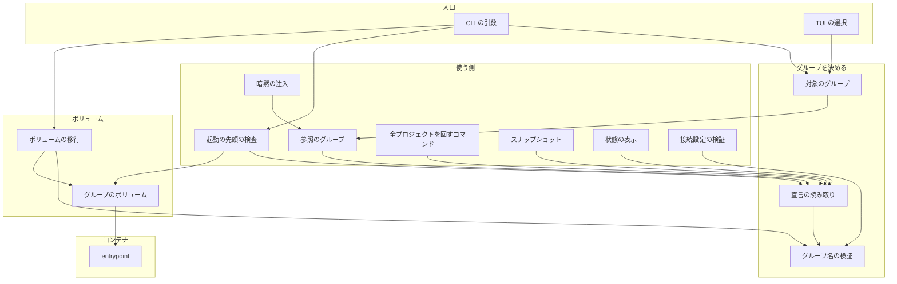
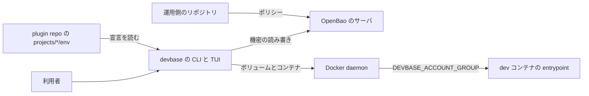
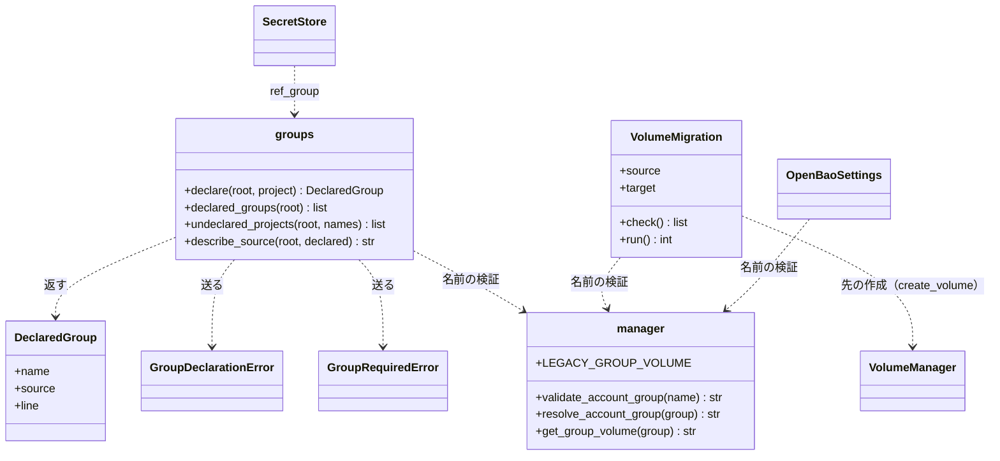
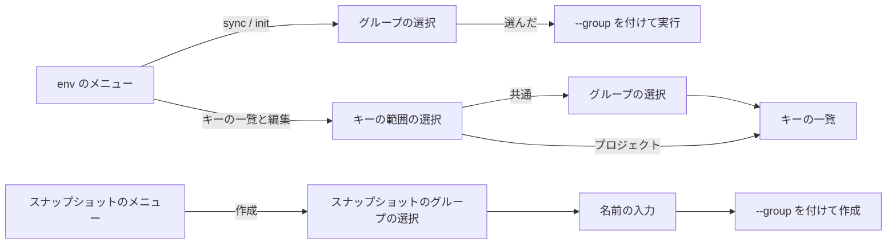
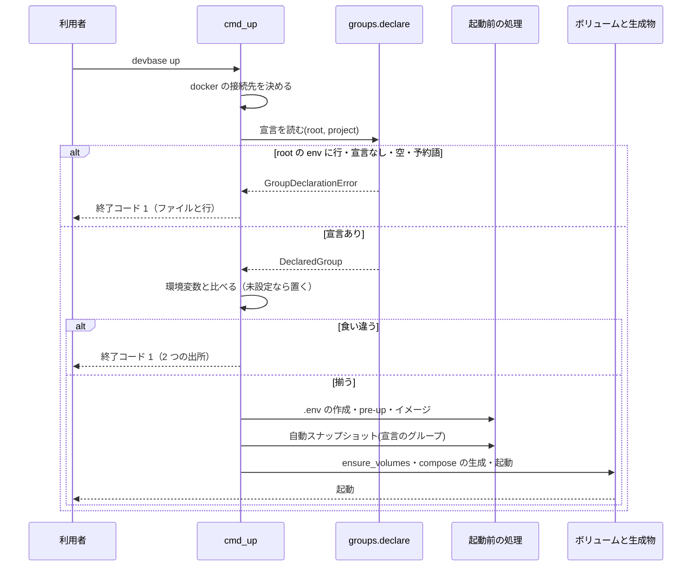
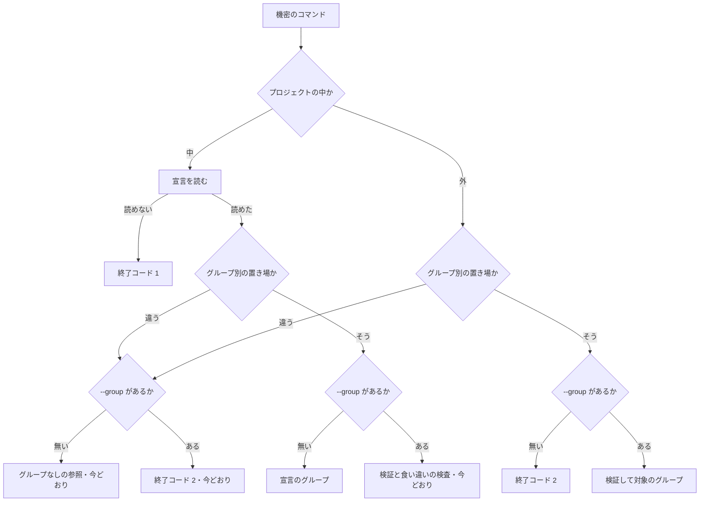
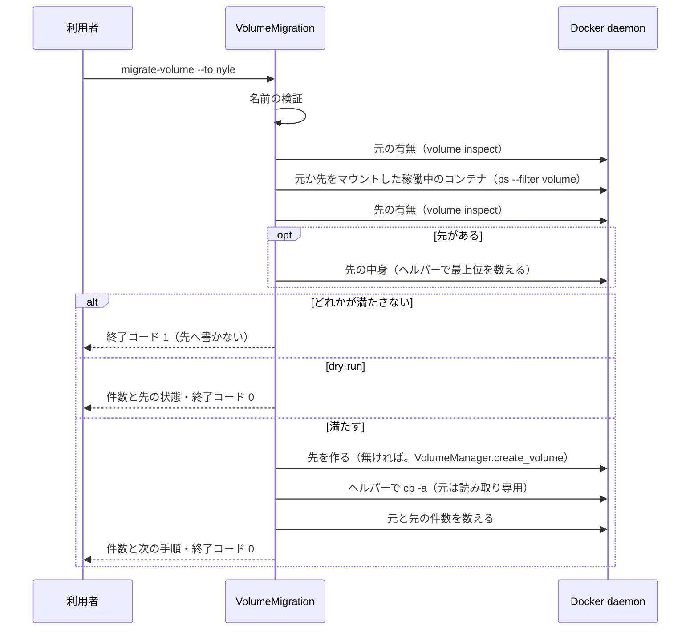
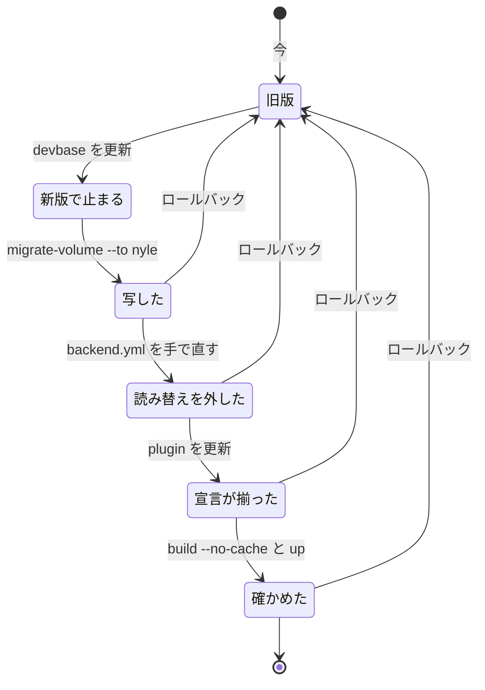

# #315: アカウントグループの `default` を廃止し、全プロジェクトでグループの宣言を必須にする

要求と受け入れ条件は #315 の本文にある（コピーは `issues/issue-315-requirements.md`）。この文書は
「どう作るか」だけを扱う。前提 1〜13 は仕様のコピーの番号を、E1〜E9 は仕様のドメインイベントの番号を指す。

仕様の未決のうち、設計が決めるとした 4 件は次の決定で閉じる。

| 未決 | 閉じる決定 |
| --- | --- |
| 移行の順序と、移行をコマンドにするか文書の手順にするか | 決定 6・決定 7 |
| `devbase_home_default` を含む既存のスナップショットの系列の扱い | 決定 8 |
| グループを決めるコマンドの一覧 | 決定 3 |
| devbase-samples の 5 プロジェクトに `personal` と書くか（決める人は利用者、期限は設計） | 決定 12 で推す案を示す。利用者の確認は「未確認のまま残ること」に残す |

## ドメインモデル

### コンテキスト

| コンテキスト | 何の語が 1 つの意味に決まるか |
| --- | --- |
| 機密の置き場（`secret`） | アカウントグループ・グループの宣言・グループのボリューム・対象のグループ・置き場のグループ名・グループを決めるコマンド・ボリュームの移行・旧既定のボリューム |
| スナップショット（`snapshot`） | 系列・世代。系列はボリュームの組で決まり、グループ名の規則は `secret` から受け取る |

`snapshot` は `secret` の順応者である。グループ名の検証（`validate_account_group`）と旧既定のボリュームの
名前をそのまま使い、自分の規則を持たない。

### 集約

| 集約 | 持ち主（書き換えてよいもの） | 根 | エンティティ | 値オブジェクト |
| --- | --- | --- | --- | --- |
| グループの宣言 | 各 plugin repo（`projects/<name>/env`）。devbase は読むだけ | プロジェクトの `env` の `DEVBASE_ACCOUNT_GROUP` の行 | — | グループ名・出所（ファイルと行番号） |
| 接続設定 | `cmd_env_backend_use`。`default` の読み替えを外すのは利用者の手（決定 9） | `backend.yml` の `openbao` 節 | — | `layout`・`group_aliases` |
| グループのボリューム | `VolumeManager`（ボリュームの名前の決定と作成）。中身を書く経路は下の表に限る | `devbase_home_<group>` | — | ボリューム名 |
| スナップショットの系列 | `SnapshotManager` | `backups/snapshot.yml` の系列 | 世代 | ボリュームの組 |

グループのボリュームの集約に触れる経路は次の 3 つである。作成と移行はボリュームを `VolumeManager` を通して
作る。復元は今のままで、無いボリュームは `docker run -v` のマウントで暗黙に作られる（`VolumeManager` を通らない）。

| 経路 | 書くもの | 入口 | 前提 |
| --- | --- | --- | --- |
| 作成 | 無ければ空のボリュームを作る | `VolumeManager.ensure_volumes`（`up` / `scale`） | 宣言の検査を通った後（I4） |
| 移行 | 先を作り、空の先へ元の中身を写す | `VolumeMigration`。先は `VolumeManager.create_volume` で作り、ヘルパーのコンテナで写す | 元と先を使うコンテナが止まっていて、先が空（I7） |
| 復元 | メタに書かれたボリュームの中身を世代で置き換える。旧既定の系列は旧既定のボリュームへ戻し、グループのボリュームは書かない | `SnapshotManager.restore`（今のまま） | 旧既定の系列は元のボリュームへだけ戻す（I10・決定 8） |

- ボリュームの移行など、ドメインの個別の操作が書き換える集約は 1 つである。ボリュームの移行は移し先の
  ボリュームだけを書き、宣言・接続設定・元のボリュームを書かない（I7）。`up` / `scale` はこの規則の対象に
  しない。ボリュームの作成と自動スナップショットの 2 つを書く今の起動の動作を残す（「データ構造」の表の F10）
- 宣言の持ち主は devbase の外にある。devbase の PR は宣言を書かない（前提 13）

### 不変条件

| # | 集約 | 条件 | 破れたときの扱い |
| --- | --- | --- | --- |
| I1 | グループの宣言 | プロジェクトの所属グループを決める出所は `projects/<name>/env` の空でない宣言だけである。`$DEVBASE_ROOT/env`・既定の値からは決めない。操作の対象のグループ（E2）は、別に `--group` と TUI の選択で明示できる | 宣言が無い・空・`$DEVBASE_ROOT/env` に行がある → `GroupDeclarationError`。止めた文でファイルと行を名指しする |
| I2 | グループの宣言 | プロセスの環境変数の `DEVBASE_ACCOUNT_GROUP` は、値があれば宣言と同じでなければならない | `up` / `scale` は副作用の前に止まり、2 つの値と出所を出す |
| I3 | グループの宣言 | `default` はグループ名として受け付けない。宣言・`--group`・`group_aliases` のキーと値のどれでも同じ | 検証 1 か所（`validate_account_group`）で弾き、移し先を書くよう示す |
| I4 | グループの宣言 | `up` / `scale` は、宣言の検査を副作用のある処理（`.env` の作成・`pre-up`・自動スナップショット・ボリューム・生成物・コンテナ）より前に行う | 検査を各コマンドの先頭に置く。1 つでも作られたら壊れている |
| I5 | 接続設定 | グループ別の置き場では、プロジェクトの外で `--group` の無い機密のコマンドは置き場を開かない | 終了コード 2 で止め、`--group <名前>` を示す |
| I6 | 接続設定 | グループ別の置き場でない設定では、プロジェクトの外の機密のコマンドの振る舞いを変えない | `--group` は今どおり断る。宣言の要否はプロジェクトの中の検査（I1）だけが持つ |
| I7 | グループのボリューム | ボリュームの移行は元のボリュームを書き換えず、消さない | 元を読み取り専用でマウントする。先が空でない・元が無い・元か先を使うコンテナが動いている → 何も書かずに止まる |
| I8 | グループのボリューム | コンテナは `DEVBASE_ACCOUNT_GROUP` 無しで起動しない | entrypoint がリンクを張る前に 0 でない終了コードで終わる |
| I9 | グループのボリューム | 暗黙に機密を読む経路（dispatch 前の注入・`env exec`）は、グループが決まらないときにどのグループの置き場も読まない | 空の結果で続ける。明示の機密のコマンドだけが止まる（決定 4） |
| I10 | スナップショットの系列 | 旧既定のボリュームの系列は一覧・コピー・削除・ローテーション・元のボリュームへの復元ができる。新しい世代は作らない | 作成は宣言か `--group` で決めたグループだけを対象にするため、`default` の世代は構造上作られない |
| I11 | 接続設定 | 全プロジェクトを回すコマンドは、グループ別の置き場が関わるとき、対象のプロジェクトに宣言の無いものが 1 つでもあれば書き込みの前に止まる | 名前を挙げて止め、`--exclude-project` で外せることを示す |
| I12 | グループの宣言 | TUI で共通の範囲を相手にするとき、グループ別の置き場ではグループを選んでから置き場を読む。選択の候補に `default` が出ない | 候補はプロジェクトの宣言だけから作る |
| I13 | グループのボリューム | entrypoint は `/persistent/ai` からグループ側へ取り込まない（前提 8） | 取り込みの処理を entrypoint から消す。取り込みが起きたら壊れている |

### ドメインイベント

| # | イベント | 発生元 | 受け手 |
| --- | --- | --- | --- |
| E1 | プロジェクトのグループの宣言を読んだ | `groups.declare` | `up` / `scale` の先頭の検査・機密のコマンド（`_target_group`）・`snapshot create`・`status` |
| E2 | 対象のグループを決めた | `_target_group`（`--group`）・TUI のグループの選択 | 機密のコマンドの参照の組み立て |
| E3 | 置き場のグループ名へ写した | `OpenBaoSettings.storage_group` | 置き場のパスの組み立て（`path_of`） |
| E4 | グループのボリュームを付けてコンテナを作った | `ensure_volumes`・`generate_scaled_compose` | Docker・entrypoint（E5） |
| E5 | コンテナの中でグループの設定のリンクを張った | entrypoint | 起動のログの 1 行 |
| E6 | 元のボリュームの中身を移し先のボリュームへ写した | ボリュームの移行（`project migrate-volume`） | 利用者（結果の表示）。次の手順（E7） |
| E7 | 置き場の読み替え `default → nyle` を外した | 利用者の手による `backend.yml` の編集 | 設定の読み込み（`default` のキーが残れば止まる） |
| E8 | 全プロジェクトがグループを宣言した | plugin repo の PR のマージと `devbase plugin` の更新 | `up`（E1） |
| E9 | 移し先のボリュームで今までのログインと MCP のトークンが使えた | 利用者の手動確認 | 使えなければロールバックの手順 |

### 用語

| 用語 | 意味 | 用語集への反映 |
| --- | --- | --- |
| アカウントグループ | `DEVBASE_ACCOUNT_GROUP` の値。プロジェクトの `env` での宣言が必須で、既定の値を持たない。`default` は予約語。ボリューム `devbase_home_<group>` の単位でもある | 意味の変更（`secret`） |
| グループの宣言 | `projects/<name>/env` に書いた空でない `DEVBASE_ACCOUNT_GROUP` の行。プロジェクトの所属グループを決める唯一の出所（操作の対象は `--group`・TUI の選択でも明示できる） | 追加（`secret`） |
| グループのボリューム | アカウントグループごとの `devbase_home_<group>`。コンテナの `/persistent/group` にマウントされる | 追加（`secret`） |
| グループを決めるコマンド | 宣言か `--group` からグループを決めないと先へ進めないコマンド。`up` / `scale` / 機密のコマンド / `snapshot create`（決定 3） | 追加（`secret`） |
| ボリュームの移行 | 旧既定のボリュームの中身を、利用者が指定したグループのボリュームへ写す操作。元を残す | 追加（`secret`） |
| 旧既定のボリューム | この変更より前に、宣言の無いプロジェクトが使っていた `devbase_home_default`。移行の元で、スナップショットの系列にも残る | 追加（`secret`） |

## 機能一覧

| # | 機能 | 誰が使うか |
| --- | --- | --- |
| F1 | 宣言の無い・空のプロジェクトで、グループを決めるコマンドを止め、宣言の書き方を示す | devbase の利用者 |
| F2 | `$DEVBASE_ROOT/env` のグループの行を拒み、消すよう示す | devbase の利用者 |
| F3 | グループ別の置き場で、プロジェクトの外の機密のコマンドに `--group` を求める | 機密を扱う利用者 |
| F4 | TUI で共通の範囲を相手にする操作（キーの一覧・sync・init）とスナップショットの作成で、先にグループを選ぶ | 端末で `devbase list` を使う利用者 |
| F5 | `default` をグループ名・読み替えのキーとして拒む | devbase の利用者 |
| F6 | `devbase status` でグループの欄を宣言から出す | devbase の利用者 |
| F7 | 旧既定のボリュームの中身を、指定したグループのボリュームへ写す | 既存の利用者（移行のとき 1 回） |
| F8 | 旧既定のボリュームのスナップショットを一覧し、元のボリュームへ復元する | 既存の利用者（ロールバックのとき） |
| F9 | グループが渡らないコンテナを起動させない | devbase の利用者（イメージの作り直しの後） |
| F10 | `personal` のグループでプロジェクトを起動する | 個人・OSS のプロジェクトの利用者 |
| F11 | 全プロジェクトの `env` にグループを宣言する | plugin repo の持ち主 |
| F12 | 移行とロールバックの手順・宣言の書き方を文書で読む | 既存の利用者・新しい利用者 |

F10 は devbase のコードを足さない。グループ名の規則を満たす名前はどれも同じ経路で動くため、`personal` は
宣言（F11）と文書（F12）とサーバのポリシー（前提 10。範囲外）で成り立つ。

## 構成要素

| 要素 | 責務 |
| --- | --- |
| グループの宣言の読み取り（`lib/devbase/env/groups.py`） | `declare(root, project)`：`$DEVBASE_ROOT/env` の行の検査 → プロジェクトの `env` の宣言の読み取り → 名前の検証。`GroupDeclarationError` と `GroupRequiredError` を持つ。`declared_groups(root)`（候補の一覧）と `undeclared_projects(root, names)`（全プロジェクトの検査）を足す。`default` への落ちる経路を消す |
| グループ名の検証（`lib/devbase/volume/manager.py`） | `validate_account_group(name)` を唯一の規則にする（空・文字種・`ubuntu`・`default`・数字だけ）。`resolve_account_group(group)` は引数か環境変数を検証し、空なら `GroupDeclarationError`。`DEFAULT_ACCOUNT_GROUP` を消し、`LEGACY_GROUP_VOLUME = "devbase_home_default"` を置く。プロジェクト名の代わりの名前は別の定数にする（決定 10） |
| 起動の先頭の検査（`commands/container.py`） | `_check_group_consistency` を `_require_group_declaration` に置き換える。backend を問わず宣言を読み（I1）、プロセスの環境変数と比べ（I2）、未設定なら宣言の値を環境変数へ置く（決定 5）。`cmd_up` の先頭（`_resolve_docker_target` の後、`_run_pre_up_checks` の中の最初）と `cmd_scale` の先頭で呼ぶ。自動スナップショットへ宣言のグループを渡す |
| 参照のグループ（`env/secret_store.py` の `ref_group`） | グループ別の置き場で、プロジェクトがあれば `declare(...).name`、無ければ `GroupRequiredError`。それ以外の設定では今どおり `None` |
| 暗黙の注入（`env/runtime.py`） | グループ別の置き場でプロジェクトが無いとき、共通の参照を読まずに空の結果を返す（I9）。プロジェクトがあれば `ref_group` に従う |
| 機密のコマンドの対象のグループ（`commands/env.py` の `_target_group`） | プロジェクトの中では backend を問わず宣言を検査する（決定 2）。グループ別の置き場でプロジェクトの外なら `--group` が無いと `GroupOptionError`（終了コード 2）。`default` の説明を消す |
| 全プロジェクトを回すコマンド（`env/bundle.py`・`env/io_import.py`・`commands/env_backend.py` の `_MigrationPlan` と `_probe_refs`） | グループ別の置き場が関わるとき、書き込みの前に `undeclared_projects` で止める（I11）。共通の参照のグループは `--group` か実行時のプロジェクトの宣言から決める |
| CLI の引数（`lib/devbase/cli.py`） | `--group` を `env export` / `env import` / `env backend migrate` / `env backend test` / `snapshot create` に足す。`project migrate-volume` を足す。`_named_lifecycle_project` の判定を `ref_group` から `_grouped_layout` に変える（宣言の無いプロジェクトで例外を送らない） |
| 接続設定の検証（`env/backend_config.py`） | `group_aliases` のキーか値が `default` なら、その対応を消すよう示す `BackendConfigError`（決定 9）。`_validate_group_name` の `default` の説明を消す |
| ボリュームの移行（新設 `lib/devbase/volume/migrate.py`） | `VolumeMigration`：前提の検査（先の名前・元の有無・元か先を使う稼働中のコンテナ・先が空か。先の有無は `docker volume inspect` で先に確かめ、無ければヘルパーで数えず空と見なす。ヘルパーが無い先をマウントすると docker が先を暗黙に作るため）→ `VolumeManager.create_volume` で先を作る（無ければ）→ ヘルパーのコンテナで `cp -a` → 件数の照合。元は読み取り専用 |
| ボリュームの作成（`volume/manager.py` の `VolumeManager`） | `_create_volume` を `create_volume` として公開し、`ensure_volumes` と移行の両方がこれで作る |
| 移行の入口（`commands/project.py` の `cmd_project_migrate_volume`） | `devbase project migrate-volume --to <group> [--dry-run]` の引数の検証と結果の表示 |
| スナップショット（`snapshot/manager.py`・`commands/snapshot.py`） | メタの検証で旧既定のボリュームを明示して許す（I10）。`create` は宣言か `--group` のグループを対象にし、どちらも無ければ終了コード 2。ヘルパーのイメージの用意を移行と共有する |
| 状態の表示（`commands/status.py`） | `_get_account_group` を宣言から組む。外なら「なし（プロジェクトの外）」、宣言の無いプロジェクトなら「宣言なし」と出所 |
| TUI（`tui/actions_env.py`・`tui/actions_env_keys.py`・`tui/actions_snapshot.py`・`commands/env_rows.py`） | グループ別の置き場で sync・init の前にグループを選ぶ。キーの一覧の共通の範囲は今の選択を使う。`group_choices` から `$DEVBASE_ROOT/env` の候補を外し `declared_groups` から作る。スナップショットの作成の前にグループを選ぶ（backend を問わない） |
| entrypoint（`containers/base/entrypoint.sh`） | グループが空なら 0 でない終了コードで終わる。`devbase_seed_group_settings` と呼び出しを消す。`${4:-default}`・`${1:-default}`・`${DEVBASE_ACCOUNT_GROUP:-default}` を消す |
| 文書 | `docs/user/environment-variables.md`・`env-backend.md`・`snapshot-guide.md`・`container-operations.md`・`google-auth.md`・`cli-reference/03-env.md` ほか CLI リファレンス・`docs/specifications/secret-backend.md`・`snapshot-series.md`・用語集。移行とロールバックの手順（決定 7）をリリースノートの元として `docs/user/environment-variables.md` に置く |
| 各 plugin repo の宣言（devbase の外） | volareinc/devbase-ext（27 件）・takemi-ohama/devbase-ext（3 件）・devbasex/devbase-samples（5 件）の `projects/*/env` に 1 行を足す PR（前提 13） |

### 構成要素図



図に含めない要素：文書・各 plugin repo の宣言（コードの呼び出しの関係を持たない）。

### 文脈と配置



- こちらが変えられないもの：OpenBao のサーバのポリシー（前提 10）・Docker daemon
- 同じ変更で一緒に変えるもの：plugin repo の宣言（別の PR）・イメージの entrypoint（`build --no-cache` で反映）
- 境界をまたぐもの：ホストからコンテナへはグループ名だけが環境変数で渡る。ボリュームの移行はホストの
  ファイルを経由せず、Docker daemon の上のヘルパーのコンテナの中でボリュームからボリュームへ写す

### パッケージ構成

```text
lib/devbase/
├── cli.py                     変更（--group の追加・migrate-volume・_named_lifecycle_project）
├── commands/
│   ├── container.py           変更（_require_group_declaration・自動スナップショット）
│   ├── env.py                 変更（_target_group）
│   ├── env_backend.py         変更（migrate・test・status の表示）
│   ├── env_rows.py            変更（group_choices）
│   ├── project.py             変更（cmd_project_migrate_volume を足す）
│   ├── snapshot.py            変更（create の --group）
│   └── status.py              変更（_get_account_group）
├── env/
│   ├── backend_config.py      変更（default の読み替えを拒む）
│   ├── bundle.py              変更（export の検査と --group）
│   ├── groups.py              変更（宣言の必須化・例外 2 つ・一覧 2 つ）
│   ├── io_import.py           変更（import の検査と --group）
│   ├── keys.py                変更（コメント）
│   ├── runtime.py             変更（外では共通を読まない）
│   └── secret_store.py        変更（ref_group）
├── snapshot/manager.py        変更（旧既定のボリュームの許可・ヘルパーのイメージの共有）
├── tui/
│   ├── actions_env.py         変更（sync・init の前のグループの選択）
│   ├── actions_env_keys.py    変更（_select_group の候補）
│   └── actions_snapshot.py    変更（create の前のグループの選択）
└── volume/
    ├── manager.py             変更（validate_account_group・定数）
    └── migrate.py             新設（VolumeMigration）
containers/base/entrypoint.sh  変更
```

検査の手段：`ruff check lib tests`・`shellcheck containers/base/entrypoint.sh`（CI と同じ版）・
`grep -rnE 'DEFAULT_ACCOUNT_GROUP|ACCOUNT_GROUP:-default|:-default\}' lib/devbase containers` が 0 件。
最後の式は `GCP_ACTIVE_PROFILE:-default`（グループではない）にも当たるため、実装で除外の条件を決める。

## 構造



| 型・関数 | 変更 | 責務 |
| --- | --- | --- |
| `DeclaredGroup` | 変更 | `source` は常にプロジェクトの `env`（`None` を持たない）。`line` を足す（止めた文でファイルと行を名指しするため） |
| `GroupDeclarationError(DevbaseError)` | 新設 | 宣言が無い・空・予約語・名前の不正・`$DEVBASE_ROOT/env` に行がある。文にファイルと行を入れる |
| `GroupRequiredError(DevbaseError)` | 新設 | グループ別の置き場でプロジェクトの外なのにグループが渡らない。`commands/env` は `GroupOptionError`（終了コード 2）へ写す |
| `validate_account_group` | 新設 | 名前の規則の唯一の置き場。今の `resolve_account_group` の検証の本体を移し、`default` を予約語へ足す |
| `resolve_account_group` | 変更 | 引数か環境変数を `validate_account_group` へ渡す。空は `GroupDeclarationError`（既定へ落ちない） |
| `VolumeMigration` | 新設 | 移行の前提の検査と実行。元と先はボリューム名で持ち、グループ名は検証を通した後の値。先は `VolumeManager.create_volume` で作る |
| `VolumeManager.create_volume` | 変更 | 今の `_create_volume` を公開する。グループのボリュームを作る唯一の入口（集約の持ち主） |
| `SecretStore.ref_group` | 変更 | 上の「参照のグループ」 |
| `OpenBaoSettings.validate` | 変更 | `group_aliases` の `default` を専用の文で拒む |

`declared_group`（名前だけを返す別名）は呼び出し元が `ref_group` だけのため消し、`declare` にまとめる。

## データ構造

永続データは 3 つあり、どれもスキーマは変えない。変わるのは値の許し方と、ボリュームの中身の置き場である。

| データ | 置き場 | 変わること |
| --- | --- | --- |
| グループのボリューム | Docker の named volume `devbase_home_<group>` | `devbase_home_default` を作らなくなる。移行で `devbase_home_<先>` へ中身を写す。`devbase_home_personal` は最初の `up` で空で作られる（前提 9） |
| 接続設定 | `secrets/backend.yml` の `openbao.group_aliases` | キーと値に `default` を許さない。利用者が `default: nyle` の行を手で消す |
| スナップショットのメタ | `backups/snapshot.yml` と各世代の `meta.yml` の `volumes.group` | 旧既定のボリュームの値を読む側で許す。新しく書く値に `devbase_home_default` は現れない |

時系列の扱い：ボリュームの移行は元を残して写すため、移行の前の状態は元のボリュームと既存のスナップショットの
系列に残る。移し先に移行の前の中身は無く、上書きで失うものは無い（先が空でないときは止まる。I7）。

移行：移せないものは無い。`devbase_home_default` の中の全エントリを持ち主・権限・シンボリックリンクごと写す。
シンボリックリンクはリンクのまま写し、リンク先を辿らない（`cp -a`）。

| 機能 | グループの宣言 | 接続設定 | グループのボリューム | スナップショットのメタ |
| --- | --- | --- | --- | --- |
| F1 宣言の検査 | R | — | — | — |
| F3 `--group` の必須化 | R | R | — | — |
| F5 `default` を拒む | R | R | — | — |
| F6 状態の表示 | R | — | — | R |
| F7 ボリュームの移行 | — | — | R（元）・C/U（先） | — |
| F8 旧既定の復元 | — | — | U（元） | R |
| F10 `personal` で起動 | R | R | C | C（自動スナップショット） |

書く相手が 2 つ以上ある機能は F10 だけで、どちらも今の `up` の書き方のままである。

## 入出力の契約

### 変わるコマンド

| コマンド | 入力 | 成功 | 失敗の形 | 互換性 |
| --- | --- | --- | --- | --- |
| `devbase up` / `scale`（`open` が停止中に `up` へ回す経路を含む） | プロジェクトの `env` の宣言 | 今どおり。`devbase_home_<宣言>` を付ける | 宣言が無い・空・予約語・`$DEVBASE_ROOT/env` に行・環境変数と食い違い → 終了コード 1、副作用なし | 壊れる。宣言の無いプロジェクトは起動しない（前提 12） |
| `env init` / `sync` / `list` / `set` / `get` / `delete` / `edit` | `--group NAME`（任意）・実行時のプロジェクト | 今どおり | グループ別の置き場でプロジェクトの外・`--group` 無し → 2。宣言の無いプロジェクトの中 → 1（backend を問わない）。`--group default` → 2 | 壊れる（外で `--group` 無しの呼び出し） |
| `env project` | 実行時のプロジェクト | 今どおり | 宣言の無いプロジェクト → 1 | 壊れる |
| `env export` / `env import` | `--group NAME` を足す。`--exclude-project` は今どおり | 今どおり | グループ別の置き場で、外・`--group` 無し → 2。対象に宣言の無いプロジェクト → 1（名前の一覧と `--exclude-project` の案内） | 壊れる（グループ別の置き場のときだけ） |
| `env backend migrate` | `--group NAME` を足す（共通の参照のグループ） | 今どおり | グループ別の置き場が移行の元か先で、外・`--group` 無し → 2。宣言の無いプロジェクト → 1（書き込み前） | 壊れる（同上） |
| `env backend test` | `--group NAME` を足す | 今どおり | グループ別の置き場で、外・`--group` 無し → 2 | 壊れる（同上） |
| `env backend status` | — | 外では「グループ: なし（プロジェクトの外）」とパスの `<g>` を出す | — | 表示だけ変わる |
| 機密を読むすべての設定の読み込み | `backend.yml` | 今どおり | `group_aliases` に `default` のキーか値 → 設定の読み込みで止まる（コマンドごとの今の形。多くは 1） | 壊れる（`default: nyle` を持つ端末） |
| `snapshot create` | `--group NAME` を足す | 宣言か `--group` のグループの系列に作る | 外・`--group` 無し → 2。宣言の無いプロジェクトの中 → 1 | 壊れる（外で `--group` 無し） |
| `snapshot list` / `restore` / `copy` / `delete` / `rotate` | — | 旧既定の系列も今どおり扱う | — | 変わらない |
| `devbase status` | 実行時のプロジェクト | グループの欄を宣言から出す | 設定の誤りは今どおり欄に出して続ける | 表示だけ変わる |
| `project migrate-volume`（新設） | 下の表 | 下の表 | 下の表 | 追加 |

`login` / `ps` / `logs` / `down` / `profile *` / `build` / `rebuild` はグループを決めない（決定 3）。宣言の
無いプロジェクトでも止まらず、機密が読めなければ今どおり警告して続ける。

### `devbase project migrate-volume`

| 項目 | 内容 |
| --- | --- |
| 形 | `devbase project migrate-volume --to <group> [--dry-run]` |
| 入力 | `--to`（必須）：移し先のグループ名。`validate_account_group` を通る名前。`--dry-run`：検査だけを行い書かない |
| 元 | `devbase_home_default`（`LEGACY_GROUP_VOLUME`。指定させない。決定 6） |
| 成功 | 終了コード 0。「`devbase_home_default` → `devbase_home_<group>` へ N 件を写しました。元は残してあります」と、次の手順（決定 7 の 3 以降）を出す。`--dry-run` は写す件数と先の状態を出して 0 |
| 失敗 | `--to` が無い・名前の規則に合わない・`default` → 2。元が無い・先が存在して空でない・元をマウントした稼働中のコンテナがある・Docker に届かない・写した後の件数が合わない → 1。どれも先へ書く前に止まる（件数の不一致は写した後に分かるため、先を残して理由と `docker volume rm devbase_home_<group>` を示す） |
| 出す文 | 止めた理由と直し方を 1 つずつ。稼働中のコンテナはコンテナ名を挙げ、`devbase down` を示す。先が空でないときは、先の最上位のエントリを最大 5 件挙げ、中身を確かめてから `docker volume rm` するよう示す |
| 互換性 | 新設。移行が終わった後に外すかは、この変更では決めない |

### 止めた文

文はファイルと行を名指しする（非機能の「運用・保守性」）。語の並びは実装で決め、名指しする要素だけを約束する。

| 状況 | 文が名指しするもの |
| --- | --- |
| 宣言が無い | `projects/<name>/env` と、書く行 `DEVBASE_ACCOUNT_GROUP=<グループ>` |
| 宣言が空 | `projects/<name>/env:<行>` と、書く行 |
| `$DEVBASE_ROOT/env` に行がある | `$DEVBASE_ROOT/env:<行>` と、その行を消してプロジェクトごとに書くこと |
| `default` を宣言した | 宣言のファイルと行、移し先のグループを書くこと、`devbase project migrate-volume --to <グループ>` |
| `--group default` | `--group` に予約語は使えないこと、移し先のグループ名を渡すこと |
| `group_aliases` に `default` | `backend.yml` のパスと `openbao.group_aliases` の `default: <値>` を消すこと |
| 外で `--group` が無い | `--group <名前>` を付けること（グループ別の置き場のとき） |
| 環境変数と宣言が食い違う | 2 つの値と、それぞれの出所 |

### 画面（TUI）

| 画面 | 何をする場所か | 変わること |
| --- | --- | --- |
| env のメニュー | 操作を選ぶ | 変わらない |
| グループの選択 | 対象のグループを選ぶか名前を入れる | sync・init の前にも出す（グループ別の置き場のとき）。候補は宣言だけから作る |
| キーの範囲の選択・キーの一覧 | 共通かプロジェクトを選び、キーを見る | 変わらない（共通ではもともとグループを選ぶ） |
| スナップショットのメニュー | 操作を選ぶ | 変わらない |
| スナップショットのグループの選択 | 作成の対象のグループを選ぶか名前を入れる | 新設。backend を問わず作成の前に出す |



グループ別の置き場でないとき、sync・init はグループの選択を出さずに今どおり実行する。

| 画面 | 項目 | 型 | 必須 | 満たさないときの表示 |
| --- | --- | --- | --- | --- |
| グループの選択 | 名前の入力 | 文字列 | 必須 | 既存の「使えない名前」の文を出して選択へ戻る（`--group` と同じ検証。`default` もここで弾く） |
| スナップショットのグループの選択 | 名前の入力 | 文字列 | 必須 | 同上（`validate_account_group`） |

| 状態 | グループの選択で出すもの |
| --- | --- |
| 初期 | 宣言済みのプロジェクトのグループ（置き場のグループ名で重複を除く）と「名前を入力」 |
| 空 | 宣言済みのプロジェクトが無い → 「名前を入力」だけ |
| エラー | 宣言の読めないプロジェクトは候補から飛ばす（今どおり） |

## 処理の流れ

### `up`（宣言の検査から起動まで）



`scale` は `_check_scale_request` と `project.yml` の書き換えより前に同じ検査を行う。プロジェクトが決まらない
（`projects/` の外で打った）ときも宣言を読めないため止まる（決定 5）。

### 機密のコマンドの対象のグループ



暗黙の注入（dispatch 前・`env exec`）は、外でグループ別の置き場のとき共通の参照を読まずに空で続ける（I9）。

### ボリュームの移行



ヘルパーのイメージはスナップショットと同じ `devbase-snapshot:latest` を使う（用意の処理を共有する）。検査から
コピーまでの間に元か先を使うコンテナが起動される競合は防がない。コピーの直前に稼働中のコンテナを数え直し、
件数の照合で写し損ねを拾う（決定 6）。

### この端末の移行の状態



「新版で止まる」は、`default: nyle` の読み替えが残るため機密のコマンドが止まり、宣言の無いプロジェクトの
`up` が止まる状態である。ボリュームの移行は機密の設定を読まないため、この状態で打てる。

## 非機能の実現方式

| 大項目 | 要求の条件 | 実現方式 | 確かめ方 |
| --- | --- | --- | --- |
| 移行性 | 移す対象は `devbase_home_default` の中身と `backend.yml` の `default → nyle` の読み替え。元のボリュームを残し、宣言と読み替えを戻せばロールバックできる。移行の途中で止まっても、元のボリュームは書き換わらない | 元を読み取り専用でマウントしてコピーする。元を消す手順を devbase に持たない。手順は決定 7 の順で、ロールバックは旧版へ戻して読み替えを戻す | 移行の前後で元のボリュームの全エントリの一覧（パス・持ち主・権限・リンク先）を比べ、一致する（手動）。コピーを途中で止めても元の一覧が変わらない |
| セキュリティ | どのコマンドも、宣言も `--group` も無いまま特定のグループ（とりわけ nyle）の機密の置き場やボリュームへ触れない。`personal` のコンテナへ nyle のチーム単位の機密が入らない | グループの出所を宣言と `--group` の 2 つに絞り、既定の値を消す（I1・I5・I9）。コンテナへ渡す機密は宣言したグループの置き場だけから読む（今の PLAN56 の経路） | 外で `--group` 無しの機密のコマンドが置き場へ要求を出さない（テスト）。`personal` のプロジェクトで `env list` と `docker exec env` に `team/nyle/…` だけのキーが無い（手動） |
| 運用・保守性 | 止まったときの文は、どのファイルのどの行を書けば（消せば）よいかを名指しする | 「止めた文」の表の要素を例外の文へ入れる。行番号は宣言を読む走査で数える | 各文をテストで照らす（ファイルのパスと行番号が含まれる） |

## 決定の記録

### 決定 1: 検証の規則を `validate_account_group` 1 か所に置き、`default` を予約語へ足す

宣言・`--group`・`group_aliases`・スナップショットのメタは、今もすべて `resolve_account_group` を通して
検証している。本体を純粋な検証の関数へ切り出して `default` を足せば、4 つの入口で同時に `default` が
使えなくなり、規則を写す場所が生まれない。`resolve_account_group` は「どこから値を取るか」だけを持つ。

`default` を入口ごとの条件で弾く形は採らない。入口が増えたときに弾き忘れる。

### 決定 2: 機密のコマンドの宣言の検査は、プロジェクトの中では backend を問わず行う

前提 3 は宣言の必須化を backend と version に依らないものとしている。宣言の無いプロジェクトは、機密を
どの backend に置いていても、`up` の時点でボリュームのグループが決まらず止まる。機密のコマンドだけが
通ると、機密を整えた後に起動できないことが分かる。プロジェクトの外の `--group` の必須化だけをグループ別の
置き場に限る（前提 3・I6）。

### 決定 3: グループを決めるコマンドは `up` / `scale` / 機密のコマンド / `snapshot create` に限る

この 4 つは、グループが決まらないと対象（ボリューム・置き場・系列）が決まらない。`login` / `ps` / `logs` /
`down` / `profile *` は、既に作られたコンテナを相手にし、グループを新しく決めない。止めると、宣言を書く前に
旧版で起動したコンテナを止められなくなる。`build` / `rebuild` はイメージを作るだけでボリュームを付けない。

`login` を加える形は採らない。`login` は生成物のコンテナへ入るだけで、グループの値を使わない。

### 決定 4: 暗黙に機密を読む経路は、グループが決まらなければ読まずに続ける

dispatch 前の注入と `env exec` は、利用者が機密を求めて打ったコマンドではない。`devbase build` は
`$DEVBASE_ROOT` で `env exec` を通るため、止めると base イメージを作れない（entrypoint の反映に要る
`build --no-cache` もここを通る）。読まずに続ければ、I9 とセキュリティの条件を満たしたまま今の
コマンドが動く。明示の機密のコマンドは止める（I5）。

外で共通の参照を読めないため、`$DEVBASE_ROOT` で打つ `devbase plugin` などに共通の機密が載らなくなる。
今の載せ方は `default → nyle` を経由した nyle の共通の機密であり、載らないことが要求どおりの状態である。

### 決定 5: `up` / `scale` はファイルの宣言を正とし、環境変数は未設定なら宣言の値を置き、あれば比べる

ボリュームは環境変数から、機密は `env` のファイルから決まる経路の 2 本立ては残す（`generate_scaled_compose`
などの呼び出し元を変えずに済む）。先頭の検査がファイルの宣言を読み、環境変数が未設定なら宣言の値を置く
ため、下位ディレクトリから打っても 2 つの経路が同じ値になる。値があって違えば止める（今の PLAN56 決定 7 の
検査を backend を問わない形へ広げる）。

`projects/` の外のディレクトリで打つ `up` は、宣言を書く場所が無いため止まる。宣言を環境変数から受ける
形は採らない。前提 1 が宣言の出所を `projects/<name>/env` だけにしている。

### 決定 6: ボリュームの移行はコマンドにし、元を `devbase_home_default` に固定する

受け入れ条件は、先が空でない・元が無い・元を使うコンテナが動いている、のどれでも何も書かずに止まることを
求める。加えて先を使うコンテナが動いているときも止まる（仕様の E6 の前提。空の先を稼働中のコンテナが
マウントしていると、空の検査の後にログインの設定などが書き込まれ、コピーと競合する）。文書の手順（`docker run … cp -a`）では、この 4 つの検査を利用者が毎回正しく行う前提になり、
テストで縛れない。コマンドにすれば検査をテストで縛れ、ほかの利用者の端末でも同じ手順で移せる（前提 6）。

元を指定させない。この変更で使えなくなる名前は `default` だけで、ほかの名前からの移行は要求に無い。
置き場は `project` の下に置く（`project migrate-config` と同じく、`projects/` 全体に関わる一度きりの変換）。
コピーは件数の照合までとし、中身のハッシュの照合はしない（`cp -a` の終了コードと件数で写し損ねを拾える）。

### 決定 7: 移行の順序は「止める → 更新 → 写す → 読み替えを外す → 宣言を届ける → 作り直す」

| 順 | 手順 | この順にする理由 |
| --- | --- | --- |
| 1 | 旧版のまま、宣言の無いプロジェクトと移し先のグループを宣言したプロジェクトのコンテナを `devbase down` で止める | 元か先を使うコンテナが動いていると移行が止まる |
| 2 | devbase を新版へ更新する | 移行のコマンドは新版にある |
| 3 | `devbase project migrate-volume --to nyle` | 宣言を届ける前に写す。新版で先に `up` すると先が空でなくなり、移行が止まる |
| 4 | `secrets/backend.yml` の `group_aliases` から `default: nyle` を消す | 残すと機密のコマンドが止まる |
| 5 | plugin repo の宣言の PR をマージし、`devbase plugin` で手元へ届ける | 旧版のまま宣言を届けると、旧版の `up` が空の `devbase_home_nyle` を作って使う |
| 6 | `devbase build --no-cache` の後に nyle のプロジェクトを `up` し、E9 を確かめる | entrypoint の変更はイメージの作り直しで反映される |

ロールバックは、devbase を旧版のタグへ戻し、`backend.yml` へ `default: nyle` を戻し、宣言の行を外す
（元の `devbase_home_default` と `default → nyle` の読み替えで今の状態に戻る）。宣言を残したまま旧版へ
戻しても、nyle のプロジェクトは写した `devbase_home_nyle` を使って動く。手順は
`docs/user/environment-variables.md` に置き、リリースノートから指す（前提 12）。

### 決定 8: 旧既定のボリュームの系列は、読む側で名前を明示して許し、元のボリュームへだけ復元する

スナップショットのメタの検証は `get_group_volume` を通すため、`default` を予約語にすると既存の系列が
「不正なメタ」として復元できなくなる。ロールバックの経路として元の系列が要るため、`LEGACY_GROUP_VOLUME`
を名指しで許す。復元の先はメタに書かれた `devbase_home_default` のままで、移し先へ復元する経路は作らない。
移し先へ入れたいときは、元へ復元してから移行をやり直す（先を消してから）。

系列を移し先の名前へ書き換える形は採らない。メタを書き換えると、どの時点の中身がどのボリュームのものかの
記録が失われる。

### 決定 9: `group_aliases` の `default` は読み込みで止め、devbase は `backend.yml` を書き換えない

読み替えは端末ごとの設定で、`default` を何へ向けていたかは端末によって違う（前提 6）。devbase が自動で
消すと、移行の前に消えてロールバックの手がかりを失う。読み込みで止めて消す行を示せば、利用者が移行の
順序（決定 7 の 4）の中で消せる。`env backend use` は読めない設定を引数だけで組み直すため、接続設定を
失わないよう手で直す手順を案内する。

### 決定 10: プロジェクト名の代わりの `default` は、グループと別の定数にする

`resolve_project_name` と `normalize_volume_component` は、名前が空のときの VS Code Server のボリューム名に
`DEFAULT_ACCOUNT_GROUP` を流用している。これはグループではないため、`_FALLBACK_PROJECT_NAME = "default"`
として分ける。ボリューム名 `devbase_vscode_default_<n>` は変わらない。

### 決定 11: TUI は sync・init・スナップショットの作成の前にグループを選ばせる

TUI はプロジェクトの外から `cmd_env` を呼ぶため、`--group` を渡さないと I5 で止まる。キーの一覧の共通の
範囲はもともと選ばせている（#273）。同じ選択の画面を sync・init にも使う。スナップショットの作成は backend
を問わずグループのボリュームを対象にするため、backend を問わず選ばせる。候補は `declared_groups` から作り、
`$DEVBASE_ROOT/env` の候補を外す（I12）。

### 決定 12: devbase-samples の 5 プロジェクトには `personal` を宣言する案を推す

宣言が無ければサンプルはそのままでは起動しない。`personal` は「会社の機密を使わない」ことを名前で伝え、
他の利用者の端末でも nyle のような会社名を押しつけない。利用者が別のグループで使いたいときは、その
plugin repo の手元の `env` を書き換える。adminer の割り当て（仕様の未決）と合わせて利用者が決める。

## テスト設計

| 受け入れ条件・不変条件 | どの振る舞いで縛るか | どう壊したら落ちるべきか |
| --- | --- | --- |
| 宣言の無いプロジェクトの `up` が止まり、書き方を示す（I1・I4） | `up` が 0 以外で終わり、文に `projects/<name>/env` と `DEVBASE_ACCOUNT_GROUP=` が入る。ボリューム・`.docker-compose.scale.yml`・コンテナ・`pre-up` の実行・`.env` の作成・自動スナップショットのどれも起きない | 検査を `_run_pre_up_checks` の後ろや `ensure_volumes` の後ろへ動かす。既定の値へ落とす |
| 空の宣言でも止まる（I1） | 同上。文に行番号が入る | 空を「宣言なし」と同じに扱わず既定へ落とす |
| `$DEVBASE_ROOT/env` に行があると止まる（I1） | プロジェクトが宣言済みでも `up` が 0 以外で、文に `$DEVBASE_ROOT/env` と行番号が入る | ルートの行を無視する・プロジェクトの宣言を優先して通す |
| 宣言の無いプロジェクトの `scale` が止まる（I4） | `project.yml` の `scale` が書き換わらず、ボリュームも生成物も作られない | 検査を `write_scale` の後ろへ動かす |
| 宣言の無いプロジェクトの中の機密のコマンドが止まる（決定 2） | `env get` が置き場へ要求を出さずに止まり、書き方を示す。file backend でも同じ | 検査をグループ別の置き場だけに限る |
| 宣言済みの `up` は今どおり（I2） | `devbase_home_<宣言>` がマウントされる。環境変数が未設定でも宣言の値で揃う | 環境変数だけを見る・宣言の値を環境変数へ置かない |
| 環境変数と宣言の食い違い（I2） | backend を問わず止まり、2 つの出所を出す | 検査をグループ別の置き場だけに戻す |
| 外で `--group` 無しの 7 コマンドが 2 で止まる（I5） | `init` / `sync` / `list` / `set` / `get` / `delete` / `edit` が置き場へ要求を出さずに 2 で終わり、`--group` を示す | `$DEVBASE_ROOT/env` や既定の値へ落とす |
| 外で `--group nyle` は `team/nyle/…` を読み書きする | 組んだパスが `team/nyle/global` | 読み替えの前後を取り違える |
| 中で `--group` を省くと宣言のグループ | 組んだパスが宣言のグループ | 外の規則を中にも当てる |
| グループ別の置き場でない設定では外の振る舞いが変わらない（I6） | `version: 1`・file・age で、外の `env get` が今と同じ結果を返し、`--group` は今どおり断る | 外の検査を設定を問わず当てる |
| TUI の共通の範囲でグループの選択が出て、候補に `default` が無い（I12） | sync・init・キーの一覧（共通）で、置き場を読む前に選択が出る。候補は宣言だけから作られる | `$DEVBASE_ROOT/env` の候補を残す・選択の前に読む |
| `default` の宣言と `--group default` が拒まれる（I3） | どちらもエラーで、移し先を書く・渡すよう示す。スナップショットの作成・`migrate-volume --to default` も拒む | 入口のどれかで `validate_account_group` を通さない |
| `group_aliases` の `default` で止まる（決定 9） | キーでも値でも、機密のコマンドが設定の読み込みで止まり、`backend.yml` と消す行を示す | 読み替えを黙って無視する・自動で消す |
| `lib/devbase` と `containers/` に `default` の既定が残らない | 構成要素の「検査の手段」の `grep` が 0 件（CI の検査か単体テストで打つ） | 既定の値を 1 か所でも戻す |
| entrypoint がグループ無しで止まる（I8） | `DEVBASE_ACCOUNT_GROUP` が空でリンクを張る前に 0 以外で終わり、グループが渡っていない旨を出す | 空を既定へ落とす |
| entrypoint が `/persistent/ai` から取り込まない（I13） | グループが渡ったコンテナで、`/persistent/ai` に中身があってもグループ側へ写らない | 取り込みを残す |
| `status` のグループの欄（F6） | 外では宣言が無いことが出て `default` が出ない。宣言済みの中ではその名前とボリュームが出る | 環境変数から既定へ落とす |
| 文書に `default` をグループの既定とする文が残らない | 実装の最後に `docs/user`・`docs/specifications/secret-backend.md`・用語集を `grep` して、既定として説明する文が 0 件（手で読む） | 文書の更新を漏らす |
| 移行で中身が写り元が残る（I7） | 元のファイル・ディレクトリ・持ち主・権限・シンボリックリンクが先に同じ形で現れ、元が残る。コピーの命令で元が読み取り専用で付く | 元を読み書きで付ける・リンクを辿る・コピー後に元を消す |
| 移行の前提の 4 つで止まる（I7） | 先が空でない・元が無い・元を使う稼働中のコンテナがある・先を使う（移し先のグループを宣言したプロジェクトの）稼働中のコンテナがある、のどれでも、先を作らず書かずに 1 で終わり理由を出す。先が無いときは検査の後も先が作られていない | 検査の 1 つを外す・先を作ってから検査する・ヘルパーで無い先をマウントする |
| 移行の後にログインと MCP のトークンが使える（E9） | 手動確認（下の「未確認」） | — |
| ロールバックの手順で戻る | 手動確認 | — |
| `personal` の `up` で `devbase_home_personal` が付き `devbase_home_nyle` が付かない（F10） | 生成物のマウントが `devbase_home_personal` だけ | グループを固定の名前へ落とす |
| `personal` のコンテナに nyle のキーが入らない | 宣言が `personal` のとき、注入が `team/personal/…` だけへ要求を出す | 共通の参照を既定のグループで読む |
| `env list --group personal` が `team/personal/…` を読む | 組んだパスが `team/personal/global` | — |
| 割り当ての表の personal の 7 プロジェクトが `personal` で起動する | 手動確認。plugin repo の宣言が届いた後に各プロジェクトを `up` し、起動のログの `Account group: personal` と `devbase_home_personal` のマウントを見る（未決の割り当ては決まった値で判定する） | — |
| 全プロジェクトの宣言（F11） | `projects/*/env` を読む 1 行のスクリプトで、uttaro-system を除く 37 件に空でない宣言がある（plugin repo の PR の後に手元で打つ） | — |
| devbase の PR に `projects/*` の変更が入らない | PR の差分のファイル一覧に `projects/` が無い | — |
| 全プロジェクトを回すコマンドが宣言の漏れで止まる（I11） | グループ別の置き場で、`export` / `import` / `backend migrate` が書き込みの前に名前を挙げて止まる。`--exclude-project` で外すと進む。グループ別の置き場でなければ止まらない | 検査を書き込みの後ろへ動かす・設定を問わず当てる |
| 暗黙の注入は外で何も読まない（I9） | グループ別の置き場で、外の dispatch 前の注入と `env exec` が置き場へ要求を出さずに続く | 外で止める（`build` が壊れる）・既定のグループで読む |
| 旧既定の系列が扱える（I10） | `devbase_home_default` を持つ系列の一覧・復元（元のボリュームへ）・ローテーションが通る。`snapshot create` は `default` の系列を作らない | 検証で旧名を拒む・作成で既定のグループへ落とす |
| 既存のテストが通る・with と kkg が変わらない | `pytest`・Ruff・ShellCheck の CI の検査ジョブ。with・kkg を宣言したプロジェクトの `up` の生成物と参照のパスが今と同じ | — |

既存のテストのうち、`default` を既定として固めているもの（`tests/env/test_groups.py`・
`tests/volume/test_manager_group.py`・`tests/commands/test_status_account_group.py`・
`tests/containers/test_entrypoint_ai_settings.py` など）は、この表の振る舞いへ書き直す。書き直しは退行では
なく、要求の変更である。

## 未確認のまま残ること

| 項目 | 内容 |
| --- | --- |
| 移行の後のログインと MCP のトークン | carmo-ai を `up` し、`claude` のログイン・`gh auth status`・`gcloud config get account`・MCP のトークンを移行の前と比べる。この端末で決定 7 の 6 のときに確かめる |
| ロールバックの手順 | 決定 7 の手順で旧版へ戻し、移行の前と同じ状態に戻ることを 1 度通す。実装の後、この端末で確かめる |
| dev 以外のサービスが base イメージの entrypoint を使うか | `DEVBASE_ACCOUNT_GROUP` は dev のサービスにだけ渡る。base 由来のイメージで entrypoint を通る dev 以外のサービスがあれば、そのサービスが起動しなくなる。実装の最初に全プロジェクトの `compose.yml` を調べる |
| `up` / `scale` のテストの harness | テストの多くが一時ディレクトリで `up` を走らせる。宣言の検査が先頭に入るため、harness の側で宣言を用意する必要がある（決定 5）。規模は実装で決まる |
| 外で共通の機密が載らなくなる影響 | `$DEVBASE_ROOT` で打つ `plugin` などが共通の機密の環境変数に頼っていないか（決定 4）。実装で `lib/devbase/plugin` と `bin/devbase` を確かめる |
| `personal` のサーバのポリシー | `team/personal/…` の読み書きの許可は運用側のリポジトリが持つ（前提 10）。揃うまで `env list --group personal` は 403 の今の形で止まる |
| devbase-samples の宣言 | 決定 12 の案を利用者が確かめる。plugin repo の PR の前 |
| 割り当ての未決 5 件 | adminer・devbase-ext・predict_contract・laravel-admin・engineering-introduction-handbook の割り当てを利用者が決める（仕様の未決）。plugin repo の PR の前 |
| uttaro-system | 宣言を書かずに据え置く。全プロジェクトを回すコマンドは、グループ別の置き場で `--exclude-project uttaro-system` が要る |
| `migrate-volume` をいつ外すか | 移行が終わった後もコマンドを残すかは、この変更では決めない |
