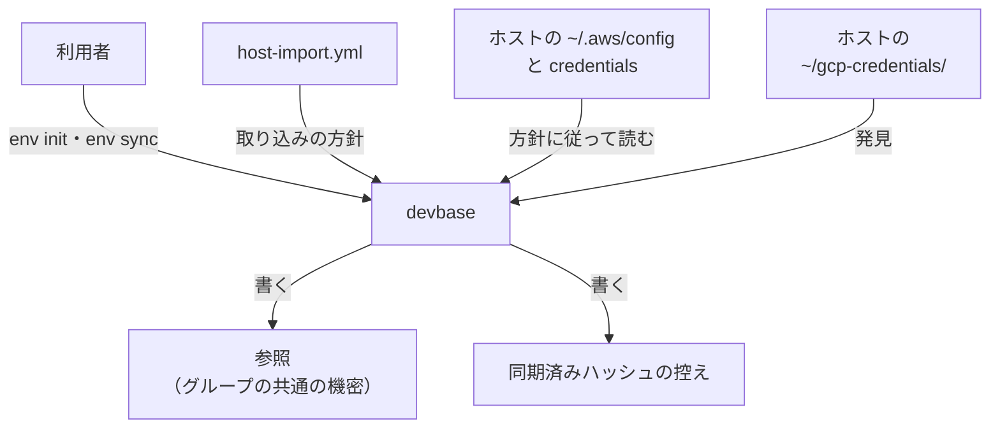
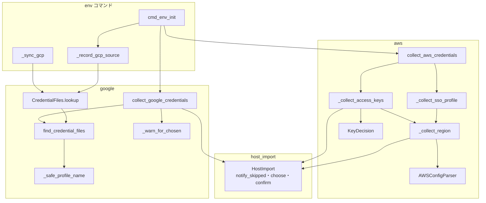
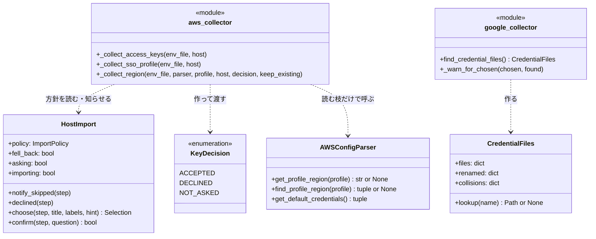
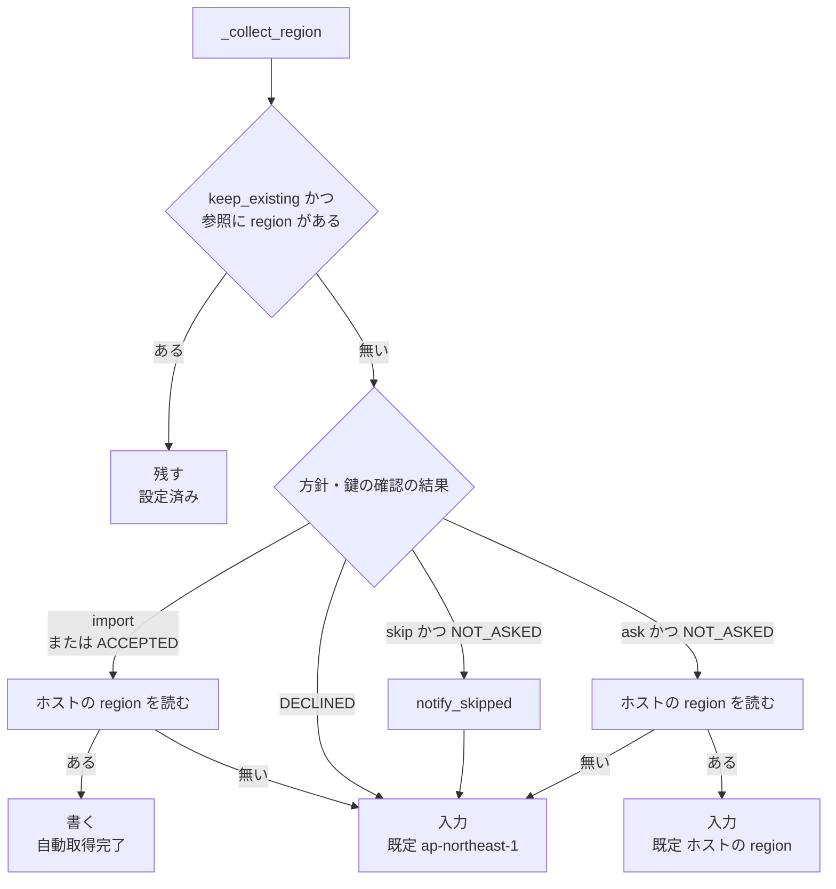
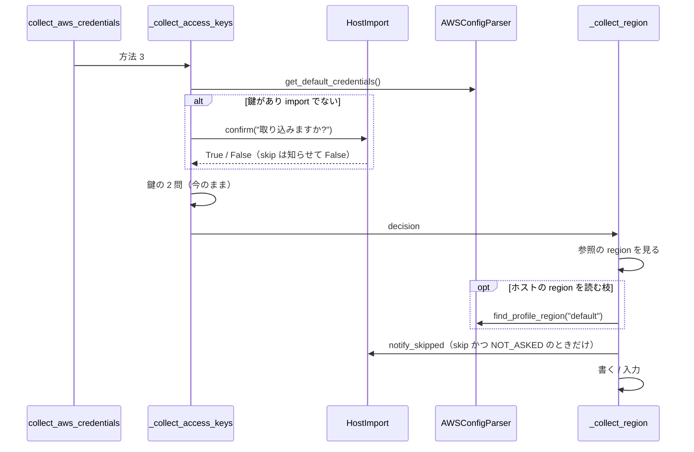
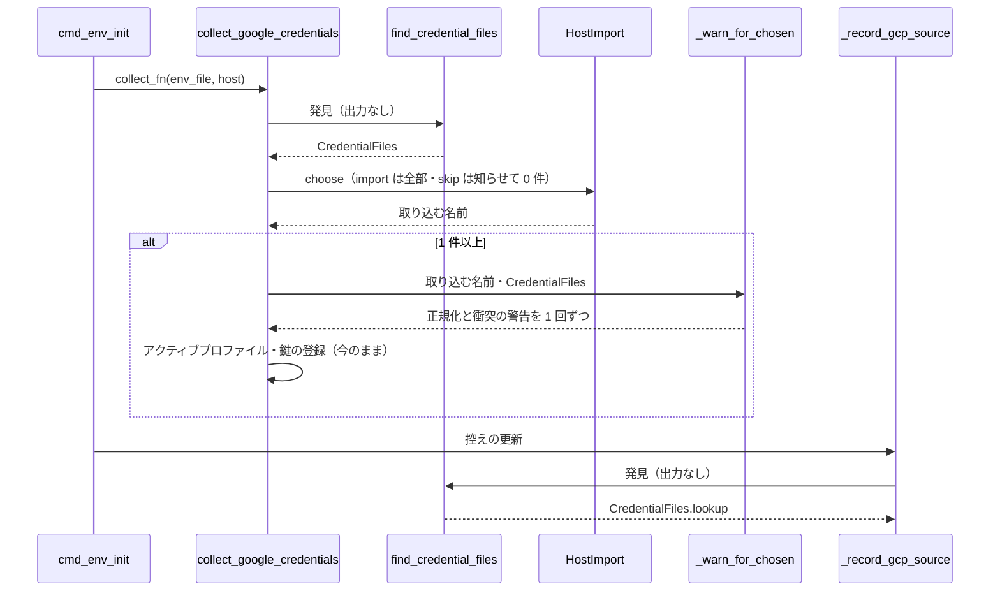

# #334: AWS の region と GCP の正規化の警告を取り込みの方針に従わせる

要求と受け入れ条件は #334 の本文にある（コピーは [issue-334-requirements.md](issue-334-requirements.md)）。
この文書は「どう作るか」だけを扱う。決定の理由は [issue-334-design-decisions.md](issue-334-design-decisions.md) に分けた。

変えるのは `env init` の AWS と GCP の collector と、`env sync` と同期済みハッシュの控えの更新が GCP の鍵ファイルを
引く経路である。次の 2 つを入れる。

- **region の出所の判定**: AWS の方法 2・方法 3 で、ホストの `~/.aws/config` の region を使うかを、取り込みの方針と
  鍵の確認の答えから 1 か所で決める。方針が `skip` のときと `ask` で断ったときは、ホストの region を読まない
- **警告を出さない鍵ファイルの発見**: `~/gcp-credentials/` の発見は出力を持たない 1 つの関数にし、`env init` と
  `env sync` / 控えの更新が同じものを使う。正規化と衝突の警告は、取り込むと決めた鍵についてだけ collector が出す

## ドメインモデル

### コンテキスト

| コンテキスト | 何の語が 1 つの意味に決まるか |
| --- | --- |
| 機密の置き場（`secret`） | 取り込み・取り込みの方針・取り込みの候補・取り込みの選択・AWS のプロファイル・プロファイル名の正規化と、この設計で足すホストの region・region の出所・鍵の確認の結果・鍵ファイルの発見 |

変更は 1 つのコンテキストで閉じる。取り込みの方針の決め方（`host-import.yml` と `host_import.resolve`）は #314 の
ものをそのまま使い、変えない（要求の前提 8）。

### 集約

| 集約 | 持ち主（書き換えてよいもの） | 根 | エンティティ | 値オブジェクト |
| --- | --- | --- | --- | --- |
| 取り込みの場 | `host_import.HostImport`（方針と、飛ばしたことの知らせ） | 1 回の `env init` の取り込みの場 | — | 取り込みの方針・端末でないため落ちたか・取り込みの選択 |
| AWS の認証の収集 | `collectors/aws.py` | 1 回の AWS の認証方法の選択 | — | 鍵の確認の結果（受け入れた / 断った / 確認しなかった）・region の出所（ホスト / 入力 / 既定の値 / 参照に既にある） |
| GCP の鍵ファイルの発見 | `collectors/google.py` | 1 回の `~/gcp-credentials/` の発見の結果 | — | プロファイル名 → 鍵ファイル・正規化で変わった名前 → 元の名前・衝突で外した鍵ファイル |

GCP の鍵ファイルの発見の持ち主は `google.py` だけである。`commands/env.py` は発見の結果を読むだけで、自分で
ディレクトリを読まない。

### 不変条件

| # | 集約 | 条件 | 破れたときの扱い |
| --- | --- | --- | --- |
| I1 | AWS の認証の収集 | 方法 2・方法 3 で、方針が `skip`（端末でない `ask` から落ちたものを含む）のとき、または方法 3 の鍵の確認で断ったとき、ホストの `~/.aws/config` の region を読まず、参照へ書かない。region は入力（既定の値 `ap-northeast-1`）で決める | 確認なしにホストの値が参照へ入る（#314 の「確認なしに取り込まない」から外れる）。テストが落とす |
| I2 | AWS の認証の収集 | 方針が `import` のとき（方法 2・方法 3）と、方法 3 の鍵の確認で受け入れたときは、ホストの region があれば入力を出さずに書き、無ければ入力へ進む | 今の `import` の振る舞いが変わる、または受け入れた答えが region に効かない。テストが落とす |
| I3 | AWS の認証の収集 | 方針が `ask` で鍵の確認を出さなかったとき（方法 3 でホストに鍵が無い・方法 2）、ホストの region を入力の既定の値として見せる。空の答えはその値、入れた値はその値を書く。ホストに region が無ければ既定の値は `ap-northeast-1` | 利用者が見ていない値が書かれる、または入れた値が無視される。テストが落とす |
| I4 | AWS の認証の収集 | 方法 3 で参照に `AWS_DEFAULT_REGION` が既にあれば、その値を残し、ホストの region を読まず、入力も出さない。方法 2 は参照の region を見ずに、I1〜I3 のとおり方針に従って決め直す（今の方法 2 も参照の region を上書きする） | 方法 3 で既にある region が上書きされる、または方法 2 で前の認証方法の region が新しいプロファイルへ持ち越される。テストが落とす |
| I5 | 取り込みの場 | 方法 2・方法 3 の 1 回の選択で、方針が `skip` のために飛ばした知らせは 1 行までにする。鍵の確認で既に知らせたときは region のために足さない。`ask` で断ったときは今の「取り込みません」の 1 行だけにする | 同じ選択で同じ知らせが 2 行出る。テストが落とす |
| I6 | GCP の鍵ファイルの発見 | 鍵ファイルの発見は、ログも標準出力も出さない。正規化と衝突の結果は値として返す | 発見を呼ぶたびに警告が出る（今の不具合）。テストが落とす |
| I7 | GCP の鍵ファイルの発見 | 正規化の警告は、取り込むと決めた名前のうち正規化で変わったものについて、名前ごとに 1 回出す。1 回の `env init` で同じ名前について 2 回出さない。取り込まないと決めた名前と、`env sync` と控えの更新では出さない | 飛ばしたのに警告が出る、または 2 回出る。テストが落とす |
| I8 | GCP の鍵ファイルの発見 | 衝突の警告（後の鍵ファイルを候補から外した）は、取り込むと決めた名前のうち衝突で外した鍵ファイルがあるものについて、名前ごとに 1 回出す。I7 と同じ時機と範囲で出す | `skip` で衝突の警告が出る、または `import` で出ない。テストが落とす |
| I9 | GCP の鍵ファイルの発見 | `env init` の登録と、`env sync` と控えの更新がプロファイル名から引く鍵ファイルは、同じ発見の結果から決まる（ファイル名の昇順で並べ、正規化した名前が衝突したら先のファイルを採る。名前が `default` で発見に無ければ `~/google_credential.json` を引く） | init で登録した鍵ファイルと、sync が入れ直す鍵ファイルが食い違う。テストが落とす |
| I10 | GCP の鍵ファイルの発見 | 参照へ書くキーと値（`GCP_CREDENTIALS_BASE64_<名前>`・`GCP_ACTIVE_PROFILE`・`GOOGLE_CLOUD_PROJECT` ほか）は、どの方針でも変更の前と同じになる | 取り込んだ結果が変わる。テストが落とす |

### ドメインイベント

要求の E1〜E9 を引き継ぐ。足すイベントは無い。AWS は E1 → E2 →（方法 3 は E3）→ E4 → E5、GCP は E1 → E6 → E7 → E8 →
（init の終わりに）E9 の順に起きる。

| # | イベント | 発生元 | 受け手 |
| --- | --- | --- | --- |
| E1 | 取り込みの方針が決まった | `cmd_env_init`（`host_import.resolve`） | AWS と GCP の collector |
| E2 | AWS の認証方法が選ばれた | `collect_aws_credentials` | 方法ごとの収集の関数 |
| E3 | 方法 3 でホストの鍵の扱いが決まった | `_collect_access_keys` | region の出所の判定（鍵の確認の結果として渡す） |
| E4 | region の出所が決まった | region の出所の判定 | 同じ関数（書き込みへ進む） |
| E5 | `AWS_DEFAULT_REGION` を参照へ書いた | region の出所の判定 | `env init` の保存 |
| E6 | GCP の鍵ファイルの候補を見つけた | 鍵ファイルの発見 | GCP の collector と、sync / 控えの更新の鍵ファイルの引き方 |
| E7 | 取り込む GCP の鍵が決まった | GCP の collector（`host.choose` の結果） | 正規化と衝突の警告 |
| E8 | 正規化と衝突の警告を出した | GCP の collector | 利用者（端末の出力） |
| E9 | 同期済みハッシュの控えを更新した | `_record_gcp_source` / `_sync_gcp` | 同期済みハッシュの控え |

### 用語

| 用語 | 意味 | 用語集への反映 |
| --- | --- | --- |
| ホストの region | ホストの `~/.aws/config` の、選んだ AWS のプロファイルの節にある `region` の値。方法 3 は `[default]`、方法 2 は利用者が入れたプロファイル | 追加（`secret`） |
| region の出所 | 参照の `AWS_DEFAULT_REGION` へ書く値をどこから得たか。参照に既にある・ホストの region・利用者の入力・既定の値（`ap-northeast-1`）の 4 つ | 追加（`secret`） |
| 鍵の確認の結果 | 方法 3 で、ホストの `[default]` の鍵を取り込むかを決めた結果。受け入れた・断った・確認しなかった（ホストに鍵が無い）の 3 つ。方針が `import` なら受け入れた。`skip` ならホストに鍵があれば断った、無ければ確認しなかったになる | 追加（`secret`） |
| 鍵ファイルの発見 | `~/gcp-credentials/` の `*.json` を読み、正規化したプロファイル名から鍵ファイルへの対応を作ること。出力を持たない | 追加（`secret`） |
| プロファイル名の正規化 | 要求の段階で足した語。意味は変えず、出所をこの設計へ移す | 追加済み（`secret`、要求の段階）。出所を変更 |

## 機能一覧

| # | 機能 | 誰が使うか |
| --- | --- | --- |
| F1 | 方法 3（Access Key）で、取り込まない設定のグループにホストの region を書かずに region を決める | `host-import.yml` でグループを `skip` にした利用者と、端末でない `env init` |
| F2 | 方法 3 で、鍵の確認の答えを region にも当てる | 方針が `ask` のグループで `env init` を打つ利用者 |
| F3 | 方法 2・方法 3 で、確認を出さなかったときにホストの region を入力の既定の値として見せる | 方針が `ask` のグループの利用者 |
| F4 | 方法 2（SSO Profile）の region を取り込みの方針に従わせる | 方法 2 を選ぶ利用者 |
| F5 | 取り込むと決めた GCP の鍵についてだけ、正規化と衝突の警告を 1 回出す | `~/gcp-credentials/` に `-` などを含む名前の鍵を置く利用者 |
| F6 | `env sync` と控えの更新で、GCP の鍵ファイルを警告なしに、`env init` と同じ規則で引く | `env sync` を打つ利用者 |

## 構成要素

| 要素 | 責務 | 新設 / 変更 |
| --- | --- | --- |
| 飛ばしたことの知らせ（`HostImport.notify_skipped`） | 方針が `skip` のために飛ばしたことを、今の 2 つの文（`取り込まない設定のため飛ばしました` / `標準入力が端末でないため飛ばしました`）で 1 行出す。今の `_skipped` を公開の名前にしたもので、`choose` と `confirm` もこれを呼ぶ | 変更（名前を公開にする） |
| 鍵の確認の結果（`aws.KeyDecision`） | `ACCEPTED` / `DECLINED` / `NOT_ASKED` の 3 値の `Enum` | 新設 |
| region の出所の判定（`aws._collect_region`） | 参照の region・方針・鍵の確認の結果から region の出所を決め、`AWS_DEFAULT_REGION` を書く。参照の region を残すかは呼び元が `keep_existing` で渡す（方法 3 は `True`、方法 2 は `False`）。ホストの region は出所がホストになりうるときだけ、`AWSConfigParser.find_profile_region` で節の名前と一緒に読む。方法 2・方法 3 が共有する | 新設 |
| 節の名前と region の読み取り（`AWSConfigParser.find_profile_region`） | プロファイル名から、今の `get_profile_region` と同じ規則（`default` は `[default]`、ほかは `[profile <名前>]`、無ければ `[<名前>]`）で節を引き、`(節の名前, region)` を返す。節か region が無ければ `None`。`get_profile_region` はこれを呼んで region だけを返す形にし、戻り値と振る舞いを変えない | 新設 |
| Access Key の収集（`aws._collect_access_keys`） | 鍵の扱いを今のまま決め、その結果を鍵の確認の結果にして region の出所の判定へ渡す（`keep_existing=True`）。今の末尾の region の処理を外す | 変更 |
| SSO Profile の収集（`aws._collect_sso_profile`） | `host` を受け取り、region を region の出所の判定（鍵の確認の結果は `NOT_ASKED`、`keep_existing=False`）に任せる。プロファイル名の一覧の表示と `AWS_SSO_URL` の入力は変えない | 変更（引数に `host` を足す） |
| AWS の認証の入口（`aws.collect_aws_credentials`） | 方法 2 の処理へ `host` を渡す | 変更（1 行） |
| 正規化（`google._safe_profile_name`） | 名前を正規化して返すだけにし、警告を出さない | 変更 |
| 鍵ファイルの発見（`google.find_credential_files`） | `~/gcp-credentials/` をファイル名の昇順に読み、`CredentialFiles`（名前 → 鍵ファイル・正規化で変わった名前 → 元の名前・名前 → 衝突で外した鍵ファイルの並び）を返す。ディレクトリに鍵が無ければ `~/google_credential.json` を `default` として返す。JSON を読まず、何も出力しない | 新設（今の `_discover_credential_files` を置き換える） |
| 発見の結果（`google.CredentialFiles`） | 上の 3 つを持つ `dataclass`。`lookup(name)` で鍵ファイルを引く（名前が `default` で無ければ `~/google_credential.json`） | 新設 |
| 正規化と衝突の警告（`google._warn_for_chosen`） | 取り込むと決めた名前の並びと発見の結果を受け、正規化で変わった名前と、衝突で外した鍵ファイルがある名前について、今と同じ文の警告を 1 回ずつ出す | 新設 |
| GCP の collector（`google.collect_google_credentials`） | 発見の結果から候補を並べ、プロジェクト ID は候補の表示のときに読む。取り込む鍵が決まった直後（アクティブプロファイルを尋ねる前）に正規化と衝突の警告を出す | 変更 |
| GCP の鍵ファイルの引き方（`commands/env.py` の `_sync_gcp`・`_record_gcp_source`） | `google.find_credential_files()` の結果の `lookup` で鍵ファイルを引く。`_gcp_profile_files` を消す | 変更 |
| collector の単体テスト（`tests/env/test_collector_host.py`） | AWS の方法 2・方法 3 の受け入れ条件と I1〜I5 を縛る | 変更（テストを足す） |
| GCP の単体テスト（`tests/env/test_gcp_auth.py`） | I6〜I9 のうち、発見と警告の関数の単位で縛れるものを縛る | 変更（テストを足す） |
| コマンドの層のテスト（`tests/commands/test_env_host_import.py`） | 1 回の `env init` と `env sync` での警告の回数（受け入れ条件の GCP の 7 行）と I10 を縛る | 変更（テストを足す） |
| 変更履歴（`CHANGELOG.md`） | `[Unreleased]` の `Fixed` に、方法 2・方法 3 の region が方針に従うことと、GCP の警告の回数を書く | 変更 |
| 用語集（`docs/glossary/glossary.json` と `docs/glossary.md`） | 用語の表の 4 語を `secret` に足し、「プロファイル名の正規化」の出所をこの設計へ移す | 変更（設計の Pull Request で行う） |

変えない関数は、`AWSConfigParser` の既存のメソッド（`get_profile_region` は中で `find_profile_region` を呼ぶ形にするが、戻り値と振る舞いは変えない）・方法 1 の `_collect_profile_and_region`・
`_collect_config_base64`・`_collect_selected_profiles`・`host_import.resolve` / `load` である。方法 1 の region は
要求の前提 5 のとおり変えない。

変える関数の呼び出し元は次のとおりである。

| 関数 | 呼び出し元 | 直すか |
| --- | --- | --- |
| `HostImport._skipped`（→ `notify_skipped`） | `HostImport.choose`・`HostImport.confirm` | 直す（呼ぶ名前だけ） |
| `aws._collect_sso_profile` | `collect_aws_credentials` の方法の表 | 直す（`host` を渡す） |
| `aws._collect_access_keys` | `collect_aws_credentials` の方法の表 | 直さない（引数の形は変えない） |
| `AWSConfigParser.get_profile_region`（中身だけ `find_profile_region` へ寄せる） | `_collect_profile_and_region`（方法 1）・`_collect_sso_profile`・`_collect_access_keys` | 方法 1 は直さない（戻り値が同じ）。方法 2・方法 3 の呼び出しは `_collect_region` の `find_profile_region` に置き換わる |
| `google._safe_profile_name` | `_discover_credential_files`（消す）・`env._gcp_profile_files`（消す） | 呼び出し元ごと置き換わる |
| `google._discover_credential_files` | `collect_google_credentials` | `find_credential_files` へ置き換える |
| `env._gcp_profile_files` | `_sync_gcp`・`_record_gcp_source` | `google.find_credential_files().lookup` へ置き換える |

既存のテストは、`google.GCP_CREDENTIALS_DIR` と `google.LEGACY_CREDENTIALS_FILE` をモジュールの属性として差し替える
（`tests/commands/test_env_host_import.py`・`tests/commands/test_env_sync_owner.py`）。発見の関数はこの 2 つを呼び出しの
時点で読み、差し替えが効く形を保つ。消す関数と名前を変える関数を、既存のテストは直に呼んでいない
（`tests/` を関数名で検索して 0 件）。

### 文脈



変えられない外部は、ホストの資格情報ファイルと `host-import.yml` の形である（要求の前提 8）。

### 構成要素の関係



テスト・変更履歴・用語集の 4 つは、コードの呼び出しの関係に入らないため図に含めない。

### モジュールの構成

```text
lib/devbase/
├── env/
│   ├── host_import.py            # notify_skipped を公開にする
│   └── collectors/
│       ├── aws.py                # KeyDecision・_collect_region を足し、方法 2・方法 3 が使う
│       └── google.py             # find_credential_files・CredentialFiles・_warn_for_chosen
└── commands/
    └── env.py                    # _gcp_profile_files を消し、google の発見を使う
tests/
├── env/
│   ├── test_collector_host.py    # AWS の方法 2・方法 3
│   └── test_gcp_auth.py          # 発見と警告
└── commands/
    └── test_env_host_import.py   # 1 回の init・sync での警告の回数
```

## 構造



`_collect_region(env_file, parser, profile, host, decision, keep_existing)` は戻り値を持たず、参照へ書く。`KeyDecision` を
`HostImport` に持たせないのは、鍵の確認が方法 3 の 1 か所でだけ起きるためである（決定 4）。

`CredentialFiles.files` は挿入の順（ファイル名の昇順）を保つ。`renamed` と `collisions` のキーは `files` のキー
（正規化した名前）である。`collisions` の値は、同じ名前に正規化され、先のファイルに負けて外した鍵ファイルの並び。

## 入出力の契約

コマンドとオプションは変わらない。変わるのは、方針が `skip` / `ask` の方法 2・方法 3 で、region の入力が出るかと、
その既定の値と、知らせの行である。region の出所ごとの出力は次のとおり。

| region の出所 | 出す行（標準出力の入力 / ログ） |
| --- | --- |
| 参照に既にある（方法 3 だけ） | ログ `AWS_DEFAULT_REGION: 設定済み (<値>)`（今と同じ） |
| ホストの region（入力なし） | ログ `AWS_DEFAULT_REGION: 自動取得完了 (<値>)`（今と同じ） |
| 入力（既定の値がホストの region） | 入力 `AWS_DEFAULT_REGION (デフォルト: <値>、~/.aws/config の [<節>] から): ` |
| 入力（既定の値が `ap-northeast-1`） | 入力 `AWS_DEFAULT_REGION (デフォルト: ap-northeast-1): `（今と同じ） |

`<節>` は `AWSConfigParser.find_profile_region` が返す節の名前である。方法 3 で `default`、方法 2 で `profile <名前>`
（`[profile <名前>]` が無く `[<名前>]` で引けたときは `<名前>`）になる。

飛ばしたことの知らせは、方針が `skip` で鍵の確認の結果が `NOT_ASKED` のときだけ region の出所の判定が出す
（`HostImport.notify_skipped("AWS認証")`。文は今の `_skipped` のまま）。

| 方法 | 方針 | ホストの鍵 | 知らせの行 |
| --- | --- | --- | --- |
| 方法 3 | `skip` | ある | `AWS認証: 取り込まない設定のため飛ばしました (<グループ>)` が 1 行（`confirm` が出す。region では足さない） |
| 方法 3 | `skip` | 無い | 同じ文が 1 行（region の出所の判定が出す） |
| 方法 3 | `ask` | ある・断った | `AWS認証: 取り込みません` が 1 行（`declined` が出す。region では足さない） |
| 方法 2 | `skip` | — | 同じ文が 1 行（region の出所の判定が出す。今は出ない） |

端末でない `ask` から落ちた `skip` では、文が `標準入力が端末でないため飛ばしました` になる（今の `_skipped` のまま）。

GCP の警告の文は変えない（`プロファイル名 '<元>' を '<名前>' に正規化しました` と
`プロファイル名 '<名前>' が衝突しています: '<採ったファイル>' と '<外したファイル>' (後者をスキップ)`）。変わるのは
出す時機と回数である（I7・I8）。衝突の警告は外した鍵ファイル 1 つにつき 1 行で、名前ごとに 1 回の発見で 1 度だけ出す。

## 処理の流れ

### region の出所の判定



判定の順序は「参照に既にある」が先である。方法 3（`keep_existing=True`）は、方針が `skip` でも、参照に region が
あれば知らせを出さずに残す（ホストを読まないため、飛ばしたものが無い）。方法 2（`keep_existing=False`）はこの枝へ
入らず、参照に region があっても方針の枝で決め直す。認証方法を変えたとき `AWS_ALL_KEYS` は `AWS_DEFAULT_REGION` を
消さないため、前の方法の region を新しいプロファイルへ持ち越さないためである（今の方法 2 も上書きする）。

方針が `skip` の方法 3 の鍵の確認は、ホストに鍵があれば `DECLINED` になり（`confirm` が `False` を返し、知らせを出す）、鍵が無ければ `NOT_ASKED` になる。
方法 3 で鍵の確認の結果を決める表は次のとおり。

| 方針 | ホストの `[default]` の鍵 | 鍵の確認の結果 |
| --- | --- | --- |
| `import` | ある / 無い | `ACCEPTED` |
| `ask` | ある・`y` | `ACCEPTED` |
| `ask` | ある・`N`（EOF を含む） | `DECLINED` |
| `ask` | 無い | `NOT_ASKED` |
| `skip` | ある | `DECLINED` |
| `skip` | 無い | `NOT_ASKED` |

方法 2 は常に `NOT_ASKED` を渡す。`import` は鍵の確認の結果によらずホストの region を読むため、`import` の行の
`ACCEPTED` は判定の図の同じ枝へ入る。

### 方法 3 の流れ



方法 2 は、`_collect_sso_profile` がプロファイル名の一覧を表示し、プロファイル名を受け取って `AWS_PROFILE` を
書いた後に、`_collect_region(..., profile=<名前>, decision=NOT_ASKED, keep_existing=False)` を呼ぶ。`AWS_SSO_URL` の入力はその後で
今のまま行う。プロファイル名が空なら今と同じく何も書かずに戻り、region を決めない。

### GCP の `env init` の流れ



`env sync` の `_sync_gcp` も、控えの更新と同じく `find_credential_files().lookup` で鍵ファイルを引き、警告を出さない。
候補が 0 件で手入力へ進む経路（`~/gcp-credentials/` も `~/google_credential.json` も無い）は変えない。

アクティブプロファイルに `none` と答えて鍵を書かないときも、警告は出した後である。警告は取り込む鍵を選んだ
時点の名前について出し、利用者がアクティブプロファイルの質問で正規化した名前を答えられるようにする（決定 6）。

## 非機能の実現方式

| 大項目 | 条件 | 実現方式 |
| --- | --- | --- |
| セキュリティ | 方針が `skip`（端末でない `ask` を含む）のとき、方法 2・方法 3 は `~/.aws/config` の region を参照へ書かない | region の出所の判定が、`skip` と `DECLINED` の枝で `AWSConfigParser.find_profile_region` と `get_profile_region` を呼ばない（I1）。テストは偽の HOME に置いた `~/.aws/config` を使い、両方を呼んだら失敗する差し替えでも縛る |
| 運用・保守性 | 飛ばしたときの知らせは今と同じ形の 1 行で、1 回の選択で 1 行まで。新しい警告の種類を足さない | 知らせは `HostImport.notify_skipped` の今の 2 つの文だけを使う。region の出所の判定は `NOT_ASKED` のときだけ知らせ、鍵の確認で知らせた選択では足さない（I5）。ホストの region を既定の値として見せる入力の文は入力であり、警告ではない |

## 決定の記録

[issue-334-design-decisions.md](issue-334-design-decisions.md) に分けた。結論だけを並べる。

| # | 結論 |
| --- | --- |
| 1 | 方法 2 の region も取り込みの方針に従わせる（要求の未決 1） |
| 2 | `ask` で確認を出さなかったときは、y/N の質問を足さず、ホストの region を入力の既定の値として見せる（要求の未決 2） |
| 3 | 方法 3 で鍵の確認を出したときは、その答えを region にも当てる |
| 4 | 鍵の確認の結果は aws.py の 3 値で渡し、`HostImport` に記憶させない |
| 5 | 参照に region が既にあればそれを残すのは方法 3 だけにし、方法 2 は方針に従って決め直す |
| 6 | 正規化と衝突の警告は、取り込む鍵を決めた直後に collector が出す |
| 7 | 鍵ファイルの発見を google.py の 1 つにまとめ、sync の引き方を init と同じ規則（昇順・先勝ち）にそろえる |
| 8 | 発見はプロジェクト ID を読まない |

## テスト設計

AWS の行は、偽の HOME の `~/.aws/config` に `[default]` と `[profile dev]` の `region = ap-southeast-2` を置いて縛る。

| 受け入れ条件・不変条件 | どの振る舞いで縛るか | どう壊したら落ちるべきか |
| --- | --- | --- |
| 方法 3・`skip`・鍵と region を空で答える（AC 1）、I1 | 参照の region が `ap-northeast-1` になり、`ap-southeast-2` が書かれない | `skip` の枝でホストの region を読むように壊す |
| 方法 3・`skip` で「自動取得完了」が出ない（AC 2） | 出力に `AWS_DEFAULT_REGION: 自動取得完了` が無い | 同上 |
| 端末でない `ask` から落ちた `skip`（AC 3）、I1 | `resolve(..., interactive=False)` の場で方法 3 を選ぶと `ap-southeast-2` が書かれない | `fell_back` の `skip` を `ask` として扱うように壊す |
| 方法 3・`ask`・鍵あり・`N`（AC 4）、I1 | region の入力の既定の値が `ap-northeast-1` で、空の答えで `ap-northeast-1` | `DECLINED` をホストの region を既定の値として見せる枝へ入れるように壊す |
| 方法 3・`ask`・鍵あり・`y`（AC 5）、I2 | region の入力が出ずに `ap-southeast-2` | `ACCEPTED` を入力の枝へ入れるように壊す |
| 方法 3・`ask`・鍵なし（AC 6）、I3 | 入力の文に `ap-southeast-2` が既定の値として出て、空なら `ap-southeast-2`、`us-east-1` と入れれば `us-east-1` | 入れた値を捨ててホストの region を書くように壊す / 既定の値を `ap-northeast-1` に戻す |
| 方法 3・`import`（AC 7）、I2 | 入力なしで `ap-southeast-2` | `import` を `ask` と同じ枝へ入れるように壊す |
| 方法 2・`skip`（AC 8）、I1 | 空の答えで `ap-northeast-1`。`find_profile_region` と `get_profile_region` を呼んだら失敗する差し替えでも通る | 方法 2 で方針を見ずにホストの region を読むように壊す |
| 方法 2・`ask`（AC 9）、I3 | 入力の既定の値に `ap-southeast-2` が出て、空なら `ap-southeast-2` | 方法 2 を `skip` と同じ枝へ入れるように壊す |
| 方法 2・`import`（AC 10）、I2 | 入力なしで `ap-southeast-2` | 方法 2 の `import` で入力を出すように壊す |
| 退行: #314 の鍵の扱い（AC 退行 1） | 方法 3 の `skip` / `ask` で断る / `import` で、鍵が書かれない / 書かれない / 書かれる（今のテストのまま） | 鍵の確認の結果を region のために変えて鍵の扱いへ戻すように壊す |
| 退行: 参照に region がある（AC 退行 2）、I4 | 方法 3 のどの方針でも元の値が残り、入力が出ず、`find_profile_region` を呼ばない | 判定の順序を入れ替えて方針を先に見るように壊す |
| I4（方法 2 で参照に region がある） | 参照に `AWS_DEFAULT_REGION=us-west-2` を置いて方法 2 で `dev` を入れると、`import` は入力なしで `ap-southeast-2`、`skip` は空の答えで `ap-northeast-1`、`ask` は既定の値に `ap-southeast-2` が出る。`設定済み` のログが出ない | 方法 2 にも `keep_existing=True` を渡すように壊す |
| 退行: 方法 1 の region（AC 退行 3） | 今の方法 1 のテストがそのまま通る | `_collect_profile_and_region` を `_collect_region` へ置き換えるように壊す |
| I5 | 方法 3・`skip`・鍵あり、方法 3・`skip`・鍵なし、方法 2・`skip` のそれぞれで、`飛ばしました` の行がちょうど 1 行。`ask` で断ると `取り込みません` が 1 行で、`飛ばしました` は出ない | region の出所の判定が `DECLINED` でも知らせるように壊す |
| GCP・`skip`（AC 11）、I7 | 1 回の `env init` で正規化の警告が 0 回 | 発見の中で警告を出すように戻す |
| GCP・`ask` で断る（AC 12）、I7 | 正規化の警告が 0 回 | 警告を選択の前に出すように壊す |
| GCP・`ask` で `plain` だけ（AC 13）、I7 | 正規化の警告が 0 回 | 警告を候補の全部について出すように壊す |
| GCP・`ask` で `my_proj`（AC 14）、I7 | 正規化の警告がちょうど 1 回（控えの更新を含む `env init` の全体で数える） | 控えの更新の引き方が警告を出すように戻す |
| GCP・`import`（AC 15）、I7 | 正規化の警告がちょうど 1 回 | 同上 |
| GCP の衝突（AC 16）、I8 | `a-b.json` と `a_b.json` で、`skip` は衝突の警告が 0 回、`import` はちょうど 1 回 | 衝突の警告を発見の中で出す / 取り込む名前について出さないように壊す |
| GCP の `env sync`（AC 17）、I6・I9 | 正規化の警告が 0 回で、`GCP_CREDENTIALS_BASE64_my_proj` の入れ直しに `my-proj.json` を使う | sync の引き方が警告を出す / 正規化しない名前で引くように壊す |
| I6 | 発見の関数を呼ぶ前後で、ログと標準出力に何も出ない | 発見の中に警告を戻す |
| I9 | `a-b.json` と `a_b.json` で、init が登録する鍵ファイルと、控えの更新と sync が引く鍵ファイルが同じ（`a-b.json`） | sync の引き方を後勝ちに戻す |
| I9（`~/google_credential.json`） | ディレクトリに `default` が無く `~/google_credential.json` があれば、`lookup("default")` が後者を返す | `lookup` の `default` の受け皿を外す |
| 退行: GCP のキーと値（AC 退行 4）、I10 | 3 つの方針で、参照のキーと値の集合が変更の前のテストの期待と同じ | 発見の順序や採るファイルを変える |
| 退行: 既存のテスト（AC 退行 5） | `tests/env`・`tests/commands` の既存のテストがすべて通る | — |

## 未確認のまま残ること

| 項目 | 内容 |
| --- | --- |
| 方法 2 で参照に region が既にあるときの要求の文 | 要求の退行の条件「方法 2・方法 3 で `AWS_DEFAULT_REGION` が既に参照にあれば、今と同じくその値を残し、ホストを読まない」は、方法 2 について今の振る舞いと違う（今の方法 2 は参照の region を上書きする）。設計は「今と同じく」を採り、残すのを方法 3 だけにした（I4・決定 5）。方法 2 の `import` の振る舞いも今のまま（ホストの region で上書き）になる。要求の文を方法 3 に限る直しは正（#334 の本文）で行い、`spec-copy.py write` で写しを作り直す。設計の Pull Request で利用者が確かめる |
| 方法 2 の `skip` で増える知らせの 1 行 | 今の方法 2 は方針を見ないため知らせを出さない。この変更で `AWS認証: 取り込まない設定のため飛ばしました` が 1 行増える。非機能の条件の「同じ形の 1 行」に当たると読んだ |
| 手動確認 | 要求の検証手段の手動確認（一時的な `DEVBASE_ROOT` と偽の HOME で `env init`）は実装の後に行う。実際の利用者の環境では行わない |
