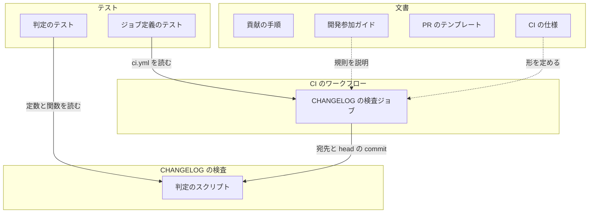
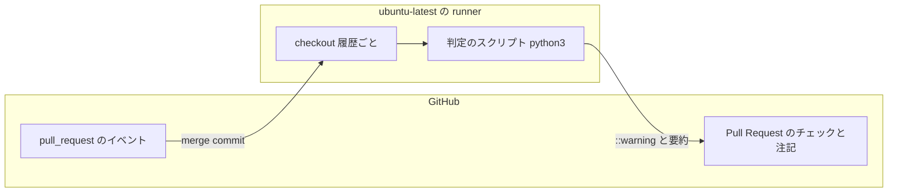
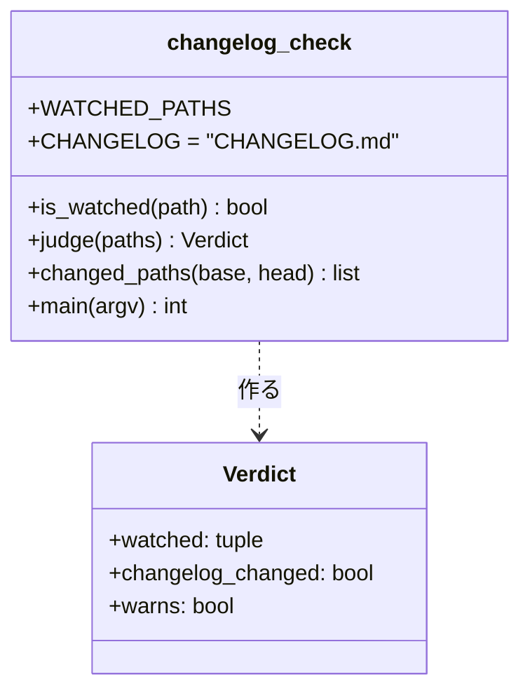
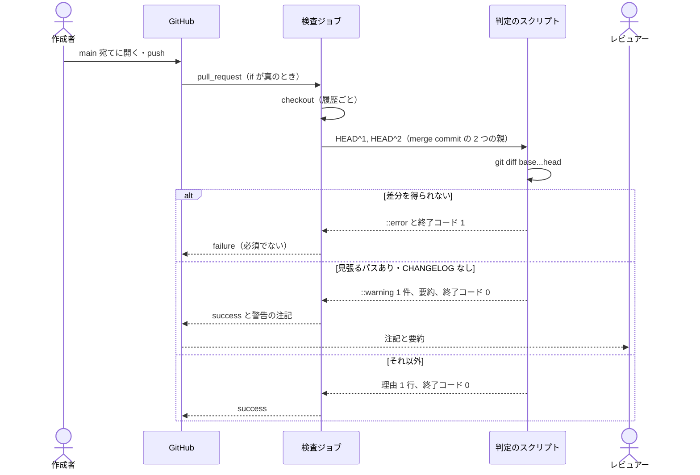

# #335: CHANGELOG の検査と、CHANGELOG を書く規則

要求と受け入れ条件は #335 の本文にある（コピーは [issue-335-requirements.md](issue-335-requirements.md)）。
この文書は「どう作るか」だけを扱う。

## ドメインモデル

### コンテキスト

| コンテキスト | 何の語が 1 つの意味に決まるか |
| --- | --- |
| 継続的インテグレーション（`ci`） | 検査ジョブ・トリガー・統合ブランチ・積み重ねた Pull Request に加え、この変更で見張るパス・CHANGELOG の検査・未記入の警告 |

変更は `ci` の 1 つに収まる。`CHANGELOG.md` の中身（節の分け方・文）は検査の外にあり、検査は
`CHANGELOG.md` というパスが差分にあるかだけを読む（前提 4）。貢献の手順の文書
（`CONTRIBUTING.md`・`docs/developer/contributing.md`・Pull Request のテンプレート）は、規則を人へ伝える
文書で、集約を持たない。

隣り合う外部の系との関係:

- **GitHub Actions（外部の系）には順応者として接する。** `pull_request` のイベントの値
  （`github.base_ref`）と、`actions/checkout` が `pull_request` で取り出す merge commit
  （`refs/pull/<番号>/merge`）の形と、ワークフローのコマンド（`::warning`・`::error`）と
  `$GITHUB_STEP_SUMMARY` の形をそのまま受け入れる
- **main の保護設定には触れない。** CHANGELOG の検査は必須チェックに加えない（前提 6）

### 集約

| 集約 | 持ち主（書き換えてよいもの） | 根 | エンティティ | 値オブジェクト |
| --- | --- | --- | --- | --- |
| CI のワークフロー | `.github/workflows/ci.yml` | ワークフロー（`name: CI`） | 検査ジョブ（`changelog` を足す） | トリガー・ジョブの起動条件（`if`）・ジョブの権限 |
| CHANGELOG の検査 | `.github/scripts/changelog_check.py`（判定のスクリプト） | 判定 | — | 見張るパス（定義）・変えたパスの一覧・判定の結果 |

- **見張るパスの定義を持つのは CHANGELOG の検査の集約だけである。** CI のワークフローは判定のスクリプトを
  呼ぶだけで、パスの絞り込み（`paths:`）を持たない（AC11）
- **CI のワークフローが持つのは、いつ判定を走らせるか（起動条件）と、判定へ何を渡すか（2 つの commit）である。**
  何を警告するかは判定のスクリプトが決める
- `tests/ci/` はどの集約にも属さない。集約の状態を読んで固定するだけで、書き換えない

### 不変条件

| # | 集約 | 条件 | 破れたときの扱い |
| --- | --- | --- | --- |
| I1 | CHANGELOG の検査 | 未記入の警告が出るのは、変えたパスの一覧に見張るパスが 1 つ以上あり、`CHANGELOG.md` が無いときに限る | 判定のテストが落ちる |
| I2 | CHANGELOG の検査 | 1 回の判定で出す未記入の警告は高々 1 件で、警告の文は `CHANGELOG.md` の `[Unreleased]` の更新を求め、変えた見張るパスのファイルを示す | 判定のテストが落ちる |
| I3 | CHANGELOG の検査 | 差分を得られたとき、判定の結果によらず終了コードは 0（警告は失敗にしない） | 判定のテストが落ちる |
| I4 | CHANGELOG の検査 | 差分を得られないときは終了コードが 0 でなく、理由を `::error::` で出す（黙って警告なしで通さない） | 判定のテストが落ちる |
| I5 | CHANGELOG の検査 | 見張るパスの定義は判定のスクリプトの定数 1 か所にあり、テストもその定数を読む | ジョブ定義のテストが `paths:` の存在で落ちる。定数の重複はレビューで見る |
| I6 | CI のワークフロー | `changelog` ジョブは `pull_request` のイベントで宛先が `main` のときだけ走る | ジョブ定義のテストが落ちる |
| I7 | CI のワークフロー | `changelog` ジョブの権限は `contents: read` だけで、ワークフローは `pull_request_target` を持たない。失敗を隠す `continue-on-error` を持たない | ジョブ定義のテストが落ちる |
| I8 | CI のワークフロー | 既存の 4 ジョブの ID・`name` と、トリガー（`push` の 3 系統・絞り込みの無い `pull_request`）が変わらない | ジョブ定義のテストが落ちる |

### ドメインイベント

| # | イベント | 発生元 | 受け手 |
| --- | --- | --- | --- |
| E1 | 作成者が main 宛ての Pull Request を開いた、または head へ push した | 作成者（GitHub が `pull_request` の opened / synchronize / reopened を発行する） | CI のワークフローの `changelog` ジョブの起動条件 |
| E2 | CHANGELOG の検査が Pull Request の差分のパスを集めた | 判定のスクリプト（`git diff`） | 判定のスクリプトの判定。集められなければジョブの失敗としてレビュアー |
| E3 | CHANGELOG の検査が未記入の警告を出した | 判定のスクリプト | 作成者とレビュアー（チェックの注記とジョブの要約） |
| E4 | 作成者が `CHANGELOG.md` の `[Unreleased]` を書き足して push した | 作成者 | E1 に戻る。新しい実行では警告が出ない |
| E5 | レビュアーが警告を見て、利用者に見えない変更と判断してマージした | レビュアー | main（配布）。検査は何も記録しない |

### 用語

| 用語 | 意味 | 用語集への反映 |
| --- | --- | --- |
| 検査ジョブ | ci.yml の jobs の 1 つ（Python syntax check・Ruff lint・ShellCheck・Pytest・CHANGELOG check） | 意味の変更（`ci`。CHANGELOG check を足す） |
| 利用者に見える変更 | devbase を使う人がコマンド・イメージ・設定を通じて気づく振る舞いの変化 | 追加済み（要求の段階） |
| 見張るパス | CHANGELOG の検査が利用者に見える変更の手がかりとして見る場所 | 追加済み（要求の段階） |
| CHANGELOG の検査 | main 宛ての Pull Request で、見張るパスを変えて CHANGELOG.md を変えていないときに未記入の警告を出す検査ジョブ | 追加済み（要求の段階） |
| 未記入の警告 | CHANGELOG の検査が出す GitHub Actions の警告の注記 | 追加済み（要求の段階） |

## 機能一覧

| # | 機能 | 誰が使うか |
| --- | --- | --- |
| F1 | main 宛ての Pull Request で、CHANGELOG の書き漏れを未記入の警告として見る | Pull Request の作成者とレビュアー |
| F2 | 利用者に見える変更で CHANGELOG を更新する規則と、要らない変更の例を読む | 貢献者（人とエージェント） |
| F3 | Pull Request のテンプレートのチェック項目で、CHANGELOG の更新を確かめる | Pull Request の作成者 |
| F4 | 見張るパスを 1 か所で変える | 保守者 |

## 構成要素

| 要素 | 新設 / 変更 | 責務 |
| --- | --- | --- |
| 判定のスクリプト（`.github/scripts/changelog_check.py`） | 新設 | 見張るパスの定義を持つ。2 つの commit から変えたパスの一覧を集め、未記入の警告の有無を判定し、注記と要約を書く。差分を得られなければ失敗する |
| CHANGELOG の検査ジョブ（`ci.yml` の `jobs.changelog`） | 新設 | main 宛ての `pull_request` でだけ起動し、履歴ごと checkout して判定のスクリプトへ宛先と head の commit を渡す |
| 判定のテスト（`tests/ci/test_changelog_check.py`） | 新設 | パスの一覧を与えて判定を縛る。一時の git リポジトリでスクリプトを起動し、出力と終了コードを縛る |
| ジョブ定義のテスト（`tests/ci/test_changelog_job.py`） | 新設 | `ci.yml` を読み、`changelog` ジョブの起動条件・権限・手順と、既存のジョブとトリガーの不変を縛る |
| 貢献の手順（`CONTRIBUTING.md` の「Pull Request」） | 変更 | 利用者に見える変更は同じ Pull Request で `[Unreleased]` を更新する規則を 1 項目足す |
| 開発参加ガイド（`docs/developer/contributing.md`） | 変更 | 「PR プロセス」に小節「CHANGELOG の更新」を足す（規則・要らない例・統合ブランチ・警告は失敗にしない）。「CI が実行するもの」に CHANGELOG の検査を 1 文足す |
| Pull Request のテンプレート（`.github/pull_request_template.md`） | 変更 | 「動作確認」にチェック項目を 1 つ足す |
| CI の仕様（`docs/specifications/ci-checks.md`） | 変更 | 下の「検査ジョブの集合を前提にした規則」を直し、節「CHANGELOG の検査」を足す |
| 用語集（`docs/glossary/glossary.json` → `docs/glossary.md`） | 変更 | 「検査ジョブ」の意味に CHANGELOG check を足す（この設計の変更で行う）。4 つの語の正本を実装で `docs/specifications/ci-checks.md` にする |

### 検査ジョブの集合を前提にした規則

検査ジョブの集合へ `changelog` を足すため、既存の値だけを想定した規則を集めて当てはめた。当てはまらない
ものだけを挙げる。

| 場所 | 今の規則 | 直し方 |
| --- | --- | --- |
| `ci-checks.md` の概要 | 「4 種の検査ジョブ」 | 5 種にし、CHANGELOG の検査を 3 つ目の定めとして足す |
| `ci-checks.md` の「検査ジョブ」 | 表が 4 行、「1 回の起動で走るチェックは 7 件」 | 表へ `changelog` を足す。チェックは 8 件（`CHANGELOG check` は main 宛て以外では skipped として並ぶ） |
| `ci-checks.md` の「常に成り立つ条件」 | 「チェックの名前は上の 7 件のまま」「トリガーの形は止める pytest が無い」 | 8 件にする。トリガーと名前はジョブ定義のテストが止めるように書き換える |
| `ci-checks.md` の「ドメインイベント」E1・E2 | 「7 件の検査ジョブ」が走る | E1 は main 宛てで 8 件・それ以外は 7 件と skipped 1 件、E2 は 7 件と skipped 1 件 |
| `ci-checks.md` の「pytest で確かめないもの」 | トリガーと名前は pytest で見ない | ジョブ定義のテストが見る範囲を除く |
| `ci-checks.md` の「運用」 | 必須チェックは 5 件 | 変えない。CHANGELOG check を必須に加えないことを 1 文足す |
| `contributing.md` の「CI が実行するもの」 | 4 種の検査を並べる | CHANGELOG の検査を足す |
| 用語集の「検査ジョブ」 | 4 つのジョブを並べる | CHANGELOG check を足す |

当てはまった規則: `pull_request` のトリガーが `branches` を持たない規則（絞り込みはジョブの `if` で行い、
トリガーは変えない。決定 3）と、`push` の 3 系統の規則（`changelog` は `push` で skipped になる）。

### 構成要素図



### 配置



runner へ渡るのは読み取りの権限（`contents: read`）の token と 2 つの commit だけで、書き込みは
ワークフローのコマンドとジョブの要約のファイルに限る。

### 置き場所

```text
.github/
├── scripts/
│   └── changelog_check.py        新設（判定のスクリプト）
├── workflows/ci.yml              変更（jobs.changelog を足す）
└── pull_request_template.md      変更
tests/ci/
├── test_changelog_check.py       新設
└── test_changelog_job.py         新設
CONTRIBUTING.md                   変更
docs/developer/contributing.md    変更
docs/specifications/ci-checks.md  変更
docs/glossary/glossary.json       変更（→ docs/glossary.md を render）
```

## 構造

判定のスクリプト（`changelog_check`）は 1 つのモジュールで、型は判定の結果（`Verdict`）の 1 つだけを持つ。



| 型・関数 | 責務 |
| --- | --- |
| `WATCHED_PATHS` | 見張るパスの定義。`("lib/", "bin/", "containers/", "etc/", "install.sh")`。`/` で終わる値はその下のすべて、終わらない値はそのパスちょうど |
| `is_watched(path)` | リポジトリの根からのパスが見張るパスに当たるか。`libx/a`・`docs/lib/a`・`install.sh.bak` は当たらない |
| `judge(paths)` | 純粋な判定。出力も終了コードも持たない。`watched` は当たったパスを入力の順で、`changelog_changed` は根の `CHANGELOG.md` があるか（`docs/CHANGELOG.md` は数えない）、`warns` は `watched` が空でなく `changelog_changed` が偽 |
| `changed_paths(base, head)` | `git diff --name-only --no-renames <base>...<head>` の出力を行に割る。git が非 0 なら例外を投げる |
| `main(argv)` | 入出力と終了コードを持つ唯一の関数。下の「入出力の契約」 |

## 入出力の契約

判定のスクリプトは CI のワークフローから呼ばれるコマンドである。

| 項目 | 内容 |
| --- | --- |
| 名前 | `python3 .github/scripts/changelog_check.py <base> <head>` |
| 入力 | `<base>`: 宛先ブランチの先端の commit（checkout した merge commit の 1 つ目の親 `HEAD^1`）。`<head>`: Pull Request の head の commit（2 つ目の親 `HEAD^2`）。どちらも必須。空文字は受けない。カレントディレクトリはリポジトリの根。環境変数 `GITHUB_STEP_SUMMARY` は任意 |
| 出力（警告なし） | 標準出力に判定の理由を 1 行（`CHANGELOG.md を変えている` か `見張るパスを変えていない`）。要約のファイルがあれば同じ理由を追記する。終了コード 0 |
| 出力（未記入の警告） | 標準出力に `::warning title=CHANGELOG の未記入::` で始まる行をちょうど 1 行。本文は `CHANGELOG.md の [Unreleased] を更新してください。見張るパスの変更: <パス>, <パス>, ...`。パスは入力の順に 20 件まで並べ、超えた分は `ほか N 件` とする。要約のファイルがあれば見出しと、変えた見張るパスの全件の箇条書きを追記する。終了コード 0 |
| 失敗の形 | 引数が 2 つでない・どちらかが空 → 標準出力に `::error title=CHANGELOG の検査::` と理由、終了コード 2。`git diff` が非 0（commit が無い・merge base が無い） → `::error title=CHANGELOG の検査::差分を得られない: <git の標準エラーの最初の行>`、終了コード 1 |
| 注記の文字 | 本文のパスに含まれる `%`・`\r`・`\n` は `%25`・`%0D`・`%0A` に置き換える（ワークフローのコマンドの規則） |
| 互換性 | 新設のため既存の呼び出し側は無い |

`CHANGELOG check` のジョブは次の形にする（手順の細部は実装で決める）。

| 項目 | 値 |
| --- | --- |
| ジョブ ID / `name` | `changelog` / `CHANGELOG check` |
| `if` | `github.event_name == 'pull_request' && github.base_ref == 'main'` |
| `permissions` | `contents: read`（ジョブの単位。ワークフローの単位には置かない） |
| `timeout-minutes` | 5 |
| 手順 | `actions/checkout@v4`（`fetch-depth: 0`。`ref` を指定せず、`pull_request` の既定の merge commit を取り出す） → 判定のスクリプト（引数は `HEAD^1` と `HEAD^2`。イベントの値を `run` の中へ式で埋めない） |
| 持たないもの | `continue-on-error`・`paths` / `paths-ignore`・`setup-python`・Docker |

## 処理の流れ



`push` のイベントと main 以外を宛先にした Pull Request では、`if` が偽になりジョブは skipped になる。
判定のスクリプトは起動しない。

構成要素のうち文書（貢献の手順・開発参加ガイド・Pull Request のテンプレート・CI の仕様・用語集）と
2 つのテストは、この流れに現れない。文書は人が読み、テストは Pytest のジョブの中で `ci.yml` と判定の
スクリプトを読むだけである。

## 非機能の実現方式

| 大項目 | 要求の条件 | 実現方式 | 確かめ方 |
| --- | --- | --- | --- |
| 運用・保守性 | 見張るパスを変えるときに直す場所は 1 か所（AC11） | 判定のスクリプトの `WATCHED_PATHS` だけに置き、テストは同じ定数を import して読む。ジョブは `paths:` を持たない | ジョブ定義のテストが `paths` の不在を見る。判定のテストが定数の 5 つを縛る |
| セキュリティ | `pull_request` のイベントで動かし、`pull_request_target` を使わない。ジョブの権限は `contents: read` を超えない | ジョブの `if` と `permissions` をジョブの単位で置く。commit は `env` で渡す | ジョブ定義のテストが `on` のキー・`permissions` の値・`if` を見る |
| 性能・拡張性 | Docker もビルドも使わず、既存の検査ジョブより先に終わる | runner の `python3` で標準ライブラリだけを使う。checkout の後は git の 1 回と判定だけ | ジョブ定義のテストが `setup-python` と Docker の不在を見る。実装の Pull Request で `gh pr checks` の所要時間を見る |

## 決定の記録

### 決定 1: 判定を Python のスクリプトに置き、ジョブはそれを呼ぶだけにする

判定を `ci.yml` の外に出すと、GitHub へ繋がずに pytest で判定を縛れ（AC10）、見張るパスの定義を
テストとジョブが同じ定数で共有できる（AC11）。Python にしたのは、シェルにすると ShellCheck の検査ジョブの
対象へ足す必要があり、既存の検査ジョブを変えない条件（AC12）に触れるためである。

`ci.yml` の `run` にシェルで書く形は、判定をテストから呼べない。`dorny/paths-filter` や
`tj-actions/changed-files` のような外部の action は、見張るパスの定義を `ci.yml` 側へ置くことになり
テストと共有できず、第三者の action へ Pull Request の内容を渡すことにもなるため採らない。

### 決定 2: 判定のスクリプトを `.github/scripts/` に置く

`lib/` と `bin/` は利用者へ配る物で、CI の処理を混ぜない（要求の「前提とする取り決め」）。`tests/` は
テストの置き場で、CI が本番として実行するものを置くと役割が混ざる。`.github/` は CI の定義の置き場で、
配布物にも含まれない。Ruff lint と Python syntax check の対象（`lib`・`bin`）には入らないが、判定のテストが
import するため構文の誤りは Pytest のジョブで落ちる。

### 決定 3: 宛先の絞り込みはジョブの `if` で行い、トリガーは変えない

`ci-checks.md` は「`pull_request` のトリガーは `branches` を持たない」を常に成り立つ条件としている。
トリガーで絞ると既存の 4 ジョブも main 宛てだけになり、AC12 を破る。ワークフローを別ファイルに分ける形は、
CI の定義が 2 本になり、`ci-checks.md` の「CI は 1 本」の前提を崩すため採らない。

### 決定 4: 差分は git の三点の `diff` で、checkout した merge commit の 2 つの親から取る

前提 4 は merge base から head までの差分を求める。`pull_request` のイベントで `actions/checkout` が取り出す
merge commit（`refs/pull/<番号>/merge`）は、1 つ目の親が宛先ブランチの先端、2 つ目の親が Pull Request の
head である。`git diff HEAD^1...HEAD^2` は今の宛先の先端と head の merge base から head までの差分で、
Pull Request の途中で main を取り込んでも、取り込んだ main の変更は数えない（取り込んだ main の commit は
宛先の先端から辿れるため、merge base がそこまで進む）。`--no-renames` を付け、
見張るパスの外へ移したファイルの元のパスも一覧に入れる。履歴ごと取る（`fetch-depth: 0`）のは、
merge base がどれだけ前でも届くためで、リポジトリは小さく（pack 約 7 MiB）費用は小さい。

GitHub の API（`pulls/{n}/files`）は `pull-requests: read` の権限と頁の送りが要り、3,000 件で打ち切られるため
採らない。イベントの `github.event.pull_request.base.sha` を三点の左に置く形は、`synchronize` のたびに
`base.sha` が宛先の先端へ更新されるという実測の無い前提に依る。`base.sha` が main の取り込みより前のまま
だと merge base が `base.sha` そのものになり、ほかの人が main に入れた変更まで数えて誤った警告を出すため
採らない。merge commit と 1 つ目の親との二点の差分（`HEAD^1..HEAD`）は、宛先の先端と head を合わせた
結果との差分で、宛先の先端にだけある変更の打ち消しも混ざり得るため、前提 4 の範囲をそのまま表す三点の
形を採る。

### 決定 5: runner の `python3` をそのまま使う

`setup-python` を入れると取得の時間が掛かり、既存のジョブより先に終わる条件（非機能）を危うくする。
判定のスクリプトは標準ライブラリだけで書き、書き方は Python 3.10 に合わせる（Pytest のジョブの下限）。

### 決定 6: 注記に並べるファイルは 20 件までにし、全件は要約に出す

注記は Pull Request のチェックの画面に 1 行で出るため、数百件を並べると読めない。要約には件数の上限が
無いため全件を並べ、注記の `ほか N 件` から要約へ辿れるようにする。

### 決定 7: 文書の文面（AC1〜AC3）を pytest で縛らない

文面のテストは言い回しを直すたびに落ち、規則が書いてあるかどうかは縛れない。文書の受け入れ条件は
実装の Pull Request のレビューで読んで確かめる。

## テスト設計

| 受け入れ条件・不変条件 | どの振る舞いで縛るか | どう壊したら落ちるべきか |
| --- | --- | --- |
| AC1・AC2・AC3 | 実装の Pull Request のレビューで、3 つの文書に規則と (a)(b)(c) とチェック項目があることを読む | —（決定 7） |
| AC4・I1・I2 | `judge` に見張るパスを含み `CHANGELOG.md` を含まない一覧を与えると `warns` が真で `watched` に当たったパスが並ぶ。スクリプトを起動すると `::warning` の行がちょうど 1 行で、`[Unreleased]` と当たったパスを含む | `warns` の条件から `changelog_changed` を落とす、警告を 2 行出す、パスを並べない |
| AC4（件数の上限） | 見張るパスを 21 件変えると、注記は 20 件と `ほか 1 件`、要約は 21 件を並べる | 上限を外す、要約も切る |
| AC5・I3 | 未記入の警告を出す起動の終了コードが 0 | 警告のときに 1 を返す |
| AC6 | 見張るパスと `CHANGELOG.md` を両方含む一覧では `warns` が偽で、`::warning` を出さない | `CHANGELOG.md` の判定をパスの末尾一致にする（`docs/CHANGELOG.md` でも通るように壊す）と、`docs/CHANGELOG.md` の組で落ちる |
| AC7 | `docs/` と `tests/` だけの一覧では `warns` が偽 | 見張るパスの判定を部分一致にする |
| AC8・I6 | ジョブの `if` が `pull_request` のイベントと宛先 `main` の両方を条件に持つ | `base_ref` の条件を消す、`push` でも走るようにする |
| AC9・I4 | 一時の git リポジトリで、無い commit を渡すと終了コード 1 と `::error` と理由が出る。引数が 1 つなら終了コード 2 | git の非 0 を握りつぶして空の一覧として判定する |
| AC10 | 見張るパスの 5 つそれぞれで、そのパスだけを変えた一覧が警告になる。`libx/a`・`docs/lib/a`・`install.sh.bak` は当たらない | 5 つのどれかを定義から消す、前方一致を `/` なしで行う |
| AC11・I5 | テストは `WATCHED_PATHS` を import して 5 つと一致することを見る。ジョブは `paths` / `paths-ignore` を持たない | ジョブに `paths` を足す、定数を 4 つにする |
| AC12・I8 | 既存の 4 ジョブの ID と `name`、`on` のキーが `push` と `pull_request` の 2 つ、`push.branches` が 3 系統、`pull_request` が絞り込みを持たない。全体の `uv run --locked pytest tests/ -q` が通る | 既存のジョブの `name` を変える、`pull_request` に `branches` を足す |
| AC13 | 実装の Pull Request のレビューで `ci-checks.md` の節「CHANGELOG の検査」を読む | —（決定 7） |
| I7 | `changelog` ジョブの `permissions` が `{contents: read}` ちょうどで、`continue-on-error` を持たず、`on` に `pull_request_target` が無い | 権限に `pull-requests: write` を足す、`continue-on-error: true` を足す |
| 非機能（性能） | `changelog` ジョブの手順が `setup-python` も `docker` も使わない | `setup-python` の手順を足す |

## 未確認のまま残ること

| 項目 | 内容 |
| --- | --- |
| checkout した HEAD が merge commit であるか | `pull_request` のイベントで `ref` を指定しない `actions/checkout` は `refs/pull/<番号>/merge` を取り出す見込み。merge commit でなければ `HEAD^2` が無く、判定は終了コード 1 で止まる（I4）。実装の Pull Request の上の実行で `git rev-list --parents -n 1 HEAD` が親を 2 つ持つことを確かめる |
| skipped のチェックの見え方 | main 以外を宛先にした Pull Request で `CHANGELOG check` が skipped として並ぶこと、`mergeStateStatus` を塞がないこと。統合ブランチ宛ての Pull Request が次に出たときに見る |
| runner の `python3` の版 | `ubuntu-latest` の既定の版（3.12 以上の見込み）。3.10 の書き方に留めるため、版が上がっても動く |
| 警告の注記の出る場所 | `file=` を付けないため、注記は Files changed の行ではなくチェックの画面と実行の要約に出る。実装の Pull Request で見る。警告の経路は判定のテストで担保する |
