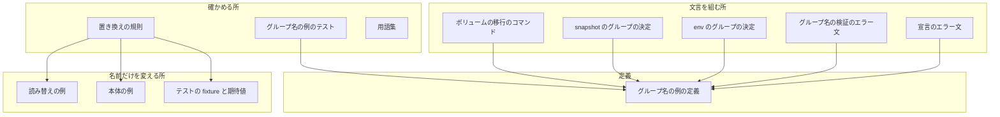
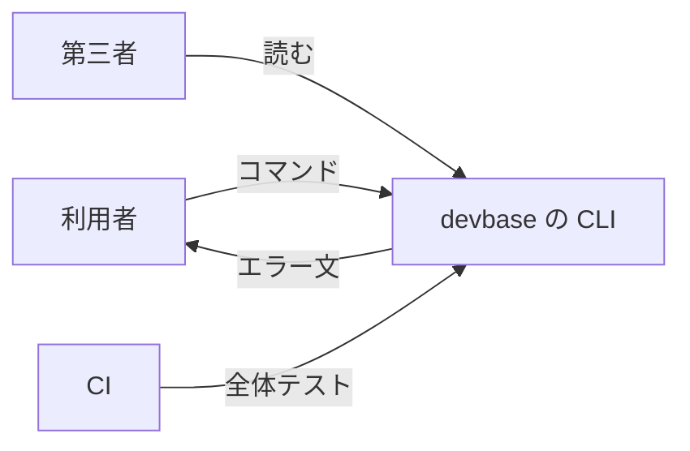
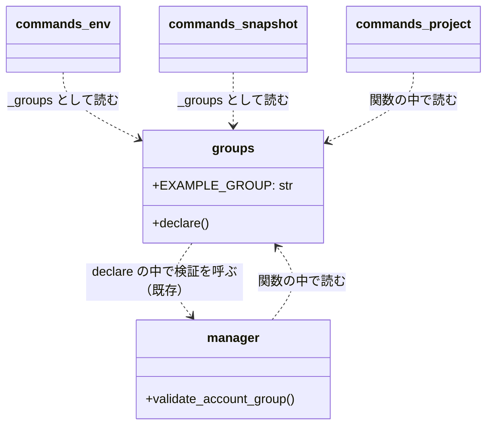
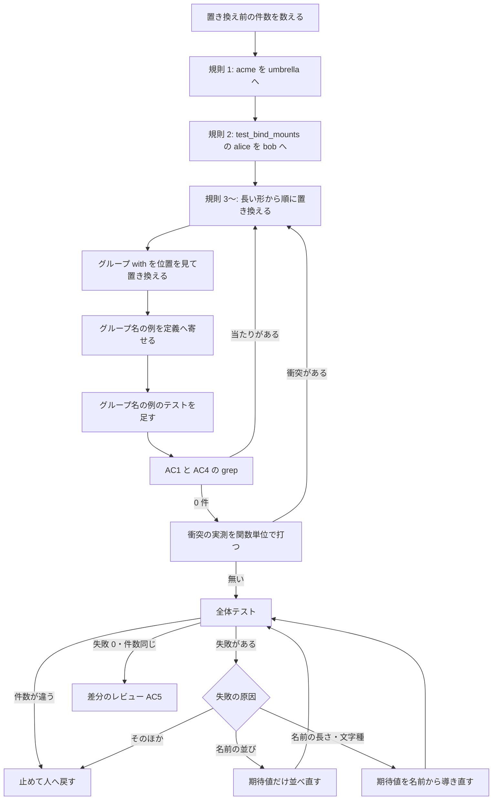

# #351: コードとテストの例の名前を置き換え、エラー文のグループ名の例を 1 か所に寄せる

要求と受け入れ条件は #351 の本文にある（コピーは [issue-351-requirements.md](issue-351-requirements.md)）。
この文書は「どう作るか」だけを扱う。置き換えの表の正は親課題 #294 の本文である。

## ドメインモデル

### コンテキスト

| コンテキスト | 何の語が 1 つの意味に決まるか |
| --- | --- |
| 機密の置き場（`secret`） | アカウントグループ・グループの宣言・置き場のグループ名（読み替え）に加え、この変更で足すグループ名の例 |

意味が変わるのは `secret` の 1 つだけである。ほかのコンテキスト（`cli`・`compose`・`editor`・`snapshot`・
`test` など）では、docstring・コメント・テストの fixture に出る**例の値**が変わるだけで、語の意味は変わらない。
例の値は語ではないため、用語集の対象にしない。

### 集約

| 集約 | 持ち主（書き換えてよいもの） | 根 | エンティティ | 値オブジェクト |
| --- | --- | --- | --- | --- |
| グループ名の例 | `lib/devbase/env/groups.py` | 定義（`EXAMPLE_GROUP`） | — | 例の名前（`acme`） |
| 読み替えの例 | 読み替えを説明する docstring・コメント（`commands/env.py`・`commands/env_rows.py`・`env/backend_config.py`・`env/secret_store.py`）と、読み替えを確かめるテスト | 読み替えの対（前 → 後） | — | 前の名前（`umbrella`）・後の名前（`acme`） |
| テストの例の名前 | `tests/` の各テスト関数 | テスト関数 | — | fixture と期待値に出る名前 |

- **グループ名の例を書き換えてよいのは `groups.py` だけである。** 文言を組む 4 か所（`volume/manager.py`・
  `commands/env.py`・`commands/snapshot.py`・`commands/project.py`）は定義を読むだけで、例の名前を持たない
- 置き換えの表（#294）はどの集約にも属さない。作業の規則であり、コードとテストに写さない（決定 4）

### 不変条件

| # | 集約 | 条件 | 破れたときの扱い |
| --- | --- | --- | --- |
| I1 | グループ名の例 | 5 か所の文言が出すグループ名の例は、定義の値に等しい（定義を別の値へ差し替えると 5 か所すべてがその値を出す） | グループ名の例のテストが落ちる |
| I2 | グループ名の例 | 5 か所の文言の中で、例のグループ名の文字列リテラルは `groups.py` の定義 1 か所にだけある | AC2 の grep で 2 か所以上が当たる |
| I3 | グループ名の例 | 定義の値はグループ名の検証（`validate_account_group`）を通る。予約語・数字だけ・使えない文字の名前にしない | グループ名の例のテストが落ちる |
| I4 | 読み替えの例 | 読み替えの前と後は別の名前である（`umbrella → acme`） | 読み替えのテストが落ちる（前と後が同じ名前だと読み替えの無い表示になる）。AC4 の grep でも当たる |
| I5 | テストの例の名前 | 1 つのテスト関数の中で別のもの（別の人・別のグループ・別のリポジトリ）を表していた名前は、置き換えた後も別の名前である | 関数単位の衝突の実測で当たる（既存のテストでは落ちない場合がある。テスト設計を参照） |

### ドメインイベント

| # | イベント | 発生元 | 受け手 |
| --- | --- | --- | --- |
| E1 | 読み替えの「前」の名前 `acme` が `umbrella` へ置き換わった | 開発者（置き換えの規則の 1 番目） | E2（`nyle` を `acme` へ置き換えてよい状態になる） |
| E2 | `lib/`・`bin/`・`tests/` の固有の語が置き換えの表の名前へ置き換わった | 開発者（置き換えの規則の 2 番目以降） | E4 の全体テスト。レビュアー（AC1 の grep） |
| E3 | グループ名の例の文言の定義が `groups.py` の 1 か所へ寄った | 開発者 | 文言を組む 4 か所（定義を読む）。グループ名の例のテスト |
| E4 | 全体テストが置き換えの前と同じ件数で通った | 開発者・CI | レビュアー（AC3） |
| E5 | #353 の検査が `main` で 0 件を確かめた | #353 の Pull Request | この課題の範囲外。#353 が受ける |

### 用語

| 用語 | 意味 | 用語集への反映 |
| --- | --- | --- |
| グループ名の例 | エラー文・使い方の文言がグループ名の書き方として示す名前。`groups.py` の定義 1 か所から出す | 追加（`secret`） |

## 機能一覧

| # | 機能 | 誰が使うか |
| --- | --- | --- |
| F1 | グループの宣言が無い・空のときのエラー文で、宣言の書き方の例を読む | devbase の利用者 |
| F2 | 予約語 `default` をグループ名に書いたときのエラー文で、移し先のグループ名の例を読む | devbase の利用者 |
| F3 | プロジェクトの外で `env` / `snapshot` を打ったときのエラー文で、`--group` の例を読む | devbase の利用者 |
| F4 | `project migrate-volume` を `--to` 無しで打ったときのエラー文で、`--to` の例を読む | devbase の利用者 |
| F5 | コード・コメント・テストの例を、固有の事情を知らずに読む | OSS として読む第三者・貢献者 |
| F6 | グループ名の例を 1 か所で変える | 保守者 |

## 構成要素

| 要素 | 責務 | 変更 |
| --- | --- | --- |
| グループ名の例の定義（`lib/devbase/env/groups.py`） | 例のグループ名を 1 つの定数として持つ | 定数 `EXAMPLE_GROUP = "acme"` を足す |
| 宣言のエラー文（`groups.declare`） | 宣言が無い・空のときに書き方を示す | `hint` の例を定義から組む |
| グループ名の検証のエラー文（`volume/manager.validate_account_group`） | 予約語 `default` を拒み、移し先の書き方を示す | 例を定義から組む。定義は関数の中で import する（決定 2） |
| env のグループの決定（`commands/env.py`） | プロジェクトの外で `--group` が要ることを示す | 例を `_groups.EXAMPLE_GROUP` から組む |
| snapshot のグループの決定（`commands/snapshot.py`） | 同上 | 例を `_groups.EXAMPLE_GROUP` から組む |
| ボリュームの移行のコマンド（`commands/project.py`） | `--to` が無いときに書き方を示す | 例を定義から組む。定義は関数の中で import する（決定 2） |
| 読み替えの例（docstring・コメント 4 か所） | 読み替えの表示の形を説明する | `acme → nyle` を `umbrella → acme` にする |
| 本体の例（`lib/` の docstring・コメント、`bin/devbase` のコメント） | コードの使い方を例で示す | 置き換えの規則で名前だけを変える |
| テストの fixture と期待値（`tests/`） | 振る舞いを固定する | 置き換えの規則で名前だけを変える。整列の結果が変わる期待値だけ並べ直す（前提 4） |
| グループ名の例のテスト（`tests/env/` に 1 ファイル） | I1・I3 を縛る | 新設 |
| 置き換えの規則（使い捨てのスクリプト） | 置き換えの表を順序どおりに当てる | 作業中だけ使う。コミットしない（決定 4） |
| 用語集（`docs/glossary/glossary.json` と `docs/glossary.md`） | 語の意味を 1 つに決める | 「グループ名の例」を足し、`render` で作り直す（この設計の変更で行う） |

### 値の集合を前提にした既存の規則

グループ名の集合へ `acme`・`globex`・`initech`・`umbrella` を足し、プロジェクト名・利用者名の集合へ
`myapp`・`alice`・`bob` を足す変更である。集合を前提にした既存の規則を集め、新しい値に当てはまるかを判定した。

| 規則 | 新しい値に当てはまるか | 扱い |
| --- | --- | --- |
| グループ名の検証（英数字始まり・予約語 `default` / `ubuntu`・数字だけを拒む） | 当てはまる。`acme` / `globex` / `initech` / `umbrella` はどれも通る | 変えない。I3 で定義の値だけを縛る |
| 読み替えの予約（読み替えた後が `global` / `projects` なら拒む） | 当てはまる。新しい名前はどれも予約に当たらない | 変えない |
| 例どうしの対応（`acme` を読み替えの「前」に使う） | **当てはまらない**。`nyle → acme` と重なり `acme → acme` になる | 規則の 1 番目で `acme` → `umbrella` を先に当てる（前提 2） |
| 1 つのテストの中で 2 人を表す名前（`~alice` と `/home/takemi`） | **当てはまらない**。`takemi → alice` で同じ名前になる | そのファイルだけ既存の `alice` → `bob` を先に当てる（前提 3） |
| 整列した結果を比べる期待値 | 当てはまらない場合がある（`['acme', 'team-c']` は `umbrella` で順が変わる） | 期待値だけ並べ直す（前提 4） |
| 同じ名前へ寄る元の組（`carmo` と `uttarov2` → `myapp` など） | 実測で関数単位の衝突が無い（下の「衝突の実測」） | 変えない |

#### 衝突の実測

置き換え先が同じになる元の組が、同じファイルに並ぶかを 2026-09-30（`main` = `c66b3af`）に数えた。

| 置き換え先 | 並ぶ元 | ファイル | 同じテスト関数に並ぶか |
| --- | --- | --- | --- |
| `acme` | `nyle` と既存の `acme` | `lib/` 4・`tests/` 6 | 並ぶ。規則の 1 番目で解く |
| `alice` | `takemi` と既存の `alice` | `tests/volume/test_bind_mounts.py` | 並ぶ。前提 3 で解く |
| `myapp` / `myapp-doc` | `carmo` / `carmo-doc` と `uttarov2` / `uttarov2-doc` | `tests/project/test_config.py`・`tests/project/test_migrate.py` | 並ばない |
| `example-org` | `volareinc` と `uttaro-dev2` | `tests/project/test_config.py` | 並ばない |
| `myapp-dev-1` | `nyle-dx-dev-1` と `carmo-dev-1` | 無し | — |

### 構成要素図



### システムの文脈



配置（どこで動くか）は変わらない。

### 置き場所

```text
lib/devbase/
├── env/groups.py              # 変更: EXAMPLE_GROUP を足す。hint を定義から組む
├── volume/manager.py          # 変更: 例を定義から組む
├── commands/
│   ├── env.py                 # 変更: 例を定義から組む。読み替えの例
│   ├── snapshot.py            # 変更: 例を定義から組む
│   ├── project.py             # 変更: 例を定義から組む。衝突 suffix の例
│   └── env_rows.py            # 変更: 読み替えの例
└── （ほか docstring・コメントの例だけを変えるファイル）
bin/devbase                    # 変更: コメントの例
tests/
├── env/test_group_example.py  # 新設（名前は tdd-cycle で決めてよい）
└── （fixture と期待値の名前だけを変えるファイル）
docs/glossary/glossary.json    # 変更: 語を足す
docs/glossary.md               # render で作り直す
```

## 構造

足す型は無い。足すのはモジュールの定数 1 つで、4 つのモジュールがそれを読む。



`groups` と `manager` は互いを関数の中でだけ import する。モジュールの読み込みの時点では、どちらも
相手を読まない（決定 2）。

## 入出力の契約

利用者に出る文言のうち、変わるのは例のグループ名だけである。語順・句読点・案内の内容は変えない（前提 6）。
`{例}` は `EXAMPLE_GROUP` の値（`acme`）が入る所である。

| # | 出す所 | 今の文言（例の部分） | 変えた後 | 出る経路 |
| --- | --- | --- | --- | --- |
| M1 | `groups.declare` | `DEVBASE_ACCOUNT_GROUP=<グループ> (nyle / personal など)` | `DEVBASE_ACCOUNT_GROUP=<グループ> ({例} / personal など)` | `GroupDeclarationError` の文（宣言が無い・空の 2 つ） |
| M2 | `volume/manager.validate_account_group` | `移し先のグループ名 (nyle / personal など) を書いてください。` | `移し先のグループ名 ({例} / personal など) を書いてください。` | `DevbaseError` の文（名前が `default`） |
| M3 | `commands/env.py` | `--group <名前> を付けてください (例: --group nyle)` | `--group <名前> を付けてください (例: --group {例})` | `GroupOptionError` の文（プロジェクトの外） |
| M4 | `commands/snapshot.py` | `--group <名前> を付けてください (例: --group nyle)` | `--group <名前> を付けてください (例: --group {例})` | `logger.error`（プロジェクトの外。終了コード `EXIT_USAGE` は変えない） |
| M5 | `commands/project.py` | `--to <グループ> で移し先のグループを指定してください (例: --to nyle)` | `--to <グループ> で移し先のグループを指定してください (例: --to {例})` | `logger.error`（`--to` が無い。戻り値 2 は変えない） |

例外の文は f 文字列で組み、`logger.error` の文は既存の呼び方に合わせて `%s` の引数で渡す。どちらも
**呼んだ時点の定義の値**を読む（モジュールの読み込みの時点で値を写さない）。I1 のテストが定義を差し替えて
確かめるためである。

## 処理の流れ

置き換えは順序に依存する。規則の 1 番目を後にすると、`acme → acme` と `umbrella → umbrella` が混ざる。



図に含めない要素は用語集である（この設計の変更で語を足し終える）。「規則 3〜」は下の表の 3〜15、
「グループ with」は規則 16 を指す。

「名前の長さ・文字種」は、`kkg`（3 文字）→ `globex`（6 文字）、`with`（4 文字）→ `initech`（7 文字）の
ように長さが変わる名前で、表示の幅や切り詰めを確かめる期待値が名前から導かれている場合を指す。期待値を
新しい名前から導き直すだけで、確かめる内容（幅の規則）は変えない。コードを直さないと通らない失敗は、
振る舞いが名前に依存していることになるため、止めて人へ戻す。

### 置き換えの規則

上から順に当てる。前の行が後の行の部分文字列を先に消さないよう、**長い形を先に置く**。大文字の形は
大文字のまま置き換える。

| 順 | 元 | 置き換え | 範囲・理由 |
| --- | --- | --- | --- |
| 1 | `acme` | `umbrella` | `lib/` と `tests/` のすべて（前提 2） |
| 2 | `alice` | `bob` | `tests/volume/test_bind_mounts.py` だけ（前提 3） |
| 3 | `KK-Generation` | `Globex` | リポジトリの owner（前提 1） |
| 4 | `takemi-ohama` | `alice` | GitHub の利用者名（前提 1）。`ohama` はこの形でだけ出る |
| 5 | `nyle-dx-dev-1` | `myapp-dev-1` | コンテナ名（#294 の表） |
| 6 | `with-ai-dev` | `myapp-ai-dev` | #294 の表 |
| 7 | `uttarov2-doc` | `myapp-doc` | 未決 1 を `myapp-doc` で確定（決定 6） |
| 8 | `uttarov2migration` / `uttarov2` / `uttaro-system` | `myapp-migration` / `myapp` / `myapp-system` | 顧客のリポジトリ名（決定 6） |
| 9 | `uttaro-dev2` / `uttaro_dev` | `example-org` / `example_dev` | 顧客の owner。同じテストで既定と上書きの 2 つを表すため別の名前にする（決定 6） |
| 10 | `volareinc` | `example-org` | owner（前提 1） |
| 11 | `devbase-ext` | `devbase-plugins` | #294 の表 |
| 12 | `nyle` / `NYLE` | `acme` / `ACME` | グループ（`nyle-api`・`nyle_series`・`G_NYLE_API` などの形を含む） |
| 13 | `kkg` / `KKG` | `globex` / `GLOBEX` | グループ（`kkg-sso`・`AKIAKKG`・`KKG_USER` などの形を含む） |
| 14 | `carmo` / `CARMO` | `myapp` / `MYAPP` | プロジェクト（`carmo-plugin` → `myapp-plugin`、`carmo.takemi--carmo` → `myapp.alice--myapp` は規則 14 と 15 の組で決まる） |
| 15 | `takemi` | `alice` | 利用者名・HOME（`/home/takemi` → `/home/alice`） |
| 16 | グループ `with` / `WITH` | `initech` / `INITECH` | 位置を見て置き換える（決定 5） |

規則 16 で置き換える位置は次のとおりである。AC1 の 2 つ目の式が拾う行（252 行）に加え、式が拾わない形を読む。

| 形 | 例 | 式が拾うか |
| --- | --- | --- |
| 引用符で囲んだ値 | `'with'`・`"with"`・`group='with'`・`group_name="with"` | 拾う |
| 宣言・対応の値 | `DEVBASE_ACCOUNT_GROUP=with`・`default=with`・`with=with-main` | 拾う |
| パス・ボリューム・ファイルの名前 | `team/with/`・`users/member01/with/`・`devbase_home_with`・`GCP_CREDENTIALS_BASE64__with`・`.env.sources.with.yml` | 拾う |
| 文言 | `グループ with` | 拾う |
| 名前の一部 | `with-team`・`with-me`・`with-main`・`with-value` | `with-value` だけ拾わない |
| YAML のキー | `sources: {with: {}}` | 同じ行の `.with.` で行は拾う。キーは読んで直す |
| 識別子 | `G_WITH`・`WITH_ONLY` | 拾わない。読んで直す |

GitHub Actions の `with:` を読むテスト（`checkout["with"]`・`step.get("with")`）はグループではないため変えない。

`lib/devbase/project/local_config.py:13` の `home: /home/takemi` は、#349 が先に直していれば触らない
（前提 7）。取り込んだ `main` で残っていれば規則 15 で直す。

## 決定の記録

### 決定 1: グループ名の例は `groups.py` の定数 1 つ（`EXAMPLE_GROUP = "acme"`）として持つ

5 か所の文言は 3 つの形（`{例} / personal など`・`--group {例}`・`--to {例}`）に分かれ、共通するのは
名前だけである。名前を定数にすれば、文言は今の場所に残り、変わるのは例の部分だけになる（前提 6）。
`utils/names.py` の `NAME_FORM_HINT` が、文言の部品をモジュールの定数として持ち呼ぶ側で組む既存の形である。

文言ごとの定数や、文言を返す関数は採らない。文言が呼ぶ側から定義の側へ移り、前提 6 の「文言の他の部分を
変えない」を超えた差分になる。関数は変える引数を持たず、定数と同じことしかしない。

根拠: Value 3（MVV 版 1）

### 決定 2: `volume/manager.py` と `commands/project.py` は定義を関数の中で import する

`groups.declare` は `manager.validate_account_group` を関数の中で import し、`manager` も
`GroupDeclarationError` を関数の中で import している（`volume/manager.py:111`）。同じ形に揃えると、
モジュールの読み込みの時点で `groups` と `manager` が互いを読む経路ができない。`commands/project.py` の
コマンドの関数も、必要なモジュールを関数の中で import している。

モジュールの先頭での import は採らない。今は読み込みの循環にならないが、`groups` が先頭で `manager` を
読むように変わった時点で循環する。

根拠: 根拠なし（MVV 版 1）

### 決定 3: `personal` は定義に含めず、文言に残す

`personal` は devbase が示すグループ名で、置き換えの対象外である（#294）。変える理由が無い名前を定義へ
移すと、前提 6 を超えた差分になる。` / personal など` の部分は M1・M2 の 2 か所に残る。

根拠: 根拠なし（MVV 版 1）

### 決定 4: 置き換えは使い捨てのスクリプトで当て、スクリプトと語の一覧をコミットしない

出現は `tests/` だけで 1422 件あり、規則の順序（規則 1 を先に当てる、長い形を先に当てる）を手で守るのは
難しい。スクリプトは作業の手元で使い、コミットしない。スクリプトは置き換える語の一覧を持つため、
コミットすると語が公開のファイルに入り、AC1 を自分で破る（#294 の前提 4 も語の一覧を公開のファイルに
書かないと決めている）。固有の語を検出する検査は #353 が持つ。

置き換えの規則はこの文書の表として残す。表の元の列は語そのものだが、この文書は `issues/` の作業中の文書で、
完了したら削除する（#294 の前提 1）。

根拠: Value 3（MVV 版 1）

### 決定 5: グループ `with` は位置を見て置き換え、全体の一括置換はしない

`with` は Python の予約語で英単語でもあり、GitHub Actions の `with:` を読むテストもある。一括で置換すると
コードの意味が変わる。AC1 の 2 つ目の式が拾う行を置き換え、式が拾わない形（識別子・`with-value`・YAML の
キー）は読んで直す。

根拠: 根拠なし（MVV 版 1）

### 決定 6: 顧客の名前は `myapp` 系と `example-org` 系に寄せ、同じテストで別のものは別の名前にする

未決 1 は `uttarov2-doc.workspace` → `myapp-doc.workspace` で確定する（#294 の表のとおり）。同じ系の
リポジトリ名（`uttarov2`・`uttarov2migration`・`uttaro-system`）も `myapp` 系に揃える。owner の 2 つ
（`uttaro-dev2` と `uttaro_dev`）は、`tests/project/test_config.py` の同じテストで既定の owner と repo ごとの
上書きを表すため、`example-org` と `example_dev` に分ける。`_` を残すのは、テストの入力の文字種を元のまま
にし、名前の置き換えの外の違いを持ち込まないためである。

`myapp` と `example-org` は `carmo`・`volareinc` の置き換え先と重なるが、関数単位で並ばないことを実測した
（「衝突の実測」）。`myapp2` のような別の系は採らない。#294 の表が `myapp` 系を指している。

根拠: Value 3（MVV 版 1）

### 決定 7: グループ名の例のテストは、定義を差し替えて 5 か所が従うことで縛る

AC2 の grep は「リテラルが 1 か所にある」ことしか示さず、呼ぶ側が別の値を出していても通る。定義を
別の値へ差し替えて 5 か所の文言がその値を出すことを確かめれば、呼ぶ側が定義を読んでいることを縛れる。

文言の全文を一致で比べるテストは採らない。例の外の文言を固定すると、この課題の範囲外の文言の変更でも落ちる。

根拠: 根拠なし（MVV 版 1）

## テスト設計

| 受け入れ条件・不変条件 | どの振る舞いで縛るか | どう壊したら落ちるべきか |
| --- | --- | --- |
| AC1 | 要求の 2 つの `git ls-files ... \| xargs grep` が 0 件。式が拾わない `with` の識別子は差分のレビューで読む | 規則のどれかを飛ばすと当たりが残る |
| AC2 | M1〜M5 の 5 つの経路で、文言に `acme` が出る。要求の `git grep -n "acme"` が出す行のうち、文言を組む行は `groups.py` の定義の 1 行だけである（`commands/env.py` の読み替えの docstring の `umbrella → acme` は文言ではないため数えない） | 呼ぶ側の文言に `acme` を書き写すと、文言の行が 2 つ以上になる |
| AC3 | `env -u DEVBASE_ROOT uv run --locked pytest tests/` が失敗 0。`--co -q` の件数が置き換えの前と同じ | テストの関数や parametrize の値を落とすと件数が減る |
| AC4 | 読み替えを確かめるテストが `umbrella → acme` の表示を確かめて通る。要求の grep が 0 件 | 規則 1 を後に当てると `acme → acme` になり、読み替えの表示が出ず落ちる |
| AC5 | 差分のレビューで、名前の置き換え・定義の集約・前提 4 の並べ直し・名前から導く期待値の導き直しの外の変更が無い | 引数の解釈や戻り値を変えると、レビューで当たる |
| I1 | 定義を別の値へ差し替えると、M1〜M5 の 5 つの文言がすべてその値を出す | 5 か所のどれかが定義を読まずに名前を持つと、その経路だけ差し替えた値が出ず落ちる。モジュールの読み込みの時点で値を写しても落ちる |
| I2 | AC2 の grep と同じ | AC2 と同じ |
| I3 | 定義の値をグループ名の検証へ渡すと、同じ値が返る | 定義を `default` や数字だけの名前にすると検証が拒み落ちる |
| I4 | AC4 と同じ | AC4 と同じ |
| I5 | 置き換えの後に、置き換え先が同じになる元の組が同じテスト関数に並ばないことを実測する（使い捨て。「衝突の実測」の表を作ったのと同じ数え方） | `test_bind_mounts.py` で規則 2 を飛ばすと、`~alice` と `/home/alice` が同じ人になる。このテストは落ちないため、実測でだけ当たる |

## 未確認のまま残ること

| 項目 | 内容 |
| --- | --- |
| 名前の長さに依存する期待値 | `globex`・`initech` は元より長い。表示の幅・切り詰めを確かめる期待値が名前から導かれているかは、全体テストを走らせて分かる。実装の段階で、処理の流れの図の分岐に従って扱う |
| 未決 2（`csc`・`investment`） | #294 の表に無い語で、この課題では置き換えない。利用者が表へ足すと決めたときに、#294 の本文と一緒に扱う |
| #349 との順序 | `local_config.py:13` をどちらが直すかは、取り込んだ `main` の状態で決まる（前提 7） |
| 件数の基準 | 置き換え前の件数 3793 は 2026-09-30 の値である。作業中に `main` を取り込んで件数が変わったら、取り込んだ後の置き換え前の件数を数え直して基準にする（AC3） |
| 用語集の検査 | `glossary.py check` は本課題と無関係な 6 件（`pending_source` が消えた文書を指す。#352 が直す）で止まり、語の突き合わせまで進まない。「グループ名の例」は手で突き合わせた |
