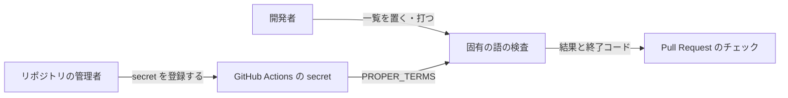
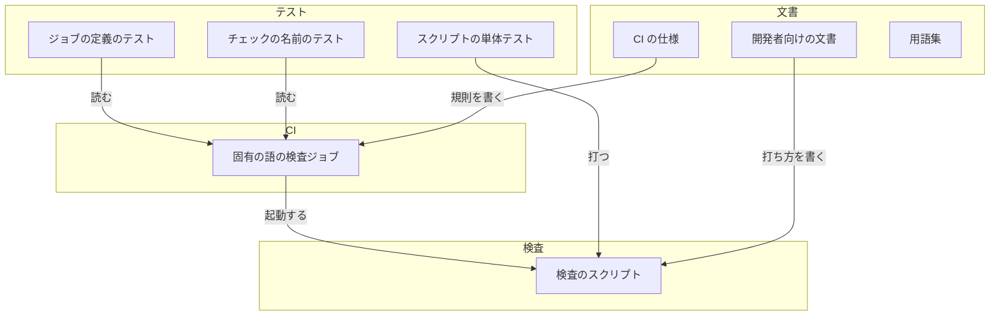
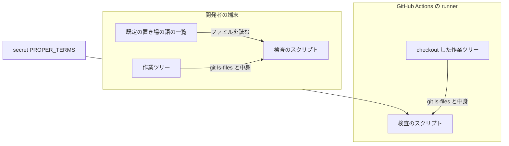
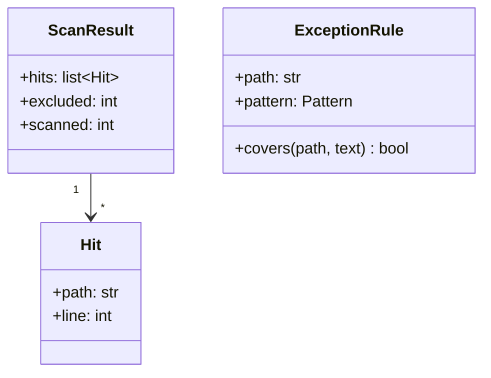
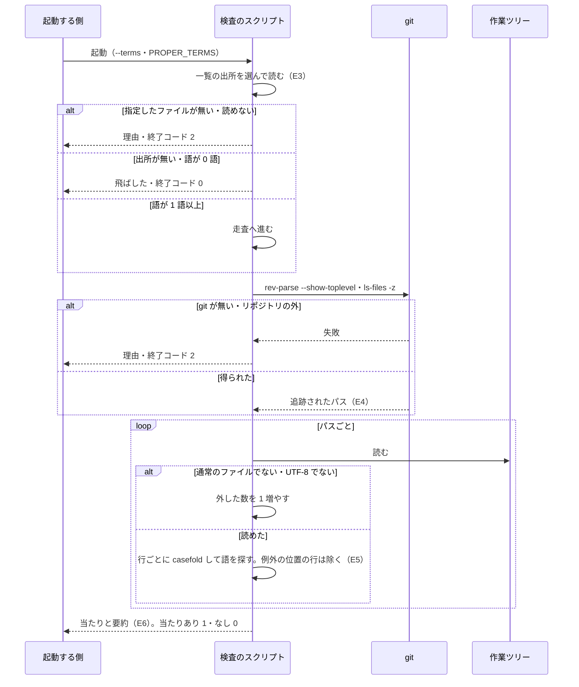

# #353: 固有の語を検出する検査（手元のスクリプトと CI のジョブ）

要求と受け入れ条件は #353 の本文にある（コピーは [issue-353-requirements.md](issue-353-requirements.md)）。
この文書は「どう作るか」だけを扱う。

## ドメインモデル

### コンテキスト

| コンテキスト | 何の語が 1 つの意味に決まるか |
| --- | --- |
| 継続的インテグレーション（`ci`） | 固有の語・語の一覧・固有の語の検査・当たり・例外の位置、検査ジョブと secret の渡し方 |

1 つのコンテキストで閉じる。外部の系との関係は 2 つある。

- **GitHub Actions の secret には順応者として接する。** フォークからの Pull Request へ secret を渡さない規則と、
  未登録の secret が空の文字列に展開される規則は変えられない。検査は「空なら一覧が無い」と読んで従う
- **GitHub の保護設定（必須チェック）には、この変更では触れない。** 登録するかは利用者が AC11 の後に決める

### 集約

| 集約 | 持ち主（書き換えてよいもの） | 根 | エンティティ | 値オブジェクト |
| --- | --- | --- | --- | --- |
| 固有の語の検査 | `.github/scripts/proper_term_check.py` | 検査の 1 回の実行 | 当たり（パスと行番号で識別する） | 語の一覧（読み込んだ語の組）・例外の位置・結果（当たりの並び・外したファイルの数・終了コード） |
| 固有の語の検査ジョブ | `.github/workflows/ci.yml` の `proper-terms` ジョブ | ジョブ | 手順（step） | secret の名前（`PROPER_TERMS`）・権限（`contents: read`） |

語の一覧の中身はどちらの集約も持たない。持ち主は人で、CI では secret、手元では追跡されない置き場に置く
（前提 4・前提 3）。検査は読むだけで、書き換えない。

例外の位置は検査の集約の中の定数で、パスと行の形（正規表現）の組である。形は語を含まない（前提 7）。

### 不変条件

| # | 集約 | 条件 | 破れたときの扱い |
| --- | --- | --- | --- |
| I1 | 固有の語の検査 | 出力（標準出力・標準エラー・注記・ジョブのサマリー）に出すのはパス・行番号・件数・理由の定型文だけで、語の一覧の語と当たった行の本文を出さない | 公開のログへ一覧が漏れる。テストが出力に語と本文が無いことを見て落とす |
| I2 | 固有の語の検査 | 一覧の出所が無い・空（空行と `#` の行だけを含む）なら、飛ばした旨を出して 0 で終わる | フォークの Pull Request が落ちる。テストが落とす |
| I3 | 固有の語の検査 | 当たりが 1 件以上なら 1、0 件なら 0 で終わる | 固有の語を含む Pull Request が通る。テストが落とす |
| I4 | 固有の語の検査 | 一覧を読めない（指定したファイルが無い・権限・UTF-8 でない）、または `git` が使えない・リポジトリの外なら、理由を出して 2 で終わる | 読めない一覧が「無い」と区別されず、検査が黙って飛ぶ。テストが落とす |
| I5 | 固有の語の検査 | 語は正規表現でなく文字列として、大文字小文字を区別せず（`str.casefold()`）部分一致で探す | 記号を含む語が別の文字列に当たる、または大文字の違いで漏れる。テストが落とす |
| I6 | 固有の語の検査 | 対象は `git ls-files` が返す追跡されたファイルだけで、追跡されていない・`.gitignore` 済みのファイルを読まない | 手元の作業ファイルで偽の当たりが出る。テストが落とす |
| I7 | 固有の語の検査 | 例外は例外の位置に一致する行だけに効き、同じファイルの別の行と、別のパスの同じ形の行には効かない | 例外がファイル全体へ広がり、語が見逃される。テストが落とす |
| I8 | 固有の語の検査 | 中身を UTF-8 の文字列として読めないファイル（バイナリ）と、通常のファイルでないもの（symlink・消えたファイル）は対象から外し、外した数だけを出す | 検査が例外で止まる、または外したことが見えない。テストが落とす |
| I9 | 固有の語の検査ジョブ | 権限は `contents: read` だけで、secret は検査の手順の `env` にだけ渡し、`run` の本文・`with`・artifact に出さない | secret がほかの手順や成果物へ流れる。定義を読むテストが落とす |
| I10 | 固有の語の検査ジョブ | ジョブは `ci.yml` のすべてのトリガー（宛先を問わない Pull Request と、`main`・統合ブランチへの push）で走る | 積み重ねた Pull Request や `main` で検査が走らない。定義を読むテストが落とす |

### ドメインイベント

| # | イベント | 発生元 | 受け手 |
| --- | --- | --- | --- |
| E1 | 人が語の一覧を secret に登録した | 人（C1） | 固有の語の検査ジョブ（`PROPER_TERMS` として受ける） |
| E2 | 開発者が手元で語の一覧を置いた | 開発者 | 固有の語の検査（既定の置き場か `--terms` から受ける） |
| E3 | 検査が語の一覧を読んだ | 固有の語の検査 | 固有の語の検査（E4 へ進むか、飛ばして終わる） |
| E4 | 検査が追跡されたファイルの一覧を得た | 固有の語の検査 | 固有の語の検査（走査） |
| E5 | 検査が語を含む行を見つけた | 固有の語の検査 | 固有の語の検査（当たりを溜める） |
| E6 | 検査が結果を出して終わった | 固有の語の検査 | 開発者（手元）・固有の語の検査ジョブ（CI） |
| E7 | CI のジョブが Pull Request を失敗にした | 固有の語の検査ジョブ | Pull Request の作成者とレビューの担当 |

### 用語

| 用語 | 意味 | 用語集への反映 |
| --- | --- | --- |
| 固有の語 | 作成者の所属組織・顧客・社内プロダクト・個人に固有の名前 | 追加済み（`ci`、要求の段階） |
| 語の一覧 | 固有の語の検査が探す固有の語を 1 行 1 語で並べた平文 | 追加済み（`ci`、要求の段階） |
| 固有の語の検査 | 語の一覧を読み、追跡されたファイルから固有の語を含む行を探すスクリプトと CI のジョブ | 追加済み（`ci`、要求の段階） |
| 当たり | 固有の語の検査が見つけた、語を含む行。パスと行番号の組で示し、行の本文と語を出さない | 追加（`ci`） |
| 例外の位置 | 固有の語の検査が当たりにしない行。パスと行の形の組で定め、語を含まない | 追加（`ci`） |

## 機能一覧

| # | 機能 | 誰が使うか |
| --- | --- | --- |
| F1 | 手元で、push の前に固有の語を検査する | 開発者 |
| F2 | Pull Request と push で固有の語を検査し、当たりがあれば検査を失敗にする | Pull Request の作成者とレビューの担当 |
| F3 | 一覧の置き場・コマンド・終了コードの意味を文書で調べる | 開発者 |

## 構成要素

| 要素 | 責務 | 新設 / 変更 |
| --- | --- | --- |
| 検査のスクリプト（`.github/scripts/proper_term_check.py`） | 一覧の出所を選んで読む。追跡されたファイルを得て走査する。例外の位置を除いて当たりを集め、パスと行番号と件数を出して終了コードを返す | 新設 |
| 固有の語の検査ジョブ（`ci.yml` の `proper-terms`、名前 `Proper term check`） | secret を環境変数 `PROPER_TERMS` に入れてスクリプトを起動する。終了コードをジョブの結果にする | 変更（ジョブを 1 つ足す） |
| スクリプトの単体テスト（`tests/ci/test_proper_term_check.py`） | 一時ディレクトリの git リポジトリと架空の語で、I1〜I8 を縛る | 新設 |
| ジョブの定義のテスト（`tests/ci/test_proper_term_job.py`） | `ci.yml` を読み、I9・I10 と、起動するスクリプトのパスを縛る | 新設 |
| チェックの名前のテスト（`tests/ci/test_ci_workflow.py`） | `EXPECTED_CHECK_NAMES` へ `Proper term check` を足し、docstring の件数（9 件）を 10 件へ直す | 変更 |
| 開発者向けの文書（`docs/developer/contributing.md`） | 「CI が実行するもの」へジョブを足し、手元で打つ節（置き場・コマンド・終了コード・secret の登録は人が行うこと）を置く | 変更 |
| CI の仕様（`docs/specifications/ci-checks.md`） | 概要の「5 種の検査ジョブ」を 6 種へ直し、固有の語の検査の集約と規則の節を足す | 変更 |
| 用語集（`docs/glossary/glossary.json` と `docs/glossary.md`） | 当たり・例外の位置の 2 語を `ci` に足す | 変更（設計 PR で行う） |

**検査ジョブの集合へ値を足すため、その集合を前提にした既存の規則を確かめた。** 当てはまらないのは、
上の表のチェックの名前のテスト・開発者向けの文書・CI の仕様の 3 つである。`tests/ci/test_changelog_check.py`
の `test_existing_jobs_still_present` は既存のジョブの名前だけを見るため、足しても当てはまる。
`.ndf/project.json` の `ci.workflows[].jobs`（5）は解析が書く値で、利用者の設定（C7）のため手で直さない。

### 文脈



外部の系は GitHub Actions の secret と、Pull Request のチェック（保護設定を含む）の 2 つである。

### 構成要素の関係



用語集は語を定義するだけで、ほかの要素と呼び出しの関係を持たない。

### 配置



runner の境界をまたぐのは secret の中身だけで、環境変数として検査の手順のプロセスにだけ届く。ファイルへは
書かない。

### 置き場所

```text
.github/
├── scripts/
│   └── proper_term_check.py        # 新設
└── workflows/
    └── ci.yml                      # proper-terms ジョブを足す
tests/ci/
├── test_proper_term_check.py       # 新設
├── test_proper_term_job.py         # 新設
└── test_ci_workflow.py             # チェックの名前を足す
docs/
├── developer/contributing.md       # 手元で打つ節
├── specifications/ci-checks.md     # 検査ジョブの数と規則
├── glossary/glossary.json          # 2 語
└── glossary.md                     # render で作り直す
```

## 構造

スクリプトは 1 ファイルで、型は次の 3 つだけを持つ。`main` が一覧の出所を選び、`load_terms` と
`tracked_files` と `scan` を順に呼ぶ。



| 関数 | 入力 | 出力 | 失敗 |
| --- | --- | --- | --- |
| `load_terms(text)` | 一覧の中身の文字列 | `casefold` 済みで重複を除いた語の組（空の組もありうる） | 無い（純粋な処理） |
| `terms_source(argv, env)` | `--terms` の値・`PROPER_TERMS`・`XDG_CONFIG_HOME`・`HOME` | 一覧の中身の文字列、または「無い」 | 指定したファイルが無い・読めない・UTF-8 でない: `TermsError` |
| `tracked_files(cwd)` | 作業ディレクトリ | リポジトリのトップと、追跡されたパスの並び | `git` が無い・リポジトリの外: `GitError` |
| `scan(root, paths, terms, rules)` | トップ・パス・語・例外の位置 | `ScanResult` | 無い（読めないファイルは `excluded` へ数える） |
| `main(argv)` | 引数 | 終了コード 0 / 1 / 2 | `TermsError`・`GitError` を受けて 2 を返す |

`EXCEPTION_RULES` はモジュールの定数で、`changelog_check.py` の `WATCHED_PATHS` と同じくここだけで定義する
（テストもここを読む）。

| パス | 行の形 | 意味 |
| --- | --- | --- |
| `LICENSE` | `^Copyright \(c\) \d{4} ` | MIT License の著作権表示の行 |
| `.ndf/mvv.json` | `^\s*"approved_by":\s*"` | NDF の承認の記録の `approved_by` の行 |

## 入出力の契約

### コマンド

| 項目 | 内容 |
| --- | --- |
| 名前 | `python3 .github/scripts/proper_term_check.py [--terms PATH]` |
| 対象 | 起動した作業ディレクトリが属する git リポジトリ（`git rev-parse --show-toplevel`）の追跡されたファイル |
| 入力 | 語の一覧。出所は次の順で最初に当たったもの 1 つだけを使う |
| 出力 | 下の「出力の形」 |
| 失敗の形 | 下の「終了コード」 |
| 互換性 | 新設のため既存の呼び出し側は無い。`devbase` のコマンドは増やさない |

一覧の出所の順:

| 順 | 出所 | 無いときの扱い |
| --- | --- | --- |
| 1 | `--terms PATH` のファイル | 指定したのに無い・読めない: 終了コード 2（I4） |
| 2 | 環境変数 `PROPER_TERMS` の中身（CI が secret から入れる） | 未設定か空の文字列: 次へ |
| 3 | 既定の置き場 `${XDG_CONFIG_HOME:-$HOME/.config}/devbase/proper-terms.txt` | 無い: 一覧が無い扱いで飛ばす（I2）。あるのに読めない: 終了コード 2 |

一覧の書式は前提 1 のとおりで、各行の前後の空白を除いてから、空の行と `#` で始まる行を読み飛ばす。
UTF-8（先頭の BOM は許す）で読む。

### 出力の形

| 場合 | 標準出力 | GitHub Actions の中（`GITHUB_ACTIONS=true`）で足すもの |
| --- | --- | --- |
| 当たりあり | 当たり 1 件を `<パス>:<行番号>` の 1 行で、パス・行番号の順に並べ、最後に要約の 1 行 | 当たりごとに `::error file=<パス>,line=<行番号>,title=固有の語::固有の語を含む行がある`。サマリーに件数とパスと行番号 |
| 当たりなし | 要約の 1 行 | サマリーに要約 |
| 飛ばした | `固有の語の検査: 語の一覧が無いため飛ばした` と、見た出所（`--terms` なし・`PROPER_TERMS` が空・既定の置き場のパス） | `::notice::` で同じ文。サマリーに同じ文 |
| 失敗 | 標準エラーへ `固有の語の検査: <理由の定型文>` | `::error::` で同じ文 |

要約の 1 行は `固有の語の検査: 当たり <N> 件（<M> ファイル）。語 <K> 語・対象 <F> ファイル・外したファイル <X> 件`
とする。語の数は一覧が読めたことを確かめる手がかりで、中身ではない。

**理由の定型文に、例外の文言（`UnicodeDecodeError` の本文など）をそのまま出さない。** 読めなかったバイトの値が
一覧の断片になりうるためである（I1）。パスは `%`・改行・`,`・`:` を GitHub のワークフローコマンドの規則で
エスケープしてから注記へ入れる。

### 終了コード

| コード | 意味 |
| --- | --- |
| 0 | 当たり 0 件、または一覧が無い・空で飛ばした |
| 1 | 当たりが 1 件以上ある |
| 2 | 一覧を読めない、`git` が使えない・リポジトリの外、引数の誤り |

### CI のジョブ

```yaml
  proper-terms:
    name: Proper term check
    runs-on: ubuntu-latest
    timeout-minutes: 5
    permissions:
      contents: read
    steps:
      - uses: actions/checkout@v4
        with:
          persist-credentials: false
      - name: Check proper terms
        env:
          PROPER_TERMS: ${{ secrets.PROPER_TERMS }}
        run: python3 .github/scripts/proper_term_check.py
```

`if:` を置かず、`ci.yml` のすべてのトリガーで走る（I10）。runner の `python3` で起動し、`setup-python` と
依存の導入を持たない（標準ライブラリだけで書く）。

## 処理の流れ



起動する側は、手元では開発者、CI では固有の語の検査ジョブである。ジョブはスクリプトの終了コードをそのまま
手順の結果にし、0 以外なら Pull Request のチェックが失敗になる（E7）。

図に含めない構成要素は、テスト 3 つ・開発者向けの文書・CI の仕様・用語集の 6 つである。検査の実行には
現れず、関係は「構成要素の関係」の図にある。

## 非機能の実現方式

| 大項目 | 要求の条件 | 実現方式 | 確かめ方 |
| --- | --- | --- | --- |
| セキュリティ | 語の一覧は secret と追跡されない置き場にだけ置き、ログ・成果物（artifact）・Pull Request のコメントに出さない。ジョブの権限は `contents: read` だけにする | 一覧は secret から検査の手順の環境変数へだけ渡し、ファイルへ書かない。出力はパス・行番号・件数・定型文に限る（I1）。ジョブは `permissions: contents: read` と `persist-credentials: false` を持ち、artifact とコメントの手順を持たない（I9） | 単体テストで出力に語と行の本文が無いことを見る。定義のテストで権限・`env`・手順を見る。AC9 の Run のログを目で見る |
| 性能・拡張性 | 追跡されたファイル全件（現状 約 460 件）の走査が CI のジョブで 1 分以内に終わる | 標準ライブラリだけで書き、依存の導入の手順を持たない。ファイルを 1 回ずつ読み、行ごとに語の組を部分一致で探す | `main` の Run のジョブの所要時間を見る。手元で `time` を付けて打つ |
| システム環境 | 手元は macOS と Linux のどちらでも打てる（Python 3.10 以上、`git` があること） | 3.10 の構文の範囲で書き、外部のコマンドは `git` だけを使う。パスは `git ls-files -z` で得て、引用や文字コードの変換を受けない | CI の pytest（3.10・3.13）と、手元の macOS で文書の手順を打つ |

## 決定の記録

### 決定 1: 検査のスクリプトを `.github/scripts/proper_term_check.py` に置き、`devbase` のコマンドにしない

CHANGELOG の検査と同じ置き場で、CI 専用の検査がどこにあるかが揃う。手元では `python3` で直に打てるため、
開発者に新しい入口を覚えさせずに済む。`devbase` のサブコマンドにする案は、利用者の公開インタフェースを増やし、
要求の「`devbase` のコマンドは増やさない」に反するため採らなかった。

根拠: Mission / Value 3（MVV 版 1）

### 決定 2: secret の名前は `PROPER_TERMS` とし、中身を環境変数で直にスクリプトへ渡す

一時ファイルへ書く手順を持たないため、runner に一覧が残る場所と、書き出す `run` の本文が生まれない。
リポジトリの secret にし、Environment の secret にはしない。Environment は承認の設定を伴い、Pull Request の
検査ごとに人の操作を待つことになるためである。secret の登録と更新は人が行い（C1）、この変更は値に触れない。

根拠: Value 3 / C1（MVV 版 1）

### 決定 3: 手元の既定の置き場を `${XDG_CONFIG_HOME:-$HOME/.config}/devbase/proper-terms.txt` にする

age の鍵（`~/.config/devbase/age/keys.txt`）と同じ置き方で、リポジトリの外にあるため、どの worktree から
打っても同じ一覧を読む。リポジトリの中の `.gitignore` 済みの場所に置く案は、worktree ごとに置き直す手間が
あり、`git add -f` で追跡へ入る経路が残るため採らなかった。検査は置き場を読むだけで作らない（C6）。

根拠: Value 2 / Value 3 / C6（MVV 版 1）

### 決定 4: 一覧の出所は `--terms`・`PROPER_TERMS`・既定の置き場の順に 1 つだけを使う

CI は環境変数、手元は既定の置き場という普段の使い方を、引数なしの同じコマンドで満たす。`--terms` は別の一覧で
試すときの上書きである。`--terms` で指定したファイルが無いときだけは飛ばさずに 2 で終わる。明示した一覧が
読めないまま成功で終わると、打ち間違いに気づけないためである。複数の出所を合わせる案は、手元と CI で
検査の語が変わる経路を作るため採らなかった。

根拠: Value 3（MVV 版 1）

### 決定 5: 例外の位置はスクリプトの定数に、パスと行の形（正規表現）の組で置く

形は `Copyright (c) <年> ` と `"approved_by": "` だけで語を含まないため、公開のファイルに置いてよい。
手元と CI で同じ例外が効き、テストが定数を読んで縛れる。例外を語の一覧と一緒に secret へ置く案は、手元の
一覧と CI の secret の両方で例外を揃える手間が生まれ、テストで縛れないため採らなかった。

根拠: Value 3（MVV 版 1）

### 決定 6: 走査は Python で行い、`git grep` を使わない

`git grep` は当たった行の本文を出す形しか持たず（`-l` と `-c` は行番号を失う）、本文を捨てる後処理が漏れると
そのまま I1 が破れる。大文字小文字を区別しない一致も ASCII の外では当てにならず、外したバイナリの数も
出せない。Python で行ごとに `casefold` して探せば、出力に載るものを検査の側で決められる。

根拠: Value 3（MVV 版 1）

### 決定 7: 追跡されたパスの中身は作業ツリーから読む

手元では push の前に、まだコミットしていない変更も含めて気づけることを優先する。CI の作業ツリーは checkout
した commit と同じため、結果は変わらない。index や `HEAD` の blob を読む案は、手元で直した後に打ち直しても
コミットするまで当たりが消えず、直したかを確かめにくいため採らなかった。

根拠: Mission（MVV 版 1）

### 決定 8: 終了コードを 0・1・2 に分ける

当たり（1）と、検査ができなかったこと（2）を分けると、CI のログを開かずに「語が入った」か「一覧か git の
問題」かを区別できる。CHANGELOG の検査は失敗を 1 だけで表すが、あちらは当たりを失敗にしないため区別が要らない。

根拠: 根拠なし（MVV 版 1）

### 決定 9: ジョブはすべてのトリガーで走らせ、Pull Request の宛先で絞らない

積み重ねた Pull Request で持ち込まれた語も、`main` へ入る前に見つけられる。`main` への push でも走るため、
AC11 の CI 側の確認が `main` の Run で済む。CHANGELOG の検査のように `main` 宛てだけに絞る案は、統合ブランチへ
語が溜まるのを見逃すため採らなかった。

根拠: Value 3（MVV 版 1）

## テスト設計

| 受け入れ条件・不変条件 | どの振る舞いで縛るか | どう壊したら落ちるべきか |
| --- | --- | --- |
| AC1・I3 | 追跡されたファイルに架空の語を含む行があるリポジトリで打つと、`<パス>:<行番号>` が出て 1 で終わる | 当たりがあっても 0 を返すように壊す。行番号を 1 ずらす |
| AC2・I3 | 語をどれも含まないリポジトリで打つと、当たり 0 件の要約が出て 0 で終わる | 当たりが無いのに 1 を返すように壊す |
| AC3・I5 | 一覧が小文字で、ファイルの語が大文字小文字の混ざった形でも当たる。`.` を含む語が、`.` の位置に別の文字がある行に当たらない | 比較の前の `casefold` を外す。語を正規表現として探す |
| AC4・AC10・I2 | 出所が無いとき・`PROPER_TERMS` が空の文字列のとき・一覧が空行と `#` の行だけのときに、飛ばした旨が出て 0 で終わる | 空の一覧で走査へ進む（当たり 0 件の要約が出る）ように壊す。飛ばしたのに 1 か 2 を返す |
| AC5・I6 | 追跡されていないファイルと `.gitignore` 済みのファイルにだけ語があるとき、当たり 0 件で終わる | 対象を `git ls-files` でなくディレクトリの走査で得る |
| AC6・I7 | `LICENSE` の著作権表示の行と `.ndf/mvv.json` の `approved_by` の行の語は当たらない。同じファイルの別の行と、別のパス（例 `docs/LICENSE`）の同じ形の行は当たる | 例外をパスだけで判定する。例外の行の形をパスと関係なく当てる |
| AC8・I1 | 当たりのある実行・当たりの無い実行・UTF-8 でない一覧で失敗する実行の、標準出力と標準エラーとサマリーのファイルに、一覧の語と当たった行の本文が現れない | 当たりの行に本文を足す。読めない理由に例外の文言をそのまま出す |
| I4 | `--terms` で無いファイルを指したとき・一覧が UTF-8 でないとき・リポジトリの外で打ったときに、理由が出て 2 で終わる | 読めない一覧を「無い」と扱って 0 を返す。`git` の失敗を当たり 0 件として扱う |
| I8 | 追跡されたバイナリのファイルと symlink に語があっても当たらず、外したファイルの数が要約に出る | バイナリを読んで例外で止まる。外した数を数えない |
| 一覧の出所の順（決定 4） | `--terms` と `PROPER_TERMS` と既定の置き場に別々の語を置くと、`--terms` の語だけが当たる。`--terms` なしなら `PROPER_TERMS`、それも空なら既定の置き場の語が当たる | 出所の順を入れ替える。複数の出所の語を合わせる |
| I9 | `ci.yml` の `proper-terms` ジョブの権限が `contents: read` だけで、`PROPER_TERMS` は検査の手順の `env` にだけ `secrets.PROPER_TERMS` として現れ、`run` はスクリプトを起動するだけで、`if:` と artifact の手順を持たない | 権限を足す。secret を `run` の本文や別の手順へ書く。ジョブに `if:` を足す |
| I10 | ジョブのチェックの名前 `Proper term check` が `EXPECTED_CHECK_NAMES` に一致し、ジョブが `if:` を持たない | 名前を変える。宛先で絞る |
| AC7 | 実際の一覧を既定の置き場に置いて、実装の Pull Request の作業ツリーで打ち、当たり 0 件を確かめる | 単体テストにしない（一覧を公開のファイルに書けないため） |
| AC9 | 前提 8 の検証用の Draft の Pull Request で、ジョブが失敗し、ログに語と本文が無いことを見て Run の URL を記録する | 人の手で 1 度だけ確かめる |
| AC11 | ②〜④が入った `main` で、手元の実際の一覧と `main` の Run の両方で当たり 0 件を確かめる | 人の手で確かめる |
| AC12 | `contributing.md` の手順を、書かれたとおりに手元で打つ | 文書の手順を打てなければ落ちる |
| AC13 | `env -u DEVBASE_ROOT uv run --locked pytest tests/` が通る | 既存のテストが 1 件でも落ちる |

**単体テストは、スクリプトを起動する環境を自分で決め、手元と CI の環境を継承しない。** 手元に実際の一覧を
置いた端末（AC7・AC11）と、GitHub Actions の `Pytest` ジョブの両方で、同じ結果になるようにするためである
（AC13）。スクリプトはどの行も、環境を組み直したうえで別のプロセスとして起動する。

| 環境変数 | 既定（すべての行） | 変える行 |
| --- | --- | --- |
| `HOME`・`XDG_CONFIG_HOME` | テストごとの一時ディレクトリへ向ける。既定の置き場（決定 3）は、置いた行だけその下に作る | 無し。AC4・AC10・I2 の「出所が無い」と、決定 4 の出所の順の行も、この一時ディレクトリの下だけを見る |
| `PROPER_TERMS` | 消す | `PROPER_TERMS` の出所を試す行（AC4・AC10 の空の文字列、決定 4）だけ、架空の語か空の文字列を渡す |
| `GITHUB_ACTIONS` | 消す | `::error`・`::notice` の注記を見る行だけ `true` を渡す |
| `GITHUB_STEP_SUMMARY` | 消す | サマリーを見る行（AC8・I1 を含む）だけ、テストごとの一時ファイルのパスを渡し、そのファイルを読む |

これを守らないと、実際の一覧を既定の置き場に置いた端末では「出所が無い」の行が実際の一覧を読んで「当たり 0 件」に
なり、CI では runner の `GITHUB_ACTIONS=true` と本物のサマリーのファイルを継承して、標準出力の照合（AC1 の
`<パス>:<行番号>` など）が CI だけで変わり、架空の当たりが `Pytest` ジョブのサマリーへ書かれる。

## 未確認のまま残ること

| 項目 | 内容 |
| --- | --- |
| secret の登録の時期 | AC9 の前に人が登録する（C1）。登録するまでは、すべての Run が飛ばして成功で終わる |
| ジョブを必須チェックへ登録するか | 利用者が AC11 の後に決める。登録しないうちは、失敗してもマージを止めない |
| ファイル名とディレクトリ名に含まれる固有の語 | 要求は行の中身だけを対象にしており、パスそのものは検査しない。パスに語があると当たりの出力にパスが出るが、そのパスは Pull Request で既に公開されている。パスも対象にするかは利用者が決める |
| 同じリポジトリのブランチからの Pull Request がスクリプトを書き換えた場合 | secret はその Pull Request の手順へ渡るため、書き込みの権限を持つ人はスクリプトを変えて一覧を出せる。フォークからは渡らない。書き込みの権限を持つ人の範囲はリポジトリの設定の問題で、この変更では扱わない |
| 一覧に短すぎる語を入れたとき | 一般の語と重なる語は一覧に入れない（前提 2）。検査は語の長さを見ず、当たりが多すぎるときは一覧の側を直す |
