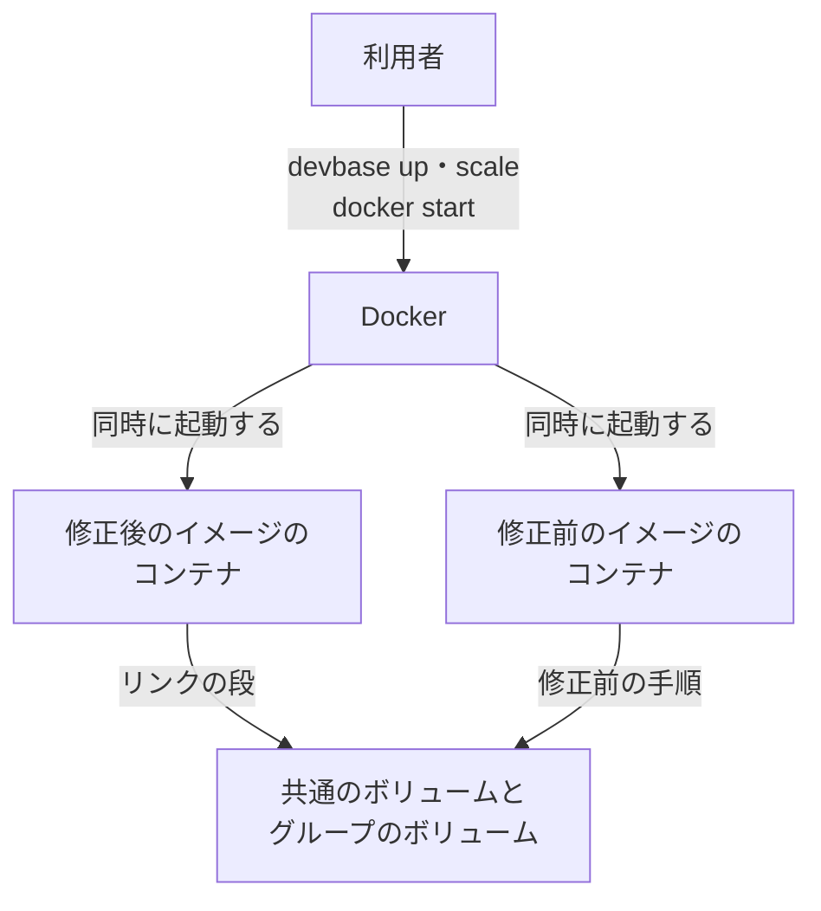
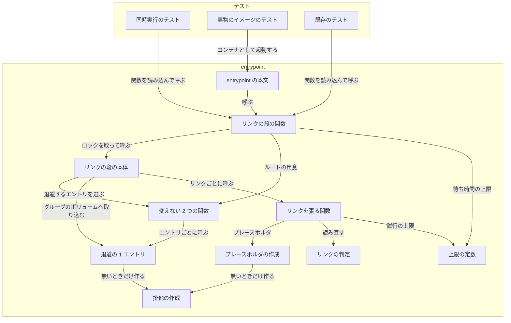
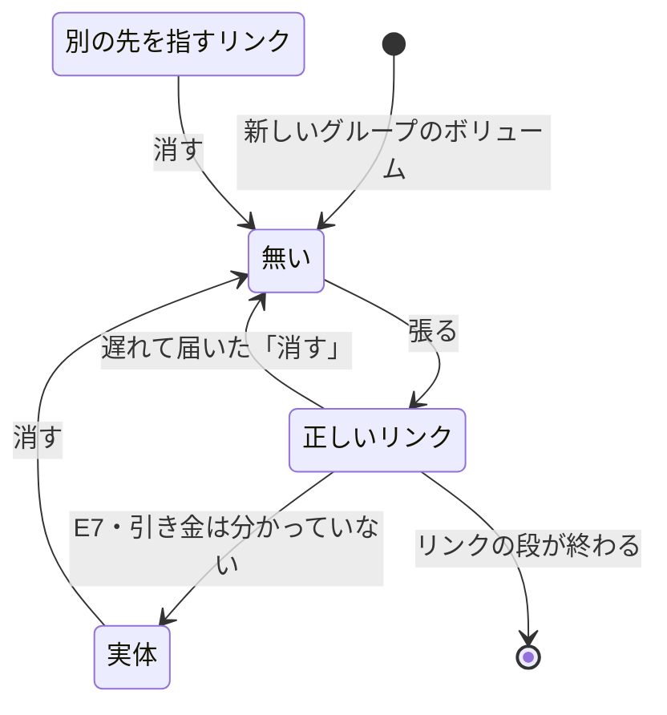
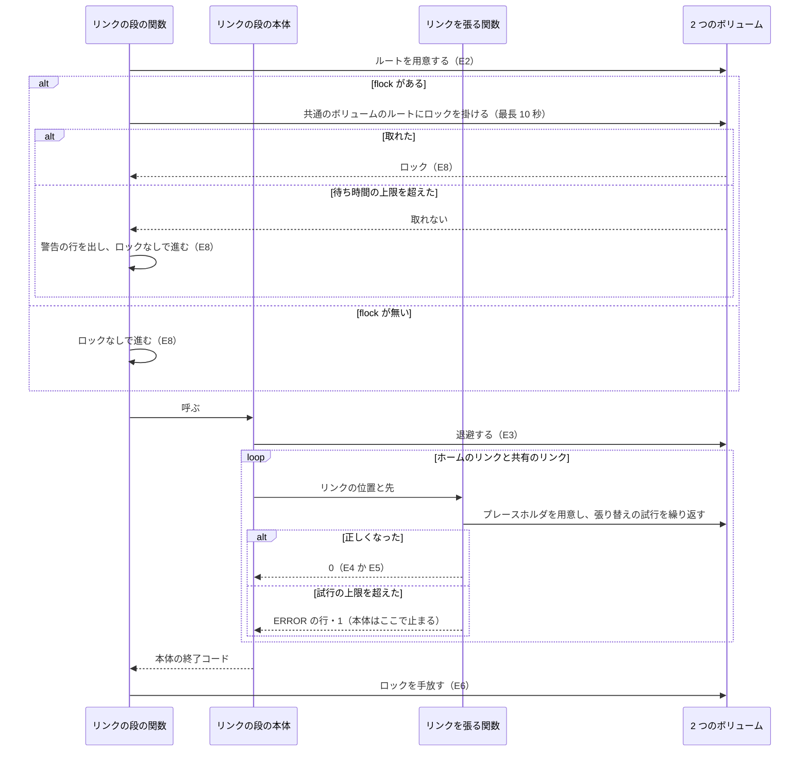
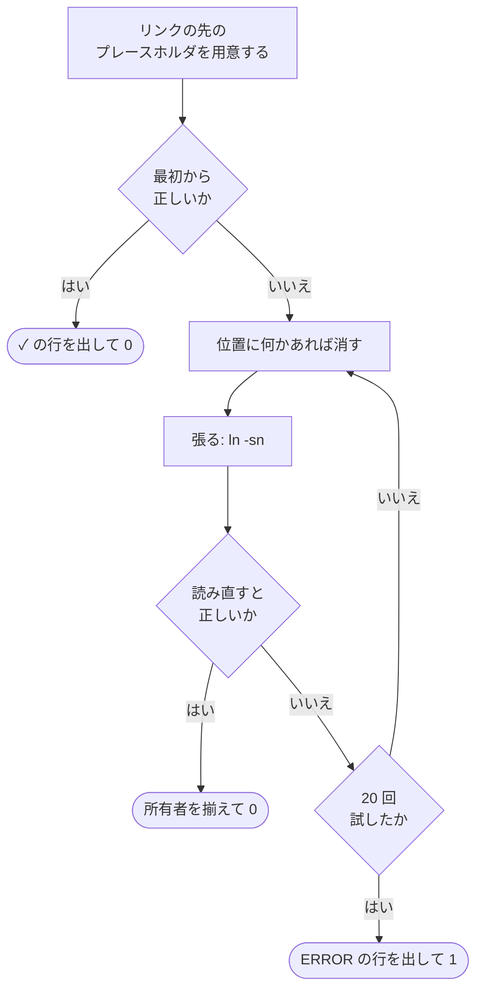
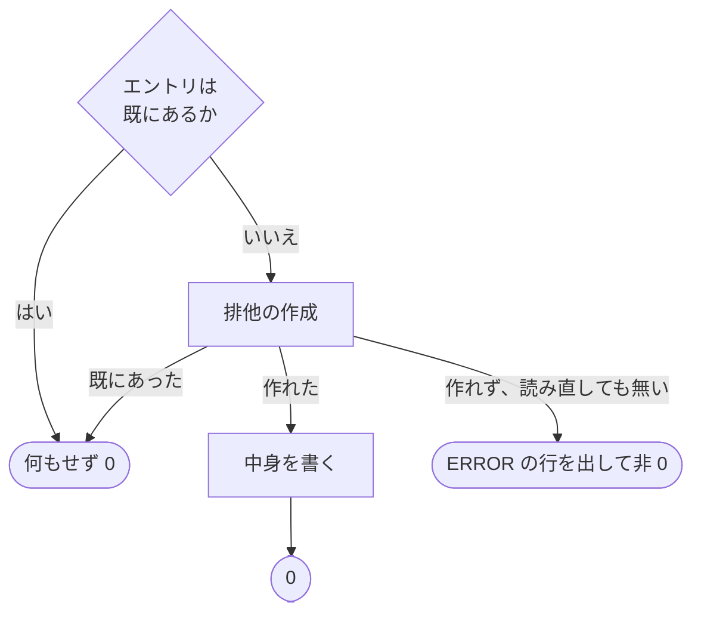

# #357: 同時起動でもリンクの段が失敗しない張り方

要求と受け入れ条件は #357 の本文にある（コピーは [issue-357-requirements.md](issue-357-requirements.md)）。
この文書は「どう作るか」だけを扱う。決定の理由は [issue-357-design-decisions.md](issue-357-design-decisions.md) に分けた。

変えるのは `containers/base/entrypoint.sh` のリンクの段だけで、次の 3 つを入れる。

- **リンクの段のロック**: 修正後のリンクの段どうしを、1 つずつ順に走らせる
- **張り替えの試行**: リンクを張る操作の成否ではなく、張った後に読み直した結果で成功を決める。修正前の手順で
  張る相手と重なっても、ロックが取れなくても、失敗しない
- **排他の作成**: 退避とプレースホルダは、エントリを「無いときだけ作る」操作で作れた 1 つのプロセスだけが
  中身を書く。ロックが取れなくても、同じエントリへ 2 つのプロセスが書かない

## ドメインモデル

### コンテキスト

| コンテキスト | 何の語が 1 つの意味に決まるか |
| --- | --- |
| コンテナの起動（`container-start`） | 共通のボリューム・共有のリンク・リンクの段・同時起動・修正前の手順と、この設計で足すリンクの段のロック・ロックの待ち時間の上限・張り替えの試行・入れ子のリンク・排他の作成 |

変更は 1 つのコンテキストで閉じる。アカウントグループとグループのボリュームは「機密の置き場」（`secret`）の語を
そのままの意味で使う（順応者）。コンテナを起動する側（`devbase up` / `devbase scale`）には触れない。

### 集約

| 集約 | 持ち主（書き換えてよいもの） | 根 | エンティティ | 値オブジェクト |
| --- | --- | --- | --- | --- |
| 共有のリンク | リンクを張る関数（`devbase_link_setting`） | 共有のリンク（グループのボリュームの `.claude` の下の位置で識別する） | — | リンクの先（パスの文字列）・位置の状態（無い / 正しいリンク / 別の先を指すリンク / 実体） |
| リンクの段 | リンクの段の関数（`devbase_setup_ai_settings`） | リンクの段の 1 回の実行 | 張り替えの試行（リンクごとの何回目かで識別する） | リンクの段のロックの結果（取れた / 待ち時間の上限を超えた / `flock` が無い）・排他の作成の結果（作れた / 既にあった / 作れない）・ロックの待ち時間の上限・試行の上限 |

共有のリンクの持ち主は関数として 1 つだが、同じグループのコンテナの数だけ別々のプロセスで動く。この集約の
不変条件は、ほかのプロセスが同じ位置を書き換えることを前提に書く。修正前のイメージのコンテナも同じ位置を
書くが、その手順は変えられない（要求の前提 1）。

### 不変条件

| # | 集約 | 条件 | 破れたときの扱い |
| --- | --- | --- | --- |
| I1 | 共有のリンク | リンクを張る関数が終了コード 0 で返るのは、リンクの位置が正しい先を指す symlink であると読み直して確かめたときだけである。張る操作（`ln`）と消す操作（`rm`）の終了コードでは決めない | 同時起動で落ちる、または正しくないリンクのまま起動が進む。テストが落とす |
| I2 | 共有のリンク | 張る操作は、リンクの位置がディレクトリを指すリンクになっていても、その先のディレクトリの中へリンクを作らない（入れ子のリンクを作らない） | 共通のボリュームのディレクトリの中に、自分自身を指すリンクが残る。テストが落とす |
| I3 | 共有のリンク | 試行の上限（20 回）まで繰り返しても正しくならなければ、非 0 で返り、リンクの位置のパスを含む行を標準エラーへ出す | 張れないリンクを成功として扱う、または失敗の場所が分からない。テストが落とす |
| I4 | 共有のリンク | 終了コード 0 で返るとき、`ln:` で始まる行を出さない | 成功した起動のログに失敗の行が残り、利用者が失敗と読む。テストが落とす |
| I5 | リンクの段 | リンクの段のロックを取れた修正後のリンクの段どうしは、退避・プレースホルダ・リンクの処理が時間の上で重ならない | 退避とプレースホルダが重なり、1 個ずつ順に走らせた結果と違う状態が残る。テストが落とす |
| I6 | リンクの段 | リンクの段のロックを取れない（待ち時間の上限を超えた・`flock` が無い）ときは、止まらずに進み、I1〜I4 と I9 を守る | 1 つのコンテナが止まっただけで、ほかのコンテナの起動が止まる。テストが落とす |
| I7 | リンクの段 | リンクの段のロックは、リンクの段を抜けた後（成功でも失敗でも）に残らない。entrypoint が最後に起動するコマンドへ引き継がない | そのコンテナが動いている間、ほかのすべてのコンテナのリンクの段が待ち時間の上限まで待つ。テストが落とす |
| I8 | リンクの段 | 2 つのボリュームに、ロックのためのファイルも、一時的な名前のエントリも作らない | 修正前の手順や復元したボリュームに見慣れないエントリが残る。テストが落とす |
| I9 | リンクの段 | 退避とプレースホルダが 2 つのボリュームに作るエントリは、排他の作成で作れた 1 つのプロセスだけが中身を書く。作れなかったプロセスは、そのエントリを「既にある」として扱い、書かない。リンクの段のロックを取れたかどうかによらない | 2 つの退避が同じディレクトリへ重ねてコピーし、子のディレクトリの中に同じ名前のディレクトリがもう 1 つ残る（例: 共通のボリュームの `plugins/<名前>/<名前>`）。または `cp` が失敗して起動が止まる。テストが落とす |

I9 から、どのホームにも同じ中身があるとき（受け入れ条件 3 の前提）は、ロックを取れなくても、退避とプレースホルダが
残すデータが 1 個ずつ順に走らせた結果と同じになる。ホームの中身が違うときの扱いは「未確認のまま残ること」に書いた。

### ドメインイベント

要求の E1〜E7 を引き継ぎ、E8 を足す。起きる順は E1 → E2 → E8 → E3 →（リンクごとに E4 か E5）→ E6 である。

| # | イベント | 発生元 | 受け手 |
| --- | --- | --- | --- |
| E1 | リンクの段が始まった | entrypoint の本文（コンテナの起動） | リンクの段の関数 |
| E2 | 2 つのボリュームのルートを用意した | リンクの段の関数 | リンクの段の関数（ロックを取りに行く） |
| E8 | リンクの段のロックを取った、または取らずに進むと決めた | リンクの段の関数 | リンクの段の本体 |
| E3 | イメージの設定を共通のボリュームへ退避し、プレースホルダを作った | リンクの段の本体 | リンクの段の本体（リンクへ進む） |
| E4 | 共有のリンクが正しいと確かめた | リンクを張る関数 | リンクの段の本体（次のリンクへ進む） |
| E5 | 共有のリンクを張り直した | リンクを張る関数 | 同じグループのほかのコンテナのリンクの段（E4 として観測する） |
| E6 | リンクの段が終わった | リンクの段の関数 | entrypoint の本文（続きの処理へ進む）と、ロックを待っていたほかのコンテナのリンクの段 |
| E7 | 共有のリンクが通常のファイルへ置き換わった | 分かっていない（#372） | 次の起動のリンクの段（E5 の引き金になる） |

### 用語

| 用語 | 意味 | 用語集への反映 |
| --- | --- | --- |
| 共通のボリューム | すべてのコンテナが `/persistent/ai` にマウントする 1 つのボリューム | 追加済み（`container-start`、要求の段階） |
| 共有のリンク | グループのボリュームの `.claude` の下にあり、共通のボリュームの同じ名前のエントリを指す symlink の 5 本 | 追加済み（`container-start`、要求の段階） |
| リンクの段 | entrypoint が AI 設定のリンクを張る処理の 1 回の実行 | 追加済み（`container-start`、要求の段階） |
| 同時起動 | 2 つ以上のコンテナのリンクの段が、時間の上で重なって走ること | 追加済み（`container-start`、要求の段階） |
| 修正前の手順 | #357 より前のリンクの張り方 | 追加済み（`container-start`、要求の段階） |
| リンクの段のロック | 共通のボリュームのルートのディレクトリに対して取る排他のロック。修正後のリンクの段どうしを 1 つずつ順に走らせる | 追加（`container-start`） |
| ロックの待ち時間の上限 | リンクの段のロックを待つ秒数の上限（10 秒）。超えたらロックなしで進む | 追加（`container-start`） |
| 張り替えの試行 | 共有のリンクを「消す → 張る → 読み直して確かめる」1 回ぶん。正しくなるまで試行の上限（20 回）まで繰り返す | 追加（`container-start`） |
| 入れ子のリンク | リンクの位置がディレクトリを指すリンクになっているときに、張る操作がその先のディレクトリの中へ作るリンク（例: 共通のボリュームの `plugins/plugins`） | 追加（`container-start`） |
| 排他の作成 | エントリを「無いときだけ作る」操作。同時に呼んでも作れるのは 1 つのプロセスだけで、作れたプロセスだけがそのエントリの中身を書く | 追加（`container-start`） |

## 機能一覧

| # | 機能 | 誰が使うか |
| --- | --- | --- |
| F1 | ボリュームを共有するコンテナを同時に起動しても、すべてのコンテナが起動する | devbase の利用者（`devbase up` / `devbase scale` / ホストの再起動の後の `docker start`） |
| F2 | 修正前のイメージのコンテナと並んで起動しても、修正後のコンテナが起動する | イメージを順に建て直している利用者 |
| F3 | リンクを張れないときに、どのリンクが張れなかったかを起動ログで知る | devbase の利用者 |

## 構成要素

| 要素 | 責務 | 新設 / 変更 |
| --- | --- | --- |
| リンクの段の関数（`devbase_setup_ai_settings`） | 2 つのボリュームのルートを用意し、リンクの段のロックを取って本体を呼ぶ。本体の終了コードをそのまま返す。引数の形は変えない | 変更 |
| リンクの段の本体（`devbase_apply_ai_settings`） | 退避・ホームのリンク・共有のリンクを、今と同じ順で行う | 新設（リンクの段の関数から切り出す） |
| リンクを張る関数（`devbase_link_setting`） | リンクの先のプレースホルダを用意し、張り替えの試行を繰り返す。引数の形と、成功のときの起動ログの行の形は変えない | 変更 |
| 退避の 1 エントリ（`devbase_seed_entry`） | コピー先のエントリを排他の作成で作り、作れたときだけ中身をコピーする。引数の形と起動ログの行の形は変えない | 変更 |
| プレースホルダの作成（`devbase_ensure_entry`） | 無いエントリを排他の作成で作り、作れたときだけ中身（JSON のファイルは `{}`）を書く。引数の形は変えない | 変更 |
| 排他の作成（`devbase_create_entry`） | エントリを無いときだけ作り、結果を終了コード（作れた 0 / 既にあった 1 / 作れない 2）で返す。通常のファイルは bash の noclobber で、ディレクトリは `perl` から `mkdir(2)` を呼んで作る（決定 10） | 新設 |
| リンクの判定（`devbase_link_is_set`） | リンクの位置が、渡した先を指す symlink かを終了コード（0 / 1）で返す。何も出力しない | 新設 |
| 上限の定数（`DEVBASE_LINK_LOCK_WAIT`・`DEVBASE_LINK_TRIES`） | ロックの待ち時間の上限（10 秒）と試行の上限（20 回）を、ほかの一覧の定数と同じ場所に持つ | 新設 |
| 同時実行のテスト（`tests/containers/test_entrypoint_ai_settings_concurrent.py`） | Docker を使わずに、受け入れ条件 1〜7・9〜11 と I1〜I9、非機能の条件を縛る | 新設 |
| 実物のイメージのテスト（`tests/containers/test_base_image_link_stage.py`） | base イメージのコンテナ 8 個を使い捨てのボリュームで同時に起動し、受け入れ条件 13 を縛る。base イメージの道具での I9 も縛る | 新設 |
| 変更履歴（`CHANGELOG.md`） | `[Unreleased]` の `Fixed` に、同時起動で落ちなくなったことと、反映にイメージの建て直しが要ることを書く | 変更 |
| 用語集（`docs/glossary/glossary.json` と `docs/glossary.md`） | この設計で足す 5 語を `container-start` に持つ | 変更（設計の Pull Request で行う） |

変えない関数は、ボリュームのルートの用意（`devbase_ensure_persistent_root`）と、退避するエントリを選ぶ関数
（`devbase_seed_image_claude_settings`）の 2 つである。既存のテスト
（`tests/containers/test_entrypoint_ai_settings.py`）も変えない（受け入れ条件 12）。

変える 4 つの関数の呼び出し元は次のとおりで、どれも引数の形を変えないため直さない。

| 関数 | 呼び出し元 |
| --- | --- |
| リンクの段の関数 | entrypoint の本文の 1 か所と、既存のテスト |
| リンクを張る関数 | リンクの段の本体の 3 つのループ（分類 A のホームのリンク・分類 B のホームのリンク・共有のリンク）。`docs/specifications/shellrc-dir.md` はこの関数が `~/.shellrc.d` を張ると書いており、記述は変更後も成り立つ |
| 退避の 1 エントリ | 退避するエントリを選ぶ関数（共通のボリュームへ）と、リンクの段の本体（Kiro CLI の認証の状態を、初回だけホームからグループのボリュームへ取り込むループ）。どちらも排他の作成を通る |
| プレースホルダの作成 | リンクを張る関数と、既存のテスト。`docs/specifications/shellrc-dir.md` は、置き場所の実体をこの関数が作り、開発ユーザーの所有になると書いており、記述は変更後も成り立つ |

### 文脈



変えられない外部は、Docker と、修正前のイメージのコンテナである。

### 構成要素の関係



変更履歴と用語集は、ほかの要素と呼び出しの関係を持たない。

### 配置

```mermaid
graph TD
    subgraph コンテナ A・修正後
        A1[リンクの段]
    end
    subgraph コンテナ B・修正後
        B1[リンクの段]
    end
    subgraph コンテナ C・修正前
        C1[修正前の手順]
    end
    subgraph Docker のボリューム
        AI[共通のボリューム<br/>/persistent/ai]
        G[グループのボリューム<br/>/persistent/group]
    end
    A1 -->|ロック・退避・プレースホルダ| AI
    B1 -->|ロック・退避・プレースホルダ| AI
    A1 -->|共有のリンク| G
    B1 -->|共有のリンク| G
    C1 -->|ロックを取らずに書く| G
```

コンテナの境界をまたぐのは、2 つのボリュームへの読み書きと、共通のボリュームのルートに掛けるロックである。
ロックはカーネルがプロセスの開いたファイルごとに持ち、ボリュームには何も書かない（I8）。排他の作成は、
ボリュームのファイルシステムが「既にあれば失敗する」作成を 1 つのプロセスにだけ通すことに頼り、作るのは
退避とプレースホルダが今も作っているエントリだけである。配置そのものは変えない。

### 置き場所

```text
containers/base/
└── entrypoint.sh                               # 関数 4 つを変え、関数 3 つと定数 2 つを足す
tests/containers/
├── test_entrypoint_ai_settings.py              # 変えない（35 件）
├── test_entrypoint_ai_settings_concurrent.py   # 新設
└── test_base_image_link_stage.py               # 新設
CHANGELOG.md                                    # [Unreleased] の Fixed
docs/
├── glossary/glossary.json                      # 5 語
└── glossary.md                                 # render で作り直す
```

足す関数と定数は、`DEVBASE_ENTRYPOINT_LIB_ONLY` の `return` より前に置く（要求の「前提とする取り決め」）。
検査の手段は要求の「検証手段」のとおりで、`shellcheck containers/base/entrypoint.sh` と
`env -u DEVBASE_ROOT uv run --locked pytest tests/containers/ -q` を使う。

## 構造

型は持たない。変えるのは bash の関数の分け方と、処理の順序である。クラス図を描かないことは、要求の
対象範囲の「含まない」に書いた。

| 関数 | 入力 | 出力 | 失敗 |
| --- | --- | --- | --- |
| リンクの段の関数 | ホーム・共通のボリュームのルート・グループのボリュームのルート・グループ名・所有者（今と同じ） | 本体の起動ログ。ロックを待ち切れなかったときは警告の 1 行を標準エラーへ足す | 本体の終了コードをそのまま返す。共通のボリュームのルートを開けなければ非 0 |
| リンクの段の本体 | ホーム・2 つのルート・所有者 | 退避とリンクの起動ログ（今と同じ） | 退避かリンクが非 0 なら、そこで非 0 |
| リンクを張る関数 | リンクの位置・リンクの先・所有者（今と同じ） | 成功のときの起動ログ（今と同じ行の形） | 試行の上限まで正しくならなければ、標準エラーへ 1 行を出して 1（I3） |
| リンクの判定 | リンクの位置・リンクの先 | 無い | 正しければ 0、違えば 1。失敗の扱いは持たない |
| 退避の 1 エントリ | コピー元・コピー先・コピーしない直下の名前（今と同じ） | 作れてコピーしたときの起動ログ（今と同じ `  seeded: <コピー先>`）。既にあれば何も出さない（今と同じ） | 排他の作成が 2 か、コピーが失敗すれば非 0 |
| プレースホルダの作成 | エントリのパス（今と同じ） | 無い | 排他の作成が 2 なら非 0 |
| 排他の作成 | 種類（通常のファイル / ディレクトリ）・エントリのパス | 無い | 作れたら 0、既にあれば 1。作れず、読み直しても無ければ、標準エラーへ 1 行を出して 2（I9） |

共有のリンクの位置が取る状態と遷移は次のとおりである。



- 「別の先を指すリンク」は、指す先の無い壊れたリンクを含む
- 遅れて届いた「消す」は、正しくなる前に「違う」と判定を済ませていたプロセスが出す。修正前の手順の相手と、
  ロックなしで進んだ修正後のリンクの段から届く。ロックを取れたリンクの段どうしでは起きない（I5）
- 「無い」から「別の先を指すリンク」への遷移は無い。同じグループのコンテナは、同じ位置に同じ先を張る
- 「実体」から「正しいリンク」へ直に移る遷移は無い。置き換え（rename）を使わず、消してから張る（決定 4）

## 入出力の契約

コマンド・環境変数・compose の生成物は変えない。2 つの上限は entrypoint の中の定数で、環境変数からは読まない
（テストは関数を読み込んだ後に定数を上書きして、短い待ち時間で確かめる）。変わるのは起動ログの行だけである。

| 場合 | 行 | 出力先 | 変更 |
| --- | --- | --- | --- |
| リンクが最初から正しい | `  ✓ <リンクの位置> (symlink exists)` | 標準出力 | 変えない |
| 位置に何かあり、消す | `  Removing existing <リンクの位置>...` | 標準出力 | 行の形は変えない。1 回目の試行でだけ出す |
| 張る | `  Creating symlink: <リンクの位置> -> <リンクの先>` | 標準出力 | 行の形は変えない。1 回目の試行でだけ出す |
| 張る操作か消す操作が失敗したが、読み直すと正しい | 何も足さない（`ln:` と `rm:` の行を出さない） | — | 新しい振る舞い（I4） |
| 試行の上限まで正しくならない | `ERROR: symlink を張れない: <リンクの位置> -> <リンクの先> (<最後に失敗したコマンドの出力>)` | 標準エラー | 新設（I3） |
| 排他の作成で作れなかったが、読み直すとエントリがある（ほかのプロセスが先に作った） | 何も足さない | — | 新しい振る舞い（I9） |
| エントリを作れず、読み直しても無い | `ERROR: エントリを作れない: <エントリのパス> (<失敗したコマンドの出力>)` | 標準エラー | 新設（I9）。今は `mkdir` か `cp` の行だけが出る |
| ロックを待ち切れなかった | `WARNING: リンクの段のロックを 10 秒待っても取れないため、ロックなしで進める: <共通のボリュームのルート>` | 標準エラー | 新設（I6） |

終了コードは、リンクの段の関数もリンクを張る関数も、成功が 0、失敗が非 0 のままである。entrypoint は
`set -e` で動くため、リンクの段の関数が非 0 を返すとコンテナの起動が止まる（今と同じ）。

## 処理の流れ

### リンクの段



- ルートの用意はロックの前に行う。ロックを掛ける相手のディレクトリが要るためである。中身は「無ければ作る・
  書けなければ所有者を直す」で、重なっても結果は変わらない
- ロックは、リンクの段の関数が開いたサブシェルの中だけで持つ（決定 5）。本体が失敗してサブシェルが終わっても、
  開いたファイルが閉じてロックは外れる。ロックを持ったプロセスが kill されたときも、カーネルが外す
- 図に含めない構成要素は、リンクの判定・退避の 1 エントリ・プレースホルダの作成・排他の作成・上限の定数・
  テスト 2 つ・変更履歴・用語集の 9 つである。リンクの判定は次の図に、退避の 1 エントリ・プレースホルダの作成・
  排他の作成は「退避とプレースホルダ」の図にあり、残りは「構成要素の関係」の図にある

### 張り替えの試行



- 消す操作と張る操作は、失敗してもそこで終わらない。標準エラーは捨てずに控え、最後の ERROR の行にだけ使う
- 張る操作には `-n` を付ける（決定 6）。位置が既にディレクトリを指すリンクなら、中へ作らずに失敗する（I2）
- 試行の間に待ち時間は置かない。次の試行が要るのは、相手のプロセスが位置を書き換えたときだけである

修正前の手順で張る相手と重なったときの進み方は、次の 3 通りである。

| 重なり方 | 修正後の側 | 相手 |
| --- | --- | --- |
| 相手が先に張り、その後で修正後の側が張る | 張る操作は失敗するが、読み直すと正しいので 0 | 0 |
| 修正後の側が張った後で、相手が消して張る | 読み直した時点で正しければ 0。消された直後なら次の試行で張る | 0。修正後の側が先に張り直すと、相手は下の行の形になる |
| 修正後の側が張った後で、消し終えていた相手が張る | 0 | ファイルのリンクでは非 0 で終わる。ディレクトリのリンクでは入れ子のリンクを作って 0 で終わる（どちらも要求の範囲外） |

修正前の手順の相手が消すのは、1 プロセスにつき 1 回である。同時起動が 8 個なら、正しいリンクが消されるのは
多くて 7 回で、試行は 9 回までに収まる。試行の上限の 20 回は、その 2 倍の余裕として置く。ロックなしで進んだ
修正後のリンクの段どうしが消し合うのは、確かめてから消すまでの間に相手が張ったときだけで、実測では上限に
達して非 0 で終わった回は無かった。

### 退避とプレースホルダ



- 通常のファイルは、bash の noclobber（`set -C` を付けたサブシェルの `>`）で空のファイルとして作る。作れた
  プロセスが、その空のファイルへ中身を書く（退避は `cp -a` で上書きし、JSON のプレースホルダは `{}` を書く）
- ディレクトリは、`perl` から `mkdir(2)` を呼んで作る。base イメージの `mkdir`（uutils coreutils 0.8.0）は、
  同時に呼ぶと 2 個以上が 0 で終わるため使わない。`perl` が無い環境では `mkdir` で作り、止めない（決定 10）
- 作る操作の終了コードが非 0 のときは、I1 と同じく読み直して決める。エントリがあれば「既にあった」（1）、
  無ければ「作れない」（2）である
- 退避でディレクトリの子を `cp -a` でコピーするのは、作れたプロセスだけである。既にある子のディレクトリを
  コピー先にする `cp -a` が走らないため、子の中へ重ねてコピーしない
- 作れなかったプロセスは、作れたプロセスが中身を書き終えるのを待たずに、リンクへ進む。全員が終わった後の
  エントリは、作れたプロセスを最初に 1 個だけ走らせた後と同じである

## 非機能の実現方式

| 大項目 | 要求の条件 | 実現方式 | 確かめ方 |
| --- | --- | --- | --- |
| 可用性 | ほかのコンテナを待つ仕組みを使う場合、待たせている側のプロセスが途中で kill されても、後から始めたリンクの段は 30 秒以内に終了コード 0 で終わる。kill の後に残ったもの（一時的な名前のエントリなど）があっても、次のリンクの段は終了コード 0 で終わる | ロックは `flock` で取り、持ち主のプロセスが終わるとカーネルが外す。持ち主が止まったまま終わらないときも、ロックの待ち時間の上限（10 秒）でロックなしへ切り替える。ロックのためのファイルも一時的な名前も作らないため、kill の後に残るものは、張りかけの状態（位置が「無い」）と、書きかけの退避のエントリだけである。前者は次のリンクの段が張り、後者は「既にある」として扱って 0 で終わる（今と同じ） | ロックを持ったプロセスを kill した後と、止めたままにした後のそれぞれで、リンクの段の所要と終了コードを見る。位置が「無い」状態から走らせて 0 を見る |
| 性能・拡張性 | 8 個同時に走らせたとき、8 個すべてが 30 秒以内に終わる（手元と CI）。1 個だけで走らせたときの所要は、修正前の所要に 1 秒を足した値を超えない。8 個を超える同時起動は確かめない（前提 2） | ロックの中で行うのはリンクの段の本体だけで、資格情報・clone・Docker-in-Docker はロックの外で動く。1 個だけのときに足すのは、`flock` の起動 1 回と、張った後の読み直しと、エントリが無いときの排他の作成（ディレクトリ 1 つにつき `perl` の起動 1 回。実測で 20 回が 13 ミリ秒）である。試行の間に待ち時間を置かない | 8 個同時の所要を測る。1 個だけの所要を、修正前の `entrypoint.sh` と並べて測る |
| 移行性 | 修正前と修正後のイメージのコンテナが同じグループに並ぶ（前提 1）。修正後のリンクの段がボリュームに残すものは、修正前の手順のリンクの段を失敗させない（並走のときも、entrypoint を前の版へ戻したときも）。ボリュームのデータの移行は無い | 修正後のリンクの段がボリュームに残すのは、修正前の手順が残すものと同じ並び（プレースホルダとリンク）だけである（I8）。並走は張り替えの試行で受ける | 修正後のリンクの段の後のボリュームの並びを、修正前の手順の後の並びと比べる。その後に修正前の手順を走らせて 0 を見る |
| システム環境 | base イメージに今入っている道具だけで動く（前提 5）。テストは Linux の CI で走る（前提 6） | 使うコマンドは `flock`（util-linux 2.41.3）・`ln`（uutils coreutils 0.8.0）・`rm`（GNU coreutils 9.7）・`readlink`・`perl`（5.40.1。Essential のパッケージ perl-base）で、どれも今の base イメージにある。entrypoint が `perl` を使うのは、この設計が初めてである。`ln -sn`・bash の noclobber・`perl` の `mkdir` は macOS でも同じ意味を持つ。`flock` が無い環境（macOS）ではロックなしで進むため、同時実行のテストは macOS でも走る | 実物のイメージのテスト（受け入れ条件 13）と、CI と macOS での pytest |

## 決定の記録

決定 1〜10 と、その根拠にした実測は [issue-357-design-decisions.md](issue-357-design-decisions.md) にある。

## テスト設計

受け入れ条件 1〜7 は「同時に走らせる」テストで縛る。**1 回の同時実行では、修正前の手順でも通ることがある**
（[実測](issue-357-design-decisions.md#決定の根拠にした実測)の 1 行目。Linux では 10 回のうち 7 回が通った）。
テストは 1 件の中で同時実行を繰り返し、1 回でも条件が破れたら落ちる形にする。繰り返す回数は実装で測って決め、
受け入れ条件 8 を満たすことを条件にする。

| 受け入れ条件・不変条件 | どの振る舞いで縛るか | どう壊したら落ちるべきか |
| --- | --- | --- |
| 受け入れ条件 1 | `settings.json` だけ通常のファイルの状態で 2 個同時に走らせると、2 個とも 0 で終わり、`settings.json` が共通のボリュームを指す | 張る操作が失敗したらそのまま非 0 で終わる（修正前の手順へ戻す） |
| 受け入れ条件 2 | 同じ状態で 8 個同時に走らせると、8 個とも 0 で終わり、共通のボリュームの `settings.json` の中身が変わらない | 修正前の手順へ戻す。消す対象をリンクの先へ向ける |
| 受け入れ条件 3 | 2 つのボリュームが空で、どのホームにも同じ `settings.json` がある状態で 8 個同時に走らせた後の、2 つのボリュームの並び・リンクの先・ファイルの中身が、1 個だけ走らせた後と同じ | 修正前の手順へ戻す。張る操作の `-n` を外す |
| 受け入れ条件 4 | 共通のボリュームに中身があり、グループのボリュームが空の状態で 8 個同時に走らせると、8 個とも 0 で終わり、共有のリンク 5 本が共通のボリュームを指す | 修正前の手順へ戻す |
| 受け入れ条件 5 | `plugins` の位置が、中にファイルを持つ実体のディレクトリの状態で 8 個同時に走らせると、8 個とも 0 で終わり、`plugins` が共通のボリュームを指す | 実体を消さずに張る |
| 受け入れ条件 6 | 1 本が別の先を指す状態と、壊れたリンクである状態のそれぞれで 8 個同時に走らせると、8 個とも 0 で終わり、そのリンクが共通のボリュームを指す | 先を比べずに、symlink であるだけで正しいと判定する |
| 受け入れ条件 7 | 修正後のリンクの段 1 個と、同じ共有のリンクを修正前の手順で張る相手 1 個を同時に走らせると、修正後の側が 0 で終わり、共有のリンクが共通のボリュームを指す | 読み直しを外し、張る操作の終了コードで決める |
| 受け入れ条件 8 | 受け入れ条件 1 のテストを、修正前の `entrypoint.sh`（設計のブランチの起点の版）へ向けて 3 回続けて走らせると、3 回とも落ちる。完了判定で 1 度確かめる | 繰り返す回数を 1 回に減らすと、3 回のうちに通る回が出る |
| 受け入れ条件 9・I3 | グループのボリュームの `.claude` に書き込めない状態で走らせると、非 0 で終わり、張れなかったリンクの位置のパスを含む行が標準エラーに出る | 試行の上限の後で 0 を返す。ERROR の行からパスを外す |
| 受け入れ条件 10・I4 | 受け入れ条件 1〜7 のテストで 0 で終わったリンクの段の出力に、`ln:` で始まる行が無い | 張る操作の標準エラーをそのまま流す |
| 受け入れ条件 11・I8 | 受け入れ条件 1〜7 のテストの後、グループのボリュームの `.claude` の並びが共有のリンク 5 本とそのテストが置いたものだけで、2 つのボリュームのルートにロックのためのエントリが無い | ロックをファイルに掛ける。一時的な名前で張る |
| 受け入れ条件 12 | 既存の `test_entrypoint_ai_settings.py` を変えずに走らせ、35 件とも通る | 起動ログの行の形か引数の形を変える |
| 受け入れ条件 13 | base イメージのコンテナ 8 個を、受け入れ条件 1 の状態にした使い捨てのボリュームで同時に起動すると、8 個とも entrypoint が 0 で終わる。使ったボリュームとコンテナは消す（決定 9） | 修正前の `entrypoint.sh` をマウントすると、繰り返すうちに非 0 が出る |
| I1 | 消した直後に、ほかのコンテナが同じリンクを張り終えた状態を作ると、張る操作は失敗するが、リンクを張る関数は 0 で返る | 読み直しを外す |
| I2 | 同じ状態を `plugins` で作ると、共通のボリュームの `plugins` の中に `plugins` という名前のリンクができない | 張る操作の `-n` を外す |
| I5 | 別のプロセスがリンクの段のロックを持っている間、リンクの段は退避もリンクも始めずに待ち、手放された後に進んで 0 で終わる | ロックを取らずに本体を呼ぶ |
| I6 | ロックを持ったプロセスが手放さないままでも、待ち時間の上限の後に警告の行を出して 0 で終わる。`flock` が見つからない状態で 8 個同時に走らせても、8 個とも 0 で終わる | 待ち時間の上限を外す。`flock` が無いときに非 0 で終わる |
| I9（ロックなしの退避） | `flock` が見つからない状態で、2 つのボリュームが空、どのホームにも同じ `~/.claude`（`plugins` の下に子のディレクトリを 12 個・`settings.json`）がある状態から 8 個同時に走らせると、8 個とも 0 で終わり、2 つのボリュームの並びとファイルの中身が、1 個だけ走らせた後と同じ | 退避を今の手順（無ければディレクトリを作って子をコピーする）へ戻す |
| I9（作れるのは 1 つ） | 無いエントリに対して排他の作成を 8 個同時に呼ぶと、通常のファイルでもディレクトリでも、0 を返すのは 1 個だけである。既にあるエントリに対して呼ぶと 1 を返し、中身を変えない | あるかを確かめてから作る 2 段の手順にする |
| I9（base イメージの道具） | base イメージの使い捨てのコンテナの中の一時ディレクトリで、上の 2 行と同じことを確かめる（実物のイメージのテスト。ボリュームは使わない） | ディレクトリを `mkdir` で作る（uutils の `mkdir` は 2 個以上が 0 で終わる。CI の runner の `mkdir` では落ちない） |
| I9（作れない） | コピー先の親のディレクトリに書き込めない状態で退避を走らせると、非 0 で終わり、エントリのパスを含む行が標準エラーに出る（root では状態を作れないため、受け入れ条件 9 と同じく skip する） | 排他の作成が 2 を返したときに 0 で返る |
| 決定 10（`perl` が無い） | `perl` が見つからない状態で 1 個だけ走らせると 0 で終わり、2 つのボリュームの並びとファイルの中身が、`perl` がある状態と同じ | `perl` が無いときに非 0 で終わる |
| I7 | リンクの段の関数から戻った後、呼んだシェルが生きている間に、別のプロセスが待たずにロックを取れる | サブシェルを使わず、呼び出したシェルで fd を開いたままにする |
| 可用性 | ロックを持ったプロセスを途中で kill すると、後から始めたリンクの段が 30 秒以内に 0 で終わる。共有のリンクの位置が「無い」状態（張りかけで終わった後）から走らせても 0 で終わる | ロックを、プロセスが終わっても残る形（ファイルの有無）で持つ |
| 性能・拡張性 | 受け入れ条件 2〜6 のテストで、8 個すべてが 30 秒以内に終わる。1 個だけの所要が、修正前の `entrypoint.sh` の所要に 1 秒を足した値を超えない | 試行の間に長い待ち時間を置く。ロックを待ち時間の上限まで必ず待つ |
| 移行性 | 修正後のリンクの段を走らせた後に、修正前の手順のリンクの段を同じボリュームで走らせると 0 で終わる | ボリュームに、修正前の手順が実体として消しに行くエントリを残す |

修正前の手順の相手（受け入れ条件 7・移行性）は、`entrypoint.sh` の今のリンクを張る関数をテストの側へ
コピーしたものを使う。実装の後は `entrypoint.sh` から読めなくなるためである。

## 未確認のまま残ること

| 項目 | 内容 |
| --- | --- |
| 同時起動の上限を 8 個と置くこと（要求の前提 2） | 利用者が設計の承認のときに決める。試行の上限の 20 回は、8 個を前提にした値である |
| 動いているコンテナの中のツールとの競合（要求の前提 4） | 入れない前提で設計した。利用者が #372 の扱いと合わせて決める |
| pytest を並列（`-n auto`）で流したときの、同時実行のテストの所要と、修正前の手順に対する落ち方 | 実測は直列で行った。繰り返す回数は、並列で流した状態で実装のときに測って決める |
| CI の runner での `ln` | GitHub Actions の runner の `ln` は GNU coreutils で、uutils の `ln` での確認は実物のイメージのテスト（開発者の端末）だけになる。base イメージの `ln` が入れ替わったときは、受け入れ条件 13 のテストで気づく |
| 退避が 10 秒を超える大きさのとき | 初回の起動で、派生イメージが `~/.claude` に大きなディレクトリを持つと、退避の間に待つ側がロックの待ち時間の上限を超え、ロックなしで進む。共有のリンクは正しくなり、退避は排他の作成で作れた 1 つのプロセスだけが書く（I9）。待つ側は、退避が終わる前にリンクを張って先へ進むため、起動の直後に共通のボリュームの中身が揃っていない時間がある（修正前と同じ）。そのようなイメージがあるかは調べていない |
| ロックを取れず、ホームの中身が違うコンテナが同時に退避するとき | エントリごとに、排他の作成で作れた 1 つのコンテナの中身が丸ごと残る。エントリが違えば、作れたコンテナも違うことがある（`plugins` はコンテナ A、`settings.json` はコンテナ B）。1 個ずつ順に走らせると、最初の 1 個が持つエントリはすべてその中身になるため、結果が違う。受け入れ条件 3 の前提（どのホームにも同じ中身）の外で、ロックを取れたときは起きない |
| 排他の作成で作れたプロセスが、中身を書き終える前に kill されたとき | 書きかけのエントリ（空の `settings.json`・途中までの `plugins`）が残り、次のリンクの段は「既にある」として退避しない。1 個だけで走らせて退避の途中で kill されたときと同じである。通常のファイルでは、空のファイルを作ってから `cp` が中身を書くまでの時間が、今より長くなる |
| base イメージの `mkdir` が排他でないこと | uutils coreutils 0.8.0 の `mkdir` だけで確かめた。版が上がって振る舞いが変わっても、`perl` の `mkdir` を使い続ける。ほかに `mkdir` の排他に頼る箇所が entrypoint にあるかは調べていない |
| 修正前の手順が過去に作った入れ子のリンク | 片付けは行わない。動いているコンテナ 1 つで、共通のボリュームの `plugins/plugins`・`skills/skills`・`commands/commands` が無いことを確かめた（2026-10-02）。ほかの利用者のボリュームは確かめていない |
| 修正前のイメージのコンテナ | 建て直すまで、同時起動で落ちることと、入れ子のリンクを作ることが残る（要求の対象範囲の「含まない」） |
