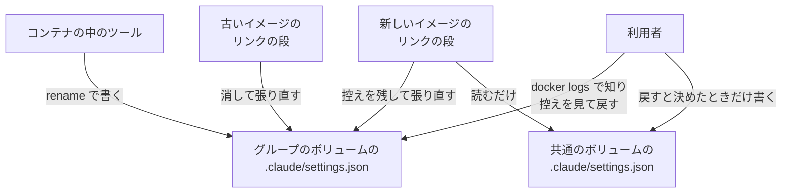
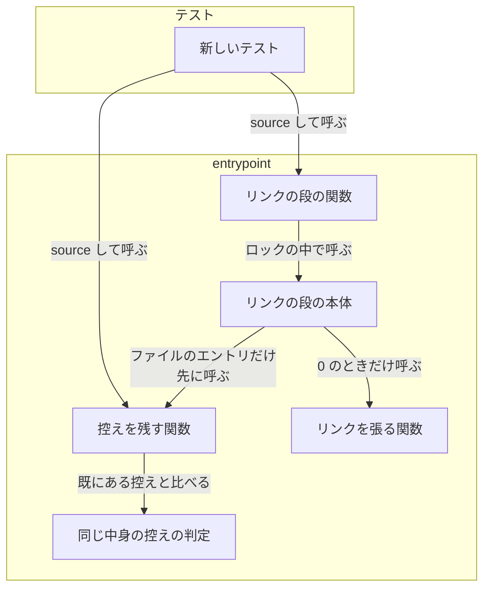
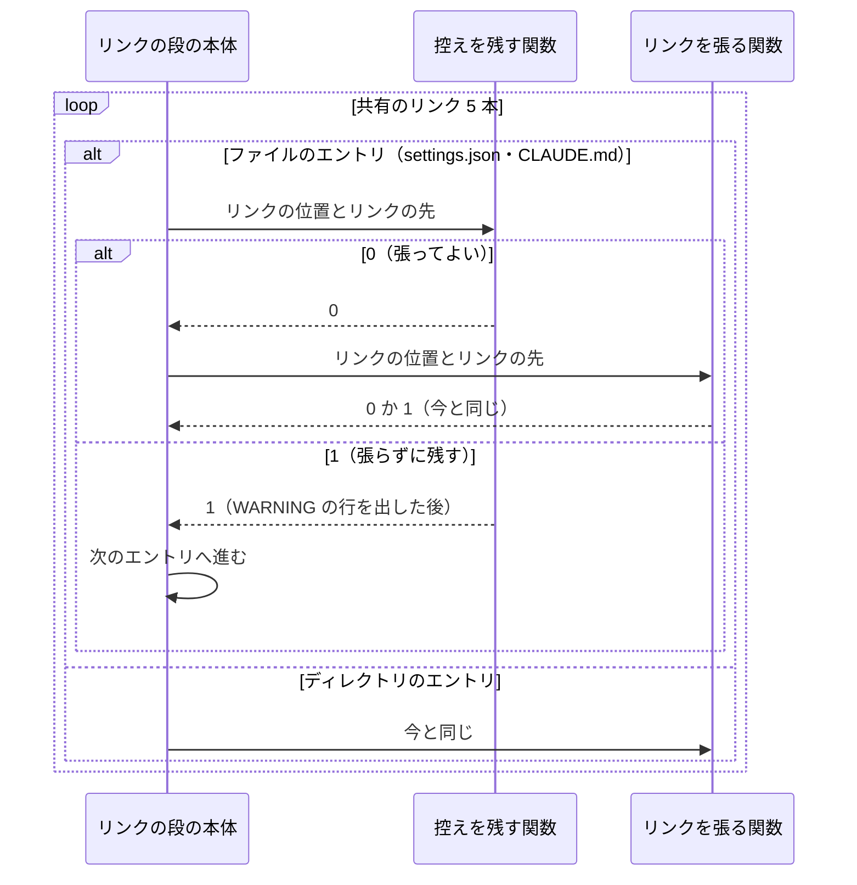
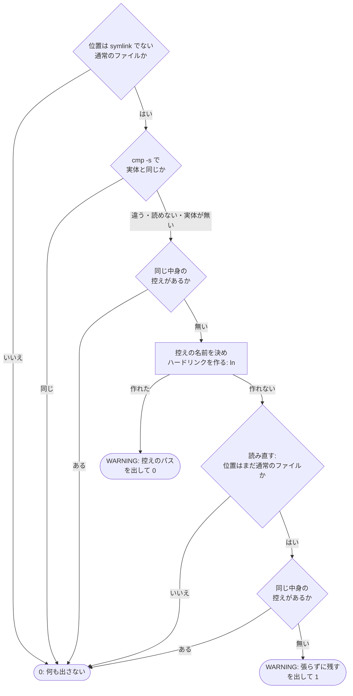
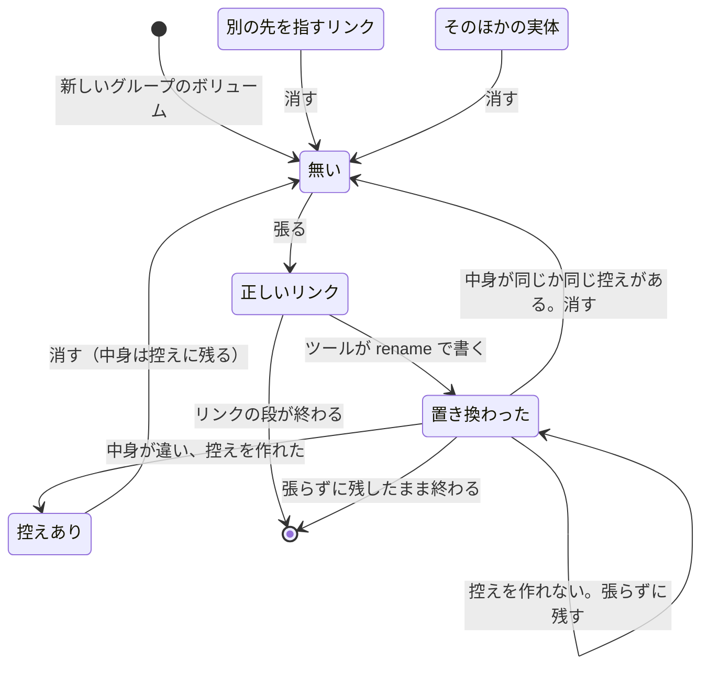

# #372: 置き換わった共有のリンクの中身を控えに残してから張り直す

要求と受け入れ条件は #372 の本文にある（コピーは [issue-372-requirements.md](issue-372-requirements.md)）。
この文書は「どう作るか」だけを扱う。

変えるのは `containers/base/entrypoint.sh` のリンクの段で、共有のリンクのうちファイルのエントリ
（`settings.json` と `CLAUDE.md`）を張る前に、次の 1 つを足す。

- **控えを残す関数**: 共有のリンクの位置に通常のファイルがあり、その中身が共通のボリュームの実体とも、既にある
  控えとも違うときだけ、同じ `.claude` の下へ控えをハードリンクで作り、`WARNING:` の行で知らせる。控えを作れない
  ときは、張り直さずに残す

位置を消して張り直すのは、今と同じリンクを張る関数（`devbase_link_setting`）である。控えを残す関数は位置を
書き換えない。

## ドメインモデル

### コンテキスト

| コンテキスト | 何の語が 1 つの意味に決まるか |
| --- | --- |
| コンテナの起動（`container-start`） | 共通のボリューム・共有のリンク・リンクの段・リンクの段のロック・張り替えの試行と、要求の段階で足した置き換わった共有のリンク・共有のリンクの控え |

変更は 1 つのコンテキストで閉じる。アカウントグループとグループのボリュームは「機密の置き場」（`secret`）の語を
そのままの意味で使う（順応者）。コンテナを起動する側（`devbase up` / `devbase scale`）と、`settings.json` へ
書くツール（Claude Code・NDF の hook）には触れない（要求の前提 5）。

### 集約

| 集約 | 持ち主（書き換えてよいもの） | 根 | エンティティ | 値オブジェクト |
| --- | --- | --- | --- | --- |
| 共有のリンク | リンクを張る関数（`devbase_link_setting`） | 共有のリンク（グループのボリュームの `.claude` の下の位置で識別する） | — | リンクの先・位置の状態（無い / 正しいリンク / 別の先を指すリンク / 置き換わった共有のリンク / そのほかの実体） |
| 共有のリンクの控え | 控えを残す関数（`devbase_keep_replaced_link`） | 共有のリンクの控え（パスで識別する） | — | 元のエントリの名前・時刻（UTC の秒）・中身 |

#357 の集約「リンクの段」は変えない。共有のリンクの集約は、位置の状態の「実体」を「置き換わった共有のリンク」
（ファイルのエントリの位置にある通常のファイル）と「そのほかの実体」に分ける。

控えの集約の持ち主は控えを残す関数だけで、共有のリンクの位置を書き換えない（控えは位置のファイルへ新しい名前を
足すハードリンクで作る。決定 2）。位置を消すのはリンクを張る関数だけで、2 つの関数が同じ集約を書き換えない。
控えを作った後は誰も書き換えず、リンクの段は消さない。

### 不変条件

| # | 集約 | 条件 | 破れたときの扱い |
| --- | --- | --- | --- |
| I1 | 共有のリンク | 位置が置き換わった共有のリンクで、中身が共通のボリュームの実体とも既にある控えのどれとも違うとき、リンクを張る関数がその位置を消すのは、控えを作れた後だけである | 次の起動で中身が黙って消える（起票の観測の形）。テストが落とす |
| I2 | 共有のリンクの控え | 控えの中身・所有者・権限は、置き換わっていたファイルと同じである | 控えから戻したときに中身が違う、またはほかの利用者に読める形へ広がる。テストが落とす |
| I3 | 共有のリンクの控え | リンクの段のロックを取れたとき、同じ共有のリンクについて同じ中身の控えを 2 つ作らない | 起動のたびに同じ控えが増える。テストが落とす |
| I4 | 共有のリンクの控え | 控えを残す関数は、共通のボリュームへ書かない。既にある控えを消さず、書き換えない | あるグループの設定が確認なしに全グループへ広がる、または利用者が戻す前に控えが消える。テストが落とす |
| I5 | 共有のリンクの控え | 控えを作ったときは、そのパスを含む `WARNING:` で始まる行を標準エラーへ 1 行出す。中身が共通のボリュームの実体と同じとき、または同じ中身の控えが既にあるときは出さない（控えを作れなかったときは I6 のとおり出す） | 利用者が置き換わったことを起動の記録から知れない、または中身が同じでも警告が出て読み流される。テストが落とす |
| I6 | 共有のリンク | 控えを作れないときは、位置のファイルを消さずに残し、そのリンクだけ張らずに `WARNING:` の行を出し、リンクの段は 0 で返る | 中身を失う、またはコンテナの起動が止まる。テストが落とす |
| I7 | 共有のリンク | 位置が正しいリンク・別の先を指すリンク・ディレクトリのとき、ホームのリンクとディレクトリの共有のリンクでは、リンクの段の出力と結果は変更の前と同じである | 範囲の外の振る舞いが変わる（受け入れ条件 9）。既存のテストと新しいテストが落とす |

### ドメインイベント

要求の E1〜E6 を引き継ぐ。足すイベントは無い。

| # | イベント | 発生元 | 受け手 |
| --- | --- | --- | --- |
| E1 | 共有のリンクが通常のファイルへ置き換わった | コンテナの中のツール（devbase の外。下の「置き換えの主を確かめた結果」） | 次の起動のリンクの段（E2 の引き金になる） |
| E2 | リンクの段が、共有のリンクの位置に通常のファイルを見つけた | 控えを残す関数 | 控えを残す関数（比べる） |
| E3 | 中身を共通のボリュームの実体と比べた | 控えを残す関数 | 控えを残す関数（同じなら E5、違えば E4 へ） |
| E4 | 置き換わった共有のリンクを控えとして残した | 控えを残す関数 | リンクを張る関数（位置を消してよい） |
| E5 | 共有のリンクを張り直した | リンクを張る関数 | 同じグループのほかのコンテナのリンクの段（正しいリンクとして観測する） |
| E6 | 起動の記録に控えの場所を知らせた | 控えを残す関数 | 利用者（`docker logs`） |

E3 で読めないときと、比べる相手の実体が無いときは「違う」として E4 へ進む。E4 に失敗したときは E5 を起こさない
（I6）。

### 用語

| 用語 | 意味 | 用語集への反映 |
| --- | --- | --- |
| 置き換わった共有のリンク | 共有のリンクの位置にある、symlink ではない通常のファイル | 追加済み（`container-start`、要求の段階）。正本を `container-link-stage.md` にする |
| 共有のリンクの控え | 置き換わった共有のリンクの中身を、張り直す前にグループのボリュームの同じ `.claude` の下へ別の名前で残したファイル | 追加済み（`container-start`、要求の段階）。正本を `container-link-stage.md` にする |

## 機能一覧

| # | 機能 | 誰が使うか |
| --- | --- | --- |
| F1 | 共有のリンクが中身の違う通常のファイルへ置き換わっていても、次の起動でその中身を失わない | devbase の利用者（コンテナの中で Claude Code やほかのツールを使う人） |
| F2 | 置き換わったことと控えの場所を、起動の記録から知る | devbase の利用者（`docker logs`） |
| F3 | 控えの中身を見て、共通のボリュームへ戻すかを自分で決めて戻す | devbase の利用者 |

## 構成要素

| 要素 | 責務 | 新設 / 変更 |
| --- | --- | --- |
| 控えを残す関数（`devbase_keep_replaced_link <リンクの位置> <リンクの先>`） | 位置が置き換わった共有のリンクのときだけ動く。中身が実体とも既にある控えとも違えば、控えをハードリンクで作り `WARNING:` の行を出す。終了コードは「張ってよい」0 /「張らずに残す」1。位置を書き換えない | 新設 |
| 同じ中身の控えの判定（`devbase_same_copy_exists <リンクの位置>`） | `<リンクの位置>.replaced-*` のうち通常のファイルのどれかが、位置のファイルと `cmp -s` で同じなら 0、無ければ 1。何も出力しない | 新設 |
| リンクの段の本体（`devbase_apply_ai_settings`） | 共有のリンクのループで、ファイルのエントリ（`devbase_is_file_entry`）について控えを残す関数を先に呼び、1 ならそのリンクを張らずに次のエントリへ進む。ほかの順序は変えない | 変更 |
| 新しいテスト（`tests/containers/test_entrypoint_replaced_link.py`） | Docker を使わずに、受け入れ条件 1〜9 と I1〜I7 を縛る | 新設 |
| 確定仕様（`docs/specifications/container-link-stage.md`） | 構成要素の表・張り替えの試行の状態遷移・起動ログの表・常に成り立つ条件・テスト観点に、控えを残す関数を足す。状態遷移の「引き金は分かっていない」を、確かめた結果で書き換える | 変更 |
| 利用者向けの文書（`docs/user/container-operations.md`） | 「全コンテナ共通」の節の後に、控えの名前・置き場・知らせの出る場所と、中身を共通のボリュームへ戻す手順を足す | 変更 |
| 変更履歴（`CHANGELOG.md`） | `[Unreleased]` の `Changed` に、置き換わった共有のリンクの中身を控えに残すことと、反映に base イメージの建て直しが要ることを書く | 変更 |
| 用語集（`docs/glossary/glossary.json` と `docs/glossary.md`） | 2 語の正本を `docs/specifications/container-link-stage.md` にする（`glossary.py render` で作り直す） | 変更 |

変えない関数は、リンクを張る関数（`devbase_link_setting`）・リンクの判定・排他の作成・プレースホルダの作成・
退避・リンクの段の関数（`devbase_setup_ai_settings`。ロックの取り方）である。リンクを張る関数は、控えを作った後の
位置を今と同じく `rm -rf` で消して張る。控えは同じ inode を指す別の名前なので、位置の名前を消しても中身は残る。
控えを残す関数の呼び出し元は、リンクの段の本体の共有のリンクのループの 1 か所だけである。

### 文脈

変えられない外部は、ツールの書き方と、古いイメージのリンクの段（消して張り直す。要求の非機能の条件の移行性）である。

### 構成要素の関係

文書の 3 つ（確定仕様・利用者向けの文書・変更履歴）と用語集は、呼び出しの関係を持たないため図に含めない。

## 処理の流れ

### リンクの段の本体の共有のリンクのループ

リンクを張る関数が 1 を返したときに本体が止まる扱い（`set -e`）は変えない。

### 控えを残す関数

- 控えの名前は `<リンクの位置>.replaced-<UTC の時刻>`。時刻は `date -u +%Y%m%dT%H%M%SZ`（例:
  `settings.json.replaced-20261002T190116Z`）
- ハードリンクは `ln <リンクの位置> <控えの名前>` で作る。既にある名前へは作れずに失敗する（base イメージの uutils の
  `ln` と macOS の `ln` で同じ。下の「実測」）。既にある控えを上書きしない（I4）
- `ln` に失敗したときは終了コードではなく読み直して決める（#357 の張り替えの試行と同じ考え）。ロックなしで同時に
  走った相手が、先に位置を消した・同じ名前の控えを先に作ったときは、0 で返ってリンクを張る関数へ進む
- `cmp` の終了コードは 同じ 0 / 違う 1 / 読めない・相手が無い 2。0 だけを「同じ」とし、1 と 2 は「違う」とする
- 控えを残す関数は標準出力へ何も出さない。位置を消す行（`Removing existing ...`）と張る行は、今と同じくリンクを
  張る関数が出す

### 共有のリンクの位置の状態

「控えあり」は、位置のファイルと控えが同じ中身を 2 つの名前で持つ、リンクを張る関数へ渡る直前の状態である。

### 起動ログに足す行

| 場合 | 行 | 出力先 |
| --- | --- | --- |
| 控えを作った | `WARNING: 共有のリンクが通常のファイルに置き換わっていたため、中身を控えに残して張り直す: <控えのパス>` | 標準エラー |
| 控えを作れず、張らずに残す | `WARNING: 共有のリンクが通常のファイルに置き換わっているが、控えに残せないため張り直さずに残す: <リンクの位置> (<ln の出力>)` | 標準エラー |

中身が同じとき・同じ中身の控えがあるときは何も足さない。`Removing existing` と `Creating symlink` の行は今と同じく
出る。

## 非機能の実現方式

| 大項目 | 条件 | 実現方式 |
| --- | --- | --- |
| 可用性 | 控えの作成に失敗してもコンテナの起動は続く | 控えを残す関数は失敗を終了コード 1 で返し、本体はそのリンクだけを飛ばして続ける。関数の中の `ln` と `cmp` は `if` と `$( )` の中で呼び、`set -e` で entrypoint を止めない |
| 運用・保守性 | 置き換わったことと控えのパスが起動の記録に残る | `WARNING:` の行を標準エラーへ出す。entrypoint の標準エラーは `docker logs` に出る |
| 移行性 | 既存のボリュームはそのまま使え、古いイメージと並んで動いてもよい | ボリュームの並びを変えず、控えのほかに作るものは無い。古いイメージのリンクの段は今のとおり消して張り直す（控えを残さない）。古いイメージは控えの名前を知らないため、控えを消しも張り直しもしない |
| セキュリティ | 控えの所有者と権限は元のファイルと同じ | 控えはハードリンクで、元のファイルと同じ inode を指す。所有者・権限・中身を写す操作が無い（決定 2） |

リンクの段 1 回で足す所要は、ファイルのエントリ 2 本ぶんの `test` と、置き換わっていたときの `cmp` と `ln` で、
数ミリ秒である。#357 のテストの「1 個だけの所要が修正前の手順に 1 秒を足した値を超えない」はそのまま通る。

## 決定の記録

### 決定 1: 控えを残す処理は、リンクを張る関数の外の新しい関数に置き、共有のリンクのファイルのエントリだけで呼ぶ

リンクを張る関数はホームのリンク（`~/.claude` など分類 B を含む）にも使う（`container-link-stage.md`）。中で控えを
作ると、ホームのリンクとディレクトリの共有のリンク（要求の前提 4 と範囲外）まで振る舞いが変わる。外に置けば、
リンクを張る関数とそのテストは変えずに済み、受け入れ条件 9 は既存のテストでそのまま縛れる。

リンクを張る関数に引数で「控えを残すか」を渡す形は採らない。張り替えの試行のループの中で位置を消す前に控えを
作ることになり、ロックなしで同時に走ったとき試行のたびに控えを作りに行く。

根拠: Value 2 / Value 3（MVV 版 1）

### 決定 2: 控えはハードリンクで作り、位置を消すのはリンクを張る関数に任せる

`ln <位置> <控え>` は、既にある名前へは作らずに失敗する。同時に走っても同じ名前の控えは 1 つしかできず、既にある
控えを上書きしない。同じ inode を指すため、所有者・権限・中身は写さずに元と同じになる（受け入れ条件 2・非機能の
セキュリティ）。位置は書き換えないので、共有のリンクの集約を書き換えるのはリンクを張る関数だけに保てる。

`cp -a` で写す案は採らない。所有者を保つのに root が要る場面があり、途中で kill されると半端な控えが残り、既にある
名前を上書きする。`mv` で移す案も採らない。既にある名前への扱いが `mv` の実装（GNU・uutils・macOS）と版で揃わず、
位置を書き換える関数が 2 つになる。

根拠: Value 2 / Value 3（MVV 版 1）

### 決定 3: 同じ中身の判定は `cmp -s` で行う

`cmp` は diffutils にあり、diffutils は Ubuntu の Essential のパッケージで base イメージに必ず入っている。macOS にも
ある。比べる相手は共通のボリュームの実体 1 つと、同じ位置の控えの数だけで、どれもファイル 1 つ（数 KB）である。

ハッシュ（`sha256sum`）で比べる案は採らない。控えの数だけ毎回ハッシュを取るのは `cmp` と同じ手間で、ハッシュを
名前や別のファイルに残すと、控えの名前の形（受け入れ条件 2）と、ボリュームに増やすものが変わる。

根拠: Value 1 / P1（MVV 版 1。base に道具を足さない）

### 決定 4: 控えを作れないときは、そのリンクだけ張らずに残し、リンクの段は 0 で続ける

位置のファイルを残せば中身は失われず、Claude Code はそのファイルを `settings.json` として読み続ける。次の起動で
書き込めるようになれば控えを作って張り直す。

起動を止める案は採らない。書き込めない原因（権限・容量）は利用者が直すまで続き、コンテナが起動しなくなる。控えを
諦めて消す案も採らない。この課題が防ぐ「中身を黙って失う」ことそのものである。

根拠: Value 1 / Value 2（MVV 版 1）

### 決定 5: Claude Code 本体への報告と devbase での対策の課題は起こさない

下の「置き換えの主を確かめた結果」のとおり、Claude Code 2.1.287 は `settings.json` の symlink を保って書いた。受け
入れ条件 11 の「保たないと分かったとき」に当たらない。

根拠: 根拠なし（MVV 版 1）

## 置き換えの主を確かめた結果

要求の未決 1（Claude Code 本体が `~/.claude/settings.json` へ書くとき symlink を保つか）を、2026-10-03 に開発者の
端末（macOS、Claude Code 2.1.287）で確かめた。利用者の設定には触れず、一時ディレクトリだけを使った。

手順:

1. 一時ディレクトリの下に `shared/settings.json`（`{"cleanupPeriodDays":99}`）と、それを指す symlink
   `cfg/settings.json` を作る。ディレクトリの形のローカルのマーケットプレイス（プラグイン 1 つ）を作る
2. `CLAUDE_CONFIG_DIR=<一時ディレクトリ>/cfg` で、利用者の設定（`settings.json`）へ書く 3 つの操作を順に打つ:
   `claude plugin marketplace add <マーケットプレイス>`・`claude plugin install p1@<名前> --scope user`・
   `claude plugin disable p1@<名前> --scope user`
3. 操作ごとに `ls -la cfg/settings.json` で種別を見て、`shared/settings.json` の中身を読む

結果:

| 操作 | `cfg/settings.json` の種別 | `shared/settings.json` |
| --- | --- | --- |
| `plugin marketplace add` | symlink のまま | `extraKnownMarketplaces` が足された |
| `plugin install --scope user` | symlink のまま | `enabledPlugins` に `true` が足された |
| `plugin disable --scope user` | symlink のまま | `enabledPlugins` の値が `false` になった |

Claude Code 本体は、確かめた 3 つの操作では symlink を通して共通側の実体を書き、共有のリンクを置き換えない。
要求の調査の結果（NDF の hook が 10.17.50 まで `mv` で書いていた）と合わせ、起票の観測の置き換えの主は 10.17.50
以前の NDF の hook である見込みがさらに高い。対話の中の `/model`・`/permissions` と、コンテナの中の Linux 版は
確かめていない（「未確認のまま残ること」）。

## 実測

base イメージ（`devbase-base:latest`、ボリュームを付けない使い捨てのコンテナ）で、2026-10-03 に次を確かめた。

| 見たもの | 結果 |
| --- | --- |
| `cmp` の出どころ | `/usr/bin/cmp`（GNU diffutils 3.12）。`diffutils` の Essential は `yes` |
| `cmp -s` の終了コード | 違う 1、相手が無い 2 |
| `ln`（uutils coreutils 0.10.0）で既にある名前へハードリンクを作る | `failed to create hard link ... Already exists` で終了コード 1 |
| ハードリンクの所有者と権限 | 2 つの名前とも `ubuntu`・`644`、リンク数 2 |
| `date -u +%Y%m%dT%H%M%SZ` | `20261002T190116Z` の形 |
| `/proc/sys/fs/protected_hardlinks` | 1（entrypoint は開発ユーザーで動き、自分の持つファイルへのハードリンクは作れる） |

## テスト設計

| 受け入れ条件・不変条件 | どの振る舞いで縛るか | どう壊したら落ちるべきか |
| --- | --- | --- |
| 受け入れ条件 1 | `settings.json` が実体と同じ中身の通常のファイルのとき、リンクの段の後に位置が実体を指す symlink で、`settings.json.replaced-*` が 1 つも無い | 中身を比べずに常に控えを作ると落ちる |
| 受け入れ条件 2 / I1 / I2 | 中身の違う通常のファイルのとき、位置が symlink になり、控えがちょうど 1 つあり、名前が `settings.json.replaced-<YYYYmmddTHHMMSSZ>` の形で、中身・所有者・権限が元と同じ | 控えを作らずに消す（今の振る舞い）と落ちる。権限を既定の値で作り直すと落ちる |
| 受け入れ条件 3 / I5 | 受け入れ条件 2 のとき標準エラーに `WARNING:` で始まり控えのパスを含む行がちょうど 1 行あり、受け入れ条件 1 のときは無い | 警告を出さない、または中身が同じときにも出すと落ちる |
| 受け入れ条件 4 / I3 | 同じ中身の控えが既にある状態で走らせると、控えの数が増えず、位置が symlink になり、`WARNING:` の行が出ない | 既にある控えと比べずに作ると落ちる |
| 受け入れ条件 5 | `CLAUDE.md` で受け入れ条件 1〜4 と同じ結果になる（控えの名前は `CLAUDE.md.replaced-*`） | ファイルのエントリを `settings.json` だけに絞ると落ちる |
| 受け入れ条件 6 / I6 | `.claude` に書き込めない状態で、位置のファイルが中身ごと残り、`WARNING:` の行が出て、リンクの段が 0 で返り、ほかの共有のリンクは張られる | 控えに失敗しても消す、または非 0 で返すと落ちる（root では状態を作れないため skip する） |
| 受け入れ条件 7 / I4 | リンクの段の前後で、共通のボリュームの `settings.json` と `CLAUDE.md` の中身が同じで、既にある控えの中身と数が変わらない | 控えの中身を共通側へ書く、または古い控えを消すと落ちる |
| 受け入れ条件 8 / I3 | 受け入れ条件 2 の前提で、同じ 2 つのボリュームへリンクの段を同時に走らせると、全部が 0 で終わり、控えがちょうど 1 つで、位置が symlink になる（同時実行を繰り返す。`flock` が無い環境では skip する） | ロックの外で控えを作る、または比べずに作ると落ちる |
| 受け入れ条件 9 / I7 | 位置が正しい symlink のとき、出力と結果が変更の前と同じ（既存の `test_entrypoint_ai_settings.py` と `test_entrypoint_ai_settings_concurrent.py` を書き換えずに通す）。`plugins` が実体のディレクトリのときは控えを作らずに今と同じく張り直す | ディレクトリのエントリやホームのリンクでも控えを作ると落ちる |
| 受け入れ条件 10 | 2 つの文書に、控えの名前・置き場・知らせの出る場所・戻す手順が書かれている | レビューで読む（テストは書かない） |
| 受け入れ条件 11 | この文書の「置き換えの主を確かめた結果」 | レビューで読む |
| 読み直し（決定 2） | 控えを作る前に位置が消えていた・同じ名前の控えが先にあったとき、0 で返ってリンクを張る関数へ進み、`WARNING:` の 2 つ目の行を出さない | `ln` の終了コードだけで「張らずに残す」と決めると落ちる |

ShellCheck は CI の検査ジョブで通す。テストの組み方（書き込めない状態の作り方・同時実行の繰り返しの回数）は実装で
走らせて決める。

## 設計の結果

| 課題 | 扱い | 取り込み先 | 触るファイル |
| --- | --- | --- | --- |
| #372 | 実装する | — | `containers/base/entrypoint.sh`、`tests/containers/test_entrypoint_replaced_link.py`、`docs/specifications/container-link-stage.md`、`docs/user/container-operations.md`、`CHANGELOG.md`、`docs/glossary/glossary.json`、`docs/glossary.md` |

利用者向けの文書に書く戻す手順は次の形にする。

1. `docker logs <コンテナ>` の `WARNING:` の行か `ls ~/.claude/*.replaced-*` で控えを見つける
2. `diff ~/.claude/settings.json.replaced-<時刻> ~/.claude/settings.json` で、控えと今の共通の設定の違いを見る
3. 残したい違いだけを `~/.claude/settings.json` へ書く。このパスは共通のボリュームを指すため、**すべてのグループに
   効く**。控えのファイルを `mv` で `~/.claude/settings.json` の位置へ置かない（共有のリンクが再び置き換わる）
4. 要らなくなった控えを消す（リンクの段は控えを消さない）

## 未確認のまま残ること

| 項目 | 内容 |
| --- | --- |
| ロックなしで同時に走ったときの控えの数 | ロックの待ち時間の上限を超えた・`flock` が無いときに、2 つのリンクの段が違う秒に控えを作ると、同じ中身の控えが 2 つできることがある。中身は失わない。受け入れ条件 8 はロックを取れる環境で縛る |
| 古いイメージと並んだとき | 古いイメージのリンクの段が先に走ると、控えを作らずに消す（移行性の条件どおり）。base を建て直すまで起票の観測と同じ消え方が残る |
| Claude Code の確かめていない書き方 | 対話の中の `/model`・`/permissions` などと、コンテナの中の Linux 版が symlink を保つかは確かめていない。保たなくても、この変更で中身は控えに残る |
| 控えと位置の間の小さな窓 | 控えを作った後、リンクを張る関数が位置を消すまでの間にほかのコンテナのツールが位置を書き直すと、その中身は控えに入らずに消える（今の振る舞いと同じ窓で、狭くなる） |
| 実際のコンテナでの確認 | base を建て直したイメージで控えと `WARNING:` の行を見る確認は、リリース後テストで行う。実際の利用者の環境での `devbase up` は人の承認を得てから行う（P3） |
