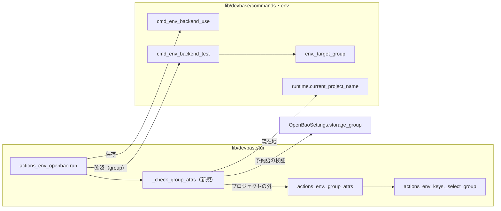
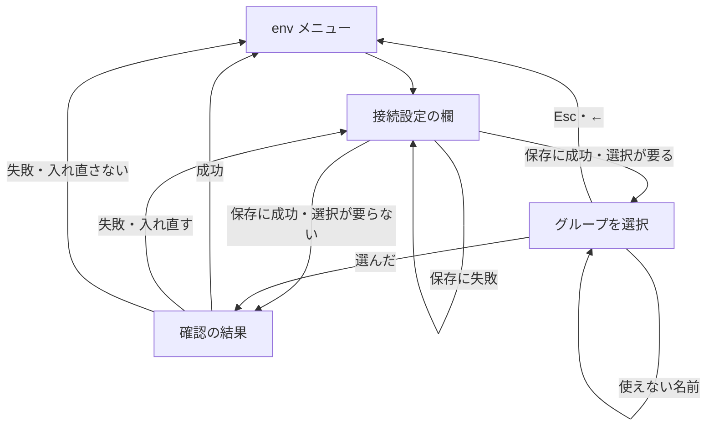
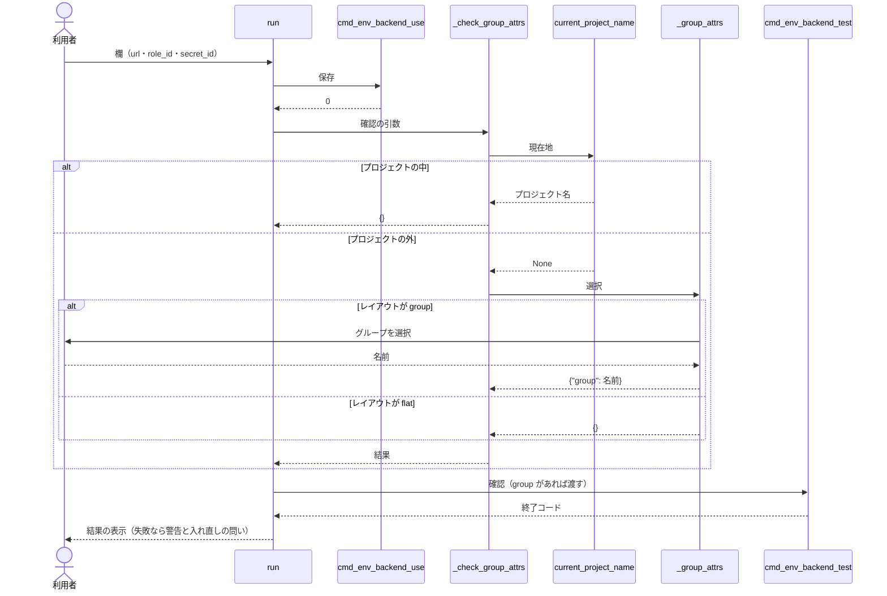

# #386: TUI の OpenBao の接続設定で、保存の後の確認に対象のグループを渡す

要求と受け入れ条件は #386 の本文にある（コピーは `issues/issue-386-requirements.md`）。この文書は「どう作るか」だけを扱う。

## ドメインモデル

### コンテキスト

| コンテキスト | 何の語が 1 つの意味に決まるか |
| --- | --- |
| 機密の置き場（`lib/devbase/env/`・`lib/devbase/commands/env*.py`） | 対象のグループ・グループの宣言・レイアウト・ブートストラップ機密 |

TUI（`lib/devbase/tui/`）は独自の語を持たず、CLI のハンドラへ引数を集めて委譲する（`actions_env.py` の冒頭の説明）。
そのため、この変更は 1 つのコンテキストの中に収まる。

### 集約

| 集約 | 持ち主（書き換えてよいもの） | 根 | エンティティ | 値オブジェクト |
| --- | --- | --- | --- | --- |
| 接続設定 | `env backend use`（`cmd_env_backend_use`） | `secrets/backend.yml` の `BackendConfig` | ブートストラップ機密（`secrets/bootstrap.env.age`） | `OpenBaoSettings`（`url`・`layout`・`group_aliases`） |

この変更は集約を書き換えない。TUI の接続設定の画面は、保存を `env backend use` へ、確認を `env backend test` へ委譲する
だけで、確認に渡す引数（`group`）を 1 つ増やす。

### 不変条件

| # | 集約 | 条件 | 破れたときの扱い |
| --- | --- | --- | --- |
| I1 | 接続設定 | 確認に渡す対象のグループは、利用者がその場で選んだもの。TUI が候補の 1 つを黙って選ばない | 実装の誤り。テストで落とす |
| I2 | 接続設定 | グループの選択を出すのは、レイアウトが `group` で、かつ現在地（`PWD`）がプロジェクトの外のときだけ | 実装の誤り。テストで落とす |
| I3 | 接続設定 | 保存に成功した設定は、確認の失敗・グループの選択の中止のどちらでも残る | 実装の誤り。テストで落とす |
| I4 | 接続設定 | `env backend test` がプロジェクトの外で `--group` を求める規則（`_target_group`、#315）は変えない | 範囲外の変更。差分に入れない |

### ドメインイベント

| # | イベント | 発生元 | 受け手 |
| --- | --- | --- | --- |
| E1 | 利用者が接続設定の欄（url・role_id・secret_id）を入れた | 接続設定の画面（`actions_env_openbao.run`） | 同じ画面（E2 へ進むか判定する） |
| E2 | 接続設定を保存した | `env backend use openbao` | 接続設定の画面 |
| E3 | 対象のグループを決めた（I2 の条件のときだけ） | グループの選択（`actions_env._group_attrs`） | 接続設定の画面（E4 の引数にする） |
| E4 | 接続を確かめた | `env backend test`（E3 があればそのグループを `group` で受ける） | 接続設定の画面 |
| E5 | 読めた参照を表示して終えた | `env backend test` | 利用者 |

要求の前提 4（E3 を E2 の前に置くか後に置くか）は、E2 の後・E4 の直前に置く（決定 1）。

### 用語

| 用語 | 意味 | 用語集への反映 |
| --- | --- | --- |
| 対象のグループ | 1 回の操作が読み書きするグループ。ここでは確認が読む参照のグループ | 既存（意味は変えない） |
| グループの宣言 | `projects/<name>/env` の `DEVBASE_ACCOUNT_GROUP`。プロジェクトの中での対象のグループの出所 | 既存（意味は変えない） |
| レイアウト | 置き場のパスの並び。`flat`（`version: 1`）と `group`（`version: 2`） | 既存（意味は変えない） |

## 機能一覧

| # | 機能 | 誰が使うか |
| --- | --- | --- |
| F1 | レイアウトが `group` の端末で、プロジェクトの外から開いた TUI の接続設定を保存した後、対象のグループを選んで接続を確かめる | backend が openbao の端末の利用者 |
| F2 | F1 のグループの選択で戻り、確認をせずに env メニューへ戻る | F1 と同じ |

レイアウトが `flat` のとき・プロジェクトの中のときの振る舞いは変えない（機能を足さない）。

## 構成要素

| 要素 | 責務 | 変更 |
| --- | --- | --- |
| `actions_env_openbao.run` | 欄の入力 → 保存 → 対象のグループの決定 → 確認 → 結果の表示。グループの選択で戻ったら確認をせずに終える | 変える |
| `actions_env_openbao._check_group_attrs`（新規） | 確認に渡す引数を決める。プロジェクトの中なら `{}`、外なら `actions_env._group_attrs` の結果。選んだ名前を置き場の `storage_group` でも検証し、通らなければ検証の文を出して選び直させる（決定 5） | 作る |
| `actions_env._group_attrs` | レイアウトが `group` なら対象のグループを選ばせ `{"group": 名前}` を返す。それ以外は `{}`。使えない名前は検証の文を出して選び直させる | 変えない（呼び出し元が 1 つ増える） |
| `runtime.current_project_name` | 現在地（`PWD`）からプロジェクト名を決める | 変えない |
| `cmd_env_backend_test` | `group` を受けて対象のグループを決め、参照を読む | 変えない（I4） |
| `tests/cli/tui/test_actions_env_openbao.py` | AC1〜AC7 を固定する | 変える |

### 呼び出し元の一覧

| 呼び出し元 | 呼び出し先 | 変更 |
| --- | --- | --- |
| `run` | `cmd_env_backend_use`（`_use` → `_dispatch_backend`） | 変えない |
| `run` | `_check_group_attrs` | 足す |
| `_check_group_attrs` | `runtime.current_project_name` | 足す |
| `_check_group_attrs` | `actions_env._group_attrs` | 足す |
| `_check_group_attrs` | `SecretStore(root).config.openbao.storage_group` | 足す |
| `actions_env._group_attrs` | `actions_env_keys._select_group` | 変えない |
| `run` | `cmd_env_backend_test`（`_dispatch_backend(root, "test", **attrs)`） | 引数を足す |
| `cmd_env_backend_test` | `env._target_group` | 変えない |

## 構造

型は増やさない。`run` の中の処理の順序と、戻り値の 1 つの経路（グループの選択で戻る）を足す。

| 関数 | 入力 | 出力 |
| --- | --- | --- |
| `_check_group_attrs(devbase_root)` | DEVBASE_ROOT | `{}` / `{"group": 名前}`。グループの選択の Esc・← は `flow.BackOut`、Ctrl-C は `flow.CancelAll` を投げる（`_select_group` の `flow.need` がそのまま投げる） |

`_check_group_attrs` は終了コードを持たない。`validate_account_group` で使えない名前の文は `_group_attrs` が出す。
`storage_group` で使えない名前（予約語の `global` / `projects`）の文は `_check_group_attrs` が `_group_attrs` と同じ形
（「--group に使えない名前です: ...」）で出し、`_group_attrs` を呼び直して選択へ戻る。

## 入出力の契約

### CLI

変えない。`env backend test` の引数・終了コード・出力は同じである。TUI は CLI の `--group` と同じ属性 `group` を
`dispatch_group` 経由で渡す（`cmd_env_backend` が `getattr(args, 'group', None)` で読む）。

### 画面

増える画面は 1 つで、sync / init と同じグループの選択を使う。

| 画面 | 役割 | 出る条件 |
| --- | --- | --- |
| グループを選択 | 確認に使う対象のグループを選ぶ。候補は宣言済みのプロジェクトのグループと「名前を入力」 | 保存に成功し、レイアウトが `group` で、現在地がプロジェクトの外のとき |

| 項目 | 規則 |
| --- | --- |
| グループの名前（「名前を入力」） | `validate_account_group` で検証する。通らなければ「--group に使えない名前です: ...」を出して選択へ戻る（`_group_attrs` の今の振る舞い）。通った名前は `storage_group` でも検証し、名前が予約語の `global` / `projects` なら同じ文を出して選択へ戻る（`_check_group_attrs`。決定 5） |
| グループの選択で戻ったときの文 | 「接続を確かめずに戻ります。保存した設定は残っています」（INFO ではなく `print`。入れ直しの問いは出さない） |

## 処理の流れ

この図には、呼び出しの内側にある `_select_group`（`_group_attrs` の中）と `_target_group`（`cmd_env_backend_test` の中）、
およびテストのファイルを描かない。

グループの選択で Esc・← を押すと、`_check_group_attrs` から `flow.BackOut` が上がる。`run` はこれを確認の直前で受け、
戻ったときの文を出して `0` を返す（決定 3）。Ctrl-C の `flow.CancelAll` は受けず、今どおり `collect_args` が `None` へ
変える。

入れ直しの問いで「はい」を選ぶと欄の入力へ戻り、次に保存した後でもう一度グループを選ぶ（決定 2）。

## 決定の記録

### 決定 1: グループは保存の後、確認の直前に選ばせる

対象のグループは確認にだけ使い、保存には使わない。欄の入力の前に選ばせると、空のまま確定した「変更はありません」の
経路や、保存に失敗して欄へ戻る経路でも選択が 1 段増え、使わない入力を求めることになる。保存の後に置けば、選択で戻った
ときに「保存した設定は残っています」が事実と一致する（要求の前提 3）。

欄の入力の前に選ぶ形は、使わない経路にも選択を出すため採らない。

根拠: Mission（MVV 版 1）

### 決定 2: 入れ直したときは、保存のたびにグループを選び直させる

確認の失敗の原因が、選んだグループの参照を読めないこと（グループ単位のポリシーで 403）である場合がある。最初の選択を
覚えて使い回すと、利用者がグループを選び直す手段が無い。選び直しは 1 段で、sync / init と同じ部品で済む。

最初に選んだグループを画面の中で覚えて使う形は、選び直せなくなるため採らない。

根拠: Value 3（MVV 版 1）

### 決定 3: グループの選択で戻ったら、文を出して 0 を返す

保存は成功しており、利用者が自分で確認をやめただけである。`ARG_CANCEL` を返すと `menu_loop` が一時停止せずに env
メニューを出し直し、「保存した設定は残っています」の文を読む前に画面が替わる。`0` を返すと一時停止の後に env メニューへ
戻り、文を読める。入れ直しの問いは出さない（要求の前提 3）。

`ARG_CANCEL` を返す形は、文が読めないため採らない。

根拠: Mission（MVV 版 1）

### 決定 4: プロジェクトの中かどうかの判定は、接続設定の画面の側に置く

`_group_attrs` は sync / init と共有しており、プロジェクトの中でも選択を出す。そこへ判定を足すと sync / init の
振る舞いが変わり、要求の対象範囲（sync / init のグループの選択を変えない）を外れる。接続設定の画面に
`_check_group_attrs` を置き、プロジェクトの中なら `_group_attrs` を呼ばずに `{}` を返す。判定には CLI の
`_target_group` と同じ `runtime.current_project_name` を使い、TUI と CLI で「プロジェクトの中」の意味をそろえる。

`_group_attrs` に判定を足す形は、sync / init の振る舞いを変えるため採らない。

根拠: Value 3（MVV 版 1）

### 決定 5: グループの名前は `_check_group_attrs` が置き場の `storage_group` でも検証する

要求の前提 5・AC5 は、使えない名前を入れたら `--group` と同じ検証の文を出して選択へ戻ることを求めている。
`_group_attrs` は `validate_account_group` で検証して選択へ戻すが、`global` / `projects`（予約語。`RESERVED_STORAGE_GROUPS`）は
この規則を通る。そのまま渡すと `_target_group` の `storage_group` が `BackendConfigError` を投げ、`env backend test` が
終了コード 2 で返して、確認の失敗（警告と入れ直しの問い）になる。これは AC5 に反する。

そこで `_check_group_attrs` が、`_group_attrs` から受けた名前を `SecretStore(root).config.openbao.storage_group(名前)` に
通す。`BackendConfigError` なら「--group に使えない名前です: ...」を `logger.error` で出し、`_group_attrs` を呼び直して
選択へ戻る。`_target_group` と同じ関数を呼ぶため、TUI と CLI で使えない名前の範囲がそろう。読み替え先が予約語の
`group_aliases` は設定を読む時点で拒まれる（`OpenBaoSettings` の検証）ため、ここで落ちるのは予約語そのものの名前である。

`_group_attrs` に `storage_group` の検証を足す形は、sync / init の振る舞いを変え、要求の対象範囲（sync / init の
グループの選択を変えない）を外れるため採らない。検証を `env backend test` に任せる形は、AC5 を満たさないため採らない。

根拠: Mission（MVV 版 1）

## テスト設計

| 受け入れ条件・不変条件 | どの振る舞いで縛るか | どう壊したら落ちるべきか |
| --- | --- | --- |
| AC1 | レイアウトが `group`・現在地がプロジェクトの外で、到達できる url を保存してグループを選ぶと、終了コード 0 で「読めた参照」が出る。警告と入れ直しの問いが出ない | 確認に `group` を渡さないように壊すと、終了コード 2 と警告が出て落ちる |
| AC2・I1 | 確認が受け取る `group` が、選択で選んだ名前と一致する（選んだグループの参照を読む） | 候補の先頭を黙って渡すように壊すと、選んだ名前と違う値で落ちる。選択を出さずに渡すと、台本の select が残って落ちる |
| AC3・I3 | レイアウトが `group` で、誤った secret_id を保存してグループを選ぶと、警告と入れ直しの問いが出る。保存した secret_id は残る | 確認の失敗を成功として扱うように壊すと、問いが出ずに落ちる |
| AC4・I3 | グループの選択で戻ると、`env backend test` が呼ばれずに戻る。保存した設定は残り、入れ直しの問いは出ない | 戻った後に確認を呼ぶ・入れ直しの問いを出す・`ARG_CANCEL` を返すように壊すと落ちる |
| AC5 | 「名前を入力」に使えない名前（`validate_account_group` で落ちる名前と、予約語の `global`）を入れると、`--group` と同じ検証の文が出てグループの選択へ戻る。どちらの場合も `env backend test` は呼ばれず、入れ直しの問いは出ない | 検証を外すと、使えない名前で確認が呼ばれて落ちる。`_check_group_attrs` の `storage_group` の検証を外すと、`global` で終了コード 2 と入れ直しの問いが出て落ちる |
| AC6・I2 | レイアウトが `flat` では、グループの選択が出ず、確認は `group` なしで呼ばれる。既存のテストが変更なしで通る | レイアウトを見ずに選択を出すと、台本に無い select で落ちる |
| AC7・I2 | レイアウトが `group` で、現在地が宣言のあるプロジェクトの中なら、グループの選択が出ず、確認は宣言のグループで成功する | プロジェクトの中でも選択を出すように壊すと、台本に無い select で落ちる |
| AC8 | `uv run --locked pytest tests/ -q` が通る | — |
| I4 | `cmd_env_backend_test` と `_target_group` に差分が無い | 差分のレビューで見る（テストを持たない） |

## 設計の結果

| 課題 | 扱い | 取り込み先 | 触るファイル |
| --- | --- | --- | --- |
| #386 | 実装する | — | `lib/devbase/tui/actions_env_openbao.py`、`tests/cli/tui/test_actions_env_openbao.py` |

## 未確認のまま残ること

| 項目 | 内容 |
| --- | --- |
| 実機での確認 | `version: 2` の端末で `DEVBASE_ROOT` から TUI を開いて保存し、グループを選ぶと「読めた参照」が出ることは、リリース後テストで確かめる |
