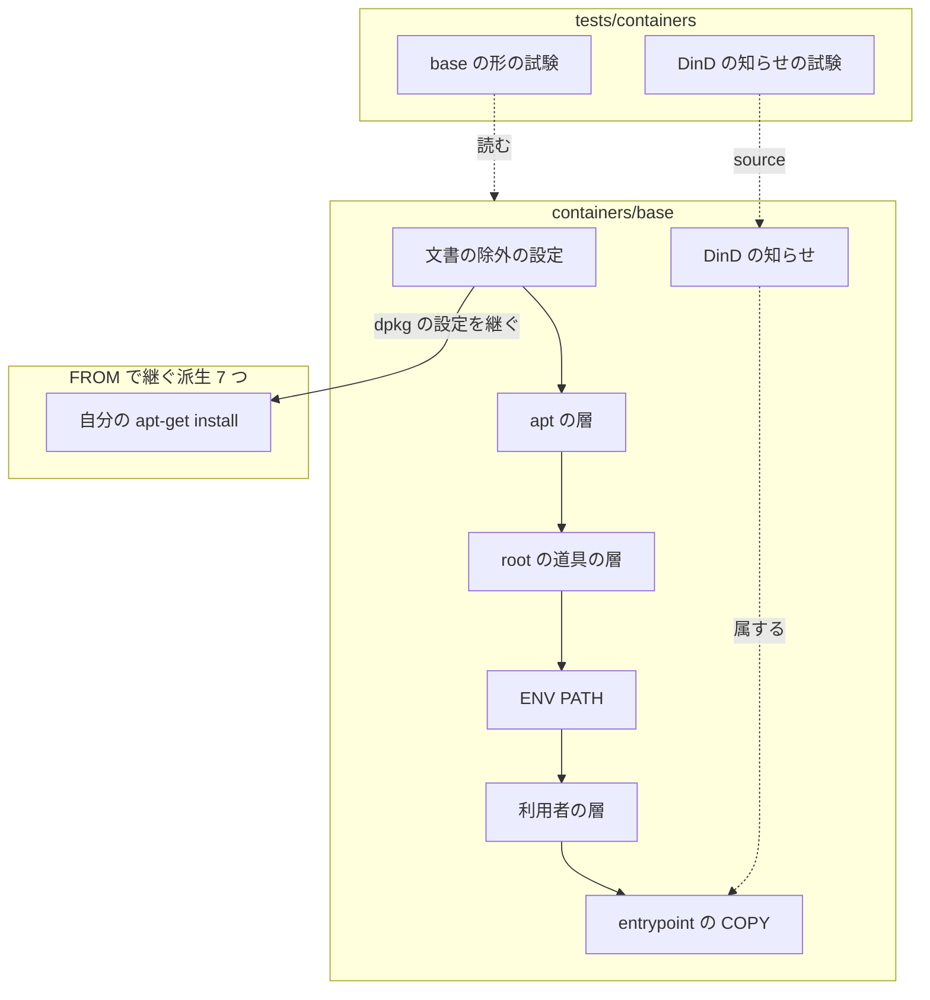
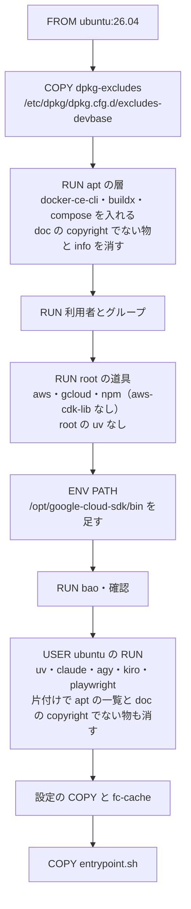
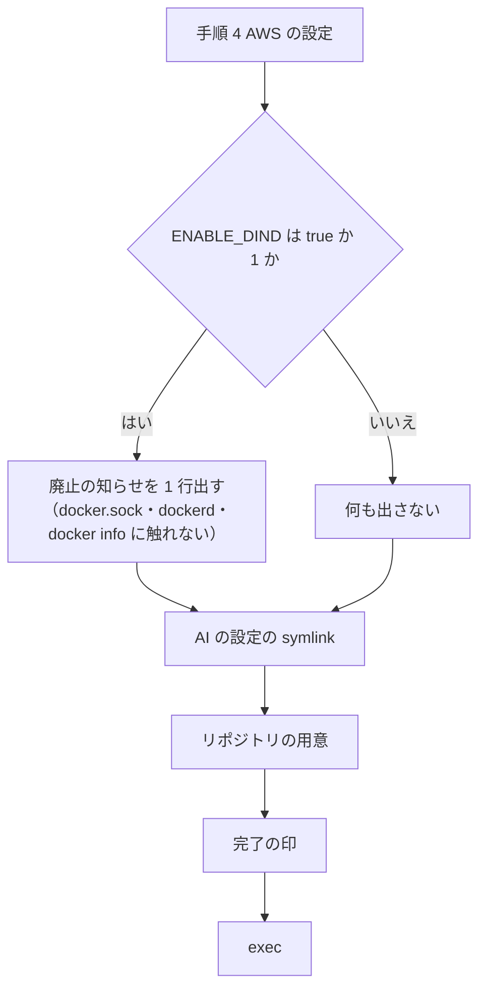
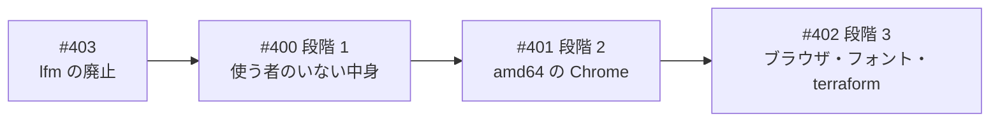

# base イメージ: 誰も使わない dockerd・aws-cdk-lib・root の uv・node のヘッダと片付けの漏れで展開後の大きさが約 0.5GB 余分にある → 外して arm64 で 450MB 以上小さくし、使う者のいない DinD を廃止する（#400）

## 目的

- **何が壊れているか**: base に、使う者が見当たらない中身と片付けの漏れが合わせて約 525MB ある。dockerd・containerd・グローバルの `aws-cdk-lib`・root の uv・node のヘッダと、apt の一覧である
- **誰が困るか**: base とその派生を建てる・取得する・置くすべての利用者。建てる時間とディスクを、誰も使わない中身の分だけ払っている
- **直すと何が成り立つか**: base の展開後の大きさが arm64 で 450MB 以上減る。docker CLI・buildx・compose・`cdk`・uv は今と同じに使える。`ENABLE_DIND` は廃止を 1 行で知らせて起動を続ける

## 適用範囲

- **働く範囲**: このリポジトリの `containers/base` と、それを `FROM` で継ぐ派生 7 つ。利用者が base を建て直した時点で届く。lfm は #403 で #400 より先に無くなるため含まない（決定 3）
- **プロジェクトごとに違うもの**: 無し（イメージの中身だけを変え、プロジェクトの設定・引数を読まない）
- **当たるモード**: `standard`

## あるべき姿の根拠

| 根拠 | 種類 | 何を示すか |
| --- | --- | --- |
| `docker run --rm --entrypoint bash devbase-base:latest` で測った値（2026-10-03・arm64）: `/usr/include/node` 67MB・`/usr/share/doc` 8.0MB・`/usr/share/info` 940KB・`/var/lib/apt/lists` 42MB・グローバルの `aws-cdk-lib` 181MB | 実測 | 外す中身の大きさ。docker-ce 106MB・containerd 81MB・root の uv 40MB は課題の本文の実測 |
| 同じコンテナの `/etc/dpkg/dpkg.cfg.d/excludes` が既に `man`・翻訳の `.mo`・`doc`（copyright と changelog を除く）を外している。`/usr/share/man` の下のファイルは 0。`/usr/share/doc` には copyright と `changelog*` のほかに 40 個のファイルと symlink が残る（`apt/NEWS.Debian.gz`・`gnupg/TODO`・`gnupg/examples/*`・`base-files/FAQ`・`libavahi-common3/README`・`python3/README.Debian`・`fonts-dejavu-core/*` などのファイルと、`libgcc-s1`・`libpython3.14` などの symlink）（2026-10-03・arm64 で `find /usr/share/doc ! -type d ! -name copyright ! -name 'changelog*'` を数えた） | 実測 | 文書の除外で足すのは changelog・info・`/usr/include/node` の 3 つ。dpkg の規則だけでは既に残る物が消えないため、最初の `RUN` と利用者の層で `/usr/share/doc` の下の copyright でないファイルと、ディレクトリを指さない symlink を消す（ディレクトリを指す symlink は copyright への経路なので残す。決定 4） |
| `grep -rIl ENABLE_DIND` を `repos/*/`・`projects/*/` の compose.yml・env・.env にかけて 0 件。当たった compose の注記 1 件はホストの dockerd を指す | 実測 | `ENABLE_DIND` を設定する者がいない |
| #403 の本文: lfm を使うプロジェクトは無く、利用者が 2026-10-03 に lfm の廃止を決めた。Dockerfile を読む試験の部品（`Instruction` / `parse`）をテストの共通の置き場へ移す | 利用者の指示 | DinD を前提に作られた唯一の派生が無くなる。#400 の試験は移した先の部品を使える |
| #400 への利用者のコメント（2026-10-03）: lfm は #403 で先に廃止する。lfm への影響は考えなくてよい | 利用者の指示 | #400 は lfm のファイル・試験・仕様が無い状態から始める |
| 設計の起動の指示「DinD を廃止するかは …… grep して使う者の有無で決める」 | 利用者の指示の原文 | DinD の扱いを使う者の有無で決める |

要求と受け入れ条件は #400 の本文にある（コピーは `issues/issue-400-requirements.md`）。この文書は「どう作るか」だけを扱う。
設計の中で要求の前提 1 を「DinD を lfm に残す」から「DinD を廃止する」へ改め、本文の「変更の記録」に残した（決定 1）。

## ドメインモデル

### コンテキスト

| コンテキスト | 何の語が 1 つの意味に決まるか |
| --- | --- |
| イメージの継承（`image-lineage`） | base の中身・文書の除外・展開後の大きさ・DinD。base が入れる物と、派生へ届く道筋 |
| コンテナの起動（`container-start`） | entrypoint が起動のたびに行う用意。`ENABLE_DIND` の読み方 |

イメージの継承が供給者、コンテナの起動が顧客の関係（顧客 / 供給者）。entrypoint は base が入れた物だけを前提に動く。
base が dockerd を入れなくなるため、entrypoint は dockerd を起こす手順を持たない。

### 集約

| 集約 | 持ち主（書き換えてよいもの） | 根 | エンティティ | 値オブジェクト |
| --- | --- | --- | --- | --- |
| base の中身 | `containers/base/Dockerfile` | base イメージ | apt のパッケージ・npm のグローバルのモジュール・root と ubuntu の道具 | 文書の除外の設定・片付けの対象のパス・`PATH` |
| 起動の用意 | `containers/base/entrypoint.sh` | 起動の手順 | DinD の知らせ | `ENABLE_DIND` の値 |

### 不変条件

| # | 集約 | 条件 | 破れたときの扱い |
| --- | --- | --- | --- |
| I1 | base の中身 | apt で `docker-ce`・`containerd.io` を入れず、`docker-ce-cli`・`docker-buildx-plugin`・`docker-compose-plugin` を入れる | 実装の誤り。試験がパッケージの名前を挙げて落ちる |
| I2 | base の中身 | npm のグローバルに `aws-cdk-lib` を入れず、`aws-cdk` を入れる | 同上 |
| I3 | base の中身 | uv のインストーラを呼ぶのは `USER ubuntu` の後の `RUN` だけで、`ENV PATH` に `/root/.local/bin` が無い | 同上 |
| I4 | base の中身 | apt の一覧を取得する `RUN`（`apt-get update` か `--with-deps` を含み、`/var/lib/apt` を cache mount しないもの）は、同じ `RUN` で `/var/lib/apt/lists` を消す | 同上。どの `RUN` かを挙げて落ちる |
| I5 | base の中身 | 文書の除外の設定が、最初の `RUN` より前に Ubuntu の `excludes` より後に読まれる名前で置かれ、copyright を残して changelog・info・man・`/usr/include/node` を外す。最初の `RUN` と利用者の層の `RUN` は、`/usr/share/doc` の下の copyright でないファイルと、ディレクトリを指さない symlink を消す（利用者の層は `sudo` で消す）。ディレクトリを指す symlink は残し、`/usr/share/doc/<パッケージ>/copyright` の経路を保つ | 同上 |
| I6 | base の中身 | `containers/base/dind` が無く、Dockerfile は `/usr/local/bin/dind` を置かない | 同上 |
| I7 | 起動の用意 | `ENABLE_DIND` が `true` か `1` のとき、DinD の廃止を 1 行出して起動を続ける。dockerd を起こさず、`/var/run/docker.sock` を消さず、`docker info` を待たない | 実装の誤り。entrypoint の試験で落とす |
| I8 | 起動の用意 | `ENABLE_DIND` が無い・`true` と `1` 以外のとき、何も出さず、起動の手順と順序は変わらない | 同上 |

### ドメインイベント

| # | イベント | 発生元 | 受け手 |
| --- | --- | --- | --- |
| E1 | 変更前の base を建て、展開後の大きさを測った | 実装の担当（main の Dockerfile） | E5 の比べる元 |
| E2 | 変更後の base を arm64 で建てた | 実装の担当（この変更の Dockerfile） | E3・E4・E6・E8 |
| E3 | 変更後の base を amd64 で建てた | 実装の担当 | E4 |
| E4 | 建てた base の中身を確かめた | 実装の担当 | PR の記録 |
| E5 | 展開後の大きさを測り、減った量を PR に記録した | 実装の担当 | PR の記録・承認する人 |
| E6 | 変更後の base から派生イメージを建てた | 実装の担当 | PR の記録 |
| E7 | （#403 で対象が無くなったため削除） | — | — |
| E8 | base で `ENABLE_DIND=true` のコンテナを起こし、廃止の知らせが出て起動が続いた | entrypoint | PR の記録 |
| E9 | 利用者が base を建て直した | 利用者（main へのマージの後） | リリース後テスト |

### 用語

| 用語 | 意味 | 用語集への反映 |
| --- | --- | --- |
| DinD | コンテナの中で dockerd を起こし、そのコンテナの中だけの docker を使う形。#400 で廃止し、`ENABLE_DIND` は知らせを 1 行出すだけになった。ホストの docker.sock を mount して使う形と区別する | 意味の変更（`image-lineage`） |
| 文書の除外 | dpkg の `path-exclude` の設定で、apt が入れるパッケージから文書などの置き場を展開しないこと。base は Ubuntu の `excludes` に加え、changelog・info・`/usr/include/node` を外す（copyright は残す）。base を `FROM` で継ぐ派生イメージにも効く | 意味の変更（`image-lineage`） |
| 展開後の大きさ | 建てたイメージから作ったコンテナで `du -sbx /` を測ったバイト数。`docker images` の圧縮後の大きさとは違う | 新規（`image-lineage`） |

意味の文はこの表が正本で、`docs/glossary/glossary.json` の `meaning` はこの表の文と同じ文にする（コードの印の backtick だけを除く）。

## 機能一覧

| # | 機能 | 誰が使うか |
| --- | --- | --- |
| F1 | base を建てると、dockerd・containerd・グローバルの `aws-cdk-lib`・root の uv が入らない | base と派生を建てる利用者 |
| F2 | base と派生で、apt が入れるパッケージの changelog・info・man・node のヘッダが展開されない | 同上 |
| F3 | base の最後の利用者の層に apt の一覧が残らない | 同上 |
| F4 | docker CLI・buildx・compose・`cdk`・ubuntu の uv が今と同じに使える | コンテナの中で作業する利用者 |
| F5 | `ENABLE_DIND` を設定したままの利用者に、DinD の廃止を 1 行で知らせ、起動は止めない | `ENABLE_DIND` を設定していた利用者 |

## 構成要素

型（クラス）は持たない。Dockerfile の命令と、entrypoint のシェル関数だけで構成する。

| 要素 | 責務 | 変更 |
| --- | --- | --- |
| 文書の除外の設定（`containers/base/dpkg-excludes`、新規） | `/etc/dpkg/dpkg.cfg.d/excludes-devbase` として置かれ、Ubuntu の `excludes` の後に読まれて changelog・info・man・`/usr/include/node` を外し、copyright を残す（決定 4） | 作る |
| base の Dockerfile の apt の層（最初の `RUN`） | 文書の除外の設定を `COPY` で先に置き、`docker-ce`・`containerd.io` を一覧から外す。同じ `RUN` の最後で `/usr/share/doc` の下の copyright でないファイルとディレクトリを指さない symlink（changelog を含む）と `/usr/share/info` の中身を消す。ディレクトリを指す symlink は残す（決定 4） | 変える |
| base の Dockerfile の root の道具の層（2 つ目の大きな `RUN`） | root の uv のインストーラの呼び出しと、npm の `aws-cdk-lib` を外す | 変える |
| base の Dockerfile の `ENV PATH` | `/root/.local/bin` を外す（決定 6） | 変える |
| base の Dockerfile の利用者の層 | 片付けに `/var/lib/apt/lists/*` を足す（決定 7）。同じ片付けで `/usr/share/doc` の下の copyright でないファイルとディレクトリを指さない symlink を `sudo find` で消す。`USER ubuntu` の下で動き、apt が root 所有で作る物は `sudo` なしでは消せず `set -e` でビルドが止まるため（決定 4） | 変える |
| base の Dockerfile の最後の `COPY` | `dind` の `COPY` を外し、`entrypoint.sh` だけを置く | 変える |
| `containers/base/dind` | — | 消す |
| entrypoint の DinD の知らせ（`devbase_notice_dind_removed`、新規） | `ENABLE_DIND` が `true` か `1` なら廃止を 1 行出して 0 で返る。それ以外は何も出さずに 0 で返る。`DEVBASE_ENTRYPOINT_LIB_ONLY` で source した試験から呼べる（決定 2） | 作る |
| entrypoint の本体の手順 5 | dockerd を起こす分岐を消し、DinD の知らせを呼ぶ 1 行にする。手順 4 と AI の設定の間という位置は変えない | 変える |
| base の形の試験（`tests/containers/test_base_dockerfile_slim.py`、新規） | I1〜I6 を Docker を起こさずに固定する。Dockerfile の読み方は #403 が共通の置き場へ移した `Instruction` / `parse` を import する（決定 5） | 作る |
| DinD の知らせの試験（`tests/containers/test_entrypoint_dind_removed.py`、新規） | I7・I8 を固定する | 作る |
| base のシェルスクリプトの数え上げ（`tests/containers/test_base_shellcheck_ci.py`・`.github/workflows/ci.yml`・`docs/developer/contributing.md`） | ShellCheck の対象の並びから `dind` を外す | 変える |
| 確定仕様（`docs/specifications/base-image-shellcheck.md`・`ci-checks.md`） | 2 回目の apt の一覧・`dind` の ShellCheck・`SC2009` の抑止の記述を今の形へ直す | 変える |
| 用語集（`docs/glossary/glossary.json`） | DinD・文書の除外の意味を直し、展開後の大きさを `image-lineage` に新しく載せ（意味は用語の表の文のまま）、`glossary.py render` で `docs/glossary.md` を作り直す | 変える |
| `CHANGELOG.md` の `[Unreleased]` | 外した中身と、DinD の廃止（破壊的変更・ホストの docker.sock を使う）を書く | 変える |



## 構造

```text
containers/
├── base/
│   ├── Dockerfile          変える
│   ├── dpkg-excludes       新規
│   ├── dind                消す
│   └── entrypoint.sh       変える
tests/containers/
├── test_base_dockerfile_slim.py      新規
├── test_entrypoint_dind_removed.py   新規
└── test_base_shellcheck_ci.py        変える
```

## 処理の流れ

### base を建てる順（変更後）



建てる流れと起動の流れに乗らない要素（試験・ShellCheck の対象の並び・確定仕様・用語集・`CHANGELOG.md`）は図に含めない。

`playwright install --with-deps` の `apt-get` も文書の除外の設定に従うため、その層でも文書は展開されない。

### コンテナの起動（`ENABLE_DIND` の扱い）



知らせの文は 1 行で、`ENABLE_DIND` が廃止されたことと、ホストの docker.sock を使うこと（`docker` はそのまま使える）を含める。
文言は実装で決める。

## 非機能の実現方式

| 大項目 | 要求の条件 | 実現方式 | 確かめ方 |
| --- | --- | --- | --- |
| 性能・拡張性 | arm64 で展開後の大きさが 450MB 以上減る | 下の内訳の 7 つを外す。見込みは合わせて約 525MB で、450MB に約 75MB の余裕がある | 前提 8 の形で前後の base から作ったコンテナで `du -sbx /` を測り、差と内訳を PR に記録する |
| 移行性 | 利用者は base を建て直すだけで移る。戻すときは前の Dockerfile で建て直す | 変えるのはイメージの中身と entrypoint だけで、ボリューム・設定・機密の形を変えない。`ENABLE_DIND` を残した利用者は起動が止まらず、知らせで気づく | 建て直した base で既存の entrypoint の試験が通ること・E8 の起動の出力を PR に記録する |
| システム環境 | arm64 と amd64 の両方で建ち、受け入れ条件 1〜5 を満たす | アーキの `case` を足さない。外すのはアーキに依らない行だけで、文書の除外もアーキに依らない | arm64 で建てて 1〜6・8・9 を、amd64 で建てて 1〜5 を確かめ、amd64 の端末と方法を PR に書く |

見込みの内訳（arm64）:

| 中身 | 大きさ | 出所 |
| --- | --- | --- |
| `docker-ce`（dockerd） | 106MB | 課題の本文 |
| `containerd.io` | 81MB | 課題の本文 |
| グローバルの `aws-cdk-lib` | 181MB | 実測（2026-10-03） |
| root の uv | 40MB | 課題の本文 |
| `/var/lib/apt/lists` | 42MB | 実測 |
| `/usr/include/node` | 67MB | 実測 |
| `/usr/share/doc` の changelog と `/usr/share/info` | 約 9MB | 実測（8.0MB と 940KB） |
| 合計 | 約 525MB | — |

`docker-ce` が依存で引き込んでいたパッケージ（`iptables` など）も、他に要る物が無ければ入らなくなる。この分は見込みに含めない。

## 同じスプリントの課題との順と境目

### 実装の順

- **#403 → #400 → #401 → #402 の順に 1 本ずつマージする。** 後の課題は、前の課題がマージされた main を取り込んでから建てて測る。
  大きさの比べる元は、その時点の main で建てた base である
- **#400 の 450MB は arm64 で測る。** #401 は amd64 だけを変えるため、#400 の測りに #401 は入らない
- **#400 は #403 の後の main から始める。** lfm・`test_lfm_base_settings.py`・`lfm-base-settings.md` は既に無く、#400 は lfm に触れない。前提 8 の「前」の base も #403 の後の main で建てる



### Dockerfile の行の持ち主

#401・#402 は base の Dockerfile の同じ層を触る。#403 は #400 より先に入り、lfm を前提にした行を片付ける。行ごとに持ち主を 1 つに決め、他の課題の行には触れない（決定 8）。
行番号は main の `9f3e5c5` の `containers/base/Dockerfile` で数えた。#403 の後の main では行がずれるため、実装の担当は中身で読み替える。

| 場所（行） | 中身 | 持ち主 |
| --- | --- | --- |
| 最初の `RUN` の前（新しい `COPY`） | 文書の除外の設定 | #400 |
| 22 | `fonts-noto-cjk-extra` | #402 |
| 23〜25 の後（最初の apt の一覧） | `fonts-liberation` などの明示 | #402 |
| 37〜43 | Docker の apt の取得元 | 変えない（CLI・buildx・compose に要る） |
| 44〜48 | HashiCorp の apt の取得元 | #402 |
| 56〜67 | amd64 の Chrome の取得元と `BROWSER_PKG` | #401 |
| 71 | `docker-ce`・`containerd.io` | #400（`docker-ce-cli` は残す） |
| 73 | `terraform` | #402 |
| 73 | `$BROWSER_PKG` | #401 |
| 75〜76 の後 | `/usr/share/doc` の下の copyright でないファイルとディレクトリを指さない symlink・`/usr/share/info` の中身の削除 | #400 |
| 84〜89・111〜113・247〜251・259 | lfm を前提にした注記と `NPM_GID` | #403（先に入る。#400 は触らない） |
| 155〜156 | root の uv | #400 |
| 159 | `aws-cdk-lib` | #400 |
| 177 | `/root/.local/bin` | #400 |
| 234〜235 | Playwright の Chromium と `--with-deps` | #402 |
| 236〜245 | 片付け（`/var/lib/apt/lists/*` と `/usr/share/doc` の下の copyright でない物の削除を足す。どちらも `sudo` で消す） | #400。注記の `--with-deps` の語は #402 |
| 304〜308 | `fc-cache` の注記 | #402 |
| 310〜312 | `dind` の `COPY` | #400 |

### Dockerfile の外で重なるもの

| 場所 | 重なり | 扱い |
| --- | --- | --- |
| `docs/specifications/base-image-shellcheck.md` の 2 回目の apt の一覧の行 | #400（`docker-ce` → `docker-ce-cli`）・#401（Chrome）・#402（`terraform`） | 後から入る側が main を取り込み、前の課題の直しを残して自分の語を直す |
| `tests/containers/test_base_dockerfile_playwright.py` | #401・#402 | #400 は触らない。#400 の試験は新しいファイルに置く |
| Dockerfile の読み方の部品（`Instruction` / `parse`） | #403（`test_lfm_base_settings.py` から共通の置き場へ移す）・#400（import する） | #400 の試験は #403 が移した先を import する。部品は直さない |
| `CHANGELOG.md`・`docs/glossary/glossary.json` | 4 つすべて | 両側の記入を残して解く。`docs/glossary.md` は `glossary.py render` で作り直す |

## 決定の記録

### 決定 1: 使う者の有無で決めるため、DinD を廃止し、`dind` と dockerd を起こす分岐を消す

`ENABLE_DIND` を設定する者は、リポジトリ・手元のプラグイン・手元のプロジェクトに 0 件である。DinD を前提に作られた
lfm は使う者が無く、#403 で #400 より先に廃止する。lfm は自分で dockerd を入れ、NVIDIA の runtime を DinD 向けに書いていた。
DinD を残しても動かす先が無く、`dind` と分岐は誰も通らない経路として base とすべての派生に配られ続ける。要求の前提 1 は
lfm が残る前提で書かれていたため、課題の本文を改め「変更の記録」に残した。

dockerd を入れた新しい派生へ DinD を移す形は採らない。移す先を使う者がいない。lfm に残す形は、lfm ごと消えるため採らない。

根拠: Value 1 / P1（MVV 版 1）

### 決定 2: 設定を残した利用者が原因に気づけるよう、`ENABLE_DIND` は 1 行で知らせて起動を続ける

分岐を消すだけだと、`ENABLE_DIND` を残した利用者は DinD が起きない理由を知る手段が無い。起動を止めると、使っていない
設定の残りのためにコンテナが使えなくなる。知らせは関数に切り出し、既存の entrypoint の試験と同じく
`DEVBASE_ENTRYPOINT_LIB_ONLY` で source して呼べるようにする。

`ENABLE_DIND` を黙って無視する形と、起動を止める形は採らない。前者は原因が見えず、後者は作業を止める。

根拠: Mission（MVV 版 1）

### 決定 3: #403 の後に入れるため、lfm には触らない

利用者は m7c を #403 → #400 → #401 → #402 の順に入れると決め、#400 に「lfm への影響は考えなくてよい」とコメントした。
#400 の起点の main には lfm の 3 つが無い。`containers/lfm`・`tests/containers/test_lfm_base_settings.py`・
`docs/specifications/lfm-base-settings.md` である。base から `dind` を消しても、取り込む側が無いため壊れる物は無い。

#400 が先に入る場合に備えて、lfm から `dind` の取り込みの 2 行を消す形は採らない。順が決まっているため、
誰も通らない分岐を設計と PR に抱えるだけになる。

根拠: Value 1（MVV 版 1）

### 決定 4: 派生にも効かせて層の大きさから外すため、文書の除外を Ubuntu の `excludes` の後に読まれる別のファイルで置く

`ubuntu:26.04` は `/etc/dpkg/dpkg.cfg.d/excludes` で man・`.mo`・doc を既に外している。copyright と changelog だけは
`path-include` で残している。dpkg は後に読んだ規則を優先する。そのため `excludes` より後に並ぶ名前（`excludes-devbase`）の
ファイルで doc を外し直し、copyright だけを入れ直せば changelog が外れる。

同じファイルで `/usr/share/info/*`・`/usr/share/man/*`・`/usr/include/node/*` を外す。ファイルは
`containers/base/dpkg-excludes` に置き、最初の `RUN` の前に `COPY` する。

dpkg の規則だけでは受け入れ条件 5 の「copyright のほかのファイルが無い」を満たせない。今の base には changelog のほかに
`NEWS.Debian.gz`・`README`・`examples/*` などのファイルと、別のパッケージの置き場を指す symlink（`libgcc-s1` など）が
40 個残る（根拠の表の実測）。そのため最初の `RUN` の最後と利用者の層の片付けの両方で、
`find /usr/share/doc -mindepth 1 ! -type d ! -xtype d ! -name copyright -delete` を実行し、`/usr/share/doc` の下の
copyright でないファイルと、ディレクトリを指さない symlink（指す先の無い物を含む）を消す。`! -type d` は symlink を
含み、`! -xtype d` は指す先がディレクトリの symlink を外す。`libgcc-s1` などのディレクトリを指す symlink は、
条件 5 が残すと定める `/usr/share/doc/<パッケージ>/copyright` への経路なので消さない（指す先のディレクトリの copyright は
同じ削除で残る）。利用者の層は `USER ubuntu` の下の `set -eux` の `RUN` で動き、`/usr/share/doc` は apt が root 所有で
作るため、`sudo find /usr/share/doc ...` で消す（同じ層の `rm` が `sudo rm -rf` なのと同じ理由。`sudo` が無いと
Permission denied で `find` が 0 でなく終わり、ビルドが止まる）。最初の `RUN` は root で動くので `sudo` を付けない。
最初の `RUN` では `/usr/share/info` の中身も消す。利用者の層で消すのは、`playwright install --with-deps` の `apt-get` が入れる物を
同じ規則で片付けるためである。`FROM` の層にある分は層の大きさが減らないが、条件 5 を満たす。

翻訳（`/usr/share/locale`）は外さない。`.mo` は Ubuntu が既に外しており、残る `locale.alias` は glibc が読む。

| 採らない形 | 理由 |
| --- | --- |
| Ubuntu の `excludes` を書き換える | Ubuntu の持ち物を混ぜる |
| `RUN` の中で `printf` で書く | 試験がファイルとして読めない |
| 入れた後に `rm` する | 前の層に大きさが残る |

根拠: Value 1（MVV 版 1）

### 決定 5: 試験が外した物を名前で挙げるよう、base の形の試験を新しいファイルに置く

外した物ごとに 1 つの試験にし、Dockerfile へ戻すと名前を挙げて落ちる（受け入れ条件 11）。既存の
`test_base_dockerfile_playwright.py` などは #401・#402 が直すため、同じファイルに書くと並行する変更がぶつかる。
Dockerfile の読み方（命令への分け方）は新しく書かない。#403 が `test_lfm_base_settings.py` からテストの共通の置き場へ
移した部品（`Instruction` / `parse`）を import する。

根拠: Value 1（MVV 版 1）

### 決定 6: 空の置き場を指さないよう、`PATH` から `/root/.local/bin` を外す

root の uv を外すと `/root/.local/bin` に入る物が無くなる。`PATH` に残すと、何も入らない置き場を base とすべての派生に
配り続ける。この要素を名前で除外していた lfm の試験は #403 で消えているため、外しても他の試験は変わらない。

`PATH` を残す形は、理由の無い要素を配り続けるため採らない。

根拠: Value 1（MVV 版 1）

### 決定 7: #402 が Playwright を外しても壊れないよう、apt の一覧の片付けを規則で縛る

試験は I4 の規則を見る。「`/var/lib/apt` を cache mount せずに apt の一覧を取得する `RUN` は、同じ `RUN` で一覧を消す」
である。「利用者の層の片付けに `/var/lib/apt/lists` がある」は見ない。#402 が `--with-deps` を外すと、利用者の層は一覧を取得しなく
なり、規則は当たる `RUN` が無いまま通る。片付けの 1 語が残っても害は無く、#402 が消してもよい。

`--with-deps` の有無に関わらず利用者の層に片付けの語を求める形は、#402 の後に意味の無い要求になるため採らない。

根拠: Value 1（MVV 版 1）

### 決定 8: 並行する削減がぶつからないよう、#403 → #400 → #401 → #402 の順に 1 本ずつ入れ、Dockerfile の行の持ち主を分ける

#403 は lfm と、lfm を前提にした base の行を先に片付け、後の 3 つの比べる元から lfm を外す。#400 以下の 3 つは段階の
番号の順で、外す量の小さい順でもある。#400 は arm64 の測りが #401 に依らず、#401 は amd64 だけを触り、
#402 は Playwright と apt の一覧の両方を変える。後の課題ほど前の結果を前提にできる。`main` は strict で、続けて
マージすると後の 1 本が BEHIND になるため、1 本ずつ main を取り込み、建てて測り直してからマージする。行の持ち主は
「同じスプリントの課題との境目」の表に従う。

削減の 3 つを 1 本の PR にまとめる形は、測りが混ざり、どの削減が何を減らしたかを PR に記録できないため採らない。

根拠: Value 1 / P1（MVV 版 1）

## テスト設計

| 受け入れ条件・不変条件 | どの振る舞いで縛るか | どう壊したら落ちるべきか |
| --- | --- | --- |
| I1（受け入れ条件 1・2） | base の apt の一覧に `docker-ce`・`containerd.io` が無く、`docker-ce-cli`・`docker-buildx-plugin`・`docker-compose-plugin` がある | `docker-ce` か `containerd.io` を一覧へ戻す・`docker-buildx-plugin` を消すと、そのパッケージの名前を挙げて落ちる |
| I2（受け入れ条件 2・3） | npm のグローバルの一覧に `aws-cdk-lib` が無く、`aws-cdk` がある | `aws-cdk-lib` を戻す・`aws-cdk` を消すと落ちる |
| I3（受け入れ条件 2・3） | uv のインストーラを呼ぶ `RUN` が `USER ubuntu` の後にだけあり、`ENV PATH` に `/root/.local/bin` が無い | root の `RUN` に uv のインストーラを戻す・利用者の `RUN` から消す・`PATH` に戻すと落ちる |
| I4（受け入れ条件 4） | cache mount の無い apt の一覧の取得を持つ `RUN` は、同じ `RUN` で `/var/lib/apt/lists` を消す | 利用者の層の片付けから一覧を外すと、その `RUN` を挙げて落ちる。`--with-deps` を消した Dockerfile では当たる `RUN` が無く通る |
| I5（受け入れ条件 5） | 文書の除外の設定が `excludes` より後に並ぶ名前で、最初の `RUN` より前に置かれ、doc の除外の後に copyright の取り込みがあり、changelog・info・man・`/usr/include/node` を外す | 名前を `devbase-excludes`（`excludes` より前）にする・`COPY` を最初の `RUN` の後へ動かす・copyright の取り込みを消す・`/usr/include/node` の行を消すと落ちる |
| I5（受け入れ条件 5・残る文書の削除） | 最初の `RUN` と利用者の層の `RUN` は、どちらも `/usr/share/doc` の下の copyright でないファイルとディレクトリを指さない symlink を消す（`find /usr/share/doc` に `! -type d` と `! -xtype d` と `! -name copyright` と `-delete` がある）。利用者の層の `RUN` ではその `find` が `sudo find` である | どちらかの `RUN` から削除を消す・`! -name copyright` を外す・`! -type d` を `-type f` に変える（symlink が残る）・`! -xtype d` を外す（ディレクトリを指す symlink が消え copyright への経路が失われる）・利用者の層の `sudo` を外すと、その `RUN` を挙げて落ちる |
| I6（受け入れ条件 11） | `containers/base/dind` が無く、Dockerfile に `/usr/local/bin/dind` が無い | `dind` を戻す・`COPY` を戻すと落ちる |
| I7（受け入れ条件 9） | `ENABLE_DIND` が `true`・`1` のとき、DinD の知らせが 1 行だけ出て 0 で返り、`sudo`・`dockerd`・`docker`・`rm` を呼ばない | 知らせの後に `docker info` を待つ・docker.sock を消す・dockerd を起こす・0 以外で返るように壊すと落ちる |
| I8（受け入れ条件 10） | `ENABLE_DIND` が無い・`false`・空のとき、何も出さずに 0 で返る。既存の entrypoint の試験が変わらず通る | 未設定でも知らせを出すように壊すと落ちる |
| 受け入れ条件 1〜5（建てた base） | arm64 と amd64 で建てた base で、ubuntu の利用者のログインシェル（`docker run --rm --entrypoint bash devbase-base:latest -lc '<コマンド>'`）で確かめる。`/home/ubuntu/.local/bin` は `ENV PATH` に無く `~/.profile` が足すため、`-lc` でない `bash -c` では変更の前後どちらでも `uv` が見つからない。`ENV PATH` に足して通すと受け入れ条件 14 を破る。`command -v dockerd`・`command -v containerd` が失敗し、`docker --version` などの 5 つが 0 で終わり、`npm ls -g aws-cdk-lib` が空で、`/var/lib/apt/lists`・`/usr/share/man`・`/usr/include/node`・`/usr/share/doc` が条件どおりである（`find /usr/share/doc ! -type d ! -xtype d ! -name copyright` が 0 件で、`dpkg-query -W -f '${Package}\n'` の各パッケージのうち元の base で `/usr/share/doc/<パッケージ>/copyright` を読めた物が、変更後も読める。`libgcc-s1` などの symlink の先を含む） | 手動確認（マージ前）。出力を PR に記録する |
| 受け入れ条件 6 | 前提 8 の形で前後の展開後の大きさの差が 450,000,000 バイト以上 | 手動確認。届かなければ内訳を PR に書いて人へ戻す |
| 受け入れ条件 8 | 変更後の base から派生 7 つが建つ | 手動確認。建たなければ外した物を前提にした手順を直す |
| 受け入れ条件 9（建てた base） | `ENABLE_DIND=true` で起こしたコンテナの起動の出力に知らせが 1 行あり、完了の印ができる | 手動確認。出力を PR に記録する |
| 受け入れ条件 12 | `env -u DEVBASE_ROOT uv run --locked pytest tests/ -q` が通る | ShellCheck の対象に `dind` が残ると、既存の試験が落ちる |
| 受け入れ条件 13 | `CHANGELOG.md` の `[Unreleased]` に、外した 5 つと DinD の廃止（破壊的変更・ホストの docker.sock を使う）がある | 実装のレビューで見る |
| 受け入れ条件 14 | base の Dockerfile の差分が、次の 6 つの変更（除外の `COPY`・apt の層・root の道具の層・`PATH`・片付け・`dind` の `COPY`）だけである | 実装のレビューで `git diff main -- containers/base/Dockerfile` を見る |

## 設計の結果

| 課題 | 扱い | 取り込み先 | 触るファイル |
| --- | --- | --- | --- |
| #400 | 実装する | — | `containers/base/Dockerfile`、`containers/base/dpkg-excludes`、`containers/base/dind`、`containers/base/entrypoint.sh`、`tests/containers/`、`.github/workflows/ci.yml`、`docs/developer/contributing.md`、`docs/specifications/`、`docs/glossary/glossary.json`、`docs/glossary.md`、`CHANGELOG.md` |

## 未確認のまま残ること

| 項目 | 内容 |
| --- | --- |
| 大きさの見込み | docker-ce・containerd・root の uv の値は課題の本文の実測で、この設計では測り直していない。450MB に届くかは E5 で決まる。届かなければ人へ戻す |
| amd64 の確かめ方 | WSL2 の端末で建てるか `docker buildx build --platform linux/amd64` で建てるかは実装の担当が決め、PR に書く（要求の前提 7） |
| node のヘッダの無い環境 | ネイティブアドオンを入れるプロジェクトで node-gyp がヘッダを取得できるか（要求の前提 6）は、リリース後テストで利用者のプロジェクトで分かる |
| 派生の apt の文書 | latex・php・php85 が自分で入れるパッケージの文書も外れる。実行時に `/usr/share/doc` の中身を読む道具が派生にあるかは、派生を建てて使うまで分からない |
| #402 の要求との食い違い | #402 の前提 5 は amd64 の Chrome を base に残すとしているが、#401 がそれを外す。#402 の設計で前提を直す必要がある（#402 へ書き残した） |
| 共通の部品の置き場 | #400 の試験が import する `Instruction` / `parse` の置き場の名前は #403 の実装で決まる。#400 の実装の担当は #403 の後の main で確かめる |
