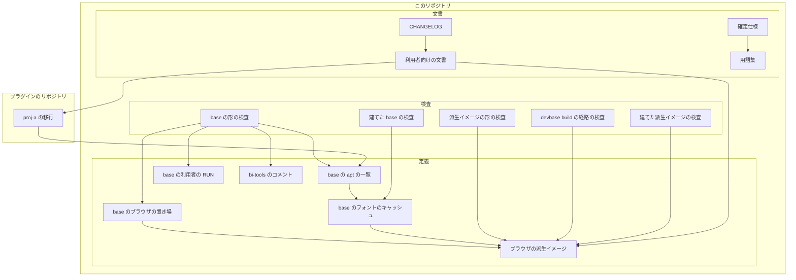
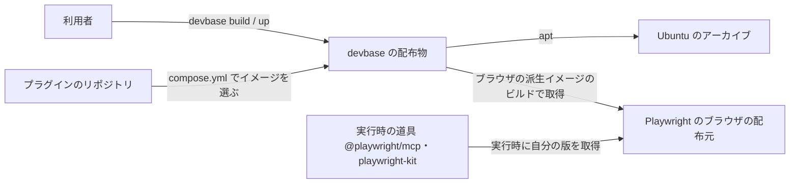
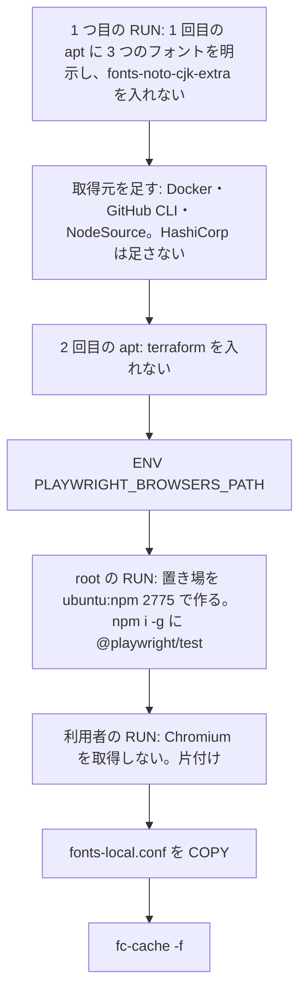
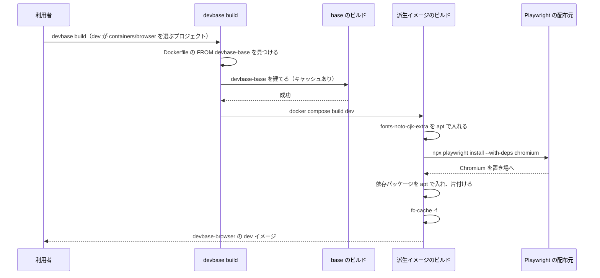

# base: ブラウザ・追加の太さのフォント・terraform を使わない利用者も約 1.2GB を取得・展開・保存している → base から外し、要るプロジェクトはブラウザの派生イメージ devbase-browser を選ぶ（#402）

## 目的

- **何が壊れているか**: base が、Playwright の Chromium とその依存パッケージ・追加の太さのフォント・`terraform`（arm64 で計約 1.28GB）を全員に配っている
- **誰が困るか**: これらを使わない大半のプロジェクトの利用者。base とその派生イメージを建てるたびに取得・展開・保存の費用を払う
- **直すと何が成り立つか**: base はすべての利用者が使う道具だけを持つ。ブラウザと文書のフォントが要るプロジェクトは、ブラウザの派生イメージ `devbase-browser` を選べば、今の base と同じ描画とブラウザを建て直した直後からネットワーク無しで使える

## 適用範囲

- **働く範囲**: このリポジトリの `containers/`（base・新設の `browser`・bi-tools のコメント）と、その検査・仕様・利用者向けの文書。プラグインのリポジトリは、ブラウザを使うプロジェクト `proj-a` の移行を別の Pull Request で扱う（移り方はその Pull Request で決める。決定 7）
- **前提とする順**: #403（派生イメージ lfm の廃止）・#400・#401（システムの Chrome を両アーキとも base から外す）が先に入った `main` の上に作る（決定 9）。この変更は lfm とシステムの Chrome を扱わない
- **プロジェクトごとに違うもの**: どのイメージを使うかは、プロジェクトの `compose.yml` の dev サービスの `build.context`（または自前の Dockerfile の `FROM`）で受ける。引数や環境変数は足さない
- **当たるモード**: `standard`

## あるべき姿の根拠

| 根拠 | 種類 | 何を示すか |
| --- | --- | --- |
| 依頼の表の大きさ（Chromium 662MB・依存の apt 296MB・`fonts-noto-cjk-extra` 215MB・`terraform` 108MB。arm64） | 実測（2026-10-03、課題の本文） | 外す中身が 1.2GB を超える |
| プラグインのリポジトリ 3 つの `compose.yml`・`env`・`project.yml`（各 131）とフック 3 つに、`playwright`・`chromium`・`chrome`・`puppeteer`・`selenium`・`headless`・`noto-cjk`・`terraform` の当たりが 0 件 | 実測（この設計の `grep -rIilE`、2026-10-03） | 設定の上でブラウザや `terraform` を求めるプロジェクトは無い |
| 手元にコードがあるプロジェクトのうち、ブラウザを使うのは `proj-a` の 1 つだけ（`.mcp.json` で `npx chrome-devtools-mcp@latest` と `npx -y @playwright/mcp@latest` を起動） | 実測（`projects/*/repo` の `grep`） | 移す Pull Request が要るのは 1 つ |
| 「base を重くしすぎず、重い道具は派生イメージに置く」 | 利用者の指示の原文（MVV 版 1 の Value 1） | 重い道具の置き場は派生イメージ |
| 利用者が 2026-10-03 に、依頼の 4 つの中身を base から外すことを承認した | 利用者の指示の原文（課題の本文。P1） | base の道具を変える承認がある |
| #402 の課題のコメント（2026-10-03）: lfm は #403 で廃止し、#400〜#402 より先に入れる。この課題の設計では lfm への影響を考えなくてよい | 利用者の指示 | この変更は lfm を扱わない |
| #401 の本文と、スプリント m7c の順（#403 → #400 → #401 → #402） | 利用者の指示 | この変更の時点で、システムの Chrome は両アーキとも base に無い |

要求と受け入れ条件は #402 の本文にある（コピーは `issues/issue-402-requirements.md`）。この文書は「どう作るか」だけを扱う。
前提・受け入れ条件・ドメインイベント・未決の番号は、要求の番号をそのまま使う。
設計の中で要求の前提 5（システムの Chrome）と前提 6（lfm）を、#401 と #403 が先に入る形へ改め、本文の「変更の記録」に残した（決定 9）。lfm を扱う E5・受け入れ条件 11 と、この文書の I14・I15・F7 は欠番にした。

## ドメインモデル

### コンテキスト

| コンテキスト | 何の語が 1 つの意味に決まるか |
| --- | --- |
| ブラウザ（`browser`） | ブラウザの置き場・Playwright の Chromium・ブラウザの依存パッケージ・ブラウザの派生イメージ・システムの Chrome |
| base イメージ（`base-image`） | 追加の太さのフォント。base が持つフォントの一覧 |
| イメージの継承（`image-lineage`） | 派生イメージ。派生イメージが base から継ぐもの（ブラウザの置き場と `ENV PLAYWRIGHT_BROWSERS_PATH`） |

`image-lineage` が `browser` に**順応者**として従う。ブラウザの派生イメージは、base が宣言するブラウザの置き場（`/opt/ms-playwright`）をそのまま使い、別の置き場へ訳し直す層を持たない（#220 と同じ関係）。`base-image` と `browser` の間も同じで、ブラウザの派生イメージは base のフォントの規則（`/etc/fonts/local.conf`）を書き換えずに継ぐ。

### 集約

この変更の集約は Dockerfile の命令の組である。持ち主は、その命令を書き換えてよい Dockerfile を指す。

| 集約 | 持ち主（書き換えてよいもの） | 根 | エンティティ | 値オブジェクト |
| --- | --- | --- | --- | --- |
| base の apt の一覧 | `containers/base/Dockerfile` | 1 つ目の `RUN` の 2 回の `apt-get install` | — | パッケージ名・apt の取得元 |
| base のブラウザの置き場 | `containers/base/Dockerfile` | `ENV PLAYWRIGHT_BROWSERS_PATH` | — | 置き場の値・所有者と権限（中身は空） |
| ブラウザの派生イメージ | `containers/browser/Dockerfile`（新設） | `FROM devbase-base:latest` | Playwright の Chromium（版ごとのディレクトリ） | ブラウザの依存パッケージ・追加の太さのフォント |
| プロジェクトのイメージの選択 | プラグインのリポジトリの `compose.yml`（このリポジトリの外） | dev サービスの `build` | — | `build.context`・自前の Dockerfile の `FROM` |

ブラウザの派生イメージは base のブラウザの置き場の値を書き換えず、置き場の中身（Chromium）だけを足す。

### 不変条件

| # | 集約 | 条件 | 破れたときの扱い |
| --- | --- | --- | --- |
| I1 | base の apt の一覧 | base の Dockerfile に `npx playwright install` が無く、`apt-get install` の一覧に `fonts-noto-cjk-extra` と `terraform` が無く、HashiCorp の apt の取得元が無い | Dockerfile の形の検査が、名前を挙げて落ちる |
| I2 | base の apt の一覧 | 1 回目の `apt-get install` の一覧に `fonts-liberation`・`fonts-ipafont-gothic`・`fonts-wqy-zenhei` がある | Dockerfile の形の検査が落ちる。建てた base の `fc-match` の解決先が変わる |
| I3 | base の apt の一覧 | `npm i -g` の一覧に `@playwright/test` が残る | Dockerfile の形の検査が落ちる |
| I4 | base のブラウザの置き場 | `ENV PLAYWRIGHT_BROWSERS_PATH=/opt/ms-playwright` が 1 つあり、置き場を `ubuntu:npm`・`2775` で作る root の `RUN` より前にある | Dockerfile の形の検査が落ちる |
| I5 | base の apt の一覧 | `fc-cache -f` は 1 度だけで、`/etc/fonts/local.conf` の `COPY` より後にある | フォントの形の検査が落ちる |
| I6 | base の apt の一覧 | 建てた base の `fc-match` の解決先が、確定仕様の「解決先」の表のまま変わらない | 建てた base の解決先の検査が落ちる |
| I7 | base のブラウザの置き場 | 建てた base の置き場に Chromium の版のディレクトリが無く、`fonts-noto-cjk-extra` と `terraform` が無い | 建てた base の検査が落ちる |
| I8 | base のブラウザの置き場 | 建てた base で Playwright の Chromium を起動すると非 0 で終わり、出力に `playwright install` が含まれる | 建てた base の検査が落ちる |
| I9 | ブラウザの派生イメージ | Dockerfile の最初の `FROM` が `devbase-base:latest` である | Dockerfile の形の検査と、`devbase build` の経路の検査が落ちる |
| I10 | ブラウザの派生イメージ | `npx playwright install --with-deps chromium` を利用者の `RUN` で 1 回打ち、その片付けの `rm -rf` が `/opt` と置き場を対象にせず、`/var/lib/apt/lists` を消す | Dockerfile の形の検査が落ちる |
| I11 | ブラウザの派生イメージ | `fonts-noto-cjk-extra` を apt で入れ、`fc-cache -f` が 1 度だけ、Playwright と apt の `RUN` より後にある | Dockerfile の形の検査が落ちる |
| I12 | ブラウザの派生イメージ | 建てたイメージで、#220 の受け入れ条件 5〜9 が成り立つ（ネットワーク無しの PDF・置き場への書き込み・`NotoSansCJKjp`・ブラウザの依存パッケージの存在と `chromium-browser` の不在・環境変数） | 建てたブラウザの派生イメージの検査が落ちる |
| I13 | ブラウザの派生イメージ | 建てたイメージに `fonts-noto-cjk-extra` があり、`Noto Sans CJK JP` の `Thin` と `Black` のフェイスがある | 建てたブラウザの派生イメージの検査が落ちる |
| I16 | base の apt の一覧 | `containers/bi-tools/Dockerfile` の先頭のコメントが、base に含まれるものとして `terraform` を挙げない | Dockerfile の形の検査が落ちる |

I14・I15（lfm のブラウザ）は欠番にした。lfm は #403 で先に廃止される（決定 9）。

### ドメインイベント

| # | イベント | 発生元 | 受け手 |
| --- | --- | --- | --- |
| E1 | base のビルドが、`fonts-noto-cjk-extra`・`terraform` を除き、3 つのフォントを明示した apt の一覧で入れた | base の 1 つ目の `RUN` | E3 の `fc-cache` |
| E2 | base のビルドが、Chromium を取得せず `--with-deps` の apt も打たずに終わった | base の利用者の `RUN` | E4（空の置き場を渡す） |
| E3 | base のビルドがフォントのキャッシュを作り直した | base の `RUN sudo fc-cache -f` | 建てた base の解決先の検査（I6） |
| E4 | ブラウザの派生イメージのビルドが、base の上に Chromium・ブラウザの依存パッケージ・追加の太さのフォントを入れた | ブラウザの派生イメージの `RUN` | 派生イメージの `fc-cache`・建てた派生イメージの検査（I12・I13） |
| E6 | 利用者が base 系のコンテナで Playwright の Chromium を起動しようとし、失敗した | 利用者・道具 | 利用者（Playwright の出力の `npx playwright install` と、利用者向けの文書の移り方） |
| E7 | 利用者が base 系のコンテナで、実行時にブラウザとその依存パッケージを取得した | `npx playwright install --with-deps chromium` | ブラウザの置き場（I4 の権限で書き込める）。コンテナを作り直すと消える |
| E8 | ブラウザを使うプロジェクトが、`compose.yml` で使うイメージを替えた | プラグインのリポジトリへの Pull Request のマージ | そのプロジェクトの `devbase build`（E4 か、プロジェクトの Dockerfile のビルド） |

E5（lfm のビルド）は欠番にした（要求の E5 と同じ）。

### 用語

| 用語 | 意味 | 用語集への反映 |
| --- | --- | --- |
| ブラウザの派生イメージ | `containers/browser`（タグ `devbase-browser:latest`）。base を継ぎ、Playwright の Chromium・ブラウザの依存パッケージ・追加の太さのフォントを足す | 追加（`browser`） |
| ブラウザの置き場 | Playwright がブラウザを取得して置くディレクトリ。`PLAYWRIGHT_BROWSERS_PATH` が指す `/opt/ms-playwright`。base は空のまま作り、ブラウザの派生イメージが中身を持つ。コンテナの利用者が書き込める | 意味の変更（`browser`） |
| Playwright の Chromium | `playwright install chromium` がブラウザの置き場へ取得する Chromium（版ごとのディレクトリ）。ブラウザの派生イメージに入る | 意味の変更（`browser`） |
| ブラウザの依存パッケージ | `playwright install` の `--with-deps` が apt で入れるパッケージ。base は、このうち `fonts-liberation`・`fonts-ipafont-gothic`・`fonts-wqy-zenhei`・`libnss3` などを明示して持つ | 意味の変更（`browser`） |
| 派生イメージ | 要求の段で足した定義から、lfm を除く一文を外したもの（lfm は #403 で廃止） | 反映済み（出所を確定仕様へ直すのは確定仕様化の工程） |
| 追加の太さのフォント | 要求の段で足した定義のまま | 反映済み（同上） |

コンテキスト `browser` の名前と意味も「base イメージのブラウザ」から「ブラウザ」（ブラウザの派生イメージに入るブラウザと、base が作る置き場）へ直す。

## 機能一覧

| # | 機能 | 誰が使うか |
| --- | --- | --- |
| F1 | base を建てると、ブラウザ・追加の太さのフォント・`terraform` の無い、小さい base ができる | すべての利用者 |
| F2 | base で日本語・中国語・韓国語の標準の太さと欧文の metric 互換が、今と同じ書体で描ける | すべての利用者 |
| F3 | ブラウザの派生イメージを選ぶと、ネットワーク無しで Chromium を起動し、日本語のページを PDF やスクリーンショットにできる | 文書を描く・ブラウザを動かすプロジェクト |
| F4 | ブラウザの派生イメージで、Noto CJK の追加の太さ（Thin〜Black）で描ける | 文書を描くプロジェクト |
| F5 | base 系のコンテナで Chromium を起動すると、取得のコマンドを示して止まる | base 系のコンテナでブラウザを使おうとした利用者・道具 |
| F6 | base 以外の派生イメージ（`php` など）を使うプロジェクトが、自分の Dockerfile でブラウザの依存パッケージを足せる | `proj-a` など |
| F8 | 利用者向けの文書と CHANGELOG で、外れたものと移り方が分かる | すべての利用者 |

F7（lfm がブラウザ・追加の太さのフォント・`terraform` を持ち続けること）は欠番にした（lfm は #403 で廃止）。

## 構成要素

型（クラス）は持たない。Dockerfile の命令・設定ファイル・検査だけで構成する。

| 要素 | 置き場所 | 責務 |
| --- | --- | --- |
| base の apt の一覧 | `containers/base/Dockerfile` の 1 つ目の `RUN` | 1 回目の一覧から `fonts-noto-cjk-extra` を外し、3 つのフォントを明示する。HashiCorp の取得元を外す。2 回目の一覧から `terraform` を外す |
| base の利用者の `RUN` | `containers/base/Dockerfile` の uv・claude・agy・kiro を入れる `RUN` | `npx playwright install --with-deps chromium` の行を外す。片付けは今のまま残す |
| base のブラウザの置き場 | `containers/base/Dockerfile` の `ENV PLAYWRIGHT_BROWSERS_PATH` と root の `RUN` の `install -d` | 今のまま残す。コメントを「中身はブラウザの派生イメージが持つ」に直す |
| base のフォントのキャッシュ | `containers/base/Dockerfile` の `RUN sudo fc-cache -f` | 位置は今のまま。コメントの「Playwright の RUN の後」の理由を外す |
| ブラウザの派生イメージ | `containers/browser/Dockerfile`・`containers/browser/compose.yml`（新設） | base を継ぎ、`fonts-noto-cjk-extra` を apt で入れ、Chromium と依存パッケージを置き場へ取得し、フォントのキャッシュを作り直す |
| bi-tools のコメント | `containers/bi-tools/Dockerfile` の先頭 | 「base に既に含まれるもの」から `terraform` を外す |
| base の形の検査 | `tests/containers/test_base_dockerfile_playwright.py`・`test_base_dockerfile_fonts.py` | I1〜I5・I16（bi-tools のコメント）を Docker 無しで縛る |
| ブラウザの派生イメージの形の検査 | `tests/containers/test_browser_dockerfile.py`（新設） | I9〜I11 を Docker 無しで縛る |
| `devbase build` の経路の検査 | `tests/cli/test_wrapper_shellcheck_fixes.py` と同じ起動の形のテスト | ブラウザの派生イメージを選んだプロジェクトの `devbase build` が base を先に建てる（受け入れ条件 10） |
| 建てた base の検査 | `tests/containers/test_base_image_font_matching.py`（変えない）・`tests/containers/test_base_image_without_browser.py`（新設） | I6〜I8 |
| 建てたブラウザの派生イメージの検査 | `tests/containers/test_browser_image.py`（`test_base_image_browser.py` を移す） | I12・I13。検査するイメージを `DEVBASE_TEST_BROWSER_IMAGE` で差し替える |
| 確定仕様 | `docs/specifications/base-image-rendering.md` | base にブラウザが無いこと、ブラウザの派生イメージの形 |
| 利用者向けの文書 | `docs/user/container-operations.md` | イメージの表に `browser` を足し、移り方（イメージの選び方・プロジェクトの Dockerfile・`terraform` の入れ方）を書く |
| 用語集 | `docs/glossary/glossary.json`・`docs/glossary.md` | 用語の表の反映 |
| CHANGELOG | `CHANGELOG.md` の `[Unreleased]` | 外れたもの・移り方の文書へのリンク・建て直しの順 |
| `proj-a` の移行 | プラグインのリポジトリの `proj-a` の `compose.yml`（選ぶ道筋によってはプロジェクトの Dockerfile か `.mcp.json`） | 2 つの MCP が動くブラウザを用意する。道筋はその Pull Request で決める（決定 7） |

### 構成要素図



`proj-a の移行` から `base の apt の一覧` への辺は、`proj-a` が使う `devbase-php`（またはそれを継ぐプロジェクトの Dockerfile）が base を継ぐことを表す。

### システムの文脈と配置



| 実行の単位 | 何が動くか | 境界をまたぐもの |
| --- | --- | --- |
| base のビルド（`docker buildx build`） | apt・npm・各 CLI の取得 | Ubuntu のアーカイブと各配布元。Playwright の配布元へは出なくなる。HashiCorp の apt へも出なくなる |
| ブラウザの派生イメージのビルド | apt（追加の太さのフォント・依存パッケージ）と Chromium の取得 | Ubuntu のアーカイブと Playwright の配布元 |
| コンテナ（base 系） | 道具が実行時にブラウザを取得するなら、そのたびに配布元へ出る | 置き場はイメージの外の変更で、作り直すと消える |

### 置き場所

```text
containers/
├── base/Dockerfile              # 変える
├── browser/                     # 新設
│   ├── Dockerfile
│   └── compose.yml
└── bi-tools/Dockerfile          # コメントだけ変える
tests/
├── cli/                         # devbase build の経路の検査を足す
└── containers/
    ├── test_base_dockerfile_playwright.py   # 変える
    ├── test_base_dockerfile_fonts.py        # 変える
    ├── test_base_image_without_browser.py   # 新設
    ├── test_browser_dockerfile.py           # 新設
    └── test_browser_image.py                # test_base_image_browser.py を移す
docs/
├── specifications/base-image-rendering.md   # 変える
├── user/container-operations.md             # 変える
└── glossary/glossary.json                   # 変える（glossary.md は作り直す）
```

### ブラウザの派生イメージの中身

| 順 | 命令 | 理由 |
| --- | --- | --- |
| 1 | `FROM devbase-base:latest` | `devbase build` が base を先に建てる経路に乗る（I9） |
| 2 | root で `apt-get install -y --no-install-recommends fonts-noto-cjk-extra`、同じ `RUN` で `/var/lib/apt/lists` を消す | 標準のアーカイブのパッケージで、外部の取得元が要らない |
| 3 | 利用者 `ubuntu` で `npx playwright install --with-deps chromium`、同じ `RUN` の末尾で `sudo rm -rf /tmp/* ~/.cache ~/.npm /var/lib/apt/lists/*` | 今の base の利用者の `RUN` と同じ取得で、同じ版・同じ依存パッケージになる。`npx` は base の `@playwright/test` の CLI を使う。片付けは置き場（`/opt`）を対象にしない（I10） |
| 4 | `RUN sudo fc-cache -f` | 2 と 3 が入れたフォントをキャッシュへ載せる（I11） |

`compose.yml` は `containers/latex/compose.yml` と同じ形（dev サービス・`image: devbase-browser:latest`・`build.context: .`）にする。`ENV PLAYWRIGHT_BROWSERS_PATH` と置き場は base から継ぐため、この Dockerfile では宣言しない（決定 3）。

### 移るプロジェクト

| 対象 | 今 | 移る先 | 出す Pull Request |
| --- | --- | --- | --- |
| `proj-a`（dev サービスは `devbase-php`。`.mcp.json` で `npx chrome-devtools-mcp@latest` と `npx -y @playwright/mcp@latest` を起動） | base の依存パッケージと、実行時に `@playwright/mcp` が取得するブラウザで動く。`chrome-devtools-mcp` はシステムの Chrome を探すと見込む | 3 つの道筋（`devbase-browser` を選ぶ・プロジェクトの Dockerfile で足す・MCP の起動引数でブラウザの場所を渡す）から、プラグインのリポジトリの Pull Request で決める（決定 7） | プラグインのリポジトリへ 1 本（C5。出す前に人の確認を取る） |
| `proj-a` のアプリの `docker-compose.dev.yml` の `seleniarm/standalone-chromium` | アプリ自身のテスト用の別イメージ | 変えない（base を使わない） | 無し |
| 設定の上でブラウザの当たりが無いプロジェクト（プラグインのリポジトリ 3 つの全プロジェクト） | — | 変えない。コードがボリュームの中で見えない範囲は未確認（「未確認のまま残ること」） | 無し |
| 手元に無いプロジェクト | — | CHANGELOG と利用者向けの文書の移り方で知らせる（前提 7） | 無し |

#401 とこの変更の後は、`devbase-php` を含む base 系のイメージに、システムの Chrome も Playwright の Chromium とその依存パッケージも無い。`proj-a` の 2 つの MCP は、どちらもそのままでは動くブラウザを持たない。`@playwright/mcp` は `@latest` で起動して自分の版のブラウザを実行時に取得するため、依存パッケージがあれば動く（F6）。`chrome-devtools-mcp` はシステムの Chrome を探すと見込まれ、依存パッケージだけでは足りない（「未確認のまま残ること」）。

### 同じ層を触る課題との境目

#403・#400・#401 は同じスプリントで、この変更より先に入る。#400・#401 は同じ `containers/base/Dockerfile` の 1 つ目の `RUN` と利用者の `RUN` を触り、#403 は lfm とその検査・仕様を消す。

| 課題 | base の Dockerfile で触る所 | この変更と重なる所 |
| --- | --- | --- |
| #403（lfm の廃止。最初に入る） | `containers/lfm/`・lfm の検査・`lfm-base-settings.md`・base の lfm を前提にしたコメント | base の置き場と `fc-cache` の上のコメント。#403 が直した後の文言の上で、この変更の分だけを直す。lfm の部分はこの変更に無い |
| #400（dockerd・`aws-cdk-lib`・root の uv・片付けの漏れ。2 番目に入る） | 2 回目の `apt-get install` の `docker-ce`・`containerd.io`。1 回目の前の dpkg の除外設定。root の uv。`npm i -g` の `aws-cdk-lib`。利用者の `RUN` の片付けへ `/var/lib/apt/lists` を足す | 2 回目の一覧の 1 行（`terraform` と同じ行）。利用者の `RUN` の片付けとそのコメント |
| #401（システムの Chrome を両アーキとも base から外す。3 番目に入る） | Google の取得元と `BROWSER_PKG` の分岐。2 回目の一覧の `$BROWSER_PKG`。`test_system_chrome_stays_amd64_only` | 2 回目の一覧の 1 行。#401 が残したブラウザのコメント（「Chromium は Playwright のものを使う」の類）を、この変更でブラウザの派生イメージを指す形へ直す |
| この変更 | 1 回目の一覧（`fonts-noto-cjk-extra`・3 つのフォント）。HashiCorp の取得元。2 回目の一覧の `terraform`。利用者の `RUN` の `npx playwright install`。`ENV` と `install -d` と `fc-cache` のコメント | — |

実装の順は #403 → #400 → #401 → #402 にする（決定 9）。この変更は 3 つが入った `main` の上に作り、重なる行は先に入った課題の変更を残したうえで自分の分だけを直す。2 回目の一覧は #400・#401・この変更がそれぞれ別の語を消すため、先に入った削除を残して自分の語だけを消す。

## 処理の流れ

### base のビルド



`fc-cache -f` の位置は変わらない。今の位置は「Playwright がフォントを入れた後」を理由にしていたが、Playwright の `RUN` が base から消えると、残る理由は「`COPY` の後」と「`~/.cache` を消した後にキャッシュを作り直す」の 2 つになる（I5）。E3 の順序の前提（キャッシュが 3 つのフォントを知っている）は、3 つが 1 つ目の `RUN` で入ることで満たされる。

### ブラウザの派生イメージのビルド



`devbase build browser`（単体ビルド）は base を先に建てない。既存の派生イメージと同じ扱いで、この変更では変えない（決定 8）。

### 実行時

| 場面 | base 系（base・`general`・`php` など） | ブラウザの派生イメージ |
| --- | --- | --- |
| イメージの Playwright で Chromium を起動する | 失敗する。Playwright が「`npx playwright install` を打て」と出す（E6・I8） | 置き場の Chromium を起動する。取得は起きない |
| 利用者が `npx playwright install chromium` を打つ | 置き場へ取得できるが、依存パッケージが無いため起動で失敗する。Playwright が `install-deps` を出す | 同じ版なら何も起きない |
| 利用者が `sudo npx playwright install --with-deps chromium` 相当を打つ（E7） | 起動できるようになる。コンテナを作り直すと消える | — |
| 道具が自分の版で取得する（`@playwright/mcp`・`playwright-kit`） | 取得は済むが、依存パッケージが無いため起動で失敗する | 置き場へ自分の版を足して起動する |

## 非機能の実現方式

| 大項目 | 要求の条件 | 実現方式 | 確かめ方 |
| --- | --- | --- | --- |
| 性能・拡張性 | base が arm64 で 1.2GB 以上減る。ブラウザの派生イメージの大きさを変更前の base と比べて記録する | 外す 4 つは base の層から命令ごと消す。3 つのフォントだけを残す。ブラウザの派生イメージは今の base の取得と同じ命令を足すだけにし、層を増やしすぎない | 同じ arm64 の端末で、変更前の base・変更後の base・ブラウザの派生イメージを作業用のタグで建て、`docker image inspect --format '{{.Size}}'` の値と差を PR に残す。建てる前に `docker system df` で空きを見る。1.2GB に届かなければフォントを外さず人へ戻す（前提 3） |
| 移行性 | 移る作業は `compose.yml` の 1 か所か Dockerfile の追記で済む。ボリュームとデータに触れない | イメージの選択だけで移れるよう、ブラウザの派生イメージを `containers/` に置き、`build.context: ${DEVBASE_ROOT}/containers/browser/` で選べるようにする。置き場の値は base と同じにする | 利用者向けの文書の移り方の節を、`proj-a` の Pull Request の差分と突き合わせる |
| 運用・保守性 | 建て直しの順（base → 派生イメージ → `devbase down` / `up`）を文書と CHANGELOG に書く | 確定仕様の「運用」と利用者向けの文書の注記に、3 段とも省けないことを書く。`devbase rebuild` では建て直らないことも書く | PR で文書の記述を `grep` した出力を残す（#220 の決定 4 と同じ） |
| システム環境 | 受け入れ条件は arm64 で確かめ、amd64 はリリース後テスト | アーキで分ける命令を新しく足さない。Playwright の CLI がアーキに合う Chromium を選ぶ | arm64 は手元で建てて検査を通す。amd64 は #242 と同じくリリース後テストで同じ検査を通す |

## 決定の記録

### 決定 1: 全員に配る重さを減らすため、#220 で base に残すと決めた Playwright の Chromium と依存パッケージを base から外す

#220 は「ブラウザはイメージに残す」と決め（#220 の要求の結論）、その帰結として Playwright の取得を `--with-deps` のまま base に残した（#220 の前提 2・決定 2）。この変更はこの 2 つを覆す。#220 の時点では、ブラウザを使わないプロジェクトの数と、依存パッケージの大きさ（296MB）を測っていなかった。今回、設定の上でブラウザを求めるプロジェクトが無く、コードの見えるプロジェクトで使うのは 1 つだけと分かり、利用者が 2026-10-03 に base からの削除を承認した。ブラウザをネットワーク無しで使えるという #220 の目的は、ブラウザの派生イメージがそのまま引き継ぐ（I12）。

#220 の決定 1（置き場の作り方）と決定 3（検査するイメージを環境変数で差し替える）は覆さず、置き場は base に、検査の形はブラウザの派生イメージに引き継ぐ。#220 の決定 5（システムの Chrome は amd64 だけに残す）は、先に入る #401 が覆し、システムの Chrome は両アーキとも base から外れている。この変更はシステムの Chrome を扱わない（前提 5）。

base に Chromium を残して依存パッケージだけを外す形は採らない。依存パッケージが無いと Chromium は起動できず、残す意味が無い。Chromium だけを外して依存パッケージを残す形は、外せる量が 662MB に留まり 1.2GB に届かない。

根拠: Value 1 / P1（MVV 版 1）

### 決定 2: 文書を描く使い方を 1 つの選択で揃えるため、ブラウザと追加の太さのフォントを 1 つの派生イメージ `containers/browser`（`devbase-browser`）にまとめる

追加の太さのフォント（Thin〜Black）が効くのは、CSS の `font-weight` で太さを指定したページをブラウザで描くときである。描く道具とフォントを別のイメージに分けると、文書を描くプロジェクトは両方が要るのに 1 つしか選べない。まとめると、今の base で描けていたものが、ブラウザの派生イメージを選ぶだけで同じに描ける。名前は役割の中心が Chromium であるため `browser` にする。

ブラウザとフォントを別のイメージ（例 `browser` と `docs`）に分ける案は、両方を要るプロジェクトが選べなくなるため採らない。名前を `docs` にする案は、ブラウザの操作（E2E のテストや MCP）に使うプロジェクトが選びにくくなるため採らない。`containers/latex` に足す案は、LaTeX を要らないプロジェクトにも TeX Live を配ることになるため採らない。

根拠: Value 1（MVV 版 1）

### 決定 3: ブラウザの派生イメージと実行時の取得が同じ置き場を使うため、base に `ENV PLAYWRIGHT_BROWSERS_PATH` と空の置き場を残す

置き場を base に残すと、ブラウザの派生イメージは `ENV` と置き場を宣言せずに継げる。base 系のコンテナで道具が実行時に取得したときも、今と同じ置き場に入る。空のディレクトリを足すだけで、大きさは増えない。

`ENV` と置き場を base から外し、ブラウザの派生イメージで宣言する案は採らない。base 系のコンテナでの実行時の取得先が `~/.cache/ms-playwright` に変わって、今の置き場の説明（用語集）と食い違う。

根拠: Value 1（MVV 版 1）

### 決定 4: base へ道具を足さずに伝えるため、ブラウザが無いことは Playwright 自身の失敗の出力に任せる

base で Playwright の Chromium を起動すると、Playwright は置き場に実行ファイルが無いことと `npx playwright install` を出して止まる。取得した後に依存パッケージが無ければ、`install-deps` を打てと出す。これで受け入れ条件 5 の出力の条件を満たし、次の手は利用者向けの文書の移り方が補う。base の大きさも振る舞いも増えない。

案内のための包み（`playwright` のラッパーや起動時の知らせ）を base に足す案は、base へ新しい道具を足すことになり P1 の承認の外にあるため採らない。実行時に `--with-deps` で取得させる案は、コンテナを作り直すたびに数百 MB を取り直し、ネットワークの無い所で動かないため採らない。

根拠: Value 1 / P1（MVV 版 1）

### 決定 5: base が配らない道具の取得元を持たないため、HashiCorp の apt の取得元を base から外す

取得元を残すと、base を継ぐ派生イメージで `apt-get update` を打つたびに HashiCorp の配布元へ出て、配布元が止まると派生イメージのビルドが止まる。`terraform` を要るプロジェクトは、利用者向けの文書に置く 3 行（鍵・取得元・`apt-get install`）を自分の Dockerfile かフックで打てば入る。

取得元を残して `sudo apt-get install terraform` だけで入るようにする案は、使う者の見当たらない道具のために全員の `apt-get update` に外部の取得元を足し続けるため採らない。

根拠: Value 1 / Value 3（MVV 版 1）

### 決定 6: 3 つのフォントの出どころを Dockerfile から読めるようにするため、1 つ目の `RUN` の 1 回目の一覧へ、既にあるフォントの行の隣に置く

3 つ（`fonts-liberation`・`fonts-ipafont-gothic`・`fonts-wqy-zenhei`）は標準のアーカイブのパッケージで、文書を扱う道具と metric 互換のフォントと同じ 1 回目の一覧が置き場になる（確定仕様の「データ・設定」と同じ規則）。今までは `--with-deps` の副作用で入っていたため、確定仕様の「入れないもの」の `fonts-wqy-zenhei` の行は「Dockerfile に導入の行は無く、Playwright が依存として入れる」と書いていた。これを「1 回目の一覧で明示して入れる」に直す。

`--with-deps` が入れていたほかのフォント（絵文字・`fonts-unifont`・`fonts-freefont-ttf`・`fonts-tlwg-loma-otf`・`xfonts-*`）は明示しない。前提 2 が残すのは `fc-match` の解決先の表に現れる 3 つだけで、ほかを残すことは承認の外にある。

根拠: Value 1 / P1（MVV 版 1）

### 決定 7: プロジェクトの道具立てに合う道筋を選べるよう、`proj-a` の移り方はプラグインのリポジトリの Pull Request で決め、この変更は選べる道筋を文書に書く

`proj-a` の dev サービスは `devbase-php` を使い、PHP の道具をそのまま要する。`.mcp.json` は `npx chrome-devtools-mcp@latest` と `npx -y @playwright/mcp@latest` を起動する。#401 の後は base 系のイメージにシステムの Chrome が無く、この変更の後は Playwright の Chromium とその依存パッケージも無い。2 つの MCP は、どちらもそのままでは動くブラウザを持たない。

道筋は 3 つある。

| 道筋 | 何をするか | 気をつけること |
| --- | --- | --- |
| `devbase-browser` を選ぶ | `compose.yml` の dev の `build.context` を `containers/browser` へ替える | PHP の道具が無くなる。`proj-a` はそのままでは選べない |
| プロジェクトの Dockerfile で足す | `FROM devbase-php:latest` の上に、ブラウザの依存パッケージ（`npx playwright install-deps chromium`）や Chromium を足す | 2 段の継承になる（下の段落）。`chrome-devtools-mcp` が探すブラウザも用意する |
| MCP の起動引数でブラウザの場所を渡す | `.mcp.json` の起動引数で、2 つの MCP に同じブラウザの実行ファイルを指させる | ブラウザと依存パッケージは、ほかの 2 つの道筋のどちらかで用意する |

どれを採るかは、`proj-a` の Pull Request の中で 2 つの MCP が動くことを確かめて決める（C5。出す前に人の確認を取る）。この変更が受け持つのは、3 つの道筋を利用者向けの文書の移り方に書くことと、その Pull Request を出すこと（受け入れ条件 13）である。

設計の初版は「プロジェクトの Dockerfile で依存パッケージだけを足す」に決めていた。`@playwright/mcp` は実行時に自分の版のブラウザを取得するため依存パッケージだけで足りるが、`chrome-devtools-mcp` はシステムの Chrome を探すと見込まれ、#401 で Chrome が両アーキとも外れると依存パッケージだけでは動かない。このため道筋を 1 つに決めず、`proj-a` の側で確かめて選ぶ形に改めた。

ブラウザの派生イメージを `FROM` に取る `php` 用の派生（例 `php-browser`）を devbase に足す案は、組み合わせの数だけ派生イメージが増えるため採らない。`./deploy` フックで起動のたびに入れる案は、作り直すたびに約 300MB を取り直すため採らない。`containers/php` に足す案は、`php` を使う 47 のプロジェクトの大半が使わない重さを配るため採らない。

プロジェクトの Dockerfile の道筋を採ると 2 段の継承（`proj-a` の Dockerfile → `devbase-php` → base）になり、`devbase build` は `devbase-php` を建てるが、その下の base が無いときに先に建てない（「未確認のまま残ること」）。`proj-a` の利用者の端末には base があるため、移行は止まらない。

根拠: Value 1 / Value 2 / C5（MVV 版 1）

### 決定 8: 受け入れ条件 10 を既存の仕組みで満たすため、プロジェクトの `devbase build` の経路で確かめ、単体ビルドは変えない

base を先に建てるのは、プロジェクトの dev サービスの Dockerfile の `FROM devbase-*` を見る経路（`bin/devbase` の `check_base_image_dependency`）である。単体ビルド `devbase build browser`（`_build_single_image`）は、既存の派生イメージと同じく base を先に建てない。ブラウザの派生イメージの最初の `FROM` を `devbase-base:latest` にすれば、プロジェクトの経路にそのまま乗る（I9）。確かめは `bin/devbase` を実プロセスで起動する既存の検査の形で、Docker 無しで行う。

単体ビルドに base の先行ビルドを足す案は、すべての派生イメージの振る舞いを変え、この課題の範囲を超えるため採らない。

根拠: Value 1（MVV 版 1）

### 決定 9: 先に入る課題の結果の上に作るため、実装の順を #403 → #400 → #401 → #402 にする

スプリント m7c の 4 つの課題は、この順に 1 本ずつ `main` へ入る（#402 の課題のコメント、#400 の設計）。#403 が lfm を消すため、この変更は lfm を扱わない（前提 6。要求の E5・受け入れ条件 11 と、この文書の I14・I15・F7 は欠番）。#400 は利用者の `RUN` の片付けに `/var/lib/apt/lists` を足し、この変更はその `RUN` から Playwright を外すため、#400 を先に入れると片付けの変更の意図が履歴に残る。#401 の受け入れ条件 4 は、base の `test_base_image_browser.py` を amd64 で通すことを求める。この変更がこのファイルをブラウザの派生イメージへ移すため、#401 を先に入れると #401 の条件を書いたまま確かめられる。#401 がシステムの Chrome を両アーキとも base から外すため、この変更の後の base 系のイメージにはブラウザが 1 つも無い（前提 5・決定 7）。

大きさの差（受け入れ条件 7）は、3 つが入った後の `main` の base を「変更前」として測る。#400 の文書の除外（dpkg の `path-exclude`）が先に入ると、依存パッケージの文書の分だけこの変更で減る量は小さくなる。#401 が外すのは amd64 の Chrome だけで、arm64 で測るこの差には効かない。1.2GB に届かないときは前提 3 のとおり人へ戻す。

この変更を #403 より先に入れる案（設計の初版の順）は採らない。スプリントの順は #403 を先に決めており、先に入れると lfm の取得の振る舞いを変えた直後に lfm ごと消すことになり、受け入れ条件 11 と lfm の仕様の直しが無駄になる。順を入れ替えるときは、後に入る課題の設計を、先に入った変更に合わせて読み替える。

根拠: Value 1 / P1（MVV 版 1）

## テスト設計

| 受け入れ条件・不変条件 | どの振る舞いで縛るか | どう壊したら落ちるべきか |
| --- | --- | --- |
| 受け入れ条件 1・I1 | base の Dockerfile の命令に `npx playwright install`・`fonts-noto-cjk-extra`・`terraform`・`apt.releases.hashicorp.com` が無い | どれか 1 つを戻すと、その名前を挙げて落ちる |
| 受け入れ条件 2・I2 | 3 つのフォントが 1 つ目の `RUN` の 1 回目の `apt-get install` の一覧にある | 1 つ消す、または 2 回目の一覧へ移すと落ちる |
| 受け入れ条件 3・I3 | `npm i -g` の一覧に `@playwright/test` がある | 一覧から外すと落ちる |
| I4 | base に `ENV PLAYWRIGHT_BROWSERS_PATH=/opt/ms-playwright` が 1 つで、置き場を作る `install -d` の `RUN` より前にある | `ENV` を消す・2 つにする・後ろへ動かすと落ちる |
| I5 | base の `fc-cache -f` が 1 度だけで、`fonts-local.conf` の `COPY` より後にある（「Playwright の `RUN` より後」の検査はブラウザの派生イメージへ移す） | `fc-cache` を `COPY` の前へ動かすと落ちる |
| 受け入れ条件 4・I6 | 建てた変更後の base で `test_base_image_font_matching.py` が `EXPECTED_MATCHES` を書き換えずに通る | 3 つのフォントの 1 つを外して建てると、`Arial` / `WenQuanYi Zen Hei` / `IPAPGothic` のどれかの行が落ちる |
| 受け入れ条件 5・I8 | `--network none` の変更後の base で、利用者 `ubuntu` の非対話の `bash -c` から Chromium を起動すると非 0 で、出力に `playwright install` か `devbase-browser` が含まれる | base に Chromium を戻して建てると、起動が 0 で終わって落ちる |
| 受け入れ条件 6・I7 | 変更後の base で `dpkg -s fonts-noto-cjk-extra` と `command -v terraform` が非 0、置き場に `chromium-*`・`chromium_headless_shell-*` が無い | どれかを戻して建てると、その項目が落ちる |
| 受け入れ条件 7 | 変更前と変更後の base の `.Size` の差が 1,200,000,000 以上（手動。PR に値を残す） | — |
| 受け入れ条件 8・I12 | 移したテストが、`DEVBASE_TEST_BROWSER_IMAGE`（既定 `devbase-browser:latest`）のイメージで #220 の受け入れ条件 5〜9 を確かめる。明示したイメージに置き場の中身が無ければ skip せず落とす | ブラウザの派生イメージの片付けに置き場を足して建てると、PDF の作成と置き場の項目が落ちる |
| 受け入れ条件 9・I13 | 建てたブラウザの派生イメージで `dpkg -s fonts-noto-cjk-extra` が 0、`fc-list` に `Noto Sans CJK JP` の `Thin` と `Black` がある | 派生イメージの apt から `fonts-noto-cjk-extra` を外して建てると落ちる |
| 受け入れ条件 10・I9 | ブラウザの派生イメージの最初の `FROM` が `devbase-base:latest`。dev の `build.context` が `containers/browser` のプロジェクトで `bin/devbase build` を起動すると、`devbase-base` を建ててから `docker compose build dev` を打つ | `FROM` を別の名前にすると、形の検査と経路の検査の両方が落ちる |
| I10 | ブラウザの派生イメージの利用者の `RUN` に `npx playwright install --with-deps chromium` が 1 つあり、片付けが `/opt`・置き場を対象にせず `/var/lib/apt/lists` を消す | 片付けに `/opt` を足す、または `/var/lib/apt/lists` を外すと落ちる |
| I11 | ブラウザの派生イメージの apt に `fonts-noto-cjk-extra` があり、`fc-cache -f` が 1 度だけで apt と Playwright の `RUN` より後にある | `fc-cache` を Playwright の前へ動かすと落ちる |
| 受け入れ条件 12 | 利用者向けの文書と CHANGELOG の記述（PR に `grep` の出力を残す。#220 の決定 4 と同じく pytest で縛らない） | — |
| 受け入れ条件 13 | `proj-a` の移り方の 3 つの道筋が利用者向けの文書にあり、プラグインのリポジトリの Pull Request の URL を PR に残す（手動） | — |
| 受け入れ条件 14 | 確定仕様の記述（PR に `grep` の出力を残す）。#220 を覆したことは決定 1 にある | — |
| 受け入れ条件 15・I16 | `containers/bi-tools/Dockerfile` の先頭のコメントに `terraform` が無い | コメントへ `terraform` を戻すと落ちる |
| 受け入れ条件 16 | 全体のテスト・lint・固有の語の検査（push の前に打つ） | — |

受け入れ条件 11・I14・I15（lfm）は欠番である（決定 9）。

## 設計の結果

| 課題 | 扱い | 取り込み先 | 触るファイル |
| --- | --- | --- | --- |
| #402 | 実装する | — | `containers/base/Dockerfile`、`containers/browser/`、`containers/bi-tools/Dockerfile`、`tests/containers/`、`tests/cli/`、`docs/specifications/base-image-rendering.md`、`docs/user/container-operations.md`、`docs/glossary/glossary.json`、`docs/glossary.md`、`CHANGELOG.md` |

## 未確認のまま残ること

| 項目 | 内容 |
| --- | --- |
| ボリュームの中のコード | プラグインのリポジトリの設定と、コードの見える `proj-a` 以外のプロジェクトがブラウザ・追加の太さのフォント・`terraform` を使うかは、コードがボリュームの中にあり見えない。使っていたプロジェクトは、base を建て直した後に E6 の失敗か `command not found` で気づく。CHANGELOG と利用者向けの文書の移り方で知らせる |
| `latex` の文書の書体 | `containers/latex` を使う 1 つのプロジェクトが、文書で Noto CJK の追加の太さを名指ししているかは見えない。名指ししていれば、base を建て直した後に別の太さへ置き換わる。`latex` は変えない |
| base から消えるほかのフォント | 絵文字（`fonts-noto-color-emoji`）・`fonts-unifont` などは base から消える（決定 6）。base でブラウザ以外の道具がこれらに頼って描いているかは確かめていない |
| Playwright の失敗の文言 | 決定 4 は、置き場に実行ファイルが無いときの Playwright の出力に `npx playwright install` が含まれることを前提にする。変更後の base を建てて受け入れ条件 5 の検査で確かめる |
| `proj-a` の 2 つの MCP | `chrome-devtools-mcp` は Playwright ではなくシステムの Chrome を探すと見込む（確かめていない）。#401 とこの変更の後は、`devbase-php` を含む base 系のイメージにシステムの Chrome も Playwright の Chromium も無く、`npx chrome-devtools-mcp@latest` と `npx -y @playwright/mcp@latest` はどちらもブラウザを見つけられない。移り方（`devbase-browser` を選ぶ・プロジェクトの Dockerfile で足す・MCP の起動引数でブラウザの場所を渡す）はプラグインのリポジトリの Pull Request で決め、そこで 2 つの MCP が動くことを確かめる（決定 7）。その Pull Request がマージされるまで、`proj-a` で base を建て直すと 2 つの MCP は動かない |
| 2 段の継承の先行ビルド | `proj-a` がプロジェクトの Dockerfile の道筋を選ぶなど、派生イメージを `FROM` に取る Dockerfile では、`devbase build` は base が無いときに先に建てない（決定 7・決定 8）。今の利用者の端末には base があるため移行は止まらない。新しい端末での扱いは #404 で扱う |
| 減る量 | 3 つのフォントを残し、#400 の文書の除外が先に入るため、減る量は依頼の表の合計より小さい。1.2GB に届くかは建てて測るまで分からない（前提 3） |
| amd64 | amd64 で受け入れ条件 4〜11 が成り立つかは、リリース後テストで確かめる |
