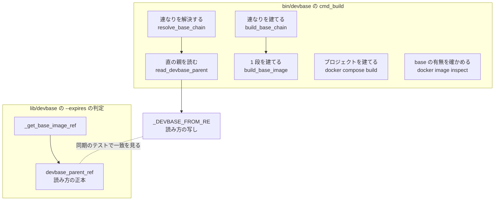
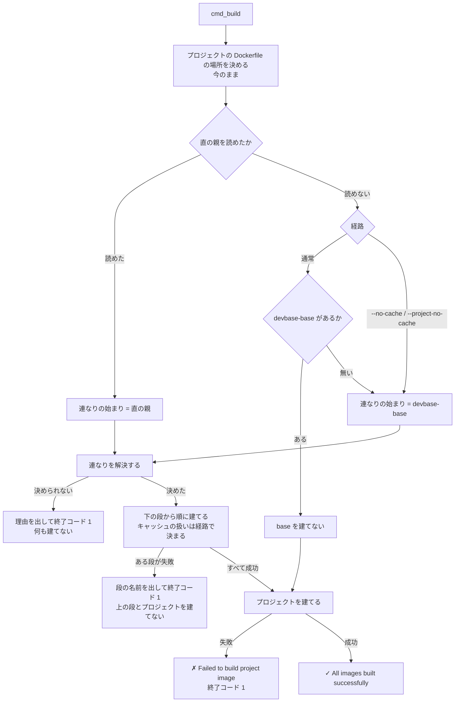
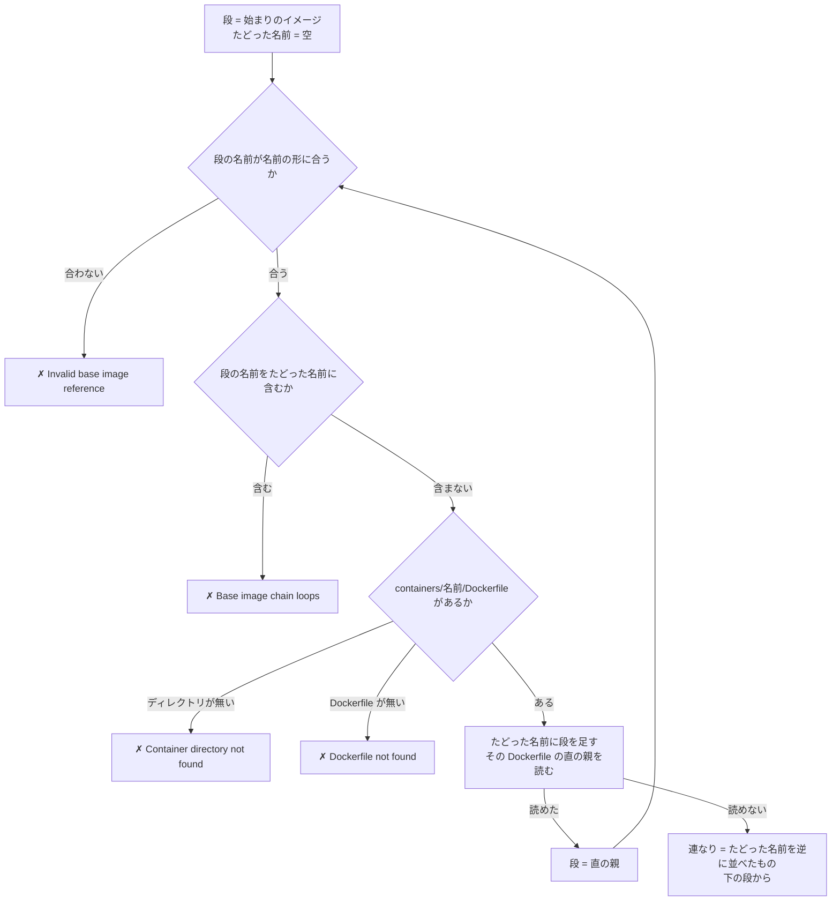
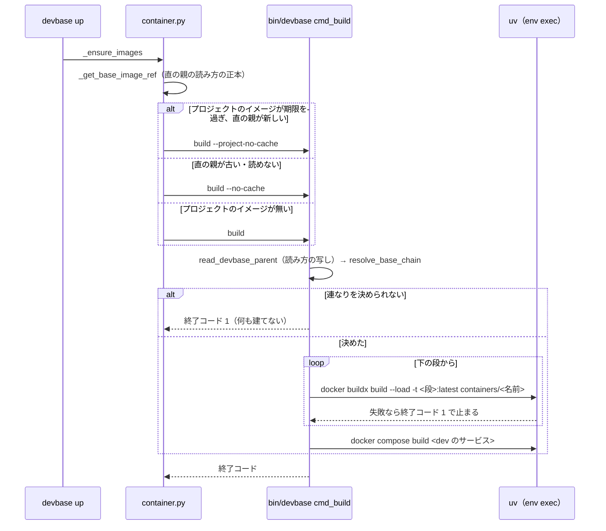

# 派生イメージを FROM に取るプロジェクトの devbase build が、base の無い端末で派生イメージの段で止まる → 継承の連なりを下の段から建て、通常のビルドと --expires の判定が Dockerfile を同じに読む（#404）

## 目的

- **何が壊れているか**: プロジェクトの Dockerfile が `FROM devbase-php:latest` のように派生イメージを継ぐと、`devbase build` は `devbase-php` だけを建て、その下の `devbase-base` を先に建てない。また `FROM --platform=...` と小文字の `from` を、通常のビルドは読み落とし、`--expires` の判定は読む
- **誰が困るか**: base を一度も建てていない端末で、2 段の継承のプロジェクトを `devbase build`・`devbase up`・`devbase rebuild` する利用者。先に `devbase build base` を打つ必要があることを出力から読み取れない
- **直すと何が成り立つか**: `devbase build` が継承の連なりを下の段から建て、先の手順なしに通る。Dockerfile から直の親イメージを読む規則が、通常のビルドと `--expires` の判定とで 1 つになる

## 適用範囲

- **働く範囲**: このリポジトリの `bin/devbase` の `cmd_build`（通常のビルド・`--no-cache`・`--project-no-cache`）と、`lib/devbase/commands/container.py` の `--expires` の判定。プラグインのリポジトリは変えない。利用者の端末では `main` から取得した版で働く
- **プロジェクトごとに違うもの**: プロジェクトの Dockerfile の `FROM`。設定も引数も足さない（公開のコマンドとオプションは変わらない）
- **当たるモード**: `standard`

## あるべき姿の根拠

| 根拠 | 種類 | 何を示すか |
| --- | --- | --- |
| `docs/user/container-operations.md:509` の「先に `devbase build base` を打つ」 | 実測（文書に残した回避） | 利用者に先の手順を求めている今の制約 |
| プラグインのリポジトリの作業ツリー（#402 の受け入れ条件 13 で出した PR）の `projects/proj-a/dev/Dockerfile` が `FROM devbase-php:latest` | 実測（grep。下の「2 段の継承の実例」） | 2 段の継承が実際に使われ始めている |
| `bin/devbase` の `_SINGLE_SEGMENT_NAME_RE` と `lib/devbase/utils/names.py` の同期（PLAN61 決定 2） | 既存の形 | Bash と Python が同じ規則を持つとき、正規表現の値を両方に置き、同期のテストで一致を見る前例 |
| `tests/cli/test_build_browser_image.py` | 既存の形 | `bin/devbase` を実プロセスで起動し、外への呼び出しを偽の `uv` で受けて、建てる順を固定するテストの形 |

要求と受け入れ条件は #404 の本文にある（コピーは `issues/issue-404-requirements.md`）。この文書は「どう作るか」だけを扱う。

## 2 段の継承の実例

`projects/*/` と `repos/*/` の Dockerfile から、最初の `devbase-*` の `FROM` を探した（2026-10-03）。

```bash
grep -rniE "^\s*FROM\s+(--platform=\S+\s+)?devbase-" --include='Dockerfile*' projects/*/ repos/*/ containers/
grep -rhoE 'context:\s*\S*containers/[a-z0-9._-]+' projects/*/compose.yml | sort | uniq -c
```

| 置き場 | 当たり | 段の数 |
| --- | --- | --- |
| プラグインのリポジトリの作業ツリー（#402 の受け入れ条件 13 で出した PR のブランチ）の `projects/proj-a/dev/Dockerfile` | `FROM devbase-php:latest`。`compose.yml` の最初の `build:` が dev で、`context: ./dev` | 2 段（proj-a → `devbase-php` → `devbase-base`） |
| `containers/` の派生イメージ 8 つ（`go`・`bi-tools`・`general`・`latex`・`php`・`php85`・`browser`・`trygroup`） | すべて `FROM devbase-base:latest` | 1 段 |
| `containers/base`・`containers/snapshot` | `FROM ubuntu:26.04` | 連なりの終わり |
| `projects/*/compose.yml` の `build.context`（36 ファイル） | `containers/<名前>` を直に指す行が 36（`general` 23・`php` 9・`bi-tools`・`latex`・`php85`・`trygroup` 各 1）。残る 1 つは `./repo`（proj-a の `app` のサービス。`FROM` は `devbase-*` でない） | 1 段（プロジェクトの Dockerfile が `containers/<名前>/Dockerfile` そのもの） |

**今 2 段の継承を持つのは、マージ前のブランチの 1 件だけである。** プラグインのリポジトリの既定のブランチには無い。
探した範囲は `projects/*/` の直下（`projects/*/repo` の中のアプリのコードを除く）・`repos/*/` の下の全体・`containers/`
で、`projects/*/repo` は `compose.yml` の `build` が指さない限り `devbase build` が読まないため外した。

## ドメインモデル

### コンテキスト

| コンテキスト | 何の語が 1 つの意味に決まるか |
| --- | --- |
| イメージの継承（`image-lineage`） | 派生イメージ・継承の連なり・直の親イメージ。`containers/*/Dockerfile` の `FROM` が決める |
| コマンドの入口（`cli`） | `devbase build` の 3 つの経路と `--expires` の判定。何をどの順で建てるか |

イメージの継承が上流、コマンドの入口が下流の**順応者**の関係とする。コマンドの入口は Dockerfile の `FROM` を書かれたとおりに読み、
連なりの形（何段か・どの名前か）を自分では決めない。

### 集約

| 集約 | 持ち主（書き換えてよいもの） | 根 | エンティティ | 値オブジェクト |
| --- | --- | --- | --- | --- |
| 継承の連なり | `bin/devbase` の連なりの解決（`resolve_base_chain`） | 継承の連なり（下の段から並べたイメージの名前の列） | — | 段（`devbase-<名前>`）・直の親イメージの参照（`devbase-<名前>:<タグ>`） |
| 直の親の読み方 | `lib/devbase/utils/dockerfile.py`（正本）。`bin/devbase` は同じ値の写しを持つ | 読み方の正規表現 | — | Dockerfile の 1 行 |

継承の連なりはビルドのたびに Dockerfile から作り直し、保存しない。

### 不変条件

| # | 集約 | 条件 | 破れたときの扱い |
| --- | --- | --- | --- |
| I1 | 直の親の読み方 | 同じ Dockerfile から、通常のビルドと `--expires` の判定は同じ直の親イメージの参照を読む（受け入れ条件 7） | 契約の表のテストと同期のテストが落ちる |
| I2 | 継承の連なり | 段は下から建て、ある段を建てるのは、その下の段がすべて建った後だけである（受け入れ条件 1・4） | ある段の建てが失敗したら、上の段とプロジェクトを建てずに終了コード 1 で止まる |
| I3 | 継承の連なり | 連なりは最初の段を建てる前に終わりまで解決する。途中の段の `containers/<名前>/Dockerfile` が無い・循環する・名前の形に合わないときは、どの段も建てない（受け入れ条件 5・6） | 見つからなかったパス・循環した名前・合わない参照を出し、終了コード 1 で止まる |
| I4 | 継承の連なり | 同じ名前は連なりに 2 度現れない（たどりは必ず終わる） | 循環として I3 の扱いになる |
| I5 | 継承の連なり | 段の名前は、`containers/` の下へ連結する前に名前の形（`is_single_segment_name`）に合っている | I3 の扱いになる |
| I6 | 継承の連なり | 連なりのすべての段は、経路が決めた同じキャッシュの扱いで建つ（通常: キャッシュあり / `--no-cache`: なし / `--project-no-cache`: 段はあり・プロジェクトはなし）（受け入れ条件 2・3） | テストが落ちる |
| I7 | 継承の連なり | 1 段の連なりでは、建てるイメージ・順・出力の行が今と同じである（受け入れ条件 8・非機能） | 既存のテストが落ちる |
| I8 | 継承の連なり | プロジェクトの Dockerfile が `devbase-*` を `FROM` に取らないとき、通常のビルドは `devbase-base:latest` があれば建てず、無ければ建てる（受け入れ条件 9） | 既存のテストが落ちる |

### ドメインイベント

| # | イベント | 発生元 | 受け手 |
| --- | --- | --- | --- |
| E1 | 利用者がプロジェクトのビルドを求めた | `devbase build`・`--no-cache`・`rebuild`・`up` の自動の準備（Python の `_run_build` が `bin/devbase build` を起動する） | `cmd_build` |
| E2 | プロジェクトの Dockerfile から直の親イメージを読んだ | `cmd_build` の `read_devbase_parent` | 連なりの解決。読めないときは `devbase-base` の有無を確かめる分岐 |
| E3 | 継承の連なりを決めた | `resolve_base_chain` | `build_base_chain`。決められなければ `cmd_build` が終了コード 1 で止まる |
| E4 | 連なりの下の段から順にイメージを建てた | `build_base_chain`（段ごとに `build_base_image`） | プロジェクトのイメージの建て。失敗なら止まる |
| E5 | プロジェクトのイメージを建てた | `cmd_build` の `docker compose build` | 利用者（`✓ All images built successfully`） |
| E6 | `--expires` の判定で直の親イメージの作成日を読んだ | `_base_image_is_fresh` → `_get_base_image_ref` | `_build_with_expires`。新しければ `--project-no-cache`、古い・読めなければ `--no-cache` で E1 へ |

### 用語

| 用語 | 意味 | 用語集への反映 |
| --- | --- | --- |
| 継承の連なり | 用語集のとおり（要求で追加済み） | 追加（要求で反映済み） |
| 直の親イメージ | プロジェクトか `containers/<名前>` の Dockerfile の中で、最初に `devbase-*` を指す `FROM` の行が名指すイメージ。`devbase-<名前>:<タグ>` の形で、タグが無ければ `latest` を補う | 追加（`image-lineage`） |
| 直の親の読み方 | Dockerfile の 1 行から直の親イメージを読む規則。正規表現の値を Python が正本として持ち、`bin/devbase` が同じ値を写す | 追加（`image-lineage`） |

## 機能一覧

| # | 機能 | 誰が使うか |
| --- | --- | --- |
| F1 | 通常のビルドで、継承の連なりを下の段からキャッシュを使って建ててからプロジェクトを建てる | `devbase build`・`devbase up` を打つ利用者 |
| F2 | `--no-cache` で、連なりの全段とプロジェクトをキャッシュなしで建てる | `devbase build --no-cache` を打つ利用者、`--expires` の判定で base が古いとき |
| F3 | `--project-no-cache` で、連なりの全段をキャッシュを使って建て、プロジェクトだけをキャッシュなしで建てる | `devbase rebuild`・`devbase up` の自動の準備で base が新しいとき |
| F4 | 連なりを決められないとき（段の Dockerfile が無い・循環・名前の形に合わない）、理由を出して何も建てずに止まる | F1〜F3 の利用者 |
| F5 | `--expires` の判定が、通常のビルドと同じ読み方で直の親イメージを決める | `devbase build --expires`・`rebuild`・`up` の利用者 |
| F6 | 利用者向けの文書から「先に `devbase build base` を打つ」制約を消し、連なりを下の段から建てることを書く | 利用者 |

## 構成要素

| 要素 | 責務 |
| --- | --- |
| `bin/devbase` の `_DEVBASE_FROM_RE`（新設。トップレベルの定数） | 直の親の読み方の正規表現の写し。`_SINGLE_SEGMENT_NAME_RE` の隣に置く |
| `bin/devbase` の `read_devbase_parent`（`check_base_image_dependency` を置き換える） | Dockerfile を 1 行ずつ読み、`_DEVBASE_FROM_RE` に最初に当たった行から直の親イメージの参照（`devbase-<名前>:<タグ>`）を出す。当たらない・ファイルが無いときは 1 を返す（失敗ではない） |
| `bin/devbase` の `resolve_base_chain`（新設） | 直の親イメージから `containers/<名前>/Dockerfile` をたどり、連なりを下の段からの順で `_BASE_CHAIN` に置く。決められないときは理由を 1 行出して 1 を返す |
| `bin/devbase` の `build_base_chain`（新設） | `_BASE_CHAIN` の段を順に `build_base_image` へ渡し、段ごとに `[k/N]` の行を出す。失敗した段で止まって 1 を返す |
| `bin/devbase` の `build_base_image`（変えない） | 1 つの段を `docker buildx build --load -t <段>:latest containers/<名前>` で建てる |
| `bin/devbase` の `cmd_build` の 3 つの分岐 | 直の親の有無と経路から、連なりを解決して `build_base_chain` を呼び、その後にプロジェクトを建てる。キャッシュの扱いだけを経路で変える |
| `lib/devbase/utils/dockerfile.py`（新設） | `DEVBASE_FROM_PATTERN`（読み方の正本）と、Dockerfile の本文から直の親イメージの参照を返す純粋な関数 `devbase_parent_ref(text)` |
| `lib/devbase/commands/container.py` の `_get_base_image_ref` | Dockerfile の場所を dev のサービスの `build` から決め、本文の読みを `devbase_parent_ref` に任せる。返す値と呼び出し方は変えない |
| `tests/cli/test_build_base_chain.py`（新設） | 受け入れ条件 1〜6・9 と I2〜I6・I8 を、`bin/devbase` の実プロセスと偽の `uv` で固定する |
| `tests/cli/test_devbase_from_contract.py`（新設） | 受け入れ条件 7 の表（と追加の行）を、通常のビルドの経路と `_get_base_image_ref` の両方に通す。`_DEVBASE_FROM_RE` と `DEVBASE_FROM_PATTERN` の値の一致も見る |
| `docs/user/container-operations.md` | `:509` の行の制約を消し、連なりを下の段から建てることを書く |
| `CHANGELOG.md` | `[Unreleased]` に利用者に見える変更を書く |



図と処理の流れには、動くときに呼ばれる要素だけを描く。テストの 2 ファイル・利用者向けの文書・`CHANGELOG.md` は現れない。

### 置き場所

```text
bin/devbase                              # 変える: _DEVBASE_FROM_RE・read_devbase_parent・resolve_base_chain・build_base_chain・cmd_build の分岐
lib/devbase/
├── utils/dockerfile.py                  # 新設: DEVBASE_FROM_PATTERN・devbase_parent_ref
└── commands/container.py                # 変える: _get_base_image_ref の本文の読み
tests/cli/
├── test_build_base_chain.py             # 新設
├── test_devbase_from_contract.py        # 新設
├── test_build_browser_image.py          # 変えない（受け入れ条件 8）
├── test_wrapper_shellcheck_fixes.py     # 変えない（1 段と devbase-* なしの分岐の現状固定）
└── test_base_image_staleness.py         # 変えない（_get_base_image_ref の既存の 4 つの読み）
docs/user/container-operations.md        # 変える: :509 の行
CHANGELOG.md                             # 変える: [Unreleased]
```

## 入出力の契約

### 直の親の読み方

| 項目 | 内容 |
| --- | --- |
| 入力 | Dockerfile の本文（行の並び） |
| 出力 | 最初に読み方に当たった行の `devbase-<名前>[:<タグ>]`。タグが無ければ `:latest` を補う。当たる行が無ければ「無し」（Python は `None`、Bash は終了コード 1） |
| 読み方の正規表現 | `^[ TAB]*[Ff][Rr][Oo][Mm][ TAB]+(--platform=[^ TAB]+[ TAB]+)?(devbase-[^ TAB]+)`（`TAB` はタブ文字）。2 番目の組がイメージの参照 |
| 行の扱い | 行末の CR を除いてから当てる。`FROM` の語だけ大文字小文字を区別しない。イメージの名前は小文字の `devbase-` だけを読む |
| 互換性 | 通常のビルドは、今読み落としている `--platform`・小文字の `from`・行頭の空白の行を読むようになる。`--expires` の判定は、`devbase-` を大文字で書いた行（Docker が受け付けない名前）を読まなくなる。それ以外は今と同じ |

**正規表現は POSIX の ERE と Python の `re` のどちらでも同じ意味になる部分だけで書く。** `\s`・`(?:...)`・`[[:space:]]`・
`re.IGNORECASE` を使わない。Bash は `$'...'` でタブを入れた値を変数に持ち、`[[ =~ ]]` に変数で渡す（bash 3.2 の
引用の扱いと `LC_ALL=C` は `is_single_segment_name` と同じ）。

受け入れ条件 7 の表に、契約のテストでは次の 3 行を足す。

| Dockerfile の行 | 読むイメージ | 足す理由 |
| --- | --- | --- |
| `FROM devbase-php` の後に CR（CRLF の改行） | `devbase-php:latest` | Bash の `read` は CR を残す |
| `FROM ubuntu:26.04 AS x` の後に `FROM devbase-base:latest` | `devbase-base:latest` | 最初の `FROM` ではなく、最初に `devbase-*` を指す `FROM` を読む（要求の前提 1） |
| `FROM DEVBASE-base:latest` | 読まない | `FROM` の語だけ大文字小文字を区別しない |

### `devbase build` の出力の行

段の名前と順を出力から読み取れるようにする（非機能の条件）。N は連なりの段の数 + 1（プロジェクト）である。

| 経路 | 連なりが 1 段（N = 2） | 連なりが 2 段以上（N ≥ 3） |
| --- | --- | --- |
| 通常（直の親あり） | `[1/2] Project uses <段>, building base image...`（今のまま） | `Project uses <直の親>, building its base images: <下の段> -> ... -> <直の親>` の後に、段ごとに `[k/N] Building <段>...` |
| `--no-cache` | `[1/2] Building <段>...`（今のまま） | 段ごとに `[k/N] Building <段>...` |
| `--project-no-cache` | `[1/2] Building <段> (using cache)...`（今のまま） | 段ごとに `[k/N] Building <段> (using cache)...` |
| 最後の行（3 経路） | `[2/2] Building project image...`（`--project-no-cache` は `... without cache...`）（今のまま） | `[N/N] Building project image...`（同上） |

`build_base_image` が出す `Building <段>:latest...`・`✓ <段> built successfully`・`✗ Failed to build <段>` は変えない。

連なりを決められないときの行（標準出力。周りの `✗` の行と同じ）:

| 場合 | 行 |
| --- | --- |
| 段のディレクトリが無い | `✗ Container directory not found: <DEVBASE_ROOT>/containers/<名前>`（今の `build_base_image` の行と同じ文） |
| ディレクトリはあるが Dockerfile が無い | `✗ Dockerfile not found: <DEVBASE_ROOT>/containers/<名前>/Dockerfile` |
| 循環する | `✗ Base image chain loops: devbase-a -> devbase-b -> devbase-a` |
| 段の名前が名前の形に合わない | `✗ Invalid base image reference in <Dockerfile のパス>: <参照>` |

終了コードはどれも 1。公開のコマンド・オプション・`build_usage` は変えない。

## 処理の流れ

### `cmd_build` の分岐



### 連なりの解決



`resolve_base_chain` はコマンド置換の中で呼ばず、結果を配列 `_BASE_CHAIN` に置いて終了コードで成否を返す（決定 6）。

### `devbase up` から段の建てまで



## 非機能の実現方式

| 大項目 | 要求の条件 | 実現方式 | 確かめ方 |
| --- | --- | --- | --- |
| 性能・拡張性 | 連なりが 1 段のとき、建てるイメージの数と順は今と変わらない。2 段のときに増えるのは下の段 1 つ分の建てだけである | 連なりの解決は Bash の中で Dockerfile を読むだけで、`uv` も `docker` も起動しない（決定 1）。段ごとの建ては今の `build_base_image` を 1 回ずつ呼ぶ | `test_build_browser_image.py` と `test_wrapper_shellcheck_fixes.py` が変えずに通る。2 段のテストで `buildx build` の行が 2 つだけであることを見る |
| 運用・保守性 | 利用者は、出力に並ぶ段の名前から、どのイメージをどの順で建てたかを読み取れる | 段ごとに `[k/N]` の行と `build_base_image` の行を出し、2 段以上では最初に連なりを `->` で並べた行を出す（入出力の契約） | 受け入れ条件 1・4 のテストで、段の名前の行の順と失敗した段の名前を見る |

## 決定の記録

### 決定 1: 直の親の読み方を 1 つの契約にするため、Python を正本とする同じ正規表現の値を Bash にも写し、値の同期と表の契約の 2 つのテストで縛る

`bin/devbase` は `read_devbase_parent` の中で Dockerfile を自分で読み、`lib/devbase/utils/dockerfile.py` の
`DEVBASE_FROM_PATTERN` と同じ値の `_DEVBASE_FROM_RE` を使う。値の一致は `bin/devbase` から定数を抜き出して比べる同期のテストが、
振る舞いの一致は受け入れ条件 7 の表の全行を両方の経路に通す契約のテストが見る。正規表現を ERE と Python の `re` に共通の部分で
書くことで、写しが「同じ意味の別の書き方」ではなく同じ文字列になり、同期のテストが文字列の比較で済む。名前の形
（`_SINGLE_SEGMENT_NAME_RE`）で同じ形を採った前例に揃える。

Bash から Python の判定（例: `devbase.cli` の内部のサブコマンド）を呼んで連なりを返させる形は採らない。3 つの理由がある。
1 つ目に、`tests/cli/` の形では外への呼び出しをすべて偽の `uv` が受けるため、Bash が `uv run` で判定を呼ぶと連なりが
決まらず、Docker を起動しないテストで順を固定するには偽の `uv` に本物の Python へ渡す分岐を足すことになる（今の
`test_build_browser_image.py` も偽の `uv` の答えで base を見つけられなくなる）。2 つ目に、`devbase.cli` は dispatch の前に
機密を注入するため（`_load_secret_env`）、新しいサブコマンドを注入の除外へ足す同期の箇所が増え、足し忘れると
ビルドのたびに OpenBao への認証が走る。3 つ目に、`uv` の解決や Python の環境の失敗が、ビルドの順の判定の失敗として
現れ、原因が読み取りにくい。`python3` を `uv` なしで直に呼ぶ形も、利用者の端末に `python3` がある前提を置くため採らない。
逆向きに Python が Bash の判定を呼ぶ形は、`bin/devbase` がライブラリとして読み込める形になっていないため採らない。

根拠: Value 1 / Vision（MVV 版 1）

### 決定 2: 何も建てずに止まれるようにするため、連なりを最初の段を建てる前に終わりまで解決する

段を 1 つ読むたびに建てる形にすると、2 段目の `containers/<名前>/` が無いと分かった時点で 1 段目を建て終えている。
受け入れ条件 6 は循環のときに「どのイメージも建てずに」止まることを求め、受け入れ条件 5 も途中の段が無いと分かる前に
時間のかかる建てを始めない方が利用者の待ちが短い。解決は Dockerfile を読むだけで数ミリ秒で終わるため、先に済ませる費用は無い。

根拠: Value 1（MVV 版 1）

### 決定 3: たどりを必ず終わらせるため、循環はたどった名前の記録で見つけ、段の数の上限を置かない

たどった名前を順に記録し、次の段の名前が記録にあれば循環として止まる。`containers/` の下のディレクトリの数は有限なので、
記録だけでたどりは必ず終わり、出力に循環した名前の並びをそのまま出せる。段の数に上限を置く形は、上限を超える正当な
連なりを誤って止め、循環のときに何がどう巡ったかを出せないため採らない。記録は bash 3.2 で使えるよう、連想配列でなく
通常の配列か空白区切りの文字列で持つ（段の名前は名前の形に合うため空白を含まない）。

根拠: Value 1（MVV 版 1）

### 決定 4: `containers/` の外を指させないため、段の名前を連結する前に名前の形で検証し、合わなければ止まる

Dockerfile の `FROM devbase-../x` のような参照から作った名前を `containers/` へ連結すると、`$DEVBASE_ROOT` の外の
Dockerfile を読み、建てることになる。単体ビルドと name 解決が `containers/` へ連結する前に使う `is_single_segment_name`
を、連なりの各段にも当てる。タグ（`:` 以降）とダイジェスト（`@` 以降）を除き、`devbase-` を外した残りを検証する。
合わない参照を「`devbase-*` でない」として読み飛ばす形は、利用者の書き損じを黙って `devbase-base` の分岐へ流すため採らない。

根拠: 根拠なし（MVV 版 1）

### 決定 5: 手元にある段を建て直さずに `containers/` の変更を届けるため、連なりの段は有無で飛ばさず、経路のキャッシュの扱いで毎回建てる

通常のビルドでは各段をキャッシュを使って建てる。`containers/<名前>` が変わっていなければ層はすべてキャッシュから来て、
イメージは作り直されない。変わっていれば変わった段から上だけが建ち直る。これは今の 1 段の振る舞い（直の親をキャッシュを
使って毎回建てる）を下の段へ延ばしたもので、要求の前提 3 と受け入れ条件 1（base が手元にあっても base から順に建てる）に従う。
`docker image inspect` で段の有無を確かめて、あれば飛ばす形は、`containers/base` を直した後の `devbase build` が古い base の上に
`devbase-php` を建てるため採らない。有無で飛ばすのは、今と同じく `devbase-*` を `FROM` に取らないプロジェクトの通常のビルドの
`devbase-base` だけに残す（受け入れ条件 9）。

根拠: Value 1 / Vision（MVV 版 1）

### 決定 6: 失敗の理由を利用者へ届け `set -e` に止められないため、連なりの解決は配列に結果を置き、コマンド置換で呼ばない

`bin/devbase` は `set -e` で動き、`read_devbase_parent` のように標準出力で値を返す関数はコマンド置換で呼ばれる。連なりの解決を
同じ形にすると、`✗` の行が値として飲み込まれて利用者に出ない。`resolve_base_chain` は `_BASE_CHAIN` に下の段からの並びを置き、
`✗` の行を自分で出して 1 を返す。呼び出し側は `if ! resolve_base_chain ...; then exit 1; fi` の形で受ける。値を標準出力で返し
理由を標準エラーへ出す形は、周りの `✗` の行（標準出力）と出る先が分かれるため採らない。

根拠: 根拠なし（MVV 版 1）

### 決定 7: 3 つの経路で連なりの建て方を揃えるため、段を建てる処理を `build_base_chain` 1 つにし、経路はキャッシュの引数と行の形だけを渡す

今の `cmd_build` は 3 つの分岐がそれぞれ `build_base_image` を 1 回呼ぶ。連なりを各分岐に書くと、段の順・失敗の扱い・行の番号が
3 か所に分かれる。`build_base_chain` が段の順と失敗の扱いを持ち、分岐は `docker buildx build` へ渡す引数（`--project-no-cache` では
`--no-cache` を除いたもの）と、段の行の形（入出力の契約の表）だけを決める。`cmd_build` を Python へ移す形は、要求の境界
（依頼の範囲外の `cmd_build` の書き直しをしない）の外にあるため採らない。

根拠: Value 1（MVV 版 1）

### 決定 8: 1 段のプロジェクトの出力を変えないため、連なりが 1 段のときは今の行をそのまま出し、2 段以上でだけ段ごとの行を出す

今の出力（`[1/2] Project uses devbase-base, building base image...` など）は既存のテストと利用者の目が頼る。1 段のときに新しい
形へ揃えると、受け入れ条件 8 のテストが変えずに通らない。2 段以上では `[k/N]` の N を段の数 + 1 にし、通常の経路では最初に
連なりを `->` で並べた 1 行を出して、どの段をどの順で建てるかを先に示す。

根拠: Value 1（MVV 版 1）

### 決定 9: 読み方の正本をビルドの判定から切り離すため、`lib/devbase/utils/dockerfile.py` に純粋な関数として置く

`_get_base_image_ref` は dev のサービスから Dockerfile の場所を決める処理と、本文を読む処理を 1 つに持つ。本文の読みだけを
`devbase_parent_ref(text)` に切り出すと、契約のテストがファイルや compose の設定を用意せずに表の行を直に通せ、同期のテストが
比べる相手の定数も 1 か所に決まる。置き場は名前の形の正本（`utils/names.py`）と同じ `utils/` にする。`container.py` の中に
定数を置く形は、2400 行を超えるモジュールに Bash との同期の相手が埋もれるため採らない。

根拠: 根拠なし（MVV 版 1）

## テスト設計

| 受け入れ条件・不変条件 | どの振る舞いで縛るか | どう壊したら落ちるべきか |
| --- | --- | --- |
| 受け入れ条件 1 / I2 | プロジェクトが `FROM devbase-php:latest`、`containers/php` が `FROM devbase-base:latest` のとき、`devbase-base:latest` → `devbase-php:latest` → `docker compose build dev` の順に建ち、終了コード 0。`docker image inspect` が base は無いと答える状態でも同じ | 連なりをたどらず直の親だけを建てる、順を逆にする、段の有無で base を飛ばす |
| 受け入れ条件 2 / I6 | 同じプロジェクトで `--no-cache` を打つと、2 つの段の `buildx build` の行とプロジェクトの行のすべてに `--no-cache` が付く | 下の段にだけ `--no-cache` を渡し忘れる |
| 受け入れ条件 3 / I6 | `--project-no-cache --no-cache` で、2 つの段の行に `--no-cache` が無く、プロジェクトの行にはある | 下の段から `--no-cache` を除き忘れる |
| 受け入れ条件 4 / I2 | `devbase-base:latest` の建てが失敗すると、`devbase-php` とプロジェクトの行が無く、終了コードが 0 でなく、出力に `devbase-base` が出る | 失敗した段の後も続ける、終了コードを 0 で返す |
| 受け入れ条件 5 / I3 | プロジェクトが `FROM devbase-foo` で `containers/foo/` が無いとき、2 段目の `containers/bar/` が無いとき、どちらも `buildx build` とプロジェクトの行が無く、出力に見つからなかったパスが出る | 1 段目を建ててから 2 段目の欠けに気づく、欠けを無視してプロジェクトへ進む |
| 受け入れ条件 6 / I3・I4 | `containers/a` と `containers/b` が互いを `FROM` に取るとき、`buildx build` の行が 1 つも無く、終了コードが 0 でなく、出力に `devbase-a` と `devbase-b` が出て、時間内に終わる。自身を `FROM` に取る 1 段の循環も同じ | 記録を見ずにたどり続ける、循環を見つける前に段を建てる |
| I5 | 直の親が `devbase-../x` のとき、`containers/` の外を読まず、何も建てずに止まり、参照が出る | 名前の形を見ずに連結する |
| 受け入れ条件 7 / I1 | 契約の表（受け入れ条件 7 の 9 行と入出力の契約の 3 行）の各行を、通常のビルドの経路（建つ `-t` のイメージ、または `devbase-base` の有無の分岐へ進むこと）と `_get_base_image_ref` の両方に通し、表の答えと一致する | 片方だけ `--platform`・小文字・行頭の空白・CR を読み落とす、コメントや `COPY --from` を読む |
| 受け入れ条件 7 / I1 | `bin/devbase` から抜き出した `_DEVBASE_FROM_RE` の値が `DEVBASE_FROM_PATTERN` と同じ文字列 | 片方の正規表現だけを直す |
| 受け入れ条件 8 / I7 | `tests/cli/test_build_browser_image.py` と `tests/cli/test_wrapper_shellcheck_fixes.py` が変えずに通る | 1 段の行の文や `buildx build` の回数を変える |
| 受け入れ条件 9 / I8 | `FROM ubuntu:26.04` のプロジェクトで、base があれば `buildx build` の行が無く、無ければ `devbase-base:latest` を建ててからプロジェクトを建てる | `devbase-*` なしのときも毎回 base を建てる、無いときに建てない |
| 受け入れ条件 10 | `docs/user/container-operations.md` の「プロジェクトの Dockerfile で足す」の行に「先に `devbase build base` を打つ」が無く、連なりを下の段から建てることが書かれている（文書の確認。テストは足さない） | 制約の文が残る |
| 受け入れ条件 11 | 全体のテスト・ruff・固有の語の検査・`bin/devbase` の ShellCheck が通る | — |

偽の `uv` は、`image inspect` に答える値と、建てを失敗させるイメージを、テストごとに変えられるものを新しいテストのファイルの中に置く
（`test_wrapper_shellcheck_fixes.py` の `_FAIL_UV` と同じ考え）。`tests/cli/conftest.py` の偽の `uv` は変えない。

## 設計の結果

| 課題 | 扱い | 取り込み先 | 触るファイル |
| --- | --- | --- | --- |
| #404 | 実装する | — | `bin/devbase`、`lib/devbase/utils/dockerfile.py`、`lib/devbase/commands/container.py`、`tests/cli/test_build_base_chain.py`、`tests/cli/test_devbase_from_contract.py`、`docs/user/container-operations.md`、`CHANGELOG.md`、`docs/glossary/glossary.json`、`docs/glossary.md` |

## 未確認のまま残ること

| 項目 | 内容 |
| --- | --- |
| 実機での順 | base の無い端末で proj-a（プラグインのリポジトリの PR のブランチ）の `devbase build` が base → `devbase-php` → プロジェクトの順に建って通ることは、非対話のセッションで base を建てられないため確かめていない。リリース後テストで利用者が見る（要求の検証手段） |
| `devbase-*` の非 `latest` のタグ | `FROM devbase-php:8.3` のような参照でも、段は今と同じく `devbase-php:latest` として建てる。`--expires` の判定は `devbase-php:8.3` の作成日を見る。今の Dockerfile に例は無い（上の grep）ため、この食い違いは扱わない |
| Dockerfile の場所の決め方 | 通常のビルドは `compose.yml` の最初の `build:` から、`--expires` の判定は dev のサービスの `build` から Dockerfile を決め、食い違いうる。#404 の範囲外として #415 に起票した |
| 「建て直さない」の読み | 決定 5 は「base が既にあるときは層を作り直さない（キャッシュで建てる）」と読んだ。段の有無で建て自体を飛ばす意味なら、要求の前提 3 と受け入れ条件 1 を変えることになるため、ゲート 1 で確かめる |
