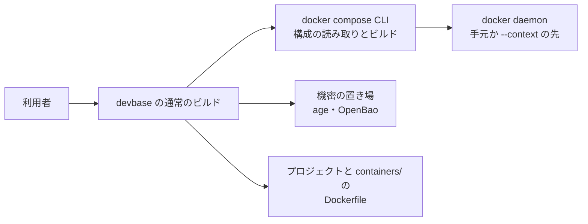
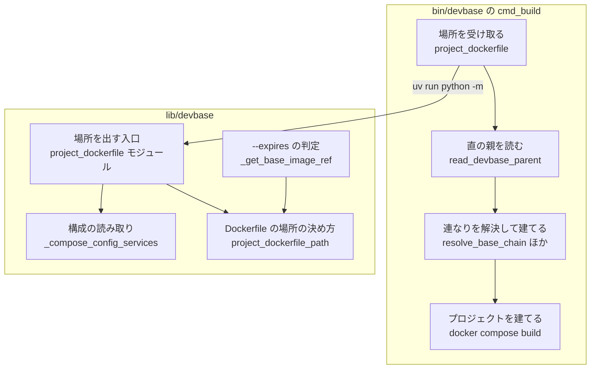
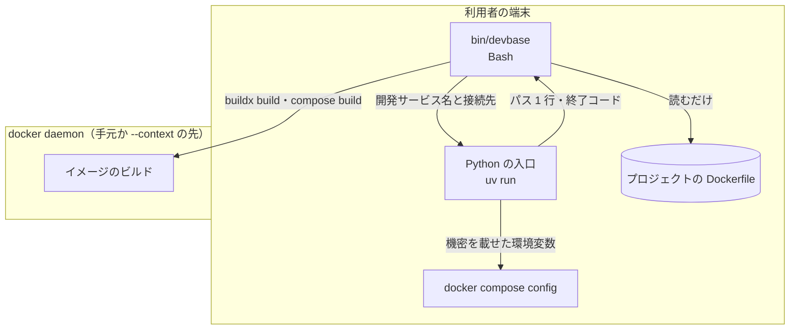
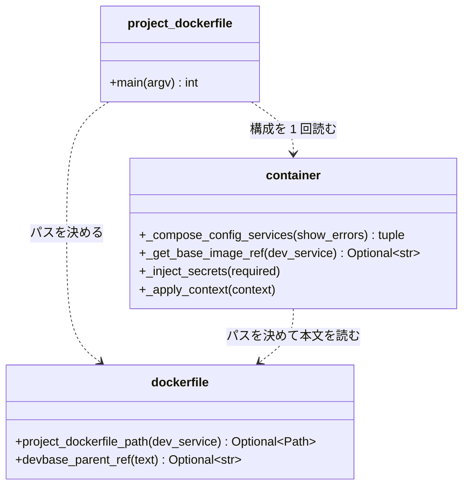
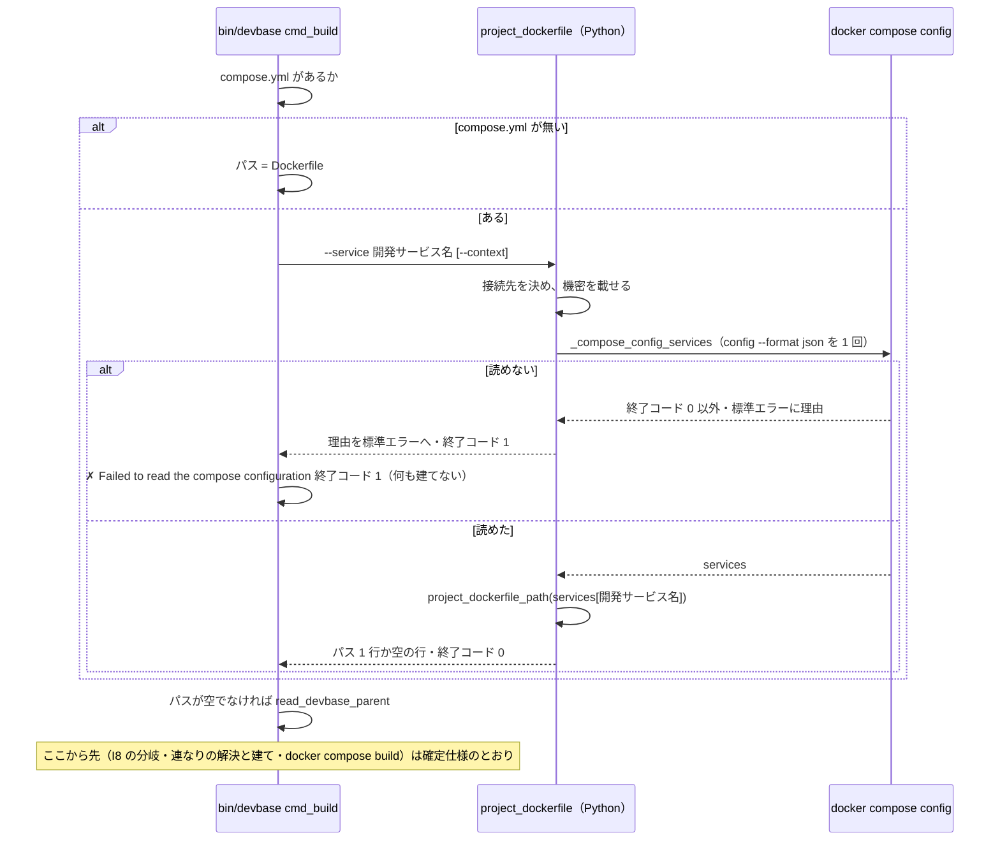

# devbase build: 開発サービスより前に別のサービスの `build:` がある・`build: ./dev` と書いたプロジェクトで、通常のビルドが開発サービスと違う Dockerfile から継承の連なりを決める → 開発サービスの `build` から Dockerfile を決め、`--expires` の判定と同じ場所を読む（#415）

## 目的

- **何が壊れているか**: 通常のビルドは `compose.yml` の最初の `build:` の直後 3 行から Dockerfile を決める。開発サービスの `build` かどうかを見ず、`build: ./dev` の形を読まない
- **誰が困るか**: 開発サービスより前に `build:` を持つサービスを書いた・`build` を文字列で書いたプロジェクトの利用者。開発サービスが継ぐイメージが先に建たず、`--expires` の判定とも別のイメージを見る
- **直すと何が成り立つか**: 通常のビルドは `docker compose build` が建てる開発サービスの Dockerfile から継承の連なりを決め、`--expires` の判定と同じ規則で同じパスを読む

## 適用範囲

- **働く範囲**: このリポジトリの `bin/devbase` と `lib/devbase/`。配布先は `install.sh` で `main` を取る利用者の端末。プラグインのリポジトリ（`projects/*`）は変えない
- **プロジェクトごとに違うもの**: Dockerfile の場所はプロジェクトの compose の構成から、開発サービス名は `DEV_SERVICE_NAME`（`env`）から受ける。新しい設定と引数は足さない
- **当たるモード**: `standard`

## あるべき姿の根拠

| 根拠 | 種類 | 何を示すか |
| --- | --- | --- |
| `docker compose config --format json` は `build: ./dev` を `{"context": "<絶対パス>/dev", "dockerfile": "Dockerfile"}` に、`context: ${CTX:-./dev}` を展開済みの絶対パスに直して出す（Docker Compose v5.1.4、macOS、2026-10-05 に一時のディレクトリで確かめた） | 実測 | 文字列の形・環境変数の展開・相対パスを、compose 自身の解釈で 1 つの形に揃えて受け取れる |
| 同じ実測で、`${MISSING:?need it}` を含む構成の `docker compose config` は `required variable MISSING is missing a value: need it` を標準エラーに出して終了コード 1 で終わる | 実測 | 構成を読めない理由は compose が 1 行で出す。devbase は言い換えずに届ければよい |
| 課題の本文「`--expires` の判定（`_get_base_image_ref`）は、`docker compose config` から dev のサービスの `build` を取り、そこから Dockerfile を決める」 | 利用者の指示の原文 | 通常のビルドをこちらへ揃えれば、2 つの経路の決め方が 1 つになる |
| 課題の本文の前提 2「`compose.yml` を行の並びとして読む方法は採らない」 | 利用者の指示の原文 | 行の読みを直す案（`grep` の改良）を退ける |

要求と受け入れ条件は #415 の本文にある（コピーは `issues/issue-415-requirements.md`）。この文書は「どう作るか」だけを扱う。
確定仕様 `docs/specifications/base-image-chain-build.md` の I1〜I8 はそのまま成り立ち、この文書は I9 から番号を続ける。

## ドメインモデル

### コンテキスト

| コンテキスト | 何の語が 1 つの意味に決まるか |
| --- | --- |
| イメージの継承（`image-lineage`） | プロジェクトの Dockerfile・Dockerfile の場所の決め方・直の親イメージ・継承の連なり |
| Compose の構成（`compose`） | compose の構成（`docker compose config` が出す、展開と正規化を済ませたサービスの定義） |
| コマンドの入口（`cli`） | 通常のビルド（`bin/devbase` の `cmd_build`）の経路と出力の行 |

Compose の構成が上流、イメージの継承が下流の**順応者**である。イメージの継承は `docker compose config` の出す
`build` を書き換えずに受け取り、変数の展開・相対パスの解決・文字列の形の扱いを自分では行わない。
イメージの継承とコマンドの入口の関係（コマンドの入口が順応者）は確定仕様のとおりで変えない。

### 集約

| 集約 | 持ち主（書き換えてよいもの） | 根 | エンティティ | 値オブジェクト |
| --- | --- | --- | --- | --- |
| プロジェクトの Dockerfile | Dockerfile の場所の決め方（`lib/devbase/utils/dockerfile.py` の `project_dockerfile_path`） | 開発サービスの `build` の定義 | — | `context`・`dockerfile`・決めたパス |

ビルドのたびに compose の構成から作り直し、保存しない。通常のビルドと `--expires` の判定はどちらもパスを
読むだけで、決め方を自分では持たない。

### 不変条件

| # | 集約 | 条件 | 破れたときの扱い |
| --- | --- | --- | --- |
| I9 | プロジェクトの Dockerfile | 同じ compose の構成と同じ開発サービス名から、通常のビルドと `--expires` の判定は同じパスを決める | 入力の表を両方の経路に通す契約のテストが落ちる |
| I10 | プロジェクトの Dockerfile | パスは開発サービス名のサービスの `build` だけから決まり、ほかのサービスの `build`・サービスの並び・`build` の書き方（文字列か辞書か）に左右されない | テストが落ちる |
| I11 | プロジェクトの Dockerfile | 開発サービスが構成に無い・`build` を持たないとき、プロジェクトの Dockerfile は無い。通常のビルドはどの Dockerfile も読まず I8 の分岐へ進む | テストが落ちる |
| I12 | プロジェクトの Dockerfile | compose の構成を読めないとき、通常のビルドはどの段の `docker buildx build` も `docker compose build` も起動せず、理由を出して終了コード 1 で止まる | テストが落ちる |
| I13 | プロジェクトの Dockerfile | 通常のビルド 1 回で `docker compose config` を起動するのは 1 回以下である | テストが落ちる |

### ドメインイベント

| # | イベント | 発生元 | 受け手 |
| --- | --- | --- | --- |
| E1 | compose の構成を読んだ | 構成の読み取り（`_compose_config_services`） | Dockerfile の場所の決め方 |
| E2 | プロジェクトの Dockerfile の場所を決めた | Dockerfile の場所の決め方（`project_dockerfile_path`） | 通常のビルド（`read_devbase_parent`）・`--expires` の判定（`_get_base_image_ref`） |
| E3 | 直の親イメージを読んだ | `read_devbase_parent` / `devbase_parent_ref`（変えない） | 連なりの解決・`--expires` の鮮度の判定 |
| E4 | 継承の連なりを解決した | `resolve_base_chain`（変えない） | 連なりの建て |
| E5 | 連なりの段を下から建てた | `build_base_chain`（変えない） | プロジェクトの建て |
| E6 | 開発サービスのイメージを建てた | `docker compose build`（変えない） | 呼び出し元（終了コード） |

E1 の失敗（構成を読めない）は通常のビルドを止める（I12）。`--expires` の判定では今と同じくキャッシュありのビルドへ
進み、そのビルドが E1 をもう一度起こして I12 で止まる。

### 用語

| 用語 | 意味 | 用語集への反映 |
| --- | --- | --- |
| プロジェクトの Dockerfile | プロジェクトの compose の構成で、開発サービス名のサービスの `build`（`context` と `dockerfile`）が指す Dockerfile。開発サービスが `build` を持たないときは無い | 追加（要求の変更で反映済み） |
| Dockerfile の場所の決め方 | compose の構成からプロジェクトの Dockerfile のパスを決める規則。通常のビルドと `--expires` の判定が同じ規則を使う | 追加（要求の変更で反映済み） |

## 機能一覧

| # | 機能 | 誰が使うか |
| --- | --- | --- |
| F1 | 通常のビルドが、開発サービスの `build` が指す Dockerfile から継承の連なりを決めて建てる | プロジェクトの利用者 |
| F2 | 開発サービスが `build` を持たないプロジェクトで、Dockerfile を読まずに `devbase-base` の有無の分岐へ進む | プロジェクトの利用者 |
| F3 | compose の構成を読めないとき、どのイメージも建てずに compose の理由を出して止まる | プロジェクトの利用者・プラグインの作者 |
| F4 | 通常のビルドと `--expires` の判定が 1 つの決め方を共有する | devbase の開発者 |

## 構成要素

| 要素 | 置き場所 | 責務 |
| --- | --- | --- |
| Dockerfile の場所の決め方（新設） | `lib/devbase/utils/dockerfile.py` の `project_dockerfile_path(dev_service)` | 開発サービスの定義（辞書）から Dockerfile のパスを返す。`build` が無ければ `None`。文字列の形は `context` とし、`dockerfile` が無ければ `Dockerfile`、絶対パスならそのまま、相対なら `context` に連結する。ファイルを読まず、副作用を持たない |
| 構成の読み取り（変更） | `lib/devbase/commands/container.py` の `_compose_config_services` | `docker compose config --format json` を起動する唯一の関数のまま。キーワード引数 `show_errors`（既定 `False`）を足し、`True` で 0 以外のとき compose の標準エラーを自分の標準エラーへそのまま書く。戻り値と既定の振る舞いは変えない |
| `--expires` の判定（変更） | 同 `_get_base_image_ref` | パスを `project_dockerfile_path` から受け、本文の読みは `devbase_parent_ref` に任せる。判定の結果は変えない |
| 場所を出す入口（新設） | `lib/devbase/commands/project_dockerfile.py`（`python -m` で起動するモジュール。CLI のサブコマンドにしない） | 引数 `--service NAME`（必須）と `--context NAME`（任意）を受け、接続先と機密を載せてから構成を 1 回読み、そのサービスのパスを標準出力へ 1 行で出す。終了コードは下の「入出力の契約」 |
| 通常のビルドの入口（変更） | `bin/devbase` の `cmd_build` | `compose_build_field` と `resolve_project_dockerfile` を消す。`compose.yml` があれば新しい補助関数 `project_dockerfile` で入口を 1 回起動してパスを受け、無ければ今と同じく `Dockerfile` を読む。入口が 0 以外で終われば `✗` の行を出して終了コード 1 |
| 確定仕様（変更） | `docs/specifications/base-image-chain-build.md` | 「含まない」の #415 の行と、構成要素の表の「最初の `build:`」の行を消し、I9〜I13・入口の契約・流れの図を足す |
| 変更履歴（変更） | `CHANGELOG.md` の `[Unreleased]` の `Fixed` | 通常のビルドが開発サービスの Dockerfile から継承の連なりを決めるようになったこと、構成を読めないときに建てずに止まること |
| テスト（新設・変更） | `tests/cli/`・`tests/utils/` | 下の「テスト設計」。`compose.yml` を置いて偽の `uv` で通常のビルドを打つ既存のテスト 4 件（`test_build_browser_image.py` の 1 件、`test_wrapper_shellcheck_fixes.py` の 3 件）は、場所を出す入口を本物で動かし偽の `docker` が構成の JSON を返す形（「テスト設計」のハーネス）に書き換える |

変えないもの: `read_devbase_parent`・`resolve_base_chain`・`build_base_chain`・`build_base_image`・`_DEVBASE_FROM_RE`・
`devbase_parent_ref`、`cli.py` のパーサーと `SUBCMD_MAP`、`bin/devbase` の振り分けと `_PROJECT_NAME_SUBCOMMANDS`。
入口を CLI のサブコマンドにしないため、サブコマンドの集合（`SUBCMD_MAP` の前方一致・help の一覧・名前を取る
サブコマンドの一覧）に値は増えない。

### 文脈



docker compose CLI・機密の置き場・docker daemon はこの変更で変えない外部である。プロジェクトの Dockerfile と
`compose.yml` はプラグインのリポジトリが持ち、この変更では読むだけである。

### 構成要素の関係



`--expires` の判定が構成を読む経路（`_resolve_dev_service` → `_compose_config_services`）は変えないため図から省く。

### 配置



構成の読み取りとプロジェクトの Dockerfile の読みは端末の中で終わり、daemon へ繋がない（前提 3）。機密は
Python の入口の環境変数として `docker compose config` へ渡り、ファイルにも標準出力にも書かない。

### 置き場所

```text
bin/devbase                                  # cmd_build を変える
lib/devbase/
├── commands/
│   ├── container.py                         # _compose_config_services・_get_base_image_ref を変える
│   └── project_dockerfile.py                # 新設（python -m の入口）
└── utils/
    └── dockerfile.py                        # project_dockerfile_path を足す
tests/
├── cli/
│   ├── test_project_dockerfile_contract.py  # 新設（I9 の契約の表）
│   ├── test_build_project_dockerfile.py     # 新設（受け入れ条件 1〜3・5・6・8）
│   ├── test_build_browser_image.py          # 偽の uv を書き換える
│   └── test_wrapper_shellcheck_fixes.py     # 偽の uv を書き換える
└── utils/
    └── test_docker_profiles.py              # show_errors の行を足す
docs/specifications/base-image-chain-build.md
CHANGELOG.md
```

## 構造

変更が触る関数を、置き場所のモジュールを型に見立てて描く。



`project_dockerfile_path` の入出力:

| 開発サービスの定義 | 返すパス |
| --- | --- |
| `build` が無い・空 / 開発サービスが無い（`{}`） | `None` |
| `build` が文字列 `X` | `X/Dockerfile` |
| `build` が辞書で `context` だけ | `<context>/Dockerfile` |
| `build` が辞書で `dockerfile` だけ（相対） | `<dockerfile>`（`context` の既定 `.` からの相対） |
| `build` が辞書で両方（`dockerfile` が相対） | `<context>/<dockerfile>` |
| `dockerfile` が絶対パス | `<dockerfile>`（`context` を連結しない） |
| `dockerfile_inline` だけ | `<context>/Dockerfile`（今の `_get_base_image_ref` と同じ。読み方は決めず、2 つの経路が同じになる） |

`docker compose config` の出力では `build` はいつも辞書で、`context` は絶対パスである（あるべき姿の根拠の 1 行目）。
文字列の形と `context` の無い辞書の行は、`_get_base_image_ref` を構成の外から呼ぶ既存のテストの入力を受けるために残す。

## 入出力の契約

### 場所を出す入口（`bin/devbase` だけが呼ぶ内部の約束）

| 項目 | 内容 |
| --- | --- |
| 名前 | `uv run --project "$DEVBASE_ROOT" python -m devbase.commands.project_dockerfile --service <名前> [--context <名前>]` |
| 入力 | `--service`: 開発サービス名（必須。`bin/devbase` は `${DEV_SERVICE_NAME:-dev}` を渡す）。`--context`: `devbase build --context` の値（`_BUILD_CONTEXT` があるときだけ）。カレントディレクトリはプロジェクトのディレクトリ。環境変数は `bin/devbase` が `env` を読んだ後のもの |
| 前処理 | 接続先を `--context` とプロジェクトの設定から決め（`_apply_context`）、今のプロジェクトの機密を載せる（`_inject_secrets(required=False)`。読めなくても警告で続ける） |
| 出力（成功） | 終了コード 0。標準出力に 1 行だけ書く。プロジェクトの Dockerfile があればそのパス、無ければ空の行 |
| 失敗の形 | 構成を読めない（`docker compose config` が 0 以外・出力が JSON でない）: 終了コード 1。compose の標準エラー、または `Unable to read the compose configuration as JSON` を標準エラーへ書き、標準出力には何も書かない。引数の誤り: 終了コード 2（argparse） |
| 互換性 | 新設。公開のコマンドと引数は増えない（help・前方一致に出ない） |

ログは今の devbase と同じく標準エラーへ出る。標準出力をパスの受け渡しだけに使うため、入口は `print` 以外で標準出力へ
書かない。

### 利用者に見える振る舞いの変化（`devbase build`・`up`・`rebuild` の通常のビルド）

| 場合 | 直す前 | 直した後 |
| --- | --- | --- |
| 開発サービスより前に `build:` を持つ別のサービスがある | 別のサービスの Dockerfile から連なりを決める | 開発サービスの Dockerfile から決める。別のサービスの段を建てず、名前も出さない |
| 開発サービスが `build: ./dev` | カレントの `Dockerfile` を読む | `./dev/Dockerfile` を読む |
| 開発サービスが `image:` だけ | カレントの `Dockerfile` か別のサービスの Dockerfile を読む | どれも読まず、I8 の分岐（`[1/2] devbase-base already exists (use --no-cache to rebuild)` か base を建てる） |
| compose の構成を読めない | `context` の `${VAR:?}` だけを Bash の `eval` で検出して止まる。ほかの誤りは段を建ててから `docker compose build` で落ちる | 段を建てる前に、compose の理由（標準エラー）と `✗ Failed to read the compose configuration; no image was built`（標準出力）を出して終了コード 1 |
| `compose.yml` が無い | カレントの `Dockerfile` を読む | 同じ（Python を起動しない） |
| 今の 36 件の形（開発サービスの `build:` が最初で辞書の形） | — | 建てる段・その順・成功の出力の行は同じ。`✗ Invalid base image reference in <パス>` の `<パス>` だけは compose が出す絶対パスになる（今の 36 件は当たらない） |

## 処理の流れ



図に含めない要素は、`--expires` の判定（`_get_base_image_ref`。流れを変えず、構成要素の関係の図にある）と、
実行の流れに乗らない確定仕様・変更履歴・テストである。

`up` と `rebuild` は今と同じく Python（`_run_build`）が `bin/devbase build` を起動して `cmd_build` へ入る。`up` の
自動の準備は `_ensure_images` で構成を 1 回読んでから `cmd_build` を起動するため、`up` 全体では 2 回になる。I13 は
通常のビルド（`cmd_build` の 1 回の実行）の中の回数を縛る。

## 非機能の実現方式

| 大項目 | 要求の条件 | 実現方式 | 確かめ方 |
| --- | --- | --- | --- |
| 性能・拡張性 | compose の構成を読む処理の起動は通常のビルド 1 回につき 1 回以下。ビルドの開始までに増える時間は、設計の段で手元の 1 プロジェクトで測って記録に残す | `cmd_build` は入口を 1 回だけ起動し、入口は `_compose_config_services` を 1 回だけ呼ぶ。`compose.yml` が無ければ起動しない。実測（下の表）では増える時間は 0.2 秒前後 | 受け入れ条件 8 のテスト（偽の `docker` が受けた `compose config` の回数） |
| 運用・保守性 | Dockerfile の場所の決め方は 1 か所が持ち、もう一方の経路はそれを使うか、同じ表のテストで縛る | 決め方は `project_dockerfile_path` だけが持ち、2 つの経路がそれを呼ぶ。加えて入力の表を両方の経路に通すテストで縛る | 受け入れ条件 4 のテスト |
| 移行性 | 利用者とプラグインの作者の作業は要らない。今の 36 件の形では振る舞いが変わらない | 設定・引数・compose の書き方の要求を足さない。36 件の形では入口が今と同じファイルのパスを返す | 受け入れ条件 7（既存のテストを書き換えずに通す）とリリース後の手動確認 |
| システム環境 | macOS（Bash 3.2 と Homebrew の Bash）と Linux（CI）で同じ結果になる。テストは CI で打つ | Bash に残すのはコマンド置換と `[ -f ]` と終了コードの分岐だけで、配列・連想配列・`mapfile` を足さない。パスの組み立てと JSON の読みは Python が持つ | CI の pytest と ShellCheck |

設計の段の実測（2026-10-05、macOS、Docker Desktop 29.4.3、Docker Compose v5.1.4、手元のプロジェクト `proj-a`。
出力は捨て、中身は見ていない）:

| 測ったもの | 1 回目 | 2・3 回目 |
| --- | --- | --- |
| `docker compose config --format json` だけ | 0.11 秒 | 0.06 秒・0.05 秒 |
| `uv run ... python -m devbase.cli env exec -- docker compose config --format json`（機密を載せて読む。新しい入口と同じ形の処理） | 0.85 秒 | 0.21 秒・0.21 秒 |
| `uv run ... python -m devbase.cli env exec -- true`（Python の起動と機密の注入だけ） | 0.36 秒 | 0.19 秒・0.16 秒 |

測ったときは OpenBao に届かず、機密は手元の控えから読んだ（警告の行で確かめた）。OpenBao へ認証する往復の時間は
この値に入っていない。

## 決定の記録

### 決定 1: 2 つの経路が同じパスを読むよう、Dockerfile の場所の決め方を `project_dockerfile_path` 1 つにし、通常のビルドも `--expires` の判定もこれを呼ぶ

決め方を 2 か所に持つと、#415 のように片方だけが別の規則へずれる。`--expires` の判定が既に持つ規則（文字列の形・
`context` の既定 `.`・`dockerfile` の既定と絶対パス）をそのまま関数へ移し、`_get_base_image_ref` の判定の結果を
変えない。`dockerfile_inline` の読み方は決めず、今の規則が返すパスを両方の経路が受ける。

Bash に同じ規則を写して同期のテストで縛る形（#404 の直の親の読み方と同じ形）は採らない。直の親の読み方は 1 つの
正規表現で写しが同じ文字列になるが、場所の決め方は JSON の読みとパスの連結を含み、Bash へ写すと同じ文字列にならない。

根拠: Vision（MVV 版 1）

### 決定 2: `docker compose build` と同じ構成を読むため、通常のビルドは Python の入口を 1 回起動して `docker compose config` の結果から場所を決める

構成の正しい読みは compose 自身にしかできない（文字列の形・変数の展開・上書きのファイル・`COMPOSE_FILE`）。
`docker compose config` の JSON を Bash で読む手段は端末に揃っていない（`jq` も端末の `python3` も前提にできない）。
Python の入口は `_compose_config_services`（構成を起動する唯一の関数）を通るため、`--expires` の判定と同じ読み方になる。

`compose.yml` を `grep`・`awk` で読む形を直す案は採らない（前提 2）。直の親の読みも Python へ寄せる案は採らない。
直の親の読み方は #404 の決定で Bash に置き、この課題の範囲の外である。

#404 が Bash から Python を呼ばなかった理由（偽の `uv` のテストで連なりが決まらない・ビルドのたびに機密の注入が
走る）は、場所を決めるには当たらない。変数の展開に機密が要るため構成の読みには機密の注入が要り、偽の `uv` の
テストは `compose.yml` を置く場合だけ入口に答えればよい（決定 4）。

根拠: Vision（MVV 版 1）

### 決定 3: 公開のコマンドと引数を増やさないため、入口を CLI のサブコマンドにせず `python -m devbase.commands.project_dockerfile` にする

要求の「影響」は、コマンドと引数を変えないとしている。`devbase.cli` のサブコマンドにすると、help の一覧と
前方一致（`SUBCMD_MAP`）の集合に値が増える。Python 3.13 の argparse は `help=argparse.SUPPRESS` を付けた
サブコマンドも一覧に `==SUPPRESS==` として出す（2026-10-05 に確かめた）。`project dockerfile` を `project` の
集合へ足すと、`devbase project d` が `down` に決まらなくなる。

`devbase.cli project build` に隠しの引数を足す案は採らない。`bin/devbase` の通常のビルドが Python の
`project build` を呼ぶ形になり、2 つの経路を「Python の `project build` を呼ぶか」で分けている既存の確かめ方
（`tests/cli/test_build_image_argument.py`）と読み手の区別が崩れる。`env exec -- python -m ...` で子を起動する
案は採らない。子の `python` がどれになるかが `PATH` と `VIRTUAL_ENV` に左右され、Python の起動が 2 回になる。

根拠: 根拠なし（MVV 版 1）

### 決定 4: compose の無い起動と既存のハーネスを変えないため、`compose.yml` が無ければ入口を起動せず、カレントの `Dockerfile` を読む

`compose.yml` が無い起動は今と同じ振る舞いにする。devbase のプロジェクトはどれも `compose.yml` を持ち
（`_build_resolved` も `compose.yml` を前提にする）、無いときは続く `docker compose build` が別の理由で落ちる。
受け入れ条件 7 が書き換えなしで通ることを求める `tests/cli/test_build_base_chain.py` は `compose.yml` を置かずに
`Dockerfile` だけで通常のビルドを打つため、この分岐が無いと偽の `uv` の答えを場所として読んでしまう。

`compose.yml` が無いときも入口を起動する案は採らない。`compose.yaml` などの別の名前を読めるが、devbase の
ほかの経路が `compose.yml` だけを前提にしており、この課題で揃える対象の外である。

根拠: 根拠なし（MVV 版 1）

### 決定 5: 構成を読めない理由を利用者へ届けるため、compose の標準エラーをそのまま出し、`bin/devbase` は `✗ Failed to read the compose configuration; no image was built` を出して終了コード 1 で止まる

compose の理由（`required variable MISSING is missing a value: need it` など）は 1 行で原因と変数の名前を示し、
devbase が言い換えると情報が減る。`_compose_config_services` は標準エラーを取り込むため、キーワード引数
`show_errors` を足して取り込んだものを書き出す。既定は `False` で、`up` などほかの呼び出し元の出力は変えない。
`✗` の行は、ほかの `✗` の行（連なりを決められない場合）と同じく標準出力へ出す。

`_compose_config_services` を経由せず入口が `docker compose config` を直に起動する案は採らない。構成を起動する
関数を 1 つに寄せた決定（PLAN65 決定 9。予約のプロファイルを付ける）を崩す。

根拠: 根拠なし（MVV 版 1）

### 決定 6: `docker compose build` が建てるサービスと同じサービスを見るため、開発サービス名は `bin/devbase` が `--service` で渡す

`bin/devbase` は `${DEV_SERVICE_NAME:-dev}`（空なら `dev`）を `docker compose build` に渡し、Python の
`get_dev_service_name()` は空の値をそのまま返す。入口が自分で名前を決めると、`DEV_SERVICE_NAME=` と空で書いた
プロジェクトで、建てるサービスと場所を決めるサービスが分かれる。`bin/devbase` が同じ式の値を引数で渡せば、
この 2 つは常に同じになる。`--expires` の判定が空の値で開発サービスを見失う件は、この課題の範囲の外として
#425 に残した。

根拠: 根拠なし（MVV 版 1）

## テスト設計

通常のビルドの経路を確かめるハーネス（受け入れ条件 1〜6・8、I9〜I13 の通常のビルドの側）は、場所を出す入口を
本物で動かす。今の `exec_wrapper` の偽の `uv`（`UV:$*` を出して 0 で終わる）のままでは入口が動かず、偽の `uv` が
答えるパスをテストの側が決めるため、下の表の「どう壊したら落ちるべきか」が成り立たない。

- 偽の `uv` は、`python -m devbase.commands.project_dockerfile` の起動だけを本物の Python へ渡す
  （`PYTHONPATH` にリポジトリの `lib` を入れて、受けた引数のまま実行する）。それ以外の起動は今のまま `UV:$*` を出す
- `PATH` の先頭に偽の `docker` を置く。`compose config --format json` にはテストが置いた構成の JSON を返し、
  起動した引数と回数をファイルへ記録する。`buildx build`・`compose build`・`image inspect` なども引数を記録し、
  テストが決めた終了コードで終わる。構成を読めない場合（受け入れ条件 6）は、偽の `docker` が compose の理由を
  標準エラーへ出して 0 以外で終わる
- 入口は tmp の `DEVBASE_ROOT` を見て、実環境の機密・OpenBao・daemon に触れない
- 受け入れ条件 8 の回数は、偽の `docker` の記録の `compose config` の行で数える

| 受け入れ条件・不変条件 | どの振る舞いで縛るか | どう壊したら落ちるべきか |
| --- | --- | --- |
| 受け入れ条件 1・I10 | 構成で開発サービスより前に別のサービス（`FROM devbase-other`）があり、開発サービスが `FROM devbase-base` のとき、通常のビルドは `devbase-base` を建て、`devbase-other` を建てず、出力に `devbase-other` が無い | 決め方が最初の `build` を持つサービスを選ぶと落ちる |
| 受け入れ条件 2・I10 | 開発サービスの `build` が `./dev` のとき、`./dev/Dockerfile` の直の親の連なりを建て、カレントの `Dockerfile` の直の親を建てない | 文字列の形を読まずカレントの `Dockerfile` に戻すと落ちる |
| 受け入れ条件 3 | `DEV_SERVICE_NAME` に `dev` 以外を設定すると、その名前のサービスの Dockerfile から連なりを決め、入口へその名前が渡る | 入口へ `dev` を固定で渡すと落ちる |
| 受け入れ条件 4・I9 | 文字列の形 / `context` だけ / `dockerfile` だけ / 両方 / `dockerfile` が絶対パス / `context` に環境変数 / 開発サービスより前に別のサービス / 開発サービスが `build` を持たない、の表の各行を、通常のビルドの経路（建つ段、または I8 の分岐へ進むこと）と `_get_base_image_ref` の両方に通し、同じ Dockerfile を読む | どちらかの経路だけが `project_dockerfile_path` を使わず別の規則で決めると落ちる |
| 受け入れ条件 5・I11 | 開発サービスが `image:` だけのとき、カレントに `FROM devbase-other` の `Dockerfile` があっても読まず、`devbase-base:latest` があれば `[1/2] devbase-base already exists (use --no-cache to rebuild)` を出して建てず、無ければ `devbase-base` を建てる | `build` が無いときにカレントの `Dockerfile` へ戻すと落ちる |
| 受け入れ条件 6・I12 | 構成を読めないとき（`context` が `${MISSING:?}` で変数が無い）、`docker buildx build` も `docker compose build` も起動せず、compose の理由と `✗ Failed to read the compose configuration` が出て終了コード 1 | 入口の失敗を空のパスとして続けると落ちる |
| 受け入れ条件 7 | `tests/cli/test_build_base_chain.py` の既存のテストが書き換えなしで通る | `compose.yml` の無い起動でも入口を起動すると落ちる |
| 受け入れ条件 8・I13 | 通常のビルド 1 回（通常・`--no-cache`・`--project-no-cache`）で `docker compose config` の起動が 1 回、`compose.yml` が無ければ 0 回 | 入口の呼び出しを経路ごと・段ごとに重ねると落ちる |
| 受け入れ条件 9 | 確定仕様の「含まない」と構成要素の表に「最初の `build:`」が無く、プロジェクトの Dockerfile を開発サービスの `build` から決めると書いてある | 文書の確かめ（レビュー）で見る |
| 受け入れ条件 10 | `CHANGELOG.md` の `[Unreleased]` に通常のビルドの変更がある | 文書の確かめ（レビュー）で見る |
| 入口の契約 | 成功で標準出力が 1 行（パスか空）だけ、構成を読めないと終了コード 1 で標準出力が空、`show_errors=True` で compose の標準エラーが出て既定では出ない | 入口がログを標準出力へ書く・`show_errors` の既定を `True` にすると落ちる |
| 決め方の表 | 「構造」の `project_dockerfile_path` の表の各行の返り値 | 表のどれかの行の規則を変えると落ちる |

`compose.yml` を置いて偽の `uv` で通常のビルドを打つ既存のテスト 4 件は、上のハーネス（入口を本物で動かし、
偽の `docker` が構成の JSON を返す）に書き換え、確かめる振る舞い（`context` と `dockerfile` から連なりを建てる・`dockerfile` が無くても進む・構成を
読めないと何も起動せず止まる・ブラウザの派生イメージの順）は変えない。

## 設計の結果

| 課題 | 扱い | 取り込み先 | 触るファイル |
| --- | --- | --- | --- |
| #415 | 実装する | — | `bin/devbase`、`lib/devbase/utils/dockerfile.py`、`lib/devbase/commands/container.py`、`lib/devbase/commands/project_dockerfile.py`、`tests/cli/`、`tests/utils/test_docker_profiles.py`、`docs/specifications/base-image-chain-build.md`、`CHANGELOG.md` |

## 未確認のまま残ること

| 項目 | 内容 |
| --- | --- |
| リモートの接続先での構成の読み | `--context` が SSH の接続先を指すときに `docker compose config` が daemon へ繋がないこと（前提 3）は実機で確かめていない。手元の daemon を指す別名の接続先で確かめられる。実装の段で確かめる |
| OpenBao へ認証するときの時間 | 実測は OpenBao に届かない状態（控えから読む）で行った。認証の往復が入ると増える時間は 0.2 秒より大きくなりうる。リリース後の手動確認で `devbase build` の開始までの時間を見る |
| 36 件の実機の出力 | 36 件の形で出力の行が変わらないことは、テストでは代表の形で確かめる。実機の 1 件はリリース後の手動確認（要求の「検証手段」）で見る |
