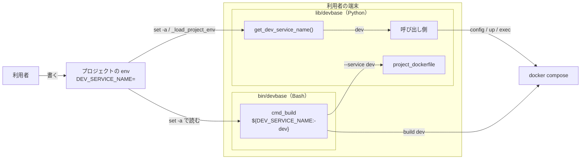
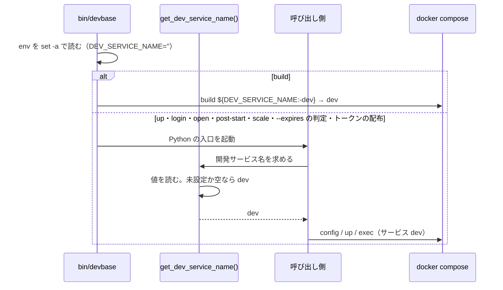

# devbase: `DEV_SERVICE_NAME=` と空で書いたプロジェクトで、`build` は `dev` を建てるのに `up`・`login`・`--expires` の判定などは空の名前のサービスを探して開発サービスを見失う → 空の値は未設定と同じく `dev` と読み、どの経路も同じ開発サービスを使う（#425）

## 目的

- **何が壊れているか**: `bin/devbase` は `${DEV_SERVICE_NAME:-dev}` で空の値を `dev` と読むが、Python の `get_dev_service_name()` は空の値をそのまま返す。同じ `env` から 2 つの開発サービス名が生まれる
- **誰が困るか**: プロジェクトの `env` に `DEV_SERVICE_NAME=` と空で書いた利用者。`build` は通るのに、`up` のイメージの確かめ・`login`・`open`・`post-start`・`scale`・`--expires` の判定・トークンの配布が開発サービスを見つけられない
- **直すと何が成り立つか**: 空の値は未設定と同じく `dev` になり、`bin/devbase` と Python が同じ `env` から同じ開発サービス名を得る

## 適用範囲

- **働く範囲**: このリポジトリの `lib/devbase/`。配布先は `install.sh` で `main` を取る利用者の端末。`bin/devbase` とプラグインのリポジトリ（`projects/*`）は変えない
- **プロジェクトごとに違うもの**: 開発サービス名はプロジェクトの `env` の `DEV_SERVICE_NAME` から受ける（今と同じ）。新しい設定と引数は足さない
- **当たるモード**: `standard`

## あるべき姿の根拠

| 根拠 | 種類 | 何を示すか |
| --- | --- | --- |
| `bin/devbase` の `cmd_build` は `docker compose build "${DEV_SERVICE_NAME:-dev}"` と `--service "${DEV_SERVICE_NAME:-dev}"` で名前を決める（`bin/devbase` の 245・328・333・337 行） | 既存の形 | 空の値を `dev` と読む規則がすでに配布物にあり、Python をこちらへ揃えれば読み方が 1 つになる |
| Bash の `${VAR:-word}` は、変数が未設定か空のときに `word` へ置き換え、空白だけの値は置き換えない（`bash -c 'X=" "; printf "[%s]" "${X:-dev}"'` は `[ ]`、`X=` では `[dev]`。macOS の bash 5.3、2026-10-07） | 実測 | 「空」は長さ 0 の文字列だけを指す。前提 2（空白だけの値は空に含めない）と一致する |
| 課題の本文の前提 1「`bin/devbase` の `${DEV_SERVICE_NAME:-dev}` の読み方に Python を揃える（`bin/devbase` の側は変えない）」 | 利用者の指示の原文 | 直す側を Python に決める |

要求と受け入れ条件は #425 の本文にある（コピーは `issues/issue-425-requirements.md`）。この文書は「どう作るか」だけを扱う。

## ドメインモデル

### コンテキスト

| コンテキスト | 何の語が 1 つの意味に決まるか |
| --- | --- |
| Compose の構成（`compose`） | 開発サービス名（どのサービスを開発サービスとして扱うか） |

変更はこの 1 つのコンテキストに閉じる。開発サービス名を使う側（コマンドの入口 `cli`・イメージの継承 `image-lineage`）は
名前を受け取るだけで、読み方を自分では持たない。その関係は変えない。

### 集約

| 集約 | 持ち主（書き換えてよいもの） | 根 | エンティティ | 値オブジェクト |
| --- | --- | --- | --- | --- |
| 開発サービス名 | Python 側は `lib/devbase/volume/compose.py` の `get_dev_service_name()`、Bash 側は `bin/devbase` の `${DEV_SERVICE_NAME:-dev}`（この変更では変えない） | 環境変数 `DEV_SERVICE_NAME` の値 | — | 決めた名前（文字列） |

呼び出しのたびに環境変数から決め直し、保存しない。持ち主が 2 つあるのは、Bash と Python という別の実行の単位が
それぞれ名前を必要とするためである。2 つが同じ規則で読むことを I3 で縛る。

### 不変条件

| # | 集約 | 条件 | 破れたときの扱い |
| --- | --- | --- | --- |
| I1 | 開発サービス名 | `DEV_SERVICE_NAME` が未設定か空（長さ 0）なら、名前は `dev` である | 単体のテストが落ちる |
| I2 | 開発サービス名 | `DEV_SERVICE_NAME` が空でなければ、名前はその値を変えずに使う（空白だけの値も前後の空白を削らない） | 単体のテストが落ちる |
| I3 | 開発サービス名 | 同じ `DEV_SERVICE_NAME` の値（未設定・空・`app`・空白 1 文字）から、`bin/devbase` の `${DEV_SERVICE_NAME:-dev}` と `get_dev_service_name()` は同じ名前を決める | 2 つを並べて比べるテストが落ちる |
| I4 | 開発サービス名 | `lib/devbase/` で `DEV_SERVICE_NAME` を読むのは `volume/compose.py` の 1 か所だけである | 環境変数の読み取りを集める検査のテストが落ちる |

### ドメインイベント

| # | イベント | 発生元 | 受け手 |
| --- | --- | --- | --- |
| E1 | 利用者がプロジェクトの `env` に `DEV_SERVICE_NAME=` と書いた | 利用者 | `bin/devbase`（E2）・`_load_project_env`（E2 の Python 側の読み込み） |
| E2 | 空の `DEV_SERVICE_NAME` が環境変数として Python へ渡った | `bin/devbase` の `set -a` での読み込み、または `_load_project_env` | `get_dev_service_name()`（E3） |
| E3 | Python が開発サービス名を求め、`dev` を得た | `get_dev_service_name()` | 呼び出し側（E4） |
| E4 | 呼び出し側が compose の構成から開発サービス `dev` を引いた | `_resolve_dev_service`・`generate_scaled_compose` など（変えない） | `up`・`login`・`open`・`post-start`・`scale`・`--expires` の判定・トークンの配布 |
| E5 | `build` が `dev` を建て、同じ `dev` を `--service` で Dockerfile の場所を決める入口へ渡した | `bin/devbase` の `cmd_build`（変えない） | `docker compose build`・`project_dockerfile` |

E3 と E5 が同じ `dev` になることが、この変更で揃える点である（I3）。

### 用語

| 用語 | 意味 | 用語集への反映 |
| --- | --- | --- |
| 開発サービス名 | `get_dev_service_name()` が返す名前（`DEV_SERVICE_NAME`。未設定か空なら `dev`）。生成物では `<開発サービス名>-1`..`-N` へ複製される | 意味の変更（`compose`。この設計の変更で反映済み） |

## 機能一覧

| # | 機能 | 誰が使うか |
| --- | --- | --- |
| F1 | `DEV_SERVICE_NAME=` と空で書いたプロジェクトで、`up`・`login`・`open`・`post-start`・`scale`・`--expires` の判定・トークンの配布が `dev` を開発サービスとして使う | プロジェクトの利用者 |
| F2 | `bin/devbase` と Python が、同じ `env` から同じ開発サービス名を決める | devbase の開発者 |

## 構成要素

| 要素 | 責務 | この変更 |
| --- | --- | --- |
| `get_dev_service_name()`（`lib/devbase/volume/compose.py`） | 環境変数から開発サービス名を決める。Python で `DEV_SERVICE_NAME` を読む唯一の場所 | 変える。空の値を `dev` と読む |
| `cmd_build`（`bin/devbase`） | `${DEV_SERVICE_NAME:-dev}` で名前を決め、`docker compose build` と `project_dockerfile --service` へ渡す | 変えない |
| 呼び出し側（`container.py` の `cmd_up`・`cmd_login`・`cmd_open`・`cmd_post_start`・`cmd_scale`・`_resolve_dev_service`・`_ensure_images`・`_dev_instance_indices`・`_maybe_open_editor`・`_open_editor_at`、`env.py` の `_push_token_to_running`、`compose.py` の `generate_scaled_compose`） | 名前を受け取り、compose の構成から開発サービスを引く | 変えない |
| 用語集の「開発サービス名」（`docs/glossary/glossary.json` と、作り直す `docs/glossary.md`） | 語の意味を定める | 変える（この設計の変更で反映） |
| 用語集の意味を写した確定仕様の文（`docs/specifications/editor-open.md` と `docs/specifications/compose-profiles.md` の用語の表） | 仕様の中で語の意味を示す | 変える。用語集と同じ文にする |
| `CHANGELOG.md` の `[Unreleased]` | 利用者に見える振る舞いの変更を記す | 足す |

型・クラスは足さず変えない。`get_dev_service_name()` の引数と戻り値の型（`str`）も変えないため、クラス図と構造の節は置かない。

既存の規則のうち、`DEV_SERVICE_NAME` の値を前提にしたものを、名前の検索（`DEV_SERVICE_NAME`・`get_dev_service_name`・`既定 dev`）と、
空の値が通る経路（E1〜E5）の読みで集めた。空の値を `dev` と読んだ後に当てはまらなくなる規則は、上の表の用語集と 2 つの確定仕様の文だけである。
`generate_scaled_compose` の `dev_service_name is None` のときの既定・`_dev_instance_indices` の `<名前>-<番号>` の照合・
`tests/conftest.py` の隔離の一覧は、受け取る名前が `dev` になるだけで、そのまま当てはまる。

### 文脈と配置

変更は `G` の 1 か所に閉じる。`B` と `PD` と `C` は変えない。

## 入出力の契約

変えるのは、プロジェクトの `env` に書く `DEV_SERVICE_NAME` の読み方だけである。

| 項目 | 書くこと |
| --- | --- |
| 名前 | 環境変数 `DEV_SERVICE_NAME`（Python の入口は `get_dev_service_name()`） |
| 入力 | 文字列。任意 |
| 出力 | 未設定 → `dev`、空（`''`）→ `dev`（**変わる**。今は `''`）、それ以外 → 値をそのまま（空白だけの値も含む） |
| 失敗の形 | 無い。名前は必ず決まる。構成にその名前のサービスが無いときの扱いは呼び出し側が持ち、変えない |
| 互換性 | 空で書いたプロジェクトだけが変わる。今の振る舞いは開発サービスを見失うだけで、頼りにする利用者は無いと置く（要求の前提 4）。未設定と空でない値のプロジェクトは変わらない |

## 処理の流れ

構成要素の表のうち、用語集・確定仕様の文・`CHANGELOG.md` は実行の流れに現れないため、この図に描かない。

## 決定の記録

### 決定 1: どの呼び出し側も同じ名前を得るため、空の値を `dev` と読む規則を `get_dev_service_name()` の中だけに置く

呼び出し側は 12 か所あり、どれも `get_dev_service_name()` から名前を受け取る（要求の前提 3）。規則を関数の中に置けば、
呼び出し側を変えずにすべての経路が揃う。Python の読み込み（`_load_project_env`）も空の値を環境へ載せるため、
`bin/devbase` を通らない経路も同じ関数で揃う。

`bin/devbase` で空の `DEV_SERVICE_NAME` を消してから Python へ渡す形は採らない。`bin/devbase` を変えないという要求の
前提 1 に反し、`_load_project_env` が `env` を読み直す経路（トークンの配布など）では空の値が戻る。呼び出し側ごとに
空の値を確かめる形も採らない。12 か所に同じ規則が散り、1 か所の書き漏れで経路が分かれる。

根拠: Value 1 / Mission（MVV 版 1）

### 決定 2: `bin/devbase` と同じ値を空と読むため、空の判定は長さ 0 だけにし、前後の空白を削らない

`${DEV_SERVICE_NAME:-dev}` は空白だけの値を置き換えない（あるべき姿の根拠の実測）。Python が空白を削って `dev` と読むと、
空白だけの値で `build` が建てるサービスと Python が探すサービスがまた分かれる。空白だけの値やサービス名に使えない文字の
検証は、名前の形の検証として別の課題で扱う（要求の「含まない」）。

前後の空白を削ってから空かを見る形は採らない。上の理由で I3 が破れる。

根拠: Value 1（MVV 版 1）

### 決定 3: 環境変数の読み取りを集める検査が今と同じ場所を拾うよう、読み取りは `os.environ.get('DEV_SERVICE_NAME')` の形のまま関数の中に置く

`test_collector_finds_known_reads` と `test_every_env_read_is_listed` は、`os.environ.get(N, ...)` の形を `ast` で拾う
（`docs/specifications/test-environment-isolation.md` の「読み取りの集合の集め方」）。`os.environ.get('DEV_SERVICE_NAME') or 'dev'`
はこの形を保ち、読む場所は `volume/compose.py` のままになる。確定仕様のその節の例（`os.environ.get('DEV_SERVICE_NAME', 'dev')`）は
拾う形の例示で、実際のコードの写しではないため、書き換えない。

空の値を別の関数（環境変数を一般に読む helper）へ寄せる形は採らない。`DEV_SERVICE_NAME` 以外の変数の空の値は範囲の外で
（要求の「含まない」）、helper の中で読むと検査が拾う場所も移る。

根拠: Value 1（MVV 版 1）

## テスト設計

| 受け入れ条件・不変条件 | どの振る舞いで縛るか | どう壊したら落ちるべきか |
| --- | --- | --- |
| 受け入れ条件 1・I1 | `DEV_SERVICE_NAME=''` で `get_dev_service_name()` が `'dev'` を返す | 関数を元の `os.environ.get('DEV_SERVICE_NAME', 'dev')` に戻すと落ちる |
| 受け入れ条件 2・I1 | `DEV_SERVICE_NAME` を消した状態で `'dev'` を返す | 既定を `dev` 以外にすると落ちる |
| 受け入れ条件 3・I2 | `DEV_SERVICE_NAME=app` で `'app'` を返す | 値を捨てて常に `dev` を返すと落ちる |
| 受け入れ条件 4・I2 | `DEV_SERVICE_NAME=' '` で `' '` を返す | 空白を削ってから空かを見る形にすると落ちる |
| I3 | 未設定・空・`app`・空白 1 文字のそれぞれで、Bash が `${DEV_SERVICE_NAME:-dev}` を展開した値と `get_dev_service_name()` が一致する | Python 側だけ空白を削る、または Python 側だけ空を `dev` と読まない形にすると落ちる |
| 受け入れ条件 5 | 構成に `dev` があり `DEV_SERVICE_NAME=''` のとき、`_resolve_dev_service` が `dev` のサービスの定義を返す。`get_dev_service_name` を差し替えずに通す | 関数を元に戻すと、空の名前で引いて空の定義を返し落ちる |
| 受け入れ条件 6・I4 | 読み取りを集める処理が `DEV_SERVICE_NAME` の読み取りを `volume/compose.py` に見つけ、ほかのファイルには見つけない | 呼び出し側に `os.environ.get('DEV_SERVICE_NAME')` を足すと落ちる。関数の読み取りを拾えない形へ書き換えると落ちる |
| 受け入れ条件 7 | `glossary.py check` が設計文書と用語集の食い違いを出さず、`docs/glossary.md` が `glossary.json` から作り直してある | 用語集の意味を古い文に戻すと、`render` の差分が出る |
| 受け入れ条件 8 | `CHANGELOG.md` の `[Unreleased]` を読んで確かめる（レビュー） | — |
| 受け入れ条件 9 | 全体のテスト・lint・固有の語の検査（要求の「検証手段」のコマンド） | — |

既存のテストの多くは `container.get_dev_service_name` を `lambda: 'dev'` に差し替えている。受け入れ条件 5 のテストは差し替えると
関数を通らず、壊しても落ちない。

## 設計の結果

| 課題 | 扱い | 取り込み先 | 触るファイル |
| --- | --- | --- | --- |
| #425 | 実装する | — | `lib/devbase/volume/compose.py`、`tests/volume/`、`tests/commands/`、`tests/test_env_isolation.py`、`docs/specifications/editor-open.md`、`docs/specifications/compose-profiles.md`、`CHANGELOG.md` |

## 未確認のまま残ること

| 項目 | 内容 |
| --- | --- |
| 確定仕様 `base-image-chain-build.md` の決定 6 の文 | 「`get_dev_service_name()` は空の値をそのまま返す」は、直した後に事実でなくなる。決定の理由として残すか、#425 で揃ったと書き足すかは、確定仕様化（`plan-to-spec`）の担当が決める（要求の「未決」） |
| 実機での確かめ | 空の値で `devbase login` が `dev` のコンテナへ入ることは、リリース後テストで作業用のプロジェクトを使って確かめる。実際の利用者の環境での `devbase up` は P3 のため人の承認を得てから行う |
