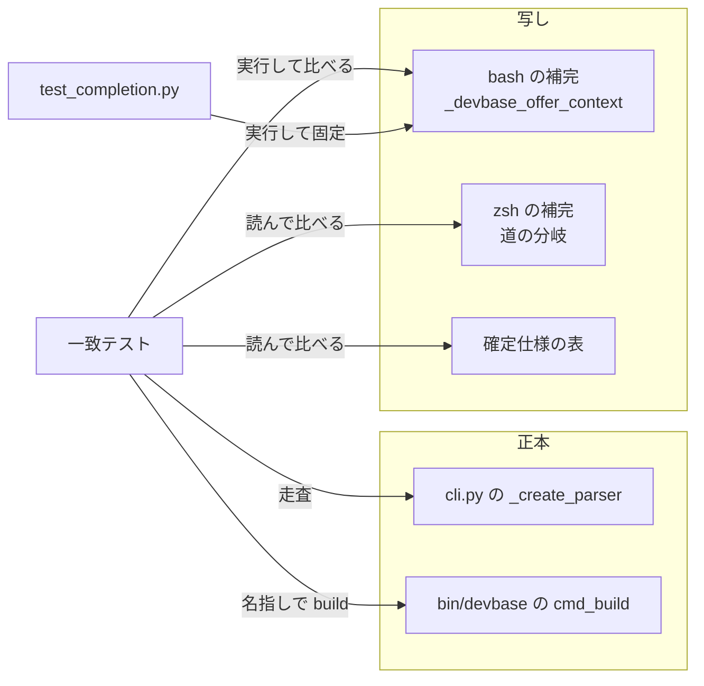
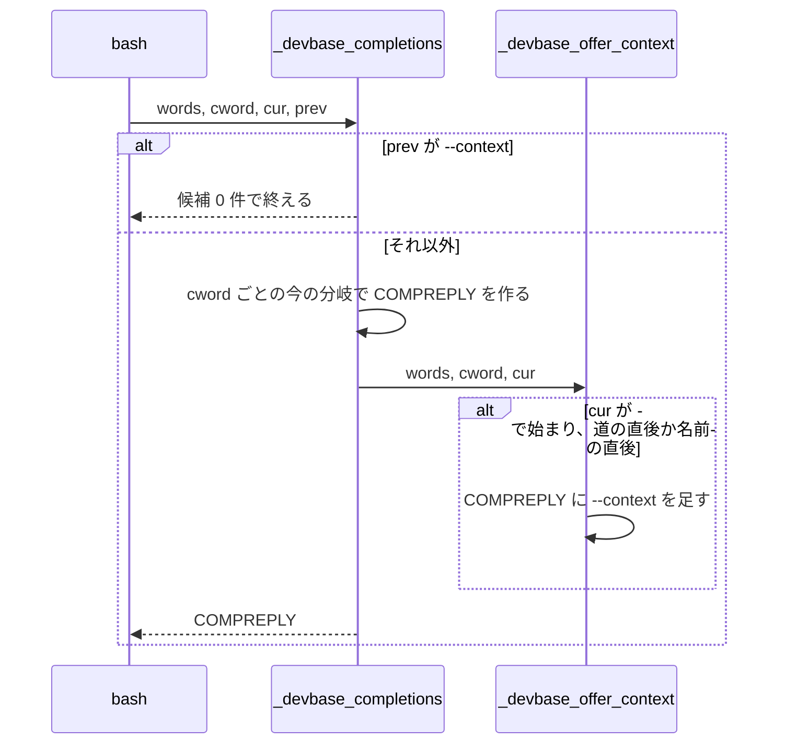

# シェル補完: `--context` を受け付けるサブコマンドの多くで補完が `--context` を出さない → 35 の道すべてで bash と zsh の補完が `--context` を出し、欠けると一致テストが道を挙げて落ちる（#435）

## 目的

- **何が壊れているか**: シェル補完が `--context` を出すのは `open` と `post-start` だけで、`--context` を受け付けるほかの 31 の道（`up`・`env exec`・`container` の配下など）では出ない。一致テストも補完の `--context` を比べない
- **誰が困るか**: `devbase up web --context gpu-wsl` のようにリモートの docker を使う利用者が、補完から `--context` を見つけられない。`--context` を取るサブコマンドを足した開発者は、補完の写しを取り残しても気づけない
- **直すと何が成り立つか**: `--context` の集合の 35 の道すべてで、bash と zsh の補完が `-` で始まる語に `--context` を出し、値の位置では何も出さない。補完の写しが列挙の正本からずれると、一致テストが写しのファイルと道を挙げて落ちる

## 適用範囲

- **働く範囲**: このリポジトリの補完 2 ファイル（`etc/devbase-completion.bash`・`etc/_devbase`）と一致テスト。補完は `devbase shell-rc` などで利用者のシェルに読み込まれて働く。プラグインのリポジトリには及ばない
- **プロジェクトごとに違うもの**: 無し（補完の候補はプロジェクトに依らない。プロジェクト名は今と同じく `projects/` から読む）
- **当たるモード**: `standard`

## あるべき姿の根拠

| 根拠 | 種類 | 何を示すか |
| --- | --- | --- |
| #435 の本文「`--context` を取るすべての副コマンドで、bash と zsh の補完が `--context` を出すようにする。値（コンテキスト名）の補完はしない」 | 利用者の指示の原文 | 出す範囲（すべての道）と、値を補完しないこと |
| `lib/devbase/cli.py` の `_create_parser()` を走査した `--context` の集合が 35 の道になる（`tests/cli/test_name_context_consistency.py` の `CONTEXT_PATHS` を手元で数えた） | 実測 | 補完が `--context` を出すべき道の数と範囲 |
| zsh のマニュアル（`zshcompsys(1)` の `_arguments`）: `optspec:message:action` で action を空にすると、値の位置で説明だけを出し候補を生成しない | 外部の一次情報 | zsh で値を補完しない書き方（`'--context[...]:context:'`）。今の `open` / `post-start` がこの形 |

要求と受け入れ条件は #435 の本文にある（コピーは `issues/issue-435-requirements.md`）。この文書は「どう作るか」だけを扱う。

## ドメインモデル

### コンテキスト

| コンテキスト | 何の語が 1 つの意味に決まるか |
| --- | --- |
| コマンドの入口（`cli`） | 列挙の正本・写し・一致テスト・補完の例外。`--context` を受け付けるサブコマンドの道の集合 |

1 つのコンテキストに収まる。`--context` の値が指す docker の接続先（`docker-context`）は、この変更では補完しないため扱わない。

### 集約

| 集約 | 持ち主（書き換えてよいもの） | 根 | エンティティ | 値オブジェクト |
| --- | --- | --- | --- | --- |
| 列挙の正本 | `lib/devbase/cli.py`（この変更では書き換えない）。トップレベルの `build` だけは `bin/devbase` | `_create_parser()` の木 | サブコマンドの parser | 道（`("project", "up")` のような語の組）・`--context` の集合（35）・`[name]` の集合（17） |
| bash の補完の写し | `etc/devbase-completion.bash` | `_devbase_completions` | 語の位置（`cword`）ごとの分岐 | `--context` を出す道の一覧（35）・名前の後でも出す道の一覧（14）・旗の候補の集合 |
| zsh の補完の写し | `etc/_devbase` | `_devbase` | 道の分岐（`case "$words[N]"` の見出し） | `--context` の指定（`'--context[Docker context]:context:'`） |
| 一致テストの比べ方 | `tests/cli/test_name_context_consistency.py` | 写しごとのテスト | — | 補完の例外の一覧（3 つ） |

写しの 2 つの集約は列挙の正本を道で参照するだけで、互いを参照しない。一致テストは 3 つの集約を読むだけで書き換えない。

### 不変条件

| # | 集約 | 条件 | 破れたときの扱い |
| --- | --- | --- | --- |
| I1 | bash の補完の写し | `--context` の集合のすべての道で、道の直後の位置の `-` で始まる語の候補に `--context` が入る（`container` の道は `ct` で始めても同じ） | 一致テストが「`etc/devbase-completion.bash` が道の直後で `--context` を出さない」と欠けた道を挙げて落ちる |
| I2 | bash の補完の写し | `[name]` の集合から補完の例外を引いた 14 の道で、プロジェクト名の直後の位置の `-` で始まる語の候補に `--context` が入る | 一致テストが「名前の後で `--context` を出さない」と欠けた道を挙げて落ちる |
| I3 | bash の補完の写し | 直前の語が `--context` のとき、候補は 0 件である（コンテキスト名もプロジェクト名も出ない） | `tests/cli/test_completion.py` が出た候補を挙げて落ちる |
| I4 | bash の補完の写し | `--context` の集合に無い道（`list`・`env set`・`project list` など）では、道の直後の `-` で始まる語の候補に `--context` が入らない | 一致テストが「余分」として道を挙げて落ちる |
| I5 | zsh の補完の写し | `--context` の集合のすべての道の分岐の本体に、値の補完を持たない `--context` の指定がある | 一致テストが「`etc/_devbase` の分岐に `--context` の指定が無い」と欠けた道を挙げて落ちる |
| I6 | zsh の補完の写し | `--context` の集合に無い末端の道の分岐の本体に `--context` の指定が無い | 一致テストが「余分」として道を挙げて落ちる |
| I7 | bash の補完の写し | `-` で始まらない語の候補は変わらない。`-` で始まる語の候補は、今の旗の候補に `--context` を足した集合で、ほかの旗は増えない。`--context` は補完する語で始まるときだけ足し、`--a` のように始まらない語の候補は今と変わらない | `tests/cli/test_completion.py` の今の期待値が落ちる |

### ドメインイベント

| # | イベント | 発生元 | 受け手 |
| --- | --- | --- | --- |
| E1 | 利用者が `--context` を受け付けるサブコマンドの後で `-` を打って補完を求めた | 利用者のシェル | bash の `_devbase_completions` / zsh の `_devbase` |
| E2 | 補完が `--context` を含む旗の候補を出した | 補完の写し（E1 を受けて） | 利用者のシェル |
| E3 | 利用者が `--context` の後で補完を求め、補完が候補を出さなかった | 補完の写し | 利用者のシェル |
| E4 | 開発者が `lib/devbase/cli.py` で `--context` を取るサブコマンドを足した | 列挙の正本 | 一致テスト（次の pytest の走査） |
| E5 | 一致テストが、補完の `--context` の欠けた道とファイルを挙げて落ちた | 一致テスト | 開発者（手元の pytest か CI） |

### 用語

| 用語 | 意味 | 用語集への反映 |
| --- | --- | --- |
| 列挙の正本 | `[name]` と `--context` を受け付けるサブコマンドの集合を決める唯一の場所 | 変えない |
| 写し | 列挙の正本から手で写した集合。bash と zsh の補完は、この変更から `--context` を出す道の集合も写しとして持つ | 変えない（今の意味の「bash と zsh の補完」に含まれる） |
| 一致テスト | 列挙の正本を走査して得た集合と写しを比べ、差があれば写しの場所と差を挙げて落ちるテスト | 変えない |
| 補完の例外 | 列挙の正本では `[name]` を取るが、補完がプロジェクト名を出さないと決めた道と理由の組 | 変えない |

新しい語は足さない。「道」は確定仕様（`cli-argument-resolution.md`）と一致テストが使っている語のまま使う。

## 機能一覧

| # | 機能 | 誰が使うか |
| --- | --- | --- |
| F1 | `--context` を受け付けるサブコマンドの後で `-<TAB>` を打つと、`--context` が候補に出る（bash・zsh） | `--context` でリモートの docker を使う利用者 |
| F2 | `devbase up web -<TAB>` のようにプロジェクト名を打った後でも `--context` が候補に出る（bash。zsh は位置を問わず出る） | 同上 |
| F3 | `--context <TAB>` では何も候補に出ない（値は利用者が打つ） | 同上 |
| F4 | 補完の `--context` が列挙の正本からずれると、一致テストがファイルと道を挙げて落ちる | devbase の開発者 |

## 構成要素

| 要素 | 責務 | 変え方 |
| --- | --- | --- |
| `etc/devbase-completion.bash` の `_devbase_completions` | 語の位置ごとの候補を出す | 冒頭に「直前の語が `--context` なら候補を空にして終える」段を足す。末尾で `_devbase_offer_context` を呼ぶ。`open_flags` から `--context` を外し、`project post-start` の分岐は `-` で始まる語に旗を入れない（共通の段が足す） |
| `etc/devbase-completion.bash` の `_devbase_offer_context`（新規） | 補完する語が `-` で始まり、カーソルが `--context` を出す位置にあれば、候補に `compgen -W --context -- "$cur"` の結果を足す（`--context` が補完する語で始まるときだけ足す。`devbase ps --a` の候補は `--all` のまま） | 新しく作る。道の一覧 2 つ（下の「入出力の契約」）を持ち、`words[1..3]` から道を組んで引く。`ct` は `container` に畳む |
| `etc/_devbase` の道の分岐 | 道ごとに `_arguments` などで候補を出す | `--context` の集合の各道の分岐に `'--context[Docker context]:context:'` を足す。分岐の無い道（トップレベルの `build`・`container up\|down\|rebuild`・`env token`・入れ子の `profile up\|down\|list`）には分岐を足す |
| `tests/cli/test_name_context_consistency.py` | 列挙の正本と写しを比べる | bash（実行）と zsh（読む）の `--context` を比べるテストを足す（I1・I2・I4・I5・I6）。`_bash_complete` が最後の語を受け取れるようにする |
| `tests/cli/test_completion.py` | 補完の個々の振る舞いを固定する | `-` で始まる語の期待値に `--context` を足す（I7）。`devbase ps --a` → `{"--all"}`・`devbase open --o` → `{"--open-index"}` のテストを足す（I7 の前方一致）。値の位置で候補が 0 件のテストを足す（I3） |
| `docs/specifications/cli-argument-resolution.md` | 確定仕様 | 「一致テストが比べる写し」の表の bash と zsh の行に `--context` の比べ方を足し、「補完が `--context` の値を補完するかどうか（今は `open` と `post-start` だけ）は比べない」の文を新しい比べ方に書き換える |
| `CHANGELOG.md` | 利用者に見える変更の記録 | `[Unreleased]` に補完の変更を書く |

`lib/devbase/cli.py`・`bin/devbase` は変えない（列挙の正本は読むだけ）。

## 入出力の契約

補完の入力はシェルが渡す語の並びで、出力は候補の集合である。CLI の引数（argparse）は変えない。

### `--context` を出す位置

| 位置 | 例 | bash | zsh |
| --- | --- | --- | --- |
| (a) 道の直後 | `devbase up -`・`devbase env exec -`・`devbase ct profile up -` | 35 の道で出す | 35 の道の分岐で出す |
| (b) プロジェクト名の直後 | `devbase up web -`・`devbase project open web -` | 14 の道で出す | `_arguments` が位置を問わず出す |
| (c) `--context` の直後（値） | `devbase up --context <TAB>` | 0 件 | 説明だけを出し、候補は 0 件 |
| (a)・(b) より後ろ | `devbase scale web 3 -`・`devbase env exec -- ls -` | 出すことを求めない | 出してよい |

bash は補完する語が `-` で始まるときだけ `--context` を足す。`-` で始まらない語の候補は、今の分岐が出すもの（プロジェクト名・`1 2`・`up down list` など）のまま変わらない。

### bash の 2 つの道の一覧

道は語を `/` で繋いで書き、空白で区切る。`ct` は引く前に `container` に直す。bash 3.2 で動くよう、連想配列を使わず文字列の照合（`[[ " $list " == *" $path "* ]]`）で引く。

| 一覧 | 中身 | 数 |
| --- | --- | --- |
| `--context` を出す道 | トップレベル: `build` `down` `login` `open` `ps` `rebuild` `scale` `up`。`project/` の下: `build` `down` `login` `logs` `open` `post-start` `profile/up` `profile/down` `profile/list` `ps` `rebuild` `scale` `up`。`container/` の下: `build` `down` `login` `logs` `open` `profile/up` `profile/down` `profile/list` `ps` `rebuild` `scale` `up`。`env/exec` `env/token` | 35（8 + 13 + 12 + 2） |
| 名前の後でも出す道 | トップレベル: `down` `open` `ps` `rebuild` `scale` `up`。`project/` の下: `down` `logs` `open` `post-start` `ps` `rebuild` `scale` `up` | 14（6 + 8） |

2 つ目の一覧は `[name]` の集合（17）から補完の例外（`project/profile/up|down|list`）を引いたものに等しい。

### zsh の分岐ごとの変え方

| 道 | 今 | 変えた後 |
| --- | --- | --- |
| `up\|down\|rebuild`・`scale`（トップレベル）、`project` の `up\|down\|rebuild`・`scale` | `_devbase_project_names` を直接呼ぶ | `_arguments '--context[Docker context]:context:' '*:name:_devbase_project_names'` |
| `login`（トップレベル・`project`・`container`） | `_values 'index' 1 2` | `_arguments '--context[Docker context]:context:' '*:index:(1 2)'` |
| `container` の `scale` | `_values 'new_scale' 1 2 3 4 5` | `_arguments '--context[Docker context]:context:' '*:new_scale:(1 2 3 4 5)'` |
| `ps`（トップレベルの旗の側・`project`・`container`）、`logs`（`project`・`container`）、`build`（`project`・`container`）、`env exec` | `_arguments` で旗や位置引数を出す | 今の指定に `'--context[Docker context]:context:'` を足す |
| `open`（3 か所）・`project post-start` | `--context` の指定がある | 変えない |
| トップレベルの `build`・`container` の `up\|down\|rebuild`・`env token` | 分岐が無い（`*)` に落ちてサブコマンドの一覧を出す） | 分岐を足し、`_arguments '--context[Docker context]:context:'`（トップレベルの `build` は `'*:image:'` も） |
| `project` と `container` の `profile` | `_values 'operation' up down list` | 入れ子の `case "$words[4]"` を足す。`up\|down\|list)` は `_arguments '--context[Docker context]:context:'`、`*)` は今の `_values` |

字下げは今の書き方（分岐の見出しは `case` の 4 つ下、入れ子の `case` の分岐はさらに 8 つ下）に合わせる。一致テストが字下げの深さで道を辿るためである。

## 処理の流れ

`_devbase_offer_context` は `i = 1..3` について `words[1..i]` から道を組み、`cword == i + 1` で 1 つ目の一覧に、`cword == i + 2` で 2 つ目の一覧にあれば `compgen -W --context -- "$cur"` の結果を候補に足して終える（補完する語が `--context` の頭でなければ何も足さない）。道の頭が `-` で始まる語でも照合は外れるだけで、誤って足さない。

図は補完を実行する流れだけを描き、テスト 2 本・確定仕様・`CHANGELOG.md` を含めない（どれも補完の実行の経路に乗らない。テストと写しの関係は構成要素図にある）。

zsh は `_arguments` が `--context` の指定から、`-` で始まる語には `--context` を、`--context` の直後には説明だけを出す。分岐の外に共通の段を置かない。

## 非機能の実現方式

| 大項目 | 条件 | 実現方式 |
| --- | --- | --- |
| 運用・保守性 | `--context` を取るサブコマンドを足したとき、補完の写しを取り残すと一致テストが道を挙げて落ちる | 一致テストの集合は `CONTEXT_PATHS`（argparse の走査）から得て、道を手で並べない。欠けと余分を `_diff_message` の形で出す |
| システム環境 | bash の補完は macOS の bash 3.2 と Linux の bash 5 で動く | 連想配列・`${var,,}`・`mapfile` を使わない。配列への追加は bash 3.1 からある `+=` を使う。`bash -n`（`test_completion.py`）と一致テストを手元の macOS と CI の Linux で通す |

## 決定の記録

### 決定 1: bash で道の取り残しを 1 か所で防ぐため、`--context` は今の分岐の後の共通の段で足す

`--context` を出す 35 の道は、`cword` の 2・3・4 の分岐と、`project` / `container` / `env` の入れ子に散らばる。半分以上の道は `-` で始まる語の分岐を持たない。道の一覧を 1 つ持つ共通の段にすると、道を足すときに直す場所が一覧の 1 行になり、一致テストが比べる写しも 1 つに決まる。

採らなかった案: 各分岐に `_devbase_complete_flags` の旗を足す形。直す分岐が 20 を超え、`up` のように今は名前だけを出す分岐へ `-` の分岐を新しく足すことになり、取り残しを生む場所が増える。

根拠: Mission（MVV 版 1）

### 決定 2: 名前の後の位置を正しく決めるため、bash は「名前の後でも出す道」を 2 つ目の一覧として持つ

`devbase up web -` の `web` がプロジェクト名かは、道が `[name]` を取るかで決まる。`login` の番号・`build` のイメージ名・`profile` のプロファイル名の後ろは前提 3 の対象でないため、`[name]` の集合から補完の例外を引いた 14 の道だけを一覧に置く。

採らなかった案: `--context` を出す道のすべてで「道の 2 つ後ろ」まで出す形。`env exec` の `argv` は `REMAINDER` で、コマンドの後の `--context` はそのコマンドへ渡る。誤った位置で候補を出す。

根拠: 根拠なし（MVV 版 1）

### 決定 3: 値を補完しないことを道に依らず守るため、bash は直前の語が `--context` なら最初に候補を空にして終える

今は値の位置で候補が出る分岐は無いが、`devbase up --context -<TAB>` は共通の段が「名前の後」と読んで `--context` を足し得る。最初に終えると、後から分岐を足しても値の位置へ候補が漏れない。`open_flags` と `post-start` の分岐からは `--context` を外し、足す場所を共通の段 1 つにする（同じ語が 2 回候補に出ない）。

採らなかった案: 共通の段の中だけで直前の語を見る形。今の分岐が出す候補（プロジェクト名など）は止められない。

根拠: 根拠なし（MVV 版 1）

### 決定 4: zsh で今の候補を崩さないため、`_arguments` へ移す分岐の位置引数は `*:` で書く

`_devbase_project_names` や `_values` を直接呼ぶ分岐は、位置を問わず候補を出している。`_arguments` の `1:` は、マニュアルの読みでは `words` の 2 つ目（`devbase` の次の語）を 1 番目と数え、サブコマンドの後ろの位置に当たる番号は道の深さで変わる。`*:` は番号に依らず、今の「位置を問わず出す」振る舞いのまま `--context` を足せる。今 `1:` で書かれている分岐（`open`・`project ps` など）は変えない。

採らなかった案: 分岐ごとに番号を数えて `2:` や `3:` で書く形。zsh を起動する試験が無く（要求の対象範囲の含まない）、番号の誤りを検査で拾えない。

根拠: 根拠なし（MVV 版 1）

### 決定 5: 写しが列挙の正本より広がることも防ぐため、一致テストは `--context` の欠けと余分の両方を比べる

ほかの写し（ラッパーのリスト・確定仕様の表）の比べ方は欠けと余分の両方を挙げる。補完の `--context` も同じ形にし、`--context` を受け付けない道（`env set` など）で候補に出したら落とす。余分を比べる道は、子の parser を持たない末端の道に限る。親の道（`project profile`）の zsh の本体は子の分岐を含み、余分と読み違えるためである。

採らなかった案: 欠けだけを比べる形（受け入れ条件 5 はこれで満たす）。argparse が退ける旗を補完が勧めても検査で拾えない。

根拠: 根拠なし（MVV 版 1）

## テスト設計

| 受け入れ条件・不変条件 | どの振る舞いで縛るか | どう壊したら落ちるべきか |
| --- | --- | --- |
| 受け入れ条件 1・I1 | `CONTEXT_PATHS` のすべての道（`container` の道は `ct` でも）で、`devbase <道> -` の補完に `--context` が入る | bash の 1 つ目の一覧から道を 1 つ消すと、その道を挙げて落ちる |
| 受け入れ条件 2・I2 | `NAME_PATHS` から補完の例外を引いた道で、`projects/web` のある一時の `DEVBASE_ROOT` の下の `devbase <道> web -` の補完に `--context` が入る | bash の 2 つ目の一覧から道を 1 つ消すと、その道を挙げて落ちる |
| 受け入れ条件 3・I3 | `devbase up --context ''`・`devbase project up web --context ''`・`devbase container ps --context ''`・`devbase env exec --context ''` の補完が 0 件 | 冒頭の段を消し、共通の段が値の位置でも足すように壊すと落ちる。冒頭の段を消して今の `cword` 3 の `up` にプロジェクト名を出す分岐を足すと落ちる |
| I4 | 末端の道のうち `CONTEXT_PATHS` に無いものでは、`devbase <道> -` の補完に `--context` が入らない | 1 つ目の一覧に `env/set` を足すと「余分」として落ちる |
| 受け入れ条件 4・I5 | `etc/_devbase` で `CONTEXT_PATHS` のすべての道の分岐の本体に、`:context:` の直後で指定が閉じる `--context` の指定がある | 分岐 1 つから `--context` の指定を消すと、その道を挙げて落ちる。`:context:_files` のように値の補完を足しても落ちる |
| I6 | 末端の道のうち `CONTEXT_PATHS` に無いものの分岐の本体に、`--context` の指定が無い | `env set` の分岐に `--context` の指定を足すと「余分」として落ちる |
| 受け入れ条件 5 | 上の bash と zsh のテストが別のテストで、落ちた文に `etc/devbase-completion.bash` か `etc/_devbase` と道が出る | bash から外したのに zsh のテストが落ちる（または逆）形に組むと、手動確認で外したファイルとテストの名前が合わない |
| 受け入れ条件 6・I7 | `tests/cli/test_completion.py` の `-` で始まる語の期待値（`ps` の `{"--all", "-a"}` など 9 か所）を `--context` を足した集合にし、ほかの期待値を変えずに通る。前方一致の絞り込みを縛る例として `devbase ps --a` → `{"--all"}`・`devbase open --o` → `{"--open-index"}` を足す | 共通の段がプロジェクト名や別の旗を足すように壊すと、`-` で始まらない語の期待値か旗の集合が落ちる。補完する語で絞らずに `--context` を足すと、`--a`・`--o` の期待値が落ちる |
| 受け入れ条件 7 | 確定仕様の表の bash と zsh の行が `--context` の比べ方を書いている | 検査では縛らない。レビューで確定仕様と一致テストを並べて読む |
| 受け入れ条件 8 | 全体のテスト・CI と同じ lint・固有の語の検査・`bash -n`・`zsh -n` が通る | 補完 2 ファイルの構文を壊すと `test_completion.py` の構文の検査が落ちる |

マージ前の手動確認（要求の検証手段）として、bash と zsh の補完からそれぞれ道 1 つの `--context` を一時的に外し、一致テストが落ちた文を Pull Request に記録してから戻す。

## 設計の結果

| 課題 | 扱い | 取り込み先 | 触るファイル |
| --- | --- | --- | --- |
| #435 | 実装する | — | `etc/devbase-completion.bash`、`etc/_devbase`、`tests/cli/test_name_context_consistency.py`、`tests/cli/test_completion.py`、`docs/specifications/cli-argument-resolution.md`、`CHANGELOG.md` |

## 未確認のまま残ること

| 項目 | 内容 |
| --- | --- |
| zsh の実際の候補 | 一致テストは zsh を起動せず内容を読む。`_arguments` が `-<TAB>` で `--context` を出し、`--context <TAB>` で候補を出さないことは、リリース後テストで手元の zsh に読み込んで確かめる（要求の検証手段）。設計の時点で zpty による実測を試みたが、端末の入出力を取れず確かめられなかった |
| 今 `1:` で書かれている zsh の分岐 | `open`・`project ps`・`project logs`・`project post-start` の `'1:name:_devbase_project_names'` が、サブコマンドの後ろの位置でプロジェクト名を出しているかは確かめていない（決定 4 の数え方なら出ていない）。この変更では触らない。リリース後テストで出ないと分かれば、範囲外の課題として起票する |
| zsh の `env exec` のコマンドの後ろ | `_arguments` はコマンドを打った後の `-` にも `--context` を出し得る。argparse ではそこでの `--context` はコマンドへ渡る。要求の前提 3 が zsh の位置を問わない出し方を認めている |
| `env` のサブコマンドの一覧 | `token`・`backend` が bash と zsh の一覧に無い（要求の前提 6）。別の課題にするかは利用者が棚卸しで決める（要求の未決） |
