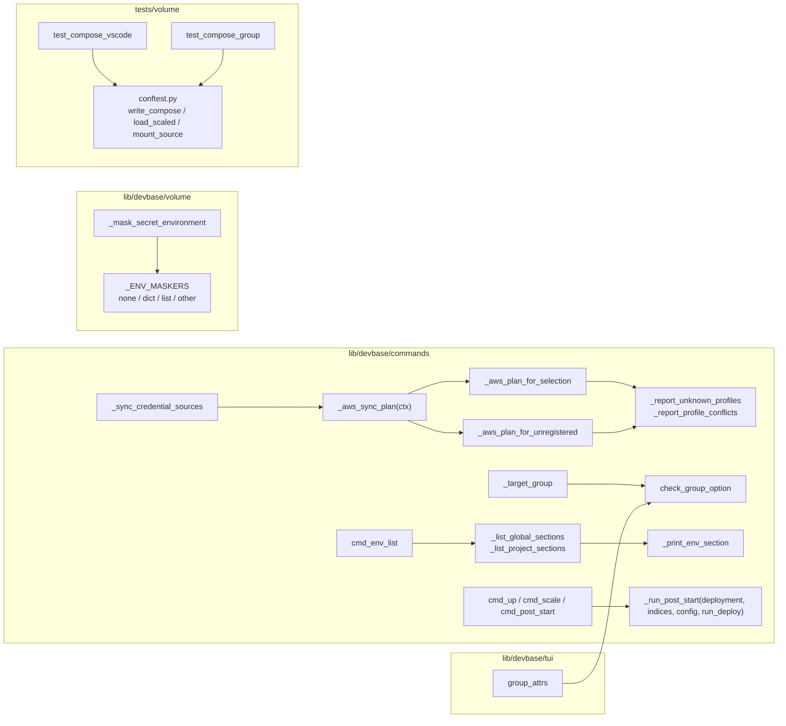
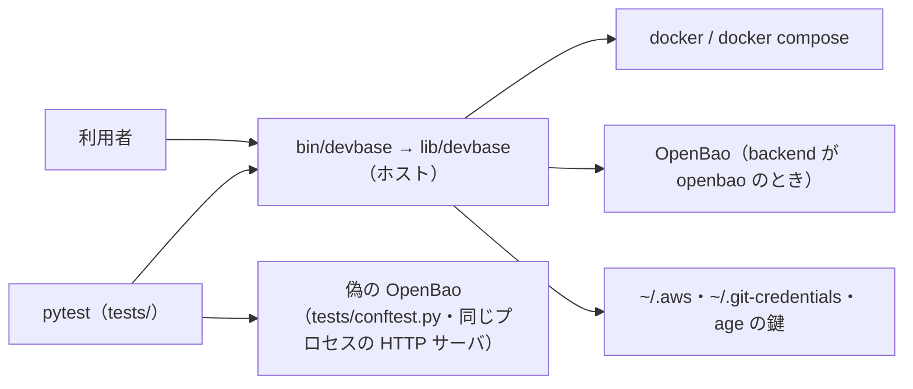
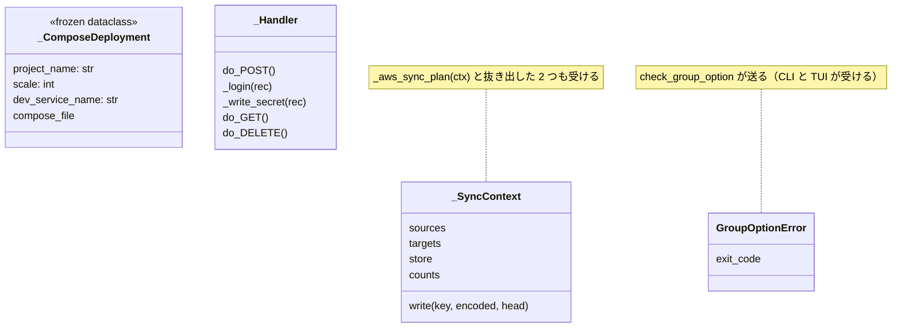
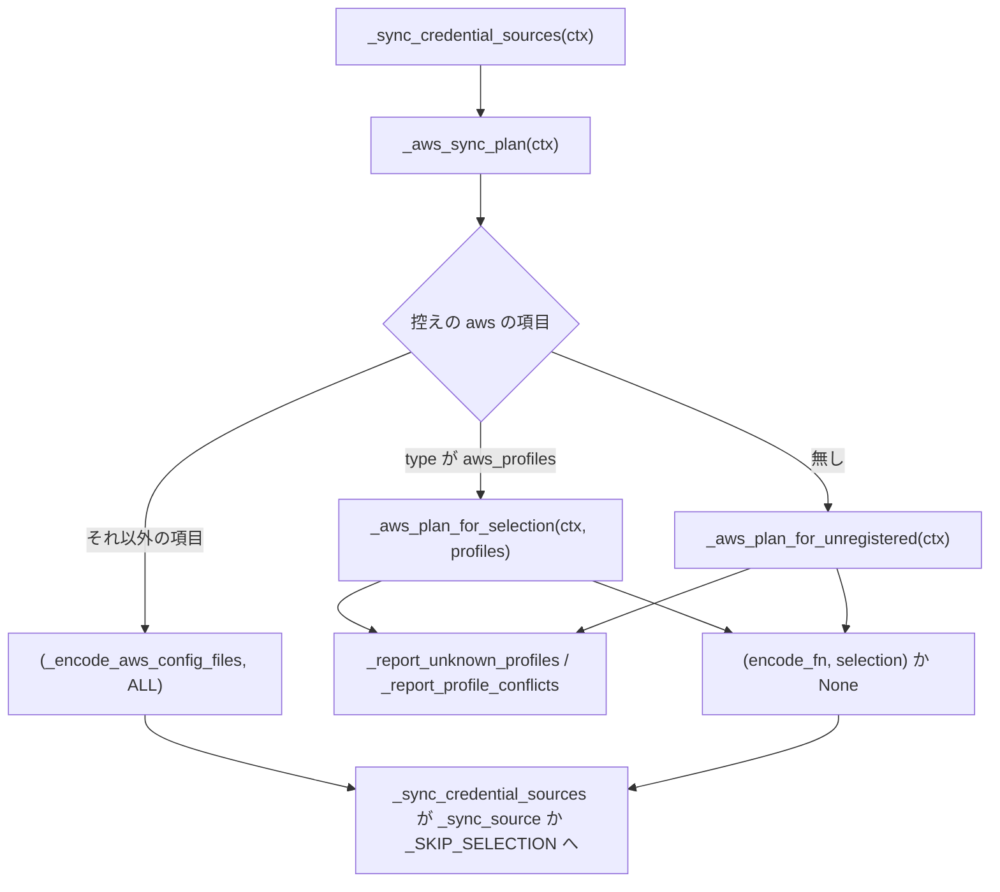
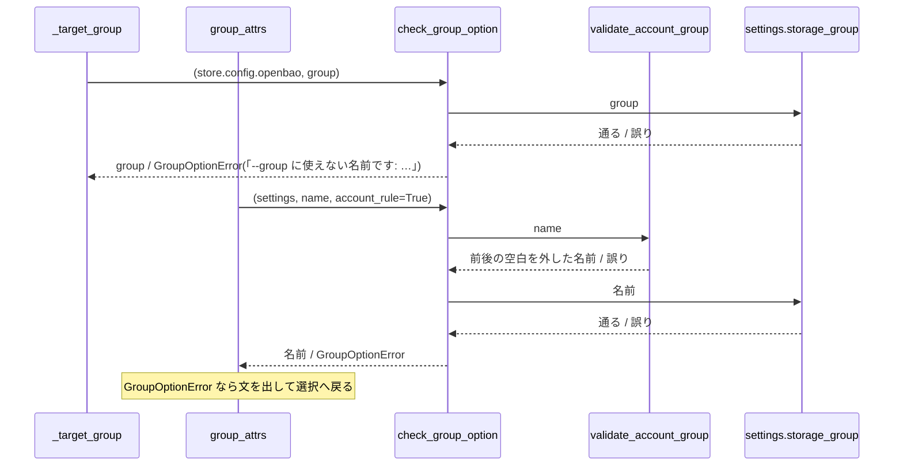
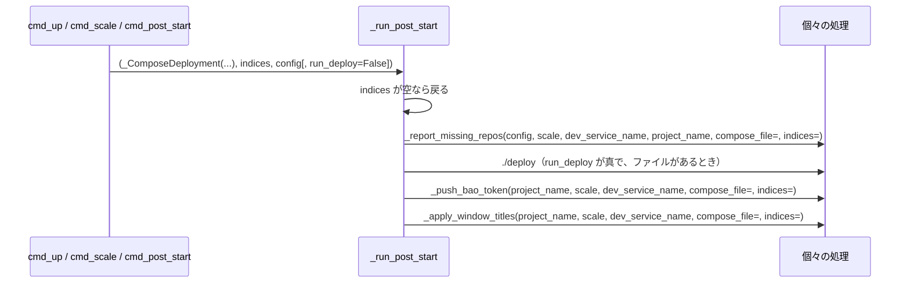

# devbase: `env sync` の AWS の経路・`env list`・`env keygen` など 7 つの関数が長く、起動の後の処理の段は引数が 7 個あり、sync の関数の受け方が 1 か所だけ違い、`--group` の検証とテストの補助が 2 か所に重なる → 13 件すべてを振る舞いを変えずに分け、どの関数も 50 行以下・認知的複雑度 15 以下に収まり、重なりは 1 か所にまとまる（#444）

## 目的

- **何が壊れているか**: PR #442 の構造改善で時間の枠に入らなかった 13 件（R1〜R13）が残る。長い関数・長い引数の並び・形ごとの分岐の連なり・同じ処理の重なりで、振る舞いは正しいが読み解くのに手間がかかる
- **誰が困るか**: 次に `env sync` の AWS の経路・`env list`・`env keygen`・`snapshot restore`・起動の後の処理・偽の OpenBao を触る devbase の開発者と AI エージェント
- **直すと何が成り立つか**: 13 件の兆候が要求の基準で消え、sync の関数がすべて `_SyncContext` を受ける。利用者から見える出力・終了コード・書き込みは変わらない

## 適用範囲

- **働く範囲**: このリポジトリの `lib/devbase/` と `tests/`。配布先は `install.sh` で `main` を取る利用者の端末だが、振る舞いは変わらない。プラグインのリポジトリ（`projects/*`）と base イメージは触らない
- **プロジェクトごとに違うもの**: 無し（新しい設定と引数を足さない）
- **当たるモード**: `standard`（本番の振る舞いを変えない構造の変更で、対象に既存のテストが十分にある）

## あるべき姿の根拠

| 根拠 | 種類 | 何を示すか |
| --- | --- | --- |
| 課題 #444 の本文の「兆候が消えたと見なす基準」と前提 1〜7 | 利用者の指示の原文 | 直した後の形を数値（50 行・認知的複雑度 15・C901 5・引数 4 個）と定義の場所で決める |
| PR #442 の改修計画の I-001 の手順（入れ子の report を外へ出す → `aws_profiles` の分岐と控えの無い分岐を抽出 → `(ctx)` で振り分ける） | 既存の形 | R1 の分け方は、3 つの CLI が出した提案をそのまま使う |
| `main` = `54c1c27` で測った値が要求の「現状の値」と一致した（`uvx complexipy`・`uvx ruff check --select C901`・`ast` の行数。2026-10-08） | 実測 | 設計の前提にした大きさは今のコードのものである |
| `tests/cli/test_open_command.py` などが `from tests.cli.conftest import ...` で `conftest.py` の補助を取り込んでいる | 既存の形 | テストの補助を `conftest.py` に置いて取り込む形は既にある（R11・R12） |
| `docs/specifications/secret-backend.md` の「使えないグループ名」の行（TUI は `validate_account_group` で検証し、続けて `storage_group` を通す） | 既存の形 | TUI と CLI の検証は前段の有無が違う。まとめても前段を消さない（R2） |

要求と受け入れ条件は #444 の本文にある（コピーは `issues/issue-444-requirements.md`）。この文書は「どう作るか」だけを扱う。

## ドメインモデル

### コンテキスト

| コンテキスト | 何の語が 1 つの意味に決まるか |
| --- | --- |
| 機密の置き場（`secret`） | `env sync`・`env list`・`env keygen`・`env project` の収集・`--group` の検証（R1・R2・R6〜R9） |
| Compose の構成（`compose`） | スケールで作るファイルの `environment` の機密の伏せ方（R3・R4）。テストの補助（R11・R12）もこの構成を読む |
| 起動の後の処理（`post-start`） | 起動の後の処理の段の受け取り方（R5） |
| スナップショット（`snapshot`） | 復元の段の並び（R10） |
| テストの実行環境（`test`） | 偽の OpenBao の書き込みの経路（R13） |

13 件はそれぞれ 1 つのコンテキストの中で閉じる。コンテキストの間の呼び出し（`up` が起動の後の処理の段を呼ぶ・TUI が
`commands/env.py` を呼ぶなど）は今の形のまま変えず、関係も新しく結ばない。R2 で CLI と TUI が共有する検証の関数は、
どちらも `secret` の中の部品である。

### 集約

構造の変更は集約の境界と持ち主を変えない。下の表は、変更が触る単位と、その単位を書き換えてよい構成要素である。

| 集約 | 持ち主（書き換えてよいもの） | 根 | エンティティ | 値オブジェクト |
| --- | --- | --- | --- | --- |
| 1 回の `sync` | `commands/env.py` の sync の関数 | `_SyncContext` | 書き込み先（`SyncTargets`）・控え（`SourcesManager`） | AWS の入れ直しの計画 `(encode_fn, selection)`・集計 `_SyncCounts` |
| `--group` の名前 | `commands/env.py` の `check_group_option`（新） | 渡された名前 | — | 検証を通った名前 |
| スケールで作るファイルの dev サービス | `volume/compose.py` | サービスの辞書 | — | `environment`（none / dict / list / その他の形） |
| 起動の後の処理の 1 回 | `commands/container.py` の `_run_post_start` | 後処理の対象 | — | 起動した構成 `_ComposeDeployment`（新） |
| 復元の 1 回 | `snapshot/manager.py` の `SnapshotManager` | 世代のディレクトリ | アーカイブ（full・incr） | 適用の上限 `point` |

### 不変条件

すべて「変更の前と同じ」を縛る。I1〜I9 は振る舞い、I10 は構造の条件である。

| # | 集約 | 条件 | 破れたときの扱い |
| --- | --- | --- | --- |
| I1 | 1 回の `sync` | AWS の入れ直しは、控えの項目（`aws_profiles` / それ以外 / 無し）ごとに変更の前と同じ計画（書く・書かない・選択）を作り、同じ行を出す | `test_env_host_import.py`・`test_env_sync_group.py`・`test_env_sync_owner.py` が落ちる |
| I2 | `--group` の名前 | 使えない名前のときの文は、CLI が「`--group に使えない名前です: グループ名…`」、TUI が `validate_account_group` で落ちれば接頭のない「`--group に使えない名前です: DEVBASE_ACCOUNT_GROUP…`」、`storage_group` で落ちれば CLI と同じ文で、変更の前と同じである | 文を丸ごと比べるテストが落ちる |
| I3 | スケールで作るファイル | 機密のキーの値は書かれず、非機密の値と元の記法（dict / list）は残る。解釈できない形は警告を出して機密の名前の列挙に置き換える | `tests/volume/test_compose_secret_env.py` が落ちる |
| I4 | 起動の後の処理の 1 回 | 対象が空なら何もせず、それ以外は不足リポジトリの報告 → `./deploy`（`run_deploy` が真のとき）→ token の配布 → 窓のタイトルの順に、同じ引数で呼ぶ | `test_container_post_start.py`・`test_container_scale_order.py` が落ちる |
| I5 | 1 回の `sync` 以外の `env` | `env list` の節の見出し・変数の行・件数の行と、出す節の選び方が変更の前と同じである | 出力を丸ごと比べるテストが落ちる |
| I6 | `env keygen` | 鍵がある・読めない・同意しない・生成に失敗する、の各経路で出力・終了コード・鍵ファイルが変更の前と同じで、読めない鍵の判定は同意を求める前にある | `tests/commands/test_env_keygen.py` が落ちる |
| I7 | `env project` の収集 | 設定済み・自動生成（既定の長さと `:<長さ>`）・入力・必須の空、の各経路で表示と書き込みと戻り値が変更の前と同じである | `tests/commands/test_env_project.py` が落ちる |
| I8 | 復元の 1 回 | `point` の検査・世代と full の存在の確認は、控えのバックアップより前にあり、full → `point` までの incr の順に展開する | `tests/snapshot/` の復元のテストが落ちる |
| I9 | 偽の OpenBao | ログインと KV の書き込みへの応答（状態・本文・状態の更新）が変更の前と同じである | 偽の OpenBao を使う `tests/` のテストが落ちる |
| I10 | すべて | 直した関数と抜き出した関数が、要求の「兆候が消えたと見なす基準」を満たし、対象のファイルの関数で C901 と認知的複雑度が上がったものが無い | 測定の値が基準を超える（Pull Request の本文の表で見える） |

### ドメインイベント

要求のドメインイベントの番号を引き継ぐ。

| # | イベント | 発生元 | 受け手 |
| --- | --- | --- | --- |
| E1 | 着手前の全体のテストが通った | 実装の担当（`tdd-cycle` の着手） | E2 を確定させる設計の結果（既存の失敗があれば人へ戻す） |
| E2 | 13 件のそれぞれを直すか直さないかに分けた | この設計（決定 1） | 実装の計画 |
| E3 | 直す件の構造を変えた | 実装の担当 | 全体のテストと lint（E4） |
| E4 | 変更の後の全体のテストと lint が通った | 検査 | 測定（E5） |
| E5 | 直した件の兆候が基準で消えたことを測った | 測定 | Pull Request の本文の測定の表（満たさない件は E3 へ戻すか「直さない」へ移す） |

### 用語

| 用語 | 意味 | 用語集への反映 |
| --- | --- | --- |
| 起動の後の処理の段 | 後処理の対象を受けて、インスタンスごとの処理を決まった順に行う 1 つの関数 | 無し（既存の語。受け取り方が変わるだけで意味は変えない） |
| 対象のグループ | 1 回の操作が読み書きするグループ | 無し（既存の語） |
| 同期済みハッシュの控え | `env sync` がソースファイルの位置とハッシュを記録する `.env.sources[.<g>].yml` | 無し（既存の語） |

兆候の名前（long_method など）と測定の語（認知的複雑度・C901）は構造改善の工程の語で、devbase の振る舞いの語では
ないため用語集へ足さない。

## 機能一覧

利用者から見える機能は変わらない。この変更が中身を組み直す機能を並べる。

| # | 機能 | 誰が使うか |
| --- | --- | --- |
| F1 | `env sync` が AWS の認証情報を控えの選択の範囲で入れ直す（R1） | 機密を同期する利用者 |
| F2 | `--group` と TUI のグループの選択が、使えない名前を拒んで理由を出す（R2） | グループ別の置き場の利用者 |
| F3 | `up` / `scale` がスケールで作るファイルで機密の値を伏せる（R3・R4） | プロジェクトの利用者 |
| F4 | `up` / `scale` / `project post-start` が起動の後の処理を行う（R5） | プロジェクトの利用者 |
| F5 | `env project` が `env.yml` の定義に従って値を集める（R6） | プロジェクトの利用者 |
| F6 | `env keygen` が age の鍵を作る（R7） | 機密を暗号化する利用者 |
| F7 | `env list` が参照ごとの変数を出す（R8・R9） | 機密を確かめる利用者 |
| F8 | `snapshot restore` が世代を書き戻す（R10） | ボリュームを戻す利用者 |
| F9 | `tests/volume/` の compose のテストと偽の OpenBao が、補助を 1 か所から使う（R11〜R13） | devbase の開発者 |

## 構成要素

| 要素 | 責務 | 件 |
| --- | --- | --- |
| `commands/env.py` の `_aws_sync_plan(ctx)` | 控えの AWS の項目を見て、3 つの計画の作り方のどれかへ振り分けるだけ | R1 |
| `commands/env.py` の `_aws_plan_for_selection(ctx, profiles)`（新） | 控えが `aws_profiles` のとき、選んだプロファイルとその連なりだけを切り出す計画を作る。書かないなら理由を出して `None` | R1 |
| `commands/env.py` の `_aws_plan_for_unregistered(ctx)`（新） | 控えに項目が無いとき、参照の値のプロファイルを選択とみなす計画を作る。書かないなら理由を出して `None` | R1 |
| `commands/env.py` の `_report_unknown_profiles(payload)`・`_report_profile_conflicts(payload)`（新。入れ子から外へ出す） | 選んだのに無いプロファイルの行と、空白だけ違う見出しの警告を出す | R1 |
| `commands/env.py` の `_sync_credential_sources` | 呼び出しを `_aws_sync_plan(ctx)` に変えるだけ | R1 |
| `commands/env.py` の `check_group_option(settings, group, *, account_rule=False)`（新） | `--group` の名前を `storage_group` に通し、通らなければ「`--group に使えない名前です: …`」の `GroupOptionError` を送る。`account_rule` が真なら先に `validate_account_group` を通し、その結果（前後の空白を外した名前）を返す。偽なら渡された名前をそのまま返す | R2 |
| `commands/env.py` の `_target_group` | 名前の検証を `check_group_option(store.config.openbao, group)` へ任せる | R2 |
| `tui/actions_env_keys.py` の `group_attrs` | 名前の検証を `check_group_option(settings, name, account_rule=True)` へ任せ、`GroupOptionError` の文を出して選択へ戻る | R2 |
| `volume/compose.py` の `_mask_secret_environment` | 形を求め、形をキーにした対応表 `_ENV_MASKERS` の関数を呼び、返った値があれば `environment` へ置くだけ | R3・R4 |
| `volume/compose.py` の `_mask_env_none`・`_mask_env_dict`・`_mask_env_list`・`_mask_env_other`（新） | 形ごとに伏せた `environment` を返す（none で機密が無ければ `None` = 作らない）。その他の形だけが警告を出す | R3・R4 |
| `commands/container.py` の `_ComposeDeployment`（新。凍結した dataclass） | 起動した構成の 4 つの値（`project_name`・`scale`・`dev_service_name`・`compose_file`）を 1 つに持つ | R5 |
| `commands/container.py` の `_run_post_start(deployment, indices, config, run_deploy=True)` | 引数を 4 個にし、個々の処理（`_report_missing_repos` など）へは今と同じ引数を渡す | R5 |
| `commands/container.py` の `cmd_up`・`cmd_post_start`・`cmd_scale` | `_ComposeDeployment` を組んで `_run_post_start` を呼ぶ形に変えるだけ | R5 |
| `commands/env.py` の `_collect_from_env_yml` と `_generated_secret(spec)`・`_prompt_env_var(env_file, var)`（新） | 変数ごとに、設定済み・自動生成・入力のどれかへ振り分ける。自動生成の長さの読み方と、入力と必須の判定を抜き出す | R6 |
| `commands/env.py` の `cmd_env_keygen` と `_show_existing_key(path)`・`_refuse_unreadable_key(path)`・`_confirm_key_regeneration(devbase_root, path)`（新） | 既存の鍵の表示・読めない鍵での中止・作り直しの同意を抜き出す。理由の注記は抜き出した関数へ移す | R7 |
| `commands/env.py` の `cmd_env_list` と `_print_env_section(title, count_label, env_vars, keys_only, reveal)`・`_list_global_sections(...)`・`_list_project_sections(...)`（新） | 節の見出し・変数・件数の行を 1 つの関数で出し、チーム共通とプロジェクトの節の選び方をそれぞれ抜き出す | R8・R9 |
| `snapshot/manager.py` の `SnapshotManager.restore` と `_restore_source(name, point)`・`_apply_incrementals(...)`（新） | 復元の前の検査（`point`・世代・full）と、`point` までの差分の展開を抜き出す | R10 |
| `tests/volume/conftest.py` の `write_compose`・`load_scaled`・`mount_source`（新） | `tests/volume/` の compose のテストが共有する補助の唯一の定義 | R11・R12 |
| `tests/volume/test_compose_vscode.py`・`test_compose_group.py` | 自分の補助の定義を消し、`from tests.volume.conftest import ...` で取り込む | R11・R12 |
| `tests/conftest.py` の `_Handler.do_POST` と `_login(rec)`・`_write_secret(rec)` ほか（新） | 経路（ログイン / KV の書き込み）ごとの関数へ振り分ける。書き込みの前の拒否と CAS の更新は `_write_secret` から更に抜き出す | R13 |
| `docs/specifications/post-start.md` | 「起動の後の処理の段」の節の関数の形を新しい引数に合わせる | R5 |

変えないもの: `_report_missing_repos`・`_push_bao_token`・`_apply_window_titles`・`_iter_env_names`・`_env_shape`・
`SnapshotManager._backup_before_restore`・`_extract_archive`・`tests/volume/test_compose.py` の補助・`do_GET`・`do_DELETE`・
snapshot の `--group` の検証（`commands/snapshot.py` と `tui/actions_snapshot.py`。`validate_account_group` だけを通す別の規則）。

### 構成要素図



R6・R7・R10・R13 は 1 つの関数から同じモジュールの関数を抜き出すだけで、要素どうしの関係を変えないため図に載せない。

### システム構成図

外部の系との関係と配置は変わらない。利用者の端末のホストで動く `devbase` の Python が、docker・OpenBao・`~/.aws` などを
今と同じ順で同じ回数だけ呼ぶ。



### パッケージ・モジュール構成

```text
lib/devbase/
├── commands/
│   ├── env.py          # R1・R2（check_group_option を足す）・R6・R7・R8・R9
│   └── container.py    # R5（_ComposeDeployment を足す）
├── tui/
│   └── actions_env_keys.py  # R2（group_attrs が check_group_option を呼ぶ）
├── volume/
│   └── compose.py      # R3・R4
└── snapshot/
    └── manager.py      # R10
tests/
├── conftest.py         # R13
└── volume/
    ├── conftest.py     # R11・R12（補助 3 つを足す）
    ├── test_compose_vscode.py
    └── test_compose_group.py
docs/specifications/post-start.md  # R5 の関数の形
```

## 構造

変更が触る型だけを載せる（変更後）。`_ComposeDeployment` は新しく足す値オブジェクトで、`_SyncContext` と `GroupOptionError` は
既存の型を受け渡す先が増えるだけである。今の `_aws_sync_plan` は `_SyncContext` を受けず、`sources`・`targets`・`store` を
別々に受けている。

### クラス図



## 処理の流れ

### R1: AWS の入れ直しの計画

振り分けの条件と、各経路が返すものは変更の前と同じである（I1）。



### R2: `--group` の名前の検証



`check_group_option` は `DevbaseError` を捕まえて `GroupOptionError`（終了コード 2）に包む。`storage_group` が送るのは
`BackendConfigError`（`DevbaseError` の子）だけで、CLI が今 `BackendConfigError` だけを捕まえている振る舞いと同じになる。

### R5: 起動の後の処理

順と個々の処理への引数は変えない（I4）。3 つの呼び出し元が `_ComposeDeployment` を組み、段がそれをほどいて今と同じ
引数で個々の処理を呼ぶ。



### R3・R4・R6〜R10・R13

いずれも 1 つの関数の中の段を、同じ順のまま抜き出した関数へ移す。呼ぶ順・回数・出力の順は変えない。

| 件 | 段の順（変更の前と同じ） |
| --- | --- |
| R3・R4 | 機密の名前の重複を除く → 形を求める → 形の関数で伏せる → 値があれば `environment` へ置く |
| R6 | 変数ごとに: 設定済みなら表示して次へ → 自動生成なら値を作って書き表示 → それ以外は入力を求め、空で必須なら誤りを出して偽を返す |
| R7 | 鍵があり `--force` でなければ表示して 0 → 読めない鍵なら中止して 1 → 鍵があり `--yes` でなければ同意を求める → 生成 → 控えの案内 |
| R8・R9 | `--group` の検証 → チーム共通の節（`-p` でなければ、持ち主ごと）→ プロジェクトの節（含めるときだけ、持ち主ごと） |
| R10 | `point` の検査 → 世代と full の確認 → 組を読む → 控えのバックアップ → full → `point` までの incr → 失った rename の警告 → 完了の行 |
| R13 | 記録 → 経路がログインなら `_login` → それ以外は `_write_secret`（mount と認可と禁止の拒否 → 失敗の注入 → `data` の検査 → CAS の更新 → 応答の注入 → 応答） |

## 非機能の実現方式

| 大項目 | 実現方式 |
| --- | --- |
| 運用・保守性 | 直した関数と抜き出した関数を、要求の「検証手段」のコマンド（`uvx complexipy`・`uvx ruff check --select C901 --config 'lint.mccabe.max-complexity=0'`・`ast` の行数と引数の数）で変更の前後に測り、Pull Request の本文に並べる。対象のファイル（`commands/env.py`・`tui/actions_env_keys.py`・`volume/compose.py`・`commands/container.py`・`snapshot/manager.py`・`tests/conftest.py`）の全関数で、C901 と認知的複雑度が変更の前より上がったものが無いことを同じ測定で確かめる |
| セキュリティ | R3・R4 は形ごとの関数が返す値だけを変え、機密のキーを値なしの参照に置き換える式は今の式をそのまま移す。`tests/volume/test_compose_secret_env.py` を手を入れずに通す。R7 は鍵の値を扱う `agekeys.generate_key_file` と、公開鍵だけを出す `_print_key_backup_notice` を変えず、抜き出す関数は鍵の値を受けない |

## 決定の記録

### 決定 1: 13 件を片付けるため、R1〜R13 をすべて「直す」に分け、「直さない」の件を作らない

どの件も、関数の中の段を同じモジュールの関数へ移すか、引数を値オブジェクトへまとめるか、定義を 1 か所へ移すかで
基準を満たせ、出力・終了コード・書き込みを変える必要がない。振る舞いを縛るテストも各件にある（テスト設計）。
直さない理由になりうる「基準を満たすには振る舞いを変える必要がある」件は見つからなかった。

実装で基準を満たせない件は、要求の E3 のとおり変更を戻して「直さない」へ移し、理由を Pull Request の本文に書く。
設計の時点で一部を「直さない」に決めておく形は、根拠となる見積りが無く採らない。

根拠: Mission（MVV 版 1）

### 決定 2: 要求の基準をそのまま使い、数値と定義の場所を設計で変えない

要求の前提 2 は、設計で基準を変えるときに理由を残すよう求める。13 件はいずれも今の基準で達成でき（決定 1）、変える
理由が無い。R10（`restore`）は認知的複雑度 15 で既に基準の内にあり、行数（60 行）だけで兆候が残っているため、行数を
50 行以下にすることで消す。

根拠: 根拠なし（MVV 版 1）

### 決定 3: `_aws_sync_plan` を `_SyncContext` に揃えるため、改修計画の I-001 の 4 段の分け方をそのまま採る

3 つの CLI が出した提案で、控えの項目の 3 つの経路が関数の境界とそのまま重なる。2 つの経路が共有する入れ子の
report の関数はモジュールの関数へ出し、経路の関数から呼ぶ。表示の名前 `AWS認証` は 4 つの関数で使うため、
モジュールの定数 `_AWS_LABEL` にする（`_sync_credential_sources` の同じ文字列は呼び出しの変更の外なので触らない）。

経路をキーにした対応表へ振り分ける形は、振り分けの条件が「項目の `type` の値」と「項目の有無」の 2 種で、1 つの
キーに揃わないため採らない。

根拠: Value 2 / Value 3（MVV 版 1）

### 決定 4: `--group` の検証を 1 か所にするため、`check_group_option` に `account_rule` の引数を持たせて TUI の前段も中へ入れる

TUI は `validate_account_group` を先に通し、落ちれば接頭の無い文を出す。CLI は `storage_group` だけを通し、名前の規則で
落ちた文は「グループ名: 」を接頭に持つ（`storage_group` の中で同じ規則を通すため）。2 つの文を変えずに 1 つの関数にするには、前段の有無を呼び出し側が選ぶ必要がある。
前段を中へ入れると、「`--group に使えない名前です: `」の文を作る場所が 1 つになる。関数は TUI からも呼ぶため
`_` を付けずに `commands/env.py` に置き、`GroupOptionError` と並べる（TUI は既に同じモジュールから
`GroupOptionError` を取り込んでいる）。

採らなかった形: 前段を TUI に残して `storage_group` だけをまとめる形は、TUI に同じ文が 2 か所（前段の誤りと
`GroupOptionError`）残るため採らない。前段を CLI にも足す形は、CLI の文から「グループ名: 」が消えて振る舞いが変わる
ため採らない。snapshot の `--group` の検証は `validate_account_group` だけを通す別の規則で、表に無いため含めない。

根拠: Value 3（MVV 版 1）

### 決定 5: `environment` の形ごとの分岐を消すため、形をキーにした対応表と形ごとの関数を使う

`_env_shape` が既に形を 4 つの文字列に決めており、キーがそのまま揃う。形ごとの関数は伏せた値を返し、`None` は
「`environment` を作らない」（元から無く機密も無いとき）を表す。置く処理を `_mask_secret_environment` に 1 つ残すと、
形ごとの関数はサービスの辞書を書き換えず、値を返すだけになる。

`if` の連なりのまま関数を分ける形は、C901 が 5 以下に下がるが、形を 1 つ足すたびに分岐も足す必要があり、要求が
並べる 2 つの形のうち対応表のほうが形と処理の対を 1 か所で読める。

根拠: Value 3 / C1（MVV 版 1）

### 決定 6: `_run_post_start` の引数を 4 個にするため、起動した構成の 4 つの値を凍結した `_ComposeDeployment` にまとめる

`project_name`・`scale`・`dev_service_name`・`compose_file` は、3 つの呼び出し元で常に組で渡り、個々の処理の 3 つが
同じ組を受ける。後処理の対象（`indices`）・`config`・`run_deploy` は呼び出しごとに意味が違うため、組に入れない。
個々の処理（`_report_missing_repos` など）の引数は表に無く、テストが置き換えて呼び出しを見ているため変えない。
確定仕様 `docs/specifications/post-start.md` は関数の形を書いているため、同じ Pull Request で新しい形へ直す。

`config` まで組に入れる形は、`config` が構成ではなくプロジェクトの設定で、`cmd_post_start` で構成を作らずに読む値で
あるため採らない。キーワード専用の引数へ変えるだけの形は、引数の数が減らず基準を満たさない。

根拠: Vision（MVV 版 1）

### 決定 7: `env list` の重なりを消すため、節の 1 つ分を出す関数を作り、チーム共通とプロジェクトの節の選び方を別の関数に分ける

2 か所の違いは、見出しの文字列と件数の行の頭の文字列だけで、見出し → 変数 → 件数の行の順は同じである。2 つの
文字列を受ける 1 つの関数にすると、出力の形が 1 か所になる。節の選び方（持ち主の巡回・ファイルの有無）は
チーム共通とプロジェクトで違うため、別の関数に残す。

根拠: Value 3（MVV 版 1）

### 決定 8: R6・R7・R10 は段を抜き出すだけにし、`env keygen` の理由の注記は抜き出した関数へ一緒に移す

3 件は 1 つの関数に段が並ぶ形で、段の境界で抜き出せば順を変えずに基準を満たせる。`cmd_env_keygen` の 93 行の
多くは、上書きの同意・読めない鍵の中止・TOCTOU を避ける `force` の渡し方の理由の注記である。注記はそれが説明する
コードの隣に置き、消さない（次に触る人が同じ検討を繰り返さないため）。生成の段（`generate_key_file` に `force` を
そのまま渡す注記）は `cmd_env_keygen` に残す。

根拠: Value 2 / Value 3（MVV 版 1）

### 決定 9: `tests/volume/` の補助を 1 か所にするため、`tests/volume/conftest.py` に `_` を外した名前で置いて取り込む

`tests/cli/conftest.py` の補助を `from tests.cli.conftest import ...` で取り込む形が既にある。取り込む名前に `_` を
付けると、モジュールの外から使う内部の名前になるため、`write_compose`・`load_scaled`・`mount_source` にする。
2 つのテストの呼び出しは新しい名前へ書き換える（受け入れ条件は R11・R12 の移動を期待値の変更の外に置いている。
`assert` の期待値は変えない）。`tests/volume/test_compose.py` の `_write_compose` は引数の形が違い、表に無いため触らない
（前提 6）。

新しいモジュール（`tests/volume/compose_helpers.py` など）を作る形は、置き場の前例が無く、要求が挙げた置き場
（`conftest.py`）とも違うため採らない。

根拠: Vision（MVV 版 1）

### 決定 10: 偽の OpenBao の `do_POST` は、経路ごとの関数に分ける（経路をキーにした対応表にしない）

要求の未決の 2 つ目への答えである。`do_POST` の経路は「ログイン」と「それ以外のすべて（KV の書き込み）」の 2 つで、
後者はパスの一致ではなく残りの全部である。対応表にすると、表に当たらないときの既定を別に持つ必要があり、2 つの経路に
対して仕組みが重い。KV の書き込みは 1 つの関数にしても認知的複雑度が 15 を超える見込みのため、書き込みの前の拒否
（mount・認可・禁止・失敗の注入）と CAS の更新を更に抜き出す。`do_GET`・`do_DELETE` は表に無いため触らない。

根拠: Vision（MVV 版 1）

### 決定 11: 振る舞いを丸ごと縛るテストが無い経路だけ、構造の変更の前に現状固定のテストを足す

要求のテスト戦略のとおり、既存のテストで縛られている経路にはテストを足さない。今のテストは、`--group` の文を
TUI の部分一致（`'--group に使えない名前です' in ...`）でしか見ておらず、CLI の文は見ていない。`env list` は見出しと
グループの付いた件数の行を部分一致で見るが、「(変数なし)」と `--keys-only` の行は見ていない。決定 4 と決定 7 は
ちょうどこの文と行を組み直すため、変更の前のコードで通る現状固定のテストを先に足す。

根拠: Value 3（MVV 版 1）

## テスト設計

### 受け入れ条件

| 受け入れ条件 | どの振る舞いで縛るか | どう壊したら落ちるべきか |
| --- | --- | --- |
| 13 件が「直す」か「直さない」に分かれ、「直さない」に理由がある | 決定 1（すべて「直す」）。実装で移した件は Pull Request の本文 | — （文書の確認） |
| 「直す」件が基準を満たし、測ったコマンドと結果が本文にある | 非機能の実現方式の測定 | 抜き出した先へ長さを移しただけの関数が 50 行か 15 を超える |
| 抜き出した関数も long_method の基準を満たす | 同上（抜き出した関数も測定の表に載せる） | 同上 |
| `env sync`（AWS）・`env list`・`env keygen`・TUI のグループの選択・`snapshot restore`・post-start の出力・終了コード・書き込みが同じ | I1・I4〜I8 の行 | 各行の壊し方 |
| R11・R12 の移動を除き、期待値を変えていない | `git diff` で `tests/` の `assert` の行を見る（足したテストと R11・R12 の名前の置き換えを除く） | 期待値を書き換えて通す |
| `--group` に使えない名前の文が同じ | I2 の行 | I2 の壊し方 |
| スケールで作るファイルで機密の値が書かれない | I3 の行 | I3 の壊し方 |
| 全体のテストが通る | `env -u DEVBASE_ROOT uv run --locked pytest tests/ -q` | どれかが落ちる |
| lint と固有の語の検査が通る | `uvx ruff check --select=E9,F63,F7,F82 lib`・`python3 .github/scripts/proper_term_check.py`（「語の一覧が無いため飛ばした」と出ないこと） | 未定義の名前を残す |
| 表に無い関数を変えていない | `git diff` の hunk の関数名を、構成要素の表の「変えないもの」と突き合わせる | `_backup_before_restore` などを触る |

### 不変条件

| 不変条件 | どの振る舞いで縛るか | どう壊したら落ちるべきか |
| --- | --- | --- |
| I1 | 既存の `test_env_host_import.py`・`test_env_sync_group.py`・`test_env_sync_owner.py`（控えが `aws_profiles`・`tar_base64`・無しの各経路） | `_aws_plan_for_unregistered` で集合が一致しても丸ごとにしない / 選択外の値で書いてしまう / 衝突の警告を出さない |
| I2 | 足す現状固定のテスト: CLI の `--group global`（予約語）と `--group 1234`（数字だけ）の誤りの文を丸ごと比べる。TUI で「名前を入力」に `1234` と `projects` を入れたときの誤りの行を丸ごと比べる | TUI の前段を落とす（`1234` の文に「グループ名: 」が付く）/ CLI に前段を足す（文から「グループ名: 」が消える） |
| I3 | 既存の `tests/volume/test_compose_secret_env.py` | dict の形で機密の値を残す / list の形で `KEY=value` を残す / 元から無い `environment` を機密が無いのに作る |
| I4 | 既存の `test_container_post_start.py`・`test_container_scale_order.py`・`tests/cli/test_post_start_command.py` | 個々の処理の順を入れ替える / `project post-start` で `./deploy` を走らせる / 対象が空でも token を発行する |
| I5 | 足す現状固定のテスト: チーム共通・個人の共通・プロジェクトの節があるときの `env list` の標準出力を丸ごと比べる（変数の無い節と `--keys-only` の有無を含む）。既存の `test_env_user_axis.py` の節の選び方と `test_env_group_label.py` の件数の行 | 件数の行の頭をプロジェクトの節で `label` だけにする（グループの接尾を落とす）/ 変数の無い節で「(変数なし)」を出さない |
| I6 | 既存の `tests/commands/test_env_keygen.py` | 読めない鍵の判定を同意の後へ移す / `--force` を `True` に固定して渡す / 既存の鍵の表示で 1 を返す |
| I7 | 既存の `tests/commands/test_env_project.py` | `generate: token` の既定の長さを変える / 必須の空で真を返す |
| I8 | 既存の `tests/snapshot/` の復元のテスト（`point`・偽の rename・控えのバックアップ） | `point` の検査を控えのバックアップの後へ移す / `point` を超える incr を展開する |
| I9 | 偽の OpenBao を使う既存のテスト（`tests/env/`・`tests/commands/` の openbao の系） | CAS が合わないのに書く / `drop_write_response` で応答を返す |
| I10 | 非機能の実現方式の測定 | 抜き出した関数が基準を超える / 対象のファイルのほかの関数の値が上がる |

## 設計の結果

| 課題 | 扱い | 取り込み先 | 触るファイル |
| --- | --- | --- | --- |
| #444 | 実装する | — | `lib/devbase/commands/env.py`、`lib/devbase/commands/container.py`、`lib/devbase/tui/actions_env_keys.py`、`lib/devbase/volume/compose.py`、`lib/devbase/snapshot/manager.py`、`tests/conftest.py`、`tests/volume/`、`tests/commands/`、`tests/cli/tui/`、`docs/specifications/post-start.md` |

## 未確認のまま残ること

| 項目 | 内容 |
| --- | --- |
| 抜き出した関数の測定の値 | 設計の時点では見込みで、R13 の `_write_secret` と R1 の 2 つの経路の関数が 15 以下に収まるかは実装で測って決める。超えたら更に段を抜き出す（決定 10 の方針）。それでも満たせなければ決定 1 の「直さない」へ移す |
| `cmd_env_keygen` の注記を移した後の行数 | 注記を消さない（決定 8）ため、抜き出した関数が注記込みで 50 行以下に収まるかは実装で数える |
| 足す現状固定のテストの置き場 | I2 と I5 のテストを既存のどのファイルへ足すかは実装（`tdd-cycle`）で決める。変更の前のコードで通ることを先に確かめる |
