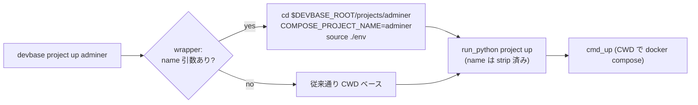

# PLAN06: `devbase project` サブコマンド導入 — プロジェクト名指定起動 + 一覧選択

## 関連リンク

- 元 issue: `issues/old/i06.md`
- 依存: PLAN04 (repos/ 永続クローン + 同名衝突 suffix) — #26 / #29 / #31 で **merge 済み**

## 進捗状況

- release PR: **#33** (`release/PLAN06` → `main`, OPEN)

| Task / PR | branch | 状態 |
|---|---|---|
| Task 1 / PR1 | `feature/PLAN06-project-group` | ✅ **merge 済み (#34, 2026-05-30 → release/PLAN06)** |
| Task 2 / PR2 | `feature/PLAN06-name-resolution` | ✅ **merge 済み (#35, 2026-05-30 → release/PLAN06)** |
| Task 3 / PR3 | `feature/PLAN06-list` | ✅ **merge 済み (#36, 2026-06-02 → release/PLAN06)** |
| Task 4 / PR4 | `feature/PLAN06-docs-completion` | 🔵 PR **#37** OPEN（レビュー / merge 待ち） |

> PR1 は codex/gemini クロスレビュー 4 round で収束。`project` parser + ハンドラ共有 +
> `container` 非推奨委譲に加え、レビュー指摘対応として以下も実施した（**Task 2 本体の
> name 解決 / wrapper cd は未着手**、PR2 へ持ち越し）:
> - `project login/build` の positional を `index` / `image` に整理し引数曖昧さを解消
> - top-level `build` ショートカットを wrapper の shell 実経路に整合
> - top-level ショートカット (up/down/ps/scale) が `[name]` positional を**受理・下流伝播**する
>   経路を先行整備（PR1 段階では name 未解決のため「未対応」warning を出す挙動）
> - `_dispatch_lifecycle` で name 指定時に全サブコマンドで warning を出すよう統一
> - `_add_login_subparser` / `_add_build_subparser` による parser 重複排除
>
> PR2 は codex/gemini クロスレビュー 2 round で収束（#35, squash merge `a532ff8`）。
> wrapper cd による name 解決 + トップレベルシノニムを実装し、レビュー指摘対応として
> 以下も実施した（最終 pytest 366 passed）:
> - name 解決対象を `name` positional を持つサブコマンド（up/down/ps/logs/scale）に限定し、
>   `project login/build` の既存 positional（index / image）との衝突を回避
> - Python フォールバック `_resolve_project_name` に `env` 読み込みを追加し、wrapper を
>   経ない直接起動時の環境変数欠落（`CONTAINER_SCALE` 等）divergence を解消
> - `container.py` の未知 project 候補一覧に表示上限（先頭 20 件 + 省略表記）を導入
> - `_PROJECT_NAME_SUBCOMMANDS` / `_NAME_RESOLVABLE_SHORTCUTS` と `cli.py` parser 定義の
>   同期注記コメントを追記
>
> PR3 (#36) は codex/gemini クロスレビュー 3 round で両者 APPROVE 収束（最終 head
> `5b666e0`、最終 pytest 405 passed）。`project list` 一覧 + `--interactive` 選択起動を
> 実装し、レビュー指摘対応として以下も実施した:
> - `devbase l` が prefix 解決で `login`/`list` の両方にマッチして `unknown command 'l'`
>   となる回帰を解消（wrapper `resolve_command` と Python `TOP_PREFIX_PREFERENCES` の双方に
>   `l`→`login` の prefix preference を追加。`li` は `list` のまま）。両定義の乖離を検出する
>   同期テストも追加
> - `project list` の各プロジェクト STATUS 取得（`docker compose ps`）を逐次実行から
>   `ThreadPoolExecutor` による並列実行へ（`_container_status_for` は `cwd=` 完結で
>   グローバル chdir せずスレッドセーフ）
> - `_resolve_plugin_name` が絶対パス symlink 先で `parts[0]=='/'` を plugin 名として
>   誤返却する問題に対し `/`・`..`・`.` を `None` 扱いにガード
> - `--interactive` 選択で数値以外 / 範囲外入力時に即終了せず再入力ループ化。Ctrl+C
>   (`KeyboardInterrupt`) は traceback を出さず rc=0 で中止
> - `_load_project_env`（`container.py`）と shell `source` の env パース仕様乖離（変数展開 /
>   コマンド置換 / 行中クォート / インラインコメント）を docstring に明文化し、乖離挙動を
>   pin する回帰テストを追加（→ 後述「後日対応予定」参照）

## 概要

`devbase project up <name>` のように、CWD に依存せずプロジェクト名でコンテナ操作できる
`project` サブコマンド群を導入する。あわせて:

1. `devbase project up/down/ps/login/logs/scale/build [name]` を新設
2. `devbase project list [--interactive]` で一覧表示 + 選択式起動
3. 既存 `devbase container *` を非推奨化し `project` へ委譲（移行期間後に削除）
4. トップレベルショートカット (`devbase up [name]` 等) を `project *` のシノニムに整理

## 問題・背景

現状すべてのコンテナ操作は **CWD 依存**で実装されている:

- `bin/devbase` (wrapper) が起動時に `COMPOSE_PROJECT_NAME=$(basename "$PWD")` を設定し、
  `./env` を source する
- `build` は wrapper 内の shell 関数 `cmd_build` が **CWD で** `docker compose build` を実行
- Python 側 `cmd_up` 等も `docker compose` / `Path('./env')` / `Path('compose.yml')` /
  `.docker-compose.scale.yml` をすべて **CWD 基準**で扱う

そのため起動には毎回 `cd projects/<name>` が必要で、`container` という命名も Docker の
実装詳細を露出している。

### アーキテクチャ方針（重要な設計判断）

プロジェクト名解決は **wrapper (`bin/devbase`) レベルで cd する**方式を採用する。

| 方式 | 内容 | 採否 |
|---|---|---|
| **A: wrapper で cd** | `<name>` → `$DEVBASE_ROOT/projects/<name>` を解決し wrapper が `cd` してから従来通り起動 | **採用** |
| B: Python で `os.chdir` | Python だけで解決 | 不採用 |

**A を採用する理由:**

- `build` は wrapper の shell 実装で CWD 依存 → Python 側 chdir では build をカバーできない
- `COMPOSE_PROJECT_NAME` / `./env` source も wrapper が **Python 起動前**に実施するため、
  単一地点 (wrapper) で cd すれば下流（Python / shell build 両方）が変更不要で動く
- Python 側を CWD ベースのまま維持でき、既存ロジックへの破壊的変更を最小化できる

Python 側にも**防御的に** `name → chdir` フォールバックを実装する（`python -m devbase.cli`
直接起動や `_ensure_env_files` 経由の安全網。COMPOSE_PROJECT_NAME 上書きも行う）。

#### 親シェルの CWD は汚染されない（重要な安全性保証）

wrapper が `cd` しても、**`devbase` を叩いた親インタラクティブシェルの CWD は変わらない**。
`cd` (`chdir(2)`) はプロセスごとに独立で、子プロセスの cd は親へ伝播しないため。

- `init.py` は devbase を **PATH 上の実行ファイル**として登録する（alias / shell 関数では
  ない）。よって `devbase` は常に子プロセスとして起動される
- **異常終了時も同様**: 子プロセスの CWD は fork 時に複製された別物であり、クラッシュ /
  `set -e` exit / シグナル死のいずれでも「子の cd を親に反映する経路」自体が存在しない
- `run_python` の `exec` はプロセスを置換するが依然「親シェルの子」であり CWD は隔離される
- **唯一の前提**: この保証は devbase を *コマンドとして* 実行する限り成立する。手動で
  `source bin/devbase` すると cd が親へ漏れるため、ドキュメントで sourcing を案内しない
  （PATH 方式の維持が条件）



## 修正対象

- `lib/devbase/cli.py` — `project` parser / shortcuts / prefix 解決 / dispatch
- `lib/devbase/commands/container.py` — ハンドラ共有・deprecation・name フォールバック
- `lib/devbase/commands/project.py` — **新規**（`project list` 等の listing ロジック）
- `bin/devbase` — name 解決 + cd、command 一覧更新
- `etc/devbase-completion.bash`, `etc/_devbase` — 補完更新
- `docs/user/cli-reference.md`, `docs/user/container-operations.md` — リネーム反映
- `CHANGELOG.md`
- `tests/cli/` — dispatch / 名前解決 / listing のテスト

## タスク分解

### Task 1: `project` サブコマンド group + ハンドラ共有 (PR1) — ✅ merge 済み (#34)

- **対象:** `lib/devbase/cli.py`, `lib/devbase/commands/container.py`, `tests/cli/`
- **変更内容:**
  - `_add_project_parser` を追加（`container` と同じ subcommand 群: up/down/ps/login/logs/scale/build）。各コマンドに省略可能 `[name]` positional を追加
  - dispatch で `project` を `cmd_container` 相当の共有ハンドラへ振り分け（実装の重複を避けハンドラを共有）
  - `container` は**非推奨 warning** を出して `project` ハンドラへ委譲するエイリアスに
  - `SUBCMD_MAP` / `_expand_argv` の commands 一覧に `project` を追加（prefix 解決対応）
  - **コマンドリストは 3 箇所で重複管理されている点に注意**: (1) Python `cli.py` の `SUBCMD_MAP`、
    (2) Python `cli.py:_expand_argv` の `commands` ハードコード配列、(3) wrapper `bin/devbase` の
    `resolve_command` が持つ独自リスト + dispatch の `case` 文。`project` 追加時は **3 箇所すべて**を
    同期する（特に wrapper の `resolve_command` / `case` は別 PR（Task 2）で触るが、prefix 解決を
    効かせるなら Task 1 時点で wrapper 側 `case` への `project` 追加が必要かを切り分けること）
  - この段階では runtime 挙動は従来と同等（リネーム + 委譲のみ、cd なし）

### Task 2: プロジェクト名解決 + wrapper cd (PR2) — ✅ merge 済み (#35)

- **対象:** `bin/devbase`, `lib/devbase/cli.py`, `lib/devbase/commands/container.py`, `tests/cli/`
- **変更内容:**
  - wrapper: `project <sub> <name>` / 後述シノニム `<sub> <name>` の `<name>` を検出し
    `$DEVBASE_ROOT/projects/<name>` の存在を確認 → `cd` → `COMPOSE_PROJECT_NAME=<name>` /
    `source ./env` → argv から name を strip して Python へ
  - **初期化順序に注意**: 現状 `bin/devbase` は dispatch より前・元の CWD で
    `COMPOSE_PROJECT_NAME=$(basename "$PWD")`（`:17`）と `source ./env`（`:24`）を実行している。
    name 解決で cd する場合、この 2 行は **cd 後に再実行（上書き）** する必要があるため、
    name 検出 → cd → 再設定の順に組み替える。なお source 対象は devbase の `env` ファイルであり、
    プロジェクトの `.env`（dotfile）は CRLF / 特殊文字対策で**意図的に source しない**（`:18-22` の
    コメント参照）ため、cd 後の再 source でもこの方針を踏襲する
  - 不正な name（`projects/` に存在しない）はエラー終了し候補を提示
  - Python: `[name]` 受領時に未 cd なら `os.chdir` + `COMPOSE_PROJECT_NAME` 上書きする
    防御的フォールバック。**この chdir は各ハンドラに散らさず `cmd_container` ディスパッチャ
    （`container.py:84`）で handler 呼び出し前に一括実施する**。`cmd_down()` 等は `project_name`
    引数を取らない（`container.py:91`）ため、per-handler 実装だと down/login/logs で名前解決が
    効かなくなる
  - これにより `project up/down/login/logs/scale/build [name]` と
    **トップレベルシノニム** `devbase up/down/login/build/scale [name]` が同時に成立する
    （ショートカットも wrapper を経由するため）
  - **`logs` はトップレベルシノニムを作らない**（現状 `SHORTCUTS`（`cli.py:20-27`）に `logs` が
    無いことと整合）。`logs` は `project logs [name]` 経由のみとする
  - **`build` の name 解決は wrapper cd に 100% 依存する**（`build` は Python ではなく wrapper の
    shell 関数 `cmd_build`（`bin/devbase:33-142,197`）で CWD 実行されるため、Python 側 chdir
    フォールバックでは救えない）。これは方針 A 採用の核心であり、wrapper 経路のテストが必須

### Task 3: `project list` / `ps` 一覧表示 + `--interactive` (PR3)

- **対象:** `lib/devbase/commands/project.py` (新規), `lib/devbase/cli.py`, `tests/cli/`
- **変更内容:**
  - `project list`: `NAME / PLUGIN / STATUS` 列で一覧表示
    - 一覧元は `$DEVBASE_ROOT/projects/` の symlink 群（`status.py` の
      `_get_container_status` ロジックを再利用）
    - PLUGIN 列は symlink 先 (`repos/<repo>/<plugin>/projects/<name>`) から plugin 名を解決
      （`_get_container_status` は plugin 情報を返さないため、symlink 先解決ロジックの追加が必要）
    - PLAN04 の同名衝突 suffix（例 `carmo.takemi`）もそのまま表示。**suffix がリンク名のみに
      付くのか、リンク先 dir 名 (`projects/<name>`) にも付くのか**を PLAN04 の付与仕様で確認し、
      PLUGIN 列の解決ロジックがどちらでも壊れないことを担保する
  - `project ps` は従来の `docker compose ps`（CWD/対象プロジェクト）と一覧の役割を整理
  - `--interactive`: 一覧から選択 → 選択プロジェクトで `project up` を起動
    （`simple_term_menu` 等。非 TTY / 依存無し環境では番号入力 fallback）
  - トップレベルシノニム `devbase list` / `devbase ps` を整備

### Task 4: 後方互換 deprecation + ドキュメント + 補完 (PR4)

- **対象:** `etc/devbase-completion.bash`, `etc/_devbase`, `docs/user/*.md`, `CHANGELOG.md`
- **変更内容:**
  - bash / zsh 補完に `project` グループ + project 名補完（`projects/` 配下を列挙）を追加
  - `container` の非推奨告知を docs / 補完に反映（移行期間と削除予定を明記）
  - `cli-reference.md` / `container-operations.md` を `project` 体系にリネーム反映
  - CHANGELOG 追記

## PR 分割計画

複数 PR に分割する根拠: (1) parser リネーム / (2) wrapper の cd という runtime 経路の
変更 / (3) 新規 listing + interactive UI / (4) 補完・docs という、**レビュー観点も
リスクプロファイルも異なる 4 領域**に分かれるため。特に Task 2 は wrapper の起動経路に
触れる高リスク変更で、parser リネーム (Task 1) と混ぜると差分が読みにくくなる。

| PR # | branch 名 | 概要 | 依存 | 並行可否 |
|---|---|---|---|---|
| 1 ✅ | `feature/PLAN06-project-group` | `project` parser + ハンドラ共有 + `container` 非推奨委譲 | なし | **merge 済み (#34)** |
| 2 ✅ | `feature/PLAN06-name-resolution` | wrapper cd によるプロジェクト名解決 + シノニム | PR1 | **merge 済み (#35)** |
| 3 ✅ | `feature/PLAN06-list` | `project list` 一覧 + `--interactive` | PR1 (listing) / PR2 (interactive 起動) | **merge 済み (#36)** |
| 4 🔵 | `feature/PLAN06-docs-completion` | 補完 + docs + CHANGELOG + 非推奨告知 | PR1〜3 | **PR #37 OPEN** |

```
release branch: release/PLAN06
base branch:    main
```

## 影響範囲

- **後方互換:** `devbase container *` は非推奨 warning 付きで動作継続（移行期間 1〜2
  リリース後に削除）。既存の `up/down/...` ショートカットは引数なしで従来通り CWD
  フォールバック
- **wrapper 起動経路:** Task 2 が `bin/devbase` の cd / env source 順序に影響するため、
  project ディレクトリ外での実行・name 解決失敗時のエラー挙動を要検証
- `status.py` の listing ロジックを `project list` と共有するためのリファクタが入る可能性

## テスト計画

- [ ] `devbase project up <name>` が任意の CWD から対象プロジェクトを起動できる
- [ ] `devbase project build <name>` が任意の CWD から成立する（wrapper cd 依存経路の検証）
- [ ] 引数省略時 (`devbase project up` / `devbase up`) は従来通り CWD ベースで動作する
- [ ] 存在しない name でエラー + 候補提示になる
- [ ] `devbase project scale <name> <N>` の positional 解析が曖昧にならない
      （`[name]` optional + `new_scale` 必須 int の組合せ。Python 直接起動の防御フォールバック経路も含む）
- [ ] `devbase container up` が非推奨 warning を出しつつ従来通り起動する
- [ ] `devbase project list` が NAME/PLUGIN/STATUS を正しく表示する（衝突 suffix 含む）
- [ ] `--interactive` 選択 → 起動が成立する（非 TTY fallback 含む）
- [ ] トップレベルシノニム (`up/down/list/ps/login/build/scale [name]`) が `project *` と等価
- [ ] bash / zsh 補完で `project` + project 名が補完される
- [ ] 既存コンテナ操作にリグレッションがない（`scale` の online 追加等）

## 後日対応予定（クロスレビューで deferred とした指摘）

将来 PR で扱う想定。現時点では実害が小さい / 仕様統一のリスクが大きいため見送ったもの。

| # | 由来 | 内容 | 現状の対応 | 後日対応方針 |
|---|---|---|---|---|
| 1 | PR #35 / #36 (gemini) | Python `_load_project_env` と shell `source` の env パース仕様乖離（`FOO=$BAR` の変数展開・`$(cmd)` のコマンド置換・行中クォート・インラインコメントを Python 側は解釈しない）。wrapper を経ない直接起動のフォールバック時のみ影響 | `container.py` の `_load_project_env` docstring に乖離ケースを明文化 + 乖離挙動を pin する回帰テストを追加（commit `5b666e0`）。**ドキュメント化で対応済み** | パーサの完全統一（shell `source` と一致させる）は影響範囲が大きいため見送り。需要が出た時点で別 PR で検討 |
```