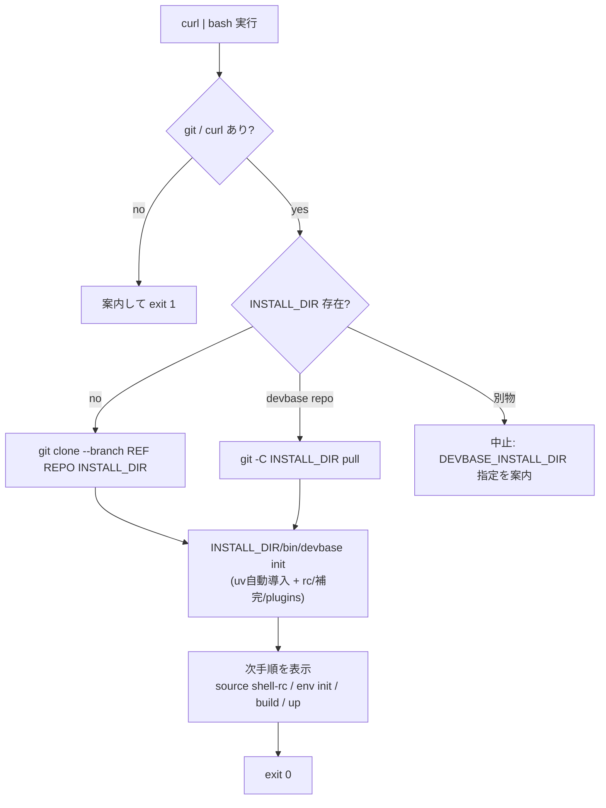

# PLAN31_1: devbase ワンライナー installer (`curl | bash`)

> 元 issue: `issues/old/i31.md` 第1項
> ステータス: 着手可（設計確定 2026-06-09・既存コード精読済み）
> 関連 skill: `/ndf:issue-plan-strategy`, `/ndf:implementation-plan`

## 1. 背景と目的

現状の導入は手動多段階（`docs/user/getting-started.md` の手順 1〜9）。ゴールは
Claude CLI の `curl -fsSL https://claude.ai/install.sh | bash` 相当で
**`devbase init` 相当まで自動完了**させること。env init は対話必須のため案内のみ。

```text
curl -fsSL https://raw.githubusercontent.com/devbasex/devbase/main/install.sh | bash
```

## 2. 確定した設計判断（2026-06-09 ユーザー確認済み）

| 項目 | 決定 |
|---|---|
| 配置先 (DEVBASE_ROOT) | **`~/devbase`** に clone（`DEVBASE_INSTALL_DIR` で上書き可） |
| env init の扱い | install では実行せず、完了後に手順を案内 |
| TUI 範囲 | 本 plan 対象外（→ `PLAN31_2`） |

## 3. 既存コード調査結果（installer 実装の前提）

| 事実 | 出典 | installer への含意 |
|---|---|---|
| `bin/devbase` は `BASH_SOURCE` から symlink 解決して **DEVBASE_ROOT を自己解決** | `bin/devbase:6-13` | clone 後に `~/devbase/bin/devbase` を呼ぶだけで DEVBASE_ROOT は自動確定。env 設定不要 |
| `ensure_uv()` が **uv を自動導入** (`astral.sh/uv/install.sh`) し `~/.local/bin` を PATH 追加 | `bin/devbase:180-191` | installer 側で uv を入れる必要なし。`run_python` は `uv run --project "$DEVBASE_ROOT"` (`bin/devbase:194-197`) |
| `init` は Python 実装で wrapper 経由実行 (`run_python init`) | `bin/devbase:358-359` | installer は `bin/devbase init` を 1 回呼ぶだけ |
| `cmd_init` は rc 追記に **marker `# devbase` + check_string `export DEVBASE_ROOT=`** で冪等 | `init.py:298-306` | 再実行しても二重追記しない。installer の冪等性は init に委譲できる |
| 補完登録も **marker `# devbase completion`** で冪等、zsh/bash 自動判定 | `init.py:215-247`, `237-242` | 同上 |
| `_setup_plugins_config` が `~/.devbase/config.yml` / `plugins/` / `projects/` / `plugins.yml` を作成。official repo 取得は**ネットワーク失敗時に空構造へ graceful fallback** | `init.py:84-134` | オフライン/失敗でも init は成功する。installer はネットワーク前提にしなくてよい |
| 旧 rc ブロック (`DEVBASE_PARENT_ROOT` 等) は **自動マイグレーション** | `init.py:138-212` | 旧版からの移行も init 任せ |
| `pyproject.toml` は `package = false`・deps=pyyaml/pyrage/boto3/questionary・`requires-python>=3.10`・`uv.lock` 同梱 | `pyproject.toml` | PyPI 配布なし。clone 必須。deps は `uv run --project` が解決 |
| 前提ソフト: Docker/Compose/Bash4+/Python3.10+/Git（uv 以外） | `getting-started.md:11-16` | installer は git/curl を必須チェック、docker は利用時に必要な旨を案内 |

**結論**: installer の本質は `clone（または pull）→ ~/devbase/bin/devbase init` の 2 手。
uv 導入・rc 追記・補完・plugins.yml・冪等性・旧版移行はすべて既存資産が担う。

## 4. 要件

### 4.1 機能要件

- `install.sh` をリポジトリ root に置き、`raw.githubusercontent.com/devbasex/devbase/main/install.sh` で配布する。
- 前提チェック: `git` / `curl` の存在。無ければ案内して `exit 1`。`docker` は警告のみ（install は通す）。
- 配置先解決: `INSTALL_DIR="${DEVBASE_INSTALL_DIR:-$HOME/devbase}"`。
- clone 元: `REPO="${DEVBASE_INSTALL_REPO:-https://github.com/devbasex/devbase.git}"`（fork/テスト用に上書き可）。
- バージョン: `REF="${DEVBASE_INSTALL_REF:-main}"`（branch/tag）。
- 既存 `INSTALL_DIR` の扱い:
  - `$INSTALL_DIR/bin/devbase` が存在し devbase git repo → `git -C "$INSTALL_DIR" pull`（更新）。
  - 存在するが devbase でない → **中止**して別ディレクトリ指定を案内（誤上書き防止）。
  - 無し → `git clone --branch "$REF" "$REPO" "$INSTALL_DIR"`。
- `"$INSTALL_DIR/bin/devbase" init` を実行（uv 自動導入＋rc/補完/plugins 初期化）。
- 完了メッセージ（実パス埋め込み）:
  `source "$("$INSTALL_DIR/bin/devbase" shell-rc)"` → `devbase plugin install <name>`
  → `cd "$INSTALL_DIR/projects/<x>"` → `devbase env init` → `build` → `up` → `login`。

### 4.2 非機能要件

- **非 TTY 安全**: `curl | bash` では stdin がスクリプト本体。対話プロンプトを出さない
  （確認が要る分岐は env 既定値で回避、どうしても要るなら `< /dev/tty`）。
- `#!/usr/bin/env bash` + `set -euo pipefail`。失敗時に途中状態を残さない。
- shellcheck 通過を CI 条件に含める。
- 配置先 / clone 元 / REF はサニタイズ（任意コマンド混入防止。特に `REF`）。

## 5. インストールフロー



## 6. PR 分割計画

installer 本体（スクリプト + テスト）とドキュメントで関心が分かれるため 2 PR。
PR1 が小さく収束すれば PR2 を畳む判断も可（着手時に再評価）。

| PR # | branch 名 | 概要 | 主な変更ファイル | 依存 |
|---|---|---|---|---|
| 1 | `feature/PLAN31_1-install-script` | `install.sh`（前提チェック / 配置先・REF 解決 / clone・pull / 既存判定 / `bin/devbase init` 起動 / 完了案内 / 冪等）+ サンドボックステスト + shellcheck CI | `install.sh`（新規）, `tests/test_install_sh.py`（新規）, `.github/workflows/*` | なし |
| 2 | `feature/PLAN31_1-docs` | README/getting-started のワンライナー化・`DEVBASE_INSTALL_DIR`/`_REF`/`_REPO` 説明・CHANGELOG | `README.md`, `docs/user/getting-started.md`, `CHANGELOG.md` | PR1 |

```text
release branch: release/PLAN31_1
base branch: main
```

## 7. テスト計画

- **PR1（ネットワーク非依存）**: `DEVBASE_INSTALL_REPO` をローカル bare repo
  (`git init --bare` + 雛形 push) に向け、一時 `HOME` / 一時 `DEVBASE_INSTALL_DIR`
  で `install.sh` を実行し以下を検証:
  1. 新規 clone → `$INSTALL_DIR/bin/devbase` が存在し実行可能。
  2. 2 回目実行で pull 経路に入り **冪等**（rc に `# devbase` ブロックが 1 つだけ）。
  3. 既存の非 devbase ディレクトリ指定で **中止**（exit 非0・上書きしない）。
  4. `git` 不在を `PATH` 細工で再現しエラー終了。
  - `bin/devbase init` 呼び出しは uv/network を伴うため、テストでは `init` をスタブ
    （`PATH` 先頭に偽 `devbase` を置く / `--dry-run` 相当の env で skip）して
    スクリプトの分岐ロジックのみを検証する方針。
- **結合（release）**: 実 `~/devbase` 相当へ通し、`init` 後に
  `source "$(bin/devbase shell-rc)"` → `devbase --help` が PATH 経由で解決すること、
  および 2 回目 install が冪等であることを確認。

## 8. 留意点 / 未決事項

- `install.sh` の正規ホスティング（raw main 固定 か releases 資産化）はドキュメントで最終確定。
- `bin/devbase init` はテストでスタブするため、installer 単体テストは「init を正しい
  引数・CWD で 1 回呼ぶ」ことの検証に留める（init 自体の挙動は既存テストの責務）。
- `curl | bash` 警告として「実行前にスクリプトを確認する」代替手順
  （`curl -fsSL … -o install.sh` → 確認 → `bash install.sh`）を README に併記。
