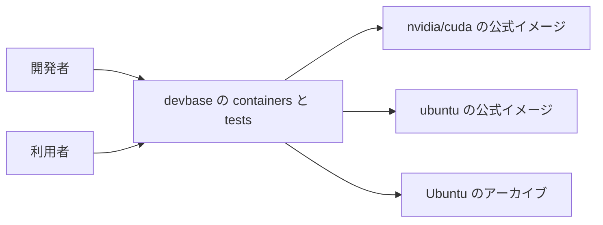
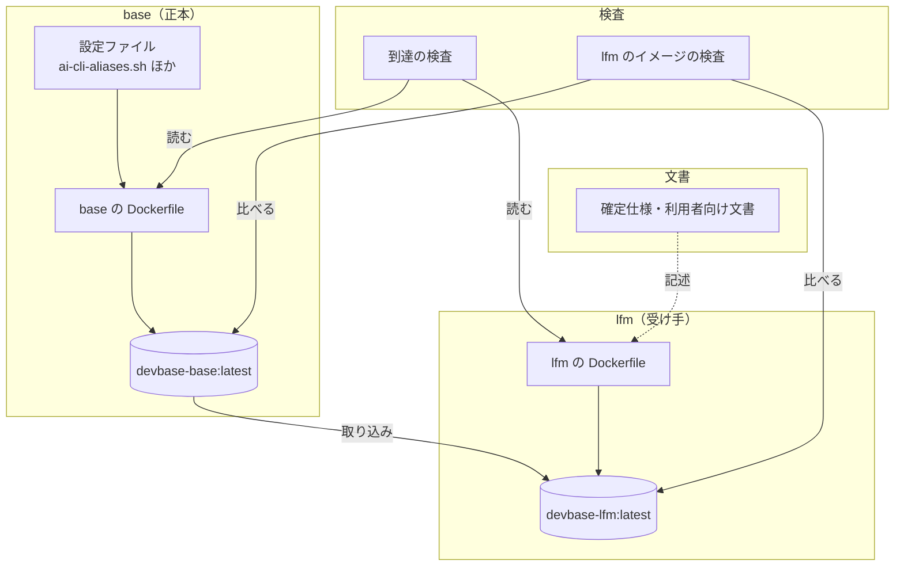
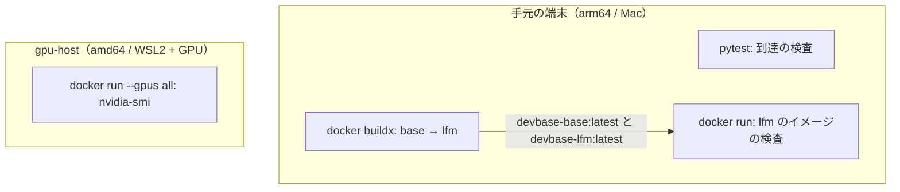
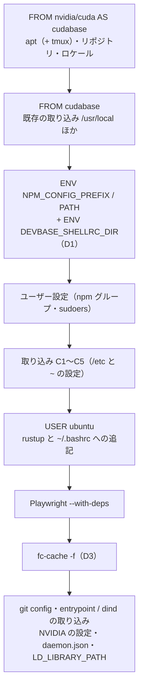
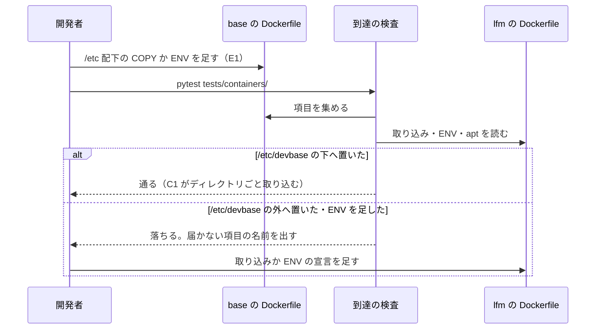
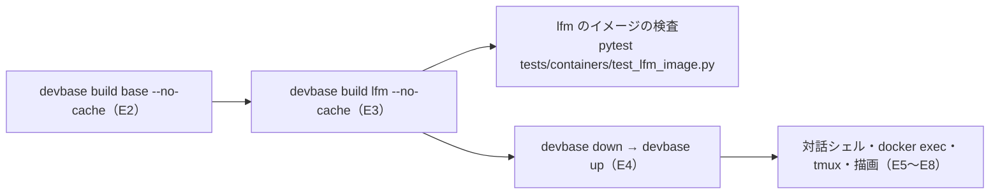

# #275: lfm へ base の設定を取り込みで届け、届かない設定を静的検査で止める

要求と受け入れ条件は #275 の本文にある（コピーは `issues/issue-275-requirements.md`）。この文書は「どう作るか」だけを扱う。
S1〜S8・E1〜E8・AC1〜AC20 の番号は要求の番号を指す。

## ドメインモデル

### コンテキスト

| コンテキスト | 何の語が 1 つの意味に決まるか |
| --- | --- |
| イメージの継承（`image-lineage`） | base の設定、届く経路、取り込み、到達の検査、除外表 |

1 つのコンテキストで閉じる。`docker context`（`docker-context`）の語は使わない。

### 集約

| 集約 | 持ち主（書き換えてよいもの） | 根 | エンティティ | 値オブジェクト |
| --- | --- | --- | --- | --- |
| base の設定 | `containers/base/Dockerfile` と、そこから `COPY` される `containers/base/` の設定ファイル | base のイメージ | 設定 1 件（S1〜S7） | 置き場所のパス・`ENV` の名前と値・apt のパッケージ名 |
| lfm の取り込み | `containers/lfm/Dockerfile` | lfm のイメージ | 取り込み 1 行（`COPY --from=devbase-base:latest`）・`ENV` の宣言 1 行 | 取り込み元のパス・宣言した値 |
| 到達の検査 | `tests/containers/test_lfm_base_settings.py` | 検査の結果（届かない設定の名前の一覧） | — | 除外表の 1 行（名前と理由） |

**base の設定の中身を書き換えてよいのは base だけである。** lfm は base のファイルを取り込むか、
取り込めない `ENV` を同じ値で宣言するだけで、中身を自分で書かない。到達の検査は 2 つの Dockerfile を
読むだけで、どちらも書き換えない。

### 不変条件

| # | 集約 | 条件 | 破れたときの扱い |
| --- | --- | --- | --- |
| I1 | lfm の取り込み | base が build context から置くファイルは、すべて lfm の取り込みのどれかに覆われる（同じパスへ置かれる）か、除外表にある | 到達の検査が失敗し、覆われないパスを出す |
| I2 | lfm の取り込み | base の `RUN` が書く利用者のファイル（`~/.bashrc`・`~/.claude/settings.json`）は、lfm の取り込みに覆われる | 到達の検査が失敗し、覆われないファイルを出す |
| I3 | lfm の取り込み | base の `ENV`（`PATH` を除く）は、lfm に同じ名前・同じ値で宣言されているか、除外表にある | 到達の検査が失敗し、`ENV` の名前を出す |
| I4 | lfm の取り込み | base の `PATH` の各要素は、lfm の `PATH` に含まれるか、除外表にある | 到達の検査が失敗し、要素を出す |
| I5 | lfm の取り込み | base の設定が動くのに要る apt のパッケージ（`tmux`）は、lfm の apt の一覧にある | 到達の検査が失敗し、パッケージ名を出す |
| I6 | lfm の取り込み | lfm は AI CLI の起動定義を自分で書かない（`~/.bashrc` へ `alias` を書き出す行が無い） | 到達の検査が失敗する |
| I7 | lfm の取り込み | `~/.bashrc` の取り込みは、lfm で `~/.bashrc` へ追記する最初の `RUN`（rustup とその後の追記）より前にある | 到達の検査が失敗する（後にあると lfm の追記が消える） |
| I8 | lfm の取り込み | `fc-cache -f` は lfm で 1 度だけ、`/etc/fonts/local.conf` の取り込みと、書体を入れる最後の `RUN`（Playwright の `--with-deps`）より後にある | 到達の検査が失敗する |
| I9 | lfm の取り込み | lfm は `/etc` と `/home/ubuntu` をまるごと取り込まない。取り込むのは base の設定の置き場所だけである | 到達の検査が失敗する（CUDA のイメージの `/etc` が base のものに置き換わる） |
| I10 | 到達の検査 | 除外表の各行は、実際に base の Dockerfile から集めた項目を指す | 到達の検査が失敗し、使われない行を出す（除外が古いまま残らない） |

### ドメインイベント

| # | イベント | 発生元 | 受け手 |
| --- | --- | --- | --- |
| E1 | base に設定を足した | 開発者（`containers/base/Dockerfile`） | 到達の検査（`pytest tests/containers/`） |
| E2 | base のイメージを建てた | `devbase build base` | lfm のビルド（取り込み元） |
| E3 | lfm のイメージを建てた | `devbase build lfm` / lfm を使うプロジェクトのビルド | lfm のコンテナの起動 |
| E4 | lfm のコンテナを起動した | `devbase up`（`entrypoint.sh`） | 対話シェル（`~/.shellrc.d` の symlink） |
| E5 | lfm の対話シェルが設定を読んだ | `~/.bashrc`（base から取り込んだもの） | 起動定義・読み込み器 |
| E6 | 非対話の処理が読み込み先を見つけた | lfm の `ENV DEVBASE_SHELLRC_DIR` | Claude Code の Bash などの `docker exec` |
| E7 | lfm で tmux のセッションを扱った | 利用者（`tmux-session` / prefix S） | `tmux` 本体と `/etc/tmux.conf` |
| E8 | lfm で日本語を描いた | Playwright・Chromium・PDF の生成 | fontconfig（`/etc/fonts/local.conf` と lfm のキャッシュ） |

### 用語

| 用語 | 意味 | 用語集への反映 |
| --- | --- | --- |
| 届く経路 | base の設定が lfm のイメージへ入る道筋。lfm の Dockerfile の取り込みと、取り込めない `ENV` を同じ値で宣言すること | 意味の変更（`image-lineage`） |
| 取り込み | lfm の Dockerfile が `COPY --from=devbase-base:latest` で base のイメージからファイルやディレクトリを同じパスへ持ち込むこと | 追加（`image-lineage`） |
| 到達の検査 | base の Dockerfile から base の設定を集め、それぞれが lfm へ届くかを Docker を起動せずに判定するテスト | 追加（`image-lineage`） |
| 除外表 | 到達の検査が、lfm へ届かなくてよいとする base の項目と、その理由の一覧 | 追加（`image-lineage`） |

## 機能一覧

| # | 機能 | 誰が使うか |
| --- | --- | --- |
| F1 | lfm の対話シェルで、base と同じ AI CLI の起動定義が効く（S1） | lfm のコンテナの利用者 |
| F2 | lfm の対話シェルが `~/.shellrc.d` を起動定義の後に読み、非対話の処理も置き場所を見つける（S2・S3） | lfm のコンテナの利用者と、その中で動く AI CLI |
| F3 | lfm で tmux とセッションの整理コマンドと prefix S のメニューが動く（S4・S5） | lfm のコンテナの利用者 |
| F4 | lfm で日本語が日本語のフェイスで描かれる（S6） | lfm で Playwright・Chromium・PDF を使う利用者 |
| F5 | lfm の Claude Code が SessionStart で `AWS_REGION` を外す（S7） | lfm で `claudb` を使う利用者 |
| F6 | base に設定を足したとき、lfm へ届かない形なら `pytest` が名前を挙げて落ちる | base を変える開発者 |

## 構成要素

| 要素 | 責務 |
| --- | --- |
| lfm の Dockerfile（変える） | base の設定を取り込みで持ち込み、取り込めない `ENV` を宣言し、`tmux` を apt で入れ、最後に `fc-cache -f` を走らせる。直書きの起動定義を消す。CUDA・Rust・gfortran・MeCab・NVIDIA の設定は変えない |
| base の Dockerfile（コメントだけ変える） | base の設定の各置き場所に「lfm は取り込みで受け取る。取り込みに覆われない場所へ足すと到達の検査が落ちる」ことを書く。命令は変えない |
| 到達の検査（新設） | 2 つの Dockerfile の文字列から I1〜I10 を判定し、届かない項目の名前の一覧を返す関数群と、それを実物と写しへ当てるテスト |
| lfm のイメージの検査（新設） | 建てた lfm と base のイメージを `docker run` で比べる。イメージが無ければ skip する（AC1〜AC10・AC13〜AC15） |
| 確定仕様の lfm の記述（変える） | `tmux-named-session.md`・`shellrc-dir.md`・`base-image-rendering.md`・`base-image-shellcheck.md` の lfm の行を、取り込みで届く／届かない（apt の道具）の実際へ合わせる |
| 利用者向け文書の lfm の記述（変える） | `docs/user/container-operations.md` の 442 行（shellcheck）と 550 行（シェルの設定の読み込み）のうち、この変更で事実と食い違う文 |

### 文脈



外部の系は、変えられない 3 つ（CUDA のイメージ、Ubuntu のイメージ、apt のアーカイブ）だけである。

### 構成要素図



### 配置



`nvidia/cuda:13.3.1-cudnn-devel-ubuntu26.04` は arm64 と amd64 の両方を配っている（2026-09-28 に
レジストリの manifest list で確かめた。`linux/arm64` と `linux/amd64` の 2 つ）。建てて確かめるのは
手元の arm64 で足り、gpu-host が要るのは AC18 だけである。

### 置き場所

```text
containers/
├── base/Dockerfile                    # コメントだけ変える
└── lfm/Dockerfile                     # 変える
tests/containers/
├── test_lfm_base_settings.py          # 新設: 到達の検査（Docker 不要）
└── test_lfm_image.py                  # 新設: lfm のイメージの検査（イメージが無ければ skip）
docs/specifications/
├── tmux-named-session.md              # lfm の行を直す
├── shellrc-dir.md                     # 同上
├── base-image-rendering.md            # 同上
└── base-image-shellcheck.md           # 同上
docs/user/container-operations.md      # lfm の 2 行を直す
docs/glossary/glossary.json            # 用語 3 つを足し、1 つの意味を変える
```

## lfm の Dockerfile の変更

### 取り込むもの

| # | 取り込み | 所有者 | 当たる設定 |
| --- | --- | --- | --- |
| C1 | `/etc/devbase`（ディレクトリごと） | root（base のまま） | S1・S2 |
| C2 | `/etc/tmux.conf` | root | S4 |
| C3 | `/etc/fonts/local.conf` | root | S6 |
| C4 | `/home/ubuntu/.bashrc` | ubuntu | S1・S2 の読み込みの行と S8 |
| C5 | `/home/ubuntu/.claude/settings.json` | ubuntu（`~/.claude` も ubuntu） | S7 |

既にある取り込み（`/usr/local`・`/usr/bin/gh`・`/usr/bin/node`・`/usr/lib/node_modules`・`/opt`・
`/home/ubuntu/.local`・`/entrypoint.sh`・`/usr/local/bin/dind`）は変えない。`/usr/local/bin/tmux-*` と
その短縮名の symlink は `/usr/local` の取り込みで届いている。

### 宣言するもの・入れるもの

| # | 変更 | 当たる設定 |
| --- | --- | --- |
| D1 | `ENV DEVBASE_SHELLRC_DIR=/home/ubuntu/.shellrc.d` を足す | S3 |
| D2 | apt の一覧へ `tmux` を足す | S5 |
| D3 | Playwright の `RUN` の後に `RUN sudo fc-cache -f` を 1 つ足す | S6 |
| D4 | AI CLI の起動定義を `~/.bashrc` へ直書きしている `RUN`（139〜143 行）とそのコメントを消す | S1（AC3） |
| D5 | 「lfm doesn't inherit from devbase-base」のコメントを、取り込みで受け取る旨へ直す | — |

`git config --global credential.helper store` の `RUN` は lfm に残す。`~/.gitconfig` は base の設定の
一覧に無く、取り込みの対象を広げない。

### 命令の並び



**C4 を rustup より前に置く**（I7）。rustup の導入は `~/.bashrc` へ `. "$HOME/.cargo/env"` を足し、
lfm も `source $HOME/.cargo/env` を足す。取り込みを後に置くと、この 2 行が base の `~/.bashrc` で
上書きされて消える。C1〜C5 はユーザー設定（`groupadd` / `usermod`）の後にまとめて置き、root の
区間の中で所有者を決めて置く。

**C5 の前に `install -d -o ubuntu -g ubuntu /home/ubuntu/.claude` を root の区間で置く**。lfm には
`~/.claude` が無く、ファイル 1 つの `COPY --from` は足りない親ディレクトリを root:root で作る。
親が root の持ち物だと、entrypoint（USER ubuntu・`set -e`）の `devbase_link_setting` が
`~/.claude` をグループのボリュームへのリンクに差し替える `rm -rf` が Permission denied で止まり、
`devbase up` のコンテナが起動しない。C5 自体にも `--chown=ubuntu:ubuntu` を付ける。

**D3 を Playwright の後に置く**（I8）。`--with-deps` が `fonts-wqy-zenhei` などを入れた後でなければ、
後から入った書体を知らないキャッシュが残る。base の決定（`base-image-rendering.md` の決定 5）と
同じ理由である。

## 到達の検査

### 集める項目と、届いたとみなす形

到達の検査は base の Dockerfile から次の 5 種類の項目を集め、それぞれを lfm の Dockerfile と照らす。
命令は行の継続（`\`）をつないでから読む。

| 種類 | base から集めるもの | 届いたとみなす lfm の形 | 不変条件 |
| --- | --- | --- | --- |
| 置くファイル | `--from` の無い `COPY` の宛先のパス | 取り込みの元のパスが、宛先と同じか、宛先の上位のディレクトリ（宛先も同じパス） | I1 |
| 書く利用者のファイル | `RUN` の中の `> ~/…` と `>> ~/…` の書き出し先（`~` は `/home/ubuntu`） | 同上 | I2 |
| `ENV` | `PATH` 以外の `ENV` の名前と値（`${USERNAME}` などは直前の `ARG` の既定値で展開） | lfm の `ENV` に同じ名前・同じ値がある | I3 |
| `PATH` の要素 | `ENV PATH` の各要素（`${PATH}` を除く） | lfm の `ENV PATH` のどれかに同じ要素がある | I4 |
| 要る apt のパッケージ | 到達の検査が持つ表（`tmux`: `/usr/local/bin/tmux-*` と `/etc/tmux.conf` が使う） | lfm の `apt-get install` の一覧にある | I5 |

base の `RUN` が作る symlink（`/usr/local/bin/tmux1` など）は `/usr/local` の取り込みに入るため、
項目として集めない。

### 除外表

実物の 2 つの Dockerfile に当てたとき、除外が要る項目は 1 つだけである。

| 項目 | 理由 |
| --- | --- |
| `PATH` の要素 `/root/.local/bin` | base で root の uv が入る場所。lfm は `/root` を取り込まず、ubuntu の `~/.local/bin` を `PATH` に持つ |

`DEBIAN_FRONTEND` と `NPM_CONFIG_PREFIX` は lfm に同じ値で既にあるため除外表に載せない。

### 判定の形

判定する関数は Dockerfile の文字列を 2 つ受け取り、届かない項目の名前の一覧を返す。実物のファイルを
読む処理とは分ける。AC11 は base の写しの文字列へ 1 行を足して同じ関数へ渡す。失敗のメッセージには
項目の種類と名前（`ENV DEVBASE_X`、`/etc/foo.conf` など）を 1 行ずつ出す。

I6〜I9 は項目の照合ではなく lfm の Dockerfile の形の検査であり、同じモジュールの別のテストにする。

## lfm のイメージの検査

建てた `devbase-lfm:latest` と `devbase-base:latest` を比べる。`test_base_image_font_matching.py` と
同じく、**Docker が無い・どちらかのイメージが無い・lfm のイメージがこの変更より前のもの
（`/etc/devbase/shellrc-dir.sh` が無い）ときは skip する。** 古いイメージを持つ人の `pytest tests/` が
全員赤くなるのを避ける。`docker run` の回数はイメージごとに抑える（プローブを 1 回にまとめる）。

GPU を使う AC18 は、このモジュールに入れない。`--gpus all` が通る端末が gpu-host に限られ、
手元では常に skip になる。手順は Pull Request のテスト計画に書く。

## 処理の流れ

### 設定を足す開発者から見た流れ



### 反映の流れ



確定仕様と利用者向け文書の変更は実行の流れに現れないため、この 2 つの図に描かない。

lfm のビルドは base を取り込み元にするため、base が無ければ建たない。これは変更前と同じである
（既存の取り込みも `devbase-base:latest` を要する）。lfm のプロジェクトの通常の `devbase build` が
base を建て直さないことは #319 に分けた。

## 非機能の実現方式

| 大項目 | 要求の条件 | 実現方式 | 確かめ方 |
| --- | --- | --- | --- |
| 運用・保守性 | base の設定を足す開発者が、lfm へ届けるための手作業を覚えていなくてよい（AC11）。lfm へ届ける経路と、届かない物を足すときの手順が、確定仕様の 1 か所に書かれている | 到達の検査が `pytest tests/containers/` に入り、届かない項目を名前で出す。`/etc/devbase` の下へ置く設定は手作業なしで届く。経路と手順は、完了後に `plan-to-spec` がこの設計から作る確定仕様 1 本（`docs/specifications/lfm-base-settings.md`）に置き、他の 4 本の仕様はそこを指す | AC11・AC12 のテスト。4 本の仕様の lfm の行が新しい仕様を指していることを差分で読む |
| 移行性 | 反映は `devbase build base --no-cache` → lfm の建て直し → `devbase down` / `devbase up` で行う。切り戻しはコミットの revert と 2 つのイメージの建て直しで足りる | base の命令は変えないため base の建て直しは中身を変えない。lfm の変更は Dockerfile 1 本に閉じ、データ（グループのボリュームの `.shellrc.d/`）には書かない | revert した lfm の Dockerfile で建て、AC14 の 2 ファイルと `~/.bashrc` が変更前に戻ることを見る |
| 性能・拡張性 | lfm のイメージの大きさの増加が、変更前の lfm に対して 300MB 以内 | 足すのは `tmux`（と依存の `libevent` など）と数 KB の設定ファイルとフォントのキャッシュだけで、base の apt の道具は取り込まない | 変更前と変更後の lfm で `docker image inspect -f '{{.Size}}'` を比べる |
| システム環境 | `nvidia/cuda:13.3.1-cudnn-devel-ubuntu26.04` の上で、base と同じ Ubuntu 26.04 / glibc 2.43 のまま建つ | `FROM` は変えない。取り込むのは設定ファイルだけで、バイナリを足さない（`tmux` は lfm の apt が入れる） | lfm の中の `ldd --version` と `/etc/os-release` |

## 決定の記録

### 決定 1: 「統合」を採り、lfm は `FROM nvidia/cuda` のまま base の設定を取り込む

「向きの修正」は base の `FROM` を `ARG` にして CUDA 版の base を建てる形だが、devbase のビルドは
build-arg を渡す口を持たない。`bin/devbase` の `build_base_image` と `_build_single_image` はどちらも
`docker buildx build -t devbase-<名前> containers/<名前>` だけを打ち、`FROM devbase-<名前>` は
`containers/<名前>` のディレクトリへ対応づけられる。CUDA 版の base を建てるには、この対応づけか
build-arg の受け渡しを変えることになり、要求が対象外にした「`devbase build` のビルド順の仕組みの
変更」に当たる。加えて、CUDA 版の base は base の apt の道具（`shellcheck`・`poppler-utils`・
Chromium など）も lfm へ入れ、前提 2 が対象外にしたものまで届ける。統合なら lfm の Dockerfile 1 本と
テストで閉じる。

### 決定 2: `/etc/devbase` はディレクトリごと、ほかの `/etc` の設定はファイルごとに取り込む

`/etc/devbase` は devbase だけが持つディレクトリで、ディレクトリごと取り込めば、base がその下へ
足したファイルは lfm を変えずに届く（AC11 の「届く形」）。`/etc` をまるごと取り込むことはしない。
CUDA のイメージの `/etc`（apt のリポジトリ、`ld.so.conf.d` の CUDA のライブラリの場所、利用者の定義）が
base のものに置き換わり、lfm が壊れる（I9）。`/etc/tmux.conf` と `/etc/fonts/local.conf` は
`/etc/fonts` などの共有のディレクトリにあるため、ファイルごとにする。

### 決定 3: `~/.bashrc` と `~/.claude/settings.json` は base のファイルを取り込み、lfm はその後に追記する

base の `~/.bashrc` は起動定義と読み込み器の読み込みの行を持ち、この 2 行の順序（起動定義の後に
読み込み器）が AC6 の条件である。lfm で同じ行を書くと、base の行を変えたときに lfm が古いまま残る。
これが #261 の原因そのものである。取り込めば行も順序も base と同じになる。lfm の追記（Rust）は
取り込みの後で行う（I7）。`~/.claude` をディレクトリごと取り込まないのは、base の Claude Code の
導入が `~/.claude` に置くものを lfm の設定として受け取る理由が無いためである。

### 決定 4: `ENV` は lfm に同じ値で宣言し、一致を到達の検査で縛る

`ENV` はイメージのメタデータで、`COPY --from` では運べない。lfm に宣言を書くことは避けられないため、
覚えていなくてよい形を検査で作る。base に `ENV` を足すと到達の検査が名前を挙げて落ち、開発者は
lfm に同じ行を足す。`PATH` は lfm が cargo と `~/.local/bin` を足すため値の一致では比べられず、
要素ごとに比べる。

### 決定 5: `tmux` は取り込まず、lfm の apt で入れる

`/usr/bin/tmux` を取り込むと、`libevent` などの共有ライブラリも一緒に取り込む必要があり、どれが
要るかを lfm 側で持つことになる。apt なら依存が解決され、版も同じ Ubuntu 26.04 のアーカイブの
ものになる。base の apt の道具のうち `tmux` だけを要る apt のパッケージにするのは、`tmux` が
base の設定（S4 と `/usr/local/bin/tmux-*`）を動かす本体だからである（前提 2）。

### 決定 6: 到達の検査は base の Dockerfile から項目を集め、固定の一覧を持たない

S1〜S7 を固定の一覧にすると、base に 8 つ目の設定を足したとき一覧に載らず、検査が黙って通る。
base の Dockerfile から命令の形で集めれば、足した行がそのまま検査の対象になる。例外は除外表に
理由とともに置き、使われない除外は落とす（I10）。要る apt のパッケージだけは Dockerfile の命令から
導けないため表で持つ。

### 決定 7: lfm の `fonts-noto-cjk` の導入と Playwright の導入は残す

base のフォントは `/usr/share/fonts` にあり、取り込みの対象ではない。lfm が自前で入れる
`fonts-noto-cjk` が無いと、`/etc/fonts/local.conf` が指す `Noto Sans CJK JP` が lfm に無い。
Playwright の導入は lfm がブラウザを `~/.cache` に残す唯一の場所で（base はブラウザを捨てる。#220）、
前提 4 と同じく lfm の固有の中身として変えない。

## テスト設計

### 到達の検査（`test_lfm_base_settings.py`、Docker 不要）

| 受け入れ条件・不変条件 | どの振る舞いで縛るか | どう壊したら落ちるべきか |
| --- | --- | --- |
| AC12・I1〜I5 | 実物の 2 つの Dockerfile に当てると、届かない項目の一覧が空になる | lfm から C1〜C5・D1・D2 のどれか 1 つを消すと、その項目の名前が出て落ちる |
| AC11 | base の写しへ `/etc/devbase/` の下に置く `COPY` を 1 行足しても、lfm を変えずに一覧が空のまま | C1 をファイルごとの取り込みへ変えると、足したパスが出て落ちる |
| AC11 | base の写しへ `ENV` を 1 行足すと、その名前が一覧に出る | 判定が `ENV` を集めないように壊すと、一覧が空のまま通って落ちる |
| AC11 | base の写しへ `/etc/devbase` の外（`/etc/foo.conf` など）に置く `COPY` を足すと、そのパスが一覧に出る | 取り込みの覆いを上位のディレクトリ `/etc` でも通すように壊すと落ちる |
| I3 | `${USERNAME}` を含む base の `ENV` の値が `ARG` の既定値で展開されて比べられる | 展開しないと `DEVBASE_SHELLRC_DIR` が不一致で落ちる |
| I4 | base の `PATH` の要素のうち `/root/.local/bin` だけが除外され、他の要素は lfm の `PATH` にある | lfm の `ENV PATH` から `/opt/google-cloud-sdk/bin` を消すと落ちる |
| I6・AC3 | lfm の Dockerfile に `~/.bashrc` へ `alias` を書き出す行が無い | D4 を戻すと落ちる |
| I7 | `~/.bashrc` の取り込みが rustup の `RUN` より前にある | 取り込みを rustup の後へ動かすと落ちる |
| I8 | `fc-cache -f` が 1 度だけで、`/etc/fonts/local.conf` の取り込みと Playwright の `RUN` より後にある | `fc-cache` を Playwright の前へ動かすか、2 つにすると落ちる |
| I9 | lfm の取り込みの元に `/etc` と `/home/ubuntu` そのものが無い | `COPY --from=devbase-base:latest /etc /etc` を足すと落ちる |
| I10 | 除外表の各行が、実物の base から集めた項目に当たる | base に無い項目を除外表へ足すと落ちる |

### lfm のイメージの検査（`test_lfm_image.py`、イメージが無ければ skip）

| 受け入れ条件 | どの振る舞いで縛るか | どう壊したら落ちるべきか |
| --- | --- | --- |
| AC1 | lfm と base の `/etc/devbase/ai-cli-aliases.sh`・`shellrc-dir.sh` のハッシュが一致する | lfm の Dockerfile で片方を別の中身で上書きすると落ちる |
| AC2 | 対話シェルの 6 つの alias の定義が base と一致し、`claudb` に `ANTHROPIC_MODEL` が無い | D4 を戻すと落ちる |
| AC3 | lfm の `~/.bashrc` に起動定義を直書きした `alias` の行が無い | 同上 |
| AC4 | 非対話の `bash -c` で `DEVBASE_SHELLRC_DIR` が `/home/ubuntu/.shellrc.d` になる | D1 を消すと落ちる |
| AC5 | `~/.shellrc.d/a.sh` の alias が対話シェルで効く | C4 を消すと落ちる |
| AC6 | `a.sh` の `alias claude` が起動定義の定義に勝つ | base の `~/.bashrc` の 2 行の順序が逆の写しを取り込むと落ちる |
| AC7 | `command -v tmux` が通り、`/etc/tmux.conf` のハッシュが base と一致する | D2 か C2 を消すと落ちる |
| AC8 | 隔離した tmux サーバで `tmux-session` の一覧が 0 で終わり、`list-keys` に prefix S の割り当てがある | C2 を消すと落ちる |
| AC9 | `fc-match` の 3 つの指定と `-s sans-serif:lang=ja` の 1 件目が `Noto Sans CJK JP` | C3 か D3 を消すと落ちる |
| AC10 | lfm の `~/.claude/settings.json` の SessionStart フックが base と同じ | C5 を消すと落ちる |
| AC10 | `stat -c %U ~/.claude` と `stat -c %U ~/.claude/settings.json` が `ubuntu` | C5 の前の `install -d` を消すと落ちる |
| AC13 | 10 個の道具の版の表示が 0 で終わる | lfm の固有の `RUN` を消すと落ちる |
| AC14 | `/etc/nvidia-container-runtime/config.toml` と `/etc/docker/daemon.json` のハッシュが、変更前に測った値と一致する | 取り込みで `/etc/docker` を上書きすると落ちる |
| AC15 | ubuntu が `sudo` なしで `npm i -g` できる（`npm` グループの GID が base と同じ） | `groupadd -g "$NPM_GID"` を消すと落ちる |

### テストの外で確かめるもの

| 受け入れ条件 | 確かめ方 |
| --- | --- |
| AC16 | `pytest tests/containers/`（既存のテストが通る）と、base の Dockerfile の差分がコメントだけであること |
| AC17 | `general` を Dockerfile を変えずに建てる |
| AC18 | gpu-host で `--gpus all` を付けた lfm のコンテナの `nvidia-smi`。使えなければリリース後テストへ回し、Pull Request に書く |
| AC19 | `grep -n lfm docs/specifications/*.md` の各行を、建てた lfm のイメージの状態と照らす |
| AC20 | 変更前の lfm を建て、#243 の確かめ方で `fc-match` を測って Pull Request に残す。同じイメージで AC14 のハッシュと大きさも測る |

## 未確認のまま残ること

| 項目 | 内容 |
| --- | --- |
| 変更前の lfm のイメージ | 手元に `devbase-lfm` が無く、変更前の `fc-match`・AC14 のハッシュ・大きさは未測定である。実装の最初のタスクで建てて測る（AC20） |
| amd64 での `fc-match` | amd64 の lfm は `google-chrome-stable` を入れるため、`--with-deps` が入れる書体の顔ぶれが違いうる。gpu-host で建てるまで分からない |
| `COPY --from` の所有者 | 取り込みは所有者の数値を保つ前提で既存の取り込みが組まれている。C4 が ubuntu の所有になるかは建てて確かめる。ならなければ `--chown` を付ける。C5 は親の `~/.claude` ごと先に決めて置く（命令の並び）ため、ここに残らない |
| rustup の `~/.bashrc` への追記 | rustup が `~/.bashrc` へ追記するかは導入時の判定に依る。I7 はどちらでも lfm の追記を守る |
| GPU の実行（AC18） | gpu-host を使える時期に依る |
